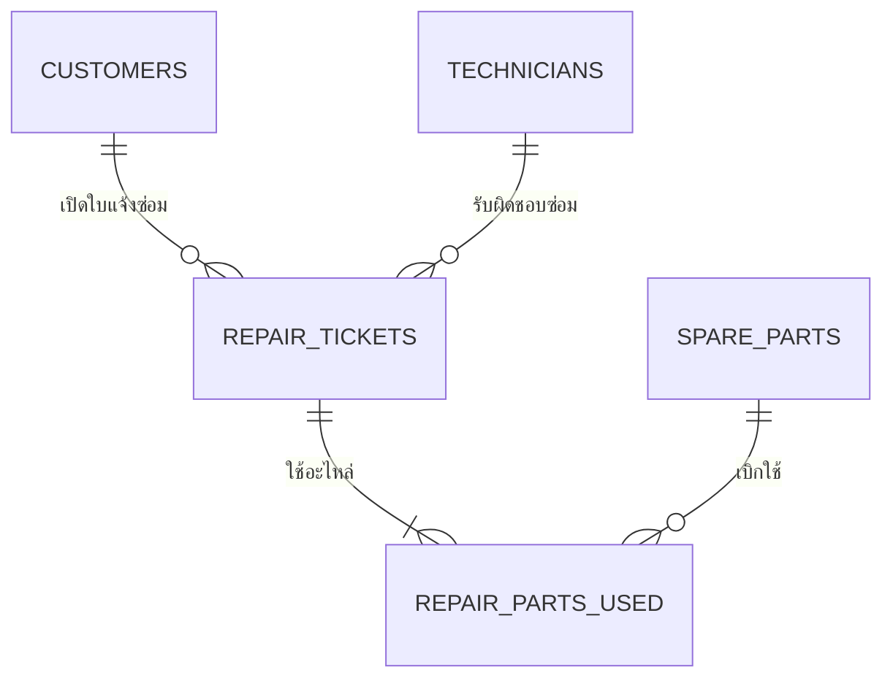
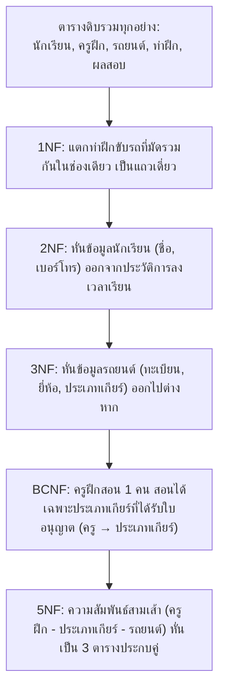

---
tags:
  - normalization
  - beginner-friendly
  - examples
  - visual-tables
  - no-sql
  - 1nf
  - 2nf
  - 3nf
  - bcnf
  - 4nf
  - 5nf
created: 2026-09-15
updated: 2026-09-15
type: conceptual-guide
level: beginner-practice-10-cases
---

# 🎯 10 ตัวอย่าง Normalization ในชีวิตประจำวันฉบับเห็นภาพง่ายที่สุด (ตารางล้วน ไม่มี SQL แม้แต่บรรทัดเดียว!)

> [!SUMMARY] เรียน Normalization จากสิ่งที่จับต้องได้รอบตัว
> เอกสารฉบับนี้จัดทำขึ้นเป็นพิเศษเพื่อแก้ปัญหา "เรียนทฤษฎีแล้วไม่เข้าใจ นึกภาพไม่ออก"  
> เราคัดสรร **10 ธุรกิจจริงในชีวิตประจำวัน** ที่ทุกคนคุ้นเคยมาจำลองให้เห็นกันจะๆ:
> - ❌ **ไม่มีโค้ด SQL เลยแม้แต่บรรทัดเดียว**
> - ❌ **ไม่มีสมการคณิตศาสตร์ชวนเวียนหัว**
> - ✅ **มีแต่ภาพตารางจริง (Before vs After)**
> - ✅ **ชี้ให้เห็นชัดๆ ว่า "ข้อมูลมันบวมและเน่าตรงไหน"**
> - ✅ **แสดงวิธี "เอากรรไกรมาหั่นตารางแยกชิ้น" จนสะอาด เรียบร้อย ไร้ข้อมูลซ้ำซ้อน!**

---

## 🧭 สารบัญ 10 ตัวอย่างธุรกิจจริง

1. [[#ข้อที่ 1: ร้านชาบู & หมูกระทะบุฟเฟต์ (Shabu & Buffet Restaurant)|ข้อที่ 1: ร้านชาบู & หมูกระทะบุฟเฟต์]] — *แตกรายการอาหาร 1NF และแยกบิล 2NF*
2. [[#ข้อที่ 2: คลินิกรักษาสัตว์เลี้ยง (Pet Clinic & Veterinary Service)|ข้อที่ 2: คลินิกรักษาสัตว์เลี้ยง]] — *กำจัดปัญหาเจ้าของสัตว์เลี้ยงซ้ำซ้อน 3NF*
3. [[#ข้อที่ 3: ร้านซ่อมสมาร์ตโฟนและคอมพิวเตอร์ (Mobile & IT Repair Shop)|ข้อที่ 3: ร้านซ่อมสมาร์ตโฟนและคอมพิวเตอร์]] — *แยกอะไหล่และค่าแรงช่าง 2NF/3NF*
4. [[#ข้อที่ 4: ฟิตเนสและยิมออกกำลังกาย (Fitness Gym & Personal Trainer)|ข้อที่ 4: ฟิตเนสและยิมออกกำลังกาย]] — *เจาะลึก BCNF: เมื่อเทรนเนอร์ 1 คนคุมได้ 1 คลาส*
5. [[#ข้อที่ 5: หอพักนักศึกษาและอพาร์ตเมนต์ (Student Dormitory Rental)|ข้อที่ 5: หอพักนักศึกษาและอพาร์ตเมนต์]] — *แยกประเภทห้องพักและค่าเช่า 3NF*
6. [[#ข้อที่ 6: ร้านรับส่งพัสดุด่วน (Express Parcel Courier Delivery)|ข้อที่ 6: ร้านรับส่งพัสดุด่วน]] — *แก้ปัญหาทอดสะพาน: รหัสไปรษณีย์และจังหวัด 3NF*
7. [[#ข้อที่ 7: คลินิกทันตกรรมและการทำฟัน (Dental Care Clinic)|ข้อที่ 7: คลินิกทันตกรรมและการทำฟัน]] — *จัดการหัตถการและทันตแพทย์ประจำเคส*
8. [[#ข้อที่ 8: ศูนย์บริการล้างรถและคาร์แคร์ (Car Detailing & Wash Service)|ข้อที่ 8: ศูนย์บริการล้างรถและคาร์แคร์]] — *แยกขนาดไซส์รถและแพ็กเกจบริการ 2NF/3NF*
9. [[#ข้อที่ 9: ร้านบอร์ดเกมคาเฟ่ (Board Game Cafe & Snacks)|ข้อที่ 9: ร้านบอร์ดเกมคาเฟ่]] — *แก้ปัญหา MVD 4NF: เกมที่เล่น กับ ของกินที่สั่ง*
10. [[#ข้อที่ 10: โรงเรียนสอนขับรถยนต์ (Driving School Schedule)|ข้อที่ 10: โรงเรียนสอนขับรถยนต์]] — *สรุปครบวงจร 1NF ถึง 5NF สรุปทุกเทคนิค*

---

## 🍲 ข้อที่ 1: ร้านชาบู & หมูกระทะบุฟเฟต์ (Shabu & Buffet Restaurant)

### 1. จุดเริ่มต้น: ตารางดิบเปิดบิลโต๊ะอาหาร (UNF)
พนักงานจดออเดอร์เปิดโต๊ะ ยัดรายการถาดอาหารที่ลูกค้าสั่งลงในช่องเดียว:

| เลขโต๊ะ (TableNo) | เวลาเปิดโต๊ะ (Time) | แพ็กเกจบุฟเฟต์ (Package) | ราคา/หัว (Price) | ถาดอาหารที่สั่ง (Items) |
| :---: | :---: | :--- | :---: | :--- |
| **T01** | 18:00 | Standard หมู | 299 | สันคอหมู x3, ตับหมู x2, ผักกาดขาว x2 |
| **T02** | 18:15 | Premium เนื้อ | 499 | เนื้อวากิว x4, กุ้งแม่น้ำ x5 |
| **T03** | 18:30 | Standard หมู | 299 | สันคอหมู x2, เบคอน x3 |

💥 **ปัญหา:** ช่อง `ถาดอาหารที่สั่ง` ยัดของหลายอย่างในช่องเดียว คอมพิวเตอร์นับจำนวนถาดรวมของ "สันคอหมู" วันนี้ไม่ได้!

---

### 2. ทำเป็น 1NF: แตกแถวให้ช่องละ 1 ค่า (Atomic Value)

| <u>เลขโต๊ะ</u> | เวลา | แพ็กเกจ | ราคา/หัว | <u>รหัสอาหาร</u> | ชื่ออาหาร | จำนวนถาด |
| :---: | :---: | :--- | :---: | :---: | :--- | :---: |
| **T01** | 18:00 | Standard หมู | 299 | **F01** | สันคอหมู | 3 |
| **T01** | 18:00 | Standard หมู | 299 | **F02** | ตับหมู | 2 |
| **T01** | 18:00 | Standard หมู | 299 | **F03** | ผักกาดขาว | 2 |
| **T02** | 18:15 | Premium เนื้อ | 499 | **F04** | เนื้อวากิว | 4 |
| **T02** | 18:15 | Premium เนื้อ | 499 | **F05** | กุ้งแม่น้ำ | 5 |
| **T03** | 18:30 | Standard หมู | 299 | **F01** | สันคอหมู | 2 |
| **T03** | 18:30 | Standard หมู | 299 | **F06** | เบคอน | 3 |

* คีย์คู่คือ: `{เลขโต๊ะ, รหัสอาหาร}`
* 💥 **เห็นความเน่าไหม?** ข้อมูล `T01, 18:00, Standard หมู, 299` ต้องเขียนซ้ำ 3 รอบ! และถ้าครัวคิดเมนูใหม่ `F07: แซลมอน` แต่ยังไม่มีโต๊ะไหนสั่ง จะบันทึกเมนูนี้ไม่ได้เลยเพราะยังไม่มีเลขโต๊ะ!

---

### 3. หั่นสู่ 2NF: แยกเรื่องโต๊ะ กับ เรื่องเมนูอาหาร ออกจากกัน

#### ตารางที่ 1: `TABLE_ORDERS (ข้อมูลโต๊ะ)`
| <u>เลขโต๊ะ (TableNo)</u> | เวลาเปิดโต๊ะ (Time) | แพ็กเกจ (Package) | ราคา/หัว (Price) |
| :---: | :---: | :--- | :---: |
| **T01** | 18:00 | Standard หมู | 299 |
| **T02** | 18:15 | Premium เนื้อ | 499 |
| **T03** | 18:30 | Standard หมู | 299 |

#### ตารางที่ 2: `FOOD_ITEMS (เมนูถาดอาหาร)`
| <u>รหัสอาหาร (FoodID)</u> | ชื่ออาหาร (FoodName) |
| :---: | :--- |
| **F01** | สันคอหมู |
| **F02** | ตับหมู |
| **F03** | ผักกาดขาว |
| **F04** | เนื้อวากิว |
| **F05** | กุ้งแม่น้ำ |
| **F06** | เบคอน |
| **F07** | แซลมอน *(เมนูใหม่ บันทึกได้แล้ว!)* |

#### ตารางที่ 3: `ORDER_DETAILS (การสั่งถาดอาหาร)`
| <u>เลขโต๊ะ</u> | <u>รหัสอาหาร</u> | จำนวนถาด |
| :---: | :---: | :---: |
| **T01** | **F01** | 3 |
| **T01** | **F02** | 2 |
| **T01** | **F03** | 2 |
| **T02** | **F04** | 4 |
| **T02** | **F05** | 5 |
| **T03** | **F01** | 2 |
| **T03** | **F06** | 3 |

---

### 4. หั่นสู่ 3NF: แยกข้อมูลราคาแพ็กเกจบุฟเฟต์
ในตาราง `TABLE_ORDERS` ข้อมูล `Standard หมู` คู่กับ `299` ซ้ำกันทุกโต๊ะที่สั่ง  
เราหั่นแยกตารางแพ็กเกจออกมา:

#### ตาราง `PACKAGES (แพ็กเกจบุฟเฟต์)`
| <u>รหัสแพ็กเกจ (PkgID)</u> | ชื่อแพ็กเกจ (PkgName) | ราคา/หัว (Price) |
| :---: | :--- | :---: |
| **PK01** | Standard หมู | 299 |
| **PK02** | Premium เนื้อ | 499 |

#### ตาราง `TABLE_ORDERS (ฉบับ 3NF)`
| <u>เลขโต๊ะ (TableNo)</u> | เวลาเปิดโต๊ะ (Time) | รหัสแพ็กเกจ (PkgID) |
| :---: | :---: | :---: |
| **T01** | 18:00 | **PK01** |
| **T02** | 18:15 | **PK02** |
| **T03** | 18:30 | **PK01** |

✨ **ผลลัพธ์:** วันข้างหน้าร้านขึ้นราคาแพ็กเกจ Standard เป็น 319 บาท มาแก้ที่ตาราง `PACKAGES` จุดเดียว ทุกโต๊ะอัปเดตตรงกันทันที!

---

## 🐶 ข้อที่ 2: คลินิกรักษาสัตว์เลี้ยง (Pet Clinic & Veterinary Service)

### 1. จุดเริ่มต้น: ตารางประวัติการรักษา (UNF)
เจ้าของพาสุนัขและแมวมารับการรักษาที่คลินิก:

| รหัสการตรวจ (VisitID) | วันที่ (Date) | เจ้าของ (Owner) | เบอร์โทร (Phone) | ชื่อสัตว์ (PetName) | ประเภท (Species) | อาการ & การรักษา (Treatments) |
| :---: | :---: | :--- | :---: | :--- | :---: | :--- |
| **V101** | 01/09/2026 | ลุงบุญมี | 081-444-4444 | เจ้าด่าง | สุนัข | ฉีดวัคซีนพิษสุนัขบ้า, ถ่ายพยาธิ |
| **V102** | 02/09/2026 | ป้าสมศรี | 082-555-5555 | มิมี่ | แมว | ล้างแผล |
| **V103** | 05/09/2026 | ลุงบุญมี | 081-444-4444 | สีหมอก | สุนัข | ตรวจสุขภาพประจำปี |

💥 **ปัญหาในตารางเดิม:**
- ลุงบุญมีเลี้ยงสัตว์ 2 ตัว (`เจ้าด่าง` กับ `สีหมอก`) เบอร์โทรของลุงบุญมีถูกพิมพ์ซ้ำทุกครั้งที่พาสัตว์ตัวไหนมารักษา
- รายการรักษาในช่องเดียวมีหลายอย่าง

---

### 2. กระบวนการหั่นตารางสู่ 3NF ทีละขั้น

#### ขั้นที่ 1 (1NF): แตกหัตถการให้เป็นช่องละ 1 ค่า
แยก `ฉีดวัคซีนพิษสุนัขบ้า` กับ `ถ่ายพยาธิ` ออกเป็นคนละบรรทัด

#### ขั้นที่ 2 (2NF): แยกตารางหัตถการออกไป
เพราะชื่อหัตถการและราคาหัตถการไม่ได้ขึ้นกับสัตว์เลี้ยง แต่เป็นข้อมูลมาตรฐานของคลินิก

#### ขั้นที่ 3 (3NF): สัตว์เลี้ยงเป็นของเจ้าของ!
สังเกตสายสัมพันธ์: `รหัสการตรวจ → รหัสสัตว์เลี้ยง → รหัสเจ้าของ → เบอร์โทรเจ้าของ`  
ถ้าไม่แยกตาราง ทุกครั้งที่สัตว์มารักษา ชื่อและเบอร์โทรเจ้าของจะถูกบันทึกซ้ำซ้อนเรื่อยๆ

---

### 3. ผลลัพธ์ตาราง 3NF ที่สะอาดสมบูรณ์แบบ:

#### ตารางที่ 1: `OWNERS (เจ้าของสัตว์เลี้ยง)`
| <u>รหัสเจ้าของ (OwnerID)</u> | ชื่อเจ้าของ (Name) | เบอร์โทรศัพท์ (Phone) |
| :---: | :--- | :---: |
| **O01** | ลุงบุญมี | 081-444-4444 |
| **O02** | ป้าสมศรี | 082-555-5555 |

#### ตารางที่ 2: `PETS (ข้อมูลสัตว์เลี้ยง)`
| <u>รหัสสัตว์ (PetID)</u> | ชื่อสัตว์ (PetName) | ชนิด (Species) | รหัสเจ้าของ (OwnerID) |
| :---: | :--- | :---: | :---: |
| **P01** | เจ้าด่าง | สุนัข | **O01** |
| **P02** | สีหมอก | สุนัข | **O01** |
| **P03** | มิมี่ | แมว | **O02** |

#### ตารางที่ 3: `VISITS (การเข้ารับการรักษา)`
| <u>รหัสการตรวจ (VisitID)</u> | วันที่ตรวจ (Date) | รหัสสัตว์ (PetID) |
| :---: | :---: | :---: |
| **V101** | 01/09/2026 | **P01** |
| **V102** | 02/09/2026 | **P03** |
| **V103** | 05/09/2026 | **P02** |

#### ตารางที่ 4: `TREATMENT_ITEMS (รายละเอียดการรักษา)`
| <u>รหัสการตรวจ</u> | <u>รหัสการรักษา</u> | รายการรักษา | ค่าบริการ (บาท) |
| :---: | :---: | :--- | :---: |
| **V101** | **TR01** | ฉีดวัคซีนพิษสุนัขบ้า | 250 |
| **V101** | **TR02** | ถ่ายพยาธิ | 100 |
| **V102** | **TR03** | ล้างแผล | 150 |
| **V103** | **TR04** | ตรวจสุขภาพประจำปี | 500 |

✨ **เห็นความง่ายไหม?** ลุงบุญมีจะมีสัตว์เลี้ยงกี่ตัว หรือจะพามารักษากี่สิบครั้ง เบอร์โทรลุงบุญมีถูกเก็บแค่ที่เดียวในตาราง `OWNERS`!

---

## 📱 ข้อที่ 3: ร้านซ่อมสมาร์ตโฟนและคอมพิวเตอร์ (Mobile & IT Repair Shop)

### 1. จุดเริ่มต้น: ตารางบันทึกใบส่งซ่อม (UNF)

| เลขที่ใบซ่อม (TicketNo) | วันที่รับซ่อม | ลูกค้า | เบอร์โทร | ยี่ห้อ/รุ่นเครื่อง | อะไหล่ที่ต้องเปลี่ยน (Parts) | ช่างผู้ซ่อม | ค่าแรงช่าง |
| :---: | :---: | :--- | :---: | :--- | :--- | :--- | :---: |
| **R001** | 01/09/2026 | นายวินัย | 086-111-2222 | iPhone 13 | หน้าจอ OLED 3,500บ., แบตเตอรี่ 1,200บ. | ช่างนนท์ | 500 |
| **R002** | 02/09/2026 | นางมาลี | 089-333-4444 | iPad Pro | แบตเตอรี่ 1,800บ. | ช่างกอล์ฟ | 600 |
| **R003** | 03/09/2026 | นายวินัย | 086-111-2222 | Notebook Asus | SSD 1TB 2,400บ., พัดลมระบายความร้อน 450บ. | ช่างนนท์ | 400 |

---

### 2. วิเคราะห์จุดพังและทำการหั่นตารางสู่ 3NF

1. **รายการอะไหล่:** ในใบซ่อม 1 ใบ มีอะไหล่หลายชิ้น ต้องแตกเป็นตาราง `REPAIR_PARTS_USED`
2. **ข้อมูลอะไหล่มาตรฐาน:** ชื่ออะไหล่และราคาต้นทุน ไม่ได้ขึ้นกับใบซ่อม ต้องแยกเป็นตาราง `SPARE_PARTS`
3. **ข้อมูลลูกค้า:** นายวินัยส่งซ่อม 2 เครื่อง เบอร์โทรซ้ำซ้อน แยกเป็นตาราง `CUSTOMERS`
4. **ข้อมูลช่างซ่อม:** ชื่อช่างซ่อม แยกเป็นตาราง `TECHNICIANS`

---

### 3. โครงสร้างตารางหลังทำ Normalization เรียบร้อย:

#### ตาราง `CUSTOMERS`: { <u>CustomerID</u>, CustomerName, Phone }
#### ตาราง `TECHNICIANS`: { <u>TechID</u>, TechName }
#### ตาราง `SPARE_PARTS`: { <u>PartID</u>, PartName, UnitPrice }
#### ตาราง `REPAIR_TICKETS`: { <u>TicketNo</u>, ReceiveDate, CustomerID, TechID, DeviceModel, LaborFee }
#### ตาราง `REPAIR_PARTS_USED`: { <u>TicketNo</u>, <u>PartID</u>, Quantity }

---

## 🏋️ ข้อที่ 4: ฟิตเนสและยิมออกกำลังกาย (Fitness Gym & Personal Trainer)

### 1. บริบทที่เน้นความเข้าใจ BCNF (Boyce-Codd Normal Form)
ฟิตเนสแห่งหนึ่งมีคลาสออกกำลังกายกลุ่มพิเศษ (เช่น Yoga, Pilates, Boxing, Zumba):
- **กฎกติกาของยิม:**
  1. สมาชิก 1 คน สามารถลงทะเบียนเรียนได้หลายคลาส
  2. ใน 1 คลาส มีเทรนเนอร์หลายคนช่วยกันสอนคนละรอบเวลา
  3. **แต่เทรนเนอร์แต่ละคน เชี่ยวชาญและคุมสอนได้เพียง 1 คลาสเท่านั้น!** (เช่น โค้ชฟ้าคุมคลาส Yoga ได้คลาสเดียวเท่านั้น)

### 2. ตารางที่มีปัญหา BCNF: `GYM_CLASS_REGISTRATION`

| <u>รหัสสมาชิก (MemberID)</u> | <u>ชื่อเทรนเนอร์ (Trainer)</u> | ชื่อคลาส (ClassName) | วันที่เรียน (Date) |
| :---: | :--- | :--- | :---: |
| **M101** | โค้ชฟ้า | Yoga | 10/09/2026 |
| **M101** | โค้ชบอย | Boxing | 11/09/2026 |
| **M102** | โค้ชฟ้า | Yoga | 10/09/2026 |
| **M103** | โค้ชมุก | Yoga | 12/09/2026 |
| **M102** | โค้ชบอย | Boxing | 11/09/2026 |

### 💥 ทำไมตารางนี้ถึง "ผ่าน 3NF แต่ตก BCNF"?
- คีย์หลักของตารางคือคีย์คู่ `{MemberID, Trainer}`
- ตารางนี้ไม่มี Non-key ไปกำหนด Non-key อื่น จึงผ่าน 3NF
- **แต่เกิดปัญหา BCNF เพราะ:**  
  เรารู้ความสัมพันธ์ว่า `ชื่อเทรนเนอร์ → ชื่อคลาส` (เพราะโค้ชฟ้าสอน Yoga เสมอ แค่รู้ชื่อโค้ชฟ้า ก็รู้วิชาทันที)  
  แต่ `ชื่อเทรนเนอร์` ดัน **ไม่ใช่คีย์หลักของตารางนี้!**
- **ผลลัพธ์คือ:** ถ้ายิมจ้างโค้ชใหม่ชื่อ "โค้ชเอก" มาคุมคลาส Pilates แต่สัปดาห์แรกยังไม่มีสมาชิกจองเรียน ยิมจะบันทึกข้อมูลโค้ชเอกลงระบบไม่ได้เลย!

### ✂️ วิธีหั่นตารางให้เป็น BCNF: "ตัดตัวที่กำหนดคนอื่น แยกออกไปเป็นหัวหน้าตารางใหม่!"

#### ตารางที่ 1: `TRAINER_SKILLS (เทรนเนอร์กับคลาสที่สอน)`
*(คีย์หลักคือ `ชื่อเทรนเนอร์` เป็นหัวหน้าตัวจริง!)*

| <u>ชื่อเทรนเนอร์ (Trainer)</u> | ชื่อคลาสที่สอน (ClassName) |
| :--- | :--- |
| **โค้ชฟ้า** | Yoga |
| **โค้ชบอย** | Boxing |
| **โค้ชมุก** | Yoga |
| **โค้ชเอก** *(บันทึกโค้ชใหม่ได้ทันที แม้ยังไม่มีคนลงเรียน!)* | Pilates |

#### ตารางที่ 2: `MEMBER_BOOKINGS (การจองคลาสของสมาชิก)`
*(คีย์หลักคือ `{MemberID, Trainer}`)*

| <u>รหัสสมาชิก (MemberID)</u> | <u>ชื่อเทรนเนอร์ (Trainer)</u> | วันที่เรียน (Date) |
| :---: | :--- | :---: |
| **M101** | โค้ชฟ้า | 10/09/2026 |
| **M101** | โค้ชบอย | 11/09/2026 |
| **M102** | โค้ชฟ้า | 10/09/2026 |
| **M103** | โค้ชมุก | 12/09/2026 |
| **M102** | โค้ชบอย | 11/09/2026 |

---

## 🏢 ข้อที่ 5: หอพักนักศึกษาและอพาร์ตเมนต์ (Student Dormitory Rental)

### 1. จุดเริ่มต้น: ตารางสัญญาเช่าห้องพัก (UNF)

| เลขที่สัญญา (ContractNo) | ผู้เช่า (Tenant) | เบอร์โทร | เลขห้อง (RoomNo) | ชั้น (Floor) | ประเภทห้อง (RoomType) | แอร์/พัดลม | ค่าเช่า/เดือน (MonthlyRent) |
| :---: | :--- | :---: | :---: | :---: | :--- | :--- | :---: |
| **CT-01** | กานต์ | 081-111-0000 | 301 | 3 | Studio Room | แอร์ | 4,500 |
| **CT-02** | ธิดา | 082-222-0000 | 302 | 3 | Studio Room | แอร์ | 4,500 |
| **CT-03** | ปิยะ | 083-333-0000 | 205 | 2 | Standard | พัดลม | 3,000 |
| **CT-04** | เมษา | 084-444-0000 | 401 | 4 | Deluxe Corner | แอร์ | 6,000 |

---

### 2. วิเคราะห์หาความสัมพันธ์แบบทอดสะพาน (Transitive Dependency 3NF)
ลองสังเกตสายสัมพันธ์ในตารางสัญญาเช่า:
`เลขที่สัญญา → เลขห้อง → ประเภทห้อง → แอร์/พัดลม, ค่าเช่า/เดือน`

- ข้อมูล `Studio Room, แอร์, 4,500` ถูกบันทึกซ้ำทุกห้องที่เป็นประเภท Studio
- ถ้าหอพักประกาศปรับราคาห้อง Studio จาก 4,500 เป็น 4,800 บาท เจ้าของหอพักต้องมานั่งไล่แก้ทุกสัญญาเช่าที่มีห้องแบบนี้

---

### 3. ผลลัพธ์การหั่นตาราง 3NF:

#### ตารางที่ 1: `ROOM_TYPES (ประเภทห้องพักและราคามาตรฐาน)`
| <u>ประเภทห้อง (RoomType)</u> | สิ่งอำนวยความสะดวก (Cooling) | ค่าเช่าต่อเดือน (MonthlyRent) |
| :--- | :--- | :---: |
| **Studio Room** | แอร์ | 4,500 |
| **Standard** | พัดลม | 3,000 |
| **Deluxe Corner** | แอร์ | 6,000 |

#### ตารางที่ 2: `ROOMS (ห้องพักที่มีอยู่จริงในตึก)`
| <u>เลขห้อง (RoomNo)</u> | ชั้น (Floor) | ประเภทห้อง (RoomType) |
| :---: | :---: | :--- |
| **205** | 2 | Standard |
| **301** | 3 | Studio Room |
| **302** | 3 | Studio Room |
| **401** | 4 | Deluxe Corner |

#### ตารางที่ 3: `TENANTS (ข้อมูลผู้เช่า)`
| <u>รหัสผู้เช่า (TenantID)</u> | ชื่อผู้เช่า (Name) | เบอร์โทรศัพท์ (Phone) |
| :---: | :--- | :---: |
| **T01** | กานต์ | 081-111-0000 |
| **T02** | ธิดา | 082-222-0000 |

#### ตารางที่ 4: `LEASE_CONTRACTS (สัญญาเช่าห้อง)`
| <u>เลขที่สัญญา (ContractNo)</u> | รหัสผู้เช่า (TenantID) | เลขห้อง (RoomNo) | วันเริ่มสัญญา (StartDate) |
| :---: | :---: | :---: | :---: |
| **CT-01** | **T01** | **301** | 01/06/2026 |
| **CT-02** | **T02** | **302** | 01/06/2026 |

---

## 📦 ข้อที่ 6: ร้านรับส่งพัสดุด่วน (Express Parcel Delivery Service)

### 1. จุดเริ่มต้น: ตารางใบรับฝากพัสดุ (UNF)

| เลขพัสดุ (TrackingNo) | ผู้ส่ง (Sender) | เบอร์ผู้ส่ง | ผู้รับ (Receiver) | ที่อยู่ปลายทาง | รหัสไปรษณีย์ (ZipCode) | อำเภอ/เขต | จังหวัด | ค่าส่ง |
| :---: | :--- | :---: | :--- | :--- | :---: | :--- | :--- | :---: |
| **TH01** | ชัยยศ | 081-999-1111 | สุภา | 12/3 ม.4 | 10330 | ปทุมวัน | กรุงเทพฯ | 45 |
| **TH02** | นภา | 082-888-2222 | มนัส | 99/1 ถ.สีลม | 10500 | บางรัก | กรุงเทพฯ | 50 |
| **TH03** | ชัยยศ | 081-999-1111 | วิรัช | 456 ถ.พระราม 1 | 10330 | ปทุมวัน | กรุงเทพฯ | 45 |

---

### 2. วิเคราะห์จุดบวม 3NF คลาสสิก: "รหัสไปรษณีย์ กำหนด อำเภอ และ จังหวัด!"
- ในประเทศไทย แค่เรารู้ `รหัสไปรษณีย์ (10330)` เราก็รู้ทันทีว่าคือ `ปทุมวัน, กรุงเทพฯ`
- การพิมพ์ชื่ออำเภอและจังหวัดซ้ำๆ ในทุกกล่องพัสดุ เป็นการเปลืองเนื้อที่และเสี่ยงที่พนักงานจะพิมพ์ผิด (เช่น กรุงเทพ, กทม., กทม)

---

### 3. ผลลัพธ์การหั่นตาราง:

#### ตาราง `POSTAL_AREAS (ข้อมูลรหัสไปรษณีย์)`
| <u>รหัสไปรษณีย์ (ZipCode)</u> | เขต/อำเภอ (District) | จังหวัด (Province) |
| :---: | :--- | :--- |
| **10330** | ปทุมวัน | กรุงเทพฯ |
| **10500** | บางรัก | กรุงเทพฯ |
| **50000** | เมืองเชียงใหม่ | เชียงใหม่ |

#### ตาราง `SHIPMENT_PARCELS (พัสดุ)`
| <u>เลขพัสดุ (TrackingNo)</u> | ผู้ส่ง | เบอร์ผู้ส่ง | ผู้รับ | ที่อยู่บ้านเลขที่ | รหัสไปรษณีย์ (FK) | ค่าส่ง |
| :---: | :--- | :---: | :--- | :--- | :---: | :---: |
| **TH01** | ชัยยศ | 081-999-1111 | สุภา | 12/3 ม.4 | **10330** | 45 |
| **TH02** | นภา | 082-888-2222 | มนัส | 99/1 ถ.สีลม | **10500** | 50 |
| **TH03** | ชัยยศ | 081-999-1111 | วิรัช | 456 ถ.พระราม 1 | **10330** | 45 |

---

## 🦷 ข้อที่ 7: คลินิกทันตกรรมและการทำฟัน (Dental Care Clinic)

### 1. จุดเริ่มต้น: ตารางบันทึกการรักษาฟัน (UNF)

| รหัสนัดหมาย (ApptID) | วันที่ | คนไข้ | เลขบัตร ปชช. | สิทธิรักษา | ทันตแพทย์ | หัตถการที่ทำ (Procedures) | ค่ายาที่จ่าย (Medicines) |
| :---: | :---: | :--- | :---: | :--- | :--- | :--- | :--- |
| **D-01** | 10/09/2026 | วาสนา | 1100223344551 | ประกันสังคม | ทพ.สมเกียรติ | ขูดหินปูน (900บ.), อุดฟันคอมโพสิต (1,200บ.) | Amoxicillin (150บ.), Ibuprofen (80บ.) |
| **D-02** | 10/09/2026 | สมพร | 3100554433221 | จ่ายเงินสด | ทพญ.กัลยา | ถอนฟันกราม (800บ.) | Paracetamol (50บ.) |

---

### 2. วิเคราะห์สิ่งที่ต้องหั่น
1. **1NF:** ช่อง `หัตถการ` และ `ค่ายา` มีหลายค่าในช่องเดียว ต้องแตกเป็นแถวเดี่ยว
2. **2NF/3NF:** ข้อมูลคนไข้ (`ชื่อ, เลขบัตร, สิทธิรักษา`) ต้องแยกเป็นตาราง `PATIENTS`
3. **4NF (Multi-Valued Dependency):** สังเกตว่าคนไข้ 1 คนในการนัดหมาย 1 ครั้ง:
   - มีรายการหัตถการทำฟันหลายอย่าง (`ขูดหินปูน`, `อุดฟัน`)
   - และได้รับยาหลายตัวกลับบ้าน (`Amoxicillin`, `Ibuprofen`)
   - **หัตถการทำฟัน กับ ยาที่จ่าย ไม่ได้ขึ้นต่อกัน!** (ยาแก้ปวดไม่ได้ผูกเฉพาะกับฟันซี่ที่อุด แต่จ่ายให้ทั้งคนไข้)  
   👉 ถ้าไม่แยกตาราง จะเกิด $2 \times 2 = 4$ แถวคูณกันเละเทะ!

---

### 3. ผลลัพธ์การแยกตาราง 4NF:
- **`PATIENTS`**: { <u>PatientID</u>, PatientName, CitizenID, InsuranceType }
- **`DENTISTS`**: { <u>DentistID</u>, DentistName }
- **`APPOINTMENTS`**: { <u>ApptID</u>, Date, PatientID, DentistID }
- **`APPT_PROCEDURES`**: { <u>ApptID</u>, <u>ProcedureCode</u>, Fee } *(เก็บหัตถการ)*
- **`APPT_MEDICINES`**: { <u>ApptID</u>, <u>MedicineCode</u>, Quantity, Price } *(เก็บยา)*

---

## 🚗 ข้อที่ 8: ศูนย์บริการล้างรถและคาร์แคร์ (Car Detailing & Wash Service)

### 1. บริบทและตารางดิบ (UNF)

| เลขที่บิล (JobNo) | ทะเบียนรถ (PlateNo) | ยี่ห้อ/รุ่น (Model) | ขนาดรถ (Size) | เจ้าของรถ (Owner) | บริการที่ทำ (Services) |
| :---: | :---: | :--- | :---: | :--- | :--- |
| **W01** | กข 1234 กทม | Honda Civic | M | คุณบอย | ล้างสีดูดฝุ่น (250บ.), อบโอโซน (300บ.) |
| **W02** | ฮฮ 9999 กทม | Toyota Fortuner | L | คุณเอก | ล้างสีดูดฝุ่น (350บ.), เคลือบสีคริสตัล (800บ.) |
| **W03** | กข 1234 กทม | Honda Civic | M | คุณบอย | ล้างสีดูดฝุ่น (250บ.) |

---

### 2. วิเคราะห์หาจุดผิดปกติ
- รถคันเดิม `กข 1234 กทม` เป็นไซส์ `M` เสมอ แต่ต้องบันทึกคำว่า `Honda Civic, M, คุณบอย` ซ้ำทุกครั้งที่มาล้าง
- ราคาค่าบริการล้างสีดูดฝุ่น ขึ้นอยู่กับ **"ขนาดรถ (Size)"** (ไซส์ M ราคา 250บ., ไซส์ L ราคา 350บ.)

---

### 3. ผลลัพธ์ตาราง 3NF:
1. **ตารางรถยนต์ (`CARS`):** { <u>ทะเบียนรถ</u>, ยี่ห้อรุ่น, ขนาดรถ (S/M/L/XL), ชื่อเจ้าของ }
2. **ตารางราคาตามไซส์ (`SERVICE_PRICING`):** { <u>รหัสบริการ</u>, <u>ขนาดรถ</u>, ราคา }
3. **ตารางบิลเข้าใช้บริการ (`WASH_JOBS`):** { <u>เลขที่บิล</u>, วันที่เวลา, ทะเบียนรถ }
4. **ตารางรายการบริการในบิล (`JOB_ITEMS`):** { <u>เลขที่บิล</u>, <u>รหัสบริการ</u> }

---

## 🎲 ข้อที่ 9: ร้านบอร์ดเกมคาเฟ่ (Board Game Cafe & Snacks)

### 1. บริบทเน้น 4NF ขั้นสุด: "เล่นเกมอะไร กับ สั่งขนมอะไรกิน"
กลุ่มเพื่อน 1 โต๊ะ นั่งเล่นบอร์ดเกมในร้านคาเฟ่ 3 ชั่วโมง:
- ในบิลโต๊ะ `T-05` กลุ่มเพื่อนหยิบบอร์ดเกมมาเล่น 2 เกม: `{Catan, Avalon}`
- และสั่งขนม/เครื่องดื่มมากินระหว่างเล่น 2 อย่าง: `{เฟรนช์ฟรายส์, โค้กเย็น}`

👉 **ถามว่า:** การเล่นเกม `Catan` เกี่ยวข้องกับ `เฟรนช์ฟรายส์` ไหม?  
👉 **ตอบ:** **ไม่เกี่ยวกันเลย!** จะกินเฟรนช์ฟรายส์ตอนเล่น Avalon ก็ได้ ทั้งสองเรื่องเป็นอิสระต่อกันโดยสิ้นเชิง!

---

### 2. ดูตารางถ้าไม่ทำ 4NF (แถวระเบิดคูณกระจาย):

| เลขโต๊ะบิล (BillTable) | บอร์ดเกมที่หยิบมาเล่น (Game) | ของกินที่สั่ง (Snack) |
| :---: | :--- | :--- |
| **T-05** | Catan | เฟรนช์ฟรายส์ |
| **T-05** | Catan | โค้กเย็น |
| **T-05** | Avalon | เฟรนช์ฟรายส์ |
| **T-05** | Avalon | โค้กเย็น |

💥 **เห็นความพิลึกไหม?** มีเกม 2 เกม และขนม 2 อย่าง แตกแถวกลายเป็น **4 แถว!** ถ้าหยิบเกมเพิ่มอีก 1 เกม ต้องเพิ่มข้อมูลเข้าไปอีก 2 แถวทันที!

---

### 3. วิธีแก้ 4NF: หั่นเป็น 2 ตารางอิสระ

#### ตารางที่ 1: `TABLE_GAMES_PLAYED (บิลนี้เล่นเกมอะไรบ้าง)`
| <u>เลขโต๊ะบิล</u> | <u>ชื่อเกม</u> |
| :---: | :--- |
| **T-05** | Catan |
| **T-05** | Avalon |

#### ตารางที่ 2: `TABLE_SNACK_ORDERS (บิลนี้สั่งขนมอะไรบ้าง)`
| <u>เลขโต๊ะบิล</u> | <u>ชื่อของกิน</u> |
| :---: | :--- |
| **T-05** | เฟรนช์ฟรายส์ |
| **T-05** | โค้กเย็น |

✨ **ผลลัพธ์:** ข้อมูลสะอาดหมดจด ไม่มีแถวคูณกันมั่วซั่วอีกต่อไป!

---

## 🚘 ข้อที่ 10: โรงเรียนสอนขับรถยนต์ (Driving School Schedule)

### 1. บริบทโจทย์ใหญ่ที่ครอบคลุม 1NF ถึง 5NF
โรงเรียนสอนขับรถแห่งหนึ่ง บันทึกข้อมูลการฝึกหัดขับรถของนักเรียน:
- นักเรียน 1 คน เรียนได้หลายหลักสูตร (เกียร์ออโต้, เกียร์ธรรมดา)
- แต่ละคอร์สประกอบด้วยท่าฝึกสอบมาตรฐาน 3 ท่า: `{เทียบฟุตบาท, ถอยเข้าซอง, เดินหน้า-ถอยหลัง}`
- มีครูฝึกสอนหลายคน และรถยนต์ฝึกสอนหลายคัน

---

### 2. วิเคราะห์และ Decomposition ทีละสเต็ป:

---

### 3. สรุปชุดตารางผลลัพธ์สุดท้าย (Final Normalized Schemas):

1. **`STUDENTS (นักเรียน)`:** { <u>StudentID</u>, StudentName, Phone, IDCard }
2. **`INSTRUCTORS (ครูฝึกสอน)`:** { <u>InstructorID</u>, InstructorName, LicenseNo }
3. **`VEHICLES (รถยนต์ฝึกสอน)`:** { <u>PlateNo</u>, Brand, GearType }
4. **`TRAINING_COURSES (หลักสูตร)`:** { <u>CourseCode</u>, CourseName, TotalHours, Fee }
5. **`EXAM_MANEUVERS (ท่าสอบมาตรฐาน)`:** { <u>ManeuverID</u>, ManeuverName, PassingScore }
6. **`COURSE_MANEUVERS (ท่าฝึกประจำหลักสูตร)`:** { <u>CourseCode</u>, <u>ManeuverID</u> }
7. **`PRACTICE_SESSIONS (ชั่วโมงลงซ้อมขับ)`:** { <u>SessionID</u>, StudentID, InstructorID, PlateNo, Date, HoursTrained }
8. **`STUDENT_EXAM_RESULTS (ผลการสอบแต่ละท่า)`:** { <u>StudentID</u>, <u>ManeuverID</u>, Score, ResultStatus }

---

# 🏆 สรุปคัมภีร์ลัด: เจอโจทย์แบบไหน ต้องใช้ Normalization ระดับใด?

| หากในตารางพบเห็นลักษณะนี้... | แปลว่าติดปัญหา... | ระดับ Normalization ที่ต้องใช้แก้ | สิ่งที่ต้องทำด้วยกรรไกรหั่นตาราง |
| :--- | :--- | :---: | :--- |
| มีเครื่องหมายคอมม่า (`,`) หรือมีหลายค่าในช่องเดียว | **Repeating Group** | **1NF** | แตกแถวให้ทุกช่องเก็บค่าเดียว (Atomic) |
| ตารางใช้คีย์คู่ แต่มีข้อมูลที่ขึ้นกับแค่คีย์ตัวหน้าหรือตัวหลัง | **Partial Dependency** | **2NF** | ตัดข้อมูลที่ขึ้นกับคีย์ครึ่งเดียว แยกไปตั้งตารางใหม่ |
| ฟิลด์ธรรมดาที่ไม่ใช่คีย์ ไปบอกค่าฟิลด์ธรรมดาด้วยกันเอง | **Transitive Dependency** | **3NF** | ตัดคู่ที่ทอดสะพานกัน แยกไปตั้งตารางใหม่ |
| ตัวชี้ทางซ้ายไม่ใช่คีย์หลัก แต่ดันไปบอกค่าของคอลัมน์อื่นได้ | **Determinant is not Superkey** | **BCNF** | ตัดคู่นั้นแยกไปตั้งตารางใหม่ ให้ตัวชี้เป็นคีย์หลักตัวจริง |
| 1 แถวมี 2 เรื่องที่ไม่เกี่ยวกัน แต่ค่าระเบิดแถวคูณกัน ($2 \times 2 = 4$) | **Multi-Valued Dependency (MVD)** | **4NF** | แยกออกเป็น 2 ตารางเดี่ยวๆ อิสระต่อกัน |
| ความสัมพันธ์ 3 ฝ่ายที่หั่น 2 ตารางแล้วข้อมูลปลอมงอก | **Join Dependency (JD)** | **5NF** | หั่นออกเป็น 3 ตารางย่อยประกบคู่สามเหลี่ยม |

---
*จัดทำขึ้นเพื่อให้ผู้เรียนทุกคนสามารถเข้าใจและมองเห็นภาพ Normalization ได้จริงอย่างเป็นธรรมชาติที่สุด โดยไม่ต้องพึ่งพาโค้ด SQL*
