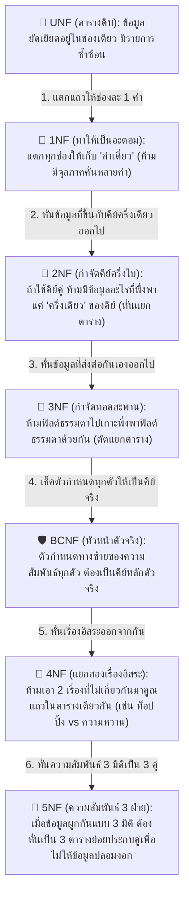
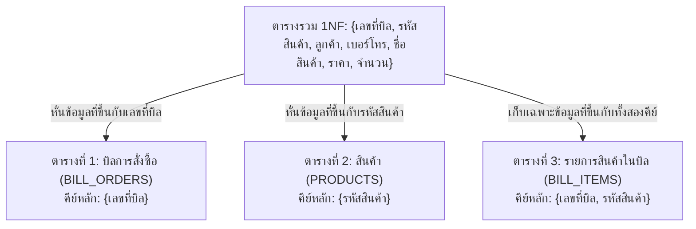
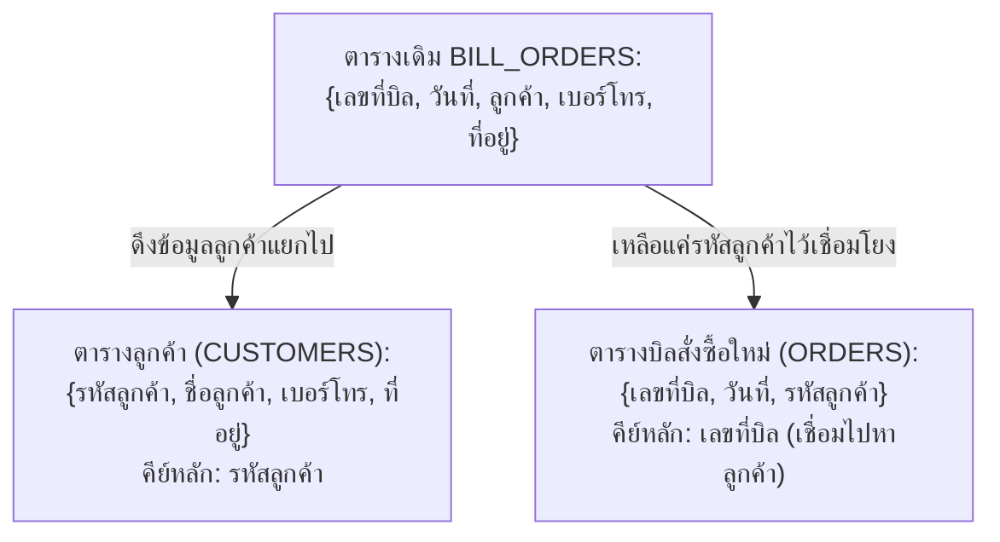
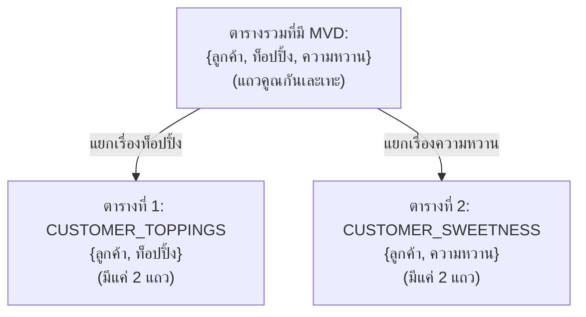
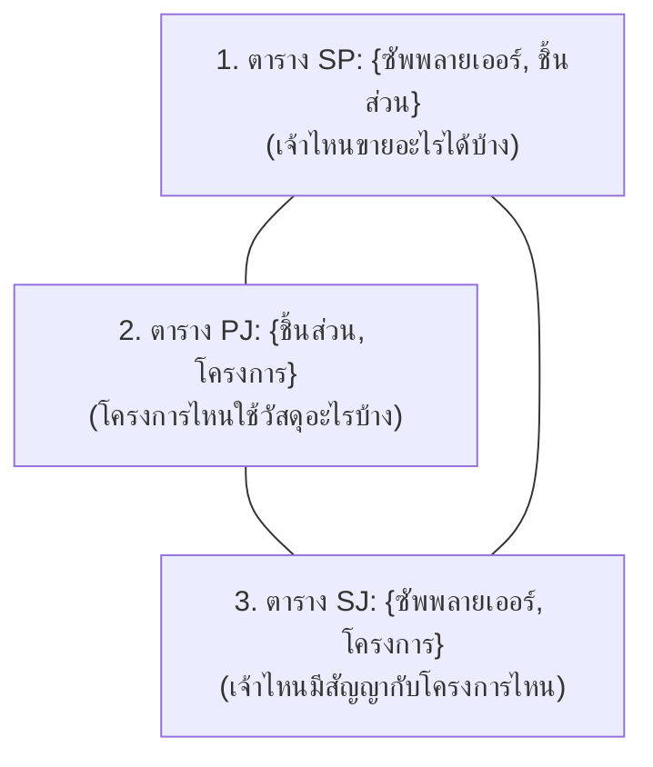

---
tags:
  - normalization
  - beginner-guide
  - conceptual
  - no-sql
  - tables-only
  - 1nf
  - 2nf
  - 3nf
  - bcnf
  - 4nf
  - 5nf
created: 2026-09-15
updated: 2026-09-15
type: conceptual-guide
level: zero-to-hero-intuitive
---

# 🍰 คู่มือเข้าใจ Normalization ฉบับเห็นภาพทันที (ฉบับตารางล้วน ไม่ต้องเขียน SQL แม้แต่บรรทัดเดียว!)

> [!SUMMARY] ทำไม Normalization ถึงดูยากในห้องเรียน?
> ในห้องเรียน อาจารย์มักจะเริ่มต้นด้วยทฤษฎีเซต นิยามคณิตศาสตร์ และสมการอย่าง $X \rightarrow Y$ หรือพาไปเขียนคำสั่ง SQL ทันที จนหลายคนรู้สึกมึนหัวและมองไม่เห็นภาพ
> 
> **ในคู่มือฉบับนี้ เราจะตัดคำสั่ง SQL ทิ้งไปทั้งหมด 100%!**  
> เราจะใช้เพียง **"ภาพตารางข้อมูลจริง (Data Tables)"** เพื่อให้เห็นด้วยตาตัวเองชัดๆ ว่า:
> 1. ข้อมูลมัน **"บวมและซ้ำซ้อน"** ตรงไหน?
> 2. เวลาเกิดปัญหา **"พัง 3 อย่าง (เพิ่มไม่ได้, ลบแล้วหาย, แก้ไม่หมด)"** หน้าตามันเป็นอย่างไร?
> 3. ในแต่ละระดับ (1NF $\rightarrow$ 2NF $\rightarrow$ 3NF $\rightarrow$ BCNF $\rightarrow$ 4NF $\rightarrow$ 5NF) เราเอากรรไกรมา **"หั่น/บดตารางอย่างไร"** ให้ข้อมูลสะอาด เรียบร้อย และไม่มีอะไรสูญหาย!

---

## 🧭 แผนผังเปรียบเทียบใน 1 นาที: แต่ละระดับทำหน้าที่อะไร?



---

# ☕ กรณีศึกษาหลัก: "ร้านคาเฟ่ชา & เบเกอรี่ (The Sweet Bakery House)"

เพื่อให้เห็นภาพง่ายที่สุดตลอดทั้งคู่มือ เราจะใช้ตัวอย่าง **"ใบเสร็จรับเงินของร้านคาเฟ่"** ที่เราเจอกันในชีวิตประจำวันจริงๆ มาทำการทดลอง

---

## 📄 จุดเริ่มต้น: ตารางดิบ (UNF - Unnormalized Form)

สมมติว่าร้านคาเฟ่แห่งนี้ยังไม่ได้ออกแบบฐานข้อมูลเลย มีแค่สมุดจดออเดอร์ 1 เล่ม พนักงานก็พิมพ์ทุกอย่างที่ลูกค้าสั่งยัดลงใน 1 แถวของตาราง Excel ดังนี้:

### ตารางดิบ: `CAFE_ORDERS_UNF`

| เลขที่บิล (BillNo) | วันที่ (Date) | ลูกค้า (Customer) | เบอร์โทร (Phone) | ที่อยู่/ตำบล (Area) | รายการสินค้าที่สั่ง (Items_List) |
| :---: | :---: | :--- | :---: | :--- | :--- |
| **B001** | 01/09/2026 | นายสมชาย | 081-111-1111 | สยามสแควร์, ปทุมวัน | (ชาเขียวนม 60บ. x 2), (เค้กส้ม 85บ. x 1), (ครัวซองต์ 55บ. x 1) |
| **B002** | 01/09/2026 | น.ส.สมหญิง | 089-222-2222 | สีลม, บางรัก | (ชาไทยเย็น 50บ. x 1), (ครัวซองต์ 55บ. x 2) |
| **B003** | 02/09/2026 | นายสมชาย | 081-111-1111 | สยามสแควร์, ปทุมวัน | (เค้กส้ม 85บ. x 2) |

### 💥 ทำไมตารางดิบนี้ถึง "ใช้ไม่ได้ในโลกจริง"?
1. **ช่อง `รายการสินค้าที่สั่ง` อัดแน่นไปด้วยข้อความหลายค่า (Multi-valued / Repeating Groups):** 
   - ถ้าเราอยากรู้ว่า *"วันนี้ร้านขายครัวซองต์ไปทั้งหมดกี่ชิ้น?"* คอมพิวเตอร์ไม่สามารถเอาตัวเลขมาบวกกันตรงๆ ได้เลย เพราะตัวเลขและชื่อสินค้าถูกพิมพ์ติดกันเป็นก้อนข้อความ
   - ถ้าอยากค้นหาว่า *"ใครสั่งเค้กส้มบ้าง?"* ระบบต้องไปสั่งสแกนค้นหาคำว่า 'เค้กส้ม' ภายในข้อความยาวๆ ซึ่งช้าและเกิดข้อผิดพลาดง่ายมาก

---

## 🥇 ระดับที่ 1: First Normal Form (1NF)

> [!DEFINITION] กฎเหล็กของ 1NF: "ช่องละหนึ่งค่า ห้ามรวมลิสต์ (Atomic Value Only)"
> ข้อมูลในทุกช่อง (Cell) ของทุกแถว จะต้องเก็บค่าเพียง **ค่าเดียวเดี่ยวๆ ที่แบ่งแยกย่อยไม่ได้อีกแล้ว (Atomic Value)** และต้องไม่มีกลุ่มข้อมูลซ้ำซ้อนในแถวเดียวกัน

### 🔨 วิธีทำ 1NF: แตกแถวให้กระจายตัว (Flattening)
เรานำรายการสินค้าที่มัดรวมกันอยู่ในช่องเดียว มา **"คลี่ขยายออกเป็นแถวเดี่ยวๆ"** แถวละ 1 สินค้า:

### ตารางระดับ 1NF: `ORDERS_1NF`

| <u>เลขที่บิล</u> | วันที่ | ลูกค้า | เบอร์โทร | ที่อยู่/ตำบล | <u>รหัสสินค้า</u> | ชื่อสินค้า | ราคาต่อชิ้น | จำนวนที่ซื้อ | ราคารวม |
| :---: | :---: | :--- | :---: | :--- | :---: | :--- | :---: | :---: | :---: |
| **B001** | 01/09/2026 | นายสมชาย | 081-111-1111 | สยามสแควร์ | **P01** | ชาเขียวนม | 60 | 2 | 120 |
| **B001** | 01/09/2026 | นายสมชาย | 081-111-1111 | สยามสแควร์ | **P02** | เค้กส้ม | 85 | 1 | 85 |
| **B001** | 01/09/2026 | นายสมชาย | 081-111-1111 | สยามสแควร์ | **P03** | ครัวซองต์ | 55 | 1 | 55 |
| **B002** | 01/09/2026 | น.ส.สมหญิง | 089-222-2222 | สีลม | **P04** | ชาไทยเย็น | 50 | 1 | 50 |
| **B002** | 01/09/2026 | น.ส.สมหญิง | 089-222-2222 | สีลม | **P03** | ครัวซองต์ | 55 | 2 | 110 |
| **B003** | 02/09/2026 | นายสมชาย | 081-111-1111 | สยามสแควร์ | **P02** | เค้กส้ม | 85 | 2 | 170 |

* **คีย์หลัก (Primary Key) ของ 1NF:** เนื่องจากเลขที่บิลซ้ำได้ (มีหลายแถว) และรหัสสินค้าก็ซ้ำได้ เราจึงต้องใช้ **"คีย์คู่ (Composite Key)"** คือ `{เลขที่บิล + รหัสสินค้า}` ร่วมกันระบุแถว

---

### ⚠️ ปัญหาใหญ่ที่เกิดขึ้นใน 1NF: "ความซ้ำซ้อนมหาศาล และระเบิด 3 ลูก (Update Anomalies)"
สังเกตไหมว่า แม้ตารางจะเรียบร้อยขึ้น ทุกช่องมีค่าเดี่ยวแล้ว แต่สิ่งที่ตามมาคือ **"ข้อมูลบวมขึ้นมาทันที!"**
- ข้อมูล `นายสมชาย, 081-111-1111, สยามสแควร์` ถูกเขียนซ้ำไปซ้ำมาถึง 4 ครั้ง!
- ข้อมูล `P03, ครัวซองต์, 55` ถูกเขียนซ้ำทุกครั้งที่มีคนสั่งซื้อ!

ความซ้ำซ้อนนี้นำไปสู่ **"ระเบิด 3 ลูก"** ที่อาจารย์ชอบออกข้อสอบเสมอ:


1. **Insert Anomaly (เพิ่มสินค้าใหม่ไม่ได้):**  
   สมมนุติเชฟของร้านคิดค้นเมนูใหม่ชื่อ `"P05: พายแอปเปิ้ล ราคา 90 บาท"` แต่ยังไม่มีลูกค้าคนไหนสั่งซื้อเลย...  
   👉 **ถามว่า:** เราสามารถบันทึกพายแอปเปิ้ลลงในตารางนี้ได้ไหม?  
   👉 **ตอบ:** **ไม่ได้เด็ดขาด!** เพราะตารางนี้มีคีย์หลักเป็น `{เลขที่บิล + รหัสสินค้า}` กฎเหล็กของฐานข้อมูลคือ *คีย์หลักห้ามเป็นค่าว่าง (NULL)* ในเมื่อยังไม่มีใครซื้อ ก็ยังไม่มีเลขที่บิล ทำให้ร้านไม่สามารถบันทึกเมนูพายแอปเปิ้ลลงระบบได้เลย!

2. **Delete Anomaly (ลบประวัติซื้อ แต่สินค้าดันสาบสูญไปด้วย):**  
   สมมติว่าในตารางนี้ สินค้า `"P04: ชาไทยเย็น"` มีคนซื้อเพียงคนเดียวคือในบิล `B002`  
   ต่อมาลูกค้าขอเงินคืนและขอยกเลิกบิล `B002` เราจึงต้องลบแถวของ B002 ทิ้ง...  
   👉 **ผลลัพธ์:** เมื่อลบแถวนั้นทิ้ง ข้อมูลที่บอกว่า *"ร้านเรามีสินค้า P04 ชื่อชาไทยเย็น ราคา 50 บาท"* **จะสาบสูญหายไปจากโลกฐานข้อมูลทันที!** กลายเป็นว่าร้านลืมไปเลยว่าเคยมีเมนูนี้อยู่

3. **Update Anomaly (แก้ข้อมูลแล้วตามเช็ดไม่หมด):**  
   สมมติว่านายสมชายเปลี่ยนเบอร์โทรศัพท์ใหม่เป็น `099-999-9999`  
   👉 **ผลลัพธ์:** พนักงานต้องคอยไปไล่แก้เบอร์โทรศัพท์ของนายสมชายให้ครบทั้ง 4 แถว ถ้าแก้ไปแค่ 3 แถวแล้วลืมแก้แถวที่ 4 ฐานข้อมูลจะเกิดอาการ **Inconsistency (ข้อมูลขัดแย้งกันเอง)** ทันที บิลหนึ่งบอกเบอร์เก่า อีกบิลบอกเบอร์ใหม่!

---

## 🥈 ระดับที่ 2: Second Normal Form (2NF)

> [!DEFINITION] กฎเหล็กของ 2NF: "กำจัดคีย์ครึ่งใบ (No Partial Dependency)"
> 1. ต้องผ่าน **1NF** มาก่อน
> 2. ทุกฟิลด์ธรรมดา (Non-key Attribute) ต้องขึ้นอยู่กับ **"คีย์หลักทั้งหมดทั้งก้อน"** ห้ามมีฟิลด์ใดที่พึ่งพาแค่ **"ส่วนใดส่วนหนึ่ง"** ของคีย์คู่

### 🔍 วิธีจับผิด Partial Dependency ใน 2NF:
ลองเอาแว่นขยายมาส่องดูคีย์คู่ของเรา `{เลขที่บิล, รหัสสินค้า}` แล้วถามคำถามทีละฟิลด์:
- ฟิลด์ `ชื่อสินค้า` กับ `ราคาต่อชิ้น`: มันขึ้นอยู่กับเลขที่บิลไหม? $\rightarrow$ **ไม่เกี่ยวเลย!** แค่รู้รหัสสินค้า (P01) เราก็รู้ชื่อสินค้าแล้ว ไม่จำเป็นต้องรู้เลขที่บิลเลย (พึ่งพาแค่คีย์ส่วนหลัง)
- ฟิลด์ `วันที่`, `ลูกค้า`, `เบอร์โทร`, `ที่อยู่`: มันขึ้นอยู่กับรหัสสินค้าไหม? $\rightarrow$ **ไม่เกี่ยวเลย!** มันขึ้นอยู่กับเลขที่บิล (B001) ต่างหาก (พึ่งพาแค่คีย์ส่วนหน้า)
- ฟิลด์ `จำนวนที่ซื้อ` กับ `ราคารวม`: มันต้องรู้ทั้งคู่ไหม? $\rightarrow$ **ใช่!** ต้องรู้ว่าบิลไหน (B001) และซื้อสินค้าอะไร (P01) ถึงจะบอกได้ว่าสั่งกี่ชิ้น (พึ่งพาคีย์ครบทั้งคู่)

### ✂️ วิธีหั่นตาราง 2NF: "จับคู่ที่ขึ้นกับคีย์ครึ่งเดียว แยกตัวออกไปตั้งตารางใหม่!"
เราเอากรรไกรมาตัดตารางใหญ่ 1NF ออกเป็น **3 ตารางย่อย** ดังนี้:



---

### ผลลัพธ์ตารางหลังทำ 2NF:

#### ตารางที่ 1: `PRODUCTS (สินค้า)`
*(เก็บข้อมูลสินค้าเพียวๆ ใครจะซื้อหรือไม่ซื้อ ก็บันทึกได้เลย! แก้ปัญหา Insert Anomaly ได้ทันที)*

| <u>รหัสสินค้า (ProductID)</u> | ชื่อสินค้า (ProductName) | ราคาต่อชิ้น (Price) |
| :---: | :--- | :---: |
| **P01** | ชาเขียวนม | 60 |
| **P02** | เค้กส้ม | 85 |
| **P03** | ครัวซองต์ | 55 |
| **P04** | ชาไทยเย็น | 50 |
| **P05** | พายแอปเปิ้ล *(เพิ่มได้แล้ว!)* | 90 |

#### ตารางที่ 2: `BILL_ORDERS (หัวใบเสร็จ)`
*(เก็บข้อมูลของบิลและลูกค้า)*

| <u>เลขที่บิล (BillNo)</u> | วันที่ (Date) | ลูกค้า (Customer) | เบอร์โทร (Phone) | ที่อยู่/ตำบล (Area) |
| :---: | :---: | :--- | :---: | :--- |
| **B001** | 01/09/2026 | นายสมชาย | 081-111-1111 | สยามสแควร์ |
| **B002** | 01/09/2026 | น.ส.สมหญิง | 089-222-2222 | สีลม |
| **B003** | 02/09/2026 | นายสมชาย | 081-111-1111 | สยามสแควร์ |

#### ตารางที่ 3: `BILL_ITEMS (รายการสั่งซื้อ)`
*(เก็บแค่ความสัมพันธ์ว่า บิลไหน สั่งสินค้าอะไร กี่ชิ้น)*

| <u>เลขที่บิล (BillNo)</u> | <u>รหัสสินค้า (ProductID)</u> | จำนวนที่ซื้อ (Qty) | ราคารวม (LineTotal) |
| :---: | :---: | :---: | :---: |
| **B001** | **P01** | 2 | 120 |
| **B001** | **P02** | 1 | 85 |
| **B001** | **P03** | 1 | 55 |
| **B002** | **P04** | 1 | 50 |
| **B002** | **P03** | 2 | 110 |
| **B003** | **P02** | 2 | 170 |

> [!TIP] สิ่งที่ได้จาก 2NF:
> - ถ้าเชฟออกเมนูใหม่ `P05` $\rightarrow$ บันทึกลงตาราง `PRODUCTS` ได้เลย แม้ยังไม่มีใครสั่ง
> - ถ้าลบบิล `B002` ในตาราง `BILL_ORDERS` และ `BILL_ITEMS` ทิ้ง $\rightarrow$ เมนู `P04: ชาไทยเย็น` ในตาราง `PRODUCTS` **ยังอยู่ดี ไม่หายไปไหนแล้ว!**

---

## 🥉 ระดับที่ 3: Third Normal Form (3NF)

> [!DEFINITION] กฎเหล็กของ 3NF: "กำจัดคนกลางทอดสะพาน (No Transitive Dependency)"
> 1. ต้องผ่าน **2NF** มาก่อน
> 2. ห้ามมีฟิลด์ธรรมดาตัวใด ไปขึ้นอยู่กับฟิลด์ธรรมดาตัวอื่น ($X \rightarrow Y \rightarrow Z$) หรือพูดง่ายๆ ว่า **"คนที่ไม่ใช่คีย์ ห้ามไปกำหนดคนที่ไม่ใช่คีย์ด้วยกันเอง!"**

### 🔍 วิธีจับผิด Transitive Dependency ใน 2NF:
มาดูตาราง `BILL_ORDERS` ในระดับ 2NF อีกครั้ง:
- คีย์หลักคือ `เลขที่บิล (BillNo)`
- ฟิลด์ธรรมดาคือ `ลูกค้า`, `เบอร์โทร`, `ที่อยู่/ตำบล`

ลองสังเกตให้ดี:
- `เลขที่บิล` กำหนด `ลูกค้า` (บิลนี้เป็นของลูกค้าคนไหน)
- แต่ว่า `เบอร์โทร` และ `ที่อยู่` มันขึ้นอยู่กับใครกันแน่? มันขึ้นอยู่กับ **`ลูกค้า`** โดยตรงต่างหาก!
- มันเกิดอาการทอดสะพาน: `เลขที่บิล → ลูกค้า → เบอร์โทร, ที่อยู่`
- ส่งผลให้นายสมชาย มาซื้อของ 10 ครั้ง เบอร์โทรกับที่อยู่ของนายสมชายก็ต้องถูกบันทึกลงตารางบิลซ้ำๆ 10 ครั้ง! ถ้าสมชายเปลี่ยนเบอร์โทร ก็ยังต้องตามแก้ 10 จุดอยู่ดี!

### ✂️ วิธีหั่นตาราง 3NF: "ตัดท่อนลูกค้า แยกไปตั้งตารางลูกค้าต่างหาก!"



---

### ผลลัพธ์ตารางหลังทำ 3NF:

#### ตาราง `CUSTOMERS (ลูกค้า)`
*(เก็บข้อมูลลูกค้าคนละ 1 บรรทัดเท่านั้น ใครเปลี่ยนเบอร์โทร มาแก้ที่ตารางนี้จุดเดียว จบเลย!)*

| <u>รหัสลูกค้า (CustomerID)</u> | ชื่อลูกค้า (Name) | เบอร์โทร (Phone) | ที่อยู่/ตำบล (Area) |
| :---: | :--- | :---: | :--- |
| **C01** | นายสมชาย | 081-111-1111 | สยามสแควร์ |
| **C02** | น.ส.สมหญิง | 089-222-2222 | สีลม |

#### ตาราง `ORDERS (บิลสั่งซื้อ)`
*(เก็บแค่ว่าบิลนี้เกิดขึ้นวันที่เท่าไหร่ และใครเป็นคนซื้อ โดยเก็บแค่ `รหัสลูกค้า`)*

| <u>เลขที่บิล (BillNo)</u> | วันที่ (Date) | รหัสลูกค้า (CustomerID - FK) |
| :---: | :---: | :---: |
| **B001** | 01/09/2026 | **C01** |
| **B002** | 01/09/2026 | **C02** |
| **B003** | 02/09/2026 | **C01** |

*(และอีก 2 ตารางคือ `PRODUCTS` และ `BILL_ITEMS` ยังคงเดิม)*

> [!SUMMARY] เช็คพอยต์ 3NF:
> ตอนนี้ฐานข้อมูลของเราสะอาดขึ้นมาก:
> 1. เพิ่มลูกค้าใหม่ได้ แม้ยังไม่เคยซื้อของ
> 2. ลูกค้าเปลี่ยนเบอร์โทร แก้บรรทัดเดียวในตาราง `CUSTOMERS`
> 3. ไม่มีข้อมูลซ้ำซ้อนในระดับทั่วไปแล้ว!

---

## 🛡️ ระดับที่ 4: Boyce-Codd Normal Form (BCNF)

> [!DEFINITION] กฎเหล็กของ BCNF: "ตัวชี้บอกทางซ้าย ต้องเป็นคีย์หลักตัวจริง (Every Determinant is Candidate Key)"
> BCNF เป็นเวอร์ชันเข้มงวดของ 3NF ซึ่งจะเข้ามาจัดการกรณีที่มี **"คีย์ทางเลือกทับซ้อนกันหลายตัว (Overlapping Candidate Keys)"**
> 
> *กฎง่ายๆ:* ถ้ามีลูกศร $X \rightarrow Y$ ใดๆ ในตาราง ตัว $X$ ที่อยู่ทางซ้าย **จะต้องเป็น Candidate Key (คีย์หลักที่สามารถระบุทั้งแถวได้) เท่านั้น!**

### 🔍 ตัวอย่างปัญหา BCNF ในชีวิตจริง: "ห้องเรียนพิเศษติวเตอร์"
สมมติร้านคาเฟ่ของเราเปิดโซน Co-working space สำหรับติวหนังสือ โดยมีตารางการจัดสอนดังนี้:
- กฎธุรกิจ:
  1. นักเรียน 1 คน สามารถลงเรียนได้หลายวิชา
  2. แต่ละวิชา มีติวเตอร์หลายคนช่วยกันสอน
  3. **แต่ติวเตอร์แต่ละคน สอนได้เพียงวิชาเดียวเท่านั้น!** (`ติวเตอร์ → วิชา`)

### ตารางที่มีปัญหา BCNF: `TUTOR_ASSIGNMENT`

| <u>รหัสนักเรียน (StudentID)</u> | <u>ชื่อติวเตอร์ (Tutor)</u> | วิชาที่เรียน (Subject) |
| :---: | :---: | :---: |
| **S01** | พี่กานต์ | Database |
| **S01** | พี่อาร์ม | Python |
| **S02** | พี่กานต์ | Database |
| **S03** | พี่แอน | Database |
| **S02** | พี่อาร์ม | Python |

### 💥 ปัญหาคืออะไร?
- คีย์หลักของตารางนี้คือ `{StudentID, Tutor}`
- ตารางนี้ผ่าน 3NF แล้ว (เพราะไม่มี Non-key attribute ไปกำหนด Non-key อื่น)
- **แต่เกิดปัญหา BCNF ขึ้น!** เพราะ:
  - มีความสัมพันธ์: `ชื่อติวเตอร์ → วิชาที่เรียน` (เพราะติวเตอร์ 1 คนสอนได้แค่วิชาเดียว รู้ชื่อพี่กานต์ ก็รู้ทันทีว่าเป็นวิชา Database)
  - แต่ `ชื่อติวเตอร์` เดี่ยวๆ **ไม่ได้เป็นคีย์หลักของตารางนี้!** (คนที่ไม่ใช่คีย์ ดันมีอำนาจไปกำหนดค่าของคอลัมน์อื่น)
- **ผลคือเกิด Anomaly ทันที:** ถ้าเราจ้างติวเตอร์ใหม่ชื่อ "พี่ยอด" มาสอน Java แต่ยังไม่มีนักเรียนมาลงเรียน เราจะบันทึกพี่ยอดลงตารางไม่ได้เลย เพราะยังไม่มี `StudentID`!

### ✂️ วิธีหั่นตารางสู่ BCNF: "ตัดตัวที่กำหนดคนอื่น แยกออกไปตั้งตารางใหม่!"
เราตัดคู่ `ติวเตอร์ → วิชา` แยกออกไปตั้งตารางของตัวเอง:

#### ตารางที่ 1: `TUTOR_EXPERTISE (ติวเตอร์และวิชาที่สอน)`
*(คีย์หลักคือ `ชื่อติวเตอร์`)*

| <u>ชื่อติวเตอร์ (Tutor)</u> | วิชาที่สอน (Subject) |
| :--- | :--- |
| **พี่กานต์** | Database |
| **พี่อาร์ม** | Python |
| **พี่แอน** | Database |
| **พี่ยอด** *(บันทึกติวเตอร์ใหม่ได้แล้ว!)* | Java |

#### ตารางที่ 2: `STUDENT_TUTOR (การจับคู่นักเรียนกับติวเตอร์)`
*(คีย์หลักคือ `{StudentID, Tutor}`)*

| <u>รหัสนักเรียน (StudentID)</u> | <u>ชื่อติวเตอร์ (Tutor)</u> |
| :---: | :--- |
| **S01** | พี่กานต์ |
| **S01** | พี่อาร์ม |
| **S02** | พี่กานต์ |
| **S03** | พี่แอน |
| **S02** | พี่อาร์ม |

> [!TIP] สิ่งที่ได้จาก BCNF:
> ตัวกำหนดทุกตัวกลายเป็นคีย์หลักของตารางตัวเองแล้ว ไม่มีใครแอบมีอำนาจกำหนดคนอื่นโดยที่ตัวเองไม่ได้เป็นคีย์อีกต่อไป!

---

## 🌌 ระดับที่ 5 (พาร์ท 1): Fourth Normal Form (4NF)

> [!DEFINITION] กฎเหล็กของ 4NF: "ห้ามจับสองเรื่องที่เป็นอิสระต่อกันมาคูณกันในตารางเดียว (No Multi-Valued Dependency: MVD)"
> 4NF เกิดขึ้นเมื่อข้อมูล 1 แถว มีเรื่องหลายค่า (Multi-valued) ตั้งแต่ 2 เรื่องขึ้นไปที่ **"ไม่ได้มีความเกี่ยวข้องกันเลยแม้แต่น้อย (Independent)"** แต่ดันถูกจับมายัดในตารางเดียวกัน จนเกิดการแตกแถวแบบคูณกระจาย (Cartesian Product Explosion)

### 🔍 ตัวอย่างเห็นภาพทันที: "ชานมไข่มุก กับ ท็อปปิ้ง & ระดับความหวาน"
สมมติลูกค้ารหัส `C01` สั่งชานมไข่มุก โดยมีเงื่อนไขว่า:
- เขาชอบใส่ท็อปปิ้ง 2 อย่าง: `{ไข่มุก, พุดดิ้ง}`
- และเขาชอบสั่งระดับความหวาน 2 แบบ: `{หวานน้อย (50%), หวานปกติ (100%)}`

👉 **ถามว่า:** ท็อปปิ้ง กับ ระดับความหวาน เกี่ยวข้องกันไหม?  
👉 **ตอบ:** **ไม่เกี่ยวกันเลย!** จะกินไข่มุกกับหวานน้อยก็ได้ หรือกินพุดดิ้งกับหวานปกติก็ได้ มันเป็นอิสระต่อกันโดยสิ้นเชิง!

### 💥 ดูสิ่งที่เกิดขึ้นถ้าเอามายัดไว้ในตารางเดียวกัน (ฝันร้ายของ MVD):

| รหัสลูกค้า (CustomerID) | ท็อปปิ้งที่ชอบ (Topping) | ระดับความหวานที่ชอบ (Sweetness) |
| :---: | :--- | :--- |
| **C01** | ไข่มุก | หวานน้อย 50% |
| **C01** | ไข่มุก | หวานปกติ 100% |
| **C01** | พุดดิ้ง | หวานน้อย 50% |
| **C01** | พุดดิ้ง | หวานปกติ 100% |

**เห็นความผิดปกติไหม?**
- ท็อปปิ้งมี 2 อย่าง, ความหวานมี 2 แบบ $\rightarrow$ **ต้องเขียนข้อมูลถึง $2 \times 2 = 4$ แถว!**
- ถ้าลูกค้าชอบท็อปปิ้งเพิ่มอีก 1 อย่างคือ `ว่านหางจระเข้` $\rightarrow$ เราต้องเพิ่มข้อมูลเข้าไปอีก 2 แถวทันที!
- ถ้าลูกค้ามีท็อปปิ้ง 5 อย่าง และความหวาน 4 แบบ $\rightarrow$ ตารางจะระเบิดเป็น $5 \times 4 = 20$ แถว สำหรับลูกค้าคนเดียว!

### ✂️ วิธีแก้สู่ 4NF: "จับแยกบ้านกันเลย! เรื่องใครเรื่องมัน"
ในเมื่อท็อปปิ้งกับความหวานเป็นอิสระต่อกัน เราก็แยกเป็น 2 ตารางเดี่ยวๆ ซะ:



#### ตารางที่ 1: `CUSTOMER_TOPPINGS` (เหลือ 2 แถว)

| <u>รหัสลูกค้า</u> | <u>ท็อปปิ้งที่ชอบ</u> |
| :---: | :--- |
| **C01** | ไข่มุก |
| **C01** | พุดดิ้ง |

#### ตารางที่ 2: `CUSTOMER_SWEETNESS` (เหลือ 2 แถว)

| <u>รหัสลูกค้า</u> | <u>ระดับความหวานที่ชอบ</u> |
| :---: | :--- |
| **C01** | หวานน้อย 50% |
| **C01** | หวานปกติ 100% |

> [!TIP] สิ่งที่ได้จาก 4NF:
> ข้อมูลจากเดิม 4 แถว ลดเหลือตารางละ 2 แถว (รวมเป็น 4 บรรทัดเล็ก) และถ้าเพิ่มท็อปปิ้งใหม่ ก็เพิ่มแค่ 1 แถวในตารางท็อปปิ้ง ไม่ต้องไปคูณกับความหวานให้ปวดหัวอีกต่อไป!

---

## 🧩 ระดับที่ 5 (พาร์ท 2): Fifth Normal Form (5NF / PJNF)

> [!DEFINITION] กฎเหล็กของ 5NF: "ความสัมพันธ์สามเส้าแบบสมมาตร (No Join Dependency: JD)"
> 5NF หรือ Project-Join Normal Form (PJNF) เป็นระดับที่ลึกที่สุด มักพบในกรณีที่ข้อมูลมีความสัมพันธ์แบบ **"3 มิติ (3-Way Relationship / Ternary)"** ที่มีกฎข้อบังคับทางธุรกิจผูกกันเป็นวงกลม ทำให้ไม่สามารถหั่นเป็น 2 ตารางได้ แต่ **ต้องหั่นเป็น 3 ตารางประกบคู่เท่านั้น!**

### 🔍 ตัวอย่างเห็นภาพ: "ซัพพลายเออร์, ชิ้นส่วน, และโครงการก่อสร้าง (S-P-J)"
สมมติร้านคาเฟ่ขยายสาขา และมีระบบจัดซื้อวัตถุดิบก่อสร้างร้าน:
- `ซัพพลายเออร์ (S)`: ร้านขายวัสดุ
- `ชิ้นส่วน (P)`: กระเบื้อง, ปูนซีเมนต์, สีทาบ้าน
- `โครงการ (J)`: สาขาสยาม, สาขาสีลม, สาขาอโศก

**กฎเหล็กทางธุรกิจแบบ 3 ฝ่าย (3-Way Rule):**
> 1. ถ้าซัพพลายเออร์ $S$ สามารถขายสินค้าชิ้น $P$ ได้
> 2. และโครงการ $J$ มีการใช้งานสินค้าชิ้น $P$
> 3. และซัพพลายเออร์ $S$ มีสัญญาก่อสร้างกับโครงการ $J$
> **$\rightarrow$ ซัพพลายเออร์ $S$ จะต้องส่งสินค้า $P$ ให้กับโครงการ $J$ นั้นด้วยเสมอ!**

### 💥 ทำไมหั่นเป็น 2 ตารางแล้วพัง?
ถ้าเราพยายามหั่นตาราง `SPJ` ขนาดใหญ่ออกเป็น 2 ตาราง เช่น:
- ตารางที่ 1: `{ซัพพลายเออร์, ชิ้นส่วน}`
- ตารางที่ 2: `{ชิ้นส่วน, โครงการ}`

แล้วพอนำ 2 ตารางนี้มารวม (Natural Join) กลับเข้าด้วยกัน...  
👉 **สิ่งที่เกิดขึ้นคือ:** จะมี **"ข้อมูลผี / ข้อมูลปลอม (Spurious Tuples)"** งอกขึ้นมา! เพราะเราไม่รู้ว่าซัพพลายเออร์รายนั้นมีสัญญากับโครงการนั้นจริงๆ หรือไม่

### ✂️ วิธีแก้สู่ 5NF: "หั่นเป็น 3 ตารางประกบคู่ (Triangle Decomposition)"
เราต้องหั่นออกเป็น 3 ตารางคู่รักสามเส้า:



1. **ตาราง `SUPPLIER_PART (SP)`:** { <u>ซัพพลายเออร์</u>, <u>ชิ้นส่วน</u> }
2. **ตาราง `PART_PROJECT (PJ)`:** { <u>ชิ้นส่วน</u>, <u>โครงการ</u> }
3. **ตาราง `SUPPLIER_PROJECT (SJ)`:** { <u>ซัพพลายเออร์</u>, <u>โครงการ</u> }

เมื่อนำทั้ง 3 ตารางนี้มารวมกันพร้อมกัน 3 ทาง:  
`SP ⋈ PJ ⋈ SJ = ตารางจริงเป๊ะ 100% โดยไม่มีข้อมูลปลอมงอกขึ้นมาเลย!`  
นี่คือหัวใจของ **5NF (Project-Join Normal Form)**

---

# 📊 ตารางสรุปภาพรวม 5 ระดับแบบพกพาเข้าห้องสอบ (The Visual Master Table)

| ระดับ | ชื่อเต็มภาษาอังกฤษ | สโลแกนจำง่ายๆ | ปัญหาที่พบในชีวิตจริง | วิธีแก้ด้วยการหั่นตาราง |
| :---: | :--- | :--- | :--- | :--- |
| **1NF** | First Normal Form | **"ช่องละหนึ่งค่า"** | 1 ช่องเก็บข้อมูลเป็นลิสต์คั่นด้วยจุลภาค | แตกแถวให้ทุกช่องเก็บค่าเดียว (Atomic) |
| **2NF** | Second Normal Form | **"กำจัดคีย์ครึ่งใบ"** | ใช้คีย์คู่ แต่มีข้อมูลที่พึ่งพาแค่ครึ่งเดียวของคีย์ | ตัดข้อมูลที่ขึ้นกับคีย์ครึ่งเดียว แยกไปตั้งตารางใหม่ |
| **3NF** | Third Normal Form | **"ห้ามทอดสะพาน"** | ฟิลด์ธรรมดาไปขึ้นกับฟิลด์ธรรมดาด้วยกัน ($A \rightarrow B \rightarrow C$) | ตัดคู่ทอดสะพาน แยกออกไปตั้งตารางใหม่ |
| **BCNF** | Boyce-Codd Normal Form | **"หัวหน้าตัวจริง"** | ตัวชี้ด้านซ้ายของความสัมพันธ์ ไม่ได้เป็นคีย์หลัก | ตัดตัวชี้และผลลัพธ์ แยกไปตั้งตารางใหม่ให้มันเป็นคีย์ |
| **4NF** | Fourth Normal Form | **"แยกเรื่องอิสระ"** | นำ 2 เรื่องที่ไม่เกี่ยวกันมายัดในตารางเดียว จนแถวคูณกระจาย | หั่นเป็น 2 ตารางเดี่ยวๆ ที่เป็นอิสระต่อกัน |
| **5NF** | Fifth Normal Form | **"สามเส้า 3 มิติ"** | ความสัมพันธ์ 3 ฝ่ายที่หั่น 2 ตารางแล้วข้อมูลปลอมงอก | หั่นเป็น 3 ตารางประกบคู่รอบทิศทาง |

---

# 🧠 แบบฝึกหัดทดสอบความเข้าใจด้วยตัวเอง (Self-Check Test)

ลองทดสอบตัวเองดูสิว่าเข้าใจตารางเหล่านี้ดีแค่ไหน (ตอบได้ทันทีโดยไม่ต้องเขียนโค้ด!):

### ❓ คำถามข้อที่ 1:
ถ้าคุณเจอตาราง `STUDENT_COURSES` ที่เก็บข้อมูลแบบนี้:
```text
StudentID: 67001
StudentName: นายเอก
EnrolledCourses: "CS101, CS102, MA101"
```
👉 **ถาม:** ตารางนี้ผิดกฎข้อไหน และต้องแก้ยังไง?  
👉 **เฉลย:** ผิดกฎ **1NF** เพราะช่อง `EnrolledCourses` มีหลายค่า วิธีแก้คือแตกเป็น 3 แถว แถวละ 1 วิชา

---

### ❓ คำถามข้อที่ 2:
ตาราง `COURSE_ENROLLMENT` มีคีย์คู่คือ `{StudentID, CourseID}` และมีคอลัมน์ดังนี้:
`{StudentID, CourseID, StudentName, CourseName, Grade}`  
👉 **ถาม:** ฟิลด์ `StudentName` ผิดกฎระดับใด?  
👉 **เฉลย:** ผิดกฎ **2NF** (Partial Dependency) เพราะ `StudentName` ขึ้นอยู่กับแค่ `StudentID` ส่วนเดียว ไม่ได้ขึ้นอยู่กับ `CourseID` เลย วิธีแก้คือตัด `{StudentID, StudentName}` แยกไปเป็นตารางนักศึกษาต่างหาก

---

### ❓ คำถามข้อที่ 3:
ตาราง `EMPLOYEE` มีคีย์หลักคือ `EmpID` และมีคอลัมน์ดังนี้:
`{EmpID, EmpName, DepartmentID, DepartmentName, DepartmentBudget}`  
👉 **ถาม:** ตารางนี้ผ่าน 2NF แล้ว ทำไมถึงยังไม่เป็น 3NF?  
👉 **เฉลย:** ผิดกฎ **3NF** (Transitive Dependency) เพราะ `EmpID → DepartmentID` และ `DepartmentID → DepartmentName, DepartmentBudget` โดยที่ `DepartmentID` ไม่ใช่คีย์หลักของตาราง วิธีแก้คือตัดข้อมูลแผนกแยกไปสร้างตาราง `DEPARTMENTS`

---

> [!SUCCESS] ยินดีด้วย!
> ตอนนี้คุณเข้าใจกระบวนการ Normalization ทั้ง 5 ระดับอย่างถ่องแท้แล้ว โดยอาศัยเพียงความเข้าใจเรื่อง "ตารางและความซ้ำซ้อน" สามารถนำภาพจำนี้ไปใช้ในการทำข้อสอบและการออกแบบระบบจริงได้อย่างมั่นใจ!

---

> [!TIP] 🚀 ฝึกทำโจทย์ตัวอย่างเพิ่มเติมฉบับตารางล้วนอีก 10 ธุรกิจจริง:
> หากต้องการดูตัวอย่างธุรกิจรอบตัวเพิ่มเติมอีก 10 สถานการณ์ (ร้านชาบู, คลินิกสัตว์, ร้านซ่อมมือถือ, ฟิตเนส, หอพัก, ส่งพัสดุ ฯลฯ)  
> 👉 **ศึกษาต่อได้ทันทีที่:** **[[10 Everyday Normalization Examples - Visual Tables Only]]**
