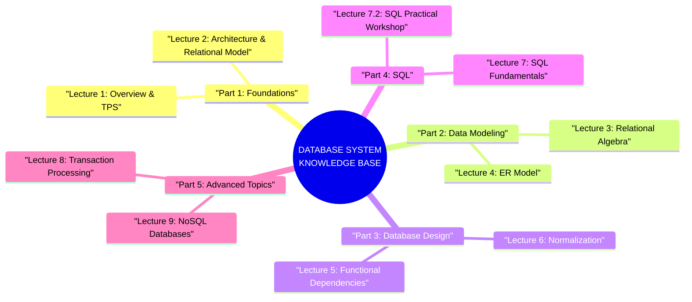

---
tags:
  - database
  - index
  - mega-guide
created: 2026-07-07
updated: 2026-07-07
type: index
---

# Database System - Comprehensive Master Index

> [!SUMMARY] คลังความรู้ Database System ระดับสมบูรณ์แบบ
> นี่คือสารบัญดัชนี (Master Index) ที่รวบรวม **"Mega Guides"** สำหรับหลักสูตรระบบฐานข้อมูล (Database System) เนื้อหาทั้งหมดถูกสรุปอย่างละเอียดจากทุกสไลด์ในทุกบทเรียน ครอบคลุมตั้งแต่ภาพรวมของฐานข้อมูล, สถาปัตยกรรม, Relational Model, SQL, Normalization, Transaction Processing ไปจนถึง NoSQL

---

# 📚 Part 1: The Foundations (รากฐาน)

รากฐานที่สำคัญที่สุดก่อนจะก้าวเข้าสู่โลกของฐานข้อมูล คือการเข้าใจว่า Database คืออะไร, DBMS ทำหน้าที่อะไร, Transaction มีความสำคัญอย่างไร และสถาปัตยกรรมระบบฐานข้อมูลถูกออกแบบมาอย่างไร

- 🔹 **[[Lecture 1 - Overview of Databases and Transaction Processing]]**
  - Database Systems Components (Data, H/W, S/W, Users)
  - Database Definition & DBMS Definition
  - Data Model (Objects + Operators)
  - Benefits of Database (7 ข้อดี)
  - Data Independence
  - Transaction Definition & Transaction Processing System
  - DB Systems: Then and Now (7 มิติเปรียบเทียบ)
  - System Requirements (6 ข้อกำหนด)
  - Roles in TPS Design & Maintenance (5 บทบาท)
- 🔹 **[[Lecture 2 - Database Architecture and Relational Model]]**
  - ANSI/SPARC 3-Level Architecture (External, Conceptual, Internal)
  - Physical, Conceptual, External Data Levels
  - Data Independence (Physical & Logical)
  - Relational Model: Relations, Tuples, Attributes, Domains
  - Relation Schema & Database Schema
  - Integrity Constraints (Static vs Dynamic, Syntactic vs Semantic)
  - Keys: Candidate, Primary, Alternate, Superkey, Foreign Key
  - Foreign Key Constraints ทุกกรณี
  - Inclusion Dependencies & Semantic Constraints

---

# 🏗️ Part 2: Data Modeling (การจำลองข้อมูล)

เจาะลึกวิธีการ query ข้อมูลด้วย Relational Algebra และการออกแบบฐานข้อมูลด้วย ER Model

- 🔹 **[[Lecture 3 - Relational Algebra]]**
  - Relational Query Languages (SQL vs RA)
  - RA ใน DBMS Pipeline (Parser → Optimizer → Code Generator)
  - Set Operators: Union, Intersection, Difference, Cartesian Product
  - Union Compatible Relations
  - Select (σ) ทุกเงื่อนไข + ตัวอย่าง
  - Project (π) + Duplicate Elimination
  - Rename Operator (ρ)
  - Theta Join, Equijoin, Natural Join + ตัวอย่าง
  - Outer Join (Left, Right, Full) + ตัวอย่าง
  - Division + ตัวอย่าง
  - Assignment Operation (←)
  - Aggregate Functions (AVG, MIN, MAX, SUM, COUNT) + GROUP BY
- 🔹 **[[Lecture 4 - ER Model]]**
  - COMPANY Database Requirements
  - ER Diagram Notation Summary (ทุกสัญลักษณ์)
  - Entities, Entity Types, Key Attributes
  - Attribute Types: Simple, Composite, Multi-valued, Derived
  - Relationships & Relationship Types
  - Cardinality Ratios (1:1, 1:N, M:N)
  - (min, max) Notation + ตัวอย่าง
  - Ternary Relationships + Constraints
  - Recursive Relationships & Role Names
  - Weak Entity Types
  - Data Modeling Tools

---

# 🔧 Part 3: Database Design (การออกแบบฐานข้อมูล)

Functional Dependencies คือพื้นฐานของ Normalization ซึ่งเป็นกระบวนการกำจัด redundancy และ update anomalies

- 🔹 **[[Lecture 5 - Functional Dependencies]]**
  - FD Basic Definitions + ตัวอย่างจริง
  - Determinant & Dependent
  - Closure of a Set of Dependencies (FD⁺)
  - Armstrong's Axioms (3 axioms + 5 derived rules)
  - General Unification Theorem (Darwen)
  - Step-by-step Proof ตัวอย่าง (R(A,B,C,G,H,I))
  - FD Diagram สำหรับ Relations S, SP, P
- 🔹 **[[Lecture 6 - Normalization]]**
  - Non-Loss Decomposition (Lossless vs Lossy)
  - 1NF: Definition + FIRST Relation + Update Anomalies
  - 2NF: Definition + SECOND/SP Relations + Remaining Problems
  - 3NF: Definition + SC/CS Relations + Decomposition Choice
  - BCNF: Definition + SJT Example + EXAM Example
  - 4NF: Multi-Valued Dependencies + CTX Example + CT/CX Solution
  - 5NF: Join Dependencies + SPJ Example + BMS Example
- 🔹 **[[Example - Normalization Step by Step]]** *(Deep Dive)*
  - Trace: FIRST → 2NF → 3NF → BCNF step-by-step

---

# 💻 Part 4: SQL (ภาษา SQL)

SQL เป็น "lingua franca" ของโลกฐานข้อมูล — ทั้งทฤษฎีและภาคปฏิบัติ

- 🔹 **[[Lecture 7 - SQL Fundamentals]]**
  - SQL Components (DDL, DML, Views, Integrity, Authorization)
  - CREATE DATABASE/TABLE/INDEX + Data Types
  - DROP TABLE/DATABASE + TRUNCATE
  - ALTER TABLE (ADD/DROP COLUMN)
  - INSERT INTO (ทุกรูปแบบ)
  - UPDATE (Single/Multiple columns)
  - DELETE (Specific/All rows)
  - SELECT: Basic, DISTINCT, WHERE, Operators
  - ORDER BY, LIKE patterns, IN, BETWEEN
  - Aliases (Column/Table)
- 🔹 **[[Lecture 7.2 - SQL Practical Workshop]]**
  - Database Schema ตัวอย่าง (7 ตาราง พร้อม ER Diagram)
  - DDL: CREATE TABLE, CREATE/DROP INDEX
  - DML: INSERT INTO, UPDATE, DELETE
  - SELECT ขั้นสูง: DISTINCT, WHERE, GROUP BY, HAVING
  - ORDER BY (ASC/DESC, Multiple columns)
  - AND & OR combinations
  - LIKE patterns, IN, BETWEEN...AND
  - Aliases (AS)
  - SELECT INTO (MySQL cross-database copy)
  - JOIN: INNER, LEFT, RIGHT
  - UNION & UNION ALL
  - Aggregate Functions: COUNT, MAX, MIN, SUM
  - Subqueries with MAX/MIN
  - CREATE VIEW
- 🔹 **[[Example - SQL JOIN Operations]]** *(Deep Dive)*
  - INNER/LEFT/RIGHT JOIN traces with real data

---

# ⚙️ Part 5: Advanced Topics (หัวข้อขั้นสูง)

Transaction Processing รับประกันความถูกต้องของข้อมูล ในขณะที่ NoSQL เสนอทางเลือกสำหรับข้อมูลขนาดใหญ่

- 🔹 **[[Lecture 8 - Transaction Processing]]**
  - ACID Properties (4 คุณสมบัติ)
  - Transaction States (Active → Committed/Failed → Terminated)
  - Recovery: System Failure vs Media Failure
  - System Recovery Algorithm (UNDO/REDO Lists)
  - Two-Phase Commit (2PC) Protocol
  - Concurrency Problems (Lost Update, Uncommitted Dependency, Inconsistent Analysis)
  - Lock-Based Resolution (X-lock, S-lock)
  - Lock Compatibility Matrix
  - Simple Locking Traces (Chicago/Boston Order Example)
- 🔹 **[[Lecture 9 - NoSQL Databases]]**
  - Brief History of Databases (Timeline)
  - RDBMS Benefits & Weaknesses
  - NoSQL Definition & Characteristics
  - When / When Not to Use NoSQL
  - Schema-less Data Model (Relational vs NoSQL comparison)
  - 4 Aggregate Data Models: Key-Value, Document, Column Family, Graph
  - Cassandra vs MySQL Statistics (Facebook Search)
  - SQL vs NoSQL Comparison Table
  - CAP Theorem (Consistency, Availability, Partition Tolerance)
  - CAP Trade-offs: CA, CP, AP

---

# 📝 Learning Methodology (วิธีการเรียนรู้)

เพื่อให้ได้ประโยชน์สูงสุดจากฐานความรู้นี้ ขอแนะนำให้ผู้เรียนปฏิบัติตามแนวทางต่อไปนี้:
1. **ทฤษฎีก่อนปฏิบัติ:** ศึกษา Lecture Notes เพื่อจับหลักการทำงาน
2. **วาดตาม Diagram:** ทุกบทเรียนมี ER Diagram, FD Diagram, Mermaid ให้ผู้เรียนวาดตาม
3. **เขียน SQL ซ้ำ:** นำ SQL ตัวอย่างไปทดลองรันจริงใน MySQL/PostgreSQL
4. **ทำ Normalization ด้วยมือ:** ฝึกแยกตาราง 1NF → 5NF ด้วยตัวเอง

> *"Data is the new oil. It's valuable, but if unrefined it cannot really be used."* — Clive Humby

---
*Generated and curated autonomously.*
*System Date: 2026-07-07*
