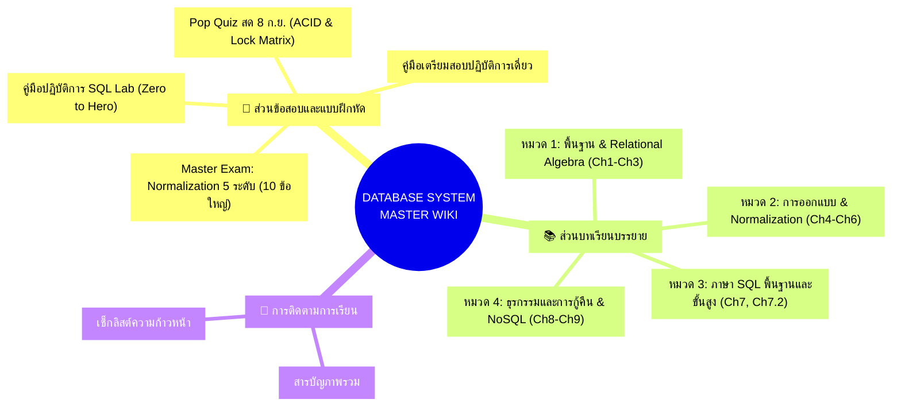

---
tags:
  - database
  - index
  - master-guide
  - exam-prep
created: 2026-07-07
updated: 2026-09-15
type: index
---

# 📚 ระบบฐานข้อมูล (Database System) — สารบัญภาพรวมความรู้และการเตรียมสอบ (Master Index)

> [!IMPORTANT] 🎯 แยกหมวดหมู่ชัดเจน: ส่วนบทเรียน (Lectures) vs ส่วนข้อสอบและแบบฝึกหัด (Exams & Quizzes)
> เพื่อความสะดวกในการเตรียมตัวสอบและการทบทวนบทเรียน คลังความรู้นี้ได้ทำการแบ่งโครงสร้างออกเป็น 2 ส่วนหลักอย่างชัดเจน:
> 1. **ส่วนข้อสอบและแบบฝึกหัด (Exam Zone):** รวมคลังข้อสอบอัตนัย Normalization 5 ระดับ, ข้อสอบควิซสดในห้องเรียน (ACID & Lock Matrix), คู่มือเตรียมสอบเดี่ยว และโจทย์ฝึกปฏิบัติการ
> 2. **ส่วนบทเรียนบรรยาย (Lecture Series):** สรุปเนื้อหาตามสไลด์ PDF บทที่ 1 ถึงบทที่ 9 พร้อมภาพประกอบสไลด์ต้นฉบับ แผนภาพ Mermaid และตาราง Trace Table ครบทุกสไลด์

---

## 🗺️ ตารางโครงสร้างสารบัญหลัก (Master Navigation Map)

### 🎯 1. ส่วนข้อสอบ ควิซในห้องเรียน และคลังโจทย์ฝึกฝน (Exam Zone)

| ชื่อเอกสารข้อสอบ | ประเภท / หัวข้อหลัก | รายละเอียดเนื้อหาสำคัญ | ลิงก์เข้าสู่เอกสาร |
| :--- | :--- | :--- | :---: |
| **🍰 ปูพื้นฐาน Normalization เข้าใจง่าย (ตารางล้วน No SQL)** | คู่มือเริ่มต้นแบบเห็นภาพทันที | อธิบาย 1NF ถึง 5NF ด้วยตัวอย่างร้านคาเฟ่ชา-เบเกอรี่ ไม่ต้องมีโค้ด SQL มีแค่ภาพตารางเปรียบเทียบก่อน-หลังหั่นตาราง ชัดเจนที่สุด | [[Beginner Guide - Normalization Easy Steps (Tables Only)]] |
| **🎯 10 ตัวอย่างชีวิตประจำวัน (ตารางล้วน No SQL)** | คลังตัวอย่างง่าย 10 ธุรกิจจริง | รวม 10 ธุรกิจจริง (ชาบู, คลินิกสัตว์, ร้านซ่อมมือถือ, ฟิตเนส, หอพัก, ส่งพัสดุ ฯลฯ) โชว์ตาราง Before vs After ตัดข้อมูลซ้ำซ้อนเข้าใจง่าย 100% | [[10 Everyday Normalization Examples - Visual Tables Only]] |
| **🎯 คลังข้อสอบอัตนัย ER Diagram 10 ข้อหลักการสร้างแม่นยำ** | คลังข้อสอบอัตนัย 10 โดเมนธุรกิจ | ออกแบบ ER Model ตามมาตรฐาน Chen และ Crow's foot (Strong/Weak Entity, Multi-valued, Derived, Unary/Ternary) พร้อมเฉลยและแปลงเป็น Relational Schema ละเอียดยิบ | [[Master Exam - 10 ER Diagram Practice Problems with Detailed Solutions]] |
| **คลังข้อสอบ Normalization 5 ระดับ** | คลังข้อสอบอัตนัย 10 ข้อใหญ่ | เจาะลึกกระบวนการ Decomposition ครบ 5 ระดับ (UNF → 1NF → 2NF → 3NF → BCNF → 4NF/5NF) พร้อมตาราง Trace Table และวิเคราะห์ Update Anomalies ละเอียดยิบ | [[Master Exam - 5-Level Normalization Intensive Practice]] |
| **ข้อสอบควิซในห้องเรียนจริง** | Pop Quiz & บรรยายสด (8 ก.ย.) | ถอดเทปบรรยายสดและเฉลยข้อสอบเขียนกระดาษ A4: คุณสมบัติ ACID, ตาราง Lock Matrix (S/X Lock) และการกู้คืน 5 Transactions หลัง Server Crash | [[In-Class Pop Quiz and Classroom Lecture - Transaction & ACID]] |
| **คู่มือเตรียมสอบปฏิบัติการเดี่ยว** | Comprehensive Practical Guide | สรุปเกณฑ์การสอบในคาบ 50-60 นาที เทคนิคการสแกน Anomalies 3 แบบ, การเขียน FDs และการเขียน SQL Query ขั้นสูง | [[In-Class Exam Guide - Normalization and SQL]] |
| **คู่มือปฏิบัติการ SQL Lab (Zero to Hero)** | Hands-on Interactive Lab | คู่มือฝึกเขียนคำสั่ง SQL ตั้งแต่ CREATE TABLE, INSERT, UPDATE, DELETE, JOIN, GROUP BY ไปจนถึง Subquery พร้อมเปิดทดสอบในระบบ SQL Lab | [[SQL Lab Practice Guide - Zero to Hero]] |

---

### 📚 2. ส่วนบทเรียนบรรยายตามสไลด์ (Lecture Series บทที่ 1 - บทที่ 9)

#### หมวดที่ 1: รากฐานฐานข้อมูลและพีชคณิตเชิงสัมพันธ์ (Foundations & Relational Algebra)
- 🔹 **[[Lecture 1 - Overview of Databases and Transaction Processing]]**
  - สถาปัตยกรรมระบบฐานข้อมูล ส่วนประกอบ H/W, S/W, Data, Users
  - นิยามของ Transaction และ Transaction Processing System (TPS)
  - ภาพสไลด์ต้นฉบับ Ch1 (Slide 1-18) พร้อมคำอธิบายภาษาไทย
- 🔹 **[[Lecture 2 - Database Architecture and Relational Model]]**
  - ANSI/SPARC 3-Level Architecture (External, Conceptual, Internal)
  - ความเป็นอิสระของข้อมูล (Physical vs Logical Data Independence)
  - โมเดลเชิงสัมพันธ์ (Relational Model), Relation, Tuple, Attribute, Domain
  - คีย์ประเภทต่างๆ: Superkey, Candidate Key, Primary Key, Foreign Key
  - ภาพสไลด์ต้นฉบับ Ch2 (Slide 1-35)
- 🔹 **[[Lecture 3 - Relational Algebra]]**
  - โอเปอเรเตอร์ทางพีชคณิต: Selection (σ), Projection (π), Cartesian Product (×)
  - Set Operators: Union (∪), Intersection (∩), Difference (−)
  - Derived Operators: Natural Join (⋈), Theta Join, Outer Join, Division (÷)
  - Aggregate Functions และการประมวลผลคำสั่งเชิงคณิตศาสตร์
  - ภาพสไลด์ต้นฉบับ Ch3 (Slide 1-40)

#### หมวดที่ 2: การออกแบบฐานข้อมูลและนอร์มัลไลเซชัน (Data Modeling & Normalization)
- 🔹 **[[Lecture 4 - ER Model]]**
  - สัญลักษณ์มาตรฐาน Chen's Notation (Entity, Weak Entity, Relationship, Attribute)
  - Cardinality Ratios (1:1, 1:N, M:N) และ (min, max) Constraints
  - ความสัมพันธ์ระดับสูง Ternary Relationships และ Recursive Relationships
  - ภาพสไลด์ต้นฉบับ Ch4 (Slide 1-30) ครบทุกหน้า
- 🔹 **[[Lecture 5 - Functional Dependencies]]**
  - นิยามความขึ้นต่อกันเชิงฟังก์ชัน (X → Y)
  - Determinant (ตัวกำหนด) vs Dependent (ตัวถูกกำหนด)
  - สัจพจน์ของอาร์มสตรอง (Armstrong's Axioms) และการหา Closure (FD⁺)
  - กฎการพิสูจน์ FDs (Reflexivity, Augmentation, Transitivity, Union, Decomposition)
  - ภาพสไลด์ต้นฉบับ Ch5 (Slide 1-13)
- 🔹 **[[Lecture 6 - Database Design and Normalization]]**
  - ทฤษฎี Non-Loss Decomposition (Lossless-Join)
  - เจาะลึกระดับ 1NF, 2NF, 3NF, BCNF, 4NF (MVD), และ 5NF (Join Dependency)
  - ปัญหา Update Anomalies (Insert, Delete, Update) และการแก้ไข
  - ภาพสไลด์ต้นฉบับ Ch6 (Slide 1-31) ครบทุกหน้า

#### หมวดที่ 3: ภาษา SQL พื้นฐานและคิวรีขั้นสูง (SQL Mastery)
- 🔹 **[[Lecture 7 (Part 1) - SQL Fundamentals (Slide 1-40)]]**
  - แนะนำภาษา SQL, การสร้างฐานข้อมูลและตาราง (CREATE TABLE)
  - การกำหนด Data Types, Constraints (PRIMARY KEY, NOT NULL, UNIQUE)
  - การจัดการข้อมูล DML: INSERT INTO, UPDATE, DELETE
  - การสืบค้นพื้นฐาน: SELECT, WHERE, ORDER BY, LIKE, BETWEEN, IN
- 🔹 **[[Lecture 7 (Part 2) - SQL Fundamentals (Slide 41-80)]]**
  - การเชื่อมโยงข้อมูลหลายตาราง: INNER JOIN, LEFT JOIN, RIGHT JOIN, FULL OUTER JOIN
  - ฟังก์ชันคำนวณกลุ่มข้อมูล: COUNT, SUM, AVG, MIN, MAX
  - การจัดกลุ่มและกรองผลลัพธ์: GROUP BY และ HAVING Clause
- 🔹 **[[Lecture 7 (Part 3) - SQL Fundamentals (Slide 81-94)]]**
  - การแก้ไขโครงสร้างตาราง (ALTER TABLE, DROP TABLE, TRUNCATE)
  - การจัดการความถูกต้องของข้อมูล (Integrity Constraints) และดัชนี (Indexes)
- 🔹 **[[Lecture 7.5 (Part 1) - Advanced SQL (Slide 1-40)]]**
  - คำสั่ง SQL ขั้นสูง: Subqueries (Single-row vs Multi-row Subqueries)
  - การสร้างและบริหารมุมมองข้อมูลเสมือน (CREATE VIEW)
- 🔹 **[[Lecture 7.5 (Part 2) - Advanced SQL (Slide 41-79)]]**
  - คิวรีเชื่อมโยงภายใน (Correlated Subqueries)
  - การใช้งานตัวดำเนินการ EXISTS และ NOT EXISTS
  - Window Functions และการวิเคราะห์ข้อมูลระดับองค์กร

#### หมวดที่ 4: การประมวลผลธุรกรรมและสถาปัตยกรรมระดับสูง (Enterprise Architecture & NoSQL)
- 🔹 **[[Lecture 8 - Database System Architecture]]**
  - Transaction Management และคุณสมบัติ ACID Properties
  - วงจรสถานะของ Transaction (Active, Partially Committed, Committed, Failed, Aborted)
  - ปัญหาการทำงานพร้อมกัน (Lost Update, Dirty Read, Inconsistent Analysis)
  - กลไกการล็อก (Locking Mechanism) และตาราง Lock Compatibility Matrix (S/X Lock)
  - การควบคุม Two-Phase Locking (2PL) และการกู้คืนระบบหลังการล่ม (Crash Recovery)
  - ภาพสไลด์ต้นฉบับ Ch8 (Slide 1-19)
- 🔹 **[[Lecture 9 - NoSQL Databases]]**
  - กำเนิดและแนวคิดของฐานข้อมูล NoSQL
  - ทฤษฎี CAP Theorem (Consistency, Availability, Partition Tolerance)
  - โครงสร้าง 4 ประเภท: Key-Value, Document, Column Family, Graph Databases
  - ภาพสไลด์ต้นฉบับ Ch9 (Slide 1-31)
- 🔹 **[[In-Class Lecture - NoSQL, Big Data & CAP Theorem]]**
  - **สรุปถอดเทปเสียงบรรยายสดในห้องเรียนฉบับเต็ม (15 ก.ย. 2569):**
  - ข้อจำกัดของ RDBMS เมื่อขยายบนระบบกระจายศูนย์ (Join are expensive, Hard to scale, Impedance mismatch)
  - คุณลักษณะ Big Data 5 Vs (Volume, Velocity, Variety, Veracity, Value)
  - เจาะลึก 4 Data Models: Key-Value (DynamoDB), Column Family (Cassandra เขียนเร็ว 0.12ms), Graph (Neo4j แกะรอย Social & โรคระบาด), Document (MongoDB)
  - ทฤษฎีบท CAP Theorem (Brewer's Theorem: CA vs CP vs AP)
  - นัดหมายเรียนภาคปฏิบัติการ Lab 2 สัปดาห์, ส่งงานกลุ่ม ER Diagram และแนวข้อสอบปลายภาค 40 คะแนนเต็ม (3 ชั่วโมง)

---

### 📌 3. สารบัญและเช็กลิสต์ติดตามผล (Study Tracker)
- 📋 **[[Progress Checklist]]** — ตารางบันทึกความก้าวหน้าในการอ่านและฝึกทำโจทย์รายบุคคล

---

```mermaid
mindmap
  root((DATABASE SYSTEM<br/>MASTER WIKI))
    Exams["🎯 ส่วนข้อสอบและแบบฝึกหัด"]
      Norm5NF["Master Exam: Normalization 5 ระดับ (10 ข้อใหญ่)"]
      PopQuiz["Pop Quiz สด 8 ก.ย. (ACID & Lock Matrix)"]
      InClassGuide["คู่มือเตรียมสอบปฏิบัติการเดี่ยว"]
      SqlLabGuide["คู่มือปฏิบัติการ SQL Lab (Zero to Hero)"]
    Lectures["📚 ส่วนบทเรียนบรรยาย"]
      P1["หมวด 1: พื้นฐาน & Relational Algebra (Ch1-Ch3)"]
      P2["หมวด 2: การออกแบบ & Normalization (Ch4-Ch6)"]
      P3["หมวด 3: ภาษา SQL พื้นฐานและขั้นสูง (Ch7, Ch7.2)"]
      P4["หมวด 4: ธุรกรรมและการกู้คืน & NoSQL (Ch8-Ch9)"]
    Track["📌 การติดตามการเรียน"]
      MasterIdx["สารบัญภาพรวม"]
      Checklist["เช็กลิสต์ความก้าวหน้า"]
```
