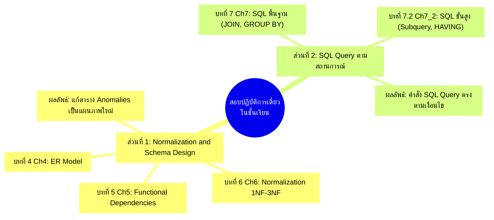
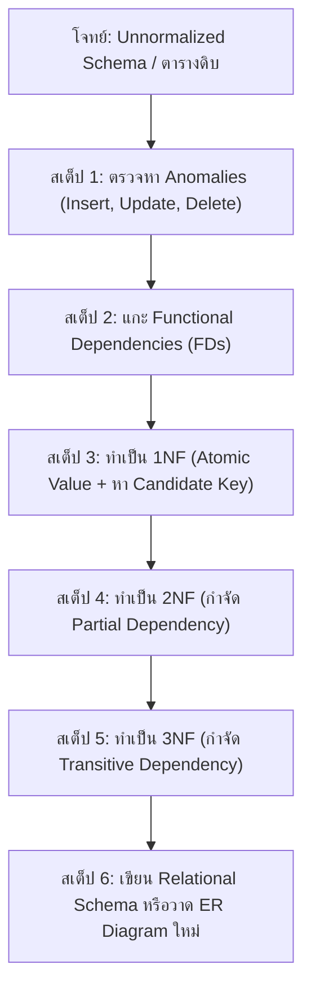

---
tags:
  - exam
  - normalization
  - sql
  - in-class-test
  - ch4
  - ch5
  - ch6
  - ch7
  - ch7_2
created: 2026-09-08
updated: 2026-09-08
type: exam-guide
---

# 🎯 คู่มือเตรียมสอบปฏิบัติการเดี่ยวในชั้นเรียน (In-Class Practical Exam Guide)
## การทำ Normalization, การออกแบบ Schema/ER, และการเขียน SQL Query

> [!SUMMARY] ข้อมูลสำคัญเกี่ยวกับการสอบเก็บคะแนน
> - **รูปแบบ:** การทดสอบเดี่ยว (ห้ามทำเป็นกลุ่ม)
> - **ระยะเวลา:** ต้องทำและส่งให้เสร็จสิ้นภายในชั่วโมงเรียน (ประมาณ 50 - 60 นาที)
> - **หัวข้อหลักที่ออกสอบ:**
>   1. **การทำ Normalization & การออกแบบแผนภาพ (ER Diagram / Relational Schema):** โจทย์จะให้แผนภาพหรือตารางที่ยังไม่ Normalize (Unnormalized) มา ให้นักศึกษาแก้ไขและออกแบบใหม่ให้เป็น 3NF / BCNF
>   2. **การเขียนคำสั่ง SQL:** โจทย์ให้สถานการณ์ความต้องการข้อมูลมา แล้วให้นักศึกษาเขียน SQL Query ให้ถูกต้องตรงเงื่อนไข



---

# 🗺️ แมปปิ้งบทเรียน: บทไหนใช้สอบอะไร?

เพื่อให้เห็นภาพชัดเจนที่สุด นี่คือตารางสรุปว่าบทเรียนในสไลด์ (Lectures) สัมพันธ์กับข้อสอบอย่างไร:

| บทเรียนในสไลด์ | หัวข้อหลัก | อยู่ในข้อสอบส่วนไหน? | ความสำคัญ |
|---|---|---|---|
| **บทที่ 1 (Ch1)** | Overview & TPS | ทฤษฎีพื้นฐาน (ไม่ออกปฏิบัติการ) | ⭐⭐ |
| **บทที่ 2 (Ch2)** | Architecture & Relational Model | ทฤษฎี Keys, Relational Constraints | ⭐⭐⭐ |
| **บทที่ 3 (Ch3)** | Relational Algebra (σ, π, ⨝) | ทฤษฎีพีชคณิต (เป็นฐานคิดของ SQL) | ⭐⭐⭐ |
| **บทที่ 4 (Ch4)** | **ER Model (Entity, Relationship)** | **🎯 ข้อสอบส่วนที่ 1: ออกแบบแผนภาพใหม่** | ⭐⭐⭐⭐⭐ |
| **บทที่ 5 (Ch5)** | **Functional Dependencies (FDs)** | **🎯 ข้อสอบส่วนที่ 1: หาความสัมพันธ์ก่อนหั่นตาราง** | ⭐⭐⭐⭐⭐ |
| **บทที่ 6 (Ch6)** | **Normalization (1NF, 2NF, 3NF, BCNF)** | **🎯 ข้อสอบส่วนที่ 1: หั่นตารางแก้ปัญหา Anomalies** | ⭐⭐⭐⭐⭐ |
| **บทที่ 7 (Ch7)** | **SQL Fundamentals (SELECT, JOIN, GROUP BY)** | **🎯 ข้อสอบส่วนที่ 2: เขียน Query ตามสถานการณ์** | ⭐⭐⭐⭐⭐ |
| **บทที่ 7.2 (Ch7_2)**| **Advanced SQL (Subqueries, HAVING, EXISTS)** | **🎯 ข้อสอบส่วนที่ 2: โจทย์เงื่อนไขซับซ้อน** | ⭐⭐⭐⭐⭐ |
| **บทที่ 8 (Ch8)** | Transaction & Architecture | ทฤษฎีระบบขั้นสูง (ไม่ออกสอบปฏิบัติการ) | ⭐⭐ |
| **บทที่ 9 (Ch9)** | NoSQL Databases | ทฤษฎี NoSQL (ไม่ออกสอบปฏิบัติการ) | ⭐⭐ |

---

# ภาคที่ 1: กลยุทธ์ตีแตกข้อสอบ Normalization & ออกแบบ Schema

ข้อสอบจะให้ **"ตารางหรือแผนภาพที่ยังไม่ผ่าน Normalization"** มา 1 ชุด ซึ่งเต็มไปด้วยปัญหาความซ้ำซ้อน (Redundancy)



## สเต็ป 1: เขียนระบุ Anomalies ทั้ง 3 แบบ (เก็บแต้มข้อแรก)
เมื่อเห็นตารางดิบ ให้มองหาจุดที่มีปัญหาทันที:
1. **Insertion Anomaly (ปัญหาการเพิ่มข้อมูล):** เช่น ถ้าจะเพิ่มวิชาใหม่ แต่ยังไม่มีนักศึกษาลงทะเบียน จะบันทึกลงตารางไม่ได้ เพราะ Primary Key มีค่า NULL ไม่ได้
2. **Deletion Anomaly (ปัญหาการลบข้อมูล):** เช่น ถ้าลบข้อมูลนักศึกษาคนสุดท้ายที่ลงวิชานั้น ข้อมูลของรายวิชานั้นจะสูญหายไปด้วยทันที
3. **Update Anomaly (ปัญหาการแก้ไขข้อมูล):** เช่น ถ้าอาจารย์เปลี่ยนชื่อ หรือสินค้าราคาเปลี่ยน ต้องตามไปแก้หลายสิบบรรทัด ถ้าแก้ไม่ครบ ข้อมูลจะขัดแย้งกัน (Data Inconsistency)

## สเต็ป 2: หา Functional Dependencies (FDs)
ให้เขียนสมการความสัมพันธ์ $X \rightarrow Y$ ($X$ เป็นตัวระบุค่า $Y$):
- **Full Dependency:** Prime Key ทั้งก้อนระบุค่า Attribute นั้น
- **Partial Dependency:** ส่วนใดส่วนหนึ่งของ Composite PK ระบุค่า Attribute นั้นได้ (ต้องกำจัดใน 2NF)
- **Transitive Dependency:** Non-key ระบุ Non-key อีกตัวหนึ่งได้ เช่น `StudentID -> DeptID` และ `DeptID -> DeptName` (ต้องกำจัดใน 3NF)

## สเต็ป 3: กฎเหล็กการแปลงทีละระดับ (Decomposition)
- **1NF:** ค่าในแต่ละช่องต้องเป็นค่าเดี่ยว (Atomic Values) ไม่มี Repeating Group และต้องกำหนด Primary Key (มักจะเป็น Composite Key)
- **2NF:** ต้องเป็น 1NF และ **ไม่มี Partial Dependency** (ถ้าตารางไหนมี Composite PK เช่น `(OrderID, ProductID)` ให้แยก Attribute ที่ขึ้นกับแค่ `ProductID` ไปตั้งตารางใหม่)
- **3NF:** ต้องเป็น 2NF และ **ไม่มี Transitive Dependency** (Attribute ที่ไม่ใช่คีย์ ห้ามไประบุ Attribute ที่ไม่ใช่คีย์ด้วยกัน ถ้าเจอ ให้แยกไปตั้งตารางใหม่)

## สเต็ป 4: การส่งคำตอบ Schema และ ER Diagram
เขียนระบุ Schema ในรูปแบบมาตรฐาน:
- ตารางหลัก: `TABLE_NAME (`<u>`PRIMARY_KEY`</u>`, Attr1, Attr2, ...)`
- ตารางที่อ้างอิง: `CHILD_TABLE (`<u>`CHILD_PK`</u>`, ... `*`PARENT_FK`*`)`
- **Foreign Key:** ระบุว่า `PARENT_FK REFERENCES PARENT_TABLE(PRIMARY_KEY)`

---

# ภาคที่ 2: กลยุทธ์ตีแตกข้อสอบเขียนคำสั่ง SQL Query

ในส่วนของ SQL อาจารย์จะให้ **สถานการณ์ความต้องการข้อมูลทางธุรกิจ (Business Scenario)** มา 4 - 6 ข้อ

### 6 แพทเทิร์นคำสั่ง SQL ที่ออกสอบ 100%:

### 1. Pattern พื้นฐาน: Filter + Sort + Limit
- **สถานการณ์:** "จงแสดงรายชื่อลูกค้าที่อาศัยอยู่ในกรุงเทพฯ และมียอดซื้อมากกว่า 1,000 บาท เรียงจากมากไปน้อย 5 อันดับแรก"
```sql
SELECT customer_name, total_amount, city
FROM customers
WHERE city = 'Bangkok' AND total_amount > 1000
ORDER BY total_amount DESC
LIMIT 5;
```

### 2. Pattern เชื่อมโยงข้อมูล: Multi-Table INNER JOIN
- **สถานการณ์:** "จงแสดงรหัสคำสั่งซื้อ ชื่อลูกค้า และชื่อสินค้าที่สั่งซื้อทั้งหมด"
```sql
SELECT o.order_id, c.customer_name, p.product_name, oi.quantity
FROM orders o
JOIN customers c ON o.customer_id = c.customer_id
JOIN order_items oi ON o.order_id = oi.order_id
JOIN products p ON oi.product_id = p.product_id;
```

### 3. Pattern การจัดกลุ่มคำนวณ: GROUP BY + Aggregates
- **สถานการณ์:** "จงหายอดขายรวม (SUM) และจำนวนออเดอร์ (COUNT) แยกตามแต่ละหมวดหมู่สินค้า"
```sql
SELECT category, COUNT(order_id) AS total_orders, SUM(price * quantity) AS total_sales
FROM order_details
GROUP BY category;
```

### 4. Pattern กรองกลุ่มข้อมูล: HAVING vs WHERE (กับดักยอดฮิต!)
- **สถานการณ์:** "จงหาแผนกที่มีเงินเดือนเฉลี่ยสูงกว่า 50,000 บาท"
- **ข้อควรระวัง:** ห้ามใส่ `WHERE AVG(salary) > 50000` เด็ดขาด! (SQL จะ Error ทันที เพราะ WHERE รันก่อนการรวมกลุ่ม)
```sql
SELECT department_id, AVG(salary) AS avg_salary
FROM employees
GROUP BY department_id
HAVING AVG(salary) > 50000;
```

### 5. Pattern ค้นหาสิ่งที่ "ไม่เคยเกิดขึ้น": LEFT JOIN + IS NULL
- **สถานการณ์:** "จงหารายชื่อลูกค้าที่ไม่เคยสั่งซื้อสินค้าเลยแม้แต่ครั้งเดียว"
```sql
SELECT c.customer_id, c.customer_name
FROM customers c
LEFT JOIN orders o ON c.customer_id = o.customer_id
WHERE o.order_id IS NULL;
```

### 6. Pattern ขั้นสูง (Ch 7.2): Subquery หรือ Correlated Subquery
- **สถานการณ์:** "จงหาพนักงานที่ได้รับเงินเดือนสูงกว่าค่าเฉลี่ยของบริษัท"
```sql
SELECT employee_name, salary
FROM employees
WHERE salary > (SELECT AVG(salary) FROM employees);
```

---

# 📝 ชุดข้อสอบจำลองเสมือนจริง (Mock Exam 1 ชั่วโมง)

ลองจับเวลาทำ 50 นาที แล้วเทียบกับเฉลยด้านล่าง:

### สถานการณ์: ระบบคลินิกรักษาพยาบาล (Clinic Management System)

ตารางดิบที่ยังไม่ Normalize:
```
CLINIC_RECORDS (
    PatientID, PatientName, Phone, DoctorID, DoctorName, ClinicRoom, AppointmentDate, Fee
)
```
- ผู้ป่วย 1 คน (`PatientID`) มีชื่อและเบอร์โทร
- แพทย์ 1 คน (`DoctorID`) มีชื่อและห้องตรวจประจำ (`ClinicRoom`)
- ในวันนัด (`AppointmentDate`) ผู้ป่วยจะมาพบแพทย์ และมีค่าตรวจ (`Fee`)

---

## 📋 ข้อที่ 1: การทำ Normalization (คะแนนเต็ม 50%)

1. **จงระบุปัญหา Update Anomaly และ Deletion Anomaly ของตารางนี้**
2. **จงเขียน Functional Dependencies (FDs) ทั้งหมด**
3. **จงทำการ Decomposition ตารางนี้ให้อยู่ในระดับ 3NF อย่างละเอียด พร้อมระบุ Primary Key และ Foreign Key**
4. **เขียน Relational Schema ใหม่ที่ถูกต้อง**

---

## 💻 ข้อที่ 2: การเขียน SQL Query (คะแนนเต็ม 50%)

จากตารางที่ Normalize แล้วในข้อ 1 จงเขียนคำสั่ง SQL:
1. **Query 1:** จงแสดงชื่อผู้ป่วยและวันนัดตรวจของแพทย์ชื่อ 'Dr. Somsak'
2. **Query 2:** จงหาจำนวนคนไข้ทั้งหมดที่แพทย์แต่ละคนตรวจ พร้อมเรียงจากมากไปน้อย
3. **Query 3:** จงหาแพทย์ที่มีคนไข้นัดตรวจรวมแล้วมากกว่า 5 ครั้ง
4. **Query 4:** จงหารายชื่อแพทย์ที่ยังไม่มีคนไข้นัดตรวจเลยในระบบ

---

# 🔑 เฉลยข้อสอบจำลอง (Step-by-Step Solution)

## เฉลยข้อ 1: Normalization

### 1. การวิเคราะห์ Anomalies:
- **Deletion Anomaly:** ถ้าคนไข้คนเดียวยกเลิกนัด ข้อมูลห้องตรวจของ `DoctorID` นั้นอาจจะหายไปจากระบบด้วย
- **Update Anomaly:** ถ้าแพทย์เปลี่ยนห้องตรวจ (`ClinicRoom`) จะต้องไล่อัปเดตทุกแถวที่มีคนไข้นัดแพทย์คนนี้ หากแก้ไม่ครบข้อมูลจะขัดแย้งกัน

### 2. Functional Dependencies:
- $FD_1: \text{PatientID} \rightarrow \text{PatientName, Phone}$ (Partial Dep)
- $FD_2: \text{DoctorID} \rightarrow \text{DoctorName, ClinicRoom}$ (Partial Dep)
- $FD_3: (\text{PatientID, DoctorID, AppointmentDate}) \rightarrow \text{Fee}$ (Full Dep)

### 3. Decomposition สู่ 3NF:
- ตารางเดิมมี Composite Key: `(PatientID, DoctorID, AppointmentDate)`
- มี Partial Dependencies ($FD_1$ และ $FD_2$) จึงไม่เป็น 2NF
- **หั่นเป็น 3 ตารางในระดับ 3NF:**
  1. `PATIENTS (`<u>`PatientID`</u>`, PatientName, Phone)`
  2. `DOCTORS (`<u>`DoctorID`</u>`, DoctorName, ClinicRoom)`
  3. `APPOINTMENTS (`<u>`PatientID, DoctorID, AppointmentDate`</u>`, Fee)`
     - *FK 1: PatientID REFERENCES PATIENTS(PatientID)*
     - *FK 2: DoctorID REFERENCES DOCTORS(DoctorID)*

---

## เฉลยข้อ 2: SQL Query

### Query 1: ค้นหาคนไข้ของ Dr. Somsak
```sql
SELECT p.PatientName, a.AppointmentDate
FROM APPOINTMENTS a
JOIN PATIENTS p ON a.PatientID = p.PatientID
JOIN DOCTORS d ON a.DoctorID = d.DoctorID
WHERE d.DoctorName = 'Dr. Somsak';
```

### Query 2: จำนวนคนไข้แยกตามแพทย์ เรียงจากมากไปน้อย
```sql
SELECT d.DoctorID, d.DoctorName, COUNT(a.PatientID) AS TotalPatients
FROM DOCTORS d
LEFT JOIN APPOINTMENTS a ON d.DoctorID = a.DoctorID
GROUP BY d.DoctorID, d.DoctorName
ORDER BY TotalPatients DESC;
```

### Query 3: แพทย์ที่มีคนไข้มากกว่า 5 ครั้ง (ใช้ HAVING)
```sql
SELECT d.DoctorID, d.DoctorName, COUNT(a.PatientID) AS TotalAppointments
FROM DOCTORS d
JOIN APPOINTMENTS a ON d.DoctorID = a.DoctorID
GROUP BY d.DoctorID, d.DoctorName
HAVING COUNT(a.PatientID) > 5;
```

### Query 4: แพทย์ที่ยังไม่มีคนไข้นัดเลย (LEFT JOIN ... IS NULL)
```sql
SELECT d.DoctorID, d.DoctorName, d.ClinicRoom
FROM DOCTORS d
LEFT JOIN APPOINTMENTS a ON d.DoctorID = a.DoctorID
WHERE a.PatientID IS NULL;
```
