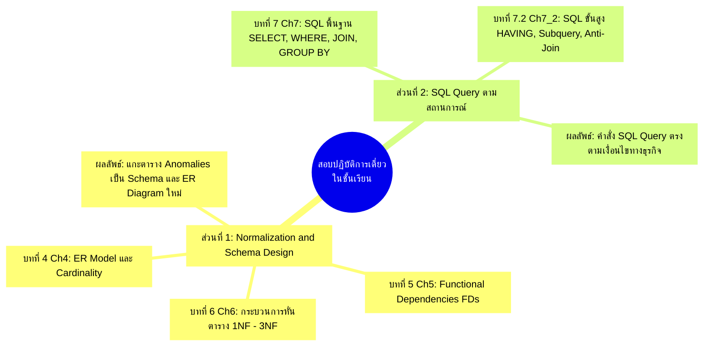
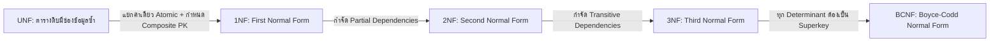
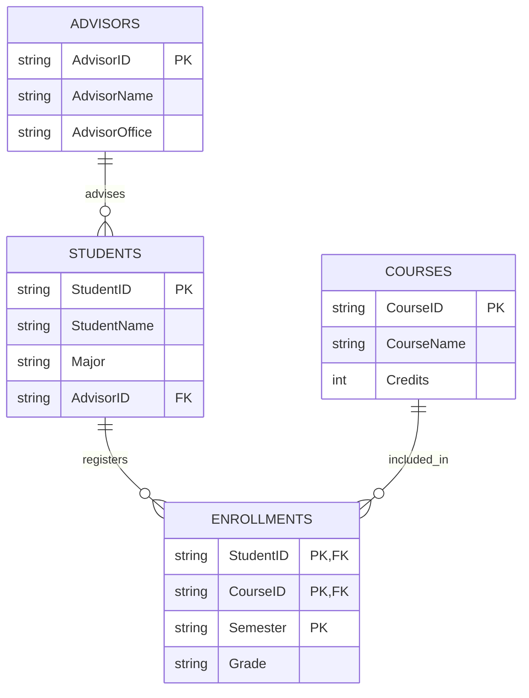
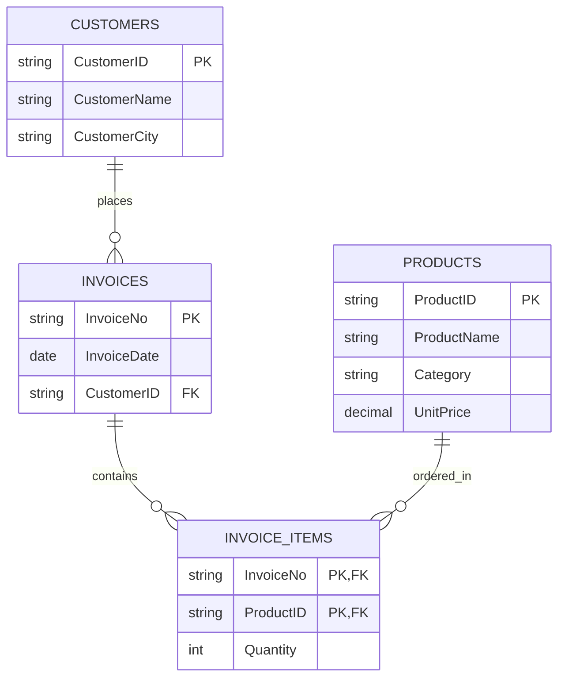
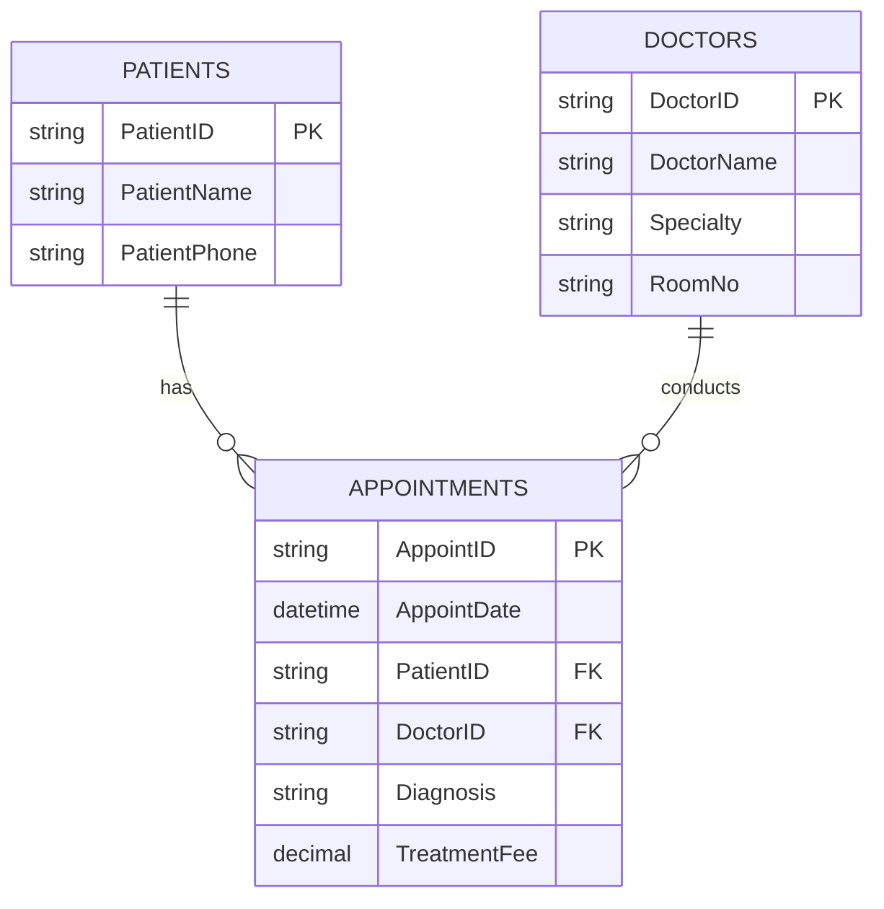
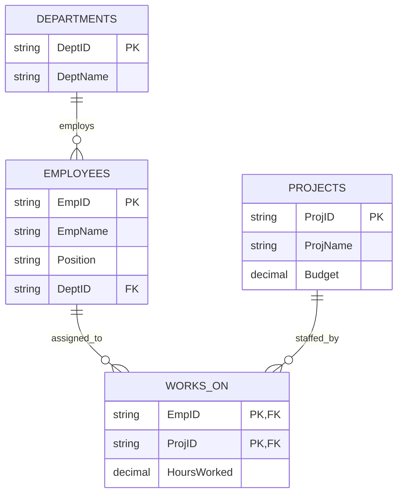
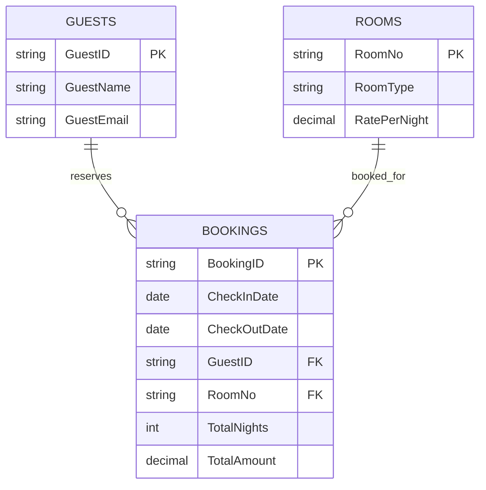

---
tags:
  - exam
  - normalization
  - sql
  - in-class-test
  - ch4
  - ch5
  - ch6
  - ch7
  - ch7_2
created: 2026-09-08
updated: 2026-09-08
type: exam-guide
---

# 🎯 คลังข้อสอบจำลองและคู่มือเตรียมสอบปฏิบัติการเดี่ยวในชั้นเรียน (In-Class Practical Exam Master Guide)
## การทำ Normalization, การออกแบบ Schema/ER Diagram, และการเขียนคำสั่ง SQL Query เชิงลึก

> [!SUMMARY] ข้อมูลสำคัญเกี่ยวกับการสอบเก็บคะแนนรายคาบ
> - **รูปแบบ:** การทดสอบเดี่ยว (Individual Practical Exam — ห้ามทำเป็นกลุ่มเด็ดขาด)
> - **เวลาสอบ:** ต้องทำและส่งให้เสร็จสิ้นภายในชั่วโมงเรียน (ประมาณ 50 - 60 นาทีต่อครั้ง)
> - **โครงสร้างข้อสอบ 2 ส่วนหลัก:**
>   1. **ส่วนที่ 1: การทำ Normalization & ออกแบบ Schema/ER Diagram (50 คะแนน):**
>      - โจทย์จะให้ตารางข้อมูลหรือแผนภาพดิบที่ยังไม่ผ่าน Normalization (Unnormalized / เต็มไปด้วย Anomalies)
>      - นักศึกษาต้องวิเคราะห์ Anomalies ทั้ง 3 รูปแบบ (Insert, Update, Delete)
>      - เขียน Functional Dependencies (FDs)
>      - ทำการแตกตาราง (Decomposition) ตามลำดับ 1NF $\rightarrow$ 2NF $\rightarrow$ 3NF
>      - สรุปผลลัพธ์เป็น Relational Schema พร้อมระบุ Primary Key (PK) และ Foreign Key (FK) และวาดแผนภาพ ER Diagram / Relational Diagram ใหม่
>   2. **ส่วนที่ 2: การเขียนคำสั่ง SQL Query ตามสถานการณ์ที่กำหนด (50 คะแนน):**
>      - มีโจทย์ความต้องการข้อมูลทางธุรกิจ (Business Requirement)
>      - นักศึกษาต้องเขียน Query ให้ถูกต้อง แม่นยำ ครอบคลุมทั้ง WHERE, Multi-Table JOIN, GROUP BY, HAVING, Subquery และ IS NULL
> - **ห้องทดลองฝึกปฏิบัติการ:** สามารถเปิดรันและทดสอบคำสั่ง SQL จริงทั้งหมดได้ใน [[SQL Lab Practice Guide - Zero to Hero]] หรือเว็บ **SQL Lab Studio** (`SqlLab/`)



---

# 🗺️ แมปปิ้งบทเรียน: สไลด์บทไหนสัมพันธ์กับข้อสอบอย่างไร?

| บทเรียนในสไลด์ | หัวข้อหลัก | ออกสอบในส่วนใด? | ความสำคัญในห้องสอบ |
|---|---|---|:---:|
| **บทที่ 1 (Ch1)** | Overview & Transaction Processing | ทฤษฎีแนวคิด ACID (ไม่ออกปฏิบัติการ) | ⭐⭐ |
| **บทที่ 2 (Ch2)** | Architecture & Relational Model | ความเข้าใจเรื่อง Primary Key, Foreign Key, Domain | ⭐⭐⭐ |
| **บทที่ 3 (Ch3)** | Relational Algebra (Selection, Projection, Join) | รากฐานตรรกะเบื้องหลัง SQL Query | ⭐⭐⭐ |
| **บทที่ 4 (Ch4)** | **ER Model (Entity, Relationship, Cardinality)** | **🎯 ข้อสอบส่วนที่ 1: วาดแผนภาพและแปลงเป็นตาราง** | ⭐⭐⭐⭐⭐ |
| **บทที่ 5 (Ch5)** | **Functional Dependencies (Full, Partial, Transitive)** | **🎯 ข้อสอบส่วนที่ 1: เขียนสมการ FDs ก่อนหั่นตาราง** | ⭐⭐⭐⭐⭐ |
| **บทที่ 6 (Ch6)** | **Normalization (1NF, 2NF, 3NF, Lossless Join)** | **🎯 ข้อสอบส่วนที่ 1: สเต็ปการหั่นตารางแก้ปัญหา Anomalies** | ⭐⭐⭐⭐⭐ |
| **บทที่ 7 (Ch7)** | **SQL Fundamentals (SELECT, WHERE, JOIN, GROUP BY)** | **🎯 ข้อสอบส่วนที่ 2: เขียนคำสั่ง Query พื้นฐาน-ปานกลาง** | ⭐⭐⭐⭐⭐ |
| **บทที่ 7.2 (Ch7_2)**| **Advanced SQL (Subqueries, HAVING, EXISTS, Anti-Join)** | **🎯 ข้อสอบส่วนที่ 2: คำสั่ง Query เงื่อนไขซับซ้อน** | ⭐⭐⭐⭐⭐ |
| **บทที่ 8 (Ch8)** | Database System Architecture & Concurrency | ทฤษฎีระบบภาพรวม (ไม่ออกสอบปฏิบัติการ) | ⭐⭐ |
| **บทที่ 9 (Ch9)** | NoSQL Databases | ทฤษฎีเอกสารและ Key-Value (ไม่ออกสอบปฏิบัติการ) | ⭐⭐ |

---

# ⚡ Fast-Track Cheat Sheet: สูตรลัดตีแตกข้อสอบ 1 ชั่วโมง

## 1. สูตรสแกนหา Anomalies 3 แบบใน 1 นาที
เมื่ออาจารย์ให้ตารางดิบมา ให้เขียนจับคู่ปัญหาทันทีตามสูตรนี้:
1. **Insertion Anomaly (ปัญหาการเพิ่มข้อมูล):** 
   * *สูตรจำ:* "จะเพิ่ม A แต่ทำไม่ได้ เพราะยังไม่มี B (และ B ดันเป็นส่วนหนึ่งของ Primary Key ซึ่งห้ามเป็น NULL)"
   * *ตัวอย่าง:* จะเพิ่มวิชาใหม่ในตารางลงทะเบียนไม่ได้ ถ้ายังไม่มีนักศึกษาคนใดมาลงทะเบียนวิชานี้
2. **Deletion Anomaly (ปัญหาการลบข้อมูล):**
   * *สูตรจำ:* "ถ้าลบแถวของ A ทิ้ง ข้อมูลสำคัญของ B จะพลอยสาบสูญไปด้วยทันที"
   * *ตัวอย่าง:* ถ้านักศึกษาคนเดียวยกเลิกการลงทะเบียน ข้อมูลชื่อวิชาและหน่วยกิตของวิชานั้นจะถูกลบทิ้งไปด้วย
3. **Update Anomaly (ปัญหาการแก้ไขข้อมูล):**
   * *สูตรจำ:* "ถ้าข้อมูลของ B เปลี่ยนแปลง ต้องตามไปแก้หลายสิบแถว หากแก้ไม่ครบจะเกิด Data Inconsistency"
   * *ตัวอย่าง:* ถ้าอาจารย์ผู้สอนเปลี่ยนห้องพัก ต้องตามไปแก้ทุกแถวที่นักศึกษาลงเรียนกับอาจารย์ท่านนี้

## 2. ลำดับขั้นการทำ Normalization (Decomposition Checklist)


* **1NF:**
  - ค่าทุกช่องในตารางต้องเป็น **Atomic Value** (ค่าเดี่ยว ไม่เก็บเป็น List เช่น `'CS101, CS102'`)
  - ไม่มี Repeating Groups
  - ระบุ Primary Key (ส่วนใหญ่มักเป็น Composite Key รวมกัน 2-3 ฟิลด์)
* **2NF:**
  - ต้องผ่าน 1NF มาก่อน
  - **ห้ามมี Partial Dependency:** Non-key Attribute ใดๆ ต้องขึ้นกับ Primary Key ทั้งก้อน ห้ามขึ้นกับส่วนใดส่วนหนึ่งของ Composite Key
  - *วิธีแก้:* ถ้าฟิลด์ใดขึ้นกับแค่ส่วนหัวของคีย์ ให้ตัดคู่นั้นแยกออกไปตั้งตารางใหม่
* **3NF:**
  - ต้องผ่าน 2NF มาก่อน
  - **ห้ามมี Transitive Dependency:** Non-key Attribute ห้ามไประบุค่า Non-key Attribute ตัวอื่น (เช่น $A \rightarrow B$ และ $B \rightarrow C$ โดยที่ $A$ เป็น PK แต่ $B$ ไม่ใช่ PK)
  - *วิธีแก้:* ตัด $B \rightarrow C$ ออกไปตั้งตารางใหม่ โดยเก็บ $B$ ไว้ในตารางเดิมทำหน้าที่เป็น Foreign Key
* **BCNF:**
  - ทุกตัวที่อยู่ฝั่งซ้ายของลูกศร Functional Dependency ($X \rightarrow Y$) ตัว $X$ ต้องเป็น **Superkey (Candidate Key)** เสมอ

## 3. โครงสร้างการรันคำสั่ง SQL (Logical Query Execution Order)
เวลาเขียน SQL ต้องแม่นยำลำดับที่เครื่องคอมพิวเตอร์ประมวลผล เพื่อไม่ให้โดนหักคะแนน:
```text
1. FROM & JOIN     (หยิบตารางและเชื่อมข้อมูลเข้าด้วยกัน)
2. WHERE           (กรองแถวที่ไม่ต้องการออกก่อนรวมกลุ่ม *ห้ามใส่ Aggregate Function*)
3. GROUP BY        (จัดกลุ่มข้อมูลตามฟิลด์ที่กำหนด)
4. HAVING          (กรองกลุ่มข้อมูลที่คำนวณแล้ว *ใช้คู่กับ COUNT, SUM, AVG*)
5. SELECT          (เลือกคอลัมน์ที่จะแสดง และคำนวณสูตร)
6. DISTINCT        (ตัดแถวที่ซ้ำกันออก)
7. UNION/INTERSECT (รวมผลลัพธ์ระหว่างชุดคำสั่ง)
8. ORDER BY        (เรียงลำดับผลลัพธ์ ASC/DESC)
9. LIMIT / OFFSET  (จำกัดจำนวนแถวที่ต้องการแสดง)
```

---

# 📝 ชุดข้อสอบจำลองเสมือนจริง 5 สถานการณ์ (5 Complete Mock Exam Sets)

---

## 🏫 ข้อสอบจำลองชุดที่ 1: ระบบลงทะเบียนเรียนและเกรดมหาวิทยาลัย (University Enrollment System)

### 📌 สถานการณ์ที่กำหนด:
ฝ่ายทะเบียนของมหาวิทยาลัยเก็บข้อมูลการลงทะเบียนเรียนของนักศึกษาไว้ในตารางรวมเพียงตารางเดียวชื่อ `STUDENT_REGISTRATION`:

```text
STUDENT_REGISTRATION (
    StudentID, StudentName, Major, AdvisorID, AdvisorName, AdvisorOffice,
    CourseID, CourseName, Credits, Semester, Grade
)
```

* **เงื่อนไขทางธุรกิจ (Business Rules):**
  1. นักศึกษา 1 คน (`StudentID`) มีชื่อ สาขาวิชา และอาจารย์ที่ปรึกษาประจำตัว 1 ท่าน
  2. อาจารย์ที่ปรึกษา 1 ท่าน (`AdvisorID`) มีชื่ออาจารย์ และห้องทำงานประจำ (`AdvisorOffice`)
  3. รายวิชา 1 วิชา (`CourseID`) มีชื่อวิชา และจำนวนหน่วยกิตประจำวิชา
  4. นักศึกษาแต่ละคนสามารถลงทะเบียนได้หลายวิชาในแต่ละภาคการศึกษา (`Semester`) และเมื่อสิ้นภาคการศึกษาจะได้รับผลการเรียน (`Grade`)

---

### 📋 ส่วนที่ 1: ข้อสอบการทำ Normalization (50 คะแนน)

#### คำถามข้อที่ 1.1 (10 คะแนน): 
จงชี้จุดและอธิบาย **Insertion Anomaly, Deletion Anomaly, และ Update Anomaly** ของตารางนี้อย่างน้อยอย่างละ 1 ประเด็น

#### คำถามข้อที่ 1.2 (10 คะแนน): 
จงเขียนชุดของ **Functional Dependencies (FDs)** ทั้งหมดที่มีอยู่ในตารางนี้ พร้อมระบุว่าเป็น Full, Partial หรือ Transitive Dependency

#### คำถามข้อที่ 1.3 (15 คะแนน): 
จงแสดงกระบวนการ **Decomposition (หั่นตาราง)** จากตารางเดิมให้อยู่ในระดับ **3NF** โดยแสดงขั้นตอนจาก 1NF $\rightarrow$ 2NF $\rightarrow$ 3NF พร้อมอธิบายเหตุผล

#### คำถามข้อที่ 1.4 (15 คะแนน): 
จงเขียน **Relational Schema** ที่ถูกต้องสมบูรณ์ (ระบุ Primary Key โดยการขีดเส้นใต้ทึบ `PK` และ Foreign Key โดยระบุความสัมพันธ์ `FK`) พร้อมวาด **Mermaid ER Diagram** แสดงความสัมพันธ์แบบ 1-to-Many

---

### 💻 ส่วนที่ 2: ข้อสอบการเขียน SQL Query (50 คะแนน)

จากฐานข้อมูลที่ผ่านการ Normalize แล้วในส่วนที่ 1 จงเขียนคำสั่ง SQL Query:

* **โจทย์ข้อที่ 2.1 (Filter & Sort - 10 คะแนน):**
  จงแสดงรายชื่อวิชาและจำนวนหน่วยกิต ที่มีหน่วยกิตเท่ากับ 3 หน่วยกิต โดยเรียงตามชื่อวิชาจาก A ถึง Z
* **โจทย์ข้อที่ 2.2 (Multi-Table JOIN & Filter - 10 คะแนน):**
  จงแสดงรหัสนักศึกษา, ชื่อนักศึกษา, ชื่อวิชา, และเกรดที่ได้ เฉพาะในภาคการศึกษา `'1/2569'` สำหรับนักศึกษาที่ได้เกรด `'A'`
* **โจทย์ข้อที่ 2.3 (GROUP BY & HAVING - 15 คะแนน):**
  จงหาจำนวนวิชาที่เปิดสอนและผลรวมหน่วยกิตทั้งหมดของนักศึกษาแต่ละคน โดยแสดงเฉพาะนักศึกษาที่ลงทะเบียนเรียนมากกว่าหรือเท่ากับ 3 วิชาในระบบ
* **โจทย์ข้อที่ 2.4 (Subquery / Anti-Join - 15 คะแนน):**
  จงหารายชื่ออาจารย์ที่ปรึกษา (รหัสและชื่ออาจารย์) ที่**ยังไม่มีนักศึกษาคนใดในระบบสังกัดเป็นที่ปรึกษาเลย**

---

### 🔑 เฉลยข้อสอบจำลองชุดที่ 1 อย่างละเอียด (Step-by-Step Solutions)

#### เฉลยส่วนที่ 1: Normalization
1. **วิเคราะห์ Anomalies:**
   - *Insertion Anomaly:* หากภาควิชาต้องการเปิดวิชาใหม่ (`CourseID`) แต่ยังไม่มีนักศึกษามาลงทะเบียน จะไม่สามารถบันทึกข้อมูลวิชาลงตารางได้ เนื่องจาก `StudentID` ซึ่งเป็นคีย์หลักจะมีค่าเป็น NULL ไม่ได้
   - *Deletion Anomaly:* หากนักศึกษาคนเดียวยกเลิกการลงทะเบียนวิชาหนึ่ง ข้อมูลชื่อวิชาและหน่วยกิตของวิชานั้นจะถูกลบหายไปจากฐานข้อมูลทันที
   - *Update Anomaly:* หากอาจารย์ที่ปรึกษาเปลี่ยนห้องทำงาน (`AdvisorOffice`) จะต้องไล่แก้ไขในทุกแถวที่นักศึกษาลงทะเบียนเรียน หากแก้ไขไม่ครบ ข้อมูลห้องพักของอาจารย์ท่านเดียวกันจะขัดแย้งกัน
2. **Functional Dependencies (FDs):**
   - $FD_1: \text{StudentID} \rightarrow \text{StudentName, Major, AdvisorID}$
   - $FD_2: \text{AdvisorID} \rightarrow \text{AdvisorName, AdvisorOffice}$ (Transitive ผ่าน StudentID)
   - $FD_3: \text{CourseID} \rightarrow \text{CourseName, Credits}$ (Partial Dep เทียบกับ Composite Key)
   - $FD_4: (\text{StudentID, CourseID, Semester}) \rightarrow \text{Grade}$ (Full Functional Dependency)
   - **Candidate Key ของตารางเดิม:** `(StudentID, CourseID, Semester)`
3. **กระบวนการ Decomposition:**
   - **1NF:** ทุกคอลัมน์เป็น Atomic และใช้ `(StudentID, CourseID, Semester)` เป็น Primary Key
   - **2NF (กำจัด Partial Dependencies):** 
     - $FD_3$ ขึ้นกับแค่ `CourseID` เท่านั้น จึงแยกออกเป็นตาราง `COURSES`
     - $FD_1$ ขึ้นกับแค่ `StudentID` เท่านั้น จึงแยกออกเป็นตาราง `STUDENTS_TEMP`
     - ส่วนที่เหลือคือ `ENROLLMENTS (StudentID, CourseID, Semester, Grade)`
   - **3NF (กำจัด Transitive Dependencies):**
     - ในตาราง `STUDENTS_TEMP` มี $FD_1: \text{StudentID} \rightarrow \text{AdvisorID}$ และ $FD_2: \text{AdvisorID} \rightarrow \text{AdvisorName, AdvisorOffice}$ ซึ่งเป็น Non-key ชี้ Non-key
     - จึงแยก $FD_2$ ออกไปเป็นตาราง `ADVISORS`
4. **Relational Schema & ER Diagram:**
   - `ADVISORS (`<u>`AdvisorID`</u>`, AdvisorName, AdvisorOffice)`
   - `STUDENTS (`<u>`StudentID`</u>`, StudentName, Major, AdvisorID*)`
     * *FK: AdvisorID REFERENCES ADVISORS(AdvisorID)*
   - `COURSES (`<u>`CourseID`</u>`, CourseName, Credits)`
   - `ENROLLMENTS (`<u>`StudentID*, CourseID*, Semester`</u>`, Grade)`
     * *FK1: StudentID REFERENCES STUDENTS(StudentID)*
     * *FK2: CourseID REFERENCES COURSES(CourseID)*



#### เฉลยส่วนที่ 2: คำสั่ง SQL Query
```sql
-- 2.1 Filter & Sort
SELECT CourseName, Credits
FROM COURSES
WHERE Credits = 3
ORDER BY CourseName ASC;

-- 2.2 Multi-Table JOIN & Filter
SELECT s.StudentID, s.StudentName, c.CourseName, e.Grade
FROM ENROLLMENTS e
JOIN STUDENTS s ON e.StudentID = s.StudentID
JOIN COURSES c ON e.CourseID = c.CourseID
WHERE e.Semester = '1/2569' AND e.Grade = 'A';

-- 2.3 GROUP BY & HAVING
SELECT s.StudentID, s.StudentName, COUNT(e.CourseID) AS TotalCourses, SUM(c.Credits) AS TotalCredits
FROM STUDENTS s
JOIN ENROLLMENTS e ON s.StudentID = e.StudentID
JOIN COURSES c ON e.CourseID = c.CourseID
GROUP BY s.StudentID, s.StudentName
HAVING COUNT(e.CourseID) >= 3;

-- 2.4 Subquery / Anti-Join (อาจารย์ที่ยังไม่มีนักศึกษาในที่ปรึกษา)
SELECT a.AdvisorID, a.AdvisorName, a.AdvisorOffice
FROM ADVISORS a
LEFT JOIN STUDENTS s ON a.AdvisorID = s.AdvisorID
WHERE s.StudentID IS NULL;
```

---

## 🛒 ข้อสอบจำลองชุดที่ 2: ระบบสั่งซื้อสินค้าและใบเสร็จ (E-Commerce & Orders System)

### 📌 สถานการณ์ที่กำหนด:
ร้านค้าออนไลน์จัดเก็บประวัติการสั่งซื้อของลูกค้าไว้ในเอกสารบิลตารางเดียวชื่อ `SALES_INVOICE`:

```text
SALES_INVOICE (
    InvoiceNo, InvoiceDate, CustomerID, CustomerName, CustomerCity,
    ProductID, ProductName, Category, UnitPrice, Quantity
)
```

* **เงื่อนไขทางธุรกิจ (Business Rules):**
  1. ใบเสร็จ 1 ใบ (`InvoiceNo`) ออกในวันเวลาที่กำหนด ให้กับลูกค้าเพียง 1 คนเท่านั้น
  2. ลูกค้า 1 คน (`CustomerID`) มีชื่อและจังหวัดที่อาศัยอยู่ (`CustomerCity`)
  3. สินค้า 1 ชนิด (`ProductID`) มีชื่อ หมวดหมู่สินค้า (`Category`) และราคาขายมาตรฐาน (`UnitPrice`)
  4. ใบเสร็จ 1 ใบสามารถสั่งซื้อสินค้าได้หลายรายการ โดยแต่ละรายการระบุจำนวนชิ้นที่ซื้อ (`Quantity`)

---

### 📋 ส่วนที่ 1: ข้อสอบการทำ Normalization (50 คะแนน)

#### คำถามข้อที่ 1.1 (10 คะแนน): 
จงชี้จุด Anomalies ของตาราง `SALES_INVOICE` เมื่อมีสินค้าใหม่เข้ามาแต่ยังไม่มีคนสั่งซื้อ และเมื่อลูกค้าเปลี่ยนเมืองที่อยู่

#### คำถามข้อที่ 1.2 (10 คะแนน): 
จงระบุ Primary Key ดั้งเดิม และเขียน Functional Dependencies ทั้งหมด

#### คำถามข้อที่ 1.3 (15 คะแนน): 
จงกระจายตารางให้อยู่ในรูปแบบ **3NF** โดยแสดงขั้นตอนการหัก Partial และ Transitive Dependencies

#### คำถามข้อที่ 1.4 (15 คะแนน): 
จงเขียน **Relational Schema** ที่ถูกต้องและวาด **Mermaid ER Diagram**

---

### 💻 ส่วนที่ 2: ข้อสอบการเขียน SQL Query (50 คะแนน)

* **โจทย์ข้อที่ 2.1 (Basic Calculation & Filter - 10 คะแนน):**
  จงคำนวณยอดเงินรวมของแต่ละรายการสินค้าในใบเสร็จ (`UnitPrice * Quantity`) สำหรับใบเสร็จหมายเลข `'INV-1001'`
* **โจทย์ข้อที่ 2.2 (Multi-Table JOIN & Aggregate - 10 คะแนน):**
  จงหายอดสั่งซื้อรวมทั้งหมดของลูกค้าแต่ละคน (ชื่อลูกค้า และยอดเงินสุทธิที่ซื้อทั้งหมด) โดยเรียงจากลูกค้าที่มียอดซื้อสูงสุดลงมา
* **โจทย์ข้อที่ 2.3 (HAVING Clause - 15 คะแนน):**
  จงหาหมวดหมู่สินค้า (`Category`) ที่มียอดขายรวมเกิน 10,000 บาท
* **โจทย์ข้อที่ 2.4 (Correlated Subquery / NOT IN - 15 คะแนน):**
  จงหารายชื่อลูกค้าทั้งหมดที่**ไม่เคยสั่งซื้อสินค้าในหมวดหมู่ `'Electronics'` เลย**

---

### 🔑 เฉลยข้อสอบจำลองชุดที่ 2 อย่างละเอียด (Step-by-Step Solutions)

#### เฉลยส่วนที่ 1: Normalization
1. **วิเคราะห์ Anomalies:**
   - *Insertion Anomaly:* เพิ่มสินค้าใหม่เข้าสต็อกไม่ได้ หากยังไม่มีลูกค้าเปิดบิลสั่งซื้อสินค้านั้น เพราะ `InvoiceNo` จะเป็น NULL
   - *Update Anomaly:* หากลูกค้าเปลี่ยนจังหวัดที่อยู่ (`CustomerCity`) ต้องตามแก้ทุกแถวของทุกใบเสร็จที่ลูกค้าคนนี้เคยซื้อ หากหลงลืมบางแถว ข้อมูลเมืองของลูกค้าคนเดียวกันจะไม่ตรงกัน
2. **Functional Dependencies (FDs):**
   - $FD_1: \text{InvoiceNo} \rightarrow \text{InvoiceDate, CustomerID}$
   - $FD_2: \text{CustomerID} \rightarrow \text{CustomerName, CustomerCity}$
   - $FD_3: \text{ProductID} \rightarrow \text{ProductName, Category, UnitPrice}$
   - $FD_4: (\text{InvoiceNo, ProductID}) \rightarrow \text{Quantity}$
   - **Composite Primary Key เดิม:** `(InvoiceNo, ProductID)`
3. **Decomposition สู่ 3NF:**
   - **1NF $\rightarrow$ 2NF:** ตัด Partial Dependencies ($FD_1, FD_2$ ขึ้นกับ InvoiceNo และ $FD_3$ ขึ้นกับ ProductID) ได้เป็น:
     - `INVOICE_HEADER (InvoiceNo, InvoiceDate, CustomerID, CustomerName, CustomerCity)`
     - `PRODUCTS (ProductID, ProductName, Category, UnitPrice)`
     - `INVOICE_ITEMS (InvoiceNo, ProductID, Quantity)`
   - **2NF $\rightarrow$ 3NF:** กำจัด Transitive Dependency ใน `INVOICE_HEADER` โดยตัด $\text{CustomerID} \rightarrow \text{CustomerName, CustomerCity}$ ออกไปเป็นตาราง `CUSTOMERS`
4. **Relational Schema & ER Diagram:**
   - `CUSTOMERS (`<u>`CustomerID`</u>`, CustomerName, CustomerCity)`
   - `INVOICES (`<u>`InvoiceNo`</u>`, InvoiceDate, CustomerID*)`
     * *FK: CustomerID REFERENCES CUSTOMERS(CustomerID)*
   - `PRODUCTS (`<u>`ProductID`</u>`, ProductName, Category, UnitPrice)`
   - `INVOICE_ITEMS (`<u>`InvoiceNo*, ProductID*`</u>`, Quantity)`
     * *FK1: InvoiceNo REFERENCES INVOICES(InvoiceNo)*
     * *FK2: ProductID REFERENCES PRODUCTS(ProductID)*



#### เฉลยส่วนที่ 2: คำสั่ง SQL Query
```sql
-- 2.1 Basic Calculation & Filter
SELECT ii.InvoiceNo, p.ProductName, p.UnitPrice, ii.Quantity, 
       (p.UnitPrice * ii.Quantity) AS ItemTotal
FROM INVOICE_ITEMS ii
JOIN PRODUCTS p ON ii.ProductID = p.ProductID
WHERE ii.InvoiceNo = 'INV-1001';

-- 2.2 Multi-Table JOIN & Total Spending per Customer
SELECT c.CustomerID, c.CustomerName, 
       SUM(p.UnitPrice * ii.Quantity) AS TotalSpent
FROM CUSTOMERS c
JOIN INVOICES i ON c.CustomerID = i.CustomerID
JOIN INVOICE_ITEMS ii ON i.InvoiceNo = ii.InvoiceNo
JOIN PRODUCTS p ON ii.ProductID = p.ProductID
GROUP BY c.CustomerID, c.CustomerName
ORDER BY TotalSpent DESC;

-- 2.3 GROUP BY & HAVING (> 10,000 Baht)
SELECT p.Category, SUM(p.UnitPrice * ii.Quantity) AS CategorySales
FROM PRODUCTS p
JOIN INVOICE_ITEMS ii ON p.ProductID = ii.ProductID
GROUP BY p.Category
HAVING SUM(p.UnitPrice * ii.Quantity) > 10000;

-- 2.4 Customers who NEVER bought 'Electronics'
SELECT c.CustomerID, c.CustomerName, c.CustomerCity
FROM CUSTOMERS c
WHERE c.CustomerID NOT IN (
    SELECT i.CustomerID
    FROM INVOICES i
    JOIN INVOICE_ITEMS ii ON i.InvoiceNo = ii.InvoiceNo
    JOIN PRODUCTS p ON ii.ProductID = p.ProductID
    WHERE p.Category = 'Electronics'
);
```

---

## 🏥 ข้อสอบจำลองชุดที่ 3: ระบบคลินิกรักษาพยาบาล (Clinic & Patient Management)

### 📌 สถานการณ์ที่กำหนด:
คลินิกแห่งหนึ่งเก็บข้อมูลประวัติการนัดหมายและการรักษาลงในตารางบันทึก `CLINIC_APPOINTMENT_LOG`:

```text
CLINIC_APPOINTMENT_LOG (
    AppointID, AppointDate, PatientID, PatientName, PatientPhone,
    DoctorID, DoctorName, Specialty, RoomNo, Diagnosis, TreatmentFee
)
```

* **เงื่อนไขทางธุรกิจ (Business Rules):**
  1. การนัดหมายแต่ละครั้งมีรหัสการนัดหมาย (`AppointID`) ไม่ซ้ำกัน ระบุวันเวลาที่นัดตรวจ
  2. คนไข้ 1 คน (`PatientID`) มีชื่อและเบอร์โทรศัพท์ติดต่อ
  3. แพทย์ 1 ท่าน (`DoctorID`) มีชื่อ ความเชี่ยวชาญเฉพาะทาง (`Specialty`) และห้องตรวจประจำ (`RoomNo`)
  4. การนัดตรวจแต่ละครั้งเป็นการพบกันระหว่างคนไข้ 1 คน กับแพทย์ 1 ท่าน ซึ่งจะได้รับการวินิจฉัยโรค (`Diagnosis`) และมีค่าธรรมเนียมการรักษา (`TreatmentFee`)

---

### 📋 ส่วนที่ 1: ข้อสอบการทำ Normalization (50 คะแนน)

#### คำถามข้อที่ 1.1 (10 คะแนน): 
จงอธิบายว่าตารางนี้ละเมิดกฎของ 2NF หรือ 3NF อย่างไร พร้อมระบุ Transitive Dependency

#### คำถามข้อที่ 1.2 (10 คะแนน): 
จงเขียน Functional Dependencies ทั้งหมดโดยละเอียด

#### คำถามข้อที่ 1.3 (15 คะแนน): 
จงแสดงการ Decomposition ตารางนี้จนถึงระดับ **3NF**

#### คำถามข้อที่ 1.4 (15 คะแนน): 
จงสรุป **Relational Schema** และวาด **Mermaid ER Diagram**

---

### 💻 ส่วนที่ 2: ข้อสอบการเขียน SQL Query (50 คะแนน)

* **โจทย์ข้อที่ 2.1 (Filter with Multiple Conditions - 10 คะแนน):**
  จงค้นหาชื่อคนไข้ และวันนัดหมาย ที่ตรวจกับแพทย์เฉพาะทางด้าน `'Cardiology'` (โรคหัวใจ) และมีค่ารักษามากกว่า 1,500 บาท
* **โจทย์ข้อที่ 2.2 (Aggregate & Counting - 10 คะแนน):**
  จงหาจำนวนครั้งที่คนไข้แต่ละคนเข้ามาตรวจที่คลินิก พร้อมยอดเงินค่ารักษารวมที่คนไข้จ่ายไปทั้งหมด
* **โจทย์ข้อที่ 2.3 (HAVING & Grouping - 15 คะแนน):**
  จงหารายชื่อแพทย์ที่มีการตรวจคนไข้ไปแล้วมากกว่าหรือเท่ากับ 5 ครั้ง
* **โจทย์ข้อที่ 2.4 (Subquery Comparison - 15 คะแนน):**
  จงหารายการนัดตรวจที่มีค่ารักษาพยาบาล (`TreatmentFee`) **สูงกว่าค่ารักษาพยาบาลเฉลี่ยของทั้งคลินิก**

---

### 🔑 เฉลยข้อสอบจำลองชุดที่ 3 อย่างละเอียด (Step-by-Step Solutions)

#### เฉลยส่วนที่ 1: Normalization
1. **วิเคราะห์การละเมิดกฎ:**
   - ตารางนี้มี Primary Key ตัวเดี่ยวคือ `AppointID`
   - แม้จะผ่าน 2NF (เพราะไม่มี Composite Key จึงไม่มี Partial Dependency) แต่**ละเมิดกฎ 3NF อย่างรุนแรง** เนื่องจากมี **Transitive Dependencies**:
     - $\text{AppointID} \rightarrow \text{PatientID}$ และ $\text{PatientID} \rightarrow \text{PatientName, PatientPhone}$
     - $\text{AppointID} \rightarrow \text{DoctorID}$ และ $\text{DoctorID} \rightarrow \text{DoctorName, Specialty, RoomNo}$
2. **Functional Dependencies (FDs):**
   - $FD_1: \text{AppointID} \rightarrow \text{AppointDate, PatientID, DoctorID, Diagnosis, TreatmentFee}$
   - $FD_2: \text{PatientID} \rightarrow \text{PatientName, PatientPhone}$
   - $FD_3: \text{DoctorID} \rightarrow \text{DoctorName, Specialty, RoomNo}$
3. **Decomposition สู่ 3NF:**
   - แตก Non-key ที่ระบุตัวอื่นออกเป็นตารางของตนเอง:
     - `PATIENTS (`<u>`PatientID`</u>`, PatientName, PatientPhone)`
     - `DOCTORS (`<u>`DoctorID`</u>`, DoctorName, Specialty, RoomNo)`
     - `APPOINTMENTS (`<u>`AppointID`</u>`, AppointDate, PatientID*, DoctorID*, Diagnosis, TreatmentFee)`
4. **Relational Schema & ER Diagram:**



#### เฉลยส่วนที่ 2: คำสั่ง SQL Query
```sql
-- 2.1 Filter Cardiology with Fee > 1500
SELECT p.PatientName, a.AppointDate, d.DoctorName, a.TreatmentFee
FROM APPOINTMENTS a
JOIN PATIENTS p ON a.PatientID = p.PatientID
JOIN DOCTORS d ON a.DoctorID = d.DoctorID
WHERE d.Specialty = 'Cardiology' AND a.TreatmentFee > 1500;

-- 2.2 Patient Visits and Total Fees
SELECT p.PatientID, p.PatientName, 
       COUNT(a.AppointID) AS TotalVisits, 
       SUM(a.TreatmentFee) AS TotalPaid
FROM PATIENTS p
JOIN APPOINTMENTS a ON p.PatientID = a.PatientID
GROUP BY p.PatientID, p.PatientName;

-- 2.3 Doctors with >= 5 Appointments
SELECT d.DoctorID, d.DoctorName, d.Specialty, 
       COUNT(a.AppointID) AS AppointmentCount
FROM DOCTORS d
JOIN APPOINTMENTS a ON d.DoctorID = a.DoctorID
GROUP BY d.DoctorID, d.DoctorName, d.Specialty
HAVING COUNT(a.AppointID) >= 5;

-- 2.4 Appointments with Fee > Average Fee
SELECT a.AppointID, p.PatientName, d.DoctorName, a.TreatmentFee
FROM APPOINTMENTS a
JOIN PATIENTS p ON a.PatientID = p.PatientID
JOIN DOCTORS d ON a.DoctorID = d.DoctorID
WHERE a.TreatmentFee > (SELECT AVG(TreatmentFee) FROM APPOINTMENTS);
```

---

## 🏢 ข้อสอบจำลองชุดที่ 4: ระบบโครงการและมอบหมายงานพนักงาน (Company Project & Assignment System)

### 📌 สถานการณ์ที่กำหนด:
บริษัทไอทีแห่งหนึ่งเก็บข้อมูลการมอบหมายงานในโครงการลงในตารางรวมชื่อ `PROJECT_ASSIGNMENT`:

```text
PROJECT_ASSIGNMENT (
    EmpID, EmpName, Position, DeptID, DeptName,
    ProjID, ProjName, Budget, HoursWorked
)
```

* **เงื่อนไขทางธุรกิจ (Business Rules):**
  1. พนักงาน 1 คน (`EmpID`) มีชื่อ ตำแหน่ง และสังกัดแผนกเพียง 1 แผนก
  2. แผนก 1 แผนก (`DeptID`) มีชื่อแผนก (`DeptName`)
  3. โครงการ 1 โครงการ (`ProjID`) มีชื่อโครงการ และงบประมาณโครงการ (`Budget`)
  4. พนักงาน 1 คนสามารถเข้าร่วมได้หลายโครงการ และแต่ละโครงการมีพนักงานทำงานได้หลายคน โดยมีการบันทึกชั่วโมงการทำงาน (`HoursWorked`) ของพนักงานในโครงการนั้น

---

### 📋 ส่วนที่ 1: ข้อสอบการทำ Normalization (50 คะแนน)

#### คำถามข้อที่ 1.1 (10 คะแนน): 
จงระบุ Primary Key ของตารางเดิม และอธิบายว่าทำไมตารางนี้ถึงไม่เป็น 2NF

#### คำถามข้อที่ 1.2 (10 คะแนน): 
จงเขียนสมการ Functional Dependencies (FDs) ทั้งหมด

#### คำถามข้อที่ 1.3 (15 คะแนน): 
จงแปลงตารางเป็น **1NF $\rightarrow$ 2NF $\rightarrow$ 3NF** อย่างเป็นขั้นตอน

#### คำถามข้อที่ 1.4 (15 คะแนน): 
จงเขียน Relational Schema ที่มี Primary Key / Foreign Key ครบถ้วน และวาดแผนภาพ Mermaid ER Diagram

---

### 💻 ส่วนที่ 2: ข้อสอบการเขียน SQL Query (50 คะแนน)

* **โจทย์ข้อที่ 2.1 (Basic Filtering & Join - 10 คะแนน):**
  จงแสดงชื่อพนักงาน, ตำแหน่ง, และชื่อโครงการ ที่พนักงานคนนั้นทำงานมากกว่า 20 ชั่วโมง (`HoursWorked > 20`)
* **โจทย์ข้อที่ 2.2 (Department Level Aggregation - 10 คะแนน):**
  จงหาจำนวนพนักงานทั้งหมดในแต่ละแผนก (`DeptName`)
* **โจทย์ข้อที่ 2.3 (Project Summary with HAVING - 15 คะแนน):**
  จงแสดงชื่อโครงการและผลรวมชั่วโมงการทำงานทั้งหมด (`SUM(HoursWorked)`) เฉพาะโครงการที่มีชั่วโมงการทำงานรวมเกิน 100 ชั่วโมง
* **โจทย์ข้อที่ 2.4 (Unassigned Employees - 15 คะแนน):**
  จงหารายชื่อพนักงานที่**ยังไม่ได้รับมอบหมายให้ทำงานในโครงการใดๆ เลย**

---

### 🔑 เฉลยข้อสอบจำลองชุดที่ 4 อย่างละเอียด (Step-by-Step Solutions)

#### เฉลยส่วนที่ 1: Normalization
1. **วิเคราะห์ 2NF Violation:**
   - Primary Key ของตารางดั้งเดิมคือ Composite Key: `(EmpID, ProjID)`
   - ไม่เป็น 2NF เพราะมี **Partial Dependencies**:
     - `EmpName, Position, DeptID, DeptName` ขึ้นอยู่กับแค่ `EmpID` ฝั่งเดียว
     - `ProjName, Budget` ขึ้นอยู่กับแค่ `ProjID` ฝั่งเดียว
2. **Functional Dependencies:**
   - $FD_1: \text{EmpID} \rightarrow \text{EmpName, Position, DeptID}$
   - $FD_2: \text{DeptID} \rightarrow \text{DeptName}$
   - $FD_3: \text{ProjID} \rightarrow \text{ProjName, Budget}$
   - $FD_4: (\text{EmpID, ProjID}) \rightarrow \text{HoursWorked}$
3. **Decomposition สู่ 3NF:**
   - **สู่ 2NF:** แตกเป็น `EMPLOYEES_TEMP`, `PROJECTS`, และ `WORKS_ON (EmpID, ProjID, HoursWorked)`
   - **สู่ 3NF:** ใน `EMPLOYEES_TEMP` มี $\text{DeptID} \rightarrow \text{DeptName}$ จึงตัดแยกตาราง `DEPARTMENTS` ออกมา
4. **Relational Schema & ER Diagram:**
   - `DEPARTMENTS (`<u>`DeptID`</u>`, DeptName)`
   - `EMPLOYEES (`<u>`EmpID`</u>`, EmpName, Position, DeptID*)`
     * *FK: DeptID REFERENCES DEPARTMENTS(DeptID)*
   - `PROJECTS (`<u>`ProjID`</u>`, ProjName, Budget)`
   - `WORKS_ON (`<u>`EmpID*, ProjID*`</u>`, HoursWorked)`
     * *FK1: EmpID REFERENCES EMPLOYEES(EmpID)*
     * *FK2: ProjID REFERENCES PROJECTS(ProjID)*



#### เฉลยส่วนที่ 2: คำสั่ง SQL Query
```sql
-- 2.1 Employees working > 20 hours on a project
SELECT e.EmpName, e.Position, p.ProjName, w.HoursWorked
FROM WORKS_ON w
JOIN EMPLOYEES e ON w.EmpID = e.EmpID
JOIN PROJECTS p ON w.ProjID = p.ProjID
WHERE w.HoursWorked > 20;

-- 2.2 Department Employee Count
SELECT d.DeptID, d.DeptName, COUNT(e.EmpID) AS EmployeeCount
FROM DEPARTMENTS d
LEFT JOIN EMPLOYEES e ON d.DeptID = e.DeptID
GROUP BY d.DeptID, d.DeptName;

-- 2.3 Projects with Total Hours > 100
SELECT p.ProjID, p.ProjName, SUM(w.HoursWorked) AS TotalHours
FROM PROJECTS p
JOIN WORKS_ON w ON p.ProjID = w.ProjID
GROUP BY p.ProjID, p.ProjName
HAVING SUM(w.HoursWorked) > 100;

-- 2.4 Employees with NO project assigned
SELECT e.EmpID, e.EmpName, e.Position, d.DeptName
FROM EMPLOYEES e
JOIN DEPARTMENTS d ON e.DeptID = d.DeptID
LEFT JOIN WORKS_ON w ON e.EmpID = w.EmpID
WHERE w.ProjID IS NULL;
```

---

## 🏨 ข้อสอบจำลองชุดที่ 5: ระบบจองห้องพักโรงแรม (Hotel Reservation & Billing)

### 📌 สถานการณ์ที่กำหนด:
โรงแรมจัดเก็บสมุดบันทึกการเข้าพักของแขกลงในตาราง `HOTEL_BOOKING_LOG`:

```text
HOTEL_BOOKING_LOG (
    BookingID, CheckInDate, CheckOutDate, GuestID, GuestName, GuestEmail,
    RoomNo, RoomType, RatePerNight, TotalNights, TotalAmount
)
```

* **เงื่อนไขทางธุรกิจ (Business Rules):**
  1. การจองแต่ละครั้งมีรหัสการจอง (`BookingID`) ไม่ซ้ำกัน ระบุวันเช็คอินและวันเช็คเอาต์
  2. แขก 1 ท่าน (`GuestID`) มีชื่อและอีเมลติดต่อ
  3. ห้องพัก 1 ห้อง (`RoomNo`) มีประเภทห้อง (`RoomType`) และราคามาตรฐานต่อคืน (`RatePerNight`)
  4. การจองแต่ละรายการจะระบุห้องที่เข้าพัก จำนวนคืน (`TotalNights`) และยอดชำระเงินสุทธิ (`TotalAmount`)

---

### 📋 ส่วนที่ 1: ข้อสอบการทำ Normalization (50 คะแนน)

#### คำถามข้อที่ 1.1 (10 คะแนน): 
จงชี้จุด Anomalies เมื่อโรงแรมต้องการปรับปรุงราคาห้องพัก และเมื่อต้องการเพิ่มประเภทห้องใหม่

#### คำถามข้อที่ 1.2 (10 คะแนน): 
จงเขียน Functional Dependencies (FDs) ทั้งหมด

#### คำถามข้อที่ 1.3 (15 คะแนน): 
จงหั่นตารางให้อยู่ในระดับ **3NF** พร้อมอธิบายเหตุผลในแต่ละระดับ

#### คำถามข้อที่ 1.4 (15 คะแนน): 
จงเขียน Relational Schema และวาดแผนภาพ Mermaid ER Diagram

---

### 💻 ส่วนที่ 2: ข้อสอบการเขียน SQL Query (50 คะแนน)

* **โจทย์ข้อที่ 2.1 (Date & String Filter - 10 คะแนน):**
  จงแสดงรหัสการจอง ชื่อแขก และประเภทห้องพัก สำหรับแขกที่เข้าพักในประเภทห้อง `'Deluxe Suite'`
* **โจทย์ข้อที่ 2.2 (Revenue per Room Type - 10 คะแนน):**
  จงหารายได้รวม (`SUM(TotalAmount)`) แยกตามแต่ละประเภทห้องพัก (`RoomType`)
* **โจทย์ข้อที่ 2.3 (Guests with Multiple Bookings - 15 คะแนน):**
  จงหาชื่อแขกและจำนวนครั้งที่จอง เฉพาะแขกที่เคยจองห้องพักกับโรงแรมมากกว่าหรือเท่ากับ 2 ครั้ง
* **โจทย์ข้อที่ 2.4 (Unbooked Rooms - 15 คะแนน):**
  จงหารายชื่อห้องพัก (`RoomNo`, `RoomType`) ที่**ไม่เคยถูกจองเข้าพักเลยแม้แต่ครั้งเดียว**

---

### 🔑 เฉลยข้อสอบจำลองชุดที่ 5 อย่างละเอียด (Step-by-Step Solutions)

#### เฉลยส่วนที่ 1: Normalization
1. **วิเคราะห์ Anomalies:**
   - *Update Anomaly:* หากปรับราคาห้องประเภท Suite (`RatePerNight`) จะต้องไล่แก้ทุกประวัติการจองในอดีต หากแก้ผิดพลาด ข้อมูลราคาต่อคืนจะไม่สอดคล้องกัน
   - *Insertion Anomaly:* ไม่สามารถเพิ่มห้องพักหมายเลขใหม่ลงฐานข้อมูลได้ หากยังไม่มีแขกมาจองห้องนั้น
2. **Functional Dependencies:**
   - $FD_1: \text{BookingID} \rightarrow \text{CheckInDate, CheckOutDate, GuestID, RoomNo, TotalNights, TotalAmount}$
   - $FD_2: \text{GuestID} \rightarrow \text{GuestName, GuestEmail}$
   - $FD_3: \text{RoomNo} \rightarrow \text{RoomType, RatePerNight}$
   - $FD_4: \text{RoomType} \rightarrow \text{RatePerNight}$ (ขึ้นกับประเภทห้อง)
3. **Decomposition สู่ 3NF:**
   - `GUESTS (`<u>`GuestID`</u>`, GuestName, GuestEmail)`
   - `ROOMS (`<u>`RoomNo`</u>`, RoomType, RatePerNight)`
   - `BOOKINGS (`<u>`BookingID`</u>`, CheckInDate, CheckOutDate, GuestID*, RoomNo*, TotalNights, TotalAmount)`
4. **Relational Schema & ER Diagram:**



#### เฉลยส่วนที่ 2: คำสั่ง SQL Query
```sql
-- 2.1 Bookings for Deluxe Suite
SELECT b.BookingID, g.GuestName, r.RoomNo, r.RoomType, b.TotalAmount
FROM BOOKINGS b
JOIN GUESTS g ON b.GuestID = g.GuestID
JOIN ROOMS r ON b.RoomNo = r.RoomNo
WHERE r.RoomType = 'Deluxe Suite';

-- 2.2 Total Revenue per Room Type
SELECT r.RoomType, COUNT(b.BookingID) AS TotalBookings, SUM(b.TotalAmount) AS TotalRevenue
FROM ROOMS r
JOIN BOOKINGS b ON r.RoomNo = b.RoomNo
GROUP BY r.RoomType
ORDER BY TotalRevenue DESC;

-- 2.3 Guests with >= 2 Bookings
SELECT g.GuestID, g.GuestName, g.GuestEmail, COUNT(b.BookingID) AS BookingCount
FROM GUESTS g
JOIN BOOKINGS b ON g.GuestID = b.GuestID
GROUP BY g.GuestID, g.GuestName, g.GuestEmail
HAVING COUNT(b.BookingID) >= 2;

-- 2.4 Rooms NEVER booked
SELECT r.RoomNo, r.RoomType, r.RatePerNight
FROM ROOMS r
LEFT JOIN BOOKINGS b ON r.RoomNo = b.RoomNo
WHERE b.BookingID IS NULL;
```

---

# 💡 5 กับดักยอดฮิตในห้องสอบที่อาจารย์ชอบหลอก (Exam Traps & Solutions)

> [!WARNING] 1. ใช้ Aggregate Functions ใน WHERE Clause
> - ❌ **ผิด:** `SELECT DeptID, AVG(Salary) FROM EMPLOYEES WHERE AVG(Salary) > 50000;`
> - ✅ **ถูก:** `SELECT DeptID, AVG(Salary) FROM EMPLOYEES GROUP BY DeptID HAVING AVG(Salary) > 50000;`
> - *เหตุผล:* `WHERE` ประมวลผลก่อนการจัดกลุ่ม ทำให้ยังไม่รู้ค่าเฉลี่ย ต้องใช้ `HAVING` เท่านั้น

> [!WARNING] 2. ลืม GROUP BY คอลัมน์ที่ไม่ได้อยู่ใน Aggregate Function
> - ❌ **ผิด:** `SELECT DeptID, DeptName, COUNT(*) FROM EMPLOYEES GROUP BY DeptID;` (SQL บางระบบจะ Error เพราะไม่รู้จะเลือก DeptName ค่าไหน)
> - ✅ **ถูก:** `SELECT DeptID, DeptName, COUNT(*) FROM EMPLOYEES GROUP BY DeptID, DeptName;`

> [!WARNING] 3. สับสนระหว่าง WHERE กับ ON ใน LEFT JOIN
> - ❌ **ผิด:** `SELECT * FROM A LEFT JOIN B ON A.id = B.id WHERE B.status = 'Active';` (จะกลายเป็น INNER JOIN ทันที เพราะเงื่อนไข WHERE ตัดแถวที่เป็น NULL ทิ้งหมด)
> - ✅ **ถูก:** `SELECT * FROM A LEFT JOIN B ON A.id = B.id AND B.status = 'Active';`

> [!WARNING] 4. หั่นตารางแล้วลืมใส่ Foreign Key หรือลืม Primary Key
> - เวลาเขียนส่งอาจารย์ ต้องตรวจสอบทุกครั้งว่าตารางลูก (Child Table) มีคอลัมน์ Foreign Key ชี้กลับไปยัง Primary Key ของตารางแม่ (Parent Table) เสมอ

> [!WARNING] 5. ระวังเครื่องหมายคณิตศาสตร์พังในเอกสาร
> - ให้ใช้คำว่า `UNION`, `INTERSECT`, `MINUS` ร่วมกับสัญลักษณ์เซตเสมอ เพื่อป้องกันการแสดงผลเพี้ยนในระบบตรวจข้อสอบ

---

# 🚀 ขั้นตอนถัดไป: ซ้อมมือบนระบบจริงทันที!
1. เปิดหน้าต่าง **[[SQL Lab Practice Guide - Zero to Hero]]** เพื่อดูคีย์ลัดและคำแนะนำ
2. เข้าสู่ห้องทดลอง **SQL Lab Studio** (`SqlLab/index.html`) บนเบราว์เซอร์
3. สลับไปที่แท็บแบบฝึกหัด **"🎯 ชุดข้อสอบจำลองเก็บคะแนนเดี่ยว (In-Class Exam Simulator)"** แล้วฝึกพิมพ์ Query จับเวลา 50 นาที เพื่อความพร้อม 100% ในคาบเรียนถัดไป!
