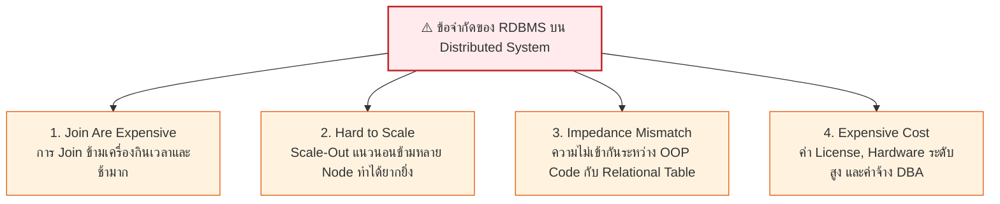
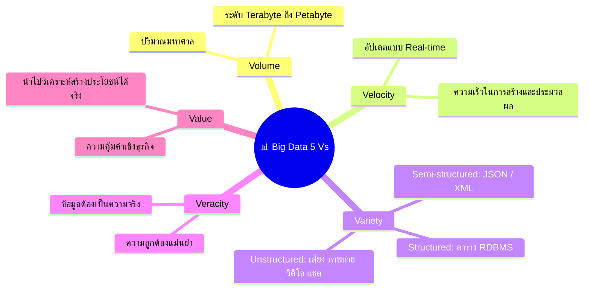
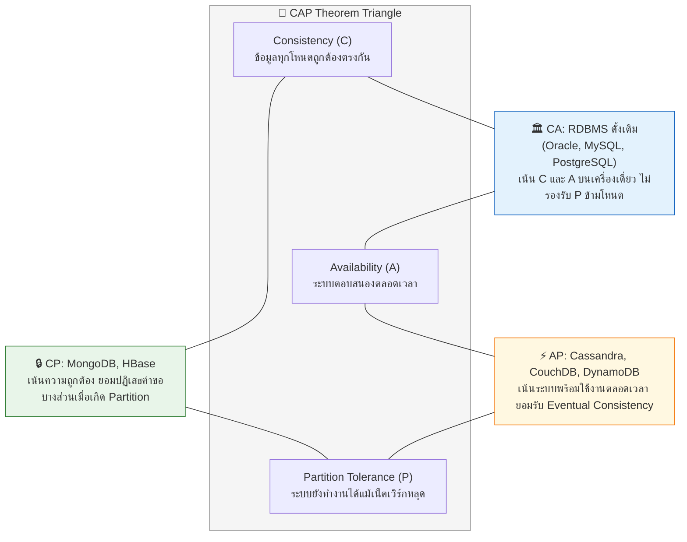

---
tags:
  - database
  - lecture-recording
  - nosql
  - big-data
  - cap-theorem
  - data-models
  - distributed-systems
  - exam-guide
created: 2026-09-15
updated: 2026-09-15
type: in-class-guide
session_date: 2026-09-15
---

# สรุปถอดเทปเสียงบรรยายสด: NoSQL Databases, Big Data Architecture, Data Models 4 ชนิด & CAP Theorem

> [!INFO] **ข้อมูลการบันทึกเสียงในชั้นเรียน (Audio Recording Metadata)**
> - **วิชา:** ระบบฐานข้อมูล (Database System / Database Management Systems)
> - **วันและเวลาที่บันทึก:** วันอังคารที่ 15 กันยายน 2569 เวลา 13:00 น. - 14:08 น.
> - **ไฟล์เสียงต้นฉบับ:** `20260915_130022.aac` (ความยาว 1 ชั่วโมง 07 นาที 51 วินาที)
> - **ผู้บรรยาย:** อาจารย์ประจำวิชาระบบฐานข้อมูล
> - **การดำเนินการ:** ถอดความเสียง ละเอียดทุกคำพูด วิเคราะห์เชิงโครงสร้าง และเชื่อมโยงเข้าสู่ Wiki และ Web Interactive System

---

## สารบัญเนื้อหา (Table of Contents)
1. [[#พาร์ทที่ 1: ทบทวน RDBMS และที่มาของ NoSQL (Not Only SQL)|พาร์ทที่ 1: ทบทวน RDBMS และที่มาของ NoSQL]]
2. [[#พาร์ทที่ 2: ข้อจำกัดของ RDBMS เมื่อต้องขยายสู่ระบบกระจายศูนย์ (Distributed Systems)|พาร์ทที่ 2: ข้อจำกัดของ RDBMS บนระบบกระจายศูนย์]]
3. [[#พาร์ทที่ 3: สถาปัตยกรรม Big Data และคุณลักษณะ 5 Vs|พาร์ทที่ 3: สถาปัตยกรรม Big Data (5 Vs)]]
4. [[#พาร์ทที่ 4: เจาะลึก 4 โมเดลข้อมูลของ NoSQL (Data Models Comparison)|พาร์ทที่ 4: เจาะลึก 4 โมเดลข้อมูลของ NoSQL]]
5. [[#พาร์ทที่ 5: ทฤษฎีบท CAP Theorem (Brewer's Theorem)|พาร์ทที่ 5: ทฤษฎีบท CAP Theorem]]
6. [[#พาร์ทที่ 6: นัดหมายสำคัญในชั้นเรียน — การเรียน Lab 2 สัปดาห์ และส่งงาน ER Diagram|พาร์ทที่ 6: นัดหมายเรียน Lab 2 สัปดาห์ & งานกลุ่ม]]
7. [[#พาร์ทที่ 7: จุดที่แง้มว่าจะออกสอบปลายภาค (Final Exam Secrets 40 คะแนน)|พาร์ทที่ 7: แนวข้อสอบปลายภาค 40 คะแนนเต็ม]]

---

## พาร์ทที่ 1: ทบทวน RDBMS และที่มาของ NoSQL (Not Only SQL)

*ถอดความจากไฟล์เสียง: `20260915_130022.aac`*

### 1.1 นิยามแท้จริงของ NoSQL
> [!IMPORTANT] **คำพูดของอาจารย์:**  
> *"NoSQL ที่เราเรียกว่า Not Only SQL แปลตรงตัวก็ว่า เค้าทำมาเพื่อทำการรองรับระบบฐานข้อมูลที่ไม่ได้สร้างมาเป็นลักษณะของ RDBMS... ในลักษณะของการใช้คำสั่งของตัว RDBMS เนี่ยจะใช้คำสั่งของตัว SQL หรือ Structured Query Language เป็นหลัก ส่วนตัว NoSQL เนี่ย เราสามารถที่จะใช้คำสั่งอื่นๆ ที่เค้าทำขึ้นมาอย่าง API ของเค้าได้ด้วย ไม่จำเป็นต้องเป็น SQL เสมอไปนะคะ..."*

- **NoSQL** ย่อมาจาก **Not Only SQL** ไม่ได้แปลว่าปฏิเสธ SQL แต่หมายความว่า มีความสามารถหลากหลายกว่าการจำกัดอยู่เพียงโครงสร้างแถวและคอลัมน์ของ SQL แบบดั้งเดิม
- กำเนิดขึ้นอย่างจริงจังช่วงก่อน ค.ศ. 2010 เพื่อตอบสนองต่อการปฏิวัติทางข้อมูลอินเทอร์เน็ตที่ RDBMS เดิมเริ่มรองรับไม่ไหว

### 1.2 สรุปแก่นแท้ของ RDBMS (Relational Database Management System)
- คิดค้นโดย **Dr. Edgar F. Codd (IBM)** ในปี ค.ศ. 1970
- ใช้โมเดลเชิงสัมพันธ์ (Relational Model) จัดเก็บข้อมูลเป็นตาราง (Table) มีแถว (Tuple/Row) และคอลัมน์ (Attribute)
- มีพื้นฐานทางคณิตศาสตร์ที่แข็งแกร่งคือ **Relational Algebra** (Union, Intersection, Cartesian Product, Join, Selection, Projection)
- ยึดหลัก **ACID Properties** อย่างเคร่งครัด (Atomicity, Consistency, Isolation, Durability)
- อาศัยการเชื่อมโยงความสัมพันธ์ผ่าน **Primary Key (PK)** และ **Foreign Key (FK)**

---

## พาร์ทที่ 2: ข้อจำกัดของ RDBMS เมื่อต้องขยายสู่ระบบกระจายศูนย์ (Distributed Systems)

อาจารย์ได้อธิบายว่า เมื่อขนาดข้อมูลเพิ่มขึ้นมหาศาล RDBMS ซึ่งถูกออกแบบมาสำหรับเซิร์ฟเวอร์เดี่ยว (Single Server) จะเผชิญกับอุปสรรค 4 ประการหลัก:

1. **Join Are Expensive:**
   - หากข้อมูลอยู่ในตารางบนเครื่องเดียว Server รู้ตำแหน่งข้อมูล ทำ Join ได้เร็ว
   - แต่เมื่อข้อมูลมีเป็นสิบล้านเรคอร์ดแล้วต้องกระจายไปเก็บคนละเครื่อง (Distributed) การทำ `JOIN` ข้ามเครือข่ายจะต้องส่งข้อมูลไปมาระหว่าง Server ทำให้ระบบช้าลงอย่างเห็นได้ชัด
2. **Hard to Scale (Scale-Up vs Scale-Out):**
   - RDBMS เหมาะกับ **Vertical Scaling (Scale-Up)** คือการอัปเกรดเครื่องให้ใหญ่ขึ้น (เพิ่ม CPU/RAM) ซึ่งมีขีดจำกัดทางกายภาพและราคาแพงมหาศาล
   - NoSQL ถูกออกแบบมาเพื่อ **Horizontal Scaling (Scale-Out)** คือการเพิ่มเครื่องระดับธรรมดา (Commodity Hardware) เข้าสู่คลัสเตอร์ได้ไม่จำกัด
3. **Impedance Mismatch:**
   - โปรแกรมเมอร์เขียนโค้ดเชิงวัตถุ (Object-Oriented: Class, Object, Nested Structure) แต่เวลาเก็บลง RDBMS ต้องแปลงเป็นแถวและคอลัมน์แบนๆ (Relational Mapping) ทำให้ต้องใช้ ORM ที่ซับซ้อน
4. **Weakness on Network Failure:**
   - ในระบบเครือข่าย ความเร็วในการประมวลผล (Performance) ลดลง, ความพร้อมใช้งานตลอดเวลา (High Availability) และความทนทานต่อเครือข่ายล่ม (Partition Tolerance) ลดทอนลง

---

## พาร์ทที่ 3: สถาปัตยกรรม Big Data และคุณลักษณะ 5 Vs

อาจารย์ได้เน้นย้ำถึงธรรมชาติของข้อมูลยุคใหม่ที่เป็นตัวขับเคลื่อนให้ต้องใช้ NoSQL:

---

## พาร์ทที่ 4: เจาะลึก 4 โมเดลข้อมูลของ NoSQL (Data Models Comparison)

อาจารย์ได้ลงรายละเอียดพร้อมยกตัวอย่างการจัดเก็บของ NoSQL ทั้ง 4 ประเภท:

### 4.1 Key-Value Store
- **โครงสร้าง:** จัดเก็บข้อมูลเป็นคู่ `[Key, Value]` โดยที่ Value ถูกจัดเก็บเป็นก้อนข้อมูล (Blob / String / Object) โดยไม่มีการแยกแอตทริบิวต์ภายในฐานข้อมูล
- **การเข้าถึง:** ค้นหาได้อย่างรวดเร็วมากด้วยการระบุ Key เช่น `GET Dog_12` จะได้ข้อมูลทั้งก้อนออกมา โปรแกรมฝั่งแอปพลิเคชันต้องไปทำการตัดสตริง (Parse String) เอง
- **ตัวอย่างผลิตภัณฑ์:** Amazon DynamoDB, Redis, Memcached

### 4.2 Column Family / Wide-Column Store
- **โครงสร้าง:** จัดเก็บเป็น Row Key และ Column Family โดยแต่ละแถว**ไม่จำเป็นต้องมีคอลัมน์เหมือนกัน (Schemaless)**
- **กลไกการเขียนข้อมูลที่เร็วระดับมิลลิวินาที:**
  - ตัวอย่างฐานข้อมูล **Apache Cassandra** ทำงานแบบ **Append-only** (เขียนต่อท้ายไฟล์พร้อม Timestamp เสมอ ไม่มีการเขียนทับ In-place)
  - เมื่อมีการแก้ไขค่า (เช่น เปลี่ยน Mood จาก Angry เป็น Happy) จะบันทึกเรคอร์ดใหม่ต่อท้ายพร้อมเวลาใหม่
  - เมื่อดึงข้อมูล DBMS จะอ่านค่าที่มี Timestamp ล่าสุดไปแสดงผล และมีกระบวนการ Background Garbage Collection ลบข้อมูลเก่าทิ้งในภายหลัง
  - **การเปรียบเทียบความเร็ว (>50GB):**
    - **Write Average:** Cassandra ใช้เวลาเพียง **0.12 ms** (ขณะที่ MySQL ใช้ **300 ms** ช้ากว่ากันมหาศาล!)
    - **Read Average:** Cassandra ใช้เวลา **15 ms** (ขณะที่ MySQL ใช้ **350 ms**)

### 4.3 Graph Database
- **โครงสร้าง:** จัดเก็บในรูป **Node** (เอนทิตี), **Relationship/Edge** (เส้นความสัมพันธ์ที่มีทิศทาง), และ **Properties** (คุณสมบัติของโหนดและเส้น)
- **กลไกภายใน:** เชื่อมโยงโหนดด้วย Pointer ทางกายภาพ ทำให้การท่องกราฟ (Graph Traversal) ทำได้รวดเร็วระดับ $O(1)$ ต่อการกระโดด 1 สเต็ป
- **กรณีการใช้งานที่เหมาะสมที่สุด:**
  - เครือข่ายสังคมออนไลน์ (Social Network เช่น Facebook Friends, LINE, ผู้ติดตาม)
  - แผนที่และการนำทาง (Route Optimization)
  - การวิเคราะห์เส้นทางทุจริต (Fraud Detection)
  - การแกะรอยประวัติสัมผัสโรคระบาด (Contact Tracing เช่น การติดตามผู้ติดเชื้อโควิดคนแรกและผู้สัมผัสใกล้ชิด)
- **ตัวอย่างผลิตภัณฑ์:** Neo4j, Amazon Neptune, InfiniteGraph

### 4.4 Document-based Store
- **โครงสร้าง:** จัดเก็บข้อมูลเป็นเอกสารในรูปแบบกึ่งโครงสร้าง เช่น **JSON, BSON หรือ XML**
- **ความยืดหยุ่นสูง:** สามารถเก็บข้อมูลที่มีโครงสร้างลึกได้ (Nested Objects และ Array)
  - ตัวอย่างในคลาส: โหนดสุนัข `Dog_12` สามารถฝัง Array การเห่า `Bark` และฝังความคิดเห็น `Comment` หลายๆ รายการลงในเอกสารเดียวกันได้
  - การแสดงผลหน้า Profile ใน Social Media สามารถดึงข้อมูลผู้ใช้ เพื่อน ข่าว และคอมเมนต์ได้ทั้งหมดในการคิวรีครั้งเดียว ( Single Document Read) ไม่ต้องทำ Multi-table Join
- **ตัวอย่างผลิตภัณฑ์:** MongoDB, CouchDB

---

## พาร์ทที่ 5: ทฤษฎีบท CAP Theorem (Brewer's Theorem)

อาจารย์ได้อธิบายทฤษฎีบทที่เป็นหัวใจของ Distributed Systems ว่า ในระบบแบบกระจายศูนย์ เราสามารถเลือกรับประกันคุณสมบัติได้**อย่างมากที่สุดเพียง 2 จาก 3 ข้อพร้อมกัน**:

- **Consistency (C):** ทุกโหนดในคลัสเตอร์มองเห็นข้อมูลตรงกันอย่างสมบูรณ์ในจังหวะเวลาเดียวกัน
- **Availability (A):** ทุกคำขอ (Request) ที่ส่งเข้ามาต้องได้รับการตอบสนอง (Response) เสมอ ไม่เกิดข้อผิดพลาด แม้บางโหนดจะล่ม
- **Partition Tolerance (P):** คลัสเตอร์ยังคงทำงานต่อไปได้ แม้การเชื่อมต่อเครือข่ายระหว่างโหนดจะขาดหาย (Network Partition)

> [!TIP] **สรุปการนำไปใช้จริง:**
> - งานระบบการเงิน (Banking/Financial) $\rightarrow$ ต้องเลือก **RDBMS (ACID)** หรืออย่างน้อยต้องเป็น **CP**
> - งาน Web Scale, IoT, โซเชียลมีเดีย, การเก็บ Log $\rightarrow$ นิยมเลือก **AP** ที่ใช้สถาปัตยกรรม NoSQL

---

## พาร์ทที่ 6: นัดหมายสำคัญในชั้นเรียน — การเรียน Lab 2 สัปดาห์ และส่งงาน ER Diagram

1. **การส่งงานกลุ่ม ER Diagram:**
   - อาจารย์ย้ำให้นักศึกษาที่ยังไม่ได้อัปโหลดภาพผัง **ER Diagram** ของกลุ่ม ให้รีบอัปโหลดเข้าสู่ **Google Classroom** ให้เรียบร้อยภายในสัปดาห์นี้
2. **การเรียนภาคปฏิบัติการ (Lab Sessions):**
   - **สัปดาห์หน้า (วันอังคารหน้า) และสัปดาห์ถัดไป: งดเรียนห้องบรรยายนี้ 2 สัปดาห์เต็ม!**
   - ให้นักศึกษาไปเรียนที่ห้องปฏิบัติการคอมพิวเตอร์ (Lab) ตามตารางเวลาและห้องที่ลงทะเบียนไว้ใน **Google Sheets Worksheet**
   - ในชั่วโมง Lab อาจารย์จะตรวจแบบดีไซน์ฐานข้อมูลของกลุ่ม และให้เริ่มลงมือสร้าง Database จริงด้วยซอฟต์แวร์ DBMS

---

## พาร์ทที่ 7: จุดที่แง้มว่าจะออกสอบปลายภาค (Final Exam Secrets 40 คะแนน)

> [!WARNING] **ข้อมูลรั่วข้อสอบปลายภาคจากการสนทนาท้ายคาบ:**
> 1. **น้ำหนักคะแนน:** การสอบปลายภาค (Final Exam) เก็บคะแนนสูงถึง **40 คะแนนเต็ม** (คะแนนตัดเกรดหลักของวิชา)
> 2. **ระยะเวลาสอบ:** **3 ชั่วโมงเต็ม** (มีกฎห้ามออกจากห้องสอบก่อนผ่านไป 1 ชั่วโมงแรก)
> 3. **ปริมาณข้อสอบ:** อาจารย์แซวว่าอาจมีข้อสอบเยอะมาก (แซวตัวเลข 80, 120 ถึง 200 ข้อ) นักศึกษาต้องฝึกฝนการวิเคราะห์และทำข้อสอบอย่างรวดเร็ว
> 4. **หัวข้อที่ต้องทบทวน:**
>    - การเปรียบเทียบ RDBMS vs NoSQL และการเลือกโมเดลข้อมูลให้เหมาะกับลักษณะงาน
>    - ทฤษฎีบท CAP Theorem (จำแนกระบบ CA, CP, AP)
>    - คุณสมบัติ ACID Properties และตาราง Lock Compatibility Matrix (S/X Lock)
>    - การอ่าน Log File เพื่อสั่งกู้คืนระบบ (Crash Recovery: REDO / UNDO)
