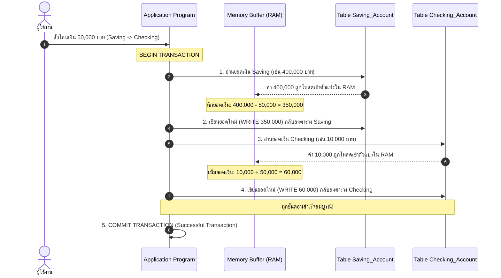
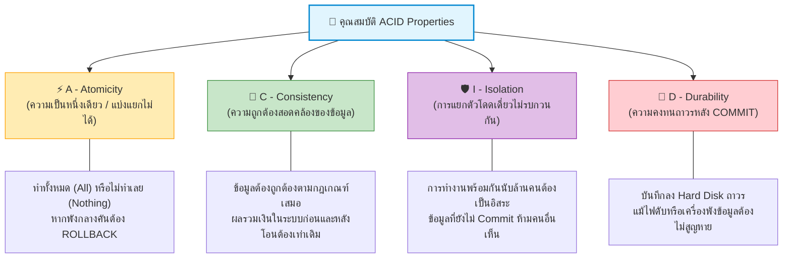
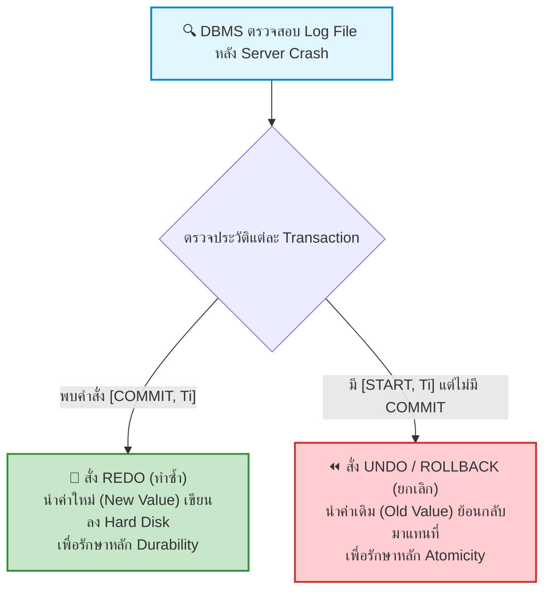

---
tags:
  - database
  - lecture-recording
  - pop-quiz
  - transaction
  - acid
  - concurrency-control
  - lock-matrix
  - crash-recovery
  - exam-guide
created: 2026-09-08
updated: 2026-09-14
type: in-class-guide
session_date: 2026-09-08
---

# สรุปถอดเทปเสียงบรรยายสดและการสอบเก็บคะแนนในห้องเรียน: Transaction, ACID, Concurrency Control & Crash Recovery

> [!INFO] **ข้อมูลการบันทึกเสียงในชั้นเรียน (Audio Recording Metadata)**
> - **วิชา:** ระบบฐานข้อมูล (Database System / Database Management Systems)
> - **วันและเวลาที่บันทึก:** วันอังคารที่ 8 กันยายน 2569 เวลา 13:04 น. - 15:00 น.
> - **ไฟล์เสียงต้นฉบับ:**
>   1. `20260908_130406.aac` (6 นาที 21 วินาที) — ชนิดของไฟล์ข้อมูล และนิยามของ Transaction
>   2. `20260908_131052.aac` (67 นาที 08 วินาที) — การบรรยายหลัก: ACID, Concurrency, Lock Matrix, 2PL, Crash Recovery
>   3. `20260908_143913.aac` และ `-.aac` (17 นาที 15 วินาที) — การสอบเก็บคะแนนฉุกเฉิน (In-Class Pop Quiz) ในห้องเรียน
> - **ผู้บรรยาย:** อาจารย์ประจำวิชาระบบฐานข้อมูล

---

## สารบัญเนื้อหา (Table of Contents)
1. [[#พาร์ทที่ 1: ถอดเทปเสียงบรรยาย — แฟ้มข้อมูลพื้นฐานและนิยามของ Transaction|พาร์ทที่ 1: แฟ้มข้อมูลพื้นฐานและนิยามของ Transaction]]
2. [[#พาร์ทที่ 2: ถอดเทปเสียงบรรยาย — เจาะลึก ACID Properties, วงจรชีวิต, และการทำงานพร้อมกัน|พาร์ทที่ 2: เจาะลึก ACID, Concurrency, Lock Matrix และ Recovery]]
3. [[#พาร์ทที่ 3: ข้อสอบเก็บคะแนนฉุกเฉินในห้องเรียน (In-Class Pop Quiz 8 ก.ย. 2569)|พาร์ทที่ 3: ข้อสอบเก็บคะแนนฉุกเฉินในห้องเรียน (Pop Quiz)]]
4. [[#พาร์ทที่ 4: เฉลยข้อสอบควิซแบบละเอียดระดับคะแนนเต็ม 100%|พาร์ทที่ 4: เฉลยข้อสอบควิซแบบละเอียดระดับคะแนนเต็ม 100%]]
5. [[#พาร์ทที่ 5: ข้อความเตือนใจและคำพูดสำคัญของอาจารย์ในห้องเรียน|พาร์ทที่ 5: คำพูดสำคัญและคำเตือนของอาจารย์]]
6. [[#พาร์ทที่ 6: การเชื่อมโยงสู่บทเรียนถัดไป — Normalization|พาร์ทที่ 6: การเชื่อมโยงสู่ Normalization]]

---

## พาร์ทที่ 1: ถอดเทปเสียงบรรยาย — แฟ้มข้อมูลพื้นฐานและนิยามของ Transaction

*ถอดความจากไฟล์เสียง: `20260908_130406.aac` (เวลา 13:04 น.)*

### 1.1 ชนิดของไฟล์ข้อมูลในระบบฐานข้อมูล (File Types)
อาจารย์ได้เริ่มต้นคาบเรียนด้วยการทบทวนประเภทของแฟ้มข้อมูล 3 ชนิดที่ใช้ในการจัดเก็บข้อมูลขององค์กร:
1. **Basic File (แฟ้มข้อมูลพื้นฐาน / Reference File):** แฟ้มข้อมูลที่เก็บข้อมูลอ้างอิงที่ไม่ค่อยมีการเปลี่ยนแปลงบ่อย เช่น รหัสไปรษณีย์, ตารางรหัสจังหวัด, ตารางคำนำหน้าชื่อ
2. **Master File (แฟ้มข้อมูลหลัก / Master Data):** แฟ้มข้อมูลหลักที่เก็บข้อมูลสำคัญขององค์กร มีการอัปเดตสถานะตามการดำเนินงาน เช่น แฟ้มข้อมูลประวัตินักศึกษา, แฟ้มข้อมูลบัญชีลูกค้า, แฟ้มข้อมูลสต็อกสินค้า
3. **Transaction File (แฟ้มข้อมูลรายการเปลี่ยนแปลง):** แฟ้มข้อมูลที่ใช้บันทึกเหตุการณ์ กิจกรรม หรือรายการเคลื่อนไหวที่เกิดขึ้นในแต่ละวัน เพื่อนำไปปรับปรุง Master File ต่อไป เช่น แฟ้มบันทึกรายการฝาก-ถอนเงินประจำวัน, แฟ้มประวัติการชำระเงิน

### 1.2 นิยามแท้จริงของ Transaction จากคำบรรยายของอาจารย์
> [!IMPORTANT] **คำพูดของอาจารย์:**
> *"ถัดมานะคะ... ตัวที่เป็น Transaction นะคะ ตัวนี้เราจะหมายความว่าเป็นลักษณะของรายการที่เกิดขึ้นในแต่ละไฟล์... แต่ Transaction ไม่ใช่ไฟล์นะ! Transaction หมายถึง เป็นคำสั่งที่เอาไว้ใช้สำหรับทำรายการในแต่ละไฟล์นั่นเอง ไม่ว่าจะเป็นคำสั่งที่ใช้ในการ INSERT คือการเพิ่มข้อมูล, คำสั่งที่ใช้ในการ UPDATE คือทำการแก้ไขข้อมูล, หรือคำสั่งที่ใช้ในการลบข้อมูล (DELETE) เราถือว่าเป็น Transaction ทั้งสิ้นนะคะ..."*

- **Transaction ไม่ใช่ไฟล์ข้อมูล** แต่คือ **"ชุดของคำสั่ง" (Set of Operations / Unit of Work)**
- รวมไปถึงคำสั่ง **Query (SELECT)** ข้อมูลด้วย เพราะเราเขียนคำสั่งขึ้นมาเพื่อสืบค้นข้อมูลในฐานข้อมูล
- **องค์ประกอบของ 1 Transaction:** อาจประกอบไปด้วยคำสั่งเดียว หรือหลายคำสั่งรวมกันก็ได้ เพื่อให้งานชิ้นหนึ่งบรรลุผลสำเร็จโดยสมบูรณ์ เช่น:
  - การเปิดบัญชีใหม่ (อาจมี 2-3 คำสั่ง)
  - การแก้ไขข้อมูลประวัตินักศึกษา
  - การจองตั๋วเครื่องบิน (ตัดที่นั่ง, บันทึกชื่อผู้โดยสาร, สั่งตัดเงินผ่านบัตร)

### 1.3 ตัวอย่างจำลอง: การโอนเงินข้ามบัญชี (Bank Transfer Step-by-Step)
อาจารย์ได้ยกภาพจำลองบนสไลด์ เป็น Application Program ที่ต่อเข้ากับ 2 ตารางในฐานข้อมูล:
- ตารางที่ 1: `Saving Account` (บัญชีออมทรัพย์)
- ตารางที่ 2: `Checking Account` (บัญชีกระแสรายวัน)



---

## พาร์ทที่ 2: ถอดเทปเสียงบรรยาย — เจาะลึก ACID Properties, วงจรชีวิต, และการทำงานพร้อมกัน

*ถอดความจากไฟล์เสียง: `20260908_131052.aac` (เวลา 13:10 น.)*

### 2.1 คำสั่ง COMMIT vs คำสั่ง ROLLBACK
- **COMMIT:** เป็นคำสั่งที่ยืนยันว่า Transaction ทำงานเสร็จสิ้นสมบูรณ์ 100% ข้อมูลถูกบันทึกอย่างถาวรลงในสื่อบันทึกข้อมูล (Hard Disk) เรียกว่า **Successful Transaction**
- **ROLLBACK / ABORT:** หากเกิดเหตุขัดข้องกลางคัน เช่น ไฟฟ้าดับ เครื่องเซิร์ฟเวอร์ล่ม (Crash) หรือเน็ตเวิร์กหลุด ขณะที่เพิ่งหักเงินจาก Saving Account ไป 50,000 แต่ยังไม่ทันบวกเข้า Checking Account:
  - ระบบจะยังไม่เจอคำสั่ง COMMIT!
  - เมื่อเซิร์ฟเวอร์เปิดขึ้นมาใหม่ DBMS จะสั่ง **ROLLBACK ทันที!**
  - เงิน 50,000 บาทที่ถูกหักไปต้องย้อนคืนกลับเข้าบัญชี Saving Account ให้มียอด 400,000 เท่าเดิม และ Checking Account มี 10,000 เท่าเดิม เสมือนไม่เคยมีรายการนี้เกิดขึ้น เรียกว่า **Unsuccessful Transaction**

---

### 2.2 คุณสมบัติ ACID Properties ของระบบฐานข้อมูล
อาจารย์เน้นย้ำว่าเป็นหัวข้อสำคัญที่ต้องท่องจำและเข้าใจให้ขึ้นใจ:



#### 1. A - Atomicity (ความเป็นหนึ่งเดียว / แบ่งแยกไม่ได้):
- กฎ **All or Nothing:** คำสั่งทั้งหมดใน Transaction ต้องถือเป็นก้อนเดียว ทำสำเร็จทั้งหมด หรือถ้าพังแม้แต่คำสั่งเดียว ต้องยกเลิกทั้งหมด
- ตัวอย่าง: โอนเงินหักบัญชี A แล้ว เครื่องดับก่อนเข้าบัญชี B → ระบบต้องสั่ง Rollback คืนเงินเข้า A ทันที

#### 2. C - Consistency (ความถูกต้องสอดคล้อง):
- ข้อมูลก่อนเริ่มและหลังจบ Transaction ต้องถูกต้องตามกฎเกณฑ์ทางธุรกิจ (Integrity Constraints) เสมอ
- **ตัวอย่างอาจารย์ยกในห้อง:** การถอนเงินจากตู้ ATM:
  - คุณกดถอนเงิน 1,000 บาท
  - 1) ระบบต้องตัดยอดเงินในบัญชีคุณ 1,000 บาท
  - 2) ระบบต้องบันทึกในบัญชีรายจ่ายของธนาคาร 1,000 บาท
  - 3) ระบบต้องตัดสต็อกเงินสดในตู้ ATM ออก 1,000 บาท
  - ทุกตารางต้องสอดคล้องตรงกันทั้งหมด ยอดรวมในระบบต้องสมดุล

#### 3. I - Isolation (การแยกตัวโดดเดี่ยว):
- ในโลกความเป็นจริง มีผู้ใช้งานทำธุรกรรมพร้อมกันนับล้านคน เช่น คนหนึ่งถอนเงินที่ตู้ ATM กรุงเทพฯ และอีกคนถอนเงินที่เชียงใหม่
- ระบบต้องแยกการทำงานของแต่ละ Transaction เสมือนว่ากำลังทำงานอยู่คนเดียวในโลก (Executing in isolation)
- ข้อมูลระหว่างทางที่ Transaction หนึ่งยังแก้ไขไม่เสร็จ (ยังไม่ Commit) Transaction อื่น **จะต้องมองไม่เห็น (Invisible)** เพื่อป้องกันไม่อ่านข้อมูลขยะ

#### 4. D - Durability (ความคงทนถาวร):
- เมื่อ Transaction ได้รับการยืนยันด้วยคำสั่ง **COMMIT** แล้ว ผลการเปลี่ยนแปลงนั้นจะต้องถูกเขียนลงสื่อบันทึกข้อมูลถาวร (Non-volatile Storage / Hard Disk)
- แม้หลังจากนั้นเพียง 1 วินาที เซิร์ฟเวอร์จะไฟดับ ชิปประมวลผลไหม้ หรือเครื่องพัง ข้อมูลที่ Commit ไปแล้วจะต้องไม่สูญหายเด็ดขาด

---

### 2.3 วงจรสถานะของ Transaction (Transaction States) และอุปมาซูเปอร์มาร์เก็ต
อาจารย์อธิบายสถานะการทำงาน 5 สถานะ โดยเปรียบเทียบกับการซื้อของในซูเปอร์มาร์เก็ต:

| สถานะ (State) | ความหมายทางเทคนิค | ตัวอย่างอุปมาซูเปอร์มาร์เก็ตของอาจารย์ |
| :--- | :--- | :--- |
| **Active** | สถานะเริ่มต้น กำลังประมวลผลคำสั่งทีละบรรทัด | แคชเชียร์กำลังเริ่มหยิบสินค้าขึ้นมา **สแกนบาร์โค้ดทีละชิ้น** |
| **Partially Committed** | ทำคำสั่งสุดท้ายใน RAM เสร็จแล้ว แต่ยังไม่ได้เขียนเสร็จสมบูรณ์ลง Hard Disk | แคชเชียร์สแกนสินค้าครบทุกชิ้นแล้ว **คิดยอดรวมเงินออกมาในหน้าจอ** (รอลูกค้าจ่ายเงิน) |
| **Committed** | ข้อมูลบันทึกลง Hard Disk อย่างถาวรเสร็จสิ้น | ลูกค้ายื่นบัตร/สแกนจ่ายเงินสำเร็จ **เครื่องพิมพ์ใบเสร็จออกมาอย่างสมบูรณ์** |
| **Failed** | เกิดข้อผิดพลาด ไม่สามารถประมวลผลต่อได้ | กำลังสแกนอยู่แล้วลูกค้ารูดบัตรไม่ผ่าน หรือระบบเน็ตเวิร์กล่ม |
| **Aborted** | ถูกยกเลิกและย้อนกลับ (Rollback) ข้อมูลคืนสู่สถานะเดิม | ลูกค้าบอกไม่เอาของแล้ว แคชเชียร์กดยกเลิกบิล สินค้าคืนกลับเข้าชั้นวาง ไม่ตัดสต็อก |

---

### 2.4 ปัญหา 3 ประการเมื่อทำงานพร้อมกันโดยไม่มีการควบคุม (Concurrency Problems)

#### 1. Lost Update Problem (ปัญหาการอัปเดตสูญหาย):
- บัญชีมีเงินตั้งต้น 1,000 บาท
- Transaction A อ่านเงินได้ 1,000 บาท
- Transaction B เข้ามาอ่านเงินได้ 1,000 บาทเช่นกัน
- A ถอน 500 บาท และเขียนยอด 500 กลับลงไป
- แต่ B (ซึ่งถือค่า 1,000 เดิม) ถอน 200 บาท แล้วเขียนยอด 800 ทับลงไปในตาราง
- **ผลลัพธ์:** เงิน 500 บาทที่ A ถอนสูญหายไปจากระบบ ยอดกลายเป็น 800 ธนาคารขาดทุนทันที!

#### 2. Dirty Read Problem / Uncommitted Dependency:
- Transaction B ทำการฝากเงิน 5,000 บาท (ยอดกลายเป็น 6,000) แต่ **ยังไม่ได้ COMMIT**
- Transaction A เข้ามาอ่านยอด 6,000 บาทนั้นไปคำนวณดอกเบี้ย
- ทันใดนั้น Transaction B เกิดข้อผิดพลาด แล้วสั่ง **ROLLBACK** กลับเป็น 1,000 บาท
- **ผลลัพธ์:** Transaction A ได้อ่านข้อมูลที่เป็น "ขยะ (Dirty Data)" ซึ่งไม่มีอยู่จริงในระบบไปประมวลผล

#### 3. Inconsistent Analysis Problem (ปัญหาการวิเคราะห์ข้อมูลที่ไม่สอดคล้องกัน):
- มี 3 บัญชี: บัญชี 1 มี 40 บาท, บัญชี 2 มี 50 บาท, บัญชี 3 มี 30 บาท (ยอดรวมจริง = 120 บาท)
- Transaction A ต้องการหายอดรวม กำลังอ่านบัญชี 1 (ได้ 40) และบัญชี 2 (ได้ 50) รวมเป็น 90 บาท
- ขณะนั้น Transaction B เข้ามาโอนเงิน 10 บาทจากบัญชี 3 ไปบัญชี 1 (ทำให้บัญชี 3 เหลือ 20 และบัญชี 1 กลายเป็น 50) แล้ว B ทำการ COMMIT
- พอ Transaction A วิ่งไปอ่านบัญชี 3 ได้ยอดใหม่คือ 20 บาท นำมารวมกับ 90 เดิม ได้ผลรวมเป็น **110 บาท**
- **ผลลัพธ์:** เงินในระบบหายไป 10 บาท ทั้งที่ระบบไม่มีใครถอนเงินออก เกิดจากข้อมูลไม่อยู่ในจุดสมดุลเดียวกัน

---

### 2.5 กลไกการล็อกและ Lock Compatibility Matrix (ออกสอบควิซ!)
เพื่อแก้ไขปัญหา Concurrency อาจารย์อธิบายกลไกการล็อก 2 ประเภท:
1. **Shared Lock (S-Lock / Read Lock):** ใช้สำหรับการ **"อ่าน"** ข้อมูลอย่างเดียว (SELECT) อนุญาตให้หลาย Transaction ถือ S-Lock พร้อมกันได้
2. **Exclusive Lock (X-Lock / Write Lock):** ใช้สำหรับการ **"แก้ไข"** ข้อมูล (INSERT, UPDATE, DELETE) ถือได้เพียงคนเดียวเท่านั้น คนอื่นห้ามอ่านและห้ามเขียน

**ตาราง Lock Compatibility Matrix (ท่องจำเพื่อทำข้อสอบ):**

| Lock ที่ขอเข้ามา (Requested Lock) \ Lock ที่ถืออยู่เดิม (Current Lock) | Shared Lock (S) | Exclusive Lock (X) |
| :---: | :---: | :---: |
| **Shared Lock (S)** | **YES (อนุญาต)** | **NO (ปฏิเสธ/ต้องรอ)** |
| **Exclusive Lock (X)** | **NO (ปฏิเสธ/ต้องรอ)** | **NO (ปฏิเสธ/ต้องรอ)** |

> [!SUMMARY] **กฎจำง่ายของอาจารย์:**
> **"มีเพียงช่อง S และ S ช่องเดียวเท่านั้นที่ตอบ YES! อีก 3 ช่องที่เหลือตอบ NO ทั้งหมด!"**
> - (S, S) = YES เพราะอ่านพร้อมกันได้ ไม่ทำให้ข้อมูลเปลี่ยน
> - (S, X) = NO เพราะห้ามเขียนแทรกขณะที่คนอื่นกำลังอ่าน
> - (X, S) = NO เพราะห้ามอ่านข้อมูลที่คนอื่นกำลังแก้ไขอยู่ (ป้องกัน Dirty Read)
> - (X, X) = NO เพราะห้ามเขียนทับข้อมูลพร้อมกัน (ป้องกัน Lost Update)

---

### 2.6 กฎ Two-Phase Locking (2PL) และ Deadlock
- **กฎ 2PL:**
  1. **Phase 1 (Growing Phase):** ขอ Lock ได้เรื่อยๆ แต่ **ห้ามปลด Lock** ใดๆ ออก
  2. **Phase 2 (Shrinking Phase):** ปลด Lock ได้เรื่อยๆ แต่ **ห้ามขอ Lock เพิ่ม** อีกเด็ดขาด
- **Deadlock:** เกิดเมื่อ T1 ถือทรัพยากร A และรอ B ขณะที่ T2 ถือทรัพยากร B และรอ A ต่างฝ่ายต่างไม่ปล่อย ระบบจะหยุดนิ่งชะงักงัน DBMS จะต้องตรวจจับด้วย Wait-For Graph และเลือก **เหยื่อ (Victim)** 1 รายการเพื่อสั่ง Rollback

---

### 2.7 การกู้คืนระบบหลังเซิร์ฟเวอร์ล่ม (Crash Recovery & Log File)
อาจารย์แบ่งระดับความเสียหายเป็น 2 ระดับ:
1. **Media Failure (Hard Crash):** ฮาร์ดดิสก์พังทางกายภาพ จานแม่เหล็กเป็นรอย → ต้องกู้จาก **เทปสำรองข้อมูล (Full Backup)** ภายนอก
2. **System Failure (Soft Crash):** ไฟฟ้าดับ ชิปค้าง RAM ดับ แต่ Hard Disk ยังอยู่ดี → กู้คืนโดยอาศัย **Log File บนดิสก์**

**กฎเหล็กการตัดสินใจของ DBMS จาก Log File (Write-Ahead Logging: WAL):**
- ตรวจสอบประวัติใน Log File:
  - **Transaction ใดที่มีคำสั่ง `COMMIT` อยู่ใน Log:** แสดงว่าผู้ใช้สั่งยืนยันแล้วก่อนไฟดับ → DBMS ต้องสั่ง **"REDO" (ทำซ้ำ)** เพื่อเขียนค่าใหม่ (`new_value`) ลงตารางให้สมบูรณ์ตามหลัก Durability
  - **Transaction ใดที่มีแต่คำสั่ง `START` แต่ยังไม่เจอ `COMMIT`:** แสดงว่าค้างอยู่กลางทางตอนไฟดับ → DBMS ต้องสั่ง **"UNDO / ROLLBACK" (ยกเลิก)** เพื่อนำค่าเดิม (`old_value`) กลับมาแทนที่ตามหลัก Atomicity

---

## พาร์ทที่ 3: ข้อสอบเก็บคะแนนฉุกเฉินในห้องเรียน (In-Class Pop Quiz 8 ก.ย. 2569)

*ถอดความจากไฟล์เสียง: `20260908_143913.aac` (เวลา 14:39 น.)*

### 3.1 บรรยากาศและการสั่งสอบกระทันหันของอาจารย์
- เวลา 14:39 น. หลังจบการบรรยายทฤษฎี อาจารย์ประกาศสั่งสอบเก็บคะแนนกระทันหันในห้องเรียน
- เดิมทีอาจารย์วางแผนจะให้ทำโจทย์ Normalization แต่อาจารย์เปลี่ยนใจเก็บ Normalization ไว้อาทิตย์หน้า แล้วเอาโจทย์ที่เพิ่งเรียนสดๆ ร้อนๆ มาออกสอบ
- **รูปแบบการทำข้อสอบ:**
  - ให้นักศึกษาใช้กระดาษ A4 คนละครึ่งแผ่น (แบ่งครึ่งหน้า-หลัง) เพื่อประหยัดกระดาษของมหาวิทยาลัย
  - ให้เวลาทำข้อสอบข้อละประมาณ 5 นาที เขียนอธิบายเป็นภาษาไทย
  - สามารถเปิดสไลด์ดูได้

```
================================================================================
                    ใบข้อสอบควิซในห้องเรียน (In-Class Pop Quiz)
                         วิชาระบบฐานข้อมูล (Database System)
                              วันที่ 8 กันยายน 2569
================================================================================

[ข้อที่ 1] (ให้เวลา 5 นาที)
จงอธิบายคุณสมบัติของ Transaction ที่เป็น "ACID Property" (Atomicity, Consistency, 
Isolation, Durability) มาโดยละเอียดเป็นภาษาไทย พร้อมยกตัวอย่างประกอบให้ชัดเจน

--------------------------------------------------------------------------------

[ข้อที่ 2] (ให้เวลา 5-7 นาที)
ตอนที่ 1: ให้อธิบายตาราง "Lock-based Concurrency Matrix" ว่ามีการทำงานอย่างไร 
          ทำไมกรณีใดจึงอนุญาต (Yes) และกรณีใดจึงปฏิเสธ (No)
ตอนที่ 2: สมมติว่าระบบเกิด Crash (เซิร์ฟเวอร์ล่ม) แล้วเครื่อง Restart กลับขึ้นมาใหม่ 
          DBMS เข้าไปตรวจสอบที่ Log File พบว่ามีอยู่ 5 Transaction... 
          ถามว่า DBMS จะสั่งให้ทำอะไรกับ Transaction ทั้ง 5 นี้บ้างหลังระบบกลับมาใช้งานได้?
================================================================================
```

---

## พาร์ทที่ 4: เฉลยข้อสอบควิซแบบละเอียดระดับคะแนนเต็ม 100%

### เฉลยข้อที่ 1: คุณสมบัติ ACID Properties ของ Transaction

1. **Atomicity (ความเป็นหนึ่งเดียว / แบ่งแยกไม่ได้):**
   - ทุกคำสั่งใน 1 Transaction ต้องถือเป็นหน่วยงานเดียวกัน ทำงานสำเร็จครบทั้งหมด (All) หรือไม่ทำเลย (Nothing)
   - หากมีคำสั่งใดคำสั่งหนึ่งล้มเหลว หรือเกิดไฟดับกลางคัน ระบบจะต้องทำการย้อนกลับ (**ROLLBACK**) ข้อมูลทั้งหมดกลับสู่สถานะเดิม เสมือนไม่เคยมีรายการนี้เกิดขึ้นมาก่อน
   - *ตัวอย่าง:* การโอนเงิน 50,000 บาท ต้องประกอบด้วยการหักเงินจากบัญชีออมทรัพย์ และฝากเงินเข้าบัญชีกระแสรายวัน หากหักเงินแล้วแต่ระบบล่มก่อนฝากเข้า ระบบต้องคืนเงิน 50,000 บาทกลับเข้าบัญชีออมทรัพย์ทันที

2. **Consistency (ความถูกต้องสอดคล้องของข้อมูล):**
   - ฐานข้อมูลต้องเปลี่ยนผ่านจากสถานะที่ถูกต้องหนึ่ง (Valid State) ไปสู่อีกสถานะที่ถูกต้องหนึ่ง โดยไม่ละเมิดกฎเกณฑ์ความถูกต้องของข้อมูล (Integrity Constraints)
   - ข้อมูลต้องมีความสมดุลและถูกต้องตามหลักตรรกะทางธุรกิจเสมอ
   - *ตัวอย่าง:* ผลรวมของเงินในระบบธนาคารก่อนโอนและหลังโอนต้องเท่าเดิม หรือการถอนเงินตู้ ATM 1,000 บาท ต้องตัดยอดเงินลูกค้า 1,000 บาท บันทึกรายจ่ายธนาคาร 1,000 บาท และตัดเงินสดในตู้ ATM 1,000 บาทอย่างสอดคล้องกัน

3. **Isolation (ความโดดเดี่ยวในการประมวลผล):**
   - แต่ละ Transaction ที่ประมวลผลพร้อมกันในระบบ (Concurrency) ต้องทำงานแยกขาดจากกันเสมือนทำงานอยู่เพียงลำพัง
   - ข้อมูลระหว่างทางที่ Transaction หนึ่งกำลังแก้ไขและยังไม่ได้ยืนยันด้วยคำสั่ง COMMIT จะต้องถูกปิดบังไม่ให้ Transaction อื่นมองเห็น เพื่อป้องกันปัญหาการอ่านข้อมูลขยะ (Dirty Read)
   - *ตัวอย่าง:* ผู้ใช้งานสองคนกดโอนเงินพร้อมกัน ระบบจะแยกการทำงานของแต่ละคนไม่ให้ข้อมูลปะปนกัน

4. **Durability (ความคงทนถาวรของข้อมูล):**
   - เมื่อ Transaction ได้รับการยืนยันด้วยคำสั่ง **COMMIT** เรียบร้อยแล้ว ผลการเปลี่ยนแปลงนั้นจะต้องถูกบันทึกอย่างถาวรลงในสื่อบันทึกข้อมูลถาวร (Hard Disk)
   - แม้ว่าหลังจากนั้นเพียงเสี้ยววินาที ระบบจะเกิดไฟฟ้าดับ เครื่องเซิร์ฟเวอร์พัง หรือเกิดอุบัติภัย ข้อมูลที่ยืนยันแล้วจะต้องไม่สูญหายไปเด็ดขาด และระบบต้องสามารถกู้คืนกลับมาได้สมบูรณ์

---

### เฉลยข้อที่ 2 ตอนที่ 1: การทำงานของ Lock-based Concurrency Matrix

**ตารางเมทริกซ์การล็อก (Lock Compatibility Matrix):**

| Lock ที่ขอเข้ามา \ Lock ที่ถืออยู่เดิม | Shared Lock (S) | Exclusive Lock (X) |
| :---: | :---: | :---: |
| **Shared Lock (S)** | **YES (อนุญาต)** | **NO (ปฏิเสธ/ต้องรอ)** |
| **Exclusive Lock (X)** | **NO (ปฏิเสธ/ต้องรอ)** | **NO (ปฏิเสธ/ต้องรอ)** |

**คำอธิบายเหตุผลของแต่ละช่อง:**
1. **ช่อง (S, S) ตอบ YES:** เพราะ S-Lock คือการขอ "อ่านข้อมูลอย่างเดียว (Read-only)" การที่มีผู้ใช้งานหลายคนเข้ามาอ่านข้อมูลชุดเดียวกันพร้อมกัน ไม่ทำให้ค่าข้อมูลเกิดการเปลี่ยนแปลง จึงอนุญาตให้ทำพร้อมกันได้เพื่อเพิ่มประสิทธิภาพระบบ
2. **ช่อง (S, X) ตอบ NO:** เพราะมีผู้ถือ S-Lock (กำลังอ่านข้อมูล) อยู่เดิม หากอนุญาตให้คนใหม่ขอ X-Lock (เข้ามาแก้ไข/เขียนข้อมูล) จะทำให้คนที่กำลังอ่านได้ข้อมูลที่เปลี่ยนไปกะทันหัน จึงต้องปฏิเสธและให้รอ
3. **ช่อง (X, S) ตอบ NO:** เพราะมีผู้ถือ X-Lock (กำลังแก้ไขข้อมูล) อยู่เดิม หากอนุญาตให้คนใหม่เข้ามาขอ S-Lock (เข้ามาอ่าน) คนที่เข้ามาจะมองเห็นข้อมูลที่ยังแก้ไม่เสร็จ หรืออาจถูก Rollback ในภายหลัง เกิดปัญหา **Dirty Read** จึงต้องปฏิเสธ
4. **ช่อง (X, X) ตอบ NO:** เพราะทั้งสองฝ่ายต่างต้องการ "แก้ไขข้อมูล (Write)" หากปล่อยให้เขียนทับกันพร้อมกัน จะเกิดปัญหา **Lost Update** ข้อมูลของคนแรกจะสูญหายทันที จึงห้ามอย่างเด็ดขาด

---

### เฉลยข้อที่ 2 ตอนที่ 2: การจัดการ 5 Transactions ใน Log File หลังระบบ Crash

เมื่อเครื่องเซิร์ฟเวอร์รีสตาร์ทกลับขึ้นมาใหม่ DBMS จะเข้ามาอ่าน **Log File (WAL)** จากจุด Checkpoint ล่าสุด เพื่อตัดสินใจว่าจะทำอะไรกับทั้ง 5 Transactions:



**เกณฑ์การตัดสินใจของ DBMS:**
1. **กลุ่มที่ต้องทำ "REDO" (ทำซ้ำ / ยืนยันข้อมูล):**
   - คือ Transaction ใดก็ตามใน Log File ที่มีบันทึกคำสั่ง `COMMIT` สมบูรณ์ก่อนที่ระบบจะ Crash
   - **สิ่งที่ DBMS สั่งทำ:** อ่านบันทึกใน Log แล้วนำค่าใหม่ (`new_value`) เขียนซ้ำลงใน Data File บน Hard Disk อีกครั้ง เพื่อรับประกันว่าการเปลี่ยนแปลงนั้นคงอยู่ถาวรตามกฎ **Durability**
2. **กลุ่มที่ต้องทำ "UNDO / ROLLBACK" (ยกเลิก / คืนค่าเดิม):**
   - คือ Transaction ใดก็ตามที่มีบันทึกคำสั่ง `START` แต่ยัง **ไม่มีคำสั่ง `COMMIT`** ปรากฏใน Log เลยตอนที่ระบบ Crash (ทำงานค้างอยู่กลางคัน)
   - **สิ่งที่ DBMS สั่งทำ:** ย้อนรอยคำสั่งจากท้ายขึ้นหน้า แล้วนำค่าเดิมก่อนแก้ไข (`old_value`) เขียนกลับคืนลงไปในฐานข้อมูล เพื่อยกเลิกผลการทำงานที่ทำค้างไว้ทั้งหมดตามกฎ **Atomicity (All or Nothing)**

---

## พาร์ทที่ 5: ข้อความเตือนใจและคำพูดสำคัญของอาจารย์ในห้องเรียน

> [!CAUTION] **คำเตือนเรื่องลายมือและการส่งข้อสอบของอาจารย์ (คำพูดจริงในห้อง):**
> *"เขียนให้อาจารย์อ่านออกด้วยนะคะ... ขอตัวใหญ่นิดนึงนะให้มันอ่านออก ไม่ต้องให้อาจารย์ไปใช้แว่นขยายนะ... ไม่ใช่อาจารย์อ่านไม่ออก อาจารย์จะบอกว่า ไม่ต้องทำ Encryption มาให้อาจารย์ เพราะอาจารย์ไม่มีตัว Decryption! ไม่ต้อง Encrypt นะคะ Encrypt มาอาจารย์ไม่มีตัว Decrypt นะคะ ถ้าไม่งั้นนักศึกษาต้องส่งตัว Decrypt มาให้อาจารย์ด้วย!"*

- **ข้อคิดสำหรับนักศึกษา:** อาจารย์ให้ความสำคัญกับความชัดเจนของการสื่อสาร ลายมือต้องอ่านง่าย แยกประเด็นหัวข้อให้ชัดเจน
- **การนับเวลาส่ง:** อาจารย์นับถอยหลัง 1 ถึง 10 นักศึกษาต้องรีบนำกระดาษไปวางส่งที่โต๊ะด้านหน้าทันที

---

## พาร์ทที่ 6: การเชื่อมโยงสู่บทเรียนถัดไป — Normalization

- อาจารย์แจ้งในห้องเรียนอย่างเป็นทางการว่า: **"เดิมทีคาบนี้จะให้ทำโจทย์ Normalization แต่อาจารย์เปลี่ยนใจ คราวหน้าเราจะมาเรียนและลุยทำโจทย์เรื่อง Normalization กันเต็มรูปแบบ"**
- หัวข้อที่ต้องเตรียมตัวอ่านล่วงหน้าสำหรับคาบต่อไป:
  1. **Functional Dependencies (ความขึ้นต่อกันของข้อมูล):** อ่านใน [[Lecture 5 - Functional Dependencies]]
  2. **1NF, 2NF, 3NF และ BCNF:** อ่านคู่มือเตรียมสอบและขั้นตอนการแตกตารางใน [[In-Class Exam Guide - Normalization and SQL]] และ [[Lecture 6 - Database Design and Normalization]]
