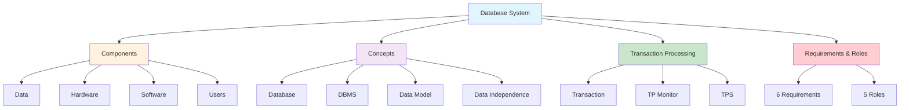
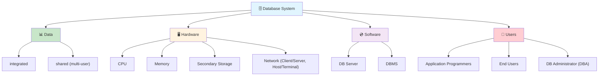
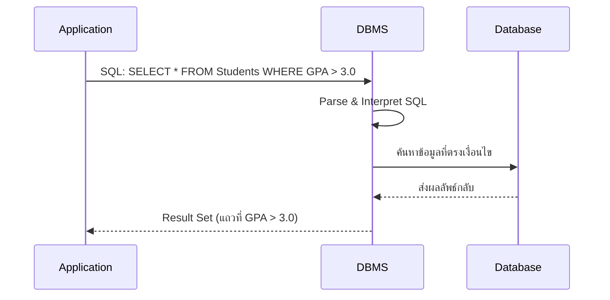
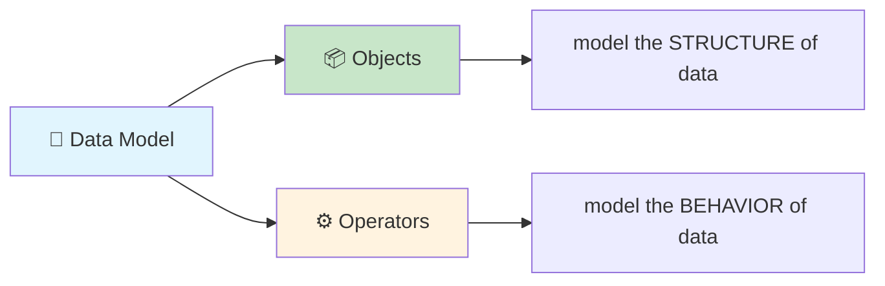
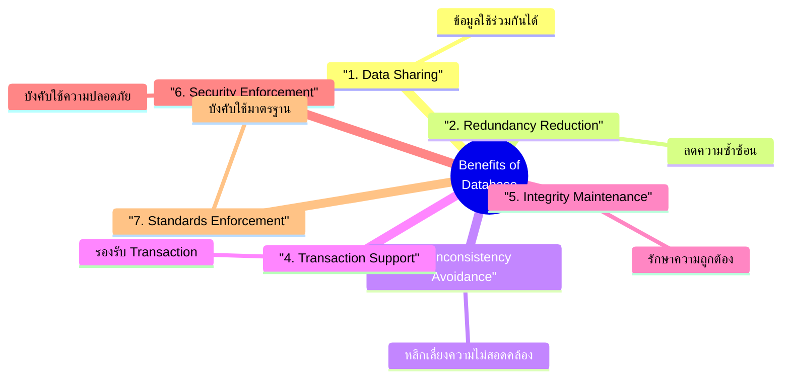
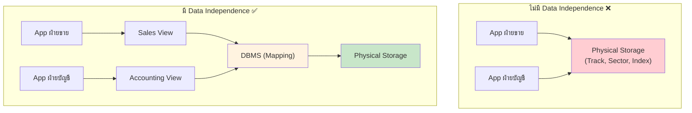
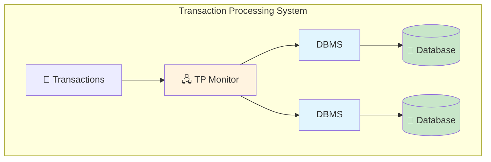
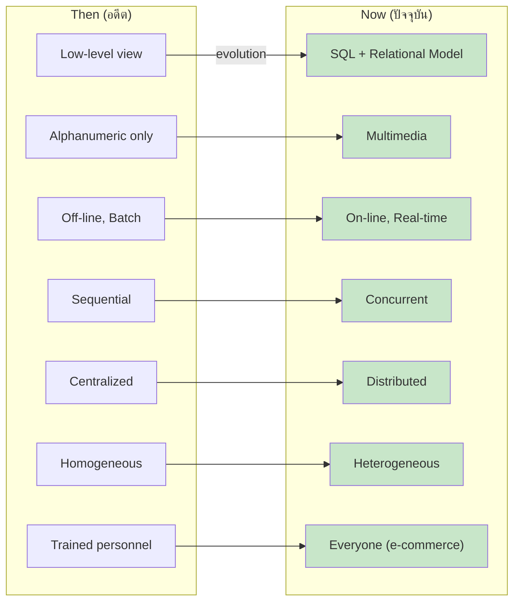
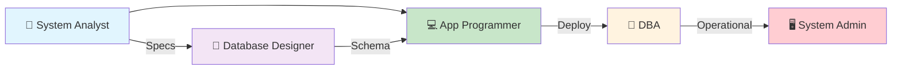

---
tags:
  - database
  - fundamentals
  - transaction
  - overview
  - lecture-1
created: 2026-07-07
updated: 2026-07-07
lecture: 1
type: lecture
---

# Lecture 1: Overview of Databases and Transaction Processing - Comprehensive Guide

> [!SUMMARY] ภาพรวมบทเรียน
> บทเรียนนี้ประกอบด้วย **9 ส่วนหลัก** ที่ครอบคลุมพื้นฐานของระบบฐานข้อมูล:
> 1. [[#1. Database Systems Components]] - ส่วนประกอบ 4 อย่างของระบบ DB
> 2. [[#2. What is a Database]] - นิยามของ Database
> 3. [[#3. What is a DBMS]] - หน้าที่ของ Database Management System
> 4. [[#4. What is a Data Model]] - แนวคิด Data Model
> 5. [[#5. Why Database and Benefits]] - เหตุผลและประโยชน์ 7 ข้อ
> 6. [[#6. Data Independence]] - หลักการ Data Independence
> 7. [[#7. Transaction and Transaction Processing System]] - Transaction, TPS และ TP Monitor
> 8. [[#8. DB Systems Then and Now]] - เปรียบเทียบ DB อดีต vs ปัจจุบัน 7 มิติ
> 9. [[#9. Database System Requirements and Roles]] - ข้อกำหนดระบบ 6 ข้อ + 5 บทบาท



---

# 1. Database Systems: Components

*📄 Slide 2*

> [!DEFINITION] Database System
> **Database System** คือระบบที่รวม 4 ส่วนเข้าด้วยกัน ได้แก่ Data, Hardware, Software และ Users เพื่อจัดการข้อมูลอย่างมีระบบสำหรับองค์กร

## 1.1 ส่วนประกอบ 4 อย่าง



| ส่วนประกอบ   | รายละเอียดจากสไลด์                      | คำอธิบายเพิ่มเติม                                                                                                                                 |
| ------------ | --------------------------------------- | ------------------------------------------------------------------------------------------------------------------------------------------------- |
| **Data**     | integrated, shared (multi-user)         | ข้อมูลที่ถูกรวมศูนย์ (integrated) หมายถึงข้อมูลจากหลายแหล่งถูกรวมเข้าด้วยกัน และ shared หมายถึงผู้ใช้หลายคนสามารถเข้าถึงข้อมูลเดียวกันได้พร้อมกัน |
| **Hardware** | CPU, memory, secondary storage, N/W     | รวมถึงเครื่องแม่ข่ายที่รันระบบ DB, อุปกรณ์จัดเก็บข้อมูล (HDD/SSD) และระบบเครือข่ายที่เชื่อมต่อ Client กับ Server                                  |
| **Software** | DB server, DBMS                         | DB Server คือโปรแกรมที่รัน DBMS อยู่บนเครื่องแม่ข่าย ส่วน DBMS คือซอฟต์แวร์หลักที่จัดการฐานข้อมูล                                                 |
| **Users**    | Application Programmers, End Users, DBA | ผู้ใช้แบ่งเป็น 3 กลุ่มตามบทบาท — programmer เขียนโปรแกรม, end user ใช้งาน, DBA ดูแลระบบ                                                           |

### ตัวอย่างจริง

| ส่วนประกอบ | ตัวอย่างจริงในองค์กร |
|---|---|
| **Data** | ข้อมูลลูกค้า, สินค้า, คำสั่งซื้อ ที่ถูกเก็บรวมในฐานข้อมูลเดียว |
| **Hardware** | Server Dell PowerEdge, SSD 2TB, เครือข่าย Gigabit Ethernet |
| **Software** | MySQL Server 8.0, Oracle Database 19c, PostgreSQL 15 |
| **Users** | Developer ที่เขียน Java app, พนักงานขายที่ดู report, DBA ที่ monitor performance |

---

# 2. What is a Database?

*📄 Slide 3*

> [!DEFINITION] Database
> **Database** คือ **collection of data** ที่เป็นศูนย์กลางขององค์กร (enterprise)

## 2.1 คุณสมบัติของ Database

จากสไลด์ Database มีคุณสมบัติ 4 ข้อสำคัญ:

| คุณสมบัติ | คำอธิบายจากสไลด์ | ขยายความ |
|---|---|---|
| **Essential to operation** | Contains the only record of enterprise activity | ข้อมูลใน DB คือบันทึกกิจกรรมเดียวขององค์กร — ถ้า DB พัง องค์กรก็หยุดชะงัก |
| **An asset in its own right** | Historical data can guide enterprise strategy and interest to other enterprises | ข้อมูลเชิงประวัติ (historical) เป็นทรัพย์สินที่มีค่า — สามารถวิเคราะห์เพื่อกำหนดกลยุทธ์ธุรกิจ หรือขายให้องค์กรอื่นที่สนใจ |
| **Mirrors state of enterprise** | State of database mirrors state of enterprise | สถานะของ DB สะท้อนสถานะจริงขององค์กร — เช่น จำนวนสินค้าคงคลังใน DB ต้องตรงกับของจริง |
| **Persistent** | Database is persistent | ข้อมูลใน DB คงอยู่ถาวรแม้ปิดระบบ — ต่างจาก RAM ที่หายเมื่อปิดเครื่อง |

### ตัวอย่างเปรียบเทียบ

```
🏪 ร้านขายของออนไลน์:

สถานะองค์กร                    สถานะ Database
──────────────                  ──────────────
สินค้า A เหลือ 50 ชิ้น    ←→   Product A: qty = 50
ลูกค้า B สั่งซื้อ 3 ชิ้น   ←→   Order B: items = 3
พนักงาน C ลาออก           ←→   Employee C: status = 'resigned'

หาก event เกิดขึ้นในโลกจริง → Database ต้องเปลี่ยนตาม
```

---

# 3. What is a DBMS?

*📄 Slide 4*

> [!DEFINITION] DBMS (Database Management System)
> **DBMS** คือ **โปรแกรม (program)** ที่จัดการฐานข้อมูล โดยมีคุณสมบัติหลัก 3 ข้อ:
> 1. รองรับ **high-level access language** (เช่น SQL)
> 2. Application อธิบายการเข้าถึง DB ด้วย**ภาษานั้น**
> 3. DBMS **แปลคำสั่ง (interpret)** ของภาษาเพื่อดำเนินการตามที่ร้องขอ

## 3.1 การทำงานของ DBMS



### ขยายความ

| จุดสำคัญ | คำอธิบาย |
|---|---|
| **High-level language** | ผู้ใช้ไม่ต้องรู้ว่าข้อมูลเก็บอยู่ที่ไหน, track/sector ไหน — แค่เขียน SQL ว่า "อยากได้อะไร" |
| **Application describes** | โปรแกรมที่เขียนขึ้นไม่ต้องจัดการ I/O ระดับต่ำ — แค่ส่งคำสั่ง SQL ไปให้ DBMS |
| **DBMS interprets** | DBMS รับ SQL → parse → optimize → execute → return results อัตโนมัติ |

### ตัวอย่าง DBMS ที่นิยม

| DBMS | ประเภท | ใช้กันทั่วไปใน |
|---|---|---|
| **MySQL** | Open Source RDBMS | เว็บแอปพลิเคชัน, WordPress |
| **PostgreSQL** | Open Source RDBMS | Enterprise, Data Analytics |
| **Oracle Database** | Commercial RDBMS | ธนาคาร, โรงพยาบาล, รัฐบาล |
| **Microsoft SQL Server** | Commercial RDBMS | องค์กรที่ใช้ .NET |
| **MongoDB** | NoSQL (Document) | สตาร์ทอัพ, Real-time apps |

---

# 4. What is a Data Model?

*📄 Slide 5*

> [!DEFINITION] Data Model
> **Data Model** คือ **การแทน (representation)** ของสถานการณ์จริงที่ข้อมูลจะถูกเก็บในฐานข้อมูล Data Model แสดงถึง **data flow** และ **ความสัมพันธ์เชิงตรรกะ (logical interrelationships)** ระหว่าง data elements ต่างๆ

## 4.1 องค์ประกอบ 2 ส่วน

จากสไลด์ Data Model ประกอบด้วย:



| ส่วนประกอบ | หน้าที่จากสไลด์ | ตัวอย่าง |
|---|---|---|
| **Objects** | จำลอง **โครงสร้าง** ของข้อมูล | Table `Student` มีคอลัมน์ Id, Name, GPA |
| **Operators** | จำลอง **พฤติกรรม** ของข้อมูล | `INSERT`, `SELECT`, `UPDATE`, `DELETE` |

### ตัวอย่าง: Relational Data Model

```
Objects (โครงสร้าง):
  - Table: Student (Id INT, Name VARCHAR, GPA FLOAT)
  - Table: Course (CrsCode VARCHAR, CrsName VARCHAR)

Operators (พฤติกรรม):
  - SELECT * FROM Student WHERE GPA > 3.0
  - INSERT INTO Course VALUES ('CS101', 'Intro to CS')
  - Student ⋈ Enrollment (Join operation)
```

> [!INFO] ประเภท Data Model ที่สำคัญ
> - **Relational Model** — ใช้ tables (relations) จำลองข้อมูล ← **เรียนในวิชานี้**
> - **ER Model** — ใช้ entities + relationships จำลองข้อมูลเชิงแนวคิด
> - **Object-Oriented Model** — ใช้ objects + classes
> - **Document Model** — ใช้ JSON/BSON documents (NoSQL)

---

# 5. Why Database and Benefits

*📄 Slides 6-7*

## 5.1 Why Database? (ทำไมต้องใช้ Database?)

จากสไลด์ 6 ให้เหตุผล 4 ข้อว่าทำไมต้องใช้ Database:

| เหตุผล               | ความหมาย           | เปรียบเทียบกับไม่ใช้ DB                                                   |
| -------------------- | ------------------ | ------------------------------------------------------------------------- |
| 🗜️ **Compactness**  | กะทัดรัด           | เอกสารกระดาษกินพื้นที่ตู้เอกสารหลายตู้ แต่ DB เก็บได้ใน HDD ตัวเดียว      |
| ⚡ **Speed**          | เร็ว               | ค้นหาข้อมูลจากเอกสาร 10,000 แฟ้มใช้เวลาเป็นชั่วโมง แต่ DB ใช้ไม่กี่วินาที |
| 🔄 **Less drudgery** | ลดงานซ้ำซ้อน       | ไม่ต้องกรอกข้อมูลเดิมซ้ำๆ ในหลายฟอร์ม                                     |
| 📡 **Currency**      | ข้อมูลเป็นปัจจุบัน | ข้อมูลอัปเดตได้ทันที ทุกคนเห็นข้อมูลล่าสุดเหมือนกัน                       |

## 5.2 Benefits of Database (ประโยชน์ 7 ข้อ)

จากสไลด์ 7 ประโยชน์ 7 ข้อ:



| #   | Benefit จากสไลด์                        | คำอธิบาย                                                   | ตัวอย่าง                                             |
| --- | --------------------------------------- | ---------------------------------------------------------- | ---------------------------------------------------- |
| 1   | **The data can be shared**              | ผู้ใช้หลายคนเข้าถึงข้อมูลเดียวกันได้                       | ฝ่ายขายและฝ่ายบัญชีดูข้อมูลลูกค้าเดียวกัน            |
| 2   | **Redundancy can be reduced**           | ลดการเก็บข้อมูลซ้ำซ้อน                                     | ที่อยู่ลูกค้าเก็บไว้ที่เดียว ไม่ใช่ทุกใบสั่งซื้อ     |
| 3   | **Inconsistency can be avoided**        | หลีกเลี่ยงข้อมูลขัดแย้งกัน                                 | ถ้าลดจากที่เดียว → ไม่มีปัญหาข้อมูลไม่ตรงกัน         |
| 4   | **Transaction support can be provided** | รองรับการทำงานแบบ Transaction                              | โอนเงิน: หักบัญชี A + เพิ่มบัญชี B ต้องสำเร็จทั้งคู่ |
| 5   | **Integrity can be maintained**         | รักษาความถูกต้องด้วย integrity constraints, business rules | อายุต้อง ≥ 0, เงินในบัญชีต้อง ≥ 0                    |
| 6   | **Security can be enforced**            | ควบคุมสิทธิ์การเข้าถึง                                     | นักศึกษาดูได้แค่ข้อมูลตัวเอง ไม่เห็นของคนอื่น        |
| 7   | **Standards can be enforced**           | บังคับใช้มาตรฐานข้อมูล                                     | format วันที่ต้องเป็น YYYY-MM-DD เสมอ                |

### เปรียบเทียบ: File System vs Database

```
📁 File System (แบบเดิม):
├── sales_dept/
│   └── customers.txt     ← ข้อมูลลูกค้าฝ่ายขาย
├── accounting_dept/
│   └── customers.txt     ← ข้อมูลลูกค้าฝ่ายบัญชี (ซ้ำ!)
└── hr_dept/
    └── customers.txt     ← ข้อมูลลูกค้าฝ่าย HR (ซ้ำอีก!)

❌ ปัญหา: ข้อมูลซ้ำ 3 ที่ → แก้ที่เดียวอีก 2 ที่ไม่ได้แก้ → inconsistent!

🗄️ Database (แบบใหม่):
└── centralized_db/
    └── Customers table   ← ข้อมูลที่เดียว ทุกฝ่ายเข้าถึงได้

✅ ข้อมูลอยู่ที่เดียว → แก้ครั้งเดียว → consistent ทุกที่
```

---

# 6. Data Independence

*📄 Slide 8*

> [!DEFINITION] Data Independence
> **Data Independence** คือหลักการที่ว่า:
> 1. Application ที่แตกต่างกันต้องการ **view ของข้อมูลที่แตกต่างกัน**
> 2. DBA ต้องสามารถ **เปลี่ยนแปลง physical representation** หรือ **access technique** ได้ โดย **ไม่ต้องแก้ไข application ที่มีอยู่**

## 6.1 ทำไม Data Independence สำคัญ?



| สถานการณ์ | ไม่มี Data Independence | มี Data Independence |
|---|---|---|
| เปลี่ยน HDD เป็น SSD | ❌ ต้องแก้ทุก application | ✅ แก้แค่ DBMS config |
| เพิ่ม index ใหม่ | ❌ ต้องแก้ทุก application | ✅ DBA เพิ่มได้เลย |
| เปลี่ยนวิธีจัดเก็บ | ❌ ต้อง rewrite code | ✅ DBMS จัดการให้ |

> [!WARNING] ข้อสังเกตจากสไลด์
> คำว่า "Data Independent" ในสไลด์ (slide 8) หมายถึง **Physical Data Independence** — ซ่อนรายละเอียดการจัดเก็บจาก application เพื่อให้ DBA สามารถปรับเปลี่ยนได้อย่างอิสระ ดูรายละเอียดเพิ่มใน [[Lecture 2 - Database Architecture and Relational Model|Lecture 2]]

---

# 7. Transaction and Transaction Processing System

*📄 Slides 9-11*

## 7.1 What is a Transaction? (Slide 9)

> [!DEFINITION] Transaction
> **Transaction** คือ **หน่วยเชิงตรรกะ (logical unit)** ของการประมวลผลฐานข้อมูลที่ประกอบด้วย access operations หนึ่งรายการขึ้นไป

### จากสไลด์ Transaction มี 3 มุมมอง:

| มุมมอง | คำอธิบายจากสไลด์ |
|---|---|
| **Real-world event** | เมื่อเหตุการณ์ในโลกจริงเปลี่ยนสถานะขององค์กร → transaction ถูก execute เพื่อเปลี่ยนสถานะ DB ให้สอดคล้อง |
| **On-line database** | event ทำให้ transaction ถูก execute ใน **real time** |
| **Logical unit** | Transaction คือ **unit ของ program execution** ที่เข้าถึงและอาจแก้ไข data objects ต่างๆ (tuples, relations) |

### Access Operations ใน Transaction

| Operation | ความหมายจากสไลด์ | ตัวอย่าง SQL |
|---|---|---|
| **Read** | retrieval of information from database | `SELECT balance FROM Account WHERE id = 'A'` |
| **Write** | insert or update in the database, delete data from the database | `UPDATE Account SET balance = balance - 100 WHERE id = 'A'` |

### ตัวอย่าง: Transaction โอนเงิน

```
Transaction T: โอนเงิน 1,000 บาท จาก Account A → Account B

Step 1: Read(A)           ← อ่านยอดเงิน A
Step 2: A = A - 1,000     ← คำนวณยอดใหม่
Step 3: Write(A)          ← เขียนยอดใหม่กลับ
Step 4: Read(B)           ← อ่านยอดเงิน B
Step 5: B = B + 1,000     ← คำนวณยอดใหม่
Step 6: Write(B)          ← เขียนยอดใหม่กลับ

ทั้ง 6 steps ต้องทำ "ทั้งหมดหรือไม่ทำเลย" (Atomicity)
```

## 7.2 What is a Transaction Processing System? (Slide 10)

> [!DEFINITION] Transaction Processing System (TPS)
> จากสไลด์: TPS ประกอบด้วย **3 ส่วน**:
> 1. **TP Monitor** — ควบคุมการ execute ของ transaction
> 2. **Databases** — ฐานข้อมูลที่ถูกเข้าถึง
> 3. **Transactions** — หน่วยงานที่ต้องทำ

### TP Monitor คืออะไร?

จากสไลด์:
- TP Monitor สร้าง **abstraction ของ Transaction** — คล้ายกับที่ OS สร้าง **abstraction ของ Process**
- TP Monitor + DBMS ร่วมกัน **guarantee คุณสมบัติพิเศษ** ของ transactions



> [!INFO] เปรียบเทียบ TP Monitor vs OS
> | | OS | TP Monitor |
> |---|---|---|
> | **สร้าง abstraction ของ** | Process | Transaction |
> | **จัดการ** | CPU, Memory, I/O | Database access |
> | **Guarantee** | Fair scheduling | ACID properties |

## 7.3 Transaction Processing System Architecture (Slide 11)

จากภาพในสไลด์ 11:

```
                              DBMS ──── database
                             /
transactions ──→ TP Monitor
                             \
                              DBMS ──── database
```

### ขยายความจากภาพ

| ส่วนประกอบ | บทบาท |
|---|---|
| **Transactions** | คำร้องขอที่เข้ามาจาก applications หลายตัว |
| **TP Monitor** | ตัวกลางที่รับคำร้องขอ → กระจายไปยัง DBMS ที่เหมาะสม |
| **DBMS (หลายตัว)** | แต่ละ DBMS จัดการ database ของตัวเอง |
| **Databases** | อาจมีหลาย databases ในระบบเดียว |

> [!INFO] ตัวอย่าง TP Monitor ในโลกจริง
> - **CICS** (IBM) — ใช้ในธนาคาร
> - **Tuxedo** (Oracle) — ใช้ในระบบโทรคมนาคม
> - **Java EE Application Server** — Tomcat, WildFly

---

# 8. DB Systems: Then and Now

*📄 Slides 12-14*

> [!INFO] ภาพรวม
> สไลด์ 12-14 เปรียบเทียบระบบ DB ในอดีตกับปัจจุบันใน **7 มิติ** แสดงให้เห็นว่าระบบฐานข้อมูลพัฒนาไปมากแค่ไหน

## 8.1 Slide 12: 3 มิติแรก

| มิติ | อดีต (Then) | ปัจจุบัน (Now) | ความหมาย |
|---|---|---|---|
| **Data View** | Low-level view ของข้อมูล | **Relational model using SQL** — high-level view *(อาจมี NoSQL DB ในบางองค์กร)* | เดิมต้องรู้ physical structure → ปัจจุบันแค่เขียน SQL |
| **Data Type** | Alphanumeric data เท่านั้น | **Multimedia data** | เดิมเก็บได้แค่ตัวอักษร/ตัวเลข → ปัจจุบันเก็บรูป, วิดีโอ, เสียง |
| **Processing** | Off-line, **batch** processing | **On-line**: database accessed at time of event | เดิมสะสมงานแล้วประมวลผลทีเดียว → ปัจจุบันทำ real-time |

## 8.2 Slide 13: 2 มิติถัดมา

| มิติ | อดีต (Then) | ปัจจุบัน (Now) | ความหมาย |
|---|---|---|---|
| **Concurrency** | Processed transactions **sequentially** | **Concurrent** — multiple transactions execute simultaneously | เดิมทำทีละ transaction → ปัจจุบันทำพร้อมกันหลาย transaction |
| **Computation** | **Centralized** systems | **Distributed computation** — different parts of the application execute on different computers | เดิมทำบนเครื่องเดียว → ปัจจุบันกระจายไปหลายเครื่อง |

## 8.3 Slide 14: 3 มิติสุดท้าย

| มิติ | อดีต (Then) | ปัจจุบัน (Now) | ความหมาย |
|---|---|---|---|
| **Data Distribution** | **Centralized** | **Distributed data** — different parts of the data stored in different databases on different computers | เดิมเก็บที่เดียว → ปัจจุบันกระจายหลาย DB หลายเครื่อง |
| **Heterogeneity** | **Homogeneous** systems | **Heterogeneous** — involves HW and SW modules from different manufacturers | เดิมใช้อุปกรณ์/ซอฟต์แวร์ยี่ห้อเดียว → ปัจจุบันผสมหลายยี่ห้อ |
| **Access** | Restricted to **trained personnel** | Accessed by **everyone** (e.g., e-commerce) | เดิมเฉพาะผู้เชี่ยวชาญ → ปัจจุบันทุกคนเข้าถึง (ผ่านเว็บ, app) |

### Visual Summary: 7 มิติ



---

# 9. Database System Requirements and Roles

*📄 Slides 15-18*

## 9.1 Database System Requirements (Slides 15-16)

จากสไลด์ 15-16 ระบุ **6 ข้อกำหนด** ที่ Database System ต้องมี:

| # | Requirement | คำอธิบายจากสไลด์ | ขยายความ |
|---|---|---|---|
| 1 | 🟢 **High Availability** | on-line ⇒ must be operational while enterprise is functioning | ระบบต้องทำงานได้ตลอดเวลาที่องค์กรเปิดทำการ — เช่น ธนาคาร 24/7, e-commerce ตลอดเวลา |
| 2 | 🔵 **High Reliability** | correctly tracks state, does not lose data, controlled concurrency | ติดตามสถานะอย่างถูกต้อง ไม่สูญเสียข้อมูล ควบคุมการทำงานพร้อมกัน |
| 3 | ⚡ **High Throughput** | many users ⇒ many transactions/sec | ผู้ใช้จำนวนมาก ⇒ ต้องรองรับ transactions/sec จำนวนมาก |
| 4 | ⏱️ **Low Response Time** | on-line ⇒ reduce users waiting time | ผู้ใช้ต้องไม่ต้องรอนาน — เป้าหมาย < 1 วินาที |
| 5 | 🔄 **Long Lifetime** | complex systems are not easily replaced. Must be designed so they can be easily extended as the needs of the enterprise change | ระบบซับซ้อนแทนที่ยาก — ต้องออกแบบให้ขยายได้ง่ายเมื่อความต้องการเปลี่ยน |
| 6 | 🔐 **Trusted Security** | sensitive information must be carefully protected since system is accessible to many users | ข้อมูลอ่อนไหวต้องถูกปกป้อง ด้วย Authentication, Authorization, Encryption |

### ตัวอย่างจริง

```
🏦 ระบบธนาคาร:

High Availability  → ระบบ ATM ต้องใช้ได้ 24/7/365
High Reliability   → ยอดเงินต้องถูกต้องแม่นยำ ไม่มีเงินหาย
High Throughput    → รองรับ 10,000+ transactions/sec ช่วง peak
Low Response Time  → ถอนเงิน ATM ใช้เวลา < 3 วินาที
Long Lifetime      → ระบบ core banking ใช้งานมานาน 20+ ปี
Trusted Security   → PIN, OTP, Encryption, Audit trail
```

## 9.2 Roles in Design, Implementation, and Maintenance of TPS (Slides 17-18)

จากสไลด์ 17-18 ระบุ **5 บทบาท** ที่เกี่ยวข้องกับ TPS:

| #   | บทบาท                            | หน้าที่จากสไลด์                                                                                                                     | ขยายความ                                                                      |
| --- | -------------------------------- | ----------------------------------------------------------------------------------------------------------------------------------- | ----------------------------------------------------------------------------- |
| 1   | **System Analyst**               | specifies system using input from customer, provides complete description of functionality from customer's and user's point of view | รับ requirement จากลูกค้า → แปลงเป็น system specification (SRS)               |
| 2   | **Database Designer**            | specifies structure of data that will be stored in database                                                                         | กำหนดว่าจะเก็บข้อมูลอะไร, ตารางไหน, ความสัมพันธ์อย่างไร (ER Diagram → Schema) |
| 3   | **Application Programmer**       | implements application programs (transactions) that access data and support enterprise rules                                        | เขียนโปรแกรม (transactions) ที่เข้าถึง data และบังคับใช้ business rules       |
| 4   | **Database Administrator (DBA)** | maintains database once system is operational: space allocation, performance optimization, database security                        | ดูแล DB หลังใช้งานจริง: จัดสรรพื้นที่, tune performance, จัดการ security      |
| 5   | **System Administrator**         | maintains transaction processing system: monitors interconnection of HW and SW modules, deals with failures and congestion          | ดูแลระบบ TPS: ตรวจสอบการเชื่อมต่อ HW/SW, จัดการ failures และ congestion       |

### Workflow ของทีมพัฒนา



> [!INFO] ข้อสังเกต
> ในองค์กรขนาดเล็ก บทบาทเหล่านี้อาจทับซ้อนกัน — เช่น DBA อาจทำหน้าที่ System Admin ด้วย หรือ Developer อาจทำหน้าที่ Database Designer ด้วย

---

# 10. สรุปภาพรวม

## Key Takeaways

| Topic | Key Point |
|---|---|
| **DB System** | ประกอบด้วย Data, Hardware, Software, Users |
| **Database** | Collection of data ที่เป็นศูนย์กลางองค์กร, persistent, mirrors enterprise state |
| **DBMS** | Program ที่จัดการ DB ผ่าน high-level language (SQL) |
| **Data Model** | Objects (structure) + Operators (behavior) |
| **Benefits** | 7 ข้อ: Share, Reduce Redundancy, Avoid Inconsistency, Transaction, Integrity, Security, Standards |
| **Data Independence** | เปลี่ยน physical storage ได้โดยไม่กระทบ application |
| **Transaction** | Logical unit ของ DB processing: Read + Write operations |
| **TPS** | TP Monitor + DBMS + Databases |
| **Then vs Now** | 7 มิติ: Low→High level, Batch→Online, Sequential→Concurrent, Centralized→Distributed |
| **Requirements** | 6 ข้อ: Availability, Reliability, Throughput, Response Time, Lifetime, Security |
| **Roles** | 5 บทบาท: System Analyst, DB Designer, App Programmer, DBA, System Admin |

---

# References

- **Course:** Database System - Lecture 1
- **Slides:** 18 slides (all covered)
- **Related Notes:** [[Lecture 2 - Database Architecture and Relational Model]], [[Lecture 8 - Transaction Processing]]

---

*Last updated: 2026-07-07*
