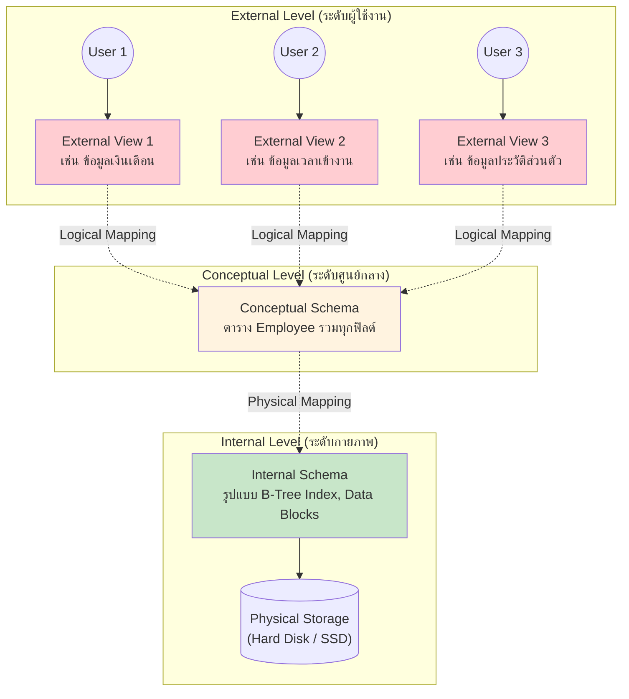

---
tags:
  - database
  - architecture
  - relational-model
  - lecture-2
created: 2026-07-07
updated: 2026-07-07
lecture: 2
type: lecture
---

# Lecture 2: Database Architecture and Relational Model (เจาะลึกสถาปัตยกรรมและโมเดลเชิงสัมพันธ์)

> [!SUMMARY] ภาพรวมบทเรียน
> บทเรียนนี้ว่าด้วยรากฐานสถาปัตยกรรมระบบฐานข้อมูลและการจัดโครงสร้างข้อมูลแบบตาราง (Relational Model) อย่างละเอียดระดับเจาะลึก โดยอธิบายกลไกเชิงลึกและทฤษฎีในแต่ละหน้าสไลด์ (Slide 1 - 35) อย่างครบถ้วนทุกประเด็น เพื่อให้เข้าใจถึงวิธีการที่ฐานข้อมูลซ่อนความซับซ้อนทางฮาร์ดแวร์เอาไว้ และวิธีการควบคุมความถูกต้องของข้อมูลผ่านข้อบังคับต่างๆ (Integrity Constraints)

---

## 🏛️ Slide 1: Title
**Database System Architecture and Introduction to Relational Database**

ฐานข้อมูลไม่ได้เป็นเพียงแค่ที่เก็บไฟล์ข้อมูลดิบๆ เท่านั้น แต่มันมี **สถาปัตยกรรม (Architecture)** ที่ถูกออกแบบมาอย่างแยบยลเพื่อแก้ปัญหาในอดีต (เช่น การที่โค้ดโปรแกรมต้องผูกติดกับฮาร์ดแวร์) นอกจากนี้ บทเรียนนี้ยังแนะนำให้รู้จักกับ **Relational Database (ฐานข้อมูลเชิงสัมพันธ์)** ซึ่งเป็นโมเดลที่ได้รับความนิยมที่สุดในโลกปัจจุบัน โดยใช้หลักการทางคณิตศาสตร์และทฤษฎีเซตมาช่วยจัดการข้อมูล

---

## 🏗️ Slide 2: Database System Architecture
> [!DEFINITION] ANSI/SPARC Architecture
> มาตรฐานสถาปัตยกรรมระบบฐานข้อมูลที่ถูกคิดค้นขึ้นเพื่อสร้างมาตรฐานสากล โดยแบ่งระบบฐานข้อมูลออกเป็น **3 ระดับ (Three-level architecture)** เพื่อแยกมุมมองของผู้ใช้งาน (User View) ออกจากวิธีการจัดเก็บข้อมูลจริงทางกายภาพ (Physical Storage)

ระบบ ANSI/SPARC แบ่งการทำงานออกเป็น 3 ระดับอย่างชัดเจน ดังนี้:

| ระดับชั้น | หน้าที่และคำอธิบายเชิงลึก |
|---|---|
| 🟢 **Internal level (Physical level)** | เป็นระดับที่ล่างสุดและอยู่ "ใกล้ชิด" กับอุปกรณ์จัดเก็บข้อมูลทางกายภาพ (ฮาร์ดดิสก์) มากที่สุด จัดการเรื่องการเขียนข้อมูลลง Block, Cylinder, หรือ Track ของดิสก์โดยตรง |
| 🔵 **External level (User logical level)** | เป็นระดับบนสุดที่อยู่ "ใกล้ชิด" กับผู้ใช้งานระบบมากที่สุด ผู้ใช้แต่ละคนอาจจะเห็นหน้าตาข้อมูล (Views) ไม่เหมือนกัน ขึ้นอยู่กับสิทธิ์และความต้องการของงานนั้นๆ |
| 🟠 **Conceptual level (Logical level)** | เป็นระดับตัวกลางที่อยู่ระหว่าง External และ Internal หน้าที่คือการเป็น "ศูนย์รวม" (Global view) ที่อธิบายว่า ฐานข้อมูลนี้ประกอบไปด้วยตารางอะไรบ้าง มีคอลัมน์อะไรบ้าง และมีความสัมพันธ์กันอย่างไร โดยปราศจากรายละเอียดทางฮาร์ดแวร์ |

---

## 📊 Slide 3-4: Visualizing the ANSI/SPARC Architecture (แผนภาพโครงสร้าง)
แม้ในสไลด์จะเป็นภาพโครงสร้างกราฟิก แต่เราสามารถถอดรหัสออกมาเป็นแผนภาพการทำงานเชิงแนวคิดที่ละเอียดได้ดังนี้:

> [!INFO] เจาะลึกกลไกของภาพ (Mapping Process)
> - **Mapping (การแปลง):** สังเกตเส้นปะในแผนภาพ มันคือกลไกการ "แปลภาษา" ที่ DBMS ทำให้
> - เมื่อ User 1 ขอเรียกดู View 1 ระบบจะใช้ *Logical Mapping* แปลงคำขอนั้นให้กลายเป็นการคิวรีข้อมูลจาก Conceptual Schema
> - จากนั้น Conceptual Schema จะใช้ *Physical Mapping* แปลงคำสั่งระดับตาราง ให้กลายเป็นคำสั่งอ่านเขียนบล็อกข้อมูลในฮาร์ดดิสก์ผ่าน Internal Schema

---

## 🧩 Slide 5: Data and Its Structure
**ข้อมูลและโครงสร้างของมัน**

*   **ความเป็นจริงอันโหดร้าย (The Reality of Storage):** 
    ในโลกความเป็นจริง ข้อมูลถูกบันทึกอยู่ในฮาร์ดแวร์ในรูปแบบของเลขฐานสอง (Bits คือ 0 และ 1) การให้โปรแกรมเมอร์มานั่งเขียนโค้ดเพื่อค้นหาข้อมูลจากสายอักขระ `01010111` นั้นเป็นเรื่องที่แทบจะเป็นไปไม่ได้และจัดการได้ยากมาก (difficult to work with data at this level)
*   **ทางออก (The Solution):** 
    เพื่อแก้ปัญหานี้ เราจึงต้องมี **"ระดับชั้นแห่งความเป็นนามธรรม (Levels of abstraction)"** ซึ่งเปรียบเสมือนเลนส์แว่นตาที่ช่วยกรองความซับซ้อนทิ้งไป ให้เราเห็นเฉพาะสิ่งที่ตาคนปกติควรมองเห็น

> [!DEFINITION] Schema (สคีมา) คืออะไร?
> Schema คือ **"คำอธิบายโครงสร้างของข้อมูล" (Description of data)** ในแต่ละระดับของ abstraction ระบบ ANSI/SPARC จึงมี 3 Schema หลักคู่กับ 3 เลเวล:
> 1. Physical schema
> 2. Conceptual schema
> 3. External schema

---

## 💾 Slide 6: Physical Data Level
**เจาะลึกระดับกายภาพ (Physical Data Level)**

*   **บทบาท:** Physical schema มีหน้าที่อธิบายถึง "วิธีการ" (How) ที่ข้อมูลถูกนำไปจัดเก็บจริงๆ ในอุปกรณ์ฮาร์ดแวร์ เช่น ข้อมูลถูกเก็บไว้ใน Track ใด, Cylinder ไหน, หรือมีการใช้ดัชนี (Indices) แบบใดเพื่อเร่งความเร็ว
*   **ปัญหาในอดีต (The Legacy Problem):**
    ในยุคแรกๆ ก่อนจะมีระบบ DBMS แอปพลิเคชันถูกเขียนขึ้นมาโดยต้องทำงานที่ระดับนี้โดยตรง (explicitly dealt with details) หมายความว่า โปรแกรมเมอร์ต้องเขียนโค้ด **Hardcoded** ระบุตำแหน่งไฟล์ในดิสก์

> [!WARNING] ผลลัพธ์ที่เลวร้าย 3 ประการ (หากไม่มี Abstraction)
> 1. **แก้ยาก (Changes to data structure difficult to make):** หากบริษัทต้องการอัปเกรดฮาร์ดดิสก์ใหม่ หรือเปลี่ยนวิธีจัดเก็บไฟล์ ต้องรื้อโค้ดแอปพลิเคชันแก้ใหม่ทั้งหมด
> 2. **โค้ดซับซ้อน (Application code becomes complex):** โปรแกรมเมอร์ต้องเขียนโค้ดจัดการข้อมูลขยะ จัดการพอยน์เตอร์ จัดการบัฟเฟอร์ในหน่วยความจำเองทั้งหมด
> 3. **พัฒนาช้า (Rapid implementation of new features impossible):** การเพิ่มฟีเจอร์ใหม่เป็นเรื่องที่กินเวลา เพราะมัวแต่ต้องวุ่นวายกับโครงสร้างไฟล์ระดับล่าง

---

## 🧠 Slide 7: Conceptual Data Level
**เจาะลึกระดับแนวคิด (Conceptual Data Level)**

*   **บทบาทหลัก:** ระดับนี้คือพระเอกที่มาแก้ปัญหาในข้อที่แล้ว โดยมีหน้าที่ **ซ่อนรายละเอียดทางกายภาพ (Hides details)** ไว้เบื้องหลังทั้งหมด
*   **มุมมองเชิงสัมพันธ์ (The Relational View):** ใน Relational Model นั้น Conceptual schema จะนำเสนอข้อมูลทั้งหมดในระบบให้อยู่ในรูปแบบของ **"เซตของตาราง (A set of tables)"** ซึ่งเป็นรูปแบบที่มนุษย์อ่านและทำความเข้าใจได้ง่ายที่สุด
*   **เวทมนตร์ของ DBMS:** DBMS จะทำหน้าที่รับผิดชอบแปลงตารางเหล่านี้ (Maps) ให้กลายเป็นการเขียนไฟล์ระดับ Physical schema ให้อัตโนมัติ (Automatically) 

> [!DEFINITION] Physical Data Independence (ความเป็นอิสระของข้อมูลทางกายภาพ)
> คุณสมบัติแห่งการปลดแอก! คือความสามารถในการ **"เปลี่ยนแปลงโครงสร้างระดับ Physical schema ได้"** (เช่น ย้ายโฟลเดอร์เก็บไฟล์, เปลี่ยนชนิดของฮาร์ดดิสก์, เพิ่ม B-Tree Index) **"โดยที่แอปพลิเคชันเดิมยังทำงานได้ปกติโดยไม่ต้องแก้โค้ดแม้แต่บรรทัดเดียว"** เพราะ DBMS จะเป็นคนจัดการอัปเดตการ Mapping ระหว่าง Conceptual ไป Physical ให้เอง

---

## 🔄 Slide 8: Mapping from Conceptual to Physical (Diagram)
สไลด์นี้แสดงภาพกลไกการเปลี่ยนผ่านจากแอปพลิเคชันลงสู่ฮาร์ดแวร์ ซึ่งสามารถเขียนขยายความเป็น Trace การทำงานได้ดังนี้:

> [!EXAMPLE] Trace: การทำงานของ Mapping
> **ตัวอย่างสถานการณ์:** แอปพลิเคชัน HR ต้องการดึงชื่อพนักงาน
> 
> 1. **[Application]** ส่งคำสั่ง: `SELECT Name FROM Employee`
> 2. **[Conceptual view of data]** ระบบมองเห็นโครงสร้างตารางตรรกะว่า `Employee` มีอยู่จริง จึงส่งคำสั่งต่อไปให้ DBMS
> 3. **[DBMS]** เป็นตัวประมวลผล (The Engine) เปิดดู Mapping Dictionary ว่าตาราง `Employee` ถูกเก็บอยู่ที่ตำแหน่งใดในดิสก์
> 4. **[Physical view of data]** DBMS ออกคำสั่งระบบปฏิบัติการระดับล่าง: "จงไปที่ Drive D:, อ่านไฟล์ EmpData.bin ตั้งแต่ Byte ที่ 1024 ไป 50 Bytes" ฮาร์ดดิสก์ส่งกระแสไฟฟ้า 0101 กลับมา
> 5. **[DBMS -> Application]** DBMS แปลง 0101 กลับเป็นตาราง ประกอบร่างคืนแล้วส่งไปให้หน้าจอแอปพลิเคชัน

**บทสรุปภาพนี้:** เน้นย้ำเรื่อง **Physical Data Independence** อย่างชัดเจน แอปพลิเคชันไม่ต้องรู้เลยว่าไฟล์ชื่อ `EmpData.bin` อยู่ที่ไหน รู้แค่ชื่อตาราง `Employee` ก็พอ

---

## 👁️ Slide 9: External Data Level
**เจาะลึกระดับภายนอก (External Data Level)**

*   **บทบาท:** ใน Relational Model, External schema ก็นำเสนอข้อมูลเป็นชุดตาราง (Relations) เหมือนกัน แต่ความต่างคือ **มันถูกตัดเย็บขึ้นมาเฉพาะบุคคล (Tailored to the needs)** สำหรับผู้ใช้งานกลุ่มใดกลุ่มหนึ่งโดยเฉพาะ เราเรียกสิ่งนี้ว่า View

> [!INFO] ความสำคัญของ View (External Schema)
> 1. 🔐 **เพื่อการรักษาความปลอดภัยและซ่อนเร้นข้อมูล (Security):**
>    - กฎคือ ข้อมูลที่เก็บในระบบบางส่วน **ไม่ควรถูกเห็นโดยผู้ใช้บางกลุ่ม**
>    - **ตัวอย่าง:** นักศึกษา (Students) สามารถดูประวัติตัวเองได้ แต่ **ไม่ควรเห็น** ข้อมูลเงินเดือนของอาจารย์ (Faculty salaries)
> 2. 🧮 **สร้างข้อมูลจำลอง (Derived Data):**
>    - ข้อมูลบางอย่างสามารถคำนวณเอาจากข้อมูลที่มีอยู่แล้วได้ (Can be derived from stored data) ดังนั้นจึง **ไม่จำเป็นต้องเก็บลงดิสก์** จริงๆ ประหยัดพื้นที่
>    - **ตัวอย่าง:** เกรดเฉลี่ยสะสม (GPA) ไม่ได้ถูกเก็บเป็นคอลัมน์ในฐานข้อมูล (Not stored) แต่จะถูกนำเกรดของทุกวิชามา **คำนวณ (calculated)** สดๆ ทุกครั้งที่นักศึกษาล็อกอินเข้ามาดู View ของตัวเอง

---

## 🛡️ Slide 10: External Data Level (con't)
**คุณสมบัติความอิสระชั้นที่สอง**

*   **การพัฒนาแอปพลิเคชัน:** แอปพลิเคชันของฝั่งผู้ใช้งาน (Frontend) จะถูกเขียนขึ้นโดยอ้างอิงกับ **External schema** เสมอ (เช่น เขียนให้ดึงข้อมูลจาก `Student_GPA_View`)
*   **กลไกการสร้าง View:** View จะถูกประมวลผลและสร้างตารางขึ้นมาสดๆ ก็ต่อเมื่อมีคนกดเรียกดู (Computed when accessed) ไม่ได้กินพื้นที่ในฮาร์ดดิสก์
*   **ความหลากหลาย:** ผู้ใช้แต่ละระดับ สามารถมี External schema ของตัวเองแยกกันเป็น 10ๆ แบบได้
*   **เวทมนตร์ของ DBMS อีกครั้ง:** DBMS จะทำหน้าที่แอบแปลคำสั่ง (Translation) จาก View ลงไปค้นหาใน Conceptual ให้อัตโนมัติ (At run time)

> [!DEFINITION] Conceptual Data Independence (ความเป็นอิสระของข้อมูลทางแนวคิด)
> คุณสมบัติแห่งการปลดแอกชั้นที่สอง! คือความสามารถในการ **"เปลี่ยนแปลงโครงสร้างระดับ Conceptual schema ได้"** (เช่น เพิ่มคอลัมน์ใหม่ในตาราง, แตก 1 ตารางออกเป็น 2 ตาราง) **"โดยที่แอปพลิเคชันของผู้ใช้ที่ทำงานผ่าน External View ไม่ได้รับผลกระทบ"** เราเพียงแค่ต้องไปแก้กฎการ Mapping จาก External สู่ Conceptual ให้ชี้ไปตารางที่ถูกต้องก็พอ

---

## 🏢 Slide 11: Levels of Abstraction (Diagram)
สไลด์นี้แสดงภาพของบริษัทจำลองที่มีระบบ 3 แผนก ซึ่งเราสามารถทำตารางเปรียบเทียบกลไกการทำงานได้:

| ระบบหน้าจอ (External Schemas) | ฐานข้อมูลส่วนกลาง (Conceptual Schema) | ไฟล์บนดิสก์ (Physical Schema) |
|---|---|---|
| **Payroll View (ฝ่ายเงินเดือน)** ✓ มองเห็น: รหัส, ชื่อ, เงินเดือน, ภาษี ✗ ไม่เห็น: วันลา, ประวัติป่วย | **Employee_Master_Table** (ตารางยักษ์ที่รวบรวมทุกฟิลด์ของพนักงานไว้ในที่เดียว ทั้งชื่อ, เงินเดือน, ประวัติ, ข้อมูลลูกค้า) | **Data Files** - `emp_data.db` (เก็บข้อมูล) - `emp_idx.tree` (Index เพิ่มความเร็วค้นหา) |
| **Billing View (ฝ่ายออกบิล)** ✓ มองเห็น: รหัสลูกค้า, ยอดเงิน, สินค้า ✗ ไม่เห็น: เงินเดือนพนักงาน | **Customer_Order_Table** (ตารางรวมออร์เดอร์ทั้งหมด) | **Storage Devices** - RAID Array, SSDs |
| **Records View (ฝ่ายทะเบียน)** ✓ มองเห็น: ชื่อพนักงาน, ที่อยู่, วันเกิด ✗ ไม่เห็น: เงินเดือน | (ใช้ตาราง Employee_Master_Table ร่วมกับฝ่าย Payroll) | |

**บทสรุปภาพนี้:** ทั้ง 3 แผนกทำงานกับ View คนละใบ (ต่างคนต่างเห็นโลกคนละใบ) แต่ทุก View ล้วนชี้ลงมาที่ Conceptual Schema อันเดียวกัน และจัดเก็บอยู่ในฮาร์ดแวร์ Physical Schema ตู้เดียวกัน (Centralization)

---

## 👨‍💼 Slide 12: The Database Administrator (DBA)
**บทบาทของผู้ดูแลระบบฐานข้อมูล**

DBA เป็นผู้ที่กุมชะตาของฐานข้อมูล มีอำนาจสูงสุดและต้องมีความรู้ครอบคลุมทั้ง 3 ระดับ หน้าที่หลัก 6 ประการได้แก่:

1. **Defining the conceptual schema:** เป็นผู้ออกแบบว่าบริษัทต้องมีตารางอะไรบ้าง ข้อมูลไหนควรเก็บหรือควรทิ้ง (การวาด ER Diagram และสร้างตารางหลัก)
2. **Defining the internal schema:** เป็นผู้ตั้งค่า Physical storage เช่น เลือกว่าจะจัดเก็บไฟล์แบบไหน เลือกว่าจะสร้าง Index ที่คอลัมน์ไหนเพื่อให้คิวรีเร็วขึ้น
3. **Liaising with users:** เป็นตัวกลางประสานงานกับผู้ใช้งานจริง (Users) เพื่อสอบถามความต้องการ และนำมาออกแบบ External schema (Views) ให้ตรงตามความต้องการของแต่ละแผนก
4. **Defining security and integrity constraints:** กำหนดรหัสผ่าน สิทธิ์การเข้าถึง (ใครอ่านได้อย่างเดียว ใครลบได้) และเขียนกฎบังคับ (Constraints) เพื่อป้องกันไม่ให้คนใส่ข้อมูลขยะ
5. **Defining dump and reload policies:** วางแผนระบบสำรองข้อมูล (Backup/Dump) ทุกคืน และกำหนดขั้นตอนการกู้คืน (Recovery/Reload) เวลาเซิร์ฟเวอร์พัง
6. **Monitoring performance:** คอยนั่งดูกราฟการทำงาน ถ้าระบบช้าลงเพราะข้อมูลเยอะขึ้น DBA ต้องปรับแต่ง (Tuning) เปลี่ยนแปลงโครงสร้าง หรือย้ายดิสก์ให้เร็วขึ้น (ตอบสนองต่อ changing requirements)

---

## ⚙️ Slide 13-14: DBMS Functions
**โปรแกรม DBMS ทำหน้าที่อะไรบ้าง?**

DBMS (Database Management System) เป็นซอฟต์แวร์ขนาดใหญ่ที่เปรียบเสมือนระบบปฏิบัติการซ้อนระบบปฏิบัติการ หน้าที่หลักมี 7 อย่าง:

| ฟังก์ชัน | หน้าที่และคำอธิบาย |
|---|---|
| 📐 **Data definition (DDL)** | รับคำสั่งนิยามโครงสร้างข้อมูล (เช่น `CREATE TABLE`, `DROP TABLE`) แล้วไปสร้างโครงสร้างจริง |
| 📝 **Data manipulation (DML)** | รับคำสั่งจัดการข้อมูล (เช่น `INSERT`, `UPDATE`, `DELETE`, `SELECT`) แล้วดำเนินการให้ผลลัพธ์ |
| 🚀 **Optimization and execution** | ก่อนจะรันคำสั่ง DML, DBMS จะวิเคราะห์ (Optimize) หาเส้นทางที่ฉลาดที่สุดในการดึงข้อมูล เพื่อให้รันได้เร็วที่สุด |
| 🛡️ **Data security and integrity** | ยืนยันตัวตนผู้ใช้ และตรวจสอบข้อมูลก่อนบันทึกว่าละเมิดกฎ (Integrity) หรือไม่ (เช่น ช่องนี้ห้ามว่าง, ห้ามใส่ตัวอักษรในช่องตัวเลข) |
| 🔄 **Data recovery and concurrency** | **Recovery:** ถ้าไฟดับตอนกำลังโอนเงิน DBMS ต้องกู้ข้อมูลให้กลับไปจุดที่ถูกต้อง ไม่ให้เงินหาย **Concurrency:** ถ้าคน 2 คน แย่งกันกดจองตั๋วหนังที่นั่งเดียวกันพร้อมกัน DBMS ต้องจัดการคิว (Locking) ให้คนแรกได้ไป และคนหลังต้องได้ข้อความว่าเต็ม |
| 📚 **Data dictionary (Catalog)** | เป็นแหล่งเก็บ "ข้อมูลของข้อมูล" (Metadata) เช่น ตารางนี้ใครเป็นคนสร้าง สร้างเมื่อไหร่ มีกี่คอลัมน์ |
| ⚡ **Performance** | บริหารจัดการแคช (Cache/Buffer in RAM) ลดการอ่านดิสก์ให้เหลือน้อยที่สุด |

*(สไลด์ 14 เป็นภาพกราฟิกระบบที่แสดงกล่องการทำงานของแต่ละฟังก์ชันเชื่อมโยงกันเป็นสถาปัตยกรรมภายในของซอฟต์แวร์ DBMS)*

---

## 🗂️ Slide 15: Data Model
**โมเดลข้อมูล (Data Model) vs โครงสร้างข้อมูล (Schema)**

สองคำนี้มักสร้างความสับสน จำเป็นต้องแยกให้ออก:
*   **Schema (สคีมา):** คือ "คำอธิบายภาพรวมของข้อมูล ณ ปัจจุบัน" ในระบบ (เช่น ตารางชื่ออะไร มีแอตทริบิวต์อะไร มีโดเมนอะไร มีข้อจำกัดอะไรบ้าง)
*   **Model (โมเดล):** คือ **"เครื่องมือและภาษา (Tools and language)"** ที่เป็นกรอบให้เราใช้เพื่อบรรยาย Schema เหล่านั้น

> [!INFO] ภาษาที่อยู่ภายในกรอบของ Model มี 3 ประเภท:
> 1. **DDL (Data Definition Language):** ภาษาใช้สร้างกรอบตาราง (ใช้บรรยาย Conceptual และ External schema รวมถึงการสร้างกฎ Integrity constraints)
> 2. **DML (Data Manipulation Language):** ภาษาใช้จัดการข้อมูล (เพิ่ม ลด แก้ไข สรุปผล)
> 3. **SDL (Storage Definition Language):** ภาษาที่ส่งคำสั่งระดับล่าง (Directives) สั่งการปรับแต่ง Physical schema เช่น การระบุคลัสเตอร์ของดิสก์ **ข้อสำคัญ:** SDL มีผลกระทบต่อ "ความเร็ว (Performance)" อย่างรุนแรง แต่จะ **ไม่มีผลกระทบต่อ "ความหมายของข้อมูล (Semantics)"** เลย (แอปพลิเคชันยังเห็นข้อมูลชุดเดิมเป๊ะๆ)

---

## 🏆 Slide 16: Relational Model
**ทำไมต้องเป็น Relational Model?**

ท่ามกลาง Data Model มากมาย (เช่น Hierarchical, Network) Relational Model ของ E.F. Codd ชนะเลิศและกลายเป็นมาตรฐานโลกด้วยเหตุผลเหล่านี้:

*   🟢 **Simple (เรียบง่าย):** นำเสนอวิธีการจัดวางโครงสร้างข้อมูลที่ทุกคนคุ้นเคย นั่นคือตาราง (Tables / Relations) ที่มีแค่แถวและคอลัมน์
*   🔵 **Mathematically based (รากฐานคณิตศาสตร์อันแข็งแกร่ง):** 
    มันไม่ได้ถูกสร้างมามั่วๆ แต่ตั้งอยู่บนทฤษฎีเซต (Set Theory) และพีชคณิตเชิงสัมพันธ์ (Relational Algebra) ผลพลอยได้อันมหาศาลคือ:
    - **วิเคราะห์ได้ (Analyzed):** นิพจน์คำสั่ง Query ต่างๆ สามารถถูกวิเคราะห์โดยโปรแกรมคอมพิวเตอร์ (DBMS) ได้
    - **จัดรูปสมการอัตโนมัติ (Transformed):** DBMS สามารถแปลงร่าง (Transform) สมการที่คุณพิมพ์ มาเป็นนิพจน์ที่เทียบเท่ากัน (Equivalent) แต่ประมวลผลเร็วกว่าได้ 100 เท่า! (นี่คือหัวใจของ *Query Optimization*)

> [!WARNING] คำเตือนสำหรับโปรแกรมเมอร์ (Optimizers have limits)
> แม้ระบบจะฉลาด แต่ขีดจำกัดมันก็มี ดังนั้นโปรแกรมเมอร์ (Programmer) ยังคงมีความจำเป็นต้องรู้หลักการทำงานเบื้องหลัง ว่า DBMS ใช้วิธีหาทางเลือกและ optimize ข้อมูลอย่างไร เพื่อที่จะได้ไม่เขียน Query ที่หายนะ

---

## 🧩 Slide 17-18: Relation Instance
**เจาะลึก: อินสแตนซ์ของตาราง (ข้อมูลจริงๆ ที่อยู่ในตาราง)**

> [!DEFINITION] Relation Instance
> Relation คือเซตของแถวข้อมูล (A set of tuples) ข้อมูลที่มีอยู่จริง ณ วินาทีนั้นๆ

**กฎเหล็กแห่ง Relation (กฎของทฤษฎีเซต):**
1. **Tuple ordering immaterial:** ลำดับของ "แถว" ไม่มีความหมาย! คุณจะสลับนาย A ไปอยู่ข้างล่าง นาย B ขึ้นมาข้างบน ฐานข้อมูลก็ยังมองว่าเป็นเซตของข้อมูลชุดเดิม
2. **No duplicates:** ห้ามมีแถวผีสิง! (ห้ามมีแถวที่หน้าตาเหมือนกันเป๊ะทุกคอลัมน์ปรากฏซ้ำกันในตาราง) เซตทางคณิตศาสตร์ต้องมีสมาชิกที่เป็นเอกลักษณ์เสมอ
3. **Cardinality:** คำศัพท์ที่ใช้เรียก "จำนวนแถว (จำนวน Tuples)" ในตารางนั้น

**กฎเหล็กของโครงสร้างแถว (Structure):**
ทุกๆ แถวที่อยู่ในตารางเดียวกัน ต้องถูกสร้างมาจากพิมพ์เขียว (Set of attributes) เดียวกัน:
1. **Attributes named:** คอลัมน์ถูกอ้างอิงด้วย "ชื่อ" ดังนั้น ลำดับซ้ายขวาของคอลัมน์จึงไม่มีความหมาย (Ordering immaterial) จะเอาคอลัมน์ชื่อขึ้นก่อน นามสกุลทีหลัง ก็ไม่กระทบความหมาย
2. **Domain:** ข้อมูล (Value) ที่บรรจุในคอลัมน์นั้นๆ จะต้องดึงมาจากโดเมน (ขอบเขต/ชนิดข้อมูล) ที่ระบุไว้เท่านั้น (เช่น ห้ามใส่ตัวหนังสือลงในช่อง Domain วันที่)
3. **Degree หรือ Arity:** คำศัพท์ที่ใช้เรียก "จำนวนคอลัมน์" ในตารางนั้น

---

## 📝 Slide 19: Relation Instance (Example - Trace & Breakdown)
**ตัวอย่างการแตกส่วนประกอบของตาราง Student**

> [!EXAMPLE] Trace Table: วิเคราะห์องค์ประกอบของ Relation
> 
> | Id | Name | Address | Status |
> |---|---|---|---|
> | 1111111 | John | 123 main | freshman |
> | 2345678 | Mary | 456 cedar | sophmore |
> | 4433322 | Art | 77 so. 3rd | senior |
> | 7654321 | Pat | 88 no. 4th | sophmore |
> 
> **บทวิเคราะห์ตามหลักการคณิตศาสตร์:**
> *   **ตารางนี้ชื่อว่าอะไร?** ตอบ `Student`
> *   **Degree (Arity) ของตารางนี้คือเท่าไร?** ตอบ `4` (เพราะมี 4 Attributes: Id, Name, Address, Status)
> *   **Cardinality ของตารางนี้คือเท่าไร?** ตอบ `4` (เพราะมี 4 Tuples หรือ 4 บรรทัดของนักศึกษา)
> *   **Tuple Ordering Immaterial:** ถ้าเราสลับบรรทัดของ Mary กับ Art ผลลัพธ์โดยรวมของฐานข้อมูลก็ยังเหมือนเดิม
> *   **No Duplicates:** ไม่มีบรรทัดไหนที่เหมือนกันเป๊ะ 100% เลย (แม้ Mary กับ Pat จะอยู่ปี sophomore เหมือนกัน แต่ Id ต่างกัน)

---

## 📐 Slide 20: Relation Schema
**โครงร่างของความสัมพันธ์ (พิมพ์เขียวตาราง)**

ถ้า Relation Instance คือ "ข้อมูลจริง" ตัว Relation Schema ก็คือ "แปลนบ้าน"
Relation Schema หนึ่งตัวต้องประกอบไปด้วย 4 องค์ประกอบ:

1. **Relation name:** ชื่อตาราง (ต้องตั้งชื่อให้สื่อความหมาย และไม่ซ้ำกับตารางอื่น)
2. **Attribute names and domains:** รายชื่อคอลัมน์ทั้งหมด และกำหนดขอบเขตให้แต่ละคอลัมน์ (เช่น อายุ ต้องเป็น INT และ > 0)
3. **Integrity constraints (ข้อบังคับความถูกต้อง):**
   - เช่น การประกาศว่า *The values of a particular attribute in all tuples are unique* (คอลัมน์ Id ห้ามมีค่าซ้ำกันในทุกแถว)
   - หรือ *The values of a particular attribute in all tuples are greater than 0* (คอลัมน์ราคาต้องมากกว่าศูนย์)
4. **Default values:** ค่าเริ่มต้น (หากผู้ใช้ `INSERT` ข้อมูลโดยปล่อยช่องนี้ว่างไว้ ระบบจะยัดค่า Default นี้เข้าไปแทน)

---

## 🌐 Slide 21: Relational Database
**นิยามความหมายของ ฐานข้อมูลเชิงสัมพันธ์**

ภาพรวมของคำว่า "Relational Database" แท้จริงแล้วหมายถึงอะไร?

1. **Finite set of relations:** เป็นแหล่งรวมของตารางที่มีปริมาณ "จำกัด" (นับจำนวนตารางได้)
2. **Each relation = Schema + Instance:** แต่ละตาราง ล้วนต้องประกอบไปด้วย 2 ส่วนเสมอ คือ โครงสร้าง (Schema) คู่กับ ข้อมูลจริง (Instance)
3. **Database schema:** คือการรวมเอา Relation Schema หลายๆ ตัว (พิมพ์เขียวของทุกตารางในระบบ) มารวมกัน บวกกับสิ่งแวดล้อมอื่น (เช่น Views, Constraints, Users)
4. **Database instance:** คือ ภาพถ่าย (Snapshot) ของข้อมูลทุกแผ่นในทุกตาราง (Corresponding relation instances) ณ วินาทีใดวินาทีหนึ่ง

---

## 📚 Slide 22: Database Schema (Example Breakdown)
**วิเคราะห์ตัวอย่าง Database Schema ของระบบมหาวิทยาลัย**

สัญลักษณ์: `TableName (ColumnName: DOMAIN, ...)`

| ตาราง (Table Name) | โครงสร้างและโดเมน (Attributes & Domains) | คำอธิบาย |
|---|---|---|
| **Student** | (`Id`: INT, `Name`: STRING, `Address`: STRING, `Status`: STRING) | เก็บประวัตินักศึกษา โดเมนใช้แบบพื้นฐาน |
| **Professor** | (`Id`: INT, `Name`: STRING, `DeptId`: DEPTS) | เก็บประวัติอาจารย์ โดเมนของ `DeptId` ชี้ไปยังแผนก |
| **Course** | (`DeptId`: DEPTS, `CrsName`: STRING, `CrsCode`: COURSES) | เก็บข้อมูลรายวิชา โดเมน `CrsCode` ชี้ไปยังรหัสวิชา |
| **Transcript** | (`CrsCode`: COURSES, `StudId`: INT, `Grade`: GRADES, `Semester`: SEMESTERS) | ตารางแกนกลาง (Junction table) เชื่อมวิชาเข้ากับนักศึกษา |
| **Department** | (`DeptId`: DEPTS, `Name`: STRING) | ตารางแค็ตตาล็อกรายชื่อภาควิชา |

---

## 🛡️ Slide 23: Integrity Constraints
**ข้อบังคับความถูกต้อง (แนวการป้องกันระดับลึก)**

> [!DEFINITION] Integrity Constraints
> กฎระเบียบที่ออกแบบขึ้นมาเพื่อจำกัด และป้องกันไม่ให้มี "ข้อมูลขยะ" หรือ "ข้อมูลที่ขัดแย้งกับความเป็นจริง" ถูกบันทึกลงในระบบ

**ลักษณะสำคัญ:**
*   เป็นส่วนหนึ่งที่ต้องถูกประกาศไว้ใน Schema 
*   เป็นการจำกัดขอบเขต (Restriction) สภาวะการทำงานของฐานข้อมูล
*   **Enforced by DBMS (บังคับใช้โดยระบบ):** โปรแกรมเมอร์ไม่ต้องเขียนโค้ดตรวจสอบเอง (เช่น ไม่ต้องเขียน if-else เช็คว่ารหัสซ้ำไหม) หากเราประกาศกฎไว้ในฐานข้อมูล DBMS จะทำตัวเป็นตำรวจ หากมีคนแหกกฎ มันจะปฏิเสธคำสั่งนั้นและเตะ Error กลับไปทันที!

**การแบ่งแยกตามขอบเขตความเกี่ยวข้อง:**

| ขอบเขต | ความหมาย | ตัวอย่าง |
|---|---|---|
| 🟢 **Intra-relational (กฎตารางเดี่ยว)** | ข้อบังคับนี้เกี่ยวข้องกับข้อมูล "ภายในตารางเดียวกันเท่านั้น" | "รหัส (Ids) ของนักศึกษาทุกคนในตาราง Student ต้องห้ามซ้ำกัน" (ดูเฉพาะตาราง Student) |
| 🔵 **Inter-relational (กฎข้ามตาราง)** | ข้อบังคับนี้เกี่ยวข้องกับตารางตั้งแต่ 2 ตารางขึ้นไป | "รหัสภาควิชา (`DeptId`) ที่อยู่ในตาราง Professor จะต้องเป็นรหัสที่มีอยู่จริงในตาราง Department" |

---

## ⚖️ Slide 24: Kinds of Integrity Constraints
**การเจาะลึกประเภทของข้อบังคับความถูกต้อง**

เราสามารถแบ่งกฎบังคับตามพฤติกรรมในแกน "เวลา" ออกเป็น 2 ประเภทหลัก:

### 1. Static Constraints (ข้อจำกัดบนสภาวะคงที่)
เป็นข้อจำกัดที่ดู **"ภาพถ่าย ณ ปัจจุบัน (State of database)"** แค่พริบตาเดียวก็รู้ว่าผิดหรือถูก แบ่งเป็น 2 มิติ:
*   **1.1 Syntactic (เชิงไวยากรณ์โครงสร้าง):**
    *   *แนวคิด:* ตรวจสอบจากรูปร่างหน้าตาและหลักคณิตศาสตร์ง่ายๆ
    *   *ตัวอย่าง:* "all values in a column must be unique" (ข้อมูลรหัสพนักงานห้ามซ้ำ)
    *   *กลไก DBMS:* ระบบใช้ Index เช็คค่าซ้ำอย่างง่ายดาย
*   **1.2 Semantic (เชิงความหมายทางธุรกิจ):**
    *   *แนวคิด:* ตรวจสอบตามกฎหมายหรือนโยบายของธุรกิจ (involve meaning of attributes) ระบบไม่สามารถเดาได้เอง ต้องอาศัยมนุษย์เป็นคนบอก
    *   *ตัวอย่าง:* "cannot register for more than 18 credits" (นศ. ลงทะเบียนเทอมนึงห้ามเกิน 18 หน่วยกิต)
    *   *กลไก DBMS:* ต้องประกาศใช้คำสั่งเฉพาะเช่น `CHECK` หรือสร้าง Trigger เพื่อรวมผลรวมหน่วยกิตก่อนตรวจสอบ

### 2. Dynamic Constraints (ข้อจำกัดแบบพลวัตข้ามเวลา)
*   **แนวคิด:** ไม่สามารถดูภาพถ่ายรูปเดียวได้ ต้องดูแบบ **"การเปลี่ยนแปลงข้ามเวลา (Sequence of database states)"** หมายความว่าต้องเอา "ข้อมูลเก่า (Old state)" มาเทียบกับ "ข้อมูลใหม่ (New state)"
*   **ตัวอย่าง:** "cannot raise salary by more than 5%" (ห้ามขึ้นเงินเดือนให้พนักงานเกิน 5% จากฐานเงินเดือนเดิม)
*   **ความซับซ้อนใน SQL:** ปัจจุบัน มาตรฐานคำสั่ง SQL ไม่มีคีย์เวิร์ดตรงๆ ให้สร้าง Dynamic constraint แบบบรรทัดเดียวจบ การจะทำได้จึงต้องพึ่งพา **Trigger** ให้ทำหน้าที่ตรวจจับจังหวะ `UPDATE` เพื่อดึงค่า `OLD.Salary` มาเปรียบเทียบกับ `NEW.Salary`

---

## 🔑 Slide 25-26: Key Constraint
**ข้อบังคับว่าด้วยกุญแจ (Key)**

> [!DEFINITION] Key Constraint
> เป็นข้อบังคับชนิด Intra-relational ที่กำหนดว่า "ค่าข้อมูลในคอลัมน์หนึ่ง (หรือกลุ่มคอลัมน์รวมกัน) จะต้องเป็นเอกลักษณ์ (Unique) อย่างสมบูรณ์"

*   **ผลลัพธ์ของ Key:** ภายในตารางหนึ่งตาราง จะมีแถวที่ครอบครองค่านั้นได้ "อย่างมากที่สุดแค่แถวเดียว (at most one row)"

> [!EXAMPLE] Trace: การกำหนดกุญแจ
> **ตัวอย่างที่ 1 (Single column):**
> ใช้คอลัมน์ `Id` ในตาราง `Student` เป็นคีย์ เพราะนักศึกษาทุกคนต้องมีรหัสประจำตัวไม่ซ้ำกัน
>
> **ตัวอย่างที่ 2 (Composite columns - คีย์รวม):**
> ใช้กลุ่มคอลัมน์ `(StudId, CrsCode, Semester)` ในตาราง `Transcript` 
> *เหตุผล:* นักศึกษา (`StudId` 111) สามารถเรียนวิชาเดิม (`CrsCode` CSE305) ซ้ำได้หากสอบตกในอดีต ดังนั้น `StudId` อย่างเดียว จึงอาจมีข้อมูลซ้ำได้ แต่ถ้ากำหนดว่า **"ในเทอมเดียวกัน"** (`Semester` S00) นักศึกษาคนเดิมจะลงเรียนวิชาเดิม 2 ครั้งไม่ได้เด็ดขาด การเอา 3 คอลัมน์นี้มารวมกันจึงเกิดเป็นเซตที่ Unique ถาวร

**เจาะลึกทฤษฎี Key: ความเล็กที่สุดและส่วนเกิน**

*   **Minimality (ความเล็กที่สุดที่ลดทอนไม่ได้):**
    - กฎคือกุญแจที่แท้จริง จะต้องไม่มีซับเซตใดๆ ในตัวมันที่เป็นกุญแจได้แล้ว
    - พูดง่ายๆ คือ **"ห้ามมีคอลัมน์ขยะส่วนเกินผสมอยู่"** ถ้าคุณเผลอตัดคอลัมน์ใดในกุญแจนี้ทิ้งไปแม้แต่ตัวเดียว กุญแจดอกนั้นจะต้องสูญเสียพลัง Uniqueness ทันที
*   **Superkey (กุญแจครอบจักรวาล):**
    - คือเซตของคอลัมน์ที่สามารถรับประกันความเป็น Unique ได้ แต่ **สอบตกกฎ Minimality (มีคอลัมน์ส่วนเกิน)**
    - *สูตร:* `Superkey = Key + คอลัมน์ขยะอะไรก็ได้`
    - *ตัวอย่าง:* เซต `(Id, Name)` ของตาราง Student ถือเป็น Superkey เพราะด้วยอำนาจของ `Id` มัน Unique แน่นอน แต่ `Name` เป็นส่วนเกิน

---

## 🗝️ Slide 27-29: Types of Keys
**การแบ่งแยกชนชั้นของกุญแจ**

โลกของ Relational Model กุญแจหลักๆ แบ่งเป็น 4 ชนิด:

| ชนิดกุญแจ | ความหมายเชิงลึก |
|---|---|
| 🥇 **1. Candidate keys (กุญแจผู้สมัคร)** | คีย์ที่มีคุณสมบัติครบถ้วน 2 ข้อคือ 1. Uniqueness (ข้อมูลไม่ซ้ำ) และ 2. Irreducibility (ไม่มีคอลัมน์ส่วนเกิน) |
| 👑 **2. Primary keys (กุญแจหลัก/กษัตริย์)** | 1 ในกลุ่ม Candidate keys ที่ **"ถูกเลือก (be chosen)"** ขึ้นมาแต่งตั้งให้เป็นหน้าเป็นตาของตาราง และมีกฎเพิ่มคือห้ามเป็นช่องว่าง (Not Null) โดยเด็ดขาด |
| 🥈 **3. Alternate keys (กุญแจสำรอง/ผู้แพ้)** | Candidate keys ตัวอื่นๆ ที่แสนดี แต่สอบตก **"ไม่ถูกเลือก"** ให้รับตำแหน่งคีย์หลัก เช่น ถ้าระบบเลือก รหัสพนักงาน (EmpID) เป็น Primary Key, รหัสบัตรประชาชน (SSN) ก็จะกลายเป็นแค่ Alternate Key |
| 🔗 **4. Foreign keys (กุญแจต่างด้าว/คีย์นอก)** | คีย์ที่เชื่อมจักรวาลตารางเข้าด้วยกัน คือคอลัมน์ที่ระบุว่า "ค่าของมันจำเป็นจะต้องไปตรงกับข้อมูลของ Candidate key ในตารางแม่" |

---

## 🖇️ Slide 30: Foreign Key Constraint
**เจาะลึกข้อบังคับคีย์ต่างด้าว (Foreign Key Constraint)**

> [!DEFINITION] Referential Integrity (ความสมบูรณ์ของการอ้างอิง)
> ไอเทมหรือข้อมูลที่ถูกระบุชื่อไว้ในตารางลูก จะต้องเป็นสิ่งที่มี **"ปรากฏอยู่จริง"** (correspond to tuple) ในตารางแม่ที่ใช้อธิบายไอเทมนั้น
> *ตัวอย่าง:* นักศึกษาจะไปลงเรียนรายวิชาที่ไม่มีอยู่จริงในแคตตาล็อกมหาวิทยาลัยไม่ได้!

**ลักษณะเด่นของเงื่อนไขการอ้างอิง:**
1. **เป้าหมายต้องเป็นคีย์:** ตัวแอตทริบิวต์ปลายทางที่ชี้ไปหา **ต้อง** มีศักดิ์เป็น Candidate key ของตารางมันเอง
2. **Violation:** ถ้าระบบพบว่าตารางลูกชี้ไปหาค่าที่ตารางแม่ไม่มี ถือเป็นการละเมิดความสมบูรณ์ ระบบจะ Error บล็อคคำสั่งนั้นทันที
3. **ความสัมพันธ์ไม่สมมาตร (Not symmetric):** แถวในตารางแม่ **ไม่จำเป็นต้อง** ถูกลูกๆ ชี้มาหาครบทุกบรรทัด! (เช่น มีวิชาบางวิชาที่เทอมนี้ไม่มีใครลงเรียนเลย ข้อมูลก็ยังถูกต้อง)
4. **อนุญาตให้มีค่าความว่างเปล่า (Null):** ค่าใน Foreign key ของฝั่งลูก อาจจะถูกปล่อยให้เป็นค่าว่างได้ (แปลว่ายังไม่ระบุเป้าหมาย)

---

## 🗺️ Slide 31-33: Foreign Key Constraint (Examples & Trace)
**ความยืดหยุ่นของ Foreign Key**

> [!EXAMPLE] Trace Table: การจำลองสภาพแวดล้อม FK
> ให้ **$R_1$** (ตารางลูก) มีคอลัมน์ **$a_1$** ชี้ไปยัง **$R_2$** (ตารางแม่) ที่มีคอลัมน์ **$a_2$**
> 
> | $R_1$ (ตารางลูก) | $a_1$ (ชี้เป้า) | | $a_2$ (เป้าหมาย) | $R_2$ (ตารางแม่) |
> |---|:---:|---|:---:|---|
> | แถวที่ 1 | **v1** | ➔ ชี้ไปที่ ➔ | **v1** | แถวเป้าหมาย 3 |
> | แถวที่ 2 | **v3** | ➔ ชี้ไปที่ ➔ | **v3** | แถวเป้าหมาย 1 |
> | แถวที่ 3 | **v3** | ➔ ชี้ไปที่ ➔ | **v3** | (ชี้ไปที่คนเดียวกัน เกิดความสัมพันธ์ Many-to-One) |
> | แถวที่ 4 | **-- (NULL)** | (ไม่ชี้ใครเลย) | **v5** | แถวเป้าหมาย 2 (ถูกทิ้งร้าง) |

**รูปแบบที่ยืดหยุ่นของ FK:**
1. **ชื่อคอลัมน์ไม่จำเป็นต้องเหมือนกัน:** ฝั่งลูกชื่อ `ProfId` ชี้ไปหาฝั่งแม่ที่ชื่อ `Id` ได้เลย
2. **ตารางแม่และลูก ไม่จำเป็นต้องเป็นคนละตาราง:** (Recursive) ตารางพนักงาน `Employee(MgrId)` ชี้กลับมาที่เป้าหมาย `Employee(Id)` ตัวเองได้ เพราะผู้จัดการก็คือพนักงานคนหนึ่ง
3. **คีย์อ้างอิงสามารถเป็นแบบกลุ่มคอลัมน์ (Composite FK):** คอลัมน์คู่ `(CrsCode, Semester)` จาก `Transcript` ใช้ชี้ไปอ้างอิงหาคู่ `(CrsCode, Sem)` ใน `Teaching` ได้ ขอแค่ Domain ตรงกัน

---

## 🧲 Slide 34: Inclusion Dependency
**ความสัมพันธ์การรวม (ที่ไม่ได้เกิดจาก Foreign Key)**

*   **คำจำกัดความ:** เป็นหนึ่งในหลักการ Referential integrity constraint แต่ **ไม่ใช่** Foreign key constraint แบบทั่วไป
*   **ความซับซ้อนทิศทางกลับด้าน:** 
    - กฎธุรกิจ: *"ห้องเรียนที่ถูกระบุว่าเปิดสอน (Teaching) จะต้องมีนักศึกษามาลงเรียนในตารางผลการเรียน (Transcript) อย่างน้อย 1 คน ห้ามมีห้องเรียนเปล่าๆ เด็ดขาด"*
    - แปลว่า ตารางแม่แบบ `Teaching` ต้องไปบังคับขอพึ่งพิงข้อมูลจากลูกคือ `Transcript`
    - นี่คือ **"เส้นทางย้อนกลับ (Reverse relationship)"** ของ Foreign Key ปกติ
*   **ปัญหาหลัก:** แอตทริบิวต์เป้าหมายในตาราง `Transcript` ไม่ได้เป็น Candidate key ดังนั้นคำสั่ง SQL มาตรฐานจึง **ไม่มีกลไกบังคับใช้แบบง่ายๆ** สำหรับกฎประเภทนี้ มักจะต้องเขียน Trigger ด้วยตัวเอง

---

## 💼 Slide 35: Semantic Constraints
**ข้อบังคับเชิงความหมาย (Business Rules)**

*   **ทบทวนเชิงโครงสร้าง (Syntactic):** กฎของ Domain, Primary key, และ Foreign key ล้วนเป็นกลไกเชิงไวยากรณ์โครงสร้าง DBMS ถูกออกแบบมาให้ตรวจสอบพวกนี้ได้อย่างง่ายดายผ่านกลไกภายใน
*   **เจาะลึกเชิงความหมาย (Semantic):**
    - Semantic constraints คือกฎที่ "แสดงออกถึงกติกาของการทำธุรกิจ (express rules of application)"
    - ระบบฐานข้อมูลที่ไม่มีสมอง จะไม่มีทางรู้กฎเหล่านี้ล่วงหน้า
    - **ตัวอย่างเช่น:** "จำนวนนักศึกษาที่ลงทะเบียนสะสมในวิชานี้ จะต้องมีจำนวน $\le$ โควตาจำนวนที่นั่งสูงสุด"
    - การบังคับใช้กฎในระดับ Semantic นี้ มักจะต้องใช้คำสั่งระดับสูงใน SQL เช่น `CHECK (...)` หรือการเขียน `CREATE TRIGGER` ฝังลอจิกคณิตศาสตร์เข้าไป

---

# References

- **Course:** Database System - Lecture 2
- **Slides:** 35 slides (Extracted and deeply expanded with Aesthetic UI)
- **Related Notes:** [[Lecture 1 - Overview of Databases and Transaction Processing]], [[Lecture 3 - Relational Algebra]]

---
*Last updated: 2026-07-07*
