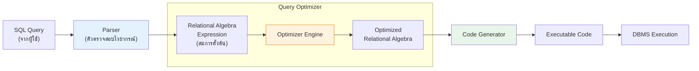

---
tags:
  - database
  - relational-algebra
  - query-language
  - lecture-3
created: 2026-07-07
updated: 2026-07-07
lecture: 3
type: lecture
---

# Lecture 3: Relational Algebra (พีชคณิตเชิงสัมพันธ์)

> [!SUMMARY] ภาพรวมบทเรียน
> บทเรียนนี้ว่าด้วยรากฐานคณิตศาสตร์ของการสืบค้นข้อมูล (Relational Algebra) อธิบายกลไกเชิงลึกและแยกย่อยทีละหน้าสไลด์ (Slide 1-40) แบบไม่มีการรวบรัด เพื่อเจาะลึกกระบวนการทำงานของตัวดำเนินการแต่ละตัว พร้อมตาราง Trace ตามสไลด์จริงทุกประการ

---

## 🗣️ Slide 1: Relational Algebra
**พีชคณิตเชิงสัมพันธ์**

บทเรียนนี้เริ่มต้นด้วยการแนะนำให้รู้จักกับแก่นแท้ของระบบฐานข้อมูลเชิงสัมพันธ์ นั่นคือทฤษฎีทางคณิตศาสตร์ที่เรียกว่า "พีชคณิตเชิงสัมพันธ์ (Relational Algebra)" ซึ่งเป็นกระบวนการในการดึงและจัดการข้อมูลที่ถูกเก็บอยู่ในรูปแบบตาราง

---

## 🔤 Slide 2: Relational Query Languages
**ภาษาสำหรับการสืบค้นข้อมูลเชิงสัมพันธ์**

เมื่อเราต้องการสืบค้นข้อมูล (Query) บน Relational database จะมีตัวเลือกภาษาอยู่ 2 แบบหลัก:

1. **Structured Query Language (SQL):** เป็นภาษาหลักที่โปรแกรมเมอร์ใช้เขียน
   - เป็นภาษาแบบบอกผลลัพธ์ที่ต้องการ (Declarative) ผู้ใช้ไม่ต้องระบุว่าให้ทำงานอย่างไร แค่บอกว่าอยากได้ข้อมูลอะไร
2. **Relational Algebra (RA):**
   - เป็นภาษาระดับกลาง (Intermediate language) ที่ระบบจัดการฐานข้อมูล (DBMS) ใช้คุยกันเองภายใน
   - เป็นภาษาเชิงกระบวนการ (Procedural) ซึ่งระบุขั้นตอนชัดเจนว่าต้องทำอะไรก่อนหลัง

---

## 🧮 Slide 3: Algebra
**หลักการของพีชคณิต**

ในทางคณิตศาสตร์ พีชคณิตประกอบไปด้วย "ตัวดำเนินการ (Operators)" และ "ขอบเขตของข้อมูล (Domain)"
- ตัวดำเนินการจะรับตัวแปรต้นจาก Domain หนึ่ง และแปลงออกมาเป็นอีก Domain หนึ่ง
- สำหรับฐานข้อมูล สมการของตัวดำเนินการต่างๆ จะถูกเรียกว่า "Query (การสืบค้น)" และผลลัพธ์ที่กระเด็นออกมาเราจะเรียกว่า "Result of that query" (ซึ่งผลลัพธ์นั้นก็ต้องเป็นตารางเสมอ)

---

## 🛠️ Slide 4: Relational Algebra
**ความหมายของพีชคณิตเชิงสัมพันธ์**

เจาะลึกองค์ประกอบของ RA:
- **Domain:** ขอบเขตของตัวแปรในระบบนี้คือ "เซตของตาราง (Set of relations)"
- **Traditional set operators:** ตัวดำเนินการเซตแบบดั้งเดิม ได้แก่ UNION, INTERSECTION, DIFFERENCE และ CARTESIAN PRODUCT
- **Special relational operators:** ตัวดำเนินการเฉพาะของฐานข้อมูล ได้แก่ RESTRICT (SELECT), PROJECT, JOIN, DIVIDE และ RENAME
- **Procedural:** นิพจน์สมการต่างๆ ระบุการสืบค้นโดยการ "อธิบายอัลกอริทึม (Describing an algorithm)" ลำดับก่อนหลังในการทำงานมีผลต่อความเร็วอย่างยิ่ง

---

## ⚙️ Slide 5: Relational Algebra in a DBMS
**แผนผังกระบวนการประมวลผลภายใน DBMS**

แผนภาพนี้แสดงลำดับขั้นเมื่อ DBMS ได้รับคำสั่ง SQL จากผู้ใช้:

> [!INFO] ขั้นตอนการประมวลผล
> 1. SQL จะถูกส่งให้ `Parser` แปลงเป็นสมการ `Relational algebra expression` แบบยาวๆ ดิบๆ
> 2. `Query optimizer` (หัวใจสำคัญ) จะรับสมการดิบมาวิเคราะห์ แล้วจัดรูปสมการใหม่ให้เป็น `Optimized expression` ที่ประมวลผลเร็วที่สุด (เช่น กรองข้อมูลก่อนค่อยนำไป Join)
> 3. จากนั้นส่งให้ `Code generator` สร้างเป็นชุดคำสั่ง `Executable code` ไปรันในฮาร์ดแวร์จริงๆ

---

## 🧩 Slide 6: Set Operators
**ตัวดำเนินการทางเซต**

เนื่องจาก "ตาราง (Relation)" คือ "เซตของแถว (Set of tuples)" ดังนั้นหลักการทางทฤษฎีเซตจึงถูกนำมาใช้:
- ผลลัพธ์จากการนำ 2 ตารางมาประมวลผลด้วย Set Operator จะต้องคลอดตารางใหม่ออกมา ซึ่งทุกๆ แถวจะต้องมีโครงสร้าง (Structure) ที่เหมือนกัน
- ด้วยเหตุนี้ ขอบเขตของการทำ Set operations (เช่น UNION) จะจำกัดอยู่เฉพาะตารางที่เข้ากันได้ หรือเรียกว่า **"Union compatible relations"**

---

## 🤝 Slide 7: Union Compatible Relations
**ความเข้ากันได้แบบยูเนียน**

> [!DEFINITION] กฎเหล็ก 3 ข้อของการเข้ากันได้
> ตาราง 2 ตารางจะถือว่าเป็น Union compatible ได้ก็ต่อเมื่อผ่านเงื่อนไขดังนี้:
> 1. ทั้งคู่ต้องมี "จำนวนคอลัมน์เท่ากัน" (Same number of columns)
> 2. คอลัมน์ที่ตำแหน่งเดียวกัน ต้องมี "ชื่อเหมือนกัน" (Names of attributes are the same)
> 3. คอลัมน์ที่ตำแหน่งเดียวกัน ต้องมี "โดเมน (ชนิดข้อมูล) เดียวกัน" (Same domain)
>
> หากผ่านกฎ 3 ข้อนี้ ตารางทั้งสองจึงจะสามารถทำ UNION, INTERSECTION และ SET DIFFERENCE ได้

---

## 🟢 Slide 8: Union Operator
**ตัวดำเนินการยูเนียน**

การนำแถวข้อมูลทั้งหมดของ 2 ตารางมากองรวมกัน โดยผลลัพธ์จะต้อง "ไม่มีแถวข้อมูลที่ซ้ำกัน 100%" (หากซ้ำกันจะถูกยุบให้เหลือแค่ 1 บรรทัดตามหลักทฤษฎีเซต)

> [!EXAMPLE] Trace Table: Union
> 
> **Table A**
> 
> | S# | SNAME | STATUS | CITY |
> |---|---|---|---|
> | S1 | Smith | 20 | London |
> | S4 | Clark | 20 | London |
> 
> **Table B**
> 
> | S# | SNAME | STATUS | CITY |
> |---|---|---|---|
> | S1 | Smith | 20 | London |
> | S2 | Jones | 10 | Paris |
> 
> **Ex. Union (A UNION B)**
> 
> | S# | SNAME | STATUS | CITY |
> |---|---|---|---|
> | **S1** | **Smith** | **20** | **London** |
> | S4 | Clark | 20 | London |
> | S2 | Jones | 10 | Paris |
> *(ข้อสังเกต: `S1 Smith` ซ้ำกันทั้งใน A และ B ถูกยุบเหลือเพียงบรรทัดเดียว)*

---

## 🔵 Slide 9: Intersection Operator
**ตัวดำเนินการอินเตอร์เซกชัน**

การสร้างตารางใหม่โดยดึงเอาเฉพาะ **"แถวข้อมูลที่มีอยู่ทั้งในตาราง A และตาราง B พร้อมๆ กัน"** แถวที่ปรากฏเพียงฝั่งเดียวจะถูกตัดทิ้ง

> [!EXAMPLE] Trace Table: Intersection
> 
> **Ex. Intersection (A INTERSECTION B)**
> 
> | S# | SNAME | STATUS | CITY |
> |---|---|---|---|
> | **S1** | **Smith** | **20** | **London** |
> *(ข้อสังเกต: ดึงมาเฉพาะ `S1` เพราะเป็นรายชื่อเดียวที่โผล่ทั้งใน A และ B)*

---

## 🔴 Slide 10: Difference Operator
**ตัวดำเนินการผลต่าง**

การนำตารางตัวหน้ามาตั้ง และลบทิ้งด้วยสมาชิกที่ดันไปโผล่ในตารางตัวหลัง

> [!EXAMPLE] Trace Table: Difference
> 
> **Ex. Difference (A MINUS B)** (มีใน A แต่ห้ามมีใน B)
> 
> | S# | SNAME | STATUS | CITY |
> |---|---|---|---|
> | **S4** | **Clark** | **20** | **London** |
> 
> **Ex. Difference (B MINUS A)** (มีใน B แต่ห้ามมีใน A)
> 
> | S# | SNAME | STATUS | CITY |
> |---|---|---|---|
> | **S2** | **Jones** | **10** | **Paris** |

---

## ✖️ Slide 11: Cartesian Product
**ผลคูณคาร์ทีเซียน ($R \times S$)**

เป็นการนำทุกแถวของตาราง R มาจับคู่กับทุกแถวของตาราง S 
- ไม่จำเป็นต้องเป็น Union compatible (ตารางหน้าตาไม่เหมือนกันเลยก็คูณได้)
- **ปัญหา:** เป็นคำสั่งที่ราคาแพงมากๆ (Expensive to compute) เพราะจำนวนแถวจะกลายเป็น $R \times S$ (Quadratic)

> [!EXAMPLE] Trace Table: Cartesian Product
> 
> **ตาราง R**
> 
> | a | b |
> |---|---|
> | x1 | x2 |
> | x3 | x4 |
> 
> **ตาราง S**
> 
> | c | d |
> |---|---|
> | y1 | y2 |
> | y3 | y4 |
> 
> **Result: $R \times S$** (กระจายจับคู่)
> 
> | a | b | c | d |
> |---|---|---|---|
> | x1 | x2 | y1 | y2 |
> | x1 | x2 | y3 | y4 |
> | x3 | x4 | y1 | y2 |
> | x3 | x4 | y3 | y4 |

---

## 🔍 Slide 12: Select Operator
**ตัวดำเนินการคัดเลือกแถว ($\sigma$)**

คัดลอก "แถว (Rows)" ของตารางที่ตรงตามเงื่อนไข (Condition) สร้างเป็นซับเซต (Subset) ของตารางต้นฉบับ
รูปแบบ: $\sigma_{\text{condition}}(\text{relation})$

> [!EXAMPLE] Trace Table: Select
> 
> **ตารางต้นทาง: Person**
> 
> | Id | Name | Address | Hobby |
> |---|---|---|---|
> | 1123 | John | 123 Main | stamps |
> | 1123 | John | 123 Main | coins |
> | 5556 | Mary | 7 Lake Dr | hiking |
> | 9876 | Bart | 5 Pine St | stamps |
> 
> **คำสั่ง:** $\sigma_{\text{Hobby='stamps'}}(\text{Person})$
> 
> | Id | Name | Address | Hobby |
> |---|---|---|---|
> | 1123 | John | 123 Main | stamps |
> | 9876 | Bart | 5 Pine St | stamps |

---

## 📝 Slide 13: Selection Condition
**เงื่อนไขในการคัดเลือกแถว**

- **Operators (เครื่องหมาย):** `<`, `<=`, `>=`, `>`, `=`, `!=`
- **Simple condition (เงื่อนไขเชิงเดี่ยว):**
  - เทียบกับค่าคงที่: `attribute operator constant` (เช่น `Id = 1`)
  - เทียบระหว่างคอลัมน์: `attribute operator attribute` (เช่น `Salary > Bonus`)
- **Compound condition (การเชื่อมประพจน์):** สามารถใช้ `AND`, `OR`, `NOT` ได้

---

## 🎯 Slide 14: Selection Condition - Examples
**ตัวอย่างเงื่อนไขในการคัดเลือกแถว**

- $\sigma_{\text{Id>3000 OR Hobby='hiking'}}(\text{Person})$ (รหัสเกิน 3000 หรือชอบปีนเขา)
- $\sigma_{\text{Id>3000 AND Id<3999}}(\text{Person})$ (รหัสอยู่ระหว่าง 3001 ถึง 3998)
- $\sigma_{\text{NOT(Hobby='hiking')}}(\text{Person})$ (คนที่ไม่ชอบปีนเขา)
- $\sigma_{\text{Hobby} \neq \text{'hiking'}}(\text{Person})$ (เขียนได้สองแบบ ความหมายเหมือนบรรทัดบน)

---

## ✂️ Slide 15: Project Operator
**ตัวดำเนินการคัดเลือกคอลัมน์ ($\pi$)**

สร้างซับเซตแนวดิ่ง โดยเก็บเฉพาะ "คอลัมน์ (Columns)" ที่กำหนดไว้ในพารามิเตอร์ และทิ้งคอลัมน์อื่นทั้งหมด
รูปแบบ: $\pi_{\text{attribute-list}}(\text{relation})$

> [!EXAMPLE] Trace Table: Project
> **คำสั่ง:** $\pi_{\text{Name, Hobby}}(\text{Person})$
> 
> | Name | Hobby |
> |---|---|
> | John | stamps |
> | John | coins |
> | Mary | hiking |
> | Bart | stamps |

---

## 📏 Slide 16: Project Operator (Result is a table)
**กฎการยุบตัวซ้ำของโปรเจคต์**

ผลลัพธ์ของสมการต้องเป็นตารางเชิงสัมพันธ์ (Relation) ดังนั้น หากตัดคอลัมน์ทิ้งแล้วบรรทัดข้อมูลดันหน้าตาเหมือนกัน 100% ระบบจะยุบทิ้งไม่ให้มีค่าซ้ำซ้อน (no duplicates)

> [!EXAMPLE] Trace Table: Project (No Duplicates)
> **คำสั่ง:** $\pi_{\text{Name, Address}}(\text{Person})$
> 
> | Name | Address |
> |---|---|
> | **John** | **123 Main** |
> | Mary | 7 Lake Dr |
> | Bart | 5 Pine St |
> *(ข้อสังเกต: John 123 Main ถูกยุบจาก 2 แถวให้เหลือเพียงแถวเดียว!)*

---

## 🔄 Slide 17: Expressions
**การเขียนสมการซ้อนกัน**

เราสามารถเอาคำสั่ง Select และ Project มาซ้อนกันได้ (Nested Operations)

> [!EXAMPLE] Trace: Expression
> **สมการ:** $\pi_{\text{Id, Name}} ( \sigma_{\text{Hobby='stamps' OR Hobby='coins'}} (\text{Person}) )$
> 
> ผลลัพธ์:
> 
> | Id | Name |
> |---|---|
> | 1123 | John |
> | 9876 | Bart |
> *(การทำงาน: ระบบจะเลือกแถวที่ชอบแสตมป์หรือเหรียญออกมาก่อน จากนั้นตัดเหลือแค่คอลัมน์ Id กับ Name แล้วพอยุบตัวซ้ำ John จึงเหลือบรรทัดเดียว)*

---

## 🏷️ Slide 18: Renaming
**การเปลี่ยนชื่อ**

**ปัญหา:** Cartesian product อาจทำให้คอลัมน์ชื่อชนกัน (เช่น $a = c$) ซึ่งผิดกฎของตารางที่ห้ามมีคอลัมน์ชื่อซ้ำกัน
**ทางแก้:** ตัวดำเนินการเปลี่ยนชื่อ (Renaming operator) จะช่วยจัดระเบียบให้ โดยสามารถกำหนดชื่อคอลัมน์ใหม่ทั้งหมดตามลำดับได้ด้วยสัญลักษณ์ `expression [A1, A2, ... An]`

---

## 📛 Slide 19: Example
**ตัวอย่างการใช้ตัวดำเนินการเปลี่ยนชื่อ**

> [!EXAMPLE] Trace: Rename Example
> 
> **ตารางต้นทาง:**
> - `Transcript(StudId, CrsCode, Semester, Grade)`
> - `Teaching(ProfId, CrsCode, Semester)`
> 
> **สมการ:**
> $\pi_{\text{StudId, CrsCode}} (\text{Transcript})\mathbf{[StudId, SCrsCode]}$ 
> $\times$ 
> $\pi_{\text{ProfId, CrsCode}} (\text{Teaching})\mathbf{[ProfId, PCrscode]}$
> 
> **ผลลัพธ์:** ได้ตารางกว้าง 4 คอลัมน์ที่ชื่อไม่ชนกันเลยคือ `StudId`, `SCrsCode`, `ProfId`, `PCrsCode`

---

## 🔗 Slide 20: Derived Operation: Join
**ตัวดำเนินการเชื่อมตาราง (Theta Join)**

Join ไม่ใช่คำสั่งพื้นฐาน (Derived operation) แต่มันคือการยุบรวม Cartesian Product เข้ากับการ Select
สมการ: $R \bowtie_{\text{join-condition}} S$ 
มีค่าเท่ากับ: $\sigma_{\text{join-condition}} (R \times S)$
โดยเงื่อนไขในการเชื่อม (theta) สามารถใช้ `<, >, =, \neq` ได้ตามต้องการ

---

## 🚧 Slide 21: Join and Renaming
**การเชื่อมตารางและการเปลี่ยนชื่อ**

- **ปัญหา:** $R$ และ $S$ อาจมีชื่อคอลัมน์ซ้ำกัน ถ้าใช้ Cartesian product ปกติระบบจะ Error (not defined)
- **การแก้ปัญหา:** 
  1. ให้ Rename เปลี่ยนชื่อคอลัมน์ก่อนทำการ Join
  2. หากใช้ชื่อเดิม ระบบในผลลัพธ์จะต้องควบชื่อตารางไว้ข้างหน้า (เช่น `R.Name`, `S.Name`) เพื่อบ่งบอกว่ามาจากตารางไหน

---

## 🧮 Slide 22: Theta Join – Example
**ตัวอย่าง Theta Join**

> [!EXAMPLE] Trace: ค้นหาพนักงานที่รวยกว่าผู้จัดการ
> 
> **โจทย์:** จงพ่นชื่อของพนักงานที่ได้เงินเดือนมากกว่าหัวหน้าของตน
> **สมการ:** $\pi_{\text{Employee.Name}} (\text{Employee} \bowtie_{\text{MngrId=Id AND Salary>Salary}} \text{Manager})$
> 
> ตารางผลลัพธ์จากการจอยน์ก่อนทำโปรเจคต์จะประกอบด้วยคอลัมน์:
> `Employee.Name`, `Employee.Id`, `Employee.Salary`, `MngrId`, `Manager.Name`, `Manager.Id`, `Manager.Salary`

---

## 🤝 Slide 23: Equijoin Join - Example
**การเชื่อมด้วยเครื่องหมายเท่ากับ**

เป็น Join ที่พบได้บ่อยที่สุดในโลกการทำงาน โดยเงื่อนไขการจอยน์จะบังคับว่าต้องเป็นสมการเท่ากับ (`=`) เท่านั้น

> [!EXAMPLE] Trace Table: Equijoin
> **สมการ:** $\pi_{\text{Name, CrsCode}} (\text{Student} \bowtie_{\text{Id=StudId}} (\sigma_{\text{Grade='A'}}(\text{Transcript})))$
> 
> **Student**
> 
> | Id | Name | Addr | Status |
> |---|---|---|---|
> | 111 | John | ..... | ..... |
> | 222 | Mary | ..... | ..... |
> | 333 | Bill | ..... | ..... |
> | 444 | Joe | ..... | ..... |
> 
> **Transcript**
> 
> | StudId | CrsCode | Sem | Grade |
> |---|---|---|---|
> | 111 | CSE305 | S00 | B |
> | 222 | CSE306 | S99 | **A** |
> | 333 | CSE304 | F99 | **A** |
> 
> **Result:**
> 
> | Name | CrsCode |
> |---|---|
> | Mary | CSE306 |
> | Bill | CSE304 |
> *(วิเคราะห์: กรอง Transcript เอาแค่คนได้ A ซึ่งก็คือ 222 กับ 333 แล้วจึงเอามา Equijoin ด้วย StudId=Id เข้ากับชื่อ)*

---

## 🌿 Slide 24: Natural Join
**การเชื่อมตารางแบบธรรมชาติ**

นี่คือกรณีพิเศษขั้นสุดของ Equijoin:
- ระบบจะบังคับ Join เงื่อนไขของ **"ทุกคอลัมน์ที่มีชื่อตรงกัน"** ในทั้งสองตารางให้อัตโนมัติ (ไม่ต้องเขียนเงื่อนไขเอง)
- ระบบจะทำการ **"ยุบคอลัมน์ที่ซ้ำซ้อนกันทิ้ง (Duplicate columns eliminated)"** ออกจากผลลัพธ์ให้เนียนตา

> [!EXAMPLE] กลไกเทียบเท่า
> $\text{Transcript} \bowtie \text{Teaching}$ มีค่าเทียบเท่ากับการเขียนแบบยาวยืดว่า:
> $\pi_{\text{StudId, Transcript.CrsCode, Transcript.Sem, Grade, ProfId}} ( \text{Transcript} \bowtie_{\text{CrsCode=CrsCode AND Sem=Sem}} \text{Teaching} )$

---

## ⚙️ Slide 25: Natural Join (con't)
**สมการทั่วไปของ Natural Join**

$R \bowtie S = \pi_{\text{attr-list}} (\sigma_{\text{join-cond}} (R \times S))$
โดยคอลัมน์เป้าหมาย $\text{attr-list}$ คือการนำคอลัมน์จาก $R \cup S$ (เพื่อยุบคอลัมน์ซ้ำให้เหลือเสาเดียว) และ $\text{join-cond}$ จะเทียบเท่ากับกับทุกๆ คอลัมน์ที่ชื่อตรงกันระหว่าง $R \cap S$

---

## 🌟 Slide 26: Natural Join Example
**ตัวอย่างสุดล้ำของการใช้ Natural Join**

> [!EXAMPLE] Trace: หานักศึกษาที่เรียน "อย่างน้อย 2 วิชาต่างกัน"
> 
> **สมการ:** $\pi_{\text{StudId}} ( \sigma_{\text{CrsCode} \neq \text{CrsCode2}} (\text{Transcript} \bowtie \text{Transcript [StudId, CrsCode2, Sem2, Grade2]}) )$
> 
> **กลไกการทำงาน:** 
> 1. สำเนา `Transcript` ออกมา เปลี่ยนชื่อคอลัมน์ 3 ตัวหลังเป็น `CrsCode2, Sem2, Grade2`
> 2. เนื่องจากเหลือเพียง `StudId` ที่ชื่อตรงกัน Natural Join จึงเชื่อมเฉพาะคนที่ `StudId` เท่ากันเท่านั้น
> 3. จากนั้นนำมา Select กรองว่าวิชาที่ 1 กับวิชาที่ 2 ของคนคนนี้จะต้องไม่ใช่วิชาเดียวกัน ($\text{CrsCode} \neq \text{CrsCode2}$) 

---

## 🫂 Slide 27: Outer Join
**การเชื่อมตารางแบบรักษาข้อมูลแถวที่ไม่มีคู่**

- เป็นส่วนต่อขยายของการ Join ปกติ เพื่อป้องกันข้อมูลสูญหาย (Avoids loss of information)
- ทำการ Join ก่อน จากนั้นค่อยไปลาก "แถวที่หาคู่ไม่ได้ในอีกตาราง" (Does not match) ยัดเข้ามาเพิ่มในผลลัพธ์
- ช่องว่างฝั่งที่หาคู่ไม่ได้ จะถูกปะหน้าด้วยค่า **Null** (Null signifies unknown or not exist)
- *(หมายเหตุ: การเอาค่า null ไปเปรียบเทียบกับอะไรก็ตามจะได้ค่า false เสมอ)*

---

## 🏢 Slide 28: Outer Join Example (Instructor/Teaches)
**ตารางตัวอย่างเบื้องต้นสำหรับ Outer Join**

> [!EXAMPLE] ตารางตั้งต้นก่อนทำ Outer Join
> 
> **Relation: instructor**
> 
> | ID | name | dept_name |
> |---|---|---|
> | 10101 | Srinivasan | Comp. Sci. |
> | 12121 | Wu | Finance |
> | 15151 | Mozart | Music |
> 
> **Relation: teaches**
> 
> | ID | course_id |
> |---|---|
> | 10101 | CS-101 |
> | 12121 | FIN-201 |
> | 76766 | BIO-101 |

---

## ⬅️ Slide 29: Outer Join Example (Left Outer Join)
**จอยน์ปกติ vs จอยน์ออกซ้าย**

> [!EXAMPLE] Trace Table: Join vs Left Outer Join
> 
> **1. Join ธรรมดา (instructor $\bowtie$ teaches)**
> *(คนไร้คู่จะโดนตัดทิ้ง คือ Mozart และ 76766 โดนเด้ง)*
> 
> | ID | name | dept_name | course_id |
> |---|---|---|---|
> | 10101 | Srinivasan | Comp. Sci. | CS-101 |
> | 12121 | Wu | Finance | FIN-201 |
> 
> **2. Left Outer Join (instructor $\lhd\bowtie$ teaches)**
> *(ตารางซ้ายห้ามหาย Mozart หาคู่ไม่ได้แต่ต้องรอด!)*
> 
> | ID | name | dept_name | course_id |
> |---|---|---|---|
> | 10101 | Srinivasan | Comp. Sci. | CS-101 |
> | 12121 | Wu | Finance | FIN-201 |
> | **15151** | **Mozart** | **Music** | **null** |

---

## ➡️ Slide 30: Outer Join Example (Right/Full)
**จอยน์ออกขวา และ จอยน์ออกเต็มสูบ**

> [!EXAMPLE] Trace Table: Right and Full Outer Join
> 
> **3. Right Outer Join (instructor $\bowtie\rhd$ teaches)**
> *(ตารางขวาห้ามหาย ID 76766 สอนวิชาชีวะหาชื่ออาจารย์ไม่เจอ แต่ต้องรอด!)*
> 
> | ID | name | dept_name | course_id |
> |---|---|---|---|
> | 10101 | Srinivasan | Comp. Sci. | CS-101 |
> | 12121 | Wu | Finance | FIN-201 |
> | **76766** | **null** | **null** | **BIO-101** |
> 
> **4. Full Outer Join (instructor $\lhd\bowtie\rhd$ teaches)**
> *(ห้ามใครหายทั้งสิ้น ดึงมาให้หมด!)*
> 
> | ID | name | dept_name | course_id |
> |---|---|---|---|
> | 10101 | Srinivasan | Comp. Sci. | CS-101 |
> | 12121 | Wu | Finance | FIN-201 |
> | **15151** | **Mozart** | **Music** | **null** |
> | **76766** | **null** | **null** | **BIO-101** |

---

## ➗ Slide 31: Division
**ตัวดำเนินการหาร ($R \div S$)**

เป้าหมายสูงสุดคือ: ผลิตผลลัพธ์เฉพาะตัวแปรต้นในตาราง $r$ ที่สามารถไปจับคู่แมทช์กับตัวแปรในตาราง $s$ ได้แบบ **"ครบทุกตัวแบบไม่มีข้อยกเว้น (Match all tuples in another relation)"**

สามารถเขียนในรูปสมการอื่นที่ใช้ตัวดำเนินการพื้นฐาน (Project, Set difference, Cartesian product) ได้ แต่มันจะซับซ้อนมาก

---

## 📊 Slide 32: Division (con't)
**แผนภาพความสัมพันธ์ของการหาร**

ภาพในสไลด์แสดงกลไกการจับคู่:
- ในตาราง $S$ มีสมาชิกฝั่ง $B$ คือ `a`, `b`, `c`
- ในตาราง $R$ ดูสมาชิกฝั่ง $A$ 
  - เบอร์ `1` โยงไปหาแค่ `a`, `b` (ไม่ครบ ขาด `c`) -> ปัดตก
  - เบอร์ `2` โยงไปหา `a`, `b`, `c` (ครบถ้วน!) -> หยิบไปเป็นคำตอบใน $R \div S$
  - เบอร์ `3` โยงไปหา `b`, `c` (ไม่ครบ ขาด `a`) -> ปัดตก
  - เบอร์ `4` โยงไปหาแค่ `b`, `c` (ไม่ครบ ขาด `a`) -> ปัดตก

ดังนั้นในผลลัพธ์ $R \div S$ จึงมีแค่ตั๋วเบอร์ `2` ลอยขึ้นมาคนเดียว

---

## 📚 Slide 33: Division - Example
**ตัวอย่างการคำนวณการหาร**

โจทย์: จงหารหัสนักศึกษา (Ids) ที่สอบผ่าน "ครบทุกวิชา" ที่เปิดสอนในเทอม Spring 2017
- **ตัวตั้ง (Numerator):** ข้อมูล StudId, CrsCode ที่สอบผ่าน (เกรดต้องไม่ใช่ F)
  $\pi_{\text{StudId, CrsCode}} ( \sigma_{\text{Grade} \neq \text{'F'}} (\text{Transcript}) )$
- **ตัวหาร (Denominator):** รหัสวิชา (CrsCode) ทั้งหมดที่เปิดใน S2017
  $\pi_{\text{CrsCode}} ( \sigma_{\text{Semester='S2017'}} (\text{Teaching}) )$
- **ผลลัพธ์ (Result):** นำมาหารกัน $\text{Numerator} \div \text{Denominator}$ ก็จะได้ StudId ออกมา

---

## 🏫 Slide 34: Division Query Type
**ประเภทโจทย์ธุรกิจที่ต้องใช้ Division**

- **ประเภทคำถาม (Query Type):** หาซับเซตของฝั่งตั้งต้นที่มีความเชื่อมโยงกับ "สมาชิกทุกตัว (All items)" ในเซตเป้าหมาย
- **ตัวอย่าง (Example):** ค้นหาชื่อของอาจารย์ (Professors) ที่เคยลงไปสอนคอร์สให้กับ "ทุกแผนกวิชาที่มีในมหาวิทยาลัย (ALL departments)"
- **แผนภาพ:** ตาราง `(ProfId, DeptId)` $\div$ ตาราง `(DeptId)` จะดึงให้ตั๋ว `ProfId` ที่มี `DeptId` ครบลิสต์ให้โผล่ออกมา

---

## 💾 Slide 35: Assignment Operation
**ตัวดำเนินการกำหนดค่าลงตัวแปร ($\leftarrow$)**

เวลาเขียนสมการ RA ที่ซับซ้อนมากๆ การยัดวงเล็บซ้อน 10 ชั้นจะทำให้อ่านยาก เราจึงใช้คำสั่ง Assignment ได้:
- เขียนคิวรีเหมือนเป็นลำดับโปรแกรมทีละขั้น (Sequential program)
- ใช้สัญลักษณ์ $\leftarrow$ เพื่อรับค่าลงตัวแปร
- ตัวแปรที่รับค่าจะต้องเป็น "ตารางชั่วคราว (Temporary relation variable)" เสมอ

---

## ➕ Slide 36: Aggregate Function
**ฟังก์ชันสรุปผลรวมและฟังก์ชันทางสถิติ**

ฟังก์ชันพวกนี้จะรับกลุ่มของข้อมูลเข้ามา (Collection of values) แล้วปั่นรวมกันให้คืนค่ากลับมาเป็น **"ค่าเดียวโดดๆ (Single value)"** เสมอ ได้แก่:
- `avg` (ค่าเฉลี่ย)
- `min` (ค่าน้อยสุด)
- `max` (ค่ามากสุด)
- `sum` (ผลรวมค่าทั้งหมด)
- `count` (นับจำนวนแผ่นข้อมูล)

---

## 🏷️ Slide 37: Aggregate Function (Operation in RA)
**สัญลักษณ์ฟังก์ชันสรุปผลทางพีชคณิต**

รูปแบบสมการ: $\text{G}_{1}, \text{G}_{2}, ..., \text{G}_{n} \ \mathcal{G} \ \text{F}_{1}(\text{A}_{1}), ..., \text{F}_{n}(\text{A}_{n}) (E)$
- $E$ คือ ตารางเป้าหมาย
- $\text{G}_1...\text{G}_n$ คือ คอลัมน์ที่เราต้องการเอามาทำ Group By (จัดกลุ่มตามตัวแปรนี้) อาจจะว่างเปล่าก็ได้ถ้าไม่ต้องการจัดกลุ่ม
- $\text{F}_i$ คือ ชื่อ Aggregate function
- $\text{A}_i$ คือ คอลัมน์ที่ต้องการเอามาปั่นรวม
*(หมายเหตุ: หนังสือบางเล่มใช้ตัว $\mathcal{F}$ หรือ $\gamma$ Gamma แทนสัญลักษณ์ $\mathcal{G}$)*

---

## 🧮 Slide 38: Aggregate Function Example (Relation r)
**ตัวอย่างการคำนวณเบื้องต้น**

> [!EXAMPLE] Trace Table: การ Aggregate ดิบๆ
> 
> **Relation $r$**
> 
> | A | B | C |
> |---|---|---|
> | $\alpha$ | $\alpha$ | 7 |
> | $\alpha$ | $\beta$ | 7 |
> | $\beta$ | $\beta$ | 3 |
> | $\beta$ | $\beta$ | 10 |
> 
> **สมการ:** $\mathcal{G}_{\text{sum(c)}} (r)$
> *(การวิเคราะห์: สั่งให้เอาข้อมูลทั้งหมดในตารางมารวมค่าคอลัมน์ c โดยไม่มีการ Group By)*
> 
> **ผลลัพธ์ (sum(c)):**
> 
> | sum(c) |
> |---|
> | **27** |

---

## 🏢 Slide 39: Aggregate Function Example (Instructor)
**ตัวอย่าง Aggregate Function ระดับองค์กร**

> [!EXAMPLE] Trace Table: การหาเงินเดือนเฉลี่ยแยกแผนก
> **คำสั่ง:** Find the average salary in each department
> **สมการ:** $\text{dept\_name} \ \mathcal{G}_{\text{avg(salary)}} (\text{instructor})$
>
> **Relation instructor (ตารางพนักงานทั้งหมด)**
> 
> | ID | name | dept_name | salary |
> |---|---|---|---|
> | 76766 | Crick | **Biology** | 72000 |
> | 45565 | Katz | **Comp. Sci.** | 75000 |
> | 10101 | Srinivasan | **Comp. Sci.** | 65000 |
> | 83821 | Brandt | **Comp. Sci.** | 92000 |
> | 98345 | Kim | Elec. Eng. | 80000 |
> | 12121 | Wu | Finance | 90000 |
> | 76543 | Singh | Finance | 80000 |
> | 32343 | El Said | History | 60000 |
> | 58583 | Califieri | History | 62000 |
> | 15151 | Mozart | Music | 40000 |
> | 33456 | Gold | Physics | 87000 |
> | 22222 | Einstein | Physics | 95000 |
>
> **ผลลัพธ์ที่ได้จากการจัดกลุ่มตาม dept_name และเฉลี่ยเงินเดือน:**
> 
> | dept_name | avg(salary) |
> |---|---|
> | Biology | 72000 |
> | Comp. Sci. | **77333** |
> | Elec. Eng. | 80000 |
> | Finance | 85000 |
> | History | 61000 |
> | Music | 40000 |
> | Physics | 91000 |
> *(การวิเคราะห์: กลุ่ม Comp. Sci. ถูกรวมตัวกัน ดึงค่า 75000+65000+92000 หารสาม ได้เป็นค่า 77333)*

---

## 📝 Slide 40: Aggregate Function Example (Renaming)
**การเปลี่ยนชื่อหัวตารางผลลัพธ์**

ผลลัพธ์จากการ Aggregate ปกติจะไม่มีชื่อที่อ่านง่าย (อย่างด้านบนจะได้ชื่อหัวตารางว่า `avg(salary)`) 
เราสามารถใช้คำสั่ง Rename ภายในตอนประกาศได้เลยด้วยคำสั่ง `as`

> [!EXAMPLE] ตัวอย่างการตั้งชื่อคอลัมน์ใหม่
> **สมการ:** $\text{dept\_name} \ \mathcal{G}_{\text{avg(salary) as avg\_salary}} (\text{instructor})$
> 
> ท่านี้จะเปลี่ยนให้หัวตารางของผลลัพธ์ข้างต้น จากที่ชื่อดิบๆ ว่า `avg(salary)` กลายมาเป็น `avg_salary` ที่สวยงามทันที!

---

# References
- **Course:** Database System
- **Chapter:** Lecture 3 - Relational Algebra
- **Slides:** 40 slides (Complete Ungrouped Detailed Revision)
- **Related Notes:** [[Lecture 2 - Database Architecture and Relational Model]], [[Lecture 7 - SQL Fundamentals]]

---
*Last updated: 2026-07-07*
