---
tags:
  - database
  - lecture
  - er-model
  - conceptual-design
  - chen-notation
  - structural-constraints
created: 2026-07-07
updated: 2026-09-14
type: lecture-note
lecture_number: 4
slides_count: 30
---

# Lecture 4: การจำลองข้อมูลด้วยโมเดลความสัมพันธ์เอนทิตี (Data Modeling Using the Entity-Relationship Model)

> [!DEFINITION] **นิยามของ Entity-Relationship (ER) Model**
> **ER Model** คือ เครื่องมือจำลองข้อมูลระดับแนวคิด (Conceptual Data Model) ที่นำเสนอโลกแห่งความเป็นจริงในรูปของ **เอนทิตี (Entities)**, **คุณลักษณะ (Attributes)**, และ **ความสัมพันธ์ (Relationships)** ช่วยให้นักออกแบบระบบ สถาปนิกฐานข้อมูล และผู้ใช้งานระดับธุรกิจสามารถสื่อสารโครงสร้างข้อมูลและความหมายทางธุรกิจ (Semantics) ได้ตรงกันอย่างสมบูรณ์แบบ ก่อนที่จะแปลงไปเป็นโครงสร้างตารางจริงในระบบฐานข้อมูลเชิงสัมพันธ์ (Relational Database)

---

## สารบัญเนื้อหาประจำบทเรียน (Table of Contents)
- [Slide 1: หน้าปกบทเรียน Data Modeling Using the ER Model](#slide-1-data-modeling-using-the-entity-relationship-model)
- [Slide 2: ภาพรวมแนวคิดและหัวข้อหลักของแบบจำลอง ER](#slide-2-er-model-concepts-overview)
- [Slide 3: ตารางสรุปสัญลักษณ์มาตรฐาน Chen Notation](#slide-3-summary-of-er-diagram-notation-ตารางสรุปสัญลักษณ์มาตรฐาน-chen-notation)
- [Slide 4: ข้อกำหนดระบบบริษัท COMPANY Database (ส่วนที่ 1)](#slide-4-example-company-database-ความต้องการระบบบริษัท---ส่วนที่-1)
- [Slide 5: ข้อกำหนดระบบบริษัท COMPANY Database (ส่วนที่ 2)](#slide-5-example-company-database-cont-ความต้องการระบบบริษัท---ส่วนที่-2)
- [Slide 6: แผนภาพ ER เต็มรูปแบบของระบบบริษัท (Figure 3.2)](#slide-6-er-diagram-for-the-company-database-แผนภาพ-er-เต็มรูปแบบของระบบบริษัท)
- [Slide 7: แนวคิด Entities, Attributes และ Entity Instances](#slide-7-er-model-concepts-entities-and-attributes-แนวคิดเอนทิตีและแอตทริบิวต์)
- [Slide 8: ประเภทของแอตทริบิวต์ (Simple, Composite, Multi-valued, Complex)](#slide-8-types-of-attributes-ประเภทของแอตทริบิวต์)
- [Slide 9: Entity Types และ Key Attributes](#slide-9-entity-types-and-key-attributes-ชนิดของเอนทิตีและแอตทริบิวต์ที่เป็นคีย์)
- [Slide 10: ตัวอย่างอินสแตนซ์ของเอนทิตีรถยนต์ (CAR Entity Type Trace)](#slide-10-entity-type-car-with-attributes-ตัวอย่างอินสแตนซ์ของเอนทิตีรถยนต์)
- [Slide 11: Relationships, Relationship Types และ Degree](#slide-11-relationships-and-relationship-types-ความสัมพันธ์และประเภทความสัมพันธ์)
- [Slide 12: Weak Entity Types และ Identifying Relationship](#slide-12-weak-entity-types-เอนทิตีแบบอ่อน)
- [Slide 13: ER Model และ Data Abstraction 4 มิติ](#slide-13-er-model-and-data-abstraction-แบบจำลอง-er-และการสรุปนามธรรมของข้อมูล)
- [Slide 14: Constraints on Aggregation (Cardinality และ Participation)](#slide-14-constraints-on-aggregation-ข้อจำกัดบนความสัมพันธ์)
- [Slide 15: เจาะลึกความสัมพันธ์ 1:N และ N:1 (ถอดรหัส $e_1..e_7, d_1..d_3, r_1..r_7$)](#slide-15-one-to-many1n-or-many-to-one-n1-relationship-เจาะลึกภาพอินสแตนซ์ความสัมพันธ์-e_1e_7-d_1d_3-r_1r_7)
- [Slide 16: เจาะลึกความสัมพันธ์แบบ Many-to-Many M:N (ถอดรหัส $r_1..r_9$)](#slide-16-many-to-manymn-relationship-เจาะลึกภาพอินสแตนซ์ความสัมพันธ์หลายต่อหลาย)
- [Slide 17: Structural Constraints บนเส้นความสัมพันธ์ใน ER Diagram](#slide-17-structural-constraints---one-way-to-express-semantics-of-relationships)
- [Slide 18: สัญลักษณ์ทางเลือกขั้นสูง วงเล็บคู่ (min, max) Notation](#slide-18-alternative-min-max-notation-for-relationship-structural-constraints)
- [Slide 19: (min, max) กับความสัมพันธ์ขั้นสูง และกฎ Looking-Away](#slide-19-the-minmax-notation-for-higher-order-relationship-type-constraints)
- [Slide 20: Relationships of Higher Degree (Binary, Ternary, n-ary)](#slide-20-relationships-of-higher-degree-ความสัมพันธ์ระดับสูงกว่า-binary)
- [Slide 21: TERNARY RELATIONSHIPS (เปรียบเทียบสถาปัตยกรรม 3 รูปแบบ)](#slide-21-ternary-relationships-การเปรียบเทียบสถาปัตยกรรม-ternary-แท้จริง)
- [Slide 22: กรณีศึกษา TERNARY VS. BINARY (Instructor, Course, Semester)](#slide-22-ternary-vs-binary-relationships-กรณีศึกษา-instructor-course-semester)
- [Slide 23: TERNARY RELATIONSHIP Instance Diagram (ถอดรหัส $s_i, p_j, j_k, r_m$)](#slide-23-ternary-relationship--instance-diagram-เจาะลึกภาพอินสแตนซ์-3-เส้า-s_i-p_j-j_k-r_m)
- [Slide 24: ปัญหาความคลุมเครือของการเขียน m:n:p บนความสัมพันธ์ 3 เส้า](#slide-24-problem-with-constraints-on-higher-order-relationship-types)
- [Slide 25: การประยุกต์ใช้สัญลักษณ์ (min, max) กับความสัมพันธ์ 3 เส้า](#slide-25-the-minmax-notation-for-higher-order-relationship-type-constraints)
- [Slide 26: RECURSIVE RELATIONSHIP SUPERVISION (ถอดรหัสบทบาท 1 และ 2)](#slide-26-recursive-relationship-supervision-เจาะลึกภาพอินสแตนซ์ความสัมพันธ์วนกลับ-และบทบาท-1-กับ-2)
- [Slide 27: Role Names และ Attributes of Relationship Types](#slide-27-roles-played-by-entity-types-in-relationship-types)
- [Slide 28: ER Diagram แบบกำหนดสัญลักษณ์ (min, max) เต็มรูปแบบ (Figure 3.15)](#slide-28-er-diagram-with-role-names-and-mini-max-constraints-แผนภาพระบบบริษัทแบบ-min-max)
- [Slide 29: เครื่องมือสร้างแบบจำลองข้อมูลเชิงอุตสาหกรรม (Data Modeling Tools)](#slide-29-data-modeling-tools-เครื่องมือสร้างแบบจำลองข้อมูลในทางปฏิบัติ)
- [Slide 30: กรณีศึกษาระบบธนาคารพาณิชย์ (Bank Database ER Diagram)](#slide-30-er-diagram-for-a-bank-database-แผนภาพ-er-ระบบธนาคารพาณิชย์)
- [คู่มือการแปลง ER Model สู่ตาราง SQL จริง (ER-to-Relational DDL Mapping)](#คู่มือการแปลง-er-model-สู่ตาราง-sql-จริง-er-to-relational-ddl-mapping)
- [แนวข้อสอบและคำถามทบทวนประจำบทเรียน (Exam Review & Practice)](#แนวข้อสอบและคำถามทบทวนประจำบทเรียน-exam-review--practice)

---

## Slide 1: Data Modeling Using the Entity-Relationship Model
**หัวข้อหลักประจำบทเรียน:**
- แนะนำแนวคิดการสร้างแบบจำลองข้อมูลเชิงมโนทัศน์ (Conceptual Data Modeling)
- อ้างอิงเนื้อหามาตรฐานจากตำรา: *Fundamentals of Database Systems (4th Edition)* โดย Ramez Elmasri และ Shamkant B. Navathe (Chapter 3)
- วัตถุประสงค์เพื่อทำความเข้าใจโครงสร้างข้อมูล ความหมายของข้อมูล (Semantics) และข้อจำกัดความถูกต้อง (Integrity Constraints) ก่อนเริ่มเขียนโค้ดหรือสร้างตารางจริง

> [!INFO] **ทำไมต้องทำ Data Modeling ก่อนสร้างฐานข้อมูลจริง?**
> หากนักพัฒนากระโดดไปสร้างตาราง SQL โดยไม่มีการทำ Data Modeling ในระดับ Conceptual เสียก่อน จะพบปัญหาคลาสสิก 3 ประการ:
> 1. **Data Redundancy (ข้อมูลซ้ำซ้อน):** บันทึกชื่อแผนกเดิมซ้ำๆ หลายพันแถว สิ้นเปลืองพื้นที่และเสี่ยงต่อข้อมูลขัดแย้งกัน
> 2. **Update / Deletion Anomaly (ความผิดปกติเมื่อแก้ไขหรือลบ):** ลบพนักงานคนสุดท้ายของแผนกทิ้ง ข้อมูลของแผนกนั้นก็พลอยสูญหายไปด้วย
> 3. **Loss of Semantics (สูญเสียความหมายทางธุรกิจ):** ไม่สามารถบังคับกฎธุรกิจได้ เช่น บัญชีเงินฝากต้องมีเจ้าของอย่างน้อย 1 คน หรือพนักงาน 1 คนคุมได้สูงสุด 1 แผนก

---

## Slide 2: ER Model Concepts Overview
**ภาพรวมแนวคิดสำคัญในแบบจำลอง ER:**
1. **Entities and Attributes:** เอนทิตีและคุณลักษณะเฉพาะ
2. **Entity Types, Value Sets, and Key Attributes:** ชนิดของเอนทิตี, ขอบเขตค่าของข้อมูล (Domain), และแอตทริบิวต์ที่เป็นคีย์ระบุตัวตน
3. **Relationships and Relationship Types:** ความสัมพันธ์และประเภทความสัมพันธ์ระหว่างเอนทิตี
4. **Weak Entity Types:** เอนทิตีแบบอ่อนที่ไม่สามารถอยู่ได้ด้วยตนเอง
5. **Structural Constraints:** ข้อกำหนดโครงสร้าง ได้แก่ Cardinality Ratio (อัตราส่วนคู่สัมพันธ์) และ Participation Constraints (การมีส่วนร่วม)
6. **ER Diagrams - Notations and Conventions:** สัญลักษณ์มาตรฐานที่ใช้ในการวาดแผนภาพ ER

---

## Slide 3: SUMMARY OF ER-DIAGRAM NOTATION (ตารางสรุปสัญลักษณ์มาตรฐาน Chen Notation)


> [!INFO] **ถอดรหัสภาพสัญลักษณ์มาตรฐาน (Chen's Notation Summary):**
> แผนภาพ ER ตามมาตรฐานดั้งเดิมของ Peter Chen กำหนดสัญลักษณ์พื้นฐานสำหรับเขียนแบบจำลองไว้ดังนี้:

| สัญลักษณ์ทางภาพ (Symbol) | รูปร่างเรขาคณิต | ความหมายทางฐานข้อมูล (Meaning) | คำอธิบายเชิงเทคนิคและการใช้งาน |
| :--- | :--- | :--- | :--- |
| **ENTITY TYPE** | กล่องสี่เหลี่ยมผืนผ้าเส้นเดี่ยว (Single Rectangle) | **ชนิดของเอนทิตี** | สิ่งของ บุคคล หรือสถานที่ที่มีตัวตนอยู่จริง เช่น `EMPLOYEE`, `DEPARTMENT`, `PROJECT` |
| **WEAK ENTITY TYPE** | กล่องสี่เหลี่ยมผืนผ้าซ้อนกัน 2 ชั้น (Double Rectangle) | **เอนทิตีแบบอ่อน** | เอนทิตีที่ไม่มีคีย์หลัก (Primary Key) ในตัวเอง ต้องพึ่งพาเอนทิตีเจ้าของ เช่น `DEPENDENT` |
| **RELATIONSHIP TYPE** | รูปสี่เหลี่ยมข้าวหลามตัดเส้นเดี่ยว (Single Diamond) | **ประเภทความสัมพันธ์** | กิจกรรมหรือการเชื่อมโยงความหมายระหว่างเอนทิตี เช่น `WORKS_FOR`, `MANAGES` |
| **IDENTIFYING RELATIONSHIP** | รูปสี่เหลี่ยมข้าวหลามตัดซ้อน 2 ชั้น (Double Diamond) | **ความสัมพันธ์ชี้เฉพาะ** | ตัวเชื่อมที่ชี้ว่า Weak Entity เป็นของ Owner Entity ใด เช่น `DEPENDENTS_OF` |
| **ATTRIBUTE** | รูปวงรีเส้นเดี่ยว (Single Ellipse) | **คุณลักษณะของข้อมูล** | ข้อมูลคุณสมบัติของเอนทิตี เช่น `Name`, `Salary`, `Address`, `Sex` |
| **KEY ATTRIBUTE** | รูปวงรีที่มีตัวหนังสือขีดเส้นใต้ (Underlined Text in Ellipse) | **แอตทริบิวต์ที่เป็นคีย์** | คุณลักษณะที่มีค่าไม่ซ้ำกันเด็ดขาดในแต่ละแถว ใช้ระบุตัวตน เช่น <u>`SSN`</u>, <u>`Number`</u> |
| **MULTIVALUED ATTRIBUTE** | รูปวงรีซ้อนกัน 2 ชั้น (Double Ellipse) | **แอตทริบิวต์หลายค่า** | ข้อมูลที่คุณลักษณะนั้นเก็บค่าได้หลายค่าพร้อมกันสำหรับ 1 เอนทิตี เช่น `{Locations}`, `{Color}` |
| **COMPOSITE ATTRIBUTE** | รูปวงรีแตกแขนงเป็นกิ่งก้าน (Branched Hierarchy of Ellipses) | **แอตทริบิวต์ผสม** | ข้อมูลที่สามารถแยกย่อยเป็นส่วนประกอบเล็กๆ ได้ เช่น `Name(Fname, Minit, Lname)` |
| **DERIVED ATTRIBUTE** | รูปวงรีเส้นประ (Dashed Ellipse) | **แอตทริบิวต์ที่คำนวณได้** | ข้อมูลที่ไม่ได้เก็บลงดิสก์โดยตรง แต่คำนวณได้จากข้อมูลอื่น เช่น `Age` (คำนวณจาก `BirthDate`) |
| **TOTAL PARTICIPATION** | เส้นเชื่อมคู่ขนาน 2 เส้น (Double Line) | **การมีส่วนร่วมแบบบังคับสมบูรณ์** | เอนทิตีทุกตัวในกลุ่มต้องเข้าร่วมในความสัมพันธ์นี้ 100% (Existence Dependency) |
| **CARDINALITY RATIO 1:N** | เส้นเดี่ยวที่มีตัวเลข 1 และ N กำกับ | **อัตราส่วนคู่สัมพันธ์ 1 ต่อ N** | เอนทิตีฝั่งหนึ่งจับคู่กับอีกฝั่งหนึ่งได้สูงสุด N ตัว |
| **STRUCTURAL CONSTRAINT (min, max)** | วงเล็บ `(min, max)` แปะบนเส้นเชื่อม | **ข้อบังคับโครงสร้างต่ำสุด-สูงสุด** | ระบุจำนวนครั้งต่ำสุด (`min`) และสูงสุด (`max`) ที่เอนทิตีนั้นสามารถเข้าร่วมความสัมพันธ์ได้ |

---

### ตารางเปรียบเทียบสัญลักษณ์มาตรฐาน: Chen vs Crow's Foot Notation
ในวงการพัฒนาระบบจริง นิยมใช้ **Crow's Foot Notation (ตีนกา)** ควบคู่กับ Chen Notation:

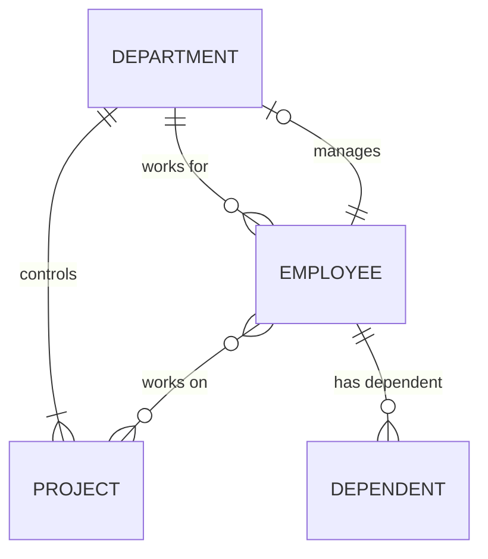
```mermaid
erDiagram
    DEPARTMENT ||--o{ EMPLOYEE : "works for"
    EMPLOYEE ||--o| DEPARTMENT : "manages"
    DEPARTMENT ||--|{ PROJECT : "controls"
    EMPLOYEE }o--o{ PROJECT : "works on"
    EMPLOYEE ||--o{ DEPENDENT : "has dependent"
```

| ความหมาย | Chen Notation | Crow's Foot Notation | สัญลักษณ์ทางภาพ |
| :--- | :--- | :--- | :---: |
| **One and only one (เป๊ะๆ 1)** | (1, 1) หรือ เส้นเดี่ยว + เลข 1 | ขีดตรงสองขีดคู่ | `||` |
| **Zero or one (0 หรือ 1)** | (0, 1) | วงกลม + ขีดตรง | `o|` |
| **One or many (1 ขึ้นไป)** | (1, N) หรือ เส้นคู่ + N | ขีดตรง + ตีนกา 3 แฉก | `|{` |
| **Zero or many (0 ขึ้นไป)** | (0, N) หรือ เส้นเดี่ยว + N | วงกลม + ตีนกา 3 แฉก | `o{` |

---

## Slide 4: Example COMPANY Database (ความต้องการระบบบริษัท - ส่วนที่ 1)
**ข้อกำหนดความต้องการ (Requirements of the Company - Oversimplified for illustrative purposes):**
1. บริษัทจัดโครงสร้างออกเป็นหลาย **แผนก (DEPARTMENTs):**
   - แต่ละแผนกมี: ชื่อแผนก (`Name`), หมายเลขแผนก (`Number`), และมีพนักงาน 1 คนทำหน้าที่เป็น **ผู้จัดการแผนก (Manager)**
   - ระบบต้องบันทึกวันที่ผู้จัดการคนนั้นเริ่มเข้ารับตำแหน่งด้วย (`StartDate`)
2. แต่ละแผนกทำหน้าที่ควบคุมโครงการหลาย **โครงการ (PROJECTs):**
   - แต่ละโครงการมี: ชื่อโครงการ (`Name`), รหัสโครงการ (`Number`), และมีสถานที่ตั้งเพียงแห่งเดียว (`Location`)

---

## Slide 5: Example COMPANY Database (Cont.) (ความต้องการระบบบริษัท - ส่วนที่ 2)
**ข้อกำหนดความต้องการต่อเนื่อง:**
3. ระบบจัดเก็บข้อมูล **พนักงาน (EMPLOYEEs):**
   - พนักงานแต่ละคนมี: เลขประจำตัวประชาชน (`SSN`), ที่อยู่ (`Address`), เงินเดือน (`Salary`), เพศ (`Sex`), และวันเกิด (`Birthdate`)
   - พนักงานแต่ละคนต้องสังกัดแผนกเพียง **1 แผนกเท่านั้น** แต่สามารถทำงานร่วมในหลายโครงการได้
   - ระบบต้องติดตามบันทึก **จำนวนชั่วโมงต่อสัปดาห์ (`Hours`)** ที่พนักงานแต่ละคนทำงานในแต่ละโครงการ
   - ระบบต้องบันทึกข้อมูล **หัวหน้างานโดยตรง (Direct Supervisor)** ของพนักงานแต่ละคน
4. พนักงานแต่ละคนอาจมี **ผู้ติดตาม/ผู้อยู่ในความอุปการะ (DEPENDENTs):**
   - ข้อมูลของผู้ติดตามประกอบด้วย: ชื่อผู้ติดตาม (`Name`), เพศ (`Sex`), วันเกิด (`Birthdate`), และความสัมพันธ์กับพนักงาน (`Relationship` เช่น บุตร, คู่สมรส)

---

## Slide 6: ER DIAGRAM FOR THE COMPANY DATABASE (แผนภาพ ER เต็มรูปแบบของระบบบริษัท)

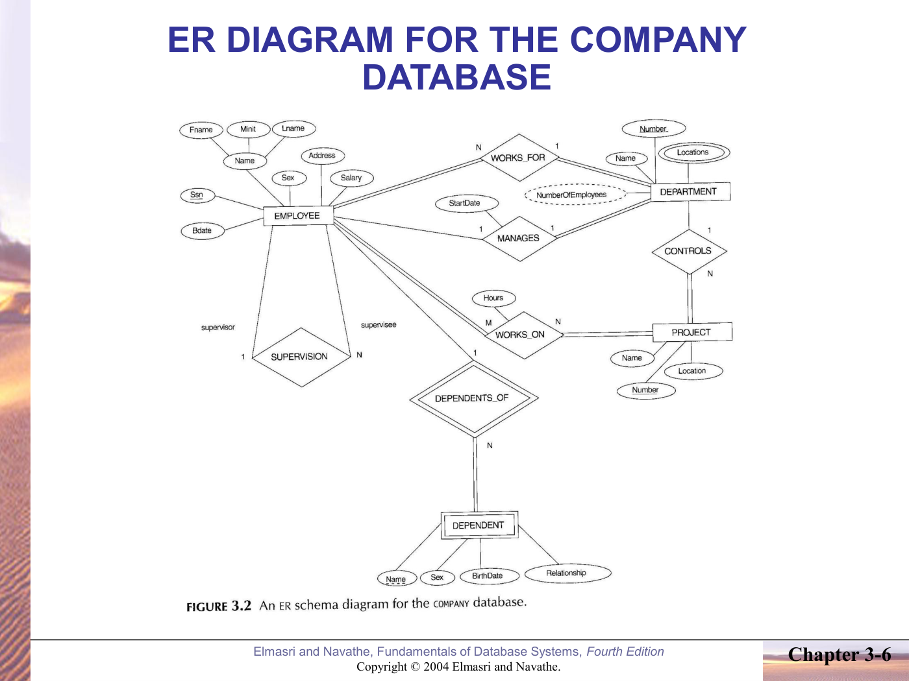

> [!SUMMARY] **การวิเคราะห์โครงสร้างแผนภาพ ER เต็มรูปแบบ (Figure 3.2 Analysis):**
> แผนภาพด้านบนคือแม่แบบมาตรฐานของ Peter Chen ที่บรรยายระบบ COMPANY ไว้อย่างสมบูรณ์ มีจุดสำคัญที่ต้องสังเกตดังนี้:
> 1. **เอนทิตีหลัก 3 ตัว (Regular Entities):**
>    - `EMPLOYEE`: มีคีย์หลักคือ <u>`Ssn`</u>, มี Composite Attribute คือ `Name(Fname, Minit, Lname)`
>    - `DEPARTMENT`: มีคีย์หลัก 2 ตัวเลือกคือ <u>`Name`</u> และ <u>`Number`</u>, มี Multivalued Attribute คือ `{Locations}`
>    - `PROJECT`: มีคีย์หลักคือ <u>`Name`</u> และ <u>`Number`</u>, มี Simple Attribute คือ `Location`
> 2. **เอนทิตีแบบอ่อน 1 ตัว (Weak Entity):**
>    - `DEPENDENT`: ไม่มีคีย์ของตนเอง ใช้ Partial Key (เส้นประใต้ชื่อ) คือ `Name` และเชื่อมผ่าน Identifying Relationship `DEPENDENTS_OF` (ข้าวหลามตัดเส้นคู่) ไปยัง `EMPLOYEE`
> 3. **ความสัมพันธ์รอบทิศทาง:**
>    - `WORKS_FOR` (1:N): พนักงาน N คน ทำงานให้แผนก 1 แผนก (ฝั่ง EMPLOYEE เส้นคู่แปลว่าต้องมีสังกัดทุกคน)
>    - `MANAGES` (1:1): พนักงาน 1 คน จัดการ 1 แผนก (มีแอตทริบิวต์ `StartDate` อยู่บนความสัมพันธ์)
>    - `CONTROLS` (1:N): 1 แผนก ควบคุมได้ N โครงการ
>    - `WORKS_ON` (M:N): พนักงาน M คน ทำงานร่วมใน N โครงการ (มีแอตทริบิวต์ `Hours` อยู่บนความสัมพันธ์)
>    - `SUPERVISION` (1:N แบบ Recursive): พนักงาน 1 คน มีหัวหน้า 1 คน แต่หัวหน้า 1 คน คุมพนักงานได้ N คน

---

## Slide 7: ER Model Concepts: Entities and Attributes (แนวคิดเอนทิตีและแอตทริบิวต์)
- **Entities (เอนทิตี):** คือ สิ่งของ วัตถุ หรือบุคคลที่มีตัวตนอยู่ในโลกความจริง (Mini-world) และถูกบันทึกข้อมูลไว้ในฐานข้อมูล เช่น:
  - พนักงานชื่อ *John Smith*
  - แผนกวิจัย *Research DEPARTMENT*
  - โครงการพัฒนาผลิตภัณฑ์ *ProductX PROJECT*
- **Attributes (แอตทริบิวต์):** คือ คุณสมบัติที่ใช้อธิบายลักษณะเฉพาะของเอนทิตี เช่น เอนทิตีพนักงานมี: `Name`, `SSN`, `Address`, `Sex`, `BirthDate`
- **Entity Instance (อินสแตนซ์ของเอนทิตี):** เอนทิตีตัวตนหนึ่งๆ จะมีค่าข้อมูลเฉพาะเจาะจงในแต่ละแอตทริบิวต์ เช่น:
  - `Name` = 'John Smith'
  - `SSN` = '123456789'
  - `Address` = '731 Fondren, Houston, TX'
  - `Sex` = 'M'
  - `BirthDate` = '09-JAN-1955'

---

## Slide 8: Types of Attributes (ประเภทของแอตทริบิวต์)
แอตทริบิวต์แบ่งออกเป็น 4 ชนิดย่อยตามลักษณะโครงสร้างการเก็บข้อมูล:

| ชนิดของ Attribute | นิยามเชิงทฤษฎี | ตัวอย่างจากสไลด์ | วิธีการจัดเก็บในฐานข้อมูลจริง |
| :--- | :--- | :--- | :--- |
| **Simple (Atomic)** | ข้อมูลเชิงเดี่ยว ไม่สามารถแยกย่อยได้อีก | `SSN` (เลขบัตรปชช.), `Sex` (เพศ M/F) | คอลัมน์เดี่ยวในตาราง เช่น `VARCHAR(9)` |
| **Composite** | ข้อมูลผสมที่ประกอบด้วยส่วนย่อยหลายส่วน | `Address(Apt#, House#, Street, City, State, ZipCode)` หรือ `Name(Fname, Minit, Lname)` | แตกเป็นหลายคอลัมน์ในตารางจริงเพื่อสะดวกต่อการสืบค้นและค้นหา |
| **Multi-valued** | เอนทิตี 1 ตัว สามารถมีค่าข้อมูลนี้ได้มากกว่า 1 ค่า | `{Color}` ของรถยนต์ หรือ `{PreviousDegrees}` ของนักศึกษา | แยกออกเป็นตารางใหม่ (New Table) เพื่อไม่ให้ขัดต่อกฎ 1NF |
| **Complex (Nested)** | การผสมผสานกันระหว่าง Composite และ Multi-valued ซ้อนกันหลายชั้น | `{PreviousDegrees(College, Year, Degree, Field)}` | นิยมใช้ตารางลูกเชื่อม Foreign Key หรือใช้ JSON Data Type ใน NoSQL/Modern RDBMS |

---

## Slide 9: Entity Types and Key Attributes (ชนิดของเอนทิตีและแอตทริบิวต์ที่เป็นคีย์)
- **Entity Type (ชนิดเอนทิตี):** คือ กลุ่มของเอนทิตีที่มีโครงสร้างแอตทริบิวต์พื้นฐานชุดเดียวกัน เช่น ชนิดเอนทิตี `EMPLOYEE` หรือชนิดเอนทิตี `PROJECT`
- **Key Attribute (แอตทริบิวต์คีย์):** คุณลักษณะที่เอนทิตีแต่ละตัวต้องมีค่าไม่ซ้ำกันอย่างเด็ดขาด (Uniqueness) ใช้เป็นตัวชี้เฉพาะเจาะจง เช่น `SSN` ของ `EMPLOYEE`
- **Composite Key (คีย์ผสม):** คีย์ที่ต้องนำแอตทริบิวต์หลายตัวมารวมกันจึงจะมีค่าไม่ซ้ำ เช่น ทะเบียนรถยนต์ `VehicleTagNumber(Number, State)`
- **Multiple Keys (มีหลายคีย์ในเอนทิตีเดียว):** เอนทิตีอาจมีแอตทริบิวต์ที่เป็นคีย์ระบุตัวตนได้มากกว่า 1 คีย์ เช่น ในรถยนต์ (`CAR`):
  1. `VehicleIdentificationNumber` (เลขตัวถัง หรือ VIN)
  2. `VehicleTagNumber(Number, State)` (ป้ายทะเบียนคู่กับจังหวัด)

---

## Slide 10: ENTITY TYPE CAR WITH ATTRIBUTES (ตัวอย่างอินสแตนซ์ของเอนทิตีรถยนต์)

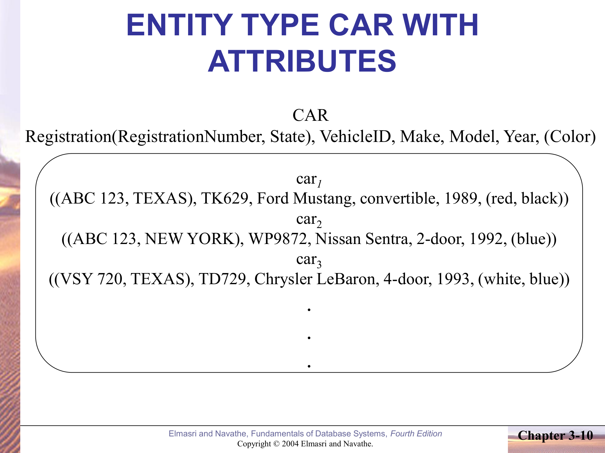

> [!INFO] **การวิเคราะห์โครงสร้างข้อมูลรถยนต์ (CAR Schema & Instances Trace):**
> โครงสร้างเอนทิตี: `CAR( Registration(RegistrationNumber, State), VehicleID, Make, Model, Year, {Color} )`

**ตารางแจกแจงอินสแตนซ์จริงจากสไลด์ (Instances Trace Table):**

| Instance | Composite Key: `Registration` | Single Key: `VehicleID` | Simple: `Make` | Simple: `Model` | Simple: `Year` | Multi-valued: `{Color}` |
| :---: | :---: | :---: | :---: | :---: | :---: | :---: |
| **car1** | `(ABC 123, TEXAS)` | `TK629` | Ford | Mustang (Convertible) | 1989 | `{red, black}` (2 สี) |
| **car2** | `(ABC 123, NEW YORK)` | `WP9872` | Nissan | Sentra (2-door) | 1992 | `{blue}` (สีเดียว) |
| **car3** | `(VSY 720, TEXAS)` | `TD729` | Chrysler | LeBaron (4-door) | 1993 | `{white, blue}` (2 สี) |

> **ข้อสังเกตสำคัญ:** 
> - car1 และ car2 มีเลขทะเบียน `ABC 123` เหมือนกันได้ แต่ไม่ชนกันเพราะอยู่คนละรัฐ (`TEXAS` กับ `NEW YORK`) นี่คือเหตุผลที่ `Registration` ต้องเป็น Composite Key!
> - `{Color}` มีวงเล็บปีกกาครอบเพราะรถยนต์ 1 คัน สามารถพ่นสีทูโทน (แดงตัดดำ, ขาวตัดน้ำเงิน) ได้พร้อมกัน

---

## Slide 11: Relationships and Relationship Types (ความสัมพันธ์และประเภทความสัมพันธ์)
- **Relationship (ความสัมพันธ์):** คือ การผูกโยงความหมายระหว่าง 2 เอนทิตีขึ้นไป เช่น:
  - พนักงาน *John Smith* **ทำงานใน (works on)** โครงการ *ProductX*
  - พนักงาน *Franklin Wong* **เป็นผู้จัดการ (manages)** แผนก *Research*
- **Relationship Type (ประเภทความสัมพันธ์):** คือ กลุ่มของความสัมพันธ์ที่มีลักษณะเดียวกัน เช่น `WORKS_ON` (ระหว่าง `EMPLOYEE` กับ `PROJECT`) หรือ `MANAGES` (ระหว่าง `EMPLOYEE` กับ `DEPARTMENT`)
- **Degree of Relationship Type (ระดับขั้นของความสัมพันธ์):** จำนวนของชนิดเอนทิตีที่เข้ามาร่วมในความสัมพันธ์นั้น:
  - ร่วม 2 เอนทิตี = **Binary** (เช่น `MANAGES`, `WORKS_ON`)
  - ร่วม 3 เอนทิตี = **Ternary** (เช่น `SUPPLY` ที่มี Supplier, Part, Project)
  - ร่วม $n$ เอนทิตี = **n-ary**
- **Multiple Relationships between same Entity Types:** เอนทิตีคู่เดียวกันสามารถมีความสัมพันธ์กันได้มากกว่า 1 รูปแบบ เช่น ระหว่าง `EMPLOYEE` กับ `DEPARTMENT` มีทั้งความสัมพันธ์ `WORKS_FOR` (สังกัดแผนก) และความสัมพันธ์ `MANAGES` (เป็นผู้จัดการแผนก)

---

## Slide 12: Weak Entity Types (เอนทิตีแบบอ่อน)

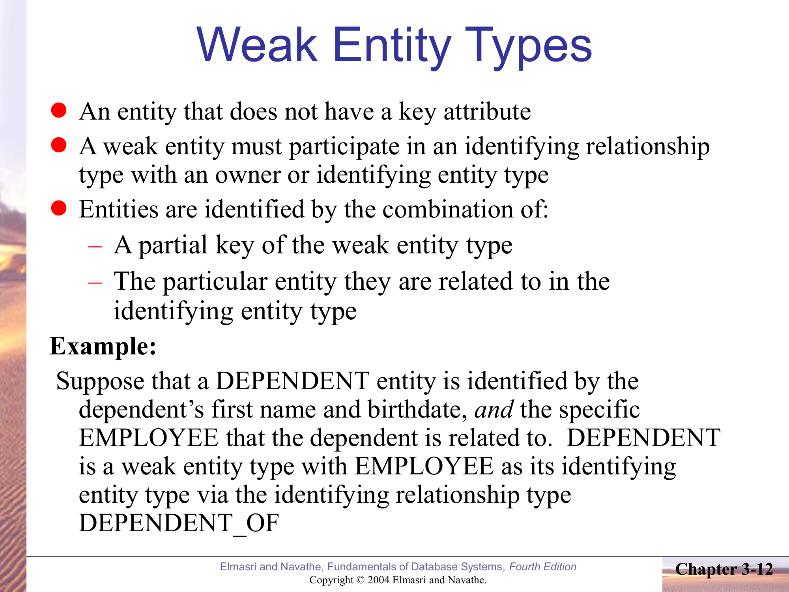

> [!WARNING] **นิยามและกลไกของ Weak Entity (เอนทิตีแบบอ่อน):**
> 1. เป็นเอนทิตีที่ **ไม่มี Key Attribute ในตัวเอง** ไม่สามารถระบุตัวตนได้โดยลำพัง
> 2. ต้องพึ่งพาการเข้าร่วมใน **Identifying Relationship Type** กับ **Owner (Identifying) Entity Type**
> 3. การระบุตัวตนของ Weak Entity ต้องอาศัย 2 องค์ประกอบรวมกันเสมอ:
>    - **Partial Key (คีย์ย่อย หรือ Discriminator):** ขีดเส้นประใต้ชื่อแอตทริบิวต์
>    - **Primary Key ของ Identifying Entity ที่มันขึ้นตรงอยู่ด้วย**

**ตัวอย่างคลาสสิก (DEPENDENT of EMPLOYEE):**
- ในระบบบริษัท มีเอนทิตี `DEPENDENT` (ผู้ติดตาม เช่น ลูก/คู่สมรสของพนักงาน)
- หากเด็กชื่อ "น้องฟ้า" เราไม่สามารถระบุได้ว่าเป็นใคร เพราะอาจมีพนักงาน 5 คนที่มีลูกชื่อ "น้องฟ้า" เหมือนกัน
- ดังนั้น `DEPENDENT` จึงต้องใช้คีย์ผสมคือ: **`SSN` ของพนักงาน (ผู้เป็นพ่อแม่) + `Name` ของลูก + `Birthdate`** จึงจะระบุตัวตนได้ 100%

---

## Slide 13: ER Model and Data Abstraction (แบบจำลอง ER และการสรุปนามธรรมของข้อมูล)
กระบวนการทางความคิดในการสร้าง ER Model เชื่อมโยงกับหลัก 4 ประการของการสรุปข้อมูล (Data Abstraction):
1. **Classification (การจัดหมวดหมู่):** การรวมเอนทิตีเดี่ยวๆ หลายตัวที่มีคุณสมบัติร่วมกัน ให้กลายเป็น **Entity Type** เช่น รวมนาย ก, นาย ข, นางสาว ค เป็น `EMPLOYEE`
2. **Aggregation (การประมวลรวม):** การรวมเอนทิตีหลายๆ ชนิดเข้าด้วยกันผ่าน **Relationship Type** เพื่อสร้างเป็นบริบทใหม่ เช่น รวมพนักงานและโครงการผ่านความสัมพันธ์ `WORKS_ON`
3. **Identification (การระบุเอกลักษณ์):** การกำหนดคุณลักษณะเฉพาะเพื่อแยกแยะแต่ละอินสแตนซ์ออกจากกัน เช่น Key Attribute ในเอนทิตีปกติ และ Partial Key ใน Weak Entity
4. **Generalization (การสรุปภาพรวม):** การจัดกลุ่มหมวดหมู่ย่อยขึ้นไปสู่กลุ่มหลัก (Superclass / Subclass) เช่น พนักงานประจำและลูกจ้างชั่วคราวจัดอยู่ในกลุ่มพนักงาน

---

## Slide 14: Constraints on Aggregation (ข้อจำกัดบนความสัมพันธ์)
ข้อจำกัดโครงสร้างบนความสัมพันธ์แบ่งออกเป็น 2 มิติสำคัญ:

1. **Maximum Cardinality (จำนวนสูงสุด / Cardinality Ratio):**
   - **One-to-One (1:1):** เอนทิตีฝั่ง A จับคู่กับเอนทิตีฝั่ง B ได้สูงสุดเพียง 1 ตัว เช่น 1 คน มีบัตรประชาชน 1 ใบ
   - **One-to-Many (1:N) หรือ Many-to-One (N:1):** ฝั่งหนึ่งจับคู่ได้หลายตัว แต่อีกฝั่งจับคู่ได้ตัวเดียว เช่น 1 แผนกมีพนักงาน N คน
   - **Many-to-Many (M:N):** ทั้งสองฝั่งจับคู่กันได้อย่างอิสระหลายตัว เช่น พนักงาน M คน ทำงานใน N โครงการ
2. **Minimum Cardinality (จำนวนต่ำสุด / Participation Constraints):**
   - **Zero (0) - Optional / Partial Participation:** ไม่บังคับ เอนทิตีบางตัวอาจไม่มีส่วนร่วมในความสัมพันธ์เลยก็ได้ เช่น พนักงานบางคนไม่ได้เป็นผู้จัดการแผนก
   - **One or more (1 ขึ้นไป) - Mandatory / Total Participation:** บังคับ 100% เอนทิตีทุกตัวต้องเข้าร่วมในความสัมพันธ์ มีสัญลักษณ์คือ **เส้นคู่ (Double Line)**

---

## Slide 15: One-to-many(1:N) or Many-to-one (N:1) RELATIONSHIP (เจาะลึกภาพอินสแตนซ์ความสัมพันธ์ e1..e7, d1..d3, r1..r7)

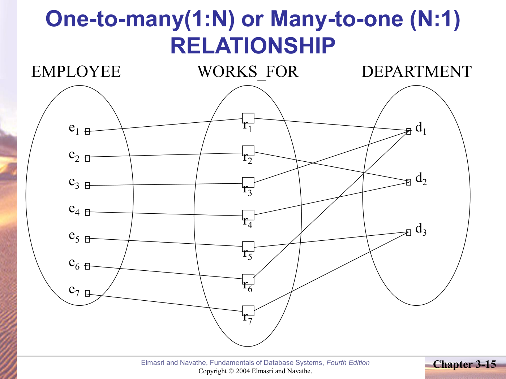

> [!IMPORTANT] **คำอธิบายไขข้อข้องใจ: สัญลักษณ์ e1, d1, r1 ในสไลด์คืออะไร?**
> ในสไลด์หน้านี้ อาจารย์ไม่ได้แสดงสมการคณิตศาสตร์ลอยๆ แต่กำลังวาด **แผนภาพจำลองอินสแตนซ์ของจริง (Set-Mapping Instance Diagram)** เพื่อพิสูจน์นิยามของความสัมพันธ์แบบ 1:N และ N:1 โดยจำแนกองค์ประกอบออกเป็น 3 วงรี:
> 1. **วงรีซ้ายสุด (Entity Set `EMPLOYEE`):** เก็บ **อินสแตนซ์พนักงานรายบุคคล (e1 ถึง e7)** ที่มีตัวตนจริง เช่น e1 = สมชาย, e2 = วิชัย, e3 = ปรียา, e4 = ธนพล, e5 = กานต์, e6 = สุรีย์, e7 = ชัยรัตน์
> 2. **วงรีขวาสุด (Entity Set `DEPARTMENT`):** เก็บ **อินสแตนซ์แผนกที่มีจริง (d1 ถึง d3)** เช่น d1 = ฝ่ายวิจัย (Research), d2 = ฝ่ายบริหาร (Admin), d3 = ฝ่ายไอที (IT)
> 3. **วงรีตรงกลาง (Relationship Set `WORKS_FOR`):** เก็บ **อินสแตนซ์ความสัมพันธ์ (r1 ถึง r7)** ซึ่งก็คือ **"เหตุการณ์การเซ็นสัญญาจ้างงานจริง"** ว่าใครสังกัดแผนกใด โดย r_i ทำหน้าที่เป็นสะพานเชื่อมโยงระหว่างพนักงาน e_i กับแผนก d_j

**ตารางแจกแจงเส้นเชื่อมโยงความสัมพันธ์จริงจากภาพสไลด์ 15 (Trace Table):**

| อินสแตนซ์ความสัมพันธ์ (r) | ฝั่งพนักงาน (e) | พนักงานตัวจริง (สมมติเพื่อความเข้าใจ) | ฝั่งแผนก (d) | แผนกตัวจริง | ความหมายทางธุรกิจ (Business Semantics) |
| :---: | :---: | :--- | :---: | :--- | :--- |
| **r1** | e1 | สมชาย (SSN 001) | d1 | แผนกวิจัย (Research) | สมชาย สังกัดทำงานใน แผนกวิจัย |
| **r2** | e2 | วิชัย (SSN 002) | d2 | แผนกบริหาร (Admin) | วิชัย สังกัดทำงานใน แผนกบริหาร |
| **r3** | e3 | ปรียา (SSN 003) | d1 | แผนกวิจัย (Research) | ปรียา สังกัดทำงานใน แผนกวิจัย |
| **r4** | e4 | ธนพล (SSN 004) | d2 | แผนกบริหาร (Admin) | ธนพล สังกัดทำงานใน แผนกบริหาร |
| **r5** | e5 | กานต์ (SSN 005) | d3 | แผนกไอที (IT) | กานต์ สังกัดทำงานใน แผนกไอที |
| **r6** | e6 | สุรีย์ (SSN 006) | d1 | แผนกวิจัย (Research) | สุรีย์ สังกัดทำงานใน แผนกวิจัย |
| **r7** | e7 | ชัยรัตน์ (SSN 007) | d3 | แผนกไอที (IT) | ชัยรัตน์ สังกัดทำงานใน แผนกไอที |

### วิเคราะห์ลึก: ทำไมภาพนี้จึงเป็นนิยามของ 1:N หรือ N:1?
- **มองจากพนักงานไปหาแผนก (Many-to-One / N:1):**
  - สังเกตพนักงานแต่ละคน (e1 ถึง e7) จะมี **เส้นลากออกจากตัวเองเพียง 1 เส้นเป๊ะๆ** เข้าหาจุดความสัมพันธ์ r_i และส่งต่อไปยังแผนก d_j เพียงแห่งเดียว
  - ไม่มีพนักงานคนไหนเลยที่มี 2 แฉก (พนักงาน 1 คน มีสิทธิ์สังกัดได้แค่ 1 แผนกเท่านั้น)
  - พนักงานทุกคนมีเส้นออกครบทั้ง 7 คน แปลว่าทุกคนต้องมีสังกัด = **Total Participation**
- **มองจากแผนกกลับมาหาพนักงาน (One-to-Many / 1:N):**
  - เมื่อดูจุดปลายทางที่แผนก d1, d2, d3 จะพบว่า **มีเส้นเชื่อมพุ่งเข้ามาเกาะได้หลายเส้น:**
    - แผนกวิจัย d1 มีเส้นโยงเข้ามาถึง 3 เส้น (r1, r3, r6) นั่นคือมีลูกน้อง 3 คน (e1, e3, e6)
    - แผนกบริหาร d2 มีเส้นโยงเข้ามา 2 เส้น (r2, r4) มีลูกน้อง 2 คน (e2, e4)
    - แผนกไอที d3 มีเส้นโยงเข้ามา 2 เส้น (r5, r7) มีลูกน้อง 2 คน (e5, e7)
  - **สรุปชัดเจน:** 1 แผนก มีพนักงานสังกัดได้หลายคน (1:N) และพนักงานหลายคน สังกัดอยู่แผนกเดียว (N:1)!

---

## Slide 16: MANY-TO-MANY(M:N) RELATIONSHIP (เจาะลึกภาพอินสแตนซ์ความสัมพันธ์หลายต่อหลาย)

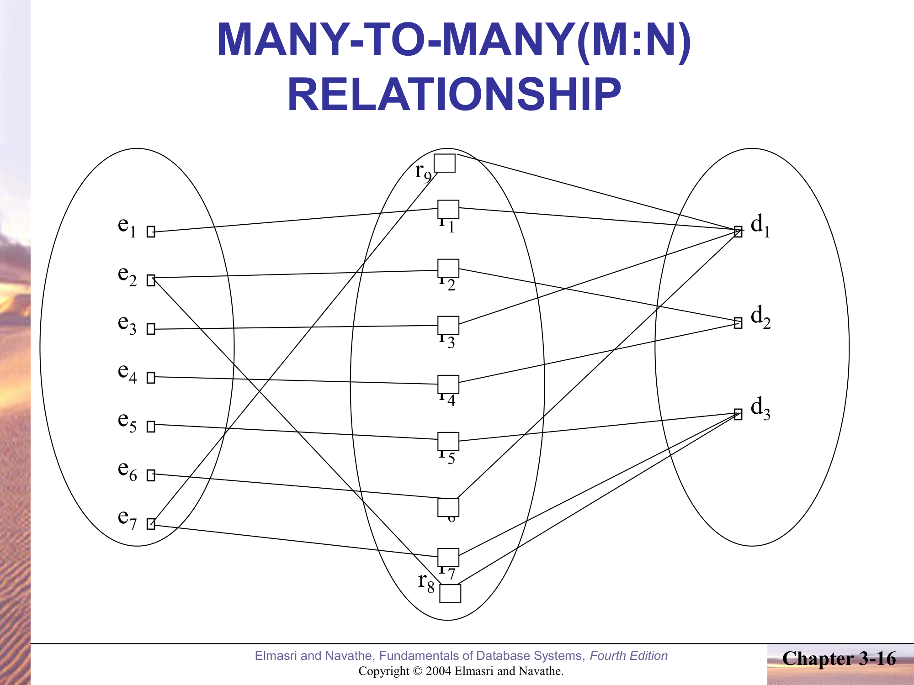

> [!IMPORTANT] **ถอดรหัสความแตกต่างของภาพ Slide 16 เทียบกับ Slide 15:**
> ในสไลด์ 16 นี้ เป็นตัวอย่างของความสัมพันธ์แบบ **Many-to-Many (M:N)** เช่น พนักงานช่วยงานในโครงการ (`WORKS_ON`) โดยมีอินสแตนซ์ความสัมพันธ์ตรงกลางถึง 9 จุด (r1 ถึง r9):

**ตารางแจกแจงเส้นเชื่อมโยงความสัมพันธ์ M:N จากภาพสไลด์ 16:**

| จุดความสัมพันธ์ (r) | ฝั่งพนักงาน (e) | ฝั่งโครงการ/แผนก (d) | ข้อสังเกตเชิงลึกจากภาพ |
| :---: | :---: | :---: | :--- |
| **r1** | e1 | d1 | พนักงาน e1 ทำงานโครงการ d1 |
| **r2** | e2 | d2 | พนักงาน e2 ทำงานโครงการ d2 |
| **r3** | e2 | d1 | **พนักงาน e2 คนเดิม มีเส้นแตกออกไปทำโครงการ d1 อีกหนึ่งโครงการ!** |
| **r4** | e4 | d2 | พนักงาน e4 ทำงานโครงการ d2 |
| **r5** | e5 | d3 | พนักงาน e5 ทำงานโครงการ d3 |
| **r6** | e6 | d3 | พนักงาน e6 ทำงานโครงการ d3 |
| **r7** | e7 | d3 | พนักงาน e7 ทำงานโครงการ d3 |
| **r8** | e4 | d1 | **พนักงาน e4 แตกเส้นออกไปทำโครงการ d1 ด้วย!** |
| **r9** | e7 | d1 | **พนักงาน e7 แตกเส้นออกไปทำโครงการ d1 ด้วย!** |

### บทพิสูจน์ความสัมพันธ์แบบ Many-to-Many:
1. **พนักงาน 1 คน มีหลายโครงการ:** ดูที่ e2 วิ่งเข้าทั้ง r2 และ r3 แปลว่านายวิชัยควบ 2 โครงการ และ e7 วิ่งเข้าทั้ง r7 และ r9 ควบ 2 โครงการเช่นกัน
2. **โครงการ 1 โครงการ มีหลายพนักงาน:** ดูที่โครงการ d1 มีเส้นจาก r1, r3, r8, r9 วิ่งเข้าหาถึง 4 เส้น แปลว่ามีพนักงาน 4 คน (e1, e2, e4, e7) มารุมทำงานให้โครงการ d1
3. เมื่อทั้งสองฝั่งต่างแตกแขนงได้หลายเส้นพร้อมกัน นี่คือนิยามเชิงคณิตศาสตร์ของ **Many-to-Many (M:N)** ซึ่งในระบบฐานข้อมูลเชิงสัมพันธ์จริง **จะต้องแตกเป็นตารางเชื่อม (Junction/Bridge Table) เสมอ!**

---

## Slide 17: Structural Constraints - one way to express semantics of relationships
**วิธีการเขียนข้อกำหนดโครงสร้างบนแผนภาพ ER (Structural Constraints):**
1. **Cardinality Ratio (อัตราส่วนคู่สัมพันธ์):**
   - ระบุสัดส่วนการจับคู่สูงสุดระหว่าง 2 เอนทิตี เช่น `1:1`, `1:N`, `N:1`, หรือ `M:N`
   - **วิธีเขียน:** กำกับตัวเลข `1`, `N`, `M` ไว้บนเส้นเชื่อมโยงระหว่างสี่เหลี่ยมเอนทิตีกับข้าวหลามตัดความสัมพันธ์
2. **Participation Constraint (ข้อกำหนดการมีส่วนร่วม / ความขึ้นต่อกัน):**
   - **Total Participation (การมีส่วนร่วมแบบสมบูรณ์):** ทุกเอนทิตีต้องมีส่วนร่วมในความสัมพันธ์ มีอีกชื่อหนึ่งว่า **Existence Dependency** (ดำรงอยู่ด้วยตนเองไม่ได้)
     - **วิธีเขียน:** ใช้ **เส้นคู่ (Double Line)** ลากเชื่อมระหว่างเอนทิตีกับความสัมพันธ์
   - **Partial Participation (การมีส่วนร่วมบางส่วน):** เอนทิตีบางตัวอาจไม่มีความสัมพันธ์เลยก็ได้
     - **วิธีเขียน:** ใช้ **เส้นเดี่ยว (Single Line)** ธรรมดา
3. *ข้อควรระวังสำคัญ (NOTE):* สัญลักษณ์ `1, N` และเส้นคู่นี้ ออกแบบมาให้ใช้งานได้ชัดเจนกับ **Binary Relationship (ความสัมพันธ์ 2 ฝั่ง)** เท่านั้น หากนำไปใช้กับความสัมพันธ์ 3 ฝั่งขึ้นไป (Higher-order) จะทำให้เกิดความคลุมเครืออย่างมาก

---

## Slide 18: Alternative (min, max) notation for relationship structural constraints
**สัญลักษณ์ทางเลือกขั้นสูง: สัญลักษณ์วงเล็บคู่ (min, max)**
เพื่อแก้ปัญหาความคลุมเครือของเส้นคู่และตัวเลข 1, N นักออกแบบจึงคิดค้นสัญลักษณ์ `(min, max)`:
- กำกับไว้บนเส้นเชื่อมโยงที่ต่อออกมาจากเอนทิตีแต่ละตัว
- กำหนดว่าเอนทิตีแต่ละตัว ($e \in E$) จะต้องเข้าร่วมในความสัมพันธ์ $R$ **อย่างน้อยที่สุดกี่ครั้ง (`min`)** และ **อย่างมากที่สุดกี่ครั้ง (`max`)**
- กฎทางคณิตศาสตร์: $0 \le \min \le \max$ และ $\max \ge 1$ (หากไม่ระบุข้อบังคับ ค่าปริยายคือ $(0, n)$)

**ตัวอย่างการประยุกต์ใช้จริงจากสไลด์ 18:**
1. **ความสัมพันธ์ `MANAGES` (การบริหารแผนก):**
   - ข้อกำหนด: "แผนกหนึ่งแผนกต้องมีผู้จัดการเป๊ะๆ 1 คน และพนักงานคนหนึ่งสามารถเป็นผู้จัดการได้สูงสุดไม่เกิน 1 แผนก (หรือไม่เป็นเลยก็ได้)"
   - ฝั่ง `EMPLOYEE`: เขียนกำกับว่า **`(0, 1)`** ($\min=0$ คือไม่ต้องเป็นหัวหน้าใคร, $\max=1$ คือคุมได้สูงสุด 1 แผนก)
   - ฝั่ง `DEPARTMENT`: เขียนกำกับว่า **`(1, 1)`** ($\min=1$ บังคับต้องมีผู้จัดการขาดไม่ได้, $\max=1$ มีผู้จัดการได้เพียงคนเดียว)
2. **ความสัมพันธ์ `WORKS_FOR` (การสังกัดแผนก):**
   - ข้อกำหนด: "พนักงานทุกคนต้องสังกัดแผนกใดแผนกหนึ่งเป๊ะๆ 1 แผนก แต่แผนกหนึ่งแผนกสามารถมีพนักงานสังกัดได้ไม่จำกัดจำนวน"
   - ฝั่ง `EMPLOYEE`: เขียนกำกับว่า **`(1, 1)`** ($\min=1$ บังคับต้องมีแผนก, $\max=1$ อยู่ได้แค่แผนกเดียว)
   - ฝั่ง `DEPARTMENT`: เขียนกำกับว่า **`(0, n)`** หรือ **`(4, n)`** (เพิ่งตั้งแผนกอาจมี 0 คน หรือมี $n$ คนก็ได้)

---

## Slide 19: The (min,max) notation for higher order relationship type constraints

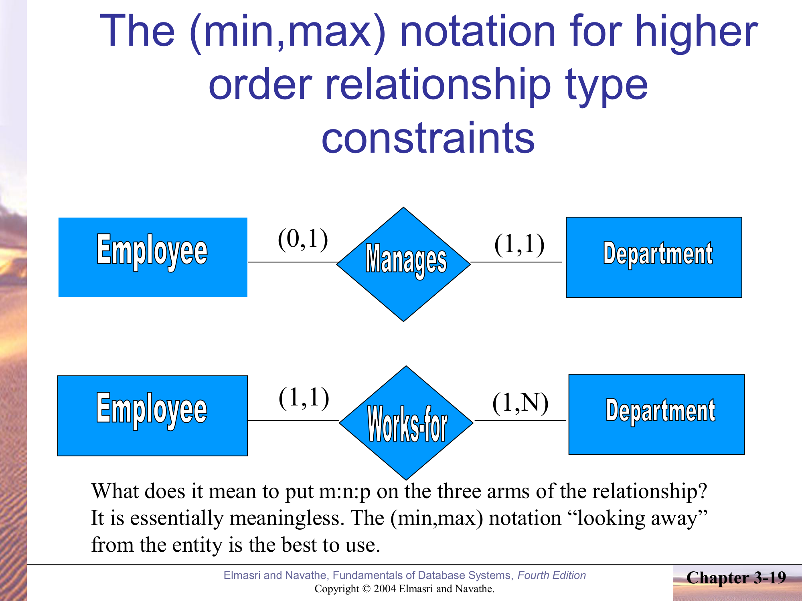

> [!DEFINITION] **กฎการอ่านค่า (Looking-Away Rule) บนสัญลักษณ์ (min, max):**
> - ในการเขียนสัญลักษณ์ `(min, max)` สากล จะใช้กฎ **"Looking Away from the Entity"** คือให้ตัวเอนทิตียืนอยู่ที่ฝั่งของตัวเอง แล้วมองออกไปยังความสัมพันธ์ตรงกลาง เพื่อบอกว่าตัวมันมีพันธะผูกพันกับกิจกรรมนั้นกี่ครั้ง
> - ตัวอย่างในสไลด์ 19:
>   - ความสัมพันธ์ `MANAGES`: `EMPLOYEE` มองออกไปเป็น `(0, 1)`, `DEPARTMENT` มองออกไปเป็น `(1, 1)`
>   - ความสัมพันธ์ `WORKS_FOR`: `EMPLOYEE` มองออกไปเป็น `(1, 1)`, `DEPARTMENT` มองออกไปเป็น `(1, N)`
> - การใส่ตัวอักษร $M:N:P$ บนแขน 3 ข้างของความสัมพันธ์ระดับสูงนั้น **แทบจะไร้ความหมาย (Essentially meaningless)** เพราะไม่สามารถบอกขอบเขตขั้นต่ำและขั้นสูงของแต่ละฝ่ายได้ การใช้ `(min, max)` จึงเป็นวิธีที่ดีและชัดเจนที่สุด

---

## Slide 20: Relationships of Higher Degree (ความสัมพันธ์ระดับสูงกว่า Binary)
- **นิยาม Degree ของความสัมพันธ์:**
  - ร่วม 2 เอนทิตี เรียกว่า **Binary** (ระดับ 2)
  - ร่วม 3 เอนทิตี เรียกว่า **Ternary** (ระดับ 3)
  - ร่วม $n$ เอนทิตี เรียกว่า **n-ary** (ระดับ $n$)
- **ทฤษฎีสำคัญที่สุด (In general, an n-ary relationship is not equivalent to n binary relationships):**
  - **ความสัมพันธ์ระดับ 3 (Ternary) ไม่เท่ากับ ความสัมพันธ์ระดับ 2 จำนวน 3 อัน (Ternary $
eq$ 3 Binaries)!**
  - หากพยายามยุบความสัมพันธ์ 3 เส้าให้กลายเป็นรูปสามเหลี่ยมที่เชื่อม 2 ฝั่ง 3 เส้น จะทำให้เกิด **การสูญเสียความหมายและข้อเท็จจริง (Loss of Semantics)**

---

## Slide 21: TERNARY RELATIONSHIPS (การเปรียบเทียบสถาปัตยกรรม Ternary แท้จริง)

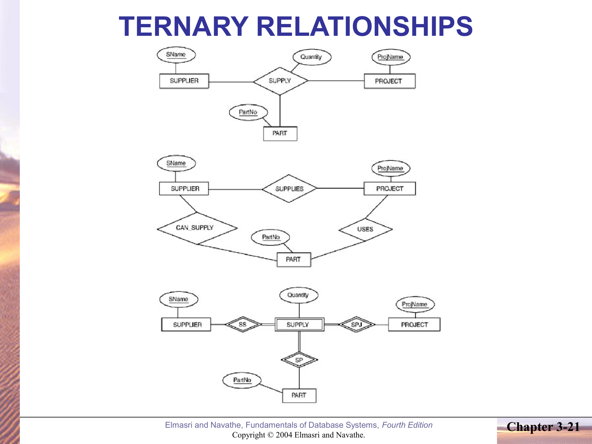

> [!INFO] **การวิเคราะห์แผนผัง 3 รูปแบบใน Slide 21:**
> สไลด์นี้เปรียบเทียบการออกแบบความสัมพันธ์การจัดส่งชิ้นส่วน 3 แบบ:
> 1. **แบบบนสุด (True Ternary Relationship):**
>    - มีสี่เหลี่ยม 3 ตัว: `SUPPLIER`, `PART`, `PROJECT` เชื่อมตรงเข้าสู่ข้าวหลามตัดเดี่ยว `SUPPLY`
>    - มีแอตทริบิวต์ `Quantity` (จำนวนที่ส่ง) อยู่บนความสัมพันธ์ `SUPPLY`
>    - ความหมาย: "ผู้จัดส่ง A ส่งชิ้นส่วน X ให้แก่โครงการ 1 เป็นจำนวน Q ชิ้น" (ข้อมูลสมบูรณ์ใน 1 จุด)
> 2. **แบบกลาง (3 Binary Relationships ปลอม):**
>    - เชื่อมโยง 3 เส้น: `SUPPLIES` (Supplier-Project), `CAN_SUPPLY` (Supplier-Part), `USES` (Project-Part)
>    - ผลลัพธ์: ระบบจะรู้ว่าใครทำงานกับใคร แต่ **ไม่สามารถตอบได้ว่า ชิ้นส่วน X นั้น ใครเป็นคนส่งให้โครงการ 1 กันแน่!**
> 3. **แบบล่างสุด (Ternary Weak Entity / Associative Entity):**
>    - แปลงความสัมพันธ์ `SUPPLY` ให้กลายเป็น Weak Entity แล้วเชื่อม Binary Identifying Relationship `SS`, `SPJ`, `SP` เข้าหา

---

## Slide 22: TERNARY VS. BINARY RELATIONSHIPS (กรณีศึกษา Instructor, Course, Semester)

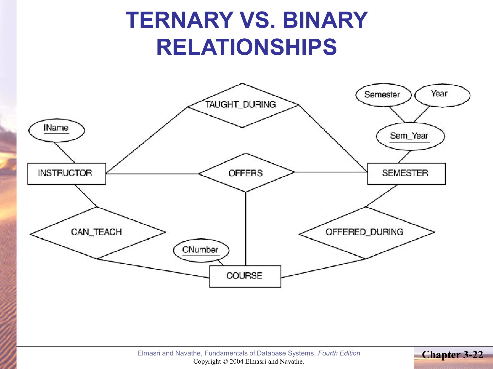

> [!SUMMARY] **การวิเคราะห์กรณีศึกษาการเปิดสอนวิชา (Slide 22 Analysis):**
> ตัวอย่างนี้แสดงให้เห็นความล้มเหลวของการใช้ 3 Binary แทน 1 Ternary:
> - ถ้าเรามี 3 เอนทิตี: `INSTRUCTOR` (อาจารย์ผู้สอน), `COURSE` (รายวิชา), `SEMESTER` (ภาคการศึกษา)
> - **ถ้าใช้ Ternary `OFFERS` (ตรงกลาง):**
>   - จะบันทึกข้อเท็จจริงได้ชัดเจนว่า: *"อาจารย์สมชาย สอนวิชา Database ในภาคเรียน 1/2569"*
> - **ถ้าพยายามแตกเป็น 3 Binary (`TAUGHT_DURING`, `CAN_TEACH`, `OFFERED_DURING`):**
>   - เรารู้ว่า อาจารย์สมชายเคยสอนในเทอม 1/2569 (`TAUGHT_DURING`)
>   - เรารู้ว่า อาจารย์สมชายมีความสามารถสอนวิชา Database ได้ (`CAN_TEACH`)
>   - เรารู้ว่า วิชา Database มีเปิดสอนในเทอม 1/2569 (`OFFERED_DURING`)
>   - **คำถามชวนคิด:** *ตกลงในเทอม 1/2569 อาจารย์สมชายได้สอนวิชา Database จริงหรือไม่? หรือว่าอาจารย์สมชายไปสอนวิชา AI แล้วคนสอน Database เป็นอาจารย์วิชัย?*
>   - **คำตอบ:** 3 Binary ไม่สามารถตอบคำถามนี้ได้เลย! นี่คือข้อพิสูจน์ว่าทำไมต้องใช้ **Ternary Relationship**!

---

## Slide 23: TERNARY RELATIONSHIP- Instance Diagram (เจาะลึกภาพอินสแตนซ์ 3 เส้า s_i, p_j, j_k, r_m)

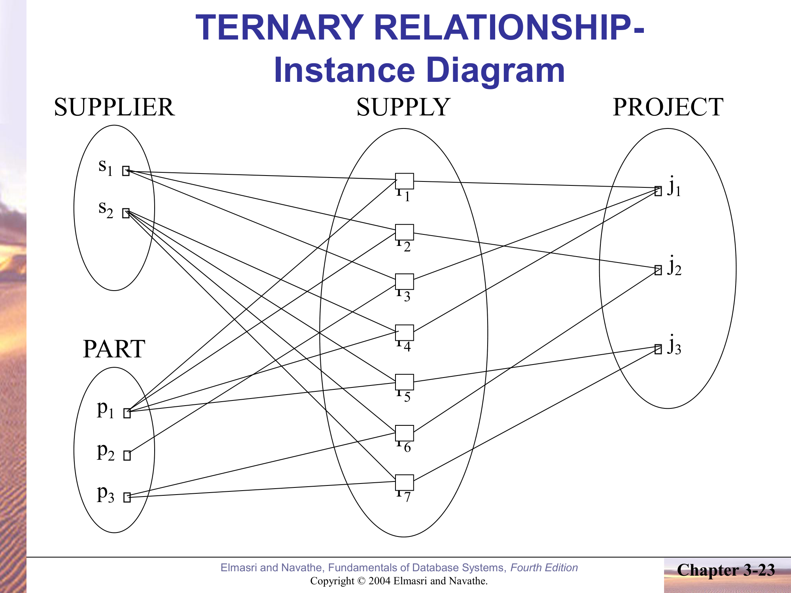

> [!IMPORTANT] **คำอธิบายไขข้อข้องใจ: สัญลักษณ์ s1, p1, j1, r1 คืออะไร?**
> สไลด์หน้านี้แสดง **แผนภาพอินสแตนซ์ของความสัมพันธ์ 3 มิติ (Ternary Instance Mapping)**:
> 1. **ฝั่งบนซ้าย (`SUPPLIER`):** มีผู้จัดส่ง 2 ราย คือ s1 (เช่น บริษัท ซีเมนต์ไทย) และ s2 (บริษัท ปูนนกอินทรี)
> 2. **ฝั่งล่างซ้าย (`PART`):** มีอะไหล่/ชิ้นส่วน 3 รายการ คือ p1 (ปูนซีเมนต์), p2 (เหล็กเส้น), p3 (กระเบื้อง)
> 3. **ฝั่งขวา (`PROJECT`):** มีโครงการก่อสร้าง 3 โครงการ คือ j1 (รถไฟฟ้า), j2 (คอนโดมิเนียม), j3 (สะพานแขวน)
> 4. **วงรีตรงกลาง (`SUPPLY`):** มีอินสแตนซ์ความสัมพันธ์ 7 จุด (r1 ถึง r7) ซึ่งแต่ละจุด **ต้องมีเส้น 3 เส้นวิ่งมารวมตัวกันเสมอ (3-way Connection)** ขาดเส้นใดเส้นหนึ่งไม่ได้เด็ดขาด!

**ตารางแจกแจงเส้นเชื่อมโยง 3 มิติจากภาพสไลด์ 23 (Ternary Trace Table):**

| จุดความสัมพันธ์ (r) | ผู้จัดส่ง (s) | ชิ้นส่วน (p) | โครงการเป้าหมาย (j) | คำอธิบายความหมายจริงในโลกธุรกิจ (Mini-world Semantics) |
| :---: | :---: | :---: | :---: | :--- |
| **r1** | s1 (ซีเมนต์ไทย) | p1 (ปูนซีเมนต์) | j1 (รถไฟฟ้า) | ซีเมนต์ไทย ส่งปูนซีเมนต์ ให้โครงการรถไฟฟ้า |
| **r2** | s1 (ซีเมนต์ไทย) | p1 (ปูนซีเมนต์) | j2 (คอนโด) | ซีเมนต์ไทย ส่งปูนซีเมนต์ ให้โครงการคอนโดมิเนียม |
| **r3** | s2 (นกอินทรี) | p1 (ปูนซีเมนต์) | j3 (สะพานแขวน) | นกอินทรี ส่งปูนซีเมนต์ ให้โครงการสะพานแขวน |
| **r4** | s2 (นกอินทรี) | p2 (เหล็กเส้น) | j2 (คอนโด) | นกอินทรี ส่งเหล็กเส้น ให้โครงการคอนโดมิเนียม |
| **r5** | s2 (นกอินทรี) | p3 (กระเบื้อง) | j1 (รถไฟฟ้า) | นกอินทรี ส่งกระเบื้อง ให้โครงการรถไฟฟ้า |
| **r6** | s2 (นกอินทรี) | p3 (กระเบื้อง) | j2 (คอนโด) | นกอินทรี ส่งกระเบื้อง ให้โครงการคอนโดมิเนียม |
| **r7** | s2 (นกอินทรี) | p3 (กระเบื้อง) | j3 (สะพานแขวน) | นกอินทรี ส่งกระเบื้อง ให้โครงการสะพานแขวน |

*สังเกต:* หากไม่มี r1 เราจะไม่มีวันรู้เลยว่า ปูนซีเมนต์ (p1) ที่ส่งไปให้รถไฟฟ้า (j1) นั้นมาจากบริษัทซีเมนต์ไทย (s1) หรือมาจากนกอินทรี (s2)!

---

## Slide 24: Problem with constraints on higher order relationship types

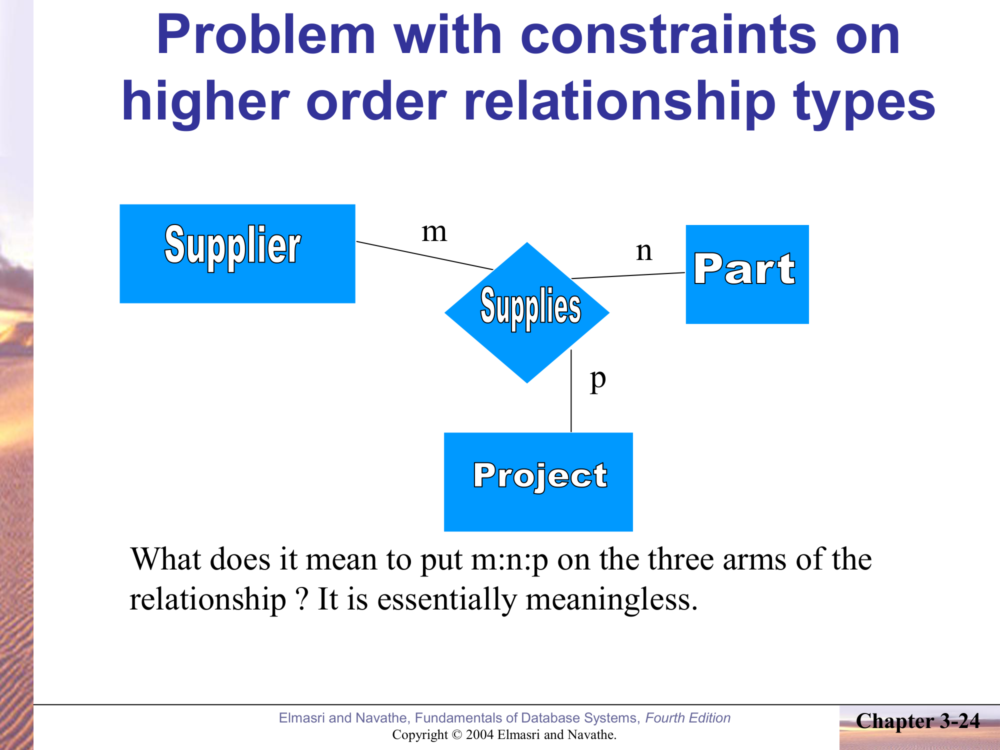

> [!WARNING] **ปัญหาของการเขียน m:n:p บนแขนความสัมพันธ์ 3 เส้า:**
> - สไลด์แสดงภาพเอนทิตี `Supplier`, `Part`, `Project` เชื่อมต่อเข้ากับ `Supply` โดยมีตัวอักษร $m, n, p$ แปะไว้ที่แขนทั้งสาม
> - ผู้เขียนตำรา (Elmasri & Navathe) ระบุชัดเจนว่า: **"What does it mean to put m:n:p on the three arms of the relationship? It is essentially meaningless."**
> - **เหตุผล:** มนุษย์ไม่สามารถตีความได้เลยว่า m:n:p หมายถึงอะไร? ใครเป็น 1 ใครเป็น Many? เมื่อคู่ใดคู่หนึ่งถูกตรึงไว้ อีกฝั่งจะผันแปรได้อย่างไร? ก่อให้เกิดความเข้าใจผิดในการสร้างตารางอย่างร้ายแรง จึงห้ามใช้สัญลักษณ์ m:n:p โดยเด็ดขาด

---

## Slide 25: The (min,max) notation for higher order relationship type constraints

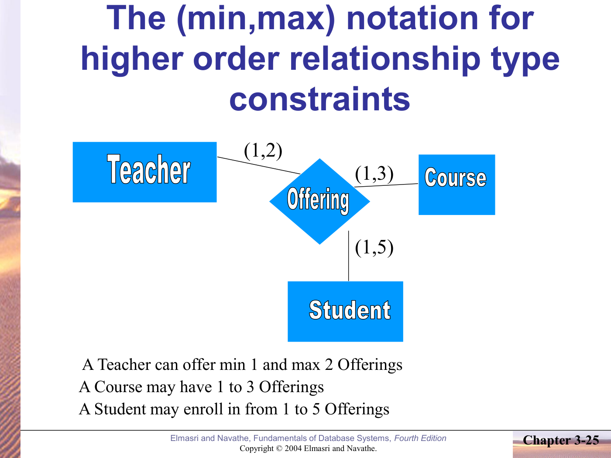

> [!INFO] **ทางออกที่ถูกต้อง: การใช้สัญลักษณ์ (min, max) บนความสัมพันธ์ระดับสูง:**
> สไลด์ 25 นำเสนอตัวอย่างความสัมพันธ์ Ternary การเปิดสอนวิชา `Offering` ระหว่าง `Teacher`, `Course`, และ `Student` โดยใช้กฎ Looking-Away:

**การแปลความหมายข้อจำกัด (min, max) แต่ละฝั่ง:**
1. **ฝั่ง `Teacher` กำกับด้วย `(1, 2)`:**
   - อาจารย์แต่ละคน ต้องมีส่วนร่วมในการเปิดสอน (`Offering`) อย่างน้อยที่สุด 1 ครั้ง ($\min=1$) และรับผิดชอบได้สูงสุดไม่เกิน 2 ครั้ง ($\max=2$)
2. **ฝั่ง `Course` กำกับด้วย `(1, 3)`:**
   - แต่ละรายวิชา สามารถนำมาเปิดสอนได้ตั้งแต่ 1 รอบ ($\min=1$) ถึงสูงสุดไม่เกิน 3 รอบ ($\max=3$)
3. **ฝั่ง `Student` กำกับด้วย `(1, 5)`:**
   - นักศึกษาแต่ละคน ต้องลงทะเบียนเรียนในรอบการเปิดสอนอย่างน้อย 1 รายการ ($\min=1$) และลงทะเบียนได้สูงสุดไม่เกิน 5 รายการ ($\max=5$)

เห็นได้ชัดว่า สัญลักษณ์ `(min, max)` อธิบายข้อจำกัดในชีวิตจริงได้อย่างกระจ่างชัดและไม่คลุมเครือ

---

## Slide 26: RECURSIVE RELATIONSHIP SUPERVISION (เจาะลึกภาพอินสแตนซ์ความสัมพันธ์วนกลับ และบทบาท 1 กับ 2)

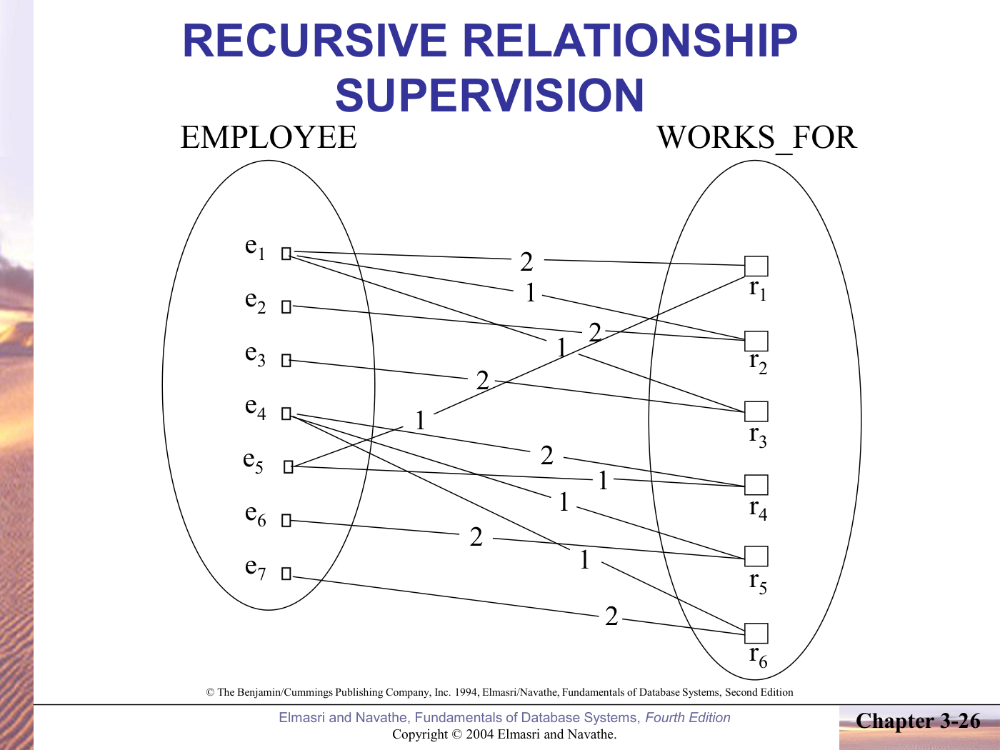

> [!IMPORTANT] **คำอธิบายไขข้อข้องใจ: ตัวเลข 1 และ 2 บนเส้นเชื่อมใน Slide 26 คืออะไร?**
> ในสไลด์หน้านี้ คือ **ความสัมพันธ์แบบเวียนเกิด (Recursive Relationship)** ชนิด `SUPERVISION` (การบังคับบัญชา) โดยมีเอนทิตีเพียงกลุ่มเดียวคือ `EMPLOYEE` (e1 ถึง e7)
> - มีจุดความสัมพันธ์ตรงกลาง 6 จุด (r1 ถึง r6)
> - **ตัวเลข 1 บนเส้นเชื่อม:** หมายถึง พนักงานคนนั้นทำหน้าที่ใน **บทบาทหมายเลข 1 = หัวหน้างาน (Supervisor)**
> - **ตัวเลข 2 บนเส้นเชื่อม:** หมายถึง พนักงานคนนั้นทำหน้าที่ใน **บทบาทหมายเลข 2 = ผู้ใต้บังคับบัญชา/ลูกน้อง (Supervisee)**

**ตารางถอดรหัสสายการบังคับบัญชาจริงจากภาพสไลด์ 26 (Supervision Trace Table):**

| จุดความสัมพันธ์ (r) | ฝั่งบทบาท 1 (หัวหน้างาน / Supervisor) | ฝั่งบทบาท 2 (ลูกน้อง / Supervisee) | ความหมายจริงในองค์กร |
| :---: | :---: | :---: | :--- |
| **r1** | **e1** (สมชาย) | **e2** (วิชัย) | สมชาย เป็นหัวหน้า คุม วิชัย |
| **r2** | **e1** (สมชาย) | **e3** (ปรียา) | สมชาย เป็นหัวหน้า คุม ปรียา |
| **r3** | **e1** (สมชาย) | **e4** (ธนพล) | สมชาย เป็นหัวหน้า คุม ธนพล |
| **r4** | **e4** (ธนพล) | **e5** (กานต์) | ธนพล เป็นหัวหน้า คุม กานต์ |
| **r5** | **e5** (กานต์) | **e6** (สุรีย์) | กานต์ เป็นหัวหน้า คุม สุรีย์ |
| **r6** | **e5** (กานต์) | **e7** (ชัยรัตน์) | กานต์ เป็นหัวหน้า คุม ชัยรัตน์ |

### ถอดรหัสโครงสร้างผังองค์กร (Organizational Hierarchy Chart):
จากตารางการจับคู่ด้านบน สามารถแปลงเป็นโครงสร้างต้นไม้ของบริษัทได้อย่างชัดเจนดังนี้:
- **ระดับ 1 (CEO / ผู้บริหารสูงสุด):** e1 (สมชาย) คุมผู้จัดการ 3 คน (e2, e3, e4)
- **ระดับ 2 (Middle Management):** e4 (ธนพล) คุมหัวหน้าทีม e5 (กานต์) ส่วน e2, e3 เป็นผู้ปฏิบัติการ
- **ระดับ 3 (Team Lead):** e5 (กานต์) คุมพนักงานระดับปฏิบัติการ 2 คน (e6, e7)
- **ระดับ 4 (Operational Staff):** e6 (สุรีย์) และ e7 (ชัยรัตน์)
- **ข้อสังเกต:** พนักงาน e1 มีแต่เส้นออกบทบาท 1 (ไม่มีเส้นบทบาท 2 เข้าหาตัว) แปลว่า **e1 ไม่มีหัวหน้า เป็นบอสใหญ่สุดของบริษัท!**

---

## Slide 27: Roles played by Entity Types in Relationship types
**บทบาทของเอนทิตีและแอตทริบิวต์บนความสัมพันธ์:**
1. **Role Names (ชื่อบทบาท):**
   - เมื่อเอนทิตีชนิดเดียวกันเข้าร่วมในความสัมพันธ์เดียวกันมากกว่า 1 ด้าน (เช่น Recursive ใน `SUPERVISION`) แขนของความสัมพันธ์จะชี้ไปยังเอนทิตีเดียวกันจนแยกไม่ออก
   - จึงจำเป็นต้องเขียน **"ชื่อบทบาท (Role Name)"** กำกับไว้บนเส้น เช่น แขนหนึ่งเขียนว่า `supervisor` และอีกแขนเขียนว่า `supervisee`
2. **Attributes of Relationship Types (คุณลักษณะบนตัวความสัมพันธ์):**
   - ความสัมพันธ์สามารถมีแอตทริบิวต์เป็นของตนเองได้ เรียกว่า Relationship Attribute
   - **ตัวอย่าง:** `HoursPerWeek` (จำนวนชั่วโมงทำงานต่อสัปดาห์) บนความสัมพันธ์ `WORKS_ON`
   - **ทำไมต้องแปะไว้ที่ความสัมพันธ์?**
     - แปะไว้ที่ `EMPLOYEE` ไม่ได้ เพราะพนักงานคนเดียวทำงานหลายโครงการ แต่ละโครงการใช้ชั่วโมงไม่เท่ากัน
     - แปะไว้ที่ `PROJECT` ไม่ได้ เพราะโครงการหนึ่งมีพนักงานหลายคนมาช่วยทำ แต่ละคนลงเวลาไม่เท่ากัน
     - ทางออกเดียวคือต้องแปะไว้ที่จุดตัดของการจับคู่ระหว่างพนักงานและโครงการ นั่นคือบนตัวความสัมพันธ์ `WORKS_ON`!

---

## Slide 28: ER DIAGRAM WITH ROLE NAMES AND MINI-MAX CONSTRAINTS (แผนภาพระบบบริษัทแบบ (min, max))

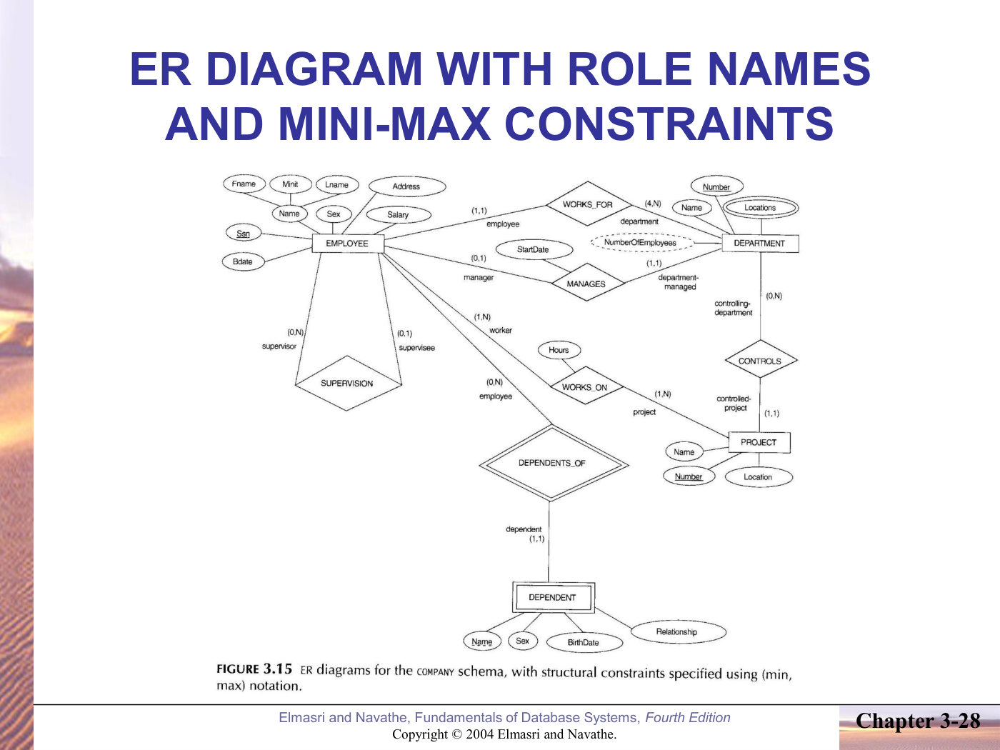

> [!SUMMARY] **การวิเคราะห์ระบบ COMPANY ด้วยสัญลักษณ์ (min, max) (Figure 3.15):**
> แผนภาพนี้แปลงระบบ COMPANY จาก Slide 6 มาเป็นสัญลักษณ์วงเล็บ `(min, max)` และ Role Names ทั้งหมด:
> 1. `WORKS_FOR`: 
>    - `EMPLOYEE` ชี้เข้าหาความสัมพันธ์ด้วย **`(1, 1)`** พร้อมป้ายบทบาท `employee` (พนักงานทุกคนต้องสังกัด 1 แผนกเท่านั้น)
>    - `DEPARTMENT` ชี้เข้าหาความสัมพันธ์ด้วย **`(4, N)`** พร้อมป้ายบทบาท `department` (แต่ละแผนกต้องมีพนักงานอย่างน้อย 4 คนขึ้นไป)
> 2. `MANAGES`:
>    - `EMPLOYEE` มี **`(0, 1)`** บทบาท `manager` (พนักงานเป็นผู้จัดการได้ 0 หรือ 1 แผนก)
>    - `DEPARTMENT` มี **`(1, 1)`** บทบาท `department-managed` (แผนกต้องมีผู้จัดการเป๊ะๆ 1 คน)
> 3. `SUPERVISION`:
>    - แขนบทบาท `supervisor` มี **`(0, N)`** (พนักงาน 1 คน คุมลูกน้องได้ตั้งแต่ 0 ถึง N คน)
>    - แขนบทบาท `supervisee` มี **`(0, 1)`** (พนักงาน 1 คน มีหัวหน้าได้สูงสุด 1 คน หรือ 0 คนถ้าเป็น CEO)
> 4. `WORKS_ON`:
>    - `EMPLOYEE` มี **`(1, N)`** บทบาท `worker` (ต้องทำอย่างน้อย 1 โครงการ)
>    - `PROJECT` มี **`(1, N)`** บทบาท `project` (ต้องมีพนักงานมาช่วยทำอย่างน้อย 1 คน)

---

## Slide 29: Data Modeling Tools (เครื่องมือสร้างแบบจำลองข้อมูลในทางปฏิบัติ)
- **เครื่องมือยอดนิยมในวงการอุตสาหกรรม:**
  - **ERWin:** เครื่องมือระดับองค์กรมาตรฐานสูงสำหรับการทำ Data Modeling และ Reverse Engineering
  - **S-Designer (Enterprise Application Suite):** ซอฟต์แวร์ออกแบบเชิงมโนทัศน์และเชิงกายภาพ
  - **ER-Studio, Oracle SQL Developer Data Modeler, MySQL Workbench:** เครื่องมือออกแบบยอดนิยม
- **ข้อดีของการใช้เครื่องมือ (Positives):**
  1. ทำหน้าที่เป็นเอกสารอ้างอิงความต้องการของแอปพลิเคชัน (Living Documentation)
  2. มีหน้าจอการใช้งานแบบกราฟิกที่ง่าย (Easy Graphical User Interface)
  3. รองรับ **Forward Engineering** (แปลงจากภาพ ER กลายเป็นคำสั่ง `CREATE TABLE` ในภาษา SQL ได้โดยอัตโนมัติ)
  4. รองรับ **Reverse Engineering** (ดึงสคีมาจากฐานข้อมูลเดิมมาย้อนรอยวาดเป็นภาพ ER Diagram)

---

## Slide 30: ER DIAGRAM FOR A BANK DATABASE (แผนภาพ ER ระบบธนาคารพาณิชย์)

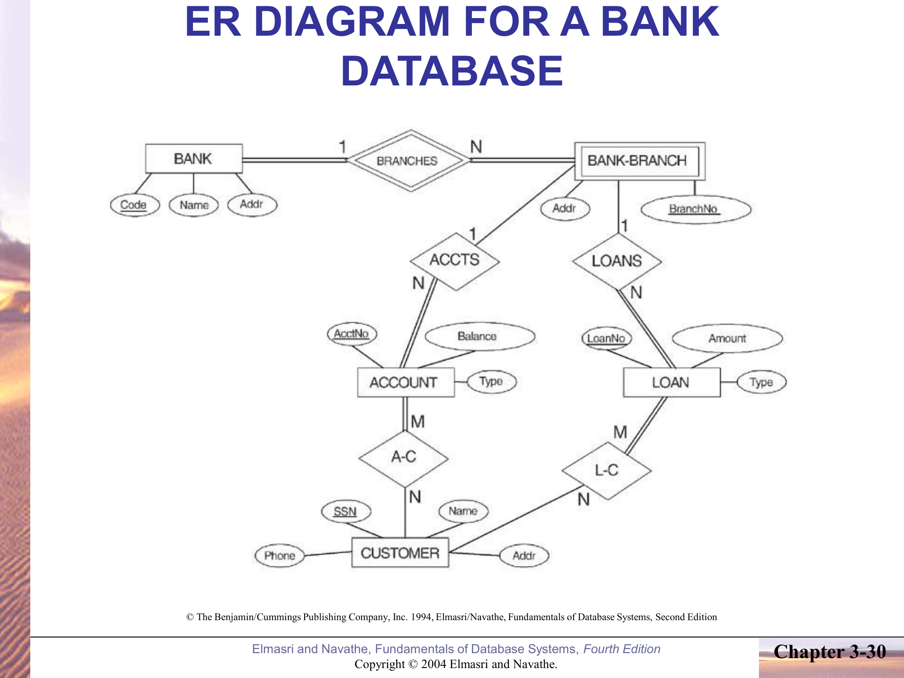

> [!DEFINITION] **เจาะลึกโครงสร้างแบบจำลองฐานข้อมูลธนาคาร (Bank Database Architecture):**
> สไลด์สุดท้ายแสดงกรณีศึกษาระบบธนาคารพาณิชย์ขนาดใหญ่ ประกอบด้วย 5 เอนทิตีหลัก:
> 1. **`BANK`:** เอนทิตีธนาคารสำนักงานใหญ่ มีคีย์คือ <u>`Code`</u>, `Name`, `Addr`
> 2. **`BANK-BRANCH` (Weak Entity):** สาขาธนาคาร เป็นเอนทิตีแบบอ่อนที่ขึ้นตรงกับ `BANK` ผ่าน Identifying Relationship `BRANCHES` (1:N เส้นคู่) โดยมี Partial Key คือ `BranchNo` และ Simple Attribute คือ `Addr`
> 3. **`ACCOUNT`:** บัญชีเงินฝาก มีคีย์คือ <u>`AcctNo`</u>, `Balance`, `Type` เชื่อมกับสาขาผ่านความสัมพันธ์ `ACCTS` (1:N)
> 4. **`LOAN`:** สัญญาสินเชื่อ/เงินกู้ มีคีย์คือ <u>`LoanNo`</u>, `Amount`, `Type` เชื่อมกับสาขาผ่านความสัมพันธ์ `LOANS` (1:N)
> 5. **`CUSTOMER`:** ลูกค้าของธนาคาร มีคีย์คือ <u>`SSN`</u>, `Name`, `Phone`, `Addr`
>    - ลูกค้าเชื่อมโยงกับบัญชีเงินฝากผ่านความสัมพันธ์ **`A-C` (M:N)** (ลูกค้า 1 คนเปิดได้หลายบัญชี และ 1 บัญชีสามารถเป็นบัญชีร่วมของลูกค้าหลายคนได้)
>    - ลูกค้าเชื่อมโยงกับสัญญาสินเชื่อผ่านความสัมพันธ์ **`L-C` (M:N)** (ลูกค้ากู้ได้หลายสัญญา และ 1 สัญญาเงินกู้สามารถมีผู้กู้ร่วมได้หลายคน)

---

## คู่มือการแปลง ER Model สู่ตาราง SQL จริง (ER-to-Relational DDL Mapping)

เพื่อให้เห็นภาพการทำงานจริง นี่คือโค้ด SQL DDL ที่แปลงมาจากแบบจำลอง Company Database (Slide 6 และ 28) โดยปฏิบัติตามกฎ Integrity Constraints ครบถ้วน:

```sql
-- 1. ตารางแผนก (DEPARTMENT)
CREATE TABLE DEPARTMENT (
    Dname        VARCHAR(50) NOT NULL UNIQUE,
    Dnumber      INT PRIMARY KEY,
    Mgr_ssn      CHAR(9),
    Mgr_start_date DATE
);

-- 2. ตารางสถานที่ตั้งแผนก (DEPT_LOCATIONS) - แปลงจาก Multivalued Attribute {Locations}
CREATE TABLE DEPT_LOCATIONS (
    Dnumber   INT NOT NULL,
    Dlocation VARCHAR(50) NOT NULL,
    PRIMARY KEY (Dnumber, Dlocation),
    FOREIGN KEY (Dnumber) REFERENCES DEPARTMENT(Dnumber) ON DELETE CASCADE
);

-- 3. ตารางพนักงาน (EMPLOYEE) - รองรับ Recursive Foreign Key (Super_ssn) และ Composite Attribute (Name)
CREATE TABLE EMPLOYEE (
    Fname       VARCHAR(20) NOT NULL,
    Minit       CHAR(1),
    Lname       VARCHAR(20) NOT NULL,
    Ssn         CHAR(9) PRIMARY KEY,
    Bdate       DATE,
    Address     VARCHAR(100),
    Sex         CHAR(1) CHECK (Sex IN ('M', 'F')),
    Salary      DECIMAL(10, 2),
    Super_ssn   CHAR(9),
    Dno         INT NOT NULL,
    FOREIGN KEY (Super_ssn) REFERENCES EMPLOYEE(Ssn) ON DELETE SET NULL,
    FOREIGN KEY (Dno) REFERENCES DEPARTMENT(Dnumber)
);

-- เพิ่ม Foreign Key ให้ผู้จัดการแผนก (หลังสร้าง EMPLOYEE เสร็จ)
ALTER TABLE DEPARTMENT ADD CONSTRAINT fk_dept_mgr
    FOREIGN KEY (Mgr_ssn) REFERENCES EMPLOYEE(Ssn) ON DELETE SET NULL;

-- 4. ตารางโครงการ (PROJECT)
CREATE TABLE PROJECT (
    Pname      VARCHAR(50) NOT NULL UNIQUE,
    Pnumber    INT PRIMARY KEY,
    Plocation  VARCHAR(50),
    Dnum       INT NOT NULL,
    FOREIGN KEY (Dnum) REFERENCES DEPARTMENT(Dnumber)
);

-- 5. ตารางการทำงาน (WORKS_ON) - แปลงจากความสัมพันธ์ M:N และมีแอตทริบิวต์ Hours
CREATE TABLE WORKS_ON (
    Essn   CHAR(9) NOT NULL,
    Pno    INT NOT NULL,
    Hours  DECIMAL(4, 1),
    PRIMARY KEY (Essn, Pno),
    FOREIGN KEY (Essn) REFERENCES EMPLOYEE(Ssn) ON DELETE CASCADE,
    FOREIGN KEY (Pno) REFERENCES PROJECT(Pnumber) ON DELETE CASCADE
);

-- 6. ตารางผู้ติดตาม (DEPENDENT) - แปลงจาก Weak Entity
CREATE TABLE DEPENDENT (
    Essn           CHAR(9) NOT NULL,
    Dependent_name VARCHAR(50) NOT NULL,
    Sex            CHAR(1) CHECK (Sex IN ('M', 'F')),
    Bdate          DATE,
    Relationship   VARCHAR(20),
    PRIMARY KEY (Essn, Dependent_name),
    FOREIGN KEY (Essn) REFERENCES EMPLOYEE(Ssn) ON DELETE CASCADE
);
```

---

## การสืบค้นสายการบังคับบัญชาแบบ Recursive (Hierarchical SQL Query)
จาก Slide 26 ที่แสดงความสัมพันธ์ `SUPERVISION` หากต้องการดึงสายการบังคับบัญชาทั้งหมดของบริษัท สามารถเขียน SQL ด้วย **Common Table Expression (`WITH RECURSIVE`)** ได้ดังนี้:

```sql
WITH RECURSIVE OrgChart AS (
    -- Anchor Member: ค้นหาผู้บริหารสูงสุด (ไม่มีหัวหน้า)
    SELECT Ssn, Fname, Lname, Super_ssn, 1 AS Level, CAST(Fname AS VARCHAR(255)) AS Path
    FROM EMPLOYEE
    WHERE Super_ssn IS NULL
    
    UNION ALL
    
    -- Recursive Member: ดึงลูกน้องที่ขึ้นตรงในระดับถัดไป
    SELECT e.Ssn, e.Fname, e.Lname, e.Super_ssn, o.Level + 1, CAST(o.Path || ' -> ' || e.Fname AS VARCHAR(255))
    FROM EMPLOYEE e
    INNER JOIN OrgChart o ON e.Super_ssn = o.Ssn
)
SELECT Level, Fname || ' ' || Lname AS EmployeeName, Path AS HierarchyPath
FROM OrgChart
ORDER BY Level, EmployeeName;
```

---

## แนวข้อสอบและคำถามทบทวนประจำบทเรียน (Exam Review & Practice)

> [!IMPORTANT] **คำถามข้อสอบยอดฮิตเรื่อง ER Model:**
> 
> **ข้อที่ 1:** เหตุใดความสัมพันธ์ระดับ 3 (Ternary Relationship) จึงไม่สามารถแทนที่ด้วยความสัมพันธ์ระดับ 2 จำนวน 3 อัน (3 Binary Relationships) ได้อย่างสมบูรณ์?
> - **เฉลย:** เพราะการแตกเป็น 3 Binary จะทำให้เกิดการสูญเสียบริบทของการจับคู่พร้อมกัน 3 ฝ่าย (Loss of Semantics) เช่น หากนาย A เคยส่งของ X, นาย A เคยร่วมงานกับโครงการ 1, และโครงการ 1 เคยใช้ของ X ระบบจะไม่สามารถยืนยันได้เลยว่า ในเหตุการณ์นั้น "นาย A เป็นคนส่งของ X ให้โครงการ 1 หรือไม่" ข้อมูลจะขาดความเชื่อมโยงในระดับ Transaction เดี่ยว
> 
> **ข้อที่ 2:** จงอธิบายความแตกต่างระหว่าง Total Participation และ Partial Participation พร้อมยกตัวอย่างจากระบบธนาคาร
> - **เฉลย:** 
>   - **Total Participation (เส้นคู่):** เอนทิตีทุกตัวต้องมีความสัมพันธ์ขาดไม่ได้ เช่น `ACCOUNT` ทุกบัญชี ต้องมีสาขาที่เปิดบัญชี (`BANK-BRANCH`) อยู่จริง บัญชีลอยๆ ที่ไม่มีสาขาจะบันทึกลงระบบไม่ได้
>   - **Partial Participation (เส้นเดี่ยว):** เอนทิตีบางตัวอาจไม่มีส่วนร่วมก็ได้ เช่น `CUSTOMER` บางคน อาจเป็นเพียงผู้มาติดต่อสอบถาม หรือเคยเปิดบัญชีแต่ปิดไปแล้ว จึงไม่จำเป็นต้องผูกกับเงินกู้ (`LOAN`)
> 
> **ข้อที่ 3:** ใน Weak Entity เหตุใดจึงต้องมีเส้นคู่ที่กล่องสี่เหลี่ยม และเส้นคู่ที่รูปข้าวหลามตัด (Identifying Relationship) เสมอ?
> - **เฉลย:** เพราะโดยนิยาม Weak Entity ไม่มี Primary Key เป็นของตนเอง การดำรงอยู่ของมันจึงขึ้นต่อ Owner Entity 100% (Existence Dependent) ดังนั้นมันจึงต้องมี Total Participation (เส้นคู่) เข้าหาความสัมพันธ์ชี้เฉพาะ (Identifying Relationship เส้นคู่) เสมอ หากปราศจาก Owner เอนทิตีแบบอ่อนนี้จะไม่สามารถคงอยู่ได้ในฐานข้อมูล


---

## อัลกอริทึมการแปลงโมเดล ER สู่สคีมาฐานข้อมูลเชิงสัมพันธ์ 7 ขั้นตอน (ER-to-Relational Mapping Algorithm)

เมื่อเราออกแบบแผนภาพ ER ในระดับมโนทัศน์ (Conceptual Schema) เสร็จสิ้นแล้ว ขั้นตอนถัดไปคือการแปลง (Mapping) ไปเป็น **Relational Schema (ตาราง, คอลัมน์, และคีย์)** ตามขั้นตอนมาตรฐาน 7 ขั้นตอนของ Elmasri & Navathe:

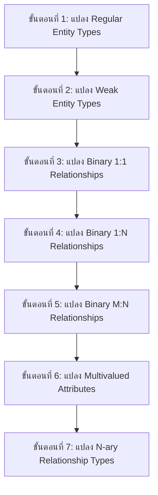
```mermaid
flowchart TD
    Step1["ขั้นตอนที่ 1: แปลง Regular Entity Types"] --> Step2["ขั้นตอนที่ 2: แปลง Weak Entity Types"]
    Step2 --> Step3["ขั้นตอนที่ 3: แปลง Binary 1:1 Relationships"]
    Step3 --> Step4["ขั้นตอนที่ 4: แปลง Binary 1:N Relationships"]
    Step4 --> Step5["ขั้นตอนที่ 5: แปลง Binary M:N Relationships"]
    Step5 --> Step6["ขั้นตอนที่ 6: แปลง Multivalued Attributes"]
    Step6 --> Step7["ขั้นตอนที่ 7: แปลง N-ary Relationship Types"]
```

### ขั้นตอนที่ 1: แปลง Regular (Strong) Entity Types (การแปลงเอนทิตีปกติ)
- สำหรับ Regular Entity แต่ละตัว $E$ ใน ER Diagram:
  - ให้สร้าง Relation (ตาราง) $R$ ขึ้นมา 1 ตาราง
  - นำ Simple Attributes ทั้งหมดของ $E$ มาเป็นคอลัมน์ของ $R$
  - สำหรับ Composite Attribute: ให้แตกเฉพาะ **Atomic Components** ของมันมาเป็นคอลัมน์ (ห้ามนำชื่อแม่มาเก็บ เช่น เอา `Fname`, `Minit`, `Lname` มาใส่ แต่ไม่ต้องมีคอลัมน์ `Name`)
  - เลือก Key Attribute ตัวใดตัวหนึ่งของ $E$ มาเป็น **Primary Key** ของ $R$ (หากคีย์เป็น Composite Key คีย์หลักของตารางก็จะเป็น Composite Primary Key)

### ขั้นตอนที่ 2: แปลง Weak Entity Types (การแปลงเอนทิตีแบบอ่อน)
- สำหรับ Weak Entity แต่ละตัว $W$ ที่ขึ้นตรงกับ Owner Entity $E$ ผ่าน Identifying Relationship:
  - สร้างตาราง $R$ สำหรับ $W$
  - นำ Simple Attributes ของ $W$ มาเป็นคอลัมน์
  - **ดึง Primary Key ของ Owner Entity $E$ เข้ามาใส่ใน $R$ ในฐานะ Foreign Key (FK)**
  - **Primary Key ของ $R$:** เกิดจากการนำ `Primary Key ของ Owner (FK)` มารวมกับ `Partial Key ของ Weak Entity` กลายเป็น Composite Primary Key เสมอ
  - *ข้อกำหนดความคงสภาพ (Integrity Rule):* ต้องตั้ง Foreign Key เป็น `ON DELETE CASCADE` เสมอ เพื่อให้เวลาลบ Owner แล้ว ข้อมูลของ Weak Entity จะถูกลบตามไปด้วย

### ขั้นตอนที่ 3: แปลง Binary 1:1 Relationship Types (ความสัมพันธ์แบบหนึ่งต่อหนึ่ง)
ในการเชื่อม 1:1 มี 3 แนวทางให้เลือกตามระดับการมีส่วนร่วม (Participation):
1. **Foreign Key Approach (นิยมที่สุด):** 
   - เลือกตารางฝั่งที่มี **Total Participation** เป็นตารางรับ Foreign Key
   - ดึง Primary Key ของอีกฝั่งมาเป็น Foreign Key และใส่เงื่อนไข `UNIQUE NOT NULL`
   - นำ Simple Attributes บนความสัมพันธ์ (ถ้ามี) มาใส่ในตารางนี้ด้วย
2. **Merged Relation (รวมเป็นตารางเดียว):**
   - หากทั้งสองฝั่งต่างมี Total Participation ทั้งคู่ สามารถยุบรวมทั้งสองเอนทิตีให้กลายเป็น 1 ตารางใหญ่ตารางเดียวได้เลย
3. **Cross-Reference / Relationship Relation:**
   - สร้างตารางเชื่อมแยกต่างหาก ดึง PK ทั้งสองฝั่งมาเป็น FK (ไม่ค่อยนิยมสำหรับ 1:1 เพราะสิ้นเปลืองการ JOIN)

### ขั้นตอนที่ 4: แปลง Binary 1:N Relationship Types (ความสัมพันธ์แบบหนึ่งต่อกลุ่ม)
- สำหรับความสัมพันธ์ 1:N ใดๆ ระหว่างเอนทิตี $S$ (ฝั่ง 1) และ $T$ (ฝั่ง N):
  - **กฎเหล็ก:** **"นำ Primary Key ของฝั่ง 1 ไปวางเป็น Foreign Key ในฝั่ง N เสมอ!"**
  - เหตุผล: ฝั่ง N (เช่น พนักงาน) แต่ละคนมีสังกัดได้เพียง 1 แผนก จึงเก็บค่ารหัสแผนกเป็นคอลัมน์เดี่ยวในแถวของพนักงานได้โดยไม่เกิด Repeating Group
  - ห้ามเอา PK ฝั่ง N ไปใส่ในฝั่ง 1 เด็ดขาด เพราะแผนก 1 แผนกจะมีพนักงานหลายคน ทำให้เกิดหลายค่าใน 1 ช่อง ขัดแย้งกับกฎ 1NF
  - หากมีความสัมพันธ์มีแอตทริบิวต์กำกับ ให้นำแอตทริบิวต์นั้นไปใส่ไว้ในตารางฝั่ง N ด้วย

### ขั้นตอนที่ 5: แปลง Binary M:N Relationship Types (ความสัมพันธ์แบบกลุ่มต่อกลุ่ม)
- สำหรับความสัมพันธ์ M:N ใดๆ เช่น `WORKS_ON` ระหว่าง `EMPLOYEE` และ `PROJECT`:
  - **กฎเหล็ก:** **"ต้องสร้างตารางใหม่ขึ้นมา 1 ตารางเสมอ เรียกว่า Junction Table หรือ Bridge Table"**
  - ตั้งชื่อตารางตามชื่อความสัมพันธ์ เช่น `WORKS_ON`
  - ดึง Primary Key ของทั้งสองฝั่งเข้ามาเป็น Foreign Key:
    - `Essn` ชี้ไปที่ `EMPLOYEE(Ssn)`
    - `Pno` ชี้ไปที่ `PROJECT(Pnumber)`
  - **Primary Key ของตารางใหม่นี้:** คือการรวมตัวกันของ Foreign Key ทั้งสองตัว `(Essn, Pno)`
  - นำแอตทริบิวต์ที่อยู่บนความสัมพันธ์ (เช่น `Hours`) มาเป็นคอลัมน์ของตารางนี้

### ขั้นตอนที่ 6: แปลง Multivalued Attributes (แอตทริบิวต์หลายค่า)
- สำหรับ Multivalued Attribute ใดๆ เช่น `{Locations}` ของ `DEPARTMENT` หรือ `{Color}` ของ `CAR`:
  - **กฎเหล็ก:** **"ต้องแยกออกไปสร้างเป็นตารางใหม่เสมอ!"**
  - สร้างตารางใหม่ เช่น `DEPT_LOCATIONS`
  - ประกอบด้วย 2 ส่วน:
    1. ค่าของตัวแอตทริบิวต์นั้นเอง เช่น `Dlocation`
    2. Primary Key ของเอนทิตีเจ้าของที่ทำหน้าที่เป็น Foreign Key เช่น `Dnumber`
  - **Primary Key ของตารางนี้:** คือคีย์ผสม `(Dnumber, Dlocation)`

### ขั้นตอนที่ 7: แปลง N-ary Relationship Types (ความสัมพันธ์ระดับ 3 ขึ้นไป)
- สำหรับความสัมพันธ์ระดับ $n$ ($n > 2$) เช่น Ternary `SUPPLY` ระหว่าง `SUPPLIER`, `PART`, `PROJECT`:
  - **กฎเหล็ก:** **"ต้องสร้างตารางความสัมพันธ์แยกต่างหาก 1 ตารางเสมอ"**
  - ดึง Primary Key ของเอนทิตีที่เข้าร่วมทั้ง $n$ ตัวเข้ามาเป็น Foreign Key:
    - `Sno` ชี้ไปที่ `SUPPLIER`
    - `Pno` ชี้ไปที่ `PART`
    - `Jno` ชี้ไปที่ `PROJECT`
  - นำแอตทริบิวต์บนความสัมพันธ์ เช่น `Quantity` มาเป็นคอลัมน์
  - กำหนด Primary Key ตามข้อกำหนด Cardinality (โดยทั่วไปคือคีย์ผสมของ FK ทั้งหมด `(Sno, Pno, Jno)`)

---

## กรณีศึกษาปฏิบัติการ: ออกแบบฐานข้อมูลมหาวิทยาลัย (University Mini-World Case Study)

เพื่อให้ผู้อ่านเข้าใจการนำแบบจำลอง ER ไปประยุกต์ใช้งานจริงในชีวิตประจำวัน เราขอนำเสนอกรณีศึกษาระบบมหาวิทยาลัย:

### 1. ความต้องการของระบบ (System Requirements):
1. มหาวิทยาลัยประกอบด้วยหลาย **คณะวิชา (FACULTY)** แต่ละคณะมีรหัสคณะ (`FacCode`), ชื่อคณะ (`FacName`), และมีคณบดี 1 คน
2. คณะวิชาแบ่งออกเป็นหลาย **ภาควิชา (DEPARTMENT)** แต่ละภาควิชามีรหัสภาควิชา (`DeptCode`), ชื่อภาควิชา (`DeptName`)
3. ภาควิชาเปิดสอนหลาย **รายวิชา (COURSE)** แต่ละวิชามีรหัสวิชา (`CourseNo`), ชื่อวิชา (`Title`), และหน่วยกิต (`Credits`)
4. รายวิชา 1 วิชา อาจมี **วิชาบังคับก่อน (Prerequisite)** ได้หลายวิชา (Recursive Relationship บน COURSE)
5. แต่ละภาคการศึกษาจะเปิดสอนรายวิชาเป็น **กลุ่มเรียน (SECTION)** ซึ่งมีรหัสกลุ่ม (`SecId`), ภาคเรียน (`Semester`), ปีการศึกษา (`Year`), วันเวลาและห้องเรียน
6. **อาจารย์ผู้สอน (INSTRUCTOR)** มีรหัสอาจารย์ (`InstId`), ชื่อ-นามสกุล, ตำแหน่งวิชาการ, และสังกัดภาควิชา 1 ภาควิชา
7. **นักศึกษา (STUDENT)** มีรหัสนักศึกษา (`StudentId`), ชื่อ-นามสกุล, เพศ, และสังกัดภาควิชาเอก (Major Department)
8. นักศึกษาลงทะเบียนเรียนในกลุ่มเรียน โดยมีการบันทึก **เกรดที่ได้ (`Grade`)**

### 2. ตารางสรุปการจับคู่ความสัมพันธ์ของระบบมหาวิทยาลัย:

| เอนทิตีที่ 1 | ความสัมพันธ์ | เอนทิตีที่ 2 | Cardinality | Participation | รูปแบบการแปลงเป็น SQL |
| :--- | :---: | :--- | :---: | :---: | :--- |
| `FACULTY` | HAS_DEPT | `DEPARTMENT` | 1:N | Total ฝั่ง Dept | ใส่ `FacCode` (FK) ในตาราง `DEPARTMENT` |
| `INSTRUCTOR` | DEAN_OF | `FACULTY` | 1:1 | Optional ทั้งสองฝั่ง | ใส่ `Dean_Id` (FK) ในตาราง `FACULTY` เป็น UNIQUE |
| `DEPARTMENT` | OFFERS | `COURSE` | 1:N | Total ฝั่ง Course | ใส่ `DeptCode` (FK) ในตาราง `COURSE` |
| `COURSE` | PREREQ | `COURSE` | M:N (Recursive) | Optional | สร้างตาราง `PREREQUISITE(CourseNo, PrereqNo)` |
| `COURSE` | HAS_SECTIONS | `SECTION` | 1:N | Total (Weak Entity) | `SECTION(CourseNo, SecId, Semester, Year, ...)` PK ร่วม |
| `INSTRUCTOR` | TEACHES | `SECTION` | 1:N | Optional ฝั่ง Inst | ใส่ `InstId` (FK) ในตาราง `SECTION` |
| `STUDENT` | ENROLLS | `SECTION` | M:N | Optional | สร้างตาราง `ENROLLMENT(StudentId, CourseNo, SecId, Semester, Year, Grade)` |

### 3. สคริปต์ SQL DDL สมบูรณ์ของระบบมหาวิทยาลัย:

```sql
-- สร้างตารางคณะวิชา
CREATE TABLE FACULTY (
    FacCode     VARCHAR(10) PRIMARY KEY,
    FacName     VARCHAR(100) NOT NULL UNIQUE,
    DeanId      INT UNIQUE
);

-- สร้างตารางภาควิชา
CREATE TABLE DEPARTMENT (
    DeptCode    VARCHAR(10) PRIMARY KEY,
    DeptName    VARCHAR(100) NOT NULL UNIQUE,
    FacCode     VARCHAR(10) NOT NULL,
    FOREIGN KEY (FacCode) REFERENCES FACULTY(FacCode) ON DELETE RESTRICT
);

-- สร้างตารางอาจารย์
CREATE TABLE INSTRUCTOR (
    InstId      INT PRIMARY KEY,
    InstName    VARCHAR(100) NOT NULL,
    AcademicRank VARCHAR(50),
    DeptCode    VARCHAR(10) NOT NULL,
    FOREIGN KEY (DeptCode) REFERENCES DEPARTMENT(DeptCode)
);

-- ผูก FK คณบดีกลับเข้า FACULTY
ALTER TABLE FACULTY ADD CONSTRAINT fk_dean
    FOREIGN KEY (DeanId) REFERENCES INSTRUCTOR(InstId) ON DELETE SET NULL;

-- สร้างตารางรายวิชา
CREATE TABLE COURSE (
    CourseNo    VARCHAR(10) PRIMARY KEY,
    Title       VARCHAR(100) NOT NULL,
    Credits     INT CHECK (Credits > 0),
    DeptCode    VARCHAR(10) NOT NULL,
    FOREIGN KEY (DeptCode) REFERENCES DEPARTMENT(DeptCode)
);

-- ตารางวิชาบังคับก่อน (Recursive M:N)
CREATE TABLE PREREQUISITE (
    CourseNo    VARCHAR(10) NOT NULL,
    PrereqNo    VARCHAR(10) NOT NULL,
    PRIMARY KEY (CourseNo, PrereqNo),
    FOREIGN KEY (CourseNo) REFERENCES COURSE(CourseNo) ON DELETE CASCADE,
    FOREIGN KEY (PrereqNo) REFERENCES COURSE(CourseNo) ON DELETE RESTRICT
);

-- สร้างตารางกลุ่มเรียน (Weak Entity ของ COURSE)
CREATE TABLE SECTION (
    CourseNo    VARCHAR(10) NOT NULL,
    SecId       INT NOT NULL,
    Semester    INT NOT NULL CHECK (Semester IN (1, 2, 3)),
    Year        INT NOT NULL,
    Room        VARCHAR(20),
    InstId      INT,
    PRIMARY KEY (CourseNo, SecId, Semester, Year),
    FOREIGN KEY (CourseNo) REFERENCES COURSE(CourseNo) ON DELETE CASCADE,
    FOREIGN KEY (InstId) REFERENCES INSTRUCTOR(InstId) ON DELETE SET NULL
);

-- สร้างตารางนักศึกษา
CREATE TABLE STUDENT (
    StudentId   CHAR(10) PRIMARY KEY,
    StudentName VARCHAR(100) NOT NULL,
    Gender      CHAR(1) CHECK (Gender IN ('M', 'F')),
    DeptCode    VARCHAR(10) NOT NULL,
    FOREIGN KEY (DeptCode) REFERENCES DEPARTMENT(DeptCode)
);

-- ตารางการลงทะเบียนเรียน (Junction Table ของ STUDENT และ SECTION)
CREATE TABLE ENROLLMENT (
    StudentId   CHAR(10) NOT NULL,
    CourseNo    VARCHAR(10) NOT NULL,
    SecId       INT NOT NULL,
    Semester    INT NOT NULL,
    Year        INT NOT NULL,
    Grade       VARCHAR(2) CHECK (Grade IN ('A', 'B+', 'B', 'C+', 'C', 'D+', 'D', 'F', 'W', 'I')),
    PRIMARY KEY (StudentId, CourseNo, SecId, Semester, Year),
    FOREIGN KEY (StudentId) REFERENCES STUDENT(StudentId) ON DELETE CASCADE,
    FOREIGN KEY (CourseNo, SecId, Semester, Year) REFERENCES SECTION(CourseNo, SecId, Semester, Year) ON DELETE CASCADE
);
```

---

## สรุปข้อพึงระวังและข้อผิดพลาดที่พบบ่อยในการทำข้อสอบ ER Model (Common Pitfalls)

| ข้อผิดพลาดที่พบบ่อย | ผลเสียที่จะเกิดขึ้น | แนวทางแก้ไขที่ถูกต้อง |
| :--- | :--- | :--- |
| **ลืมขีดเส้นใต้ Primary Key** | ผู้อ่านไม่รู้ว่าคอลัมน์ใดคือตัวระบุตัวตน | ขีดเส้นใต้ทึบเสมอสำหรับ Regular Key และขีดเส้นใต้ประสำหรับ Partial Key |
| **วาด Weak Entity เป็นสี่เหลี่ยมเดี่ยว** | เสียคะแนนทันที และระบบจะมองว่าเป็น Regular Entity | ต้องวาดกล่องสี่เหลี่ยม **2 ชั้น (Double Rectangle)** เสมอ |
| **ลืมใส่ Double Diamond ให้ Identifying Relationship** | ขาดตัวเชื่อมโยงความสัมพันธ์ชี้เฉพาะของ Weak Entity | ความสัมพันธ์ที่ชี้หา Weak Entity ต้องเป็น **ข้าวหลามตัด 2 ชั้น (Double Diamond)** |
| **ใส่ Foreign Key ในฝั่ง 1 ของความสัมพันธ์ 1:N** | เกิด Repeating Groups ข้อมูลซ้ำซ้อนอย่างร้ายแรง ขัดต่อ 1NF | ท่องให้ขึ้นใจ: **"PK ฝั่ง 1 ต้องไปเป็น FK ฝั่ง N เสมอ!"** |
| **พยายามสร้าง Foreign Key สำหรับ M:N ในตารางเดิม** | ไม่สามารถรองรับข้อมูลหลายค่าได้ในระบบ RDBMS ทั่วไป | ต้อง **สร้าง Junction Table แยกออกมาเสมอ** สำหรับ M:N |
| **สับสนระหว่าง Cardinality กับ Participation** | เขียนตัวเลขและเส้นผิดความหมาย | Cardinality บอก "สัดส่วนคู่สัมพันธ์สูงสุด (1, N)" ส่วน Participation บอก "การบังคับมีส่วนร่วมต่ำสุด (เส้นเดี่ยว=ไม่บังคับ, เส้นคู่=บังคับ)" |
| **อ่านสัญลักษณ์ (min, max) ผิดทิศทาง** | ข้อจำกัดกลับทิศทาง พนักงานกลายเป็นแผนก แผนกกลายเป็นพนักงาน | ใช้กฎ **"Looking Away"** ยืนอยู่ที่เอนทิตีแล้วมองออกไปข้างนอกหาความสัมพันธ์เสมอ |


---

## ส่วนขยายแบบจำลอง ER ขั้นสูง (Enhanced/Extended Entity-Relationship: EER Model)

เพื่อรองรับแอปพลิเคชันยุคใหม่ที่มีโครงสร้างข้อมูลซับซ้อน เช่น ระบบวิศวกรรม (CAD/CAM), ระบบสารสนเทศภูมิศาสตร์ (GIS), และระบบโทรคมนาคม แบบจำลอง ER จึงได้รับการต่อยอดเป็น **EER Model** โดยเพิ่มแนวคิดสำคัญ 3 ประการ:

### 1. Superclass และ Subclass (คลาสหลักและคลาสย่อย)
- **Superclass (คลาสหลัก):** เอนทิตีระดับสูงที่บรรจุคุณลักษณะร่วม (Common Attributes) ของเอนทิตีย่อยทั้งหมด เช่น `EMPLOYEE` มี `Ssn`, `Name`, `BirthDate`, `Salary`
- **Subclass (คลาสย่อย):** เอนทิตีระดับย่อยที่จัดกลุ่มเอนทิตีที่มีบทบาทเฉพาะทาง (Distinct Roles) และต้องการแอตทริบิวต์เฉพาะทางเพิ่มเติม เช่น:
  - `SECRETARY`: มีแอตทริบิวต์เฉพาะคือ `TypingSpeed`
  - `ENGINEER`: มีแอตทริบิวต์เฉพาะคือ `EngineerType`
  - `TECHNICIAN`: มีแอตทริบิวต์เฉพาะคือ `TGrade`
- **Type Inheritance (การสืบทอดคุณสมบัติ):** เอนทิตีสมาชิกใน Subclass จะ **สืบทอดแอตทริบิวต์และความสัมพันธ์ทั้งหมด** ของ Superclass โดยอัตโนมัติ (เสมือนการทำ OOP Inheritance)

### 2. ข้อจำกัดความถูกต้องบนลำดับชั้น (Constraints on Specialization / Generalization)
การจำแนกคลาสย่อยมีข้อจำกัดทางตรรกะ 2 มิติที่สำคัญ:

#### มิติที่ 1: Disjointness Constraint (การทับซ้อนของข้อมูล)
1. **Disjoint Constraint (สัญลักษณ์ตัว `d` ในวงกลม):**
   - เอนทิตีใน Superclass สามารถเป็นสมาชิกของ Subclass ได้ **เพียงคลาสเดียวเท่านั้น** ไม่สามารถอยู่สองกลุ่มพร้อมกันได้
   - ตัวอย่าง: ในบริษัท พนักงานคนหนึ่งต้องสังกัดสายงานเดียว คือถ้าเป็น `SECRETARY` แล้ว จะเป็น `ENGINEER` พร้อมกันไม่ได้
2. **Overlapping Constraint (สัญลักษณ์ตัว `o` ในวงกลม):**
   - เอนทิตีใน Superclass สามารถเป็นสมาชิกของ Subclass **ได้หลายคลาสพร้อมๆ กัน**
   - ตัวอย่าง: ในมหาวิทยาลัย บุคคลหนึ่ง (`PERSON`) สามารถเป็นทั้ง `EMPLOYEE` (พนักงานมหาวิทยาลัย) และเป็น `STUDENT` (นักศึกษาปริญญาโท) ได้ในเวลาเดียวกัน

#### มิติที่ 2: Completeness Constraint (ความครอบคลุมสมบูรณ์)
1. **Total Specialization (เส้นคู่ใต้ Superclass):**
   - เอนทิตีทุกตัวใน Superclass **ต้องสังกัด Subclass ตัวใดตัวหนึ่งเสมอ ขาดไม่ได้ 100%**
   - ตัวอย่าง: ในระบบโรงพยาบาล ผู้ป่วย (`PATIENT`) ทุกคน ต้องจัดเป็นผู้ป่วยนอก (`OUTPATIENT`) หรือผู้ป่วยใน (`INPATIENT`) กลุ่มใดกลุ่มหนึ่งเสมอ ไม่มีผู้ป่วยลอยๆ
2. **Partial Specialization (เส้นเดี่ยวใต้ Superclass):**
   - เอนทิตีใน Superclass **อาจไม่ต้องสังกัด Subclass ใดๆ เลยก็ได้**
   - ตัวอย่าง: พนักงานบางคนอาจเป็นพนักงานทั่วไปที่ไม่ได้อยู่ในกลุ่มเลขานุการ วิศวกร หรือช่างเทคนิค

### 3. ยูเนียนไทป์หรือหมวดหมู่ผู้ถือครอง (Union Types / Category)
- ในบางกรณี เราจำเป็นต้องสร้างความสัมพันธ์ที่เชื่อมโยงกับเอนทิตีที่มี Superclass ต่างชนิดกัน เรียกว่า **Category (Union Type)** มีสัญลักษณ์คือตัว **`U` ในวงกลม**
- **ตัวอย่างคลาสสิก (Vehicle Ownership):**
  - ในระบบจดทะเบียนรถยนต์ เจ้าของรถยนต์ (`OWNER`) อาจเป็น:
    1. บุคคลธรรมดา (`PERSON`)
    2. ธนาคาร/สถาบันการเงินที่ปล่อยสินเชื่อ (`BANK`)
    3. องค์กร/บริษัทนิติบุคคล (`COMPANY`)
  - ทั้งสามเป็นเอนทิตีที่มีคีย์และแอตทริบิวต์ต่างกันโดยสิ้นเชิง (บุคคลมีเลขบัตรปชช., ธนาคารมีรหัสสาขา, บริษัทมีเลขนิติบุคคล) แต่ทั้งหมดสามารถทำหน้าที่เป็น `OWNER` ได้ผ่านการรวมกลุ่มแบบ Union Type

---

## กลยุทธ์การแปลง EER Subclass/Superclass สู่ตาราง SQL (4 Mapping Options)

เมื่อต้องแปลงโครงสร้าง Specialization ไปเป็นตาราง SQL สถาปนิกฐานข้อมูลมี 4 ทางเลือกในการออกแบบ:

| ทางเลือก (Option) | โครงสร้างตารางที่สร้างขึ้น | ข้อดี | ข้อเสีย / เมื่อใดควรใช้ |
| :--- | :--- | :--- | :--- |
| **Option A (Multiple Relations):** สร้างตาราง Superclass + ตาราง Subclass ทุกตัว | - 1 ตาราง Superclass เก็บแอตทริบิวต์ร่วม + PK<br>- แยกตาราง Subclass เก็บ PK (เป็น FK ชี้กลับไป Superclass) + แอตทริบิวต์เฉพาะ | ยืดหยุ่นสูงสุด ไม่เกิดค่า NULL รองรับได้ทั้ง Disjoint และ Overlapping | ต้อง JOIN ตารางเสมอเวลาต้องการข้อมูลเต็มของคลาสย่อย |
| **Option B (Subclass Only):** ไม่สร้างตาราง Superclass สร้างเฉพาะตาราง Subclass | มีเฉพาะตาราง Subclass แต่ละตารางเก็บทั้งแอตทริบิวต์ของ Superclass และของตัวเองครบชุด | ไม่ต้อง JOIN ตารางเวลาค้นหาข้อมูล Subclass | ใช้ได้เฉพาะกรณี **Total Disjoint เท่านั้น** หากข้อมูลทับซ้อนจะซ้ำซ้อนอย่างมาก |
| **Option C (Single Relation with Type Flag):** ยุบรวมเป็น 1 ตารางใหญ่ตารางเดียว | สร้างเพียง 1 ตารางใหญ่ บรรจุทุกแอตทริบิวต์ และเพิ่มคอลัมน์ `JobType` เพื่อระบุประเภท | คิวรีเร็วที่สุด ไม่มีการ JOIN ข้อมูลอยู่ในตารางเดียว | เกิดค่า **NULL จำนวนมหาศาล** ในคอลัมน์ที่ไม่ตรงกับประเภทนั้น ใช้ได้เฉพาะ **Disjoint** |
| **Option D (Single Relation with Multiple Flags):** รวม 1 ตารางใหญ่ + Boolean Flags | สร้าง 1 ตารางใหญ่ บรรจุทุกแอตทริบิวต์ และเพิ่มคอลัมน์ Boolean หลายตัว เช่น `IsEngineer`, `IsSecretary` | คิวรีเร็ว ไม่ต้อง JOIN รองรับกรณี **Overlapping** ได้ | เกิดค่า **NULL มหาศาล** เช่นกัน และต้องคอยเพิ่มคอลัมน์เมื่อมีคลาสย่อยใหม่ |


---

## อภิธานศัพท์และคำถามที่พบบ่อยเรื่อง ER Modeling (Glossary & FAQ)

### คำศัพท์เทคนิคสำคัญ (Key Terminology):
1. **Entity (เอนทิตี):** วัตถุหรือบุคคลที่สามารถแยกแยะได้ในโลกจริง (เช่น พนักงานสมชาย)
2. **Entity Type (ชนิดของเอนทิตี):** การนิยามกลุ่มโครงสร้างของเอนทิตี (เช่น ตารางพนักงาน `EMPLOYEE`)
3. **Entity Set (เซตของเอนทิตี):** กลุ่มของเอนทิตีทั้งหมดที่มีอยู่ในฐานข้อมูล ณ เวลาใดเวลาหนึ่ง ($e_1, e_2, \dots, e_n$)
4. **Attribute (แอตทริบิวต์):** คุณสมบัติของเอนทิตี (เช่น ชื่อ, เงินเดือน, เพศ)
5. **Domain / Value Set:** ขอบเขตของค่าที่อนุญาตให้ใส่ในแอตทริบิวต์ (เช่น อายุต้องเป็นจำนวนเต็มบวก)
6. **Key Attribute:** แอตทริบิวต์ที่ค่าไม่ซ้ำกันเด็ดขาดในแต่ละเอนทิตี (มีขีดเส้นใต้ทึบ)
7. **Partial Key / Discriminator:** แอตทริบิวต์ที่ใช้แยกแยะ Weak Entity ภายใต้ Owner เดียวกัน (มีขีดเส้นใต้ประ)
8. **Relationship Type:** การเชื่อมโยงความหมายระหว่างหลายเอนทิตี (รูปข้าวหลามตัด)
9. **Relationship Instance:** การจับคู่กันจริงของเอนทิตีในเหตุการณ์หนึ่งๆ ($r_1, r_2, \dots, r_m$)
10. **Degree of Relationship:** จำนวนเอนทิตีที่เข้าร่วมในความสัมพันธ์ (Binary = 2, Ternary = 3)
11. **Cardinality Ratio:** อัตราส่วนจำนวนคู่สัมพันธ์สูงสุด (1:1, 1:N, M:N)
12. **Participation Constraint:** ข้อกำหนดจำนวนคู่สัมพันธ์ต่ำสุด (Total = บังคับ/เส้นคู่, Partial = ไม่บังคับ/เส้นเดี่ยว)
13. **Role Name:** ป้ายชื่อกำกับบทบาทของเอนทิตีบนเส้นความสัมพันธ์ (จำเป็นอย่างยิ่งใน Recursive Relationship)
14. **Weak Entity:** เอนทิตีที่ไม่มี Primary Key เป็นของตนเอง (รูปสี่เหลี่ยม 2 ชั้น)
15. **Identifying Relationship:** ความสัมพันธ์ชี้เฉพาะของ Weak Entity ไปยัง Owner (รูปข้าวหลามตัด 2 ชั้น)

### คำถามที่พบบ่อย (Frequently Asked Questions):
- **ถาม:** เมื่อใดควรใช้ Weak Entity แทนที่จะสร้างเป็น Multivalued Attribute?
  - **ตอบ:** หากข้อมูลย่อยนั้นเป็นค่าเดี่ยวๆ ธรรมดา เช่น `{Locations}` หรือ `{Color}` ให้ใช้ Multivalued Attribute แต่ถ้าข้อมูลย่อยนั้นมีโครงสร้างหลายคอลัมน์และมีความสัมพันธ์กับเอนทิตีอื่น เช่น `DEPENDENT` (มีชื่อ, เพศ, วันเกิด, ความสัมพันธ์) ควรออกแบบเป็น Weak Entity
- **ถาม:** ในความสัมพันธ์แบบ 1:1 ควรวาง Foreign Key ไว้ที่ฝั่งใด?
  - **ตอบ:** ให้วางไว้ที่ฝั่งที่มี **Total Participation** เสมอ เพื่อป้องกันไม่ให้เกิดค่า `NULL` ในคอลัมน์ Foreign Key
- **ถาม:** ทำไมไม่ควรยุบ Ternary Relationship ให้เป็น 3 Binary Relationships?
  - **ตอบ:** เพราะจะสูญเสียความหมาย (Loss of Semantics) ระบบจะไม่รู้ว่าใน 1 เหตุการณ์ ใครส่งอะไรให้ใครอย่างแท้จริง
- **ถาม:** หากมีสัญลักษณ์ (0, 1) บนแขนความสัมพันธ์ แปลว่าอะไร?
  - **ตอบ:** แปลว่าเอนทิตีนั้นมีส่วนร่วมแบบ Optional ($\min=0$ คือไม่ต้องมีก็ได้) และมีความสัมพันธ์ได้สูงสุดเพียง 1 ครั้ง ($\max=1$)---

## สรุปส่งท้ายบทเรียน (Chapter Summary & Next Steps)
- การสร้างแบบจำลอง ER เป็นหัวใจสำคัญของสถาปัตยกรรมระดับ Conceptual ใน ANSI/SPARC 3-Schema Architecture
- ในบทถัดไป (Lecture 5: Functional Dependencies) เราจะนำสคีมาที่ได้จากการแปลง ER ไปตรวจสอบความถูกต้องตามหลักคณิตศาสตร์
- เข้าสู่กระบวนการ Normalization ใน Lecture 6 เพื่อขจัดความซ้ำซ้อนของข้อมูล (Redundancy) และความผิดปกติในการปรับปรุงข้อมูล (Anomalies)
