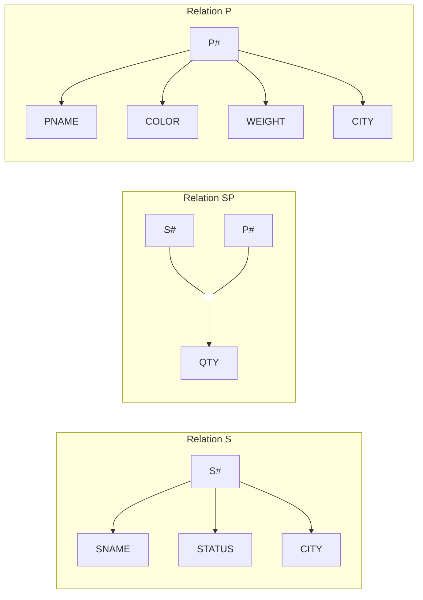

---
tags:
  - database
  - functional-dependencies
  - normalization
  - lecture-5
created: 2026-07-07
updated: 2026-07-07
lecture: 5
type: lecture
---

# Lecture 5: Functional Dependencies (ความขึ้นต่อกันเชิงฟังก์ชัน)

> [!SUMMARY] ภาพรวมบทเรียน
> บทเรียนนี้ปูพื้นฐานเรื่อง Functional Dependencies (FDs) หรือ "ความขึ้นต่อกันเชิงฟังก์ชัน" ซึ่งเป็นรากฐานคณิตศาสตร์ที่สำคัญที่สุดก่อนจะก้าวเข้าสู่เรื่อง Normalization โดยเนื้อหาจะถูกถอดรหัสอย่างละเอียดทุกหน้าสไลด์ (Slide 1-13) อธิบายกฎของ Armstrong's axioms ทั้ง 8 ข้อ พร้อมตาราง Trace และตัวอย่างการพิสูจน์สมการทีละบรรทัด

---

## 🗣️ Slide 1: Functional Dependencies
**ความขึ้นต่อกันเชิงฟังก์ชัน**

Functional Dependencies (FDs) คือเครื่องมือทางคณิตศาสตร์ที่ใช้สำหรับวิเคราะห์หา "ความสัมพันธ์" ระหว่างคอลัมน์ (Attributes) ภายในตารางเดียวกัน เพื่อตรวจสอบว่าข้อมูลคอลัมน์หนึ่ง สามารถใช้ "ระบุ" ข้อมูลอีกคอลัมน์หนึ่งได้แบบเป๊ะๆ หรือไม่ ซึ่งทฤษฎีนี้ถูกใช้เป็นกฎเกณฑ์หลักในการออกแบบฐานข้อมูลให้ไร้ความซ้ำซ้อน

---

## 🔤 Slide 2: FD Basic Definitions
**นิยามพื้นฐานของ FD**

> [!DEFINITION] นิยามทางคณิตศาสตร์ของ FD
> ให้ $R$ เป็นตาราง (Relation) และให้ $X$ กับ $Y$ เป็นซับเซตของคอลัมน์ (Attributes) ในตาราง $R$
> เราจะกล่าวว่า **"Y ขึ้นอยู่กับ X เชิงฟังก์ชัน (Y is functionally dependent on X)"** ก็ต่อเมื่อ:
> - ค่าของข้อมูล $X$ แต่ละค่าในตาราง $R$ จะต้องเชื่อมโยงกับค่าของ $Y$ ได้เพียง **"ค่าเดียวเท่านั้น (precisely one Y value)"** เสมอ

**อธิบายให้เข้าใจง่าย:** 
ถ้าเรารู้ค่าของ $X$ เราจะต้องเดาค่าของ $Y$ ได้ถูกต้องเป๊ะๆ 100% โดยไม่มีทางเป็นค่าอื่นไปได้เลย (เช่น ถ้ารู้รหัสบัตรประชาชน $X$ เราย่อมรู้ชื่อของคนนั้น $Y$ ได้แบบฟันธง เป็นต้น)

---

## 🧮 Slide 3: FD Basic Definitions (cont.)
**สัญลักษณ์และคำศัพท์**

- **Symbol (สัญลักษณ์):** $X \rightarrow Y$
- **คำอ่าน:**
  - "X functionally determine Y" (X กำหนด Y เชิงฟังก์ชัน)
  - หรืออ่านสั้นๆ ว่า "X arrow Y"
- **คำศัพท์เชิงเทคนิค:**
  - **X คือ Determinant (ตัวกำหนด):** ฝั่งซ้ายของลูกศร คือตัวตั้งต้นที่เป็นคนกำหนดคนอื่น
  - **Y คือ Dependent (ตัวถูกกำหนด):** ฝั่งขวาของลูกศร คือตัวตามที่ชีวิตขึ้นอยู่กับฝั่งซ้าย
  - **$\rightarrow$ (ลูกศร):** หมายถึง "is functionally determine" (เป็นตัวกำหนดเชิงฟังก์ชัน)

---

## 📊 Slide 4: FD Basic Definitions (cont.) - Example
**ตัวอย่างการวิเคราะห์ FD จากตารางจริง**

> [!EXAMPLE] Trace Table: การวิเคราะห์สมการ $S\# \rightarrow CITY$
> 
> **ตารางแสดงข้อมูล (Relation)**
> 
> | S# | CITY | P# | QTY |
> |---|---|---|---|
> | S1 | London | P1 | 100 |
> | S1 | London | P2 | 100 |
> | S2 | Paris | P1 | 200 |
> | S2 | Paris | P2 | 200 |
> | S3 | Paris | P2 | 300 |
> | S4 | London | P2 | 400 |
> | S4 | London | P4 | 400 |
> | S4 | London | P5 | 400 |
> 
> **การวิเคราะห์สมการ:** `{S#} -> {CITY}` หรือ `S# -> CITY`
> 1. ลองเช็ค $S\# = \text{S1}$ จะเห็นว่า CITY ชี้ไปที่ "London" เสมอ (เดาได้ 100%)
> 2. ลองเช็ค $S\# = \text{S2}$ จะเห็นว่า CITY ชี้ไปที่ "Paris" เสมอ (เดาได้ 100%)
> 3. ลองเช็ค $S\# = \text{S3}$ จะเห็นว่า CITY ชี้ไปที่ "Paris" เสมอ (เดาได้ 100%)
> 4. ลองเช็ค $S\# = \text{S4}$ จะเห็นว่า CITY ชี้ไปที่ "London" เสมอ (เดาได้ 100%)
> **บทสรุป:** เมื่อ $X$ หนึ่งค่า นำไปสู่ $Y$ เพียงค่าเดียวเสมอ ถือว่าสมการนี้ **เป็นจริง (True)**

---

## 🔍 Slide 5: FD Basic Definitions (cont.) - Other FDs
**สมการ FD อื่นๆ ที่สามารถเกิดได้จากตารางเดียวกัน**

หากเราวิเคราะห์ตารางจากสไลด์ 4 ให้ลึกขึ้น เราจะพบความสัมพันธ์อื่นๆ (Other FDs) ดังนี้:

> [!INFO] การประกอบร่างคอลัมน์ (Composite Determinant)
> ในบางครั้ง คอลัมน์เดียวอาจไม่พอระบุค่า (เช่น ถ้ารู้แค่ `P# = P2` เราบอกไม่ได้ว่า QTY เป็น 100, 200, 300 หรือ 400 เพราะค่ามันแกว่ง) เราจึงต้องใช้ **"หลายคอลัมน์รวมกัน"** เป็นตัวกำหนด (Determinant) ฝั่งซ้าย

**ตัวอย่างสมการอื่นๆ ที่เป็นจริง:**
- `{S#, P#} -> {QTY}` (ถ้ารู้รหัสซัพพลายเออร์และรหัสสินค้า จะรู้จำนวนชิ้นเป๊ะๆ)
- `{S#, P#} -> {CITY}` (ถ้ารู้ทั้งคู่ ก็ระบุเมืองได้)
- `{S#, P#} -> {CITY, QTY}` (ฝั่งขวาสามารถมีหลายคอลัมน์ได้)
- `{S#, P#} -> {S#}` (กฎธรรมดา: ถ้ารู้ $S\#$ ย่อมรู้ $S\#$ อยู่แล้ว)
- `{S#, P#} -> {S#, P#, CITY, QTY}` (ถ้ารู้ซ้าย จะรู้หมดทั้งตาราง)
- `{S#} -> {QTY}` **(สมการนี้เป็นเท็จ!)** เพราะถ้ารู้ `S# = S4` จะเห็นว่า QTY มีค่า 400 ซ้ำกันหมด (บังเอิญเป็นจริงในตารางนี้ แต่อาจเป็นเท็จได้) 
- `{QTY} -> {S#}` **(สมการนี้เป็นเท็จ!)** เพราะถ้ารู้ `QTY = 100` มีทั้งรหัส P1 และ P2 ตอบไม่ได้ว่าคือรหัสอะไร

---

## 📦 Slide 6: Closure of a set of dependencies
**การหาคลอเชอร์ (Closure) ของกลุ่มความสัมพันธ์**

> [!DEFINITION] Closure of FD (FD+)
> คลอเชอร์ (Closure) หรือเซตการปิด คือ **"กลุ่มของความสัมพันธ์ทั้งหมดที่เป็นไปได้"** ที่ถูกสรุปอนุมาน (Implies) งอกเงยออกมาจากกลุ่มสมการ FD ตั้งต้นที่เรามี 
> สัญลักษณ์ที่ใช้คือ $FD^+$ (เอฟดีบวก)

**ตัวอย่างการงอกเงยของสมการ:**
- สมมติเรามีสมการตั้งต้นแบบง่ายๆ: `{S#, P#} -> {CITY, QTY}`
- คอมพิวเตอร์สามารถอนุมาน (Implies to) สมการลูกๆ แตกแขนงออกมาได้ทันทีโดยไม่ต้องดูตารางจริง เช่น:
  - `{S#, P#} -> CITY`
  - `{S#, P#} -> QTY`

---

## 🧮 Slide 7: Closure of a set of dependencies (cont.)
**ตัวอย่างการหา FD+ อย่างเต็มรูปแบบ**

> [!EXAMPLE] Trace: การสร้างคลอเชอร์
> สมมติตาราง $R(A, B, C, D, E, F)$ และเรามีสมการตั้งต้น (FD) แค่ 5 ตัว:
> 1. $A \rightarrow B$
> 2. $A \rightarrow C$
> 3. $CD \rightarrow E$
> 4. $CD \rightarrow F$
> 5. $B \rightarrow E$
> 
> **ผลลัพธ์ $FD^+$ (สิ่งที่อนุมานได้เพิ่มขึ้น):**
> เราสามารถสร้างสมการใหม่ๆ ได้อีกเพียบ เช่น:
> - $A \rightarrow E$ (เพราะ $A \rightarrow B$ และ $B \rightarrow E$)
> - $A \rightarrow BC$ (เพราะ $A \rightarrow B$ และ $A \rightarrow C$)
> - $CD \rightarrow EF$ (เพราะ $CD$ ชี้ไปทั้ง $E$ และ $F$)

---

## 📜 Slide 8: Closure of a set of dependencies (cont.)
**อัลกอริทึมในการคำนวณ FD+ (Armstrong's Axioms)**

การที่คอมพิวเตอร์จะคำนวณหา $FD^+$ จาก FD ธรรมดาได้นั้น จำเป็นต้องมีกระบวนการคิด (Algorithm) ที่เป็นระบบ 
เราเรียกกฎเหล็กการอนุมานนี้ว่า **"สัจพจน์ของอาร์มสตรอง (Armstrong’s axioms)"** ซึ่งเป็นกฎทางคณิตศาสตร์ที่พิสูจน์แล้วว่าเป็นจริงเสมอ และครอบคลุมการอนุมานทุกรูปแบบ

*(หมายเหตุ: ให้ A, B, และ C เป็นซับเซตของคอลัมน์ในตาราง R และการเขียน AB ติดกันหมายถึงการทำ Union รวมคอลัมน์ของ A และ B เข้าด้วยกัน)*

---

## 📐 Slide 9: Closure of a set of dependencies (cont.)
**กฎของ Armstrong (3 กฎพื้นฐาน)**

สัจพจน์ของอาร์มสตรองมีกฎพื้นฐาน (Fundamental rules) อยู่ 3 ข้อหลัก:

1. **Reflexivity (กฎการสะท้อน):** กฎแห่งความจริงแท้
   - ถ้ายอมรับว่า $B$ เป็นซับเซต (สับเซต) ของ $A$ 
   - **ดังนั้น:** $A \rightarrow B$ จะเป็นจริงเสมอ (ตัวใหญ่ย่อมบอกค่าตัวเล็กในตัวมันเองได้)
2. **Augmentation (กฎการต่อเติม):**
   - ถ้าสมการ $A \rightarrow B$ เป็นจริง
   - **ดังนั้น:** ถ้าเราเอาคอลัมน์ $C$ ไปแปะเพิ่มทั้งสองฝั่ง สมการ $AC \rightarrow BC$ ก็จะยังคงเป็นจริง
3. **Transitivity (กฎการถ่ายทอด):**
   - ถ้าสมการ $A \rightarrow B$ เป็นจริง และ $B \rightarrow C$ ก็เป็นจริง
   - **ดังนั้น:** เราสามารถข้ามขั้นสรุปได้เลยว่า $A \rightarrow C$ เป็นจริง

---

## 🛠️ Slide 10: Closure of a set of dependencies (cont.)
**กฎของ Armstrong (4 กฎต่อยอด)**

จากกฎ 3 ข้อด้านบน เราสามารถนำมาผสมกันเพื่อคลอดกฎใหม่ (Derived rules) เพื่อให้เอาไปใช้งานได้รวดเร็วขึ้นอีก 4 ข้อ:

4. **Self-determination (กฎระบุตัวเอง):**
   - $A \rightarrow A$ (ตัวเราย่อมระบุตัวเราเองได้เสมอ)
5. **Decomposition (กฎการแตกตัว):**
   - ถ้า $A \rightarrow BC$ เป็นจริง (ชี้เป้าตัวใหญ่ได้)
   - **ดังนั้น:** เราสามารถแตกเป็น 2 สมการย่อยได้คือ $A \rightarrow B$ และ $A \rightarrow C$
6. **Union (กฎการรวมตัว):** (ตรงข้ามกับกฎข้อ 5)
   - ถ้า $A \rightarrow B$ และ $A \rightarrow C$
   - **ดังนั้น:** จับมันมัดรวมกันได้เลยเป็น $A \rightarrow BC$
7. **Composition (กฎการประกอบร่าง):**
   - ถ้า $A \rightarrow B$ และ $C \rightarrow D$
   - **ดังนั้น:** เอาซ้ายชนซ้าย ขวาชนขวา จะได้ $AC \rightarrow BD$

---

## 🏆 Slide 11: Closure of a set of dependencies (cont.)
**ทฤษฎีบทการรวมตัวขั้นสูง (General Unification Theorem)**

- นักคณิตศาสตร์ชื่อ Darwen ได้พิสูจน์กฎข้อที่ 8 เพิ่มเติมจากอาร์มสตรอง ซึ่งเป็นท่าไม้ตายขั้นสุดยอด
8. **General Unification Theorem:**
   - ถ้า $A \rightarrow B$ และ $C \rightarrow D$
   - **ดังนั้น:** $A \cup (C - B) \rightarrow BD$ 
   - *(หมายเหตุ: สัญลักษณ์ $\cup$ คือ Union รวมสมาชิก และ $-$ คือ Set difference ลบสมาชิก)*

---

## 🧠 Slide 12: Closure of a set of dependencies (cont.)
**ตัวอย่างการพิสูจน์กฎ (Proof using Rules)**

> [!EXAMPLE] Trace: การพิสูจน์สมการทีละบรรทัด
> **โจทย์:** ให้ตาราง $R(A,B,C,G,H,I)$
> **FD ตั้งต้น:** $\{ A \rightarrow B, A \rightarrow C, CG \rightarrow H, CG \rightarrow I, B \rightarrow H \}$
>
> **การใช้กฎอนุมานหา $FD^+$ ทีละขั้นตอน:**
> 1. $A \rightarrow B$ (ได้มาจาก FD ตั้งต้น)
> 2. $A \rightarrow C$ (ได้มาจาก FD ตั้งต้น)
> 3. $A \rightarrow BC$ (เอากฎข้อ 1 และ 2 มารวมกันด้วยกฎ **Union**)
> 4. $AG \rightarrow CG$ (เอากฎข้อ 2 มาต่อเติมคอลัมน์ G ทั้งสองฝั่งด้วยกฎ **Augmentation**)
> 5. $CG \rightarrow H$ (ได้มาจาก FD ตั้งต้น)
> 6. $CG \rightarrow I$ (ได้มาจาก FD ตั้งต้น)
> 7. $CG \rightarrow HI$ (เอากฎข้อ 5 และ 6 มารวมกันด้วยกฎ **Union**)
> 8. $AG \rightarrow HI$ (เอากฎข้อ 4 และ 7 มาใช้กฎ **Transitive** ถ่ายทอด)
> 9. $AG \rightarrow BG$ (เอากฎข้อ 1 มาต่อเติม G ทั้งสองฝั่งด้วย **Augmentation**)
> 10. $AG \rightarrow A$ (ความจริงแท้ **Reflexivity**)
> 11. $AG \rightarrow ABCGHI$ (เอากฎข้อ 4, 8, 9, 10 มารวมกันด้วย **Union** สรุปว่า AG คือตัวเทพที่ชี้เป้าได้ทุกคอลัมน์!)
> 12. $B \rightarrow H$ (ได้มาจาก FD ตั้งต้น)

---

## 🕸️ Slide 13: FD Diagram
**แผนภาพความขึ้นต่อกันเชิงฟังก์ชัน**

เราสามารถแปลงสมการ FD ทั้งหมดให้กลายเป็นแผนภาพตรรกะ (Diagram) เพื่อให้เห็นภาพรวมของตารางได้ง่ายขึ้น โดยใช้ลูกศรชี้จาก Determinant ไปหา Dependent

> [!INFO] การอ่านแผนภาพ FD
> - **Relation S:** คอลัมน์ `S#` เพียงตัวเดียว สามารถมีลูกศรชี้ระบุเป้าหมายไปยัง `SNAME`, `STATUS`, และ `CITY` ได้อย่างแม่นยำ
> - **Relation SP:** ต้องใช้คอลัมน์ `S#` และ `P#` ประกอบร่างกัน (มัดรวมกัน) จึงจะมีพลังส่งลูกศรไปชี้ระบุ `QTY` ได้ (ลูกศรรวมพลัง)
> - **Relation P:** คอลัมน์ `P#` เพียงตัวเดียว สามารถระบุ `PNAME`, `COLOR`, `WEIGHT`, และ `CITY` ได้

---

# References
- **Course:** Database System
- **Chapter:** Lecture 5 - Functional Dependencies
- **Slides:** 13 slides (Fully Expanded and Ungrouped)
- **Related Notes:** [[Lecture 6 - Database Design and Normalization]] (หัวข้อถัดไปที่จะนำเรื่อง FD ไปใช้งานจริง)

---
*Last updated: 2026-07-07*
