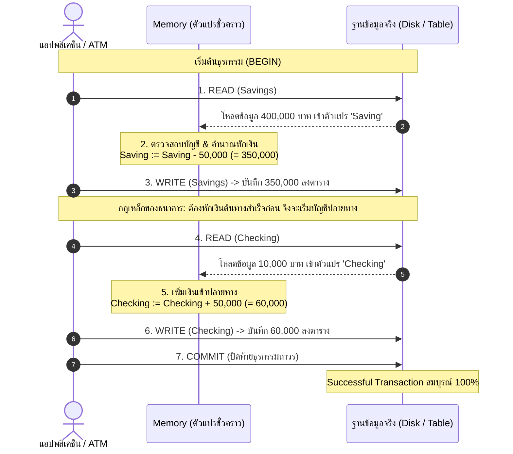
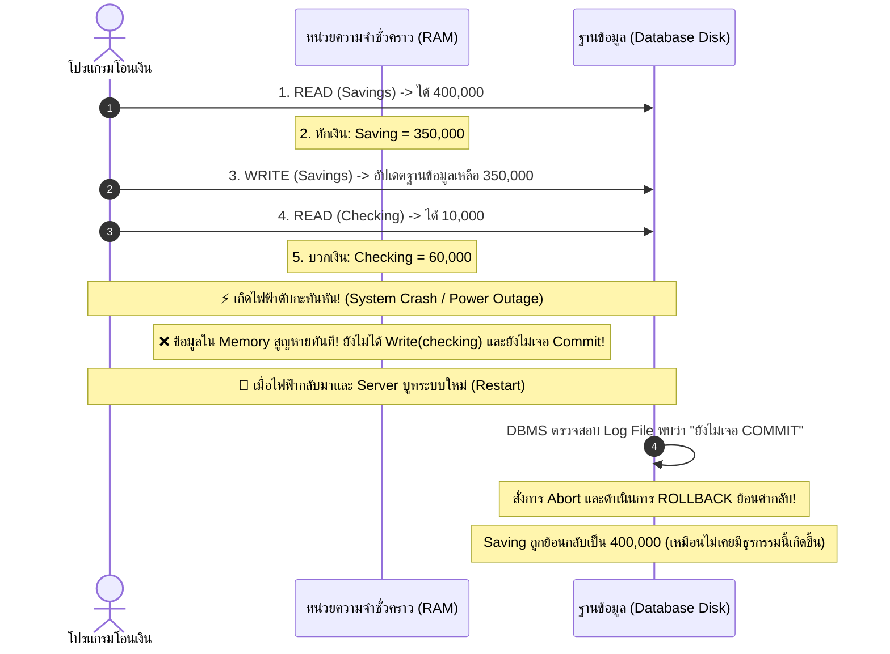
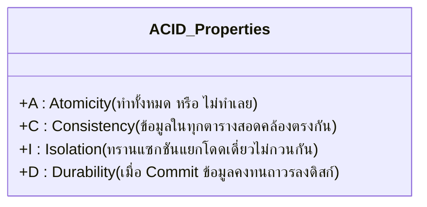
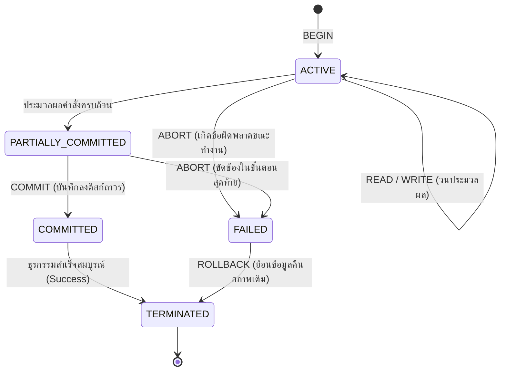
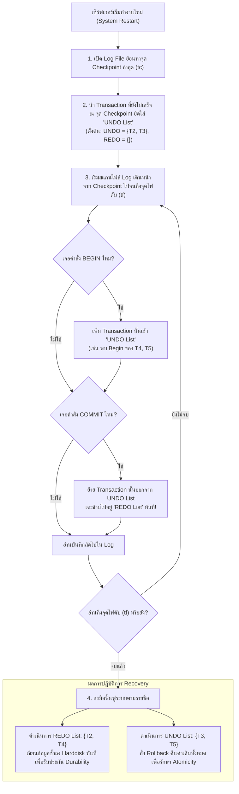
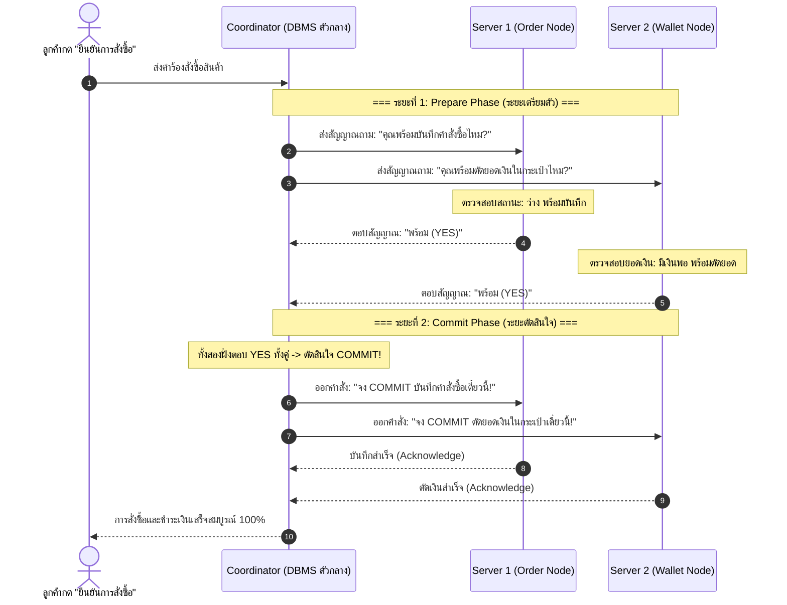
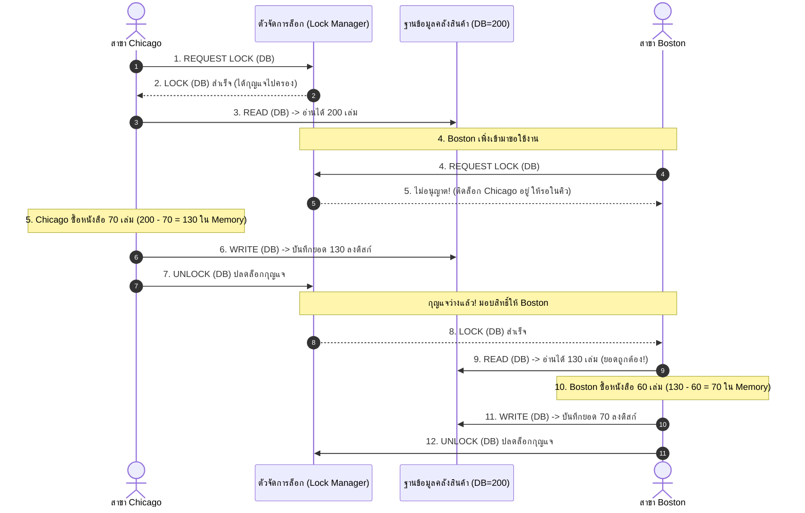
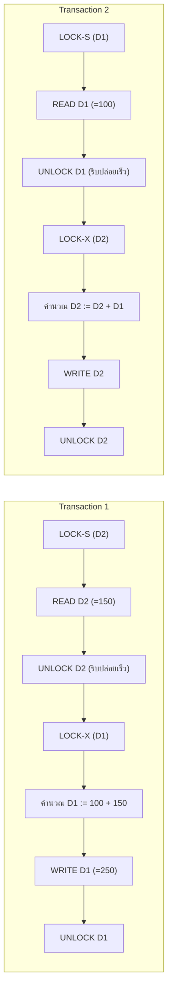
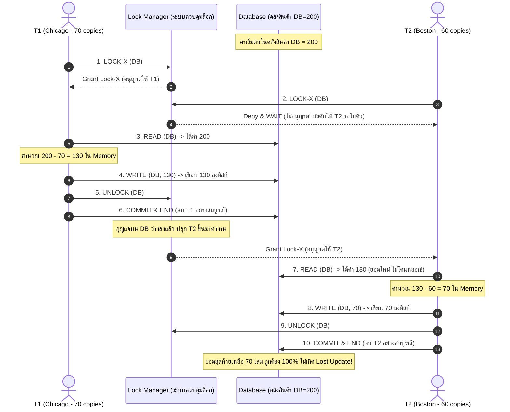

---
tags:
  - database
  - transaction
  - recovery
  - concurrency
  - acid
  - locking
  - two-phase-commit
  - lecture-8
created: 2026-07-07
updated: 2026-09-08
lecture: 8
type: lecture
---

# Lecture 8: Database System Architecture (Transaction, Recovery and Concurrency Control)

> [!SUMMARY] ภาพรวมและสาระสำคัญของบทเรียน (Overview)
> บทเรียนนี้เจาะลึกสถาปัตยกรรมภายในของระบบจัดการฐานข้อมูล (DBMS Architecture) โดยเน้น 3 กลไกหลักที่ทำให้ระบบฐานข้อมูลขนาดใหญ่ (เช่น ระบบธนาคารพาณิชย์ หรือระบบ E-Commerce ระดับโลก) มีความน่าเชื่อถือ ถูกต้อง และทำงานได้ต่อเนื่องไม่ล่ม:
> 1. **การจัดการทรานแซกชัน (Transaction Processing):** หน่วยการทำงานที่รวมชุดคำสั่งเข้าด้วยกันตามกฎ **ACID Properties** เพื่อให้มั่นใจว่าการโอนเงินหรือการแก้ไขข้อมูลจะทำอย่างสมบูรณ์แบบ
> 2. **การกู้คืนระบบเมื่อเกิดภัยพิบัติ (Database Recovery):** วิธีการฟื้นสภาพข้อมูลเมื่อระบบไฟดับ (System Failure / Soft Crash) หรือฮาร์ดดิสก์พัง (Media Failure / Hard Crash) ผ่านกลไก **Log File**, **Checkpoint**, และการทำ **UNDO / REDO**
> 3. **การควบคุมภาวะการทำงานพร้อมกัน (Concurrency Control):** การจัดการเมื่อมีผู้ใช้หลายพันคนเข้ามารุมอ่าน-เขียนข้อมูลตัวเดียวกันพร้อมกัน เพื่อกำจัดปัญหา **Lost Update**, **Dirty Read (Uncommitted Dependency)**, และ **Inconsistent Analysis** โดยใช้กลไกการล็อกข้อมูล (**Lock-Based Protocols: Shared Lock & Exclusive Lock**) รวมถึงการยืนยันข้อมูลข้ามเซิร์ฟเวอร์แบบ **Two-Phase Commit (2PC)**

---

## 🏦 Slide 1: Transaction, Recovery and Concurrency Control
**หน้าปกบทเรียน: ทรานแซกชัน การกู้คืนข้อมูล และการควบคุมสภาวะพร้อมกัน**

```mermaid
mindmap
  root((Lecture 8: Database System Architecture))
    Transaction Processing
      ACID Properties
      Successful vs Unsuccessful
      State Transitions (Active, Committed, Failed)
    Database Recovery
      System Failure (Soft Crash) vs Media Failure (Hard Crash)
      Log File (Write-Ahead Logging)
      Checkpoint & UNDO / REDO
      Two-Phase Commit (2PC)
    Concurrency Control
      3 Concurrency Problems (Lost Update, Dirty Read, Inconsistent Analysis)
      Lock-Based Protocols (Exclusive Lock vs Shared Lock)
      Locking Matrix
      Simple Locking Trace
```

> [!INFO] คำอธิบายและบริบทจากผู้สอน (Lecture Insights)
> - **วิวัฒนาการจากอดีตสู่ปัจจุบัน:** ในยุคสมัยก่อนที่ยังไม่มีระบบคอมพิวเตอร์ออนไลน์แบบ Real-time การทำธุรกรรมทางการเงินของธนาคารต้องใช้ "ใบถอนเงิน" ร่วมกับ "ใบฝากเงิน" เพื่อโอนเงินจากบุคคลหนึ่งไปยังอีกบุคคลหนึ่ง ต้องมีการเขียนใบสลิปและดำเนินการทีละขั้นตอน
> - **ในยุคปัจจุบัน:** ระบบคอมพิวเตอร์และเครือข่ายออนไลน์ทำงานตลอด 24 ชั่วโมง การโอนเงินเกิดขึ้นผ่านแอปพลิเคชันหรือตู้ ATM ในระดับเสี้ยววินาที เบื้องหลังความสะดวกสบายนี้คือระบบ DBMS ที่ต้องคอยควบคุมให้คำสั่งย่อยๆ ของการหักเงินและเพิ่มเงินเกิดขึ้นอย่างแม่นยำ ปลอดภัย และไม่ผิดพลาดแม้ในเสี้ยววินาทีนั้นไฟจะดับลง

---

## 🔁 Slide 2: Transaction Concept (Successful)
**แนวคิดของทรานแซกชัน (กรณีทำงานสำเร็จ - Successful Transaction)**

> [!DEFINITION] ทรานแซกชัน (Transaction) คืออะไร?
> **ทรานแซกชัน** คือ "หน่วยเชิงตรรกะของการทำงานของโปรแกรม" (Logical Unit of Program Execution) ที่มัดรวมชุดคำสั่งในการเข้าถึง (Access / Read) และแก้ไขเปลี่ยนแปลง (Update / Write) ข้อมูลในฐานข้อมูลเข้าด้วยกันเป็นก้อนเดียว เพื่อให้ระบบมั่นใจว่าข้อมูลจะถูกเปลี่ยนผ่านจากสถานะที่ถูกต้องหนึ่ง (Consistent State) ไปยังอีกสถานะหนึ่งที่ถูกต้องเสมอ

### กลไกการทำงานระดับลึก (Step-by-Step Execution Mechanism)
ในการเขียนโปรแกรมเพื่อทำธุรกรรม เช่น การโอนเงินจากบัญชีออมทรัพย์ (`Saving Account`) ไปยังบัญชีกระแสรายวัน (`Checking Account`) ระบบจะมีการทำงานดังนี้:


```mermaid
sequenceDiagram
    autonumber
    actor App as แอปพลิเคชัน / ATM
    participant RAM as Memory (ตัวแปรชั่วคราว)
    participant DB as ฐานข้อมูลจริง (Disk / Table)

    Note over App,DB: เริ่มต้นธุรกรรม (BEGIN)
    App->>DB: 1. READ (Savings)
    DB-->>RAM: โหลดข้อมูล 400,000 บาท เข้าตัวแปร 'Saving'
    Note over RAM: 2. ตรวจสอบบัญชี & คำนวณหักเงิน<br/>Saving := Saving - 50,000 (= 350,000)
    App->>DB: 3. WRITE (Savings) -> บันทึก 350,000 ลงตาราง
    
    Note over App,DB: กฎเหล็กของธนาคาร: ต้องหักเงินต้นทางสำเร็จก่อน จึงจะเริ่มบัญชีปลายทาง
    App->>DB: 4. READ (Checking)
    DB-->>RAM: โหลดข้อมูล 10,000 บาท เข้าตัวแปร 'Checking'
    Note over RAM: 5. เพิ่มเงินเข้าปลายทาง<br/>Checking := Checking + 50,000 (= 60,000)
    App->>DB: 6. WRITE (Checking) -> บันทึก 60,000 ลงตาราง
    
    App->>DB: 7. COMMIT (ปิดท้ายธุรกรรมถาวร)
    Note over DB: Successful Transaction สมบูรณ์ 100%
```

> [!EXAMPLE] Trace Table: จำลองการโอนเงิน 50,000 บาท (กรณีสำเร็จ)
> * **ยอดเงินเริ่มต้นในระบบ:** บัญชี Saving มี **400,000 บาท**, บัญชี Checking มี **10,000 บาท**
> * **เป้าหมาย:** โอนเงินจำนวน **50,000 บาท** จาก Saving ไป Checking
> 
> | ลำดับคำสั่ง | โค้ดคำสั่งในโปรแกรม | ค่าในตัวแปรบน RAM | ข้อมูลในฐานข้อมูล (Database) | คำอธิบายและกลไกตามคำบรรยาย |
> |:---:|---|:---:|:---:|---|
> | 1 | `BEGIN` | - | Saving=400,000<br/>Checking=10,000 | ประกาศเริ่มต้นทรานแซกชัน |
> | 2 | `READ (savings);` | `Saving = 400000` | Saving=400,000 | อ่านข้อมูลขึ้นมาเก็บใน Memory และเป็นการตรวจสอบความมีอยู่จริงของบัญชีไปในตัว |
> | 3 | `savings := savings - 50000;` | `Saving = 350000` | Saving=400,000 | หักยอดเงินโอนออกจากตัวแปรในหน่วยความจำชั่วคราว |
> | 4 | `WRITE (savings);` | `Saving = 350000` | **Saving=350,000** | **กฎของธนาคาร:** ต้องหักยอดเงินและอัปเดตบัญชีต้นทางให้สำเร็จก่อนที่จะแตะต้องบัญชีปลายทาง |
> | 5 | `READ (checking);` | `Checking = 10000` | Checking=10,000 | อ่านข้อมูลบัญชีผู้รับโอนเพื่อตรวจว่ามีบัญชีอยู่จริงและมียอดเท่าใด |
> | 6 | `checking := checking + 50000;` | `Checking = 60000` | Checking=10,000 | เพิ่มยอดเงินในตัวแปรปลายทางใน Memory |
> | 7 | `WRITE (checking);` | `Checking = 60000` | **Checking=60,000** | อัปเดตยอดเงินใหม่ของบัญชีปลายทางลงในฐานข้อมูล |
> | 8 | `COMMIT;` | - | **Saving=350,000<br/>Checking=60,000** | **คำสั่งสำคัญที่สุด:** ปิดท้ายธุรกรรม ยืนยันข้อมูลลงสื่อจัดเก็บถาวร ถือเป็น **Successful Transaction** |

> [!INFO] สาระสำคัญของคำสั่ง `COMMIT` จากผู้สอน
> คำสั่ง `COMMIT` มีความสำคัญอย่างยิ่งยวด เป็นตัวบอกระบบ DBMS ว่า **"ทรานแซกชันนี้ได้ประมวลผลเสร็จสิ้นสมบูรณ์ตามเป้าหมายทั้งหมดแล้ว จะไม่มีคำสั่งอื่นใดตามมาอีก"** เมื่อเจอคำสั่ง Commit ระบบจะรับรองความคงทนถาวรของข้อมูล และถือเป็นธุรกรรมที่สำเร็จสมบูรณ์ (Successful Transaction)

---

## ❌ Slide 3: Transaction Concept (Aborted)
**แนวคิดของทรานแซกชัน (กรณีทำงานล้มเหลว - Unsuccessful Transaction)**

> [!WARNING] ประเภทของทรานแซกชันในความเป็นจริง
> ทรานแซกชันแบ่งออกเป็น 2 ชนิดหลัก:
> 1. **Successful Transaction:** ดำเนินการครบทุกขั้นตอนจนกระทั่งเจอคำสั่ง `COMMIT`
> 2. **Unsuccessful Transaction:** ทำงานไม่สำเร็จเนื่องจากเกิดข้อผิดพลาด เช่น บั๊กของซอฟต์แวร์ อุปกรณ์ขัดข้อง เครือข่ายหลุด หรือไฟฟ้าดับกะทันหัน

### จำลองสถานการณ์ไฟดับ (System Failure during Transfer)
สมมติว่าระบบกำลังทำการโอนเงินเหมือนในสไลด์ 2 แต่เมื่อหักเงินต้นทางไปแล้วและกำลังบวกเงินปลายทางใน Memory เกิด **เหตุไฟฟ้าดับกะทันหัน** (แม้ปกติเซิร์ฟเวอร์ธนาคารจะมีเครื่องสำรองไฟ UPS แต่สมมติว่าเกิดเหตุสุดวิสัยไฟดับจริง) ก่อนที่คำสั่ง `WRITE (checking)` จะได้ทำงาน:


```mermaid
sequenceDiagram
    autonumber
    actor App as โปรแกรมโอนเงิน
    participant RAM as หน่วยความจำชั่วคราว (RAM)
    participant DB as ฐานข้อมูล (Database Disk)

    App->>DB: 1. READ (Savings) -> ได้ 400,000
    Note over RAM: 2. หักเงิน: Saving = 350,000
    App->>DB: 3. WRITE (Savings) -> อัปเดตฐานข้อมูลเหลือ 350,000
    App->>DB: 4. READ (Checking) -> ได้ 10,000
    Note over RAM: 5. บวกเงิน: Checking = 60,000
    
    Note over App,DB: ⚡ เกิดไฟฟ้าดับกะทันหัน! (System Crash / Power Outage)
    Note over RAM: ❌ ข้อมูลใน Memory สูญหายทันที! ยังไม่ได้ Write(checking) และยังไม่เจอ Commit!
    
    Note over App,DB: 🔌 เมื่อไฟฟ้ากลับมาและ Server บูทระบบใหม่ (Restart)
    DB->>DB: DBMS ตรวจสอบ Log File พบว่า "ยังไม่เจอ COMMIT"
    Note over DB: สั่งการ Abort และดำเนินการ ROLLBACK ย้อนค่ากลับ!
    Note over DB: Saving ถูกย้อนกลับเป็น 400,000 (เหมือนไม่เคยมีธุรกรรมนี้เกิดขึ้น)
```

> [!EXAMPLE] Trace Table: ทรานแซกชันที่ล้มเหลวและเกิดการ Rollback
> 
> | ลำดับ | คำสั่งโปรแกรม | ผลบน RAM | ข้อมูลใน Database | คำอธิบายเหตุการณ์ตามคำบรรยายอาจารย์ |
> |:---:|---|:---:|:---:|---|
> | 1 | `BEGIN` | - | Saving=400,000, Checking=10,000 | เริ่มทรานแซกชัน |
> | 2 | `READ (savings);` | `Saving=400000` | Saving=400,000 | โหลดข้อมูลขึ้นมา |
> | 3 | `savings := savings - 50000;` | `Saving=350000` | Saving=400,000 | คำนวณหักเงิน |
> | 4 | `WRITE (savings);` | `Saving=350000` | **Saving=350,000** | หักเงินต้นทางลงดิสก์แล้ว |
> | 5 | `READ (checking);` | `Checking=10000` | Checking=10,000 | อ่านปลายทาง |
> | 6 | `checking := checking + 50000;` | `Checking=60000` | Checking=10,000 | บวกเงินใน RAM เรียบร้อย |
> | 💥 | **-- ไฟฟ้าดับกะทันหัน --** | **สูญหายทั้งหมด** | Saving=350,000, Checking=10,000 | คำสั่ง Write checking และ Commit ยังไม่เกิดขึ้น! |
> | 🔄 | **Server รีสตาร์ต & กู้คืน** | - | **ROLLBACK** | DBMS สแกนพบว่าทรานแซกชันนี้ค้างเติ่ง **ไม่มี Commit** |
> | 🏁 | **ผลลัพธ์สุดท้ายหลังกู้คืน** | - | **Saving=400,000<br/>Checking=10,000** | **Rollback สมบูรณ์:** ข้อมูลถูกย้อนกลับสู่สภาพเดิมก่อนเริ่ม Begin เงินไม่สูญหาย! |

> [!SUMMARY] หลักการสำคัญของการ Rollback จากผู้สอน
> เมื่อเซิร์ฟเวอร์กลับมาทำงาน (Power Restored) ตัวจัดการฐานข้อมูล (DBMS) จะตรวจสอบทันทีว่าทรานแซกชันนี้ทำงานเสร็จสมบูรณ์หรือยัง โดยการตรวจสอบหาคำสั่ง `COMMIT` ในไฟล์ประวัติ (Log File) หาก **ไม่พบคำสั่ง Commit** แสดงว่าเกิดความผิดพลาดกลางคัน ระบบจะทำการ **Abort** และสั่ง **Rollback** ทันที ซึ่งหมายถึง **"การย้อนกลับข้อมูลทั้งหมดเสมือนว่าไม่เคยมีทรานแซกชันนี้เกิดขึ้นมาก่อนเลย"** เงินในบัญชี Saving จะถูกนำกลับคืนมาเป็น 400,000 บาทเท่าเดิม ผู้รับก็ยังไม่ได้เงิน เพื่อป้องกันปัญหาเงินหายสาบสูญ

---

## 🛡️ Slide 4: Transaction Properties (ACID)
**คุณสมบัติ 4 ประการของทรานแซกชัน (ACID Properties)**

> [!DEFINITION] ACID Properties
> คุณสมบัติพื้นฐาน 4 ประการที่ฐานข้อมูลเชิงสัมพันธ์ (Relational Database Management System - RDBMS) ต้องมี เพื่อรับประกันว่าการประมวลผลข้อมูลจะมีความถูกต้อง สมบูรณ์ และมีเสถียรภาพสูงสุด *(หมายเหตุ: ฐานข้อมูลชนิดอื่นที่ไม่ใช่ RDBMS เช่น NoSQL บางประเภท อาจไม่มีคุณสมบัติ ACID ครบทั้ง 4 ข้อ)*


```mermaid
classDiagram
    class ACID_Properties {
        +A : Atomicity (ทำทั้งหมด หรือ ไม่ทำเลย)
        +C : Consistency (ข้อมูลในทุกตารางสอดคล้องตรงกัน)
        +I : Isolation (ทรานแซกชันแยกโดดเดี่ยวไม่กวนกัน)
        +D : Durability (เมื่อ Commit ข้อมูลคงทนถาวรลงดิสก์)
    }
```

### 1. Atomicity (ความเป็นเอกภาพ / ปรมาณูที่แบ่งแยกไม่ได้)
- **หลักการ (All or Nothing):** ทรานแซกชันต้องปฏิบัติตามกฎ "ทำคือทำทั้งหมด ถ้าไม่ทำคือไม่ทำเลย ไม่มีการทำครึ่งๆ กลางๆ"
  - **กรณีสำเร็จ (Successful Transaction):** ต้องดำเนินการทุกคำสั่งย่อยจนกระทั่งถึงคำสั่ง `COMMIT`
  - **กรณีล้มเหลว (Unsuccessful Transaction):** หากเกิดข้อผิดพลาดแม้แต่จุดเดียว ระบบต้อง `ROLLBACK` ทุกคำสั่งย้อนกลับไปก่อนจุด `BEGIN` เสมือนไม่เคยมีคำสั่งใดถูกรันมาก่อน

### 2. Consistency (ความสอดคล้องถูกต้องของข้อมูลทั้งระบบ)
- **หลักการ:** เมื่อเกิดการอัปเดต เปลี่ยนแปลง หรือแก้ไขข้อมูลใดๆ ข้อมูลใน **ทุกๆ ตารางฐานข้อมูล (Database Tables) ที่เกี่ยวข้องกับทรานแซกชันนั้น จะต้องสอดคล้องตรงกันทั้งหมด**
- **ตัวอย่างระดับลึกตามคำบรรยายอาจารย์ (การถอนเงินที่ตู้ ATM):**
  เวลาที่เราเดินไปทำรายการถอนเงินที่ตู้ ATM ระบบไม่ได้แก้แค่ยอดเงินในสมุดบัญชีเราเพียงอย่างเดียว แต่ DBMS จะต้องทำการบันทึกข้อมูลที่สอดคล้องกันลงในตารางต่างๆ ถึง **4 ตาราง** ดังนี้:
  1. **ตารางบัญชีเงินฝากลูกค้า (Customer Account Table):** ต้องหักลดยอดเงินคงเหลือตามจำนวนที่ลูกค้าถอนจริง
  2. **ตารางบัญชีรายจ่ายธนาคาร (Bank Disbursement / Expense Table):** บันทึกยอดเงินจ่ายออกที่ตรงกัน เพราะทางบัญชีถือว่าเงินฝากคือหนี้ที่ธนาคารต้องคืนให้ลูกค้า เมื่อลูกค้าถอน ธนาคารต้องบันทึกรายจ่ายคืนหนี้ด้วยยอดเงินที่ตรงกันเป๊ะ
  3. **ตารางตู้ ATM (ATM Machine Inventory Table):** บันทึกว่าการถอนนี้เกิดขึ้นที่ตู้ใด และเงินสดที่บรรจุอยู่ในตู้นั้นลดลงเหลือเท่าใด เพื่อให้ระบบบริหารจัดการเงินสดรู้ว่าตู้เงินหมดหรือยัง
  4. **ตารางประวัติธุรกรรม (Audit Log File Table):** บันทึกรายละเอียดการทำรายการ เช่น วัน เวลา หมายเลขบัตร รหัสตู้ และจำนวนเงิน เพื่อใช้เป็นหลักฐานการตรวจสอบย้อนหลัง
  *ข้อมูลยอดเงินในทั้ง 4 ส่วนนี้จะต้องมีความสอดคล้องตรงกัน 100% จึงจะเรียกว่ามีความคงเส้นคงวา (Consistency)*

### 3. Isolation (ความโดดเดี่ยวตัดขาดจากกัน)
- **หลักการ:** แม้ว่าผู้ใช้ทุกคนทั่วทั้งประเทศจะเข้าถึงตารางฐานข้อมูลเดียวกันผ่านระบบเครือข่าย แต่ละทรานแซกชันที่ทำงานพร้อมๆ กัน (Concurrent Transactions) จะต้องไม่มีความเกี่ยวข้องกัน และ **ต้องไม่มีผลกระทบซึ่งกันและกันในการทำงาน**
- **ตัวอย่างจากคำบรรยายอาจารย์:** ในขณะที่เรากำลังกดเงิน 1,000 บาทที่ตู้ ATM ใต้อาคารเรียน และมีผู้ใช้อีกคนที่จังหวัดเชียงใหม่กำลังกดเงิน 5,000 บาทพร้อมกันผ่านระบบเครือข่ายเดียวของธนาคาร ทรานแซกชันของเรากับเขาย่อมไม่มีผลกระทบต่อกัน เรากด 1,000 บาทเราต้องได้เงิน 1,000 บาท ยอดเงินของเราต้องไม่ไปปะปนกับ 5,000 บาทของคนที่เชียงใหม่เด็ดขาด

### 4. Durability (ความคงทนถาวร)
- **หลักการ:** คุณสมบัตินี้จะเกิดขึ้น **เฉพาะกับทรานแซกชันที่ทำงานเสร็จสิ้นสมบูรณ์แล้วเท่านั้น** (นั่นคือ ทรานแซกชันที่ผ่านคำสั่ง `COMMIT` เรียบร้อยแล้ว)
- **กลไก:** ข้อมูลที่ยืนยันแล้วจะต้องถูกบันทึกไว้อย่าง **"คงที่และถาวร" ลงในสื่อบันทึกข้อมูลที่ไม่สูญหาย (Non-volatile Storage เช่น ฮาร์ดดิสก์ หรือ SSD)** แม้ว่าหลังจากนั้นอีกเพียง 1 เสี้ยววินาทีจะเกิดไฟดับทั้งระบบ ข้อมูลที่คอมมิตแล้วก็จะต้องไม่สูญหายไปไหนอย่างเด็ดขาด

---

## 🚥 Slide 5: Transaction States
**สถานะการทำงานของทรานแซกชัน (State Transitions)**

ในวงจรชีวิตของ 1 ทรานแซกชัน จะมีการเปลี่ยนผ่านสถานะ (State Transitions) ตามลำดับดังนี้:
1. **Active State (สถานะกำลังทำงาน):** สถานะปกติเริ่มต้นเมื่อมีคำสั่ง `BEGIN` โปรแกรมจะวนอ่าน (`READ`) และเขียน (`WRITE`) ข้อมูลทีละคำสั่งในสถานะนี้
2. **Partially Committed State (สถานะกึ่งยืนยัน / คอมมิตบางส่วน):** เกิดขึ้นเมื่อคำสั่งสุดท้ายของทรานแซกชันประมวลผลเสร็จสิ้น (END of operations) ได้ผลลัพธ์ครบแล้ว แต่ **ยังไม่ได้ยืนยันลงดิสก์ถาวร** กำลังรอขั้นตอนการ Commit ขั้นสุดท้าย
3. **Committed State (สถานะยืนยันสมบูรณ์):** เกิดขึ้นเมื่อมีคำสั่ง `COMMIT` ข้อมูลทั้งหมดถูกยืนยันความถูกต้องและบันทึกถาวรลงสื่อจัดเก็บ
4. **Failed State (สถานะล้มเหลว):** เกิดขึ้นเมื่อมีเหตุขัดข้อง ไม่สามารถดำเนินการต่อได้ ไม่ว่าจะเกิดข้อผิดพลาดขึ้นในระหว่าง `Active State` หรือในระหว่าง `Partially Committed State` ก็ตาม ระบบจะสั่ง `ABORT`
5. **Terminated State (สถานะสิ้นสุดการทำงาน):** จุดจบของทรานแซกชัน ไม่ว่าจะจบแบบสำเร็จ (จาก Committed) หรือจบแบบพัง (ผ่านการ Rollback จาก Failed) ก็ตาม

---

## 🔄 Slide 6: Transaction States (Diagram)
**แผนภาพวงจรชีวิตและตัวอย่างเปรียบเทียบในชีวิตจริง (Real-World Analogies)**


```mermaid
stateDiagram-v2
    direction TB
    [*] --> ACTIVE : BEGIN
    ACTIVE --> ACTIVE : READ / WRITE (วนประมวลผล)
    ACTIVE --> PARTIALLY_COMMITTED : ประมวลผลคำสั่งครบถ้วน
    
    PARTIALLY_COMMITTED --> COMMITTED : COMMIT (บันทึกลงดิสก์ถาวร)
    COMMITTED --> TERMINATED : ธุรกรรมสำเร็จสมบูรณ์ (Success)
    
    ACTIVE --> FAILED : ABORT (เกิดข้อผิดพลาดขณะทำงาน)
    PARTIALLY_COMMITTED --> FAILED : ABORT (ขัดข้องในขั้นตอนสุดท้าย)
    
    FAILED --> TERMINATED : ROLLBACK (ย้อนข้อมูลคืนสภาพเดิม)
    TERMINATED --> [*]
```

### 🛒 ตัวอย่างเปรียบเทียบที่ 1: การซื้อของที่แคชเชียร์ในซูเปอร์มาร์เก็ต (จากคำบรรยายของอาจารย์)
อาจารย์ได้เปรียบเทียบขั้นตอนของทรานแซกชันกับการช้อปปิ้งในห้างสรรพสินค้าได้อย่างเห็นภาพชัดเจน:
1. **BEGIN State:** ลูกค้าเข็นรถเข็นที่มีสินค้าเต็มคันมาถึงแคชเชียร์ พนักงานแคชเชียร์เริ่มถามเบอร์โทรศัพท์เพื่อค้นหาข้อมูลสมาชิก
2. **ACTIVE State:** พนักงานแคชเชียร์ทำการยิงเครื่องอ่านบาร์โค้ด (Barcode Scanner) อ่านสินค้าในรถเข็นทีละชิ้นๆ การวนอ่านสินค้าและคำนวณราคาทีละรายการนี้คือสถานะ `Active State`
3. **PARTIALLY COMMITTED State:** แคชเชียร์ยิงบาร์โค้ดจนหมดตะกร้าเรียบร้อย หน้าจอปรากฏยอดเงินรวมที่ต้องชำระ (เช่น 1,500 บาท) ขั้นนี้คือ `Partially Committed State` คือคิดยอดสรุปเสร็จหมดแล้ว แต่ยังไม่ Commit เพราะยังต้อง **"รอให้ลูกค้าจ่ายเงินก่อน"**
4. **COMMITTED State:** ลูกค้าชำระเงินสดหรือแตะบัตรเครดิตสำเร็จ มีการตัดยอดสต็อกสินค้าในคลัง บันทึกคะแนนสะสมสมาชิก ออกใบเสร็จรับเงิน เรียกว่า `Committed State` จากนั้นปิดรอบบิลและเข้าสู่ `Terminated State` โดยอัตโนมัติ

> [!WARNING] กรณีเกิดการยกเลิกกลางคัน (ABORT & ROLLBACK) ในซูเปอร์มาร์เก็ต
> - **กรณีเกิด Abort ใน Active State:** ขณะที่แคชเชียร์เพิ่งยิงสินค้าไปได้ 2-3 ชิ้น ลูกค้านึกได้ว่าห้างมีโปรโมชั่นซื้อครบยอดแล้วได้คูปองส่วนลดเพิ่ม แต่ตนลืมหยิบสินค้าชิ้นสำคัญมา จึงบอกแคชเชียร์ว่า *"ขอหยุดไว้ก่อน ขอยกเลิกบิลนี้เพื่อไปหยิบของเพิ่ม"* แคชเชียร์หยุดการอ่านข้อมูล เกิดการ **Abort** กระโดดเข้าสู่ `Failed State` สินค้าที่ยิงไป 2-3 ชิ้นจะถูกยกเลิก ไม่มีการตัดสต็อก แล้วเข้าสู่ `Terminated State`
> - **กรณีเกิด Abort ใน Partially Committed State:** แคชเชียร์ยิงของจนหมดรถเข็น สรุปยอดเงินรวมเรียบร้อยแล้ว (Partially Committed) ลูกค้าจะจ่ายเงิน แต่เงินสดไม่พอ จึงส่งบัตรเครดิตให้รูด ปรากฏว่า **เครื่องอ่านบัตรเครดิตเสีย หรือบัตรถูกระงับ** ทำให้ไม่สามารถจ่ายเงินได้ รายการจึงต้องถูกยกเลิก เกิดการ **Abort** พุ่งเข้าสู่ `Failed State` ระบบสั่ง **Rollback** ย้อนกลับข้อมูลทั้งหมด สต็อกไม่ถูกตัด ไม่มีการบันทึกยอดขาย เสมือนไม่เคยเกิดการซื้อขายนี้ขึ้น แล้วเข้าสู่ `Terminated State`

### 💳 ตัวอย่างเปรียบเทียบที่ 2: การถอนเงินสดที่ตู้ ATM
1. **BEGIN State:** สอดบัตร ATM เข้าตู้ และกดรหัส PIN ถูกต้อง
2. **ACTIVE State:** หน้าจอให้เลือกเมนูถอนเงิน และให้เราระบุจำนวนเงินที่ต้องการถอน (เช่น 2,000 บาท)
3. **PARTIALLY COMMITTED State:** กดปุ่มยืนยันจำนวนเงิน ในจังหวะนี้ระบบยังไม่ได้จ่ายเงินสดออกมา แต่กำลังตรวจสอบเบื้องหลัง 2 อย่าง:
   - ตรวจสอบยอดเงินในบัญชีของลูกค้าว่ามีเงินพอให้ถอนหรือไม่
   - ตรวจสอบเงินสดในกล่องบรรจุของตู้ ATM ว่ามีธนบัตรพอจ่ายหรือไม่
4. **COMMITTED State:** เมื่อตรวจสอบผ่านทั้งสองเงื่อนไข ระบบอนุมัติ ตัดยอดเงินในบัญชี สั่งให้ตู้จ่ายธนบัตรออกมา ออกสลิปบันทึก และคืนบัตร $\rightarrow$ จบการทำงาน (`Terminated State`)
5. **FAILED State (Abort):** หากตรวจพบว่ายอดเงินในบัญชีไม่พอ หรือเงินในตู้ ATM หมด ระบบจะยกเลิก (`Abort`) ไม่มีการตัดเงินในบัญชี และคืนบัตรสู่ผู้ใช้ทันที

---

## ⏱️ Slide 7: Recovery (Program Execution)
**ลำดับเวลาการทำงานของโปรแกรมและการเกิดทรานแซกชัน (Execution Timeline)**


```mermaid
gantt
    title การทำงานของชุดทรานแซกชันในระบบ
    dateFormat X
    axisFormat %s
    section Transaction 1
    Begin to Commit (Successful) :active, t1, 0, 5
    section Transaction 2
    Begin to Failure :crit, t2_run, 3, 7
    Rollback & Abort :crit, t2_abort, 7, 9
    section Transaction 3
    Begin to Commit (Concurrent) :active, t3, 3, 6
```

> [!INFO] คำอธิบายลำดับเหตุการณ์จากคำบรรยายอาจารย์
> 1. แต่ละทรานแซกชันเกิดขึ้น ณ เวลาใดๆ ก็ได้ โดยไม่จำเป็นต้องขึ้นต่อกัน (อิสระจากกันตามหลัก Isolation)
> 2. **Transaction 1:** เริ่มต้นก่อน ทำงานทีละคำสั่งไปเรื่อยๆ จนกระทั่งจบด้วยคำสั่ง `COMMIT` $\rightarrow$ เป็นแบบ **Successful Transaction**
> 3. **Transaction 2:** เริ่มต้นหลังจาก $T_1$ เล็กน้อย มีจำนวนคำสั่งหลายคำสั่ง แต่เมื่อทำมาถึงจุดหนึ่ง เกิดเหตุขัดข้องบางประการ ทำให้ทำงานต่อไปไม่ได้ ระบบจึงสั่ง `ROLLBACK` $\rightarrow$ เป็นแบบ **Unsuccessful Transaction**
> 4. **Transaction 3:** เริ่มต้นทำงานพร้อมๆ กับ $T_2$ แต่สามารถทำงานจนเสร็จสิ้นและ `COMMIT` ได้ก่อนที่ $T_2$ จะล้มเหลวเสียอีก

---

## 💥 Slide 8: Recovery (Failures)
**ประเภทของความล้มเหลวของระบบ (System Failure vs Media Failure)**

> [!DEFINITION] เหตุแห่งความล้มเหลว (Failure Types)
> เมื่อระบบเกิดพังทลายลง การกู้คืนข้อมูล (Recovery) จะต้องเข้ามาทำหน้าที่ โดยแบ่งประเภทความเสียหายออกเป็น 2 ระดับ:

| มิติการเปรียบเทียบ | 1. System Failure (ระบบล่ม) | 2. Media Failure (สื่อบันทึกเสียหาย) |
|---|---|---|
| **ชื่อเรียกทางเทคนิค** | **Soft Crash** | **Hard Crash** |
| **สาเหตุหลัก** | ไฟฟ้าดับ, ไฟตก, ระบบปฏิบัติการค้าง, ซอฟต์แวร์ DBMS แครช | หัวอ่านฮาร์ดดิสก์กระแทกจานแม่เหล็ก (Head Crash), แผ่นดิสก์เป็นรอยขูด, วงจรอุปกรณ์จัดเก็บข้อมูลไหม้ |
| **ระดับความร้ายแรง** | ร้ายแรงปานกลาง ข้อมูลในดิสก์ยังปลอดภัย | **ร้ายแรงขั้นวิกฤตที่สุด (Severe & Critical)** |
| **สภาพข้อมูลบนดิสก์** | ข้อมูลบน Harddisk ไม่เสียหาย แต่ข้อมูลที่ค้างอยู่ใน RAM จะสูญหาย | ข้อมูลบนพื้นผิวดิสก์เสียหายถาวร ไม่สามารถอ่านขึ้นมาได้อีกต่อไป |
| **ตัวอย่างความเสียหาย** | เครื่องดับขณะกำลังบันทึกบัญชี | ลูกค้าฝากเงินหลายล้านบาท แต่ข้อมูลในฮาร์ดดิสก์พังจนอ่านไม่ได้ ธนาคารไม่รู้ยอด ลูกค้าก็จำไม่ได้ เกิดข้อพิพาทร้ายแรง |
| **แนวทางการแก้ไข** | ใช้กลไก **System Recovery** โดยอ่านข้อมูลจาก **Log File** และทำ Checkpoint UNDO/REDO | ใช้กลไก **Media Recovery** โดยเปลี่ยนฮาร์ดดิสก์ตัวใหม่ และนำข้อมูลจาก **Backup Server** มาสำเนาทับ |

### 💡 ทำไมต้องบันทึกลง Log File ก่อนบันทึกลง Harddisk? (Deep Dive Rationale)
อาจารย์ได้ตั้งคำถามสำคัญในห้องเรียนว่า: *"ทำไมเวลาเกิดทรานแซกชัน เราไม่เขียนข้อมูลลง Harddisk ไปเลยตรงๆ ทำไมต้องนำข้อมูลไปบันทึกไว้ใน Log File ก่อน?"*

คำตอบเชิงลึกด้านสถาปัตยกรรมคอมพิวเตอร์:
1. **พฤติกรรมการเคลื่อนที่ของหัวอ่านฮาร์ดดิสก์ (Random Disk Head Seek):** ข้อมูลของลูกค้าแต่ละคนในระบบฐานข้อมูลไม่ได้ถูกจัดเก็บอยู่ที่บล็อกเดียวกันบนฮาร์ดดิสก์ หากต้องเขียนลงดิสก์ทันที หัวอ่านฮาร์ดดิสก์จะต้องขยับเคลื่อนย้าย (Seek & Rotate) ไปยังตำแหน่งต่างๆ กระจัดกระจายไปทั่วจานแม่เหล็ก ซึ่งเป็นกระบวนการเชิงกล (Mechanical) ที่ช้ามาก
2. **การเขียนต่อท้ายของ Log File (Sequential Append-Only):** ไฟล์ Log File เป็นตารางพิเศษที่มีลักษณะการเขียนแบบ **"เขียนต่อท้ายไฟล์ตลอดเวลา" (Sequential Write / Append-Only)** หัวอ่านไม่ต้องกระโดดไปมา สามารถจดบันทึกการกระทำลงดิสก์ได้อย่างรวดเร็วกว่าหลายร้อยเท่า
3. **หลักการ Write-Ahead Logging (WAL):** ระบบจะการันตีว่า ทุกความเปลี่ยนแปลงต้องถูกจดลง Log File ให้เสร็จสิ้นก่อน จึงจะปล่อยให้กระบวนการอื่นทำงานต่อไปได้ เมื่อไฟดับ เราจึงสามารถใช้ Log File นี้เป็นหลักฐานอ้างอิงในการฟื้นสภาพข้อมูลได้อย่างแม่นยำ

---

## 📊 Slide 9: System Recovery (Diagram)
**แผนภาพจำลองการกู้คืนระบบผ่านจุด Checkpoint**

```
แกนเวลา (Time) ------------------------------------------------------------>
           จุด Checkpoint (tc)                      เกิด System Failure (tf)
                 |                                             |
  T1: [=====]    |                                             | (จบก่อน tc)
  T2:      [=================]                                 | (เริ่มก่อน tc, จบก่อน tf)
  T3:      [===================================================X (เริ่มก่อน tc, ค้างที่ tf)
  T4:            |         [=============]                     | (เริ่มหลัง tc, จบก่อน tf)
  T5:            |                 [===========================X (เริ่มหลัง tc, ค้างที่ tf)
                 |                                             |
```

> [!INFO] องค์ประกอบสำคัญของแผนภาพ
> - **แกนนอน:** แสดงลำดับเวลาที่เดินหน้าไปเรื่อยๆ
> - **จุด Checkpoint ($t_c$):** คือ "จุดเซฟปลอดภัย" ที่ระบบ DBMS ตั้งเวลาไว้เป็นระยะๆ เมื่อถึงเวลาจุด Checkpoint ระบบจะทำการถ่ายโอน (Flush) ข้อมูลที่อยู่ใน RAM ลงไปเขียนบันทึกลง Harddisk อย่างแท้จริง
> - **จุด System Failure ($t_f$):** จุดที่เกิดเหตุไฟฟ้าดับ ระบบล่ม ข้อมูลใน RAM พังทลายทั้งหมด
> 
> **เมื่อระบบไฟฟ้ากลับมา (Recovery Time):** DBMS จะเปิดดู Log File โดยย้อนกลับไปดูที่ **จุด Checkpoint ล่าสุด ($t_c$) ก่อนเกิดเหตุไฟดับ** แล้วตรวจสอบสถานะของทรานแซกชันทั้ง 5 ตัว:
> - **$T_1$:** จบการทำงานและ Commit ไปเรียบร้อยแล้วตั้งแต่ก่อนถึงจุด $t_c$ ข้อมูลถูกเซฟลง Harddisk แน่นอนแล้ว ปลอดภัย 100%
> - **$T_2$:** เริ่มทำงานก่อน $t_c$ แต่มา Commit หลังจุด $t_c$ (ก่อนเกิดไฟดับ $t_f$)
> - **$T_3$:** เริ่มทำงานก่อน $t_c$ แต่ยังทำงานค้างอยู่จนกระทั่งโดนไฟดับตัดหน้า ไม่พบคำสั่ง Commit
> - **$T_4$:** เริ่มทำงานหลัง $t_c$ และทำเสร็จจน Commit เรียบร้อยก่อนไฟดับ
> - **$T_5$:** เริ่มทำงานหลัง $t_c$ และกำลังทำงานค้างอยู่จนโดนไฟดับตัดหน้า ไม่พบคำสั่ง Commit

---

## 🛠️ Slide 10: System Recovery (UNDO / REDO)
**กลไกการสร้างรายการ UNDO และ REDO หลังระบบฟื้นตัว**

เมื่อระบบเซิร์ฟเวอร์เปิดขึ้นมาใหม่ DBMS จะวิ่งไปอ่านไฟล์ Log File เพื่อตัดสินชะตากรรมของทรานแซกชันตามกฎ 5 ขั้นตอน:


```mermaid
flowchart TD
    Start["เซิร์ฟเวอร์เริ่มทำงานใหม่ (System Restart)"] --> ReadCheckpoint["1. เปิด Log File ย้อนหาจุด Checkpoint ล่าสุด (tc)"]
    ReadCheckpoint --> InitList["2. นำ Transaction ที่ยังไม่เสร็จ ณ จุด Checkpoint ยัดใส่ 'UNDO List'<br/>(ตั้งต้น: UNDO = {T2, T3}, REDO = {})"]
    InitList --> ScanForward["3. เริ่มสแกนไฟล์ Log เดินหน้าจาก Checkpoint ไปจนถึงจุดไฟดับ (tf)"]
    
    ScanForward --> CheckBegin{"เจอคำสั่ง BEGIN ไหม?"}
    CheckBegin -- "ใช่" --> AddUndo["เพิ่ม Transaction นั้นเข้า 'UNDO List'<br/>(เช่น พบ Begin ของ T4, T5)"]
    CheckBegin -- "ไม่ใช่" --> CheckCommit{"เจอคำสั่ง COMMIT ไหม?"}
    
    AddUndo --> CheckCommit
    CheckCommit -- "ใช่" --> MoveToRedo["ย้าย Transaction นั้นออกจาก UNDO List<br/>เตะข้ามไปอยู่ 'REDO List' ทันที!"]
    CheckCommit -- "ไม่ใช่" --> NextRecord["อ่านบันทึกถัดไปใน Log"]
    
    MoveToRedo --> NextRecord
    NextRecord --> EndLog{"อ่านถึงจุดไฟดับ (tf) หรือยัง?"}
    EndLog -- "ยังไม่จบ" --> ScanForward
    EndLog -- "จบแล้ว" --> ExecuteAction["4. ลงมือฟื้นฟูระบบตามรายชื่อ"]

    subgraph Actions["ผลการปฏิบัติการ Recovery"]
        ExecuteAction --> DoRedo["ดำเนินการ REDO List: {T2, T4}<br/>เขียนข้อมูลซ้ำลง Harddisk ทันที เพื่อรับประกัน Durability"]
        ExecuteAction --> DoUndo["ดำเนินการ UNDO List: {T3, T5}<br/>สั่ง Rollback คืนค่าเดิมทั้งหมด เพื่อรักษา Atomicity"]
    end
```

> [!SUMMARY] สรุปชะตากรรมของทรานแซกชันทั้ง 5 ตามคำบรรยายอาจารย์
> 1. **$T_1$ (ไม่ต้องทำอะไร - No Action):** ทำงานเสร็จสมบูรณ์ตั้งแต่ก่อนจุด Checkpoint ข้อมูลถูกถ่ายลง Harddisk อย่างถาวรไปแล้ว
> 2. **$T_2$ (ต้องทำ REDO):** ทรานแซกชันนี้เสร็จสมบูรณ์และมีคำสั่ง `COMMIT` ก่อนไฟดับ แต่เดิมทรานแซกชันนี้กำลังรอรอบ Checkpoint ถัดไปเพื่อถ่ายข้อมูลลงดิสก์แต่ไฟดันดับเสียก่อน เมื่อระบบกู้คืน DBMS ตรวจพบคำสั่ง Commit ใน Log จึงสั่ง **REDO (ทำซ้ำ)** โดยนำข้อมูลไปเขียนลง Harddisk ทันทีโดยไม่ต้องรอรอบเวลา
> 3. **$T_3$ (ต้องทำ UNDO / Rollback):** ทรานแซกชันนี้ไม่มีคำสั่ง `COMMIT` ใน Log ระบบไม่รู้ว่าเหลืออีกกี่คำสั่ง อาจจะเหลือแค่ Commit หรือเหลืออีกหลายคำสั่ง เพื่อรักษากฎเหล็ก **Atomicity (ไม่ทำครึ่งๆ กลางๆ)** ระบบจึงต้องสั่ง **UNDO** ทำการ Rollback คืนสภาพข้อมูลเดิมทั้งหมดเสมือนไม่เคยเกิดทรานแซกชัน $T_3$ ขึ้นมาเลย
> 4. **$T_4$ (ต้องทำ REDO):** มีคำสั่ง `COMMIT` ปรากฏชัดเจนใน Log ก่อนไฟดับ จึงสั่ง **REDO** นำข้อมูลอัปเดตลง Harddisk ทันที
> 5. **$T_5$ (ต้องทำ UNDO / Rollback):** ไม่มีคำสั่ง `COMMIT` ใน Log จึงต้องสั่ง **UNDO** คืนค่าเดิมทั้งหมด

---

## 🤝 Slide 11: Two-Phase Commit
**การยืนยันข้อมูลแบบสองระยะในระบบฐานข้อมูลแบบกระจาย (2PC Concept)**

> [!DEFINITION] Two-Phase Commit (2PC) คืออะไร?
> ในระบบฐานข้อมูลขนาดใหญ่ที่มีเซิร์ฟเวอร์หลายเครื่อง หรือมีฐานข้อมูลอยู่คนละระบบเครือข่าย (Distributed Database Systems / Multi-node Architecture) เช่น การสั่งซื้อสินค้าออนไลน์ที่มี:
> - **Server 1 (Node A):** ทำหน้าที่เก็บตารางคำสั่งซื้อ (`Order Table`)
> - **Server 2 (Node B):** ทำหน้าที่เก็บกระเป๋าเงินดิจิทัลของลูกค้า (`Wallet Table`)
> 
> เมื่อลูกค้ากดซื้อสินค้า ระบบจำเป็นต้องบันทึกคำสั่งซื้อลง Server 1 และต้องตัดยอดเงินในกระเป๋าของ Server 2 **ให้สำเร็จพร้อมกันทั้งสองแห่ง** หากเครื่องใดเครื่องหนึ่งบันทึกได้แต่อีกเครื่องล่ม จะทำให้เกิดความเสียหายร้ายแรง (เช่น ของถูกสั่งแต่ไม่ได้ตัดเงิน หรือเงินถูกตัดแต่ไม่มีประวัติการสั่งของ)
> 
> กลไก **Two-Phase Commit (2PC)** จึงถูกสร้างขึ้นมาเพื่อให้เซิร์ฟเวอร์ทุกตัวตกลงยินยอมพร้อมใจกันก่อนที่จะทำการ Commit ข้อมูลจริง เพื่อรักษาคุณสมบัติ **Atomicity** ข้ามระบบเครือข่าย

---

## 📞 Slide 12: Two-Phase Commit (Phases)
**รายละเอียด 2 ระยะของการทำ Two-Phase Commit**

กระบวนการ 2PC จะมีเซิร์ฟเวอร์ตัวหนึ่งทำหน้าที่เป็น **ผู้ประสานงานกลาง (Coordinator)** ของ DBMS คอยส่งสัญญาณควบคุมเซิร์ฟเวอร์ลูกข่าย (Participant Nodes):


```mermaid
sequenceDiagram
    autonumber
    actor User as ลูกค้ากด "ยืนยันการสั่งซื้อ"
    participant Coord as Coordinator (DBMS ตัวกลาง)
    participant Node1 as Server 1 (Order Node)
    participant Node2 as Server 2 (Wallet Node)

    User->>Coord: ส่งคำร้องสั่งซื้อสินค้า
    Note over Coord,Node2: === ระยะที่ 1: Prepare Phase (ระยะเตรียมตัว) ===
    Coord->>Node1: ส่งสัญญาณถาม: "คุณพร้อมบันทึกคำสั่งซื้อไหม?"
    Coord->>Node2: ส่งสัญญาณถาม: "คุณพร้อมตัดยอดเงินในกระเป๋าไหม?"
    
    Note over Node1: ตรวจสอบสถานะ: ว่าง พร้อมบันทึก
    Node1-->>Coord: ตอบสัญญาณ: "พร้อม (YES)"
    Note over Node2: ตรวจสอบยอดเงิน: มีเงินพอ พร้อมตัดยอด
    Node2-->>Coord: ตอบสัญญาณ: "พร้อม (YES)"

    Note over Coord,Node2: === ระยะที่ 2: Commit Phase (ระยะตัดสินใจ) ===
    Note over Coord: ทั้งสองฝั่งตอบ YES ทั้งคู่ -> ตัดสินใจ COMMIT!
    Coord->>Node1: ออกคำสั่ง: "จง COMMIT บันทึกคำสั่งซื้อเดี๋ยวนี้!"
    Coord->>Node2: ออกคำสั่ง: "จง COMMIT ตัดยอดเงินในกระเป๋าเดี๋ยวนี้!"
    
    Node1-->>Coord: บันทึกสำเร็จ (Acknowledge)
    Node2-->>Coord: ตัดเงินสำเร็จ (Acknowledge)
    Coord-->>User: การสั่งซื้อและชำระเงินเสร็จสมบูรณ์ 100%
```

> [!WARNING] หากมีเซิร์ฟเวอร์ใดเซิร์ฟเวอร์หนึ่งไม่พร้อม (Failure Case in 2PC)
> อาจารย์ได้เน้นย้ำถึงกรณีความขัดข้อง:
> - หาก **Server 1 (Order)** ตอบกลับมาว่า *"ไม่พร้อม"* เพราะกำลังติดบันทึกคำสั่งซื้อของลูกค้ารายอื่นอยู่
> - หรือ **Server 2 (Wallet)** ตอบกลับมาว่า *"ไม่พร้อม"* เพราะเงินในกระเป๋าของลูกค้าไม่พอ
> - หรือเซิร์ฟเวอร์ตัวใดตัวหนึ่งขาดการติดต่อไปนานจนเกิด **Timeout**
> 
> **ผลลัพธ์:** แม้อีกเซิร์ฟเวอร์หนึ่งจะตอบว่าพร้อม แต่ผู้ประสานงานกลาง (Coordinator) จะสั่ง **ABORT / ROLLBACK แก่เซิร์ฟเวอร์ทุกเครื่องทันที** คำสั่งซื้อจะไม่ถูกบันทึก และเงินในกระเป๋าจะไม่ถูกตัด เพื่อไม่ให้ข้อมูลขัดแย้งกันข้ามเซิร์ฟเวอร์

---

## ⚔️ Slide 13: Concurrency Control (Lost Update)
**การควบคุมการทำงานพร้อมกัน และปัญหาที่ 1: การอัปเดตข้อมูลสูญหาย (The Lost Update Problem)**

> [!DEFINITION] Concurrency Control คืออะไร?
> **Concurrency Control** คือ กลไกในการควบคุมสภาวะที่ผู้ใช้หลายๆ คน หรือโปรแกรมหลายๆ ทรานแซกชัน ต้องการเข้าถึงและแก้ไข **"ข้อมูลตัวเดียวกัน ณ เวลาเดียวกัน"** หากปล่อยให้เข้ามาเขียนอ่านอย่างอิสระโดยไร้การควบคุม จะเกิดปัญหาร้ายแรง 3 ประการ

### ปัญหาที่ 1: The Lost Update Problem (เงินหาย / อัปเดตทับสูญหาย)
เกิดขึ้นเมื่อมี 2 ทรานแซกชันเข้ามาอ่านข้อมูลตัวเดียวกัน แล้วต่างคนต่างคำนวณและเขียนค่าทับลงไป ทำให้การทำงานของทรานแซกชันหนึ่งหายสาบสูญไปอย่างไร้ร่องรอย

> [!EXAMPLE] Trace Table: จำลองปัญหา Lost Update (ตามคำบรรยายของอาจารย์)
> * **สถานะเริ่มต้นในฐานข้อมูล:** ข้อมูลชิ้นหนึ่งชื่อ $Data\ D$ มีเงินอยู่ **1,000 บาท**
> * ทรานแซกชัน A ต้องการถอนเงิน 500 บาท / ทรานแซกชัน B ต้องการถอนเงิน 1,000 บาท
> 
> | เวลา (Time) | ทรานแซกชัน A | ทรานแซกชัน B | ค่า $Data\ D$ ใน Database | ผลลัพธ์และคำอธิบาย |
> |:---:|---|---|:---:|---|
> | `t1` | `RETRIEVE Data D;` (อ่านยอดเงิน ได้ 1,000 บาท) | - | 1,000 | A รับรู้ว่ามีเงิน 1,000 |
> | `t2` | - | `RETRIEVE Data D;` (อ่านยอดเงิน ได้ 1,000 บาท) | 1,000 | B ก็อ่านมาได้ 1,000 เช่นกัน |
> | `t3` | ถอน 500 บาท ($1,000 - 500 = 500$)<br>`UPDATE Data D;` | - | **500** | A อัปเดตเงินในดิสก์เหลือ 500 |
> | `t4` | - | ถอน 1,000 บาท ($1,000 - 1,000 = 0$)<br>`UPDATE Data D;` | **0** | **หายนะเกิดขึ้น!** B นำค่า 0 มาเขียนทับลงดิสก์ทันที |
> 
> 💥 **บทวิเคราะห์ความเสียหาย:**
> เดิมมีเงิน 1,000 บาท มีคนถอนเงินออกไป 500 บาท และมีอีกคนถอนออกไป 1,000 บาท รวมถอนเงินออกไป **1,500 บาท!** แต่ยอดในระบบกลับบันทึกเหลือ 0 บาท การถอนเงิน 500 บาทของ A สูญหายไปจากระบบ ทำให้ธนาคารขาดทุน 500 บาททันที นี่คือ **The Lost Update Problem**

---

## 👻 Slide 14: Concurrency Control (Uncommitted Dependency)
**ปัญหาที่ 2: การอ่านข้อมูลที่ยังไม่คอมมิต (The Uncommitted Dependency Problem / Dirty Read)**

> [!DEFINITION] ปัญหาอ่านข้อมูลสกปรก (Dirty Read)
> เกิดขึ้นเมื่อทรานแซกชันหนึ่ง (A) เข้าไปแอบอ่านข้อมูลที่มีอีกทรานแซกชันหนึ่ง (B) เพิ่งทำการแก้ไขเปลี่ยนแปลง แต่ทรานแซกชัน B นั้น **ยังไม่ได้กดยืนยัน (ยังไม่ Commit)** แล้วต่อมาทรานแซกชัน B เกิดข้อผิดพลาดหรือเปลี่ยนใจสั่ง **Rollback** ยกเลิกรายการ ทำให้ทรานแซกชัน A ได้นำข้อมูลที่เป็น "ภาพลวงตา" ไปใช้ประมวลผลต่อจนพังทั้งระบบ

> [!EXAMPLE] Trace Table: จำลองปัญหา Dirty Read (ตามคำบรรยายของอาจารย์)
> * มีข้อมูลบัญชี $Data\ D$ เริ่มต้นมีเงิน 0 บาท
> 
> | เวลา (Time) | ทรานแซกชัน A (คนถอน) | ทรานแซกชัน B (คนฝาก) | ค่าในฐานข้อมูล | คำอธิบายเหตุการณ์ |
> |:---:|---|---|:---:|---|
> | `t1` | - | `UPDATE Data D;` (B ฝากเงินเข้า 5,000 บาท) | 5,000 | B แก้ไขยอดเป็น 5,000 แต่ **ยังไม่กด Commit!** |
> | `t2` | `RETRIEVE Data D;` (A มาอ่าน เห็นเงิน 5,000) | - | 5,000 | A เห็นยอดเงิน 5,000 จึงขอถอนเงินออกไป 2,000 บาท |
> | `t3` | `UPDATE Data D;` (หักเหลือ 3,000 บาท) | - | 3,000 | A หักเงินสดไปใช้เรียบร้อยแล้ว |
> | `t4` | - | **`ROLLBACK;`** (B มีปัญหา กดยกเลิกรายการฝากเงิน!) | **0** | B ยกเลิกเงินฝาก 5,000 คืนสภาพเป็น 0 |
> 
> 💥 **บทวิเคราะห์ความเสียหาย:**
> B ยกเลิกการฝากเงิน เสมือนว่าไม่เคยนำเงิน 5,000 บาทมาเข้าบัญชี แต่ทรานแซกชัน A ดันชิงถอนเงินสดออกไปใช้แล้ว 2,000 บาท ส่งผลให้เงินของธนาคารสูญหายไปฟรีๆ 2,000 บาท เพราะ A ไปพึ่งพาข้อมูลที่ยังไม่คอมมิต (Uncommitted Dependency)

---

## 🧮 Slide 15: Concurrency Control (Inconsistent Analysis)
**ปัญหาที่ 3: ความไม่สอดคล้องกันจากการวิเคราะห์ข้อมูล (The Inconsistent Analysis Problem)**

> [!DEFINITION] ปัญหายอดรวมเพี้ยนระหว่างทาง
> เกิดขึ้นเมื่อมีทรานแซกชันหนึ่งกำลังอ่านข้อมูลหลายๆ แถวเพื่อนำมาคำนวณหายอดรวม (Aggregate / Sum) แต่ในระหว่างที่กำลังทยอยอ่านข้อมูลทีละตาราง ดันมีอีกทรานแซกชันหนึ่งเข้ามาแทรกแซงเพื่อทำการโอนย้ายข้อมูล ทำให้ผลลัพธ์ที่คำนวณได้ขัดแย้งกับความเป็นจริง

> [!EXAMPLE] Trace Table: การคำนวณยอดเงินรวม 3 บัญชี (ตามตัวอย่างที่อาจารย์ให้นักศึกษาคำนวณในห้อง)
> * **สถานะเริ่มต้นของ 3 บัญชี:**
>   - บัญชีที่ 1 (`Account 1`) = **40 บาท**
>   - บัญชีที่ 2 (`Account 2`) = **50 บาท**
>   - บัญชีที่ 3 (`Account 3`) = **30 บาท**
>   - **ยอดเงินรวมที่ถูกต้องทั้งระบบ:** $40 + 50 + 30 =$ **120 บาท**
> 
> * **ทรานแซกชัน A:** มีหน้าที่สรุปยอดเงินรวมทั้ง 3 บัญชี (เริ่มต้นตัวแปร `Sum = 0`)
> * **ทรานแซกชัน B:** มีหน้าที่โอนเงิน 10 บาท จาก `Account 3` ไปให้ `Account 1`
> 
> | เวลา | ทรานแซกชัน A (คนสรุปยอด) | ทรานแซกชัน B (คนโอนเงิน 10 บาท) | ค่าในระบบจริง | ตัวแปร `Sum` ของ A |
> |:---:|---|---|:---:|:---:|
> | `t1` | `RETRIEVE Account 1` (ได้ 40)<br>`Sum := Sum + 40` | - | Acc1=40, Acc2=50, Acc3=30 | **40** |
> | `t2` | `RETRIEVE Account 2` (ได้ 50)<br>`Sum := Sum + 50` | - | Acc1=40, Acc2=50, Acc3=30 | **90** |
> | `t3` | - | `RETRIEVE Account 3` (ได้ 30) | Acc1=40, Acc2=50, Acc3=30 | 90 |
> | `t4` | - | `UPDATE Account 3 := 20` (หักเงินออก 10) | Acc1=40, Acc2=50, **Acc3=20** | 90 |
> | `t5` | - | `RETRIEVE Account 1` (ได้ 40) | Acc1=40, Acc2=50, Acc3=20 | 90 |
> | `t6` | - | `UPDATE Account 1 := 50` (เอาเงิน 10 มาบวก) | **Acc1=50**, Acc2=50, Acc3=20 | 90 |
> | `t7` | - | **`COMMIT`** (B โอนเงินเสร็จเรียบร้อย ยอดรวมจริง 50+50+20 = 120) | Acc1=50, Acc2=50, Acc3=20 | 90 |
> | `t8` | `RETRIEVE Account 3` (ได้ค่าใหม่ **20**)<br>`Sum := Sum + 20` | - | Acc1=50, Acc2=50, Acc3=20 | **110** 💥 |
> 
> 💥 **บทวิเคราะห์ความผิดพลาดจากคำบรรยายอาจารย์:**
> เมื่อทรานแซกชัน A คำนวณเสร็จสิ้น แจ้งยอดเงินรวมว่ามีเพียง **110 บาท** ทั้งที่เงินในระบบไม่ได้หายไปไหน (ยอดรวมในฐานข้อมูลคือ $50 + 50 + 20 = 120$ บาทเหมือนเดิม) แต่เพราะทรานแซกชัน A ไปอ่าน `Account 1` **ก่อน** ที่เงินจะถูกโอนเข้า และดันไปอ่าน `Account 3` **หลัง** จากที่เงินถูกหักออกไปแล้ว ยอดเงิน 10 บาทจึงล่องหนจากการคำนวณของ A อย่างสมบูรณ์ นี่คือ **The Inconsistent Analysis Problem**

---

## 🔒 Slide 16: Lock-based Resolution
**การควบคุมภาวะพร้อมกันด้วยระบบการล็อก (Lock-Based Protocols) และตาราง Matrix**

เพื่อป้องกันปัญหาทั้ง 3 ประการข้างต้น ระบบฐานข้อมูลจึงใช้หลักการ **"การล็อกข้อมูล" (Lock-Based Protocols)** โดยมีแม่กุญแจพื้นฐาน 2 ชนิด:
1. **Exclusive Lock (X-Lock / Write Lock):** แม่กุญแจแบบผูกขาด จะต้องขอใช้งานเมื่อทรานแซกชันต้องการ **เพิ่มข้อมูล (Insert), แก้ไขข้อมูล (Update), หรือลบข้อมูล (Delete)** เมื่อล็อกแล้วคนอื่นจะห้ามอ่านและห้ามเขียน
2. **Shared Lock (S-Lock / Read Lock):** แม่กุญแจแบบแบ่งปัน จะขอใช้งานเมื่อทรานแซกชันต้องการ **อ่านข้อมูล (Read) เพียงอย่างเดียว** หลายๆ คนสามารถถือ Shared Lock ร่วมกันเพื่ออ่านพร้อมๆ กันได้

### 📋 ตารางความเข้ากันได้ของการล็อก (Lock Compatibility Matrix)

| กำลังถือครองอยู่ (Existing Lock by $T_1$) \ ขอเพิ่มใหม่ (Requested Lock by $T_2$) | Exclusive Lock (X) | Shared Lock (S) | ไม่มีการล็อก (-) |
|:---:|:---:|:---:|:---:|
| **Exclusive Lock (X)** | ❌ **No (รอ / ติดล็อก)** | ❌ **No (รอ / ติดล็อก)** | ✅ Yes (อนุญาต) |
| **Shared Lock (S)** | ❌ **No (รอ / ติดล็อก)** | ✅ **Yes (อ่านร่วมกันได้)** | ✅ Yes (อนุญาต) |
| **ไม่มีการล็อก (-)** | ✅ Yes (อนุญาต) | ✅ Yes (อนุญาต) | ✅ Yes (อนุญาต) |

> [!INFO] คำอธิบายตาราง Matrix เจาะลึกตามคำบรรยายของอาจารย์
> อาจารย์ได้อธิบายการทำงานของตาราง Matrix นี้อย่างละเอียดเป็นรายกรณี:
> 1. **กรณี $T_1$ ถือ Exclusive Lock อยู่ แล้ว $T_2$ ขอ Exclusive Lock เข้ามา:**
>    - **ตอบ: NO (ไม่อนุญาต)** เพราะ $T_1$ กำลัง Insert, Update หรือ Delete ข้อมูลอยู่ งานยังไม่เสร็จสิ้นสมบูรณ์ หากปล่อยให้ $T_2$ เข้ามาแก้ไขด้วย จะทำให้เกิดปัญหาชนกันจนข้อมูลพังพินาศทันที $T_2$ จึงต้องรอจนกว่า $T_1$ จะปลดล็อก
> 2. **กรณี $T_1$ ถือ Exclusive Lock อยู่ แล้ว $T_2$ ขอ Shared Lock เข้ามา (ขอแค่อ่านอย่างเดียว):**
>    - **ตอบ: NO (ไม่อนุญาต)** แม้ $T_2$ จะอ้างว่า *"ขอเข้ามาแค่อ่านข้อมูลเฉยๆ ไม่ได้แก้ไขอะไร ทำไมอ่านไม่ได้?"* ระบบก็ไม่ให้ เพราะข้อมูลที่ $T_1$ กำลังแก้อยู่นั้นยังไม่นิ่ง หากปล่อยให้ $T_2$ อ่านไป จะได้ข้อมูลที่ไม่ถูกต้องหรือข้อมูลผี (Dirty Read)
> 3. **กรณี $T_1$ ถือ Shared Lock อยู่ (กำลังอ่าน) แล้ว $T_2$ ขอ Exclusive Lock (ขอแก้):**
>    - **ตอบ: NO (ไม่อนุญาต)** เพราะในขณะที่ $T_1$ กำลังอ่านข้อมูลอยู่ หากยอมให้ $T_2$ เข้ามาแก้ จะทำให้ข้อมูลที่ $T_1$ กำลังอ่านเปลี่ยนแปลงไปกลางคัน ระบบจึงสั่งปฏิเสธ ให้ $T_1$ อ่านให้เสร็จและปลดล็อกก่อน
> 4. **กรณี $T_1$ ถือ Shared Lock อยู่ แล้ว $T_2$ ขอ Shared Lock (ขออ่านด้วย):**
>    - **ตอบ: YES (อนุญาต)** เพราะทั้งสองฝ่ายต้องการแค่อ่านอย่างเดียว ไม่ได้มีการแก้ไขค่าใดๆ ในฐานข้อมูล ดังนั้นไม่ว่าจะมีกี่สิบทรานแซกชันขออ่านพร้อมกันก็ยินยอมให้อ่านได้ทั้งหมด
> 5. **กรณีที่เป็นขีด (-) คือ ไม่มีการล็อกใดๆ:**
>    - ตอบ Yes ทุกช่อง ซึ่งหากไม่มีการล็อก ก็จะย้อนกลับไปเกิดปัญหา Concurrency ทั้ง 3 ประการดังที่กล่าวมาแล้ว

---

## 📦 Slide 17: Simple Locking (Trace 1)
**ตัวอย่างการล็อคข้อมูลคลังสินค้า (Simple Locking Mechanism)**

> [!EXAMPLE] เหตุการณ์สั่งซื้อหนังสือคลังสินค้าเดียวกัน (จากคำบรรยายของอาจารย์)
> * **ฐานข้อมูลส่วนกลาง:** มีหนังสือฐานข้อมูลอยู่ในคลังทั้งหมด **200 เล่ม**
> * มี 2 สาขาต้องการสั่งซื้อ: สาขา **Chicago** และ สาขา **Boston**
> * ในตัวอย่างนี้ใช้ระบบ **Simple Lock** (ล็อกทันทีก่อนใช้ และปลดล็อกเมื่อใช้เสร็จ)


```mermaid
sequenceDiagram
    autonumber
    actor Chi as สาขา Chicago
    participant LockMgr as ตัวจัดการล็อก (Lock Manager)
    participant DB as ฐานข้อมูลคลังสินค้า (DB=200)
    actor Bos as สาขา Boston

    Chi->>LockMgr: 1. REQUEST LOCK (DB)
    LockMgr-->>Chi: 2. LOCK (DB) สำเร็จ (ได้กุญแจไปครอง)
    Chi->>DB: 3. READ (DB) -> อ่านได้ 200 เล่ม
    
    Note over Bos,LockMgr: 4. Boston เพิ่งเข้ามาขอใช้งาน
    Bos->>LockMgr: 4. REQUEST LOCK (DB)
    LockMgr-->>Bos: 5. ไม่อนุญาต! (ติดล็อก Chicago อยู่ ให้รอในคิว)
    
    Note over Chi: 5. Chicago ซื้อหนังสือ 70 เล่ม (200 - 70 = 130 ใน Memory)
    Chi->>DB: 6. WRITE (DB) -> บันทึกยอด 130 ลงดิสก์
    Chi->>LockMgr: 7. UNLOCK (DB) ปลดล็อกกุญแจ
    
    Note over LockMgr,Bos: กุญแจว่างแล้ว! มอบสิทธิ์ให้ Boston
    LockMgr-->>Bos: 8. LOCK (DB) สำเร็จ
    Bos->>DB: 9. READ (DB) -> อ่านได้ 130 เล่ม (ยอดถูกต้อง!)
    Note over Bos: 10. Boston ซื้อหนังสือ 60 เล่ม (130 - 60 = 70 ใน Memory)
    Bos->>DB: 11. WRITE (DB) -> บันทึกยอด 70 ลงดิสก์
    Bos->>LockMgr: 12. UNLOCK (DB) ปลดล็อกกุญแจ
```

> [!SUMMARY] บทเรียนจาก Slide 17
> การบังคับให้ Boston ต้อง **รอ (Wait)** ในขณะที่ Chicago กำลังถือล็อกอยู่ ทำให้เมื่อ Boston ได้รับกุญแจในเวลา $t_8$ ข้อมูลที่ Boston อ่านได้คือ **130 เล่ม** (ไม่ใช่ 200) ทำให้เมื่อ Boston สั่งตัดยอด 60 เล่ม ยอดคงเหลือสุดท้ายในคลังสินค้าจึงเป็น **70 เล่ม** ซึ่งถูกต้องแม่นยำ ปัญหา Lost Update จึงถูกป้องกันไว้ได้

---

## 🔐 Slide 18: Simple Locking (Operations in T1 and T2)
**การทำงานของ Shared Lock (LOCK-S) และ Exclusive Lock (LOCK-X) บนข้อมูล 2 ตัวแปร ($D_1$ และ $D_2$)**

อาจารย์ได้นำตัวอย่างการทดลองใช้งานแม่กุญแจทั้ง 2 ชนิดจริง โดยกำหนดค่าเริ่มต้นของข้อมูล 2 ชิ้น:
- ข้อมูลชิ้นที่ 1: $(D_1) = 100$
- ข้อมูลชิ้นที่ 2: $(D_2) = 150$

### 📋 ตารางลำดับคำสั่งและการวิเคราะห์การล็อก (Trace Table)

| ลำดับขั้นตอน | คำสั่งใน $T_1$ | การทำงานและสถานะล็อกของ $T_1$ | คำสั่งใน $T_2$ | การทำงานและสถานะล็อกของ $T_2$ | การตรวจสอบสิทธิ์การล็อก |
|:---:|---|---|---|---|---|
| **Time 1** | `LOCK-S (D2)` | ขอ Shared Lock บน $D_2$ เพื่อเตรียมอ่านค่า | `LOCK-S (D1)` | ขอ Shared Lock บน $D_1$ เพื่อเตรียมอ่านค่า | **ผ่านทั้งคู่:** เพราะล็อกคนละชิ้นข้อมูล ($D_1$ และ $D_2$) |
| **Time 2** | `READ (D2)` | อ่านค่า $D_2$ เข้า Memory (ได้ค่า **150**) | `READ (D1)` | อ่านค่า $D_1$ เข้า Memory (ได้ค่า **100**) | อ่านข้อมูลสำเร็จ |
| **Time 3** | `UNLOCK (D2)` | **ปลดล็อก $D_2$ ทันที** หลังอ่านเสร็จ | `UNLOCK (D1)` | **ปลดล็อก $D_1$ ทันที** หลังอ่านเสร็จ | กุญแจบน $D_1, D_2$ ว่างลง |
| **Time 4** | `LOCK-X (D1)` | ขอ Exclusive Lock บน $D_1$ เพื่อเตรียมแก้ไข | `LOCK-X (D2)` | ขอ Exclusive Lock บน $D_2$ เพื่อเตรียมแก้ไข | **ผ่านทั้งคู่:** เพราะเป็นข้อมูลคนละตัวกัน |
| **Time 5** | `READ (D1)` | อ่านค่า $D_1$ เข้ามาคำนวณ (ได้ 100) | `READ (D2)` | อ่านค่า $D_2$ เข้ามาคำนวณ (ได้ 150) | พร้อมคำนวณ |
| **Time 6** | `(D1) := (D1) + (D2)` | คำนวณ $100 + 150 = 250$ ใน Memory | `(D2) := (D2) + (D1)` | คำนวณค่าใหม่ของ $D_2$ ใน Memory | ประมวลผลใน RAM |
| **Time 7** | `WRITE (D1)` | บันทึกค่าใหม่ $D_1 = 250$ ลงดิสก์ | `WRITE (D2)` | บันทึกค่าใหม่ $D_2$ ลงดิสก์ | เขียนลงฐานข้อมูล |
| **Time 8** | `UNLOCK (D1)` | ปลดล็อกกุญแจบน $D_1$ | `UNLOCK (D2)` | ปลดล็อกกุญแจบน $D_2$ | เสร็จสิ้นกระบวนการ |


```mermaid
flowchart LR
    subgraph T1_Operations["Transaction 1"]
        T1_S["LOCK-S (D2)"] --> T1_R2["READ D2 (=150)"]
        T1_R2 --> T1_U2["UNLOCK D2 (รีบปล่อยเร็ว)"]
        T1_U2 --> T1_X1["LOCK-X (D1)"]
        T1_X1 --> T1_Calc["คำนวณ D1 := 100 + 150"]
        T1_Calc --> T1_W1["WRITE D1 (=250)"]
        T1_W1 --> T1_U1["UNLOCK D1"]
    end

    subgraph T2_Operations["Transaction 2"]
        T2_S["LOCK-S (D1)"] --> T2_R1["READ D1 (=100)"]
        T2_R1 --> T2_U1["UNLOCK D1 (รีบปล่อยเร็ว)"]
        T2_U1 --> T2_X2["LOCK-X (D2)"]
        T2_X2 --> T2_Calc["คำนวณ D2 := D2 + D1"]
        T2_Calc --> T2_W2["WRITE D2"]
        T2_W2 --> T2_U2["UNLOCK D2"]
    end
```

> [!WARNING] เจาะลึกจุดบกพร่องของ Simple Locking (ทำไมแค่นี้จึงยังไม่พอ?)
> พฤติกรรมการล็อกในสไลด์ 18 เรียกว่า **Simple Locking** คือ *"อยากอ่านตัวไหนก็ขอล็อกตัวนั้น พออ่านเสร็จปุ๊บก็รีบสั่ง UNLOCK ทันที"* ซึ่งแม้จะทำงานได้ แต่มีจุดอ่อนร้ายแรง:
> 1. **ปัญหาการปล่อยกุญแจเร็วเกินไป (Early Unlocking Hazard):** สังเกตว่า $T_1$ ปลดล็อก $D_2$ ไปตั้งแต่ขั้นตอนที่ 3 ทั้งที่ในขั้นตอนที่ 6 ค่าของ $D_1$ ยังต้องพึ่งพาผลรวมของ $D_2$ อยู่ หากในช่วงเวลา Time 3 ถึง Time 6 มีทรานแซกชันอื่นแอบเข้ามาแทรกแซงและแก้ค่า $D_2$ จะทำให้ผลลัพธ์ $D_1$ ที่คำนวณได้ผิดเพี้ยนไปทันที
> 2. **ความเสี่ยงต่อการเกิด Deadlock:** หากสลับลำดับคำสั่ง เช่น $T_1$ ถือล็อก $D_1$ แล้วรอขอ $D_2$ ในขณะที่ $T_2$ ถือล็อก $D_2$ แล้วรอขอ $D_1$ ทั้งสองจะติดล็อกค้างตลอดกาล
> *(นี่จึงเป็นที่มาที่ต้องเรียนต่อในเรื่อง Two-Phase Locking / 2PL ในหัวข้อถัดไปเพื่อแก้ปัญหานี้)*

---

## ⏱️ Slide 19: Simple Locking (Execution Schedule & Timeline)
**ตารางสรุปลำดับเวลาการทำงานจริง (Execution Timeline) และการขจัดปัญหา Lost Update**

สไลด์หน้านี้จำลองเหตุการณ์จริงตามแกนเวลา (Time 1 ถึง 12) ของการสั่งซื้อหนังสือคลังสินค้าเดียวกัน ($DB = 200$) โดยสาขา **Chicago ($T_1$)** ตัดยอด 70 เล่ม และสาขา **Boston ($T_2$)** ตัดยอด 60 เล่ม โดยแสดงให้เห็นการจัดการคิวและสถานะ **WAIT** อย่างชัดเจน:

> [!EXAMPLE] Trace Table: ลำดับเวลาการทำงานเมื่อมี Lock-X ควบคุม (ตามสไลด์ 19 เป๊ะ)
> 
> | TIME | $T_1$ (Chicago order: DB 70 Copies) | $T_2$ (Boston order: DB 60 Copies) | ยอดคงเหลือในคลัง (DB) | คำอธิบายสถานะและการทำงานของระบบ |
> |:---:|---|---|:---:|---|
> | **1** | `BEGIN T1` | - | 200 | ทรานแซกชัน $T_1$ เริ่มต้นทำงาน |
> | **2** | `LOCK-X (DB)` | `BEGIN T2` | 200 | $T_1$ ได้สิทธิ์ Exclusive Lock บนก้อนข้อมูล DB ส่วน $T_2$ เพิ่งเริ่มต้น |
> | **3** | `READ (DB)` | `LOCK-X (DB)` *(ขอไม่ผ่าน)* | 200 | $T_1$ อ่านค่าได้ 200 เล่ม / $T_2$ ส่งคำขอ X-lock แต่ถูกปฏิเสธเพราะ $T_1$ ถืออยู่ |
> | **4** | `(DB) := (DB) - 70` | `.... wait ....` | 200 | $T_1$ คำนวณ $200 - 70 = 130$ ใน Memory / $T_2$ ติดสถานะ **WAIT** |
> | **5** | `WRITE (DB)` | `.... wait ....` | **130** | $T_1$ บันทึกยอดคงเหลือ 130 ลงดิสก์ / $T_2$ ยังคงต้องรอต่อไป |
> | **6** | `UNLOCK (DB)` | `.... wait ....` | 130 | $T_1$ ปลดกุญแจ Exclusive Lock / กุญแจบน DB ว่างลงเรียบร้อย |
> | **7** | `COMMIT` | `READ (DB)` | 130 | $T_1$ ยืนยันข้อมูลถาวร / $T_2$ หลุดจากสถานะรอ ได้สิทธิ์และอ่านค่า **130** (ได้ข้อมูลอัปเดตแล้วจริง!) |
> | **8** | `END` | `(DB) := (DB) – 60` | 130 | $T_1$ จบสมบูรณ์ / $T_2$ คำนวณตัดยอด $130 - 60 = 70$ ใน Memory |
> | **9** | - | `WRITE (DB)` | **70** | $T_2$ บันทึกยอดคงเหลือ 70 ลงดิสก์ |
> | **10** | - | `UNLOCK (DB)` | 70 | $T_2$ ปลดล็อกกุญแจบน DB |
> | **11** | - | `COMMIT` | 70 | $T_2$ ยืนยันการเปลี่ยนแปลงข้อมูลถาวร |
> | **12** | - | `END` | 70 | $T_2$ จบการทำงาน ยอดคงเหลือในคลังสิ้นสุดที่ **70 เล่ม** ถูกต้องตามตรรกะ 100% |


```mermaid
sequenceDiagram
    autonumber
    actor T1 as T1 (Chicago - 70 copies)
    participant LockMgr as Lock Manager (ระบบควบคุมล็อก)
    participant DB as Database (คลังสินค้า DB=200)
    actor T2 as T2 (Boston - 60 copies)

    Note over DB: ค่าเริ่มต้นในคลังสินค้า DB = 200
    T1->>LockMgr: 1. LOCK-X (DB)
    LockMgr-->>T1: Grant Lock-X (อนุญาตให้ T1)
    T2->>LockMgr: 2. LOCK-X (DB)
    LockMgr-->>T2: Deny & WAIT (ไม่อนุญาต! บังคับให้ T2 รอในคิว)
    
    T1->>DB: 3. READ (DB) -> ได้ค่า 200
    Note over T1: คำนวณ 200 - 70 = 130 ใน Memory
    T1->>DB: 4. WRITE (DB, 130) -> เขียน 130 ลงดิสก์
    T1->>LockMgr: 5. UNLOCK (DB)
    T1->>DB: 6. COMMIT & END (จบ T1 อย่างสมบูรณ์)

    Note over LockMgr: กุญแจบน DB ว่างลงแล้ว ปลุก T2 ขึ้นมาทำงาน
    LockMgr-->>T2: Grant Lock-X (อนุญาตให้ T2)
    T2->>DB: 7. READ (DB) -> ได้ค่า 130 (ยอดใหม่ ไม่โดนหลอก!)
    Note over T2: คำนวณ 130 - 60 = 70 ใน Memory
    T2->>DB: 8. WRITE (DB, 70) -> เขียน 70 ลงดิสก์
    T2->>LockMgr: 9. UNLOCK (DB)
    T2->>DB: 10. COMMIT & END (จบ T2 อย่างสมบูรณ์)
    Note over DB: ยอดสุดท้ายเหลือ 70 เล่ม ถูกต้อง 100% ไม่เกิด Lost Update!
```

> [!SUMMARY] บทสรุปคุณค่าของ Concurrency Control และ Locking
> จากแผนภาพและตารางไทม์ไลน์ใน Slide 19 ชี้ให้เห็นอย่างชัดเจนว่า:
> 1. หากไม่มีระบบ Lock เข้ามาควบคุม $T_2$ จะชิงอ่านค่า 200 ไปตั้งแต่ต้น และคำนวณยอดเหลือ $200 - 60 = 140$ เขียนทับยอดของ Chicago ทำให้หนังสือหายไป 70 เล่มทันที (Lost Update)
> 2. แต่เมื่อมีระบบ **Lock-Based Protocol** บังคับให้ $T_2$ ต้องเข้าสู่สถานะ **WAIT** ยอดขายจึงถูกประมวลผลอย่างเป็นลำดับเสมือนทำทีละงาน (Serializability) ทำให้ยอดคงเหลือสุดท้ายในคลังสินค้าเป็น **70 เล่ม** อย่างถูกต้องสมบูรณ์แบบตามมาตรฐานของระบบฐานข้อมูลระดับโลก

---

# References
- **Course:** Database System
- **Chapter:** Lecture 8 - Database System Architecture (Transaction, Recovery, Concurrency Control)
- **Slides:** 19 slides (Complete Detailed Revision including Classroom Transcript & Real-World Analogies)
- **Related Notes:** [[Lecture 1 - Overview of Databases and Transaction Processing]]

---
*Last updated: 2026-09-08 (Incorporated full verbatim lecture transcript and step-by-step trace tables)*
