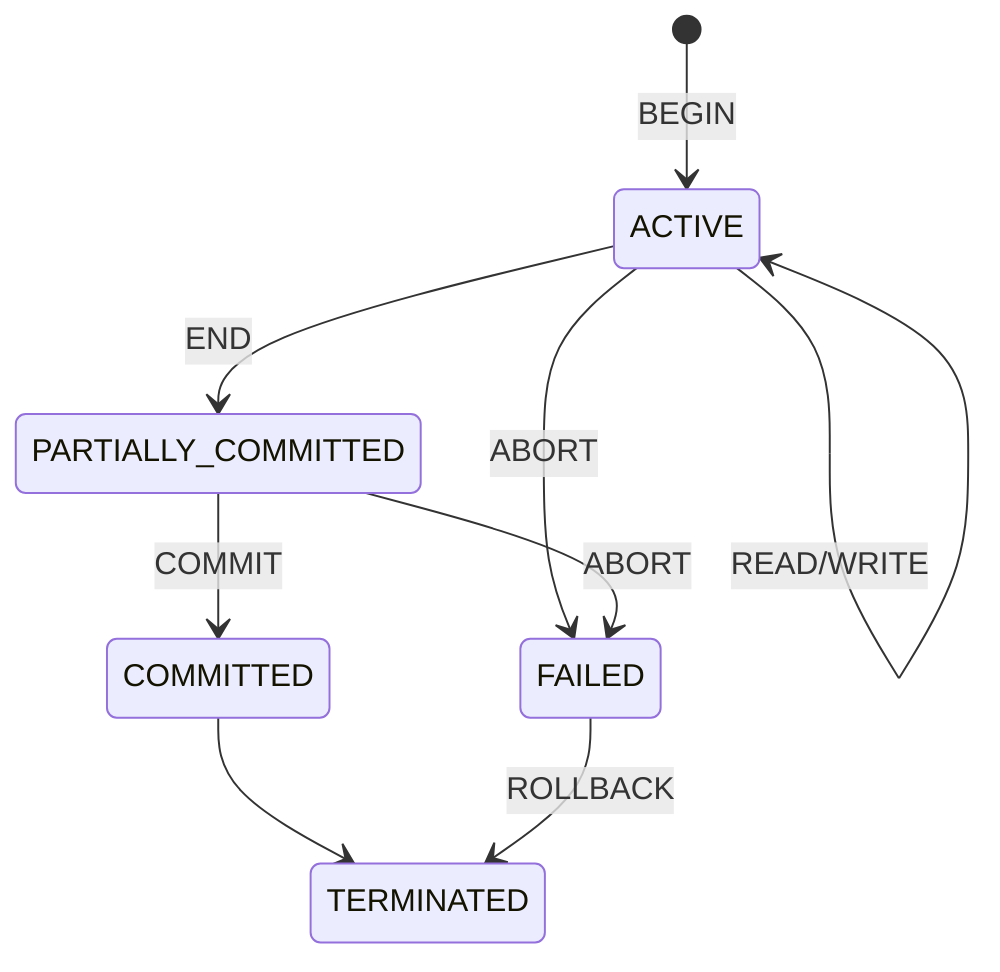
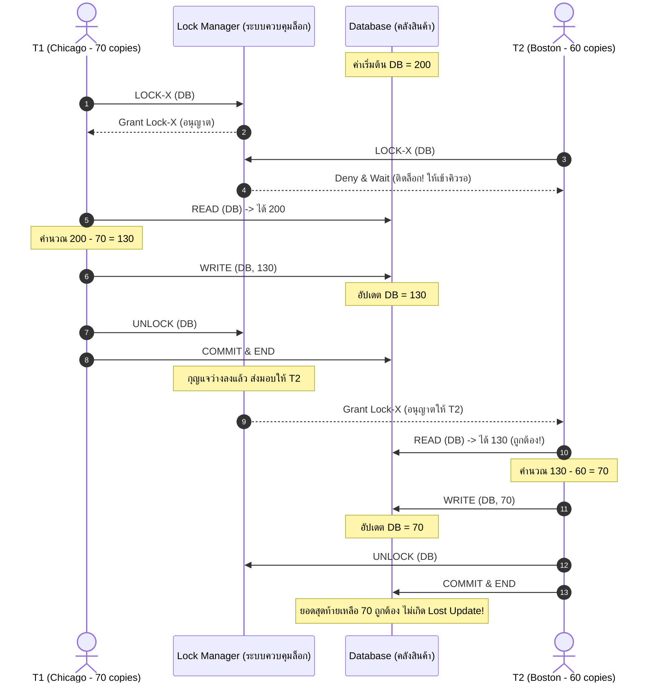

---
tags:
  - database
  - transaction
  - recovery
  - concurrency
  - lecture-8
created: 2026-07-07
updated: 2026-07-07
lecture: 8
type: lecture
---

# Lecture 8: Database System Architecture (Transaction, Recovery and Concurrency Control)

> [!SUMMARY] ภาพรวมบทเรียน
> บทเรียนนี้ว่าด้วยเรื่องสถาปัตยกรรมระดับลึกของระบบฐานข้อมูล โดยเน้นไปที่หัวใจสำคัญ 3 เรื่อง ได้แก่ **การจัดการทรานแซกชัน (Transaction)**, **การกู้คืนข้อมูลเมื่อระบบพัง (Recovery)**, และ **การควบคุมการทำงานพร้อมกัน (Concurrency Control)** เพื่อป้องกันไม่ให้ข้อมูลพังเมื่อมีคนใช้งานฐานข้อมูลพร้อมกันหลายๆ คน

---

## 🏦 Slide 1: Transaction, Recovery and Concurrency Control
**หน้าปกบทเรียน: ทรานแซกชัน การกู้คืน และการควบคุมภาวะพร้อมกัน**

บทนี้เปรียบเสมือนการเรียนรู้กลไกของ "ระบบธนาคาร" ที่ต้องมีความน่าเชื่อถือสูงสุด ข้อมูลเงินโอนเข้า-ออกห้ามตกหล่น ห้ามหาย และห้ามคำนวณผิดพลาดแม้ระบบจะไฟดับก็ตาม

---

## 🔁 Slide 2: Transaction Concept (Successful)
**แนวคิดของทรานแซกชัน (กรณีทำงานสำเร็จ)**

> [!DEFINITION] ทรานแซกชัน (Transaction) คืออะไร?
> ทรานแซกชัน คือ "หน่วยของการทำงาน" (Unit of program execution) ที่มัดรวมชุดคำสั่งหลายๆ คำสั่งเข้าด้วยกันเป็นก้อนเดียว เพื่อเข้าไปอ่าน (Access) หรือแก้ไข (Update) ข้อมูลในฐานข้อมูล

> [!EXAMPLE] Trace Table: ทรานแซกชันที่สำเร็จ (Successful)
> **สถานการณ์:** โอนเงิน 50,000 บาท จากบัญชีออมทรัพย์ (Savings) ไปยังบัญชีกระแสรายวัน (Checking)
> 
> **ขั้นตอนการทำงาน (Application Program):**
> 1. `BEGIN` (เริ่มทรานแซกชัน)
> 2. `READ (savings);` $\rightarrow$ โหลดเงิน 400,000 จากฐานข้อมูล
> 3. `Savings := savings - 50000;` $\rightarrow$ หักเงินในหน่วยความจำชั่วคราว
> 4. `WRITE (savings);` $\rightarrow$ อัปเดตยอด 350,000 ลงฐานข้อมูล
> 5. `READ (checking);` $\rightarrow$ โหลดเงิน 10,000 จากฐานข้อมูล
> 6. `checking := checking + 50000;` $\rightarrow$ บวกเงินเพิ่มในหน่วยความจำชั่วคราว
> 7. `WRITE (checking);` $\rightarrow$ อัปเดตยอด 60,000 ลงฐานข้อมูล
> 8. `COMMIT` (ยืนยันการทำธุรกรรมถาวร)
> 
> **ผลลัพธ์ใน DATABASE (สมบูรณ์):**
> - Savings: 350,000 ฿
> - Checking: 60,000 ฿

---

## ❌ Slide 3: Transaction Concept (Aborted)
**แนวคิดของทรานแซกชัน (กรณีทำงานล้มเหลว)**

> [!EXAMPLE] Trace Table: ทรานแซกชันที่ถูกยกเลิก (Aborted)
> **สถานการณ์:** ระบบล่มหรือเกิดข้อผิดพลาดระหว่างการโอนเงิน (หักเงินบัญชีแรกไปแล้ว แต่ยังไม่ได้เข้าบัญชีที่สอง)
> 
> **ขั้นตอนการทำงาน:**
> 1. `BEGIN`
> 2. `READ (savings);` $\rightarrow$ โหลด 400,000
> 3. `Savings := savings - 50000;` $\rightarrow$ หักเงิน
> 4. `WRITE (savings);` $\rightarrow$ อัปเดตฐานข้อมูลเหลือ 350,000 **(เงินหายไปแล้ว!)**
> 5. `READ (checking);`
> 6. `checking := checking + 50000;`
> 7. **`ABORT`** $\rightarrow$ เกิดข้อผิดพลาดร้ายแรง ระบบสั่งยกเลิกกะทันหัน
> 8. **`ROLLBACK`** $\rightarrow$ ดึงข้อมูลกลับสู่สภาพเดิมก่อนทำทรานแซกชัน
> 
> **ผลลัพธ์ใน DATABASE (ปลอดภัย):**
> - ต้องถูก Rollback เงิน Savings กลับมาเป็น 400,000 ฿ ตามเดิม! (นี่คือความเก่งของทรานแซกชัน)

---

## 🛡️ Slide 4: Transaction Properties (ACID)
**คุณสมบัติ 4 ประการของทรานแซกชัน (ACID)**

ทรานแซกชันที่ดีต้องมีคุณสมบัติระดับโลกที่เรียกว่า **ACID Properties**:
1. **Atomicity (ความปรมาณู / เล็กที่สุดแยกไม่ได้):**
   - กฎ All or Nothing (รอดทั้งหมด หรือ พังทั้งหมด) คำสั่งย่อยๆ ในทรานแซกชันต้องทำสำเร็จทุกคำสั่ง หรือถ้าพลาดแม้แต่คำสั่งเดียว ต้องยกเลิกทั้งหมดเหมือนไม่เคยเกิดขึ้น
2. **Consistency (ความสอดคล้อง):**
   - ทรานแซกชันต้องรักษาสมดุลความถูกต้องของฐานข้อมูล (เช่น เงินโอนออก+เงินโอนเข้า ยอดรวมต้องเท่าเดิมเสมอ)
3. **Isolation (ความโดดเดี่ยว):**
   - หากมีหลายทรานแซกชันวิ่งเข้ามาทำงานพร้อมกัน (Concurrency) แต่ละทรานแซกชันต้องไม่รับรู้ถึงการมีอยู่ของกันและกัน (ทำงานเสมือนว่ามันใช้งานฐานข้อมูลอยู่คนเดียว)
4. **Durability (ความคงทน):**
   - เมื่อกด `COMMIT` สำเร็จแล้ว ข้อมูลต้องถูกบันทึกลงฮาร์ดดิสก์อย่างถาวร แม้หลังจากนั้น 1 วินาทีไฟจะดับ ข้อมูลก็ห้ามหาย!

---

## 🚥 Slide 5: Transaction States
**สถานะการทำงานของทรานแซกชัน**

วงจรชีวิตของทรานแซกชันมีจุดเช็คพอยต์ดังนี้:
- **BEGIN:** ทรานแซกชันเข้าสู่สถานะ `active state` (กำลังทำงาน)
- **READ / WRITE:** ทรานแซกชันยังคงอยู่ใน `active state`
- **END:** คำสั่งทั้งหมดถูกประมวลผลเสร็จสิ้น เข้าสู่สถานะ `partially committed state` (เสร็จแล้วแต่ยังไม่ลงฮาร์ดดิสก์)
- **COMMIT:** อนุมัติข้อมูลลงดิสก์ถาวร ย้ายไปสถานะ `committed state` และไปจบที่ `terminated state`
- **ABORT:** มีข้อผิดพลาด ย้ายจาก active หรือ partially committed ไปสู่ `failed state` (สถานะล้มเหลว)
- **ROLLBACK:** กู้คืนข้อมูลกลับ ย้ายไปสู่ `terminated state` (จบการทำงานแบบพังๆ)

---

## 🔄 Slide 6: Transaction States (Diagram)
**แผนภาพวงจรชีวิตของทรานแซกชัน**

```mermaid
stateDiagram-v2
    [*] --> ACTIVE : BEGIN
    ACTIVE --> ACTIVE : READ/WRITE
    ACTIVE --> PARTIALLY_COMMITTED : END
    PARTIALLY_COMMITTED --> COMMITTED : COMMIT
    COMMITTED --> TERMINATED
    
    ACTIVE --> FAILED : ABORT
    PARTIALLY_COMMITTED --> FAILED : ABORT
    
    FAILED --> TERMINATED : ROLLBACK
```
*(แผนภาพแสดงให้เห็นว่า ถ้า ABORT จะต้องลงไปที่ FAILED เสมอ แล้วค่อย ROLLBACK เพื่อนำไปสู่จุดยุติ TERMINATED)*

---

## ⏱️ Slide 7: Recovery (Program Execution)
**ลำดับเวลาการทำงานและการกู้คืน**

โปรแกรมที่เราเขียนรันกัน ประกอบด้วยทรานแซกชันเรียงต่อกันเป็นขบวน:
- **1st transaction:** เริ่ม `begin` $\rightarrow$ จบสวยงามด้วย `commit`
- **2nd transaction:** เริ่ม `begin` $\rightarrow$ แต่ถูก Canceled กลางคัน $\rightarrow$ ต้องเกิดการ `rollback` วิ่งย้อนกลับมาที่จุด begin
- **3rd transaction:** เริ่ม `begin` $\rightarrow$ จบสวยงามด้วย `commit`
- **Program termination:** จบโปรแกรมอย่างสมบูรณ์

---

## 💥 Slide 8: Recovery (Failures)
**ประเภทของความล้มเหลวของระบบ**

การกู้คืน (Recovery) จะเข้ามาช่วยเมื่อเกิดหายนะ 2 รูปแบบหลักๆ:
1. **System failures (ระบบล่ม / ไฟดับ):**
   - หรือเรียกว่า Soft crash เกิดจากไฟตก ซอฟต์แวร์แฮงค์
   - **วิธีแก้:** System recovery อาศัยการอ่านไฟล์ Log (Log-based recovery) เพื่อดูว่าก่อนไฟดับทำอะไรค้างไว้
2. **Media failures (ฮาร์ดดิสก์พัง):**
   - หรือเรียกว่า Hard crash เกิดจากหัวอ่านดิสก์ขูด (Head crash), แผ่นดิสก์ไหม้
   - **วิธีแก้:** Media recovery ต้องดึงข้อมูลจากตัวสำรอง (Backup) มาโปะทับ

---

## 📊 Slide 9: System Recovery (Diagram)
**แผนภาพการกู้คืนระบบผ่าน Checkpoint**

> [!INFO] จำลองเหตุการณ์ระบบล่ม
> ให้แกนนอนคือเวลา (Time) 
> - `tc` คือเวลาที่มีการทำ **Checkpoint** (บันทึกจุดปลอดภัยล่าสุดลงดิสก์)
> - `tf` คือเวลาที่เกิด **System failure** (ไฟดับ!)
>
> มีทรานแซกชันวิ่งอยู่ 5 ตัว ($T_1$ ถึง $T_5$):
> - **$T_1$**: เกิดและจบ *ก่อน* จุด Checkpoint `tc` $\rightarrow$ (รอดตัว สบายใจได้)
> - **$T_2$**: เกิดก่อน `tc` แต่ไปจบหลัง `tc` (แต่จบก่อน `tf`) $\rightarrow$ (ต้องเช็ค)
> - **$T_3$**: เกิดก่อน `tc` แต่ดันทำไม่เสร็จ ลากยาวไปจนโดนไฟดับที่ `tf` พอดี $\rightarrow$ (ตัวปัญหาระดับ 1)
> - **$T_4$**: เกิดหลัง `tc` และจบก่อนไฟดับ `tf` $\rightarrow$ (ต้องเช็ค)
> - **$T_5$**: เกิดหลัง `tc` และดันทำไม่เสร็จ ลากยาวไปโดนไฟดับที่ `tf` $\rightarrow$ (ตัวปัญหาระดับ 2)

---

## 🛠️ Slide 10: System Recovery (UNDO / REDO)
**กลไกการสร้างรายการ UNDO และ REDO หลังไฟดับ**

เมื่อระบบบูทกลับมาติด (Restart time) DBMS จะเปิดไฟล์ Log และทำตาม 5 ขั้นตอนนี้เป๊ะๆ:
1. เอาทรานแซกชันทุกตัวที่วิ่งคร่อมจุด Checkpoint (`tc`) จับยัดใส่ **UNDO list** ไปก่อน และตั้ง **REDO list** ให้ว่างเปล่า (จากแผนภาพคือจับ $T_2, T_3$ ใส่ UNDO)
2. เริ่มสแกนไฟล์ Log เดินหน้า (Search forward) นับตั้งแต่จุด Checkpoint เป็นต้นไป
3. ถ้าเจอคำสั่ง `BEGIN TRANSACTION` ของใคร ให้จับทรานแซกชันนั้นโยนเข้า **UNDO list** เพิ่ม (เช่น เจอ $T_4, T_5$ ก็จับยัดเข้า UNDO รวมเป็น $T_2, T_3, T_4, T_5$)
4. สแกนต่อไป ถ้าบังเอิญเจอคำสั่ง `COMMIT` ของใคร ให้ย้ายทรานแซกชันนั้นจาก UNDO เตะข้ามไปอยู่ฝั่ง **REDO list** (เช่น เจอ COMMIT ของ $T_2, T_4$ ก็ย้ายไป)
5. เมื่ออ่าน Log จบ เราจะทราบชะตากรรมแน่ชัด:
   - **REDO list ($T_2, T_4$):** พวกนี้ทำเสร็จก่อนไฟดับ แต่ไม่ชัวร์ว่าลงฮาร์ดดิสก์รึยัง ระบบจะสั่งรันคำสั่งซ้ำ (REDO) เพื่อย้ำข้อมูลให้ลงดิสก์ 100%
   - **UNDO list ($T_3, T_5$):** พวกนี้ทำค้างไว้ตอนไฟดับ ระบบจะสั่งม้วนกลับ (UNDO) คืนค่าทุกอย่างทิ้งให้หมดเสมือนไม่เคยเกิดขี้น!

---

## 🤝 Slide 11: Two-Phase Commit
**โปรโตคอลการยืนยันแบบ 2 ระยะ**

- **Two-phase commit (2PC)** เป็นโปรโตคอลสำคัญในระบบแบบกระจายตัว (Distributed system) ที่ยอมให้ทรานแซกชันสามารถข้ามไปคุยกับฐานข้อมูลข้ามค่ายได้ (เช่น อัปเดต MySQL พร้อมๆ กับ Oracle)
- เป้าหมายคือเพื่อรักษาคุณสมบัติ **Atomicity** ให้มั่นคง (ถ้าจะจบ ต้องจบให้ลงพร้อมกันทั้งสองเซิร์ฟเวอร์ ถ้าจะพัง ต้องพังทั้งคู่ ห้ามมีใครแอบ Commit ก่อน)

---

## 📞 Slide 12: Two-Phase Commit (Phases)
**รายละเอียด 2 ระยะของการทำ 2PC**

การทำ 2PC จะมีผู้ประสานงานกลาง (Coordinator) ทำหน้าที่คุมจังหวะลูกข่าย (Participants):
1. **The Prepare Phase (ระยะเตรียมตัว):**
   - Coordinator ตะโกนสั่งลูกข่ายทุกคนว่า *"เตรียมตัวให้พร้อมนะ จะ Commit หรือจะ Rollback ก็เตรียมตัวไว้!"*
2. **The Commit Phase (ระยะตัดสินใจ):**
   - สมมติว่าลูกข่ายทุกคนในระยะแรกตอบกลับมาว่า *"โอเค พร้อม Commit!"* (Satisfactorily responded)
   - Coordinator จะตะโกนสั่งคำสั่งสุดท้าย: *"งั้นจงทำการ Commit ของจริงเดี๋ยวนี้!"* (แต่ถ้ามีลูกข่ายแม้แต่คนเดียวที่ตอบว่าไม่พร้อม Coordinator จะสั่งชี้ขาดให้ทุกคน Rollback ทันที)

---

## ⚔️ Slide 13: Concurrency Control (Lost Update)
**ปัญหาเมื่อคนแย่งกันทำงาน (Lost Update)**

เมื่อปล่อยให้หลายคนมารุมอ่านเขียนข้อมูลพร้อมกัน (Concurrency) จะเกิดบั๊ก 3 รูปแบบหลัก 
**ปัญหาที่ 1: The Lost Update Problem (ข้อมูลอัปเดตหายสาบสูญ)**

> [!EXAMPLE] Trace Table: Lost Update
> 
> **สมมติว่าค่า d ในฮาร์ดดิสก์ = 100**
> 
> | เวลา (Time) | ทรานแซกชัน A | ทรานแซกชัน B |
> |---|---|---|
> | `t1` | `RETRIEVE data d` (โหลด 100 เข้ามาในหัว) | - |
> | `t2` | - | `RETRIEVE data d` (โหลด 100 เข้ามาในหัวเช่นกัน) |
> | `t3` | `UPDATE data d` (A สมมติว่าลบไป 10 เอา 90 เขียนลงดิสก์) | - |
> | `t4` | - | `UPDATE data d` (B สมมติว่าบวกไป 20 เอา 120 เขียนลงดิสก์ทับ!!) |
> 
> **ผลลัพธ์ที่พังพินาศ:** ค่าในดิสก์กลายเป็น 120 การกระทำของ A ที่อุตส่าห์หักไป 10 กลายเป็นฝุ่นผง **(Lost Update)** ค่าที่ถูกต้องจริงๆ ควรจะเป็น 100 - 10 + 20 = 110 ต่างหาก!

---

## 👻 Slide 14: Concurrency Control (Uncommitted Dependency)
**ปัญหาที่ 2: The Uncommitted Dependency Problem (การอ่านของสกปรก / Dirty Read)**

การไปแอบอ่านข้อมูลที่ชาวบ้านเขายังไม่ยืนยันความถูกต้อง (Commit)

> [!EXAMPLE] Trace Table: Dirty Read
> 
> | เวลา (Time) | ทรานแซกชัน A | ทรานแซกชัน B |
> |---|---|---|
> | `t1` | - | `UPDATE data d` (B แก้ข้อมูลเล่นๆ จาก 100 เป็น 200 แต่ยังไม่กด Commit) |
> | `t2` | `RETRIEVE data d` (A รีบมาอ่าน ได้เลข 200 ไปใช้ประมวลผลต่อ) | - |
> | `t3` | - | **`ROLLBACK`** (B เปลี่ยนใจ กดยกเลิก! ดึงข้อมูลกลับเป็น 100) |
> 
> **ผลลัพธ์ที่พังพินาศ:** A เอาเลข 200 (ข้อมูลผีที่ไม่มีอยู่จริงแล้ว) ไปใช้ทำธุรกรรมจนเสร็จสิ้น ทำให้ข้อมูลของ A ผิดพลาดทั้งระบบ

---

## 🧮 Slide 15: Concurrency Control (Inconsistent Analysis)
**ปัญหาที่ 3: The Inconsistent Analysis Problem (การคำนวณที่ขัดแย้ง)**

หรือเรียกว่าปัญหา "ยอดรวมเพี้ยน" เพราะมีคนมาแอบกวนข้อมูลระหว่างที่กำลังไล่บวกเลข

> [!EXAMPLE] Trace Table: Inconsistent Analysis
> **สถานะเริ่มต้น:** `ACC1 = 40`, `ACC2 = 50`, `ACC3 = 30` (รวมต้องได้ 120)
> 
> | เวลา | ทรานแซกชัน A (คนบวกยอด) | ทรานแซกชัน B (คนโอนเงิน) |
> |---|---|---|
> | `t1` | `READ ACC1` (sum = 40) | - |
> | `t2` | `READ ACC2` (sum = 40+50 = 90) | - |
> | `t3` | - | `READ ACC3` |
> | `t4` | - | `UPDATE ACC3 30 -> 20` (หักเงินจาก ACC3 ไป 10) |
> | `t5` | - | `READ ACC1` |
> | `t6` | - | `UPDATE ACC1 40 -> 50` (เอาเงิน 10 มาโปะ ACC1) |
> | `t7` | - | **`COMMIT`** (B โอนเสร็จละ สบายใจ) |
> | `t8` | `READ ACC3` (A มาอ่าน ACC3 ต่อ ได้เลข 20!)   (sum = 90 + 20 = **110**) | - |
> 
> **ผลลัพธ์ที่พังพินาศ:** ทรานแซกชัน A ซึ่งมีหน้าที่สรุปยอดเงินทั้งระบบ แจ้งว่ายอดรวมมีแค่ **110**! ทั้งที่จริงๆ การโอนเงินของ B ไม่ได้ทำให้เงินหายไปจากระบบ (รวมต้องได้ 120 เหมือนเดิม) แต่เพราะ A ดันไปอ่าน ACC1 ก่อนที่ B จะโปะเงิน และไปอ่าน ACC3 หลังจากที่ B หักเงินไปแล้ว A จึงถูกหลอกอย่างสมบูรณ์แบบ

---

## 🔒 Slide 16: Lock-based Resolution
**การแก้ปัญหาด้วยระบบแม่กุญแจ (Locking)**

เพื่อป้องกันพฤติกรรมแย่งกันอ่านเขียนมั่วซั่ว ระบบฐานข้อมูลจึงใช้ "แม่กุญแจ" มาคล้องข้อมูลไว้
**แม่กุญแจมี 2 ประเภทหลัก (Two basic types of locks):**
1. **Exclusive lock (X-lock) / Write lock:** แม่กุญแจแบบ "ผูกขาด" ใครถือคนนั้นมีสิทธิ์แก้ข้อมูลได้คนเดียว คนอื่นห้ามแม้แต่จะแหยมเข้ามาอ่าน!
2. **Shared lock (S-lock) / Read lock:** แม่กุญแจแบบ "แบ่งปัน" คนถือมีสิทธิ์แค่อ่านอย่างเดียว คนอื่นก็เข้ามาขอแบ่งกุญแจอ่านด้วยได้ (แต่ห้ามใครแก้เด็ดขาด)

> [!INFO] Matrix for locking (ตารางการชนกันของแม่กุญแจ)
> 
> | กำลังขอ \ ของเดิมที่มี | X-lock | S-lock | ไม่มี Lock (-) |
> |---|:---:|:---:|:---:|
> | **X-lock** | ❌ (รอ) | ❌ (รอ) | ✅ (ได้) |
> | **S-lock** | ❌ (รอ) | ✅ (ได้!) | ✅ (ได้) |
> | **ไม่มี Lock (-)** | ✅ (ได้) | ✅ (ได้) | ✅ (ได้) |
> *(วิเคราะห์: S กับ S อยู่ร่วมกันได้ (คนนึงอ่าน อีกคนมาขออ่านด้วยได้) แต่ X ไม่ถูกกับใครเลย! ถ้ามี X ขวางอยู่ ทุกคนต้องรอจนกว่า X จะปลดล็อก)*

---

## 📦 Slide 17: Simple Locking (Trace 1)
**ตัวอย่างการล็อคข้อมูลคลังสินค้า**

> [!EXAMPLE] Trace Table: การทำงานของ Exclusive Lock
> **สถานะคลังสินค้า:** ฐานข้อมูล (DB) มีหนังสืออยู่ 200 เล่ม
> ออร์เดอร์จาก Chicago สั่ง 70 เล่ม / ออร์เดอร์จาก Boston สั่ง 60 เล่ม
> 
> **ลำดับเหตุการณ์การแย่งกัน:**
> 1. Chicago ส่งคำขอ: `REQUEST LOCK (DB)`
> 2. Chicago ได้กุญแจ: `LOCK (DB)` (ได้ X-lock ไปครอง)
> 3. Chicago เริ่มอ่าน: `READ (DB)` $\rightarrow$ เห็น 200
> 4. Boston ส่งคำขอแทรก: `REQUEST LOCK (DB)` $\rightarrow$ **ติดล็อก! (Wait...)** เพราะ Chicago ถือ X-lock อยู่ Boston ต้องยืนรอเงียบๆ
> 5. Chicago คำนวณ: `(DB) := (DB)-70` (เหลือ 130)
> 6. Chicago บันทึก: `WRITE (DB)` $\rightarrow$ อัปเดตฮาร์ดดิสก์เป็น 130
> 7. Chicago ปลดล็อก: `UNLOCK (DB)`
> 8. Boston ได้จังหวะ: `LOCK (DB)` (คิวของ Boston ได้ X-lock ต่อ)
> 9. Boston เริ่มอ่าน: `READ (DB)` $\rightarrow$ เห็น 130 (ข้อมูลอัปเดตแล้ว ไม่โดนหลอก!)
> 10. Boston คำนวณ: `(DB) := (DB)-60` (เหลือ 70)
> 11. Boston บันทึก: `WRITE (DB)` $\rightarrow$ อัปเดตเป็น 70
> 12. Boston ปลดล็อก: `UNLOCK (DB)`

---

## 🔐 Slide 18: Simple Locking (Operations in T1 and T2)
**การทำงานของ Shared Lock (LOCK-S) และ Exclusive Lock (LOCK-X) บนข้อมูล 2 ตัวแปร**

ในสไลด์หน้านี้ อาจารย์แสดงตัวอย่างการทำงานร่วมกันของแม่กุญแจทั้งสองประเภท คือ **Shared Lock (LOCK-S)** สำหรับการอ่านข้อมูล และ **Exclusive Lock (LOCK-X)** สำหรับการเขียนแก้ไขข้อมูล โดยมี 2 ทรานแซกชัน ($T_1$ และ $T_2$) แย่งกันประมวลผลข้อมูล 2 ชิ้น คือ $D_1$ และ $D_2$

> [!DEFINITION] ค่าเริ่มต้นของระบบ (Initial Values)
> * ข้อมูลชิ้นที่ 1: $(D_1) = 100$
> * ข้อมูลชิ้นที่ 2: $(D_2) = 150$

### 📋 ตารางเปรียบเทียบลำดับคำสั่งการทำงาน (Operation in T1 and T2)

| ลำดับขั้นตอน | คำสั่งใน $T_1$ (Transaction 1) | กลไกและการทำงานของ $T_1$ | คำสั่งใน $T_2$ (Transaction 2) | กลไกและการทำงานของ $T_2$ |
|:---:|---|---|---|---|
| **1** | `LOCK-S (D2)` | ขอ Shared Lock บน $D_2$ เพื่อเตรียมอ่านค่า | `LOCK-S (D1)` | ขอ Shared Lock บน $D_1$ เพื่อเตรียมอ่านค่า |
| **2** | `READ (D2)` | อ่านค่า $D_2$ เข้าสู่หน่วยความจำ (ได้ค่า 150) | `READ (D1)` | อ่านค่า $D_1$ เข้าสู่หน่วยความจำ (ได้ค่า 100) |
| **3** | `UNLOCK (D2)` | **ปลดล็อก $D_2$ ทันที** หลังอ่านเสร็จ | `UNLOCK (D1)` | **ปลดล็อก $D_1$ ทันที** หลังอ่านเสร็จ |
| **4** | `LOCK-X (D1)` | ขอ Exclusive Lock บน $D_1$ เพื่อเตรียมอัปเดต | `LOCK-X (D2)` | ขอ Exclusive Lock บน $D_2$ เพื่อเตรียมอัปเดต |
| **5** | `READ (D1)` | อ่านค่า $D_1$ ปัจจุบัน (ได้ค่า 100) | `READ (D2)` | อ่านค่า $D_2$ ปัจจุบัน (ได้ค่า 150) |
| **6** | `(D1) := (D1) + (D2)` | คำนวณค่าใหม่: $100 + 150 = 250$ | `(D2) := (D2) + (D1)` | คำนวณค่าใหม่ของ $D_2$ |
| **7** | `WRITE (D1)` | บันทึกค่าใหม่ $(D_1) = 250$ ลงฐานข้อมูล | `WRITE (D2)` | บันทึกค่าใหม่ $(D_2)$ ลงฐานข้อมูล |
| **8** | `UNLOCK (D1)` | ปลดล็อก $D_1$ เมื่อแก้ไขเสร็จสิ้น | `UNLOCK (D2)` | ปลดล็อก $D_2$ เมื่อแก้ไขเสร็จสิ้น |
| **...** | `…` | ดำเนินการคำสั่งอื่นๆ ต่อไป | `…` | ดำเนินการคำสั่งอื่นๆ ต่อไป |

```mermaid
flowchart TD
    subgraph T1_Flow["การทำงานของ Transaction T1"]
        T1_1["1. LOCK-S (D2) -> ขออ่าน D2"] --> T1_2["2. READ (D2) -> ได้ค่า 150"]
        T1_2 --> T1_3["3. UNLOCK (D2) -> รีบปลดล็อกทันที"]
        T1_3 --> T1_4["4. LOCK-X (D1) -> ขอล็อกเดี่ยวเพื่อแก้ D1"]
        T1_4 --> T1_5["5. READ (D1) -> อ่าน D1 ได้ 100"]
        T1_5 --> T1_6["6. คำนวณ D1 := D1 + D2 (100 + 150 = 250)"]
        T1_6 --> T1_7["7. WRITE (D1) -> เขียน 250 ลง D1"]
        T1_7 --> T1_8["8. UNLOCK (D1) -> ปลดล็อก D1"]
    end

    subgraph T2_Flow["การทำงานของ Transaction T2"]
        T2_1["1. LOCK-S (D1) -> ขออ่าน D1"] --> T2_2["2. READ (D1) -> ได้ค่า 100"]
        T2_2 --> T2_3["3. UNLOCK (D1) -> รีบปลดล็อกทันที"]
        T2_3 --> T2_4["4. LOCK-X (D2) -> ขอล็อกเดี่ยวเพื่อแก้ D2"]
        T2_4 --> T2_5["5. READ (D2) -> อ่าน D2 ได้ 150"]
        T2_5 --> T2_6["6. คำนวณ D2 := D2 + D1"]
        T2_6 --> T2_7["7. WRITE (D2) -> เขียนค่าใหม่ลง D2"]
        T2_7 --> T2_8["8. UNLOCK (D2) -> ปลดล็อก D2"]
    end
```

> [!WARNING] เจาะลึกจุดบกพร่องของ Simple Locking (ทำไมแค่นี้ยังไม่พอ?)
> พฤติกรรมในสไลด์ 18 นี้เรียกว่า **"Simple Locking"** คือต้องการใช้ข้อมูลตัวไหนก็ขอ Lock ตัวนั้น พอใช้งานเสร็จก็สั่ง `UNLOCK` ทันที แม้จะดูเหมือนถูกต้อง แต่ในความเป็นจริงมี **จุดอ่อนร้ายแรง 2 ประการ**:
> 1. **การปล่อยกุญแจเร็วเกินไป (Early Unlocking):** สังเกตว่า $T_1$ ปลดล็อก $D_2$ ตั้งแต่ขั้นตอนที่ 3 ทั้งที่ค่าผลลัพธ์ของ $D_1$ ในขั้นตอนที่ 6 ยังต้องพึ่งพาความถูกต้องของ $D_2$ อยู่ หากระหว่างขั้นตอนที่ 3 ถึง 6 มีทรานแซกชันอื่นเข้ามาแทรกแซงและแก้ค่า $D_2$ จะทำให้ผลลัพธ์กลายเป็นข้อมูลขัดแย้ง (Inconsistent Data) ทันที
> 2. **ความเสี่ยงต่อการเกิด Deadlock:** หากระบบสลับจังหวะให้ $T_1$ ถือ `LOCK-X (D1)` แล้วจะขอ `LOCK-X (D2)` ในขณะที่ $T_2$ ถือ `LOCK-X (D2)` แล้วจะขอ `LOCK-X (D1)` ทั้งคู่จะไม่ยอมปล่อยกุญแจและต้องยืนรอกันไปตลอดกาล
> 
> *นี่คือเหตุผลสำคัญที่บทเรียนต่อๆ ไปจำเป็นต้องนำหลักการ **Two-Phase Locking (2PL)** เข้ามาบังคับใช้ เพื่อห้ามปลดล็อกใดๆ จนกว่าจะผ่านจุดขยายล็อกสูงสุด (Lock Point)*

---

## ⏱️ Slide 19: Simple Locking (Execution Schedule & Timeline)
**ตารางสรุปลำดับเวลาการทำงานจริง (Execution Timeline) และการขจัดปัญหา Lost Update**

สไลด์หน้านี้จำลองเหตุการณ์จริงตามแกนเวลา (Time Units 1 ถึง 12) ของการสั่งซื้อหนังสือคลังสินค้าเดียวกัน (ฐานข้อมูลเริ่มต้นมีหนังสือ 200 เล่ม) โดยสาขา **Chicago ($T_1$)** ต้องการตัดยอด 70 เล่ม และสาขา **Boston ($T_2$)** ต้องการตัดยอด 60 เล่ม โดยแสดงให้เห็นว่า Exclusive Lock สามารถแก้ปัญหา Lost Update ได้อย่างไรแบบ Step-by-Step

> [!EXAMPLE] Trace Table: ลำดับเวลาการทำงานเมื่อมี Lock-X เข้ามาควบคุม (ตามสไลด์ 19 เป๊ะ)
> 
> | TIME | $T_1$ (Chicago order: DB 70 Copies) | $T_2$ (Boston order: DB 60 Copies) | ยอดคงเหลือในคลัง (DB) | คำอธิบายสถานะและการทำงานของระบบ |
> |:---:|---|---|:---:|---|
> | **1** | `BEGIN T1` | - | 200 | ทรานแซกชัน $T_1$ เริ่มต้นทำงาน |
> | **2** | `LOCK-X (DB)` | `BEGIN T2` | 200 | $T_1$ ได้สิทธิ์ Exclusive Lock บนก้อนข้อมูล DB ส่วน $T_2$ เพิ่งเริ่มทำงาน |
> | **3** | `READ (DB)` | `LOCK-X (DB)` *(ขอไม่ผ่าน)* | 200 | $T_1$ อ่านค่าได้ 200 เล่ม / $T_2$ ส่งคำขอ X-lock แต่ถูกระงับ เพราะ $T_1$ ถืออยู่ |
> | **4** | `(DB) := (DB) - 70` | `.... wait ....` | 200 | $T_1$ คำนวณ $200 - 70 = 130$ / $T_2$ ถูกบังคับเข้าสู่สถานะ **WAIT** (รอคอย) |
> | **5** | `WRITE (DB)` | `.... wait ....` | **130** | $T_1$ บันทึกยอดคงเหลือ 130 ลงดิสก์ / $T_2$ ยังคงต้องรอต่อไป |
> | **6** | `UNLOCK (DB)` | `.... wait ....` | 130 | $T_1$ ปลดกุญแจ Exclusive Lock / กุญแจบน DB ว่างลงเรียบร้อย |
> | **7** | `COMMIT` | `READ (DB)` | 130 | $T_1$ ยืนยันข้อมูลถาวร / $T_2$ หลุดจากสถานะรอ ได้สิทธิ์และอ่านค่า **130** (ข้อมูลสดใหม่ ถูกต้อง!) |
> | **8** | `END` | `(DB) := (DB) – 60` | 130 | $T_1$ จบสมบูรณ์ / $T_2$ คำนวณตัดยอด $130 - 60 = 70$ |
> | **9** | - | `WRITE (DB)` | **70** | $T_2$ บันทึกยอดคงเหลือ 70 ลงดิสก์ |
> | **10** | - | `UNLOCK (DB)` | 70 | $T_2$ ปลดล็อกกุญแจบน DB |
> | **11** | - | `COMMIT` | 70 | $T_2$ ยืนยันการเปลี่ยนแปลงข้อมูลถาวร |
> | **12** | - | `END` | 70 | $T_2$ จบการทำงาน ยอดคงเหลือในคลังสิ้นสุดที่ **70 เล่ม** ถูกต้องตามตรรกะ 100% |

```mermaid
sequenceDiagram
    autonumber
    actor T1 as T1 (Chicago - 70 copies)
    participant LockMgr as Lock Manager (ระบบควบคุมล็อก)
    participant DB as Database (คลังสินค้า)
    actor T2 as T2 (Boston - 60 copies)

    Note over DB: ค่าเริ่มต้น DB = 200
    T1->>LockMgr: LOCK-X (DB)
    LockMgr-->>T1: Grant Lock-X (อนุญาต)
    T2->>LockMgr: LOCK-X (DB)
    LockMgr-->>T2: Deny & Wait (ติดล็อก! ให้เข้าคิวรอ)
    
    T1->>DB: READ (DB) -> ได้ 200
    Note over T1: คำนวณ 200 - 70 = 130
    T1->>DB: WRITE (DB, 130)
    Note over DB: อัปเดต DB = 130
    T1->>LockMgr: UNLOCK (DB)
    T1->>DB: COMMIT & END

    Note over LockMgr: กุญแจว่างลงแล้ว ส่งมอบให้ T2
    LockMgr-->>T2: Grant Lock-X (อนุญาตให้ T2)
    T2->>DB: READ (DB) -> ได้ 130 (ถูกต้อง!)
    Note over T2: คำนวณ 130 - 60 = 70
    T2->>DB: WRITE (DB, 70)
    Note over DB: อัปเดต DB = 70
    T2->>LockMgr: UNLOCK (DB)
    T2->>DB: COMMIT & END
    Note over DB: ยอดสุดท้ายเหลือ 70 ถูกต้อง ไม่เกิด Lost Update!
```

> [!SUMMARY] บทวิเคราะห์ผลลัพธ์ของ Slide 19
> * **ก่อนมีระบบ Lock (ปัญหาจาก Slide 13):** ยอดขายจะหายไป 70 เล่ม ยอดคงเหลือคำนวณผิดพลาดกลายเป็น 140 (Lost Update)
> * **หลังมีระบบ Lock (ตาม Slide 19):** $T_2$ ถูกจัดลำดับคิวให้รอ (Serializability) จน $T_1$ ปลดล็อก ส่งผลให้ $T_2$ อ่านค่าที่อัปเดตแล้วจริง (130) และคำนวณยอดสุดท้ายได้ **70** อย่างถูกต้องแม่นยำ ปัญหา Lost Update จึงถูกขจัดอย่างสมบูรณ์แบบ!

---

# References
- **Course:** Database System
- **Chapter:** Lecture 8 - Database System Architecture (Transaction, Recovery, Concurrency Control)
- **Slides:** 19 slides (Complete Detailed Revision)
- **Related Notes:** [[Lecture 1 - Overview of Databases and Transaction Processing]]

---
*Last updated: 2026-07-07*
