---
tags:
  - database
  - nosql
  - big-data
  - lecture-9
created: 2026-07-07
updated: 2026-07-07
lecture: 9
type: lecture
---

# Lecture 9: NoSQL Databases (Enabling Extreme Scalability)

> [!SUMMARY] ภาพรวมบทเรียน
> บทเรียนนี้พาก้าวข้ามขีดจำกัดของฐานข้อมูลแบบ Relational Database (SQL) เข้าสู่ยุคของ **NoSQL** ซึ่งถูกออกแบบมาเพื่อรองรับข้อมูลมหาศาล (Big Data) และการประมวลผลแบบกระจายตัว (Distributed Computing) โดยจะครอบคลุมตั้งแต่ประวัติศาสตร์, ข้อดีข้อเสีย, สถาปัตยกรรมข้อมูลทั้ง 4 แบบ ไปจนถึงทฤษฎี CAP Theorem ที่เป็นหัวใจของ NoSQL

> [!TIP] 🎙️ **ถอดเทปเสียงบรรยายสดในห้องเรียน (15 ก.ย. 2569):**  
> สามารถศึกษาบทวิเคราะห์คำบรรยายสดในชั้นเรียน พร้อมคำอธิบายตัวอย่างเปรียบเทียบความเร็ว Cassandra (0.12ms vs 300ms), ทฤษฎีบท CAP Theorem, ข้อสอบปลายภาค 40 คะแนน และประกาศนัดหมายเรียนแล็บ 2 สัปดาห์ ได้ที่ [[In-Class Lecture - NoSQL, Big Data & CAP Theorem]]

---

## 🚀 Slide 1: Enabling Extreme Scalability with NoSQL

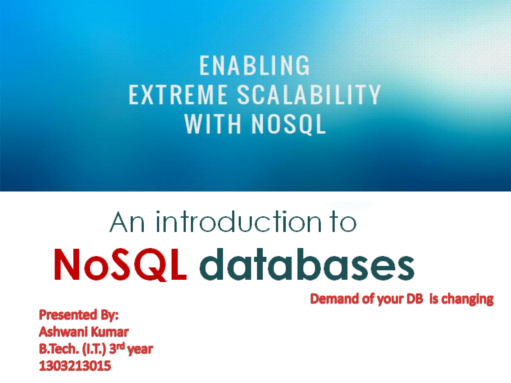
**บทนำ: การขยายระบบขั้นสุดด้วย NoSQL**

โลกเปลี่ยนไป ความต้องการของฐานข้อมูลก็เปลี่ยนตาม (Demand of your DB is changing) นี่คือจุดเริ่มต้นของการทำความรู้จักกับฐานข้อมูลยุคใหม่ที่ชื่อว่า NoSQL

---

## 📋 Slide 2: What is covered in this presentation?

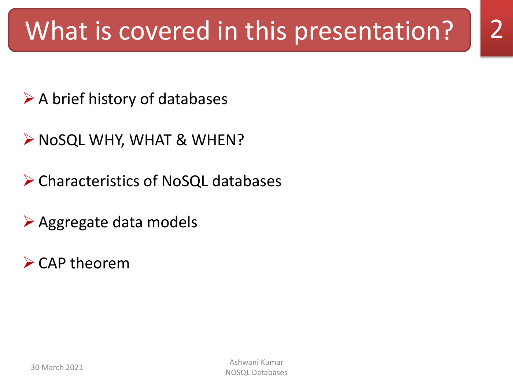
**หัวข้อที่จะครอบคลุมในบทเรียนนี้**

1. ประวัติศาสตร์โดยย่อของฐานข้อมูล
2. NoSQL คืออะไร ทำไมต้องใช้ และใช้เมื่อไหร่?
3. ลักษณะเด่น (Characteristics) ของ NoSQL
4. รูปแบบโครงสร้างข้อมูล (Aggregate data models)
5. ทฤษฎี CAP (CAP Theorem)

---

## 📖 Slide 3: Introduction

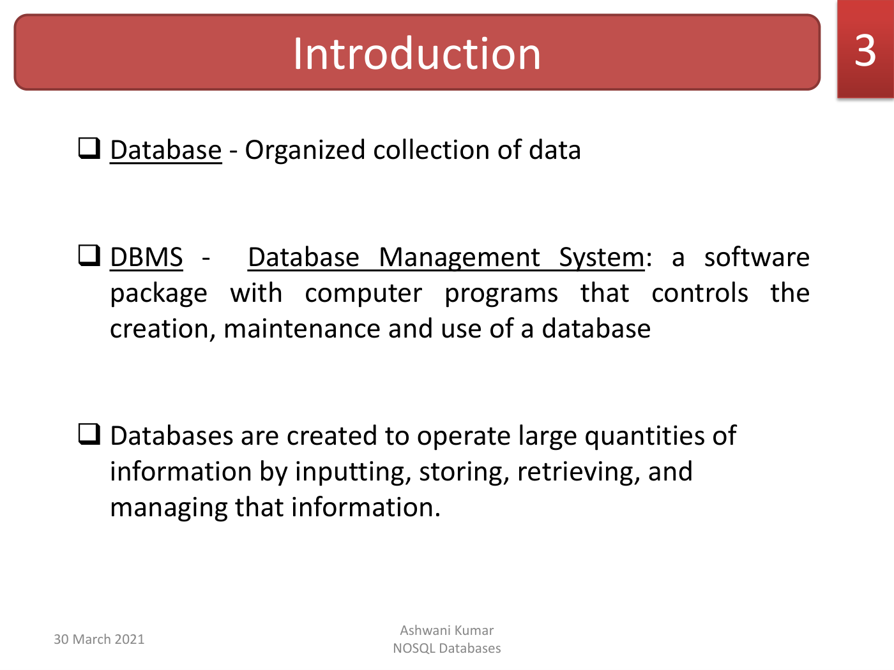
**ความรู้พื้นฐาน**

- **Database:** คือแหล่งรวบรวมข้อมูลที่ถูกจัดระเบียบไว้
- **DBMS (Database Management System):** ซอฟต์แวร์ที่ใช้ควบคุม สรรค์สร้าง และบำรุงรักษาฐานข้อมูล
- **เป้าหมาย:** ฐานข้อมูลถูกสร้างขึ้นมาเพื่อรับมือกับข้อมูลปริมาณมากๆ ผ่านการนำเข้า (Inputting), จัดเก็บ (Storing), และดึงออกมาใช้ (Retrieving)

---

## ⏳ Slide 4: A brief history

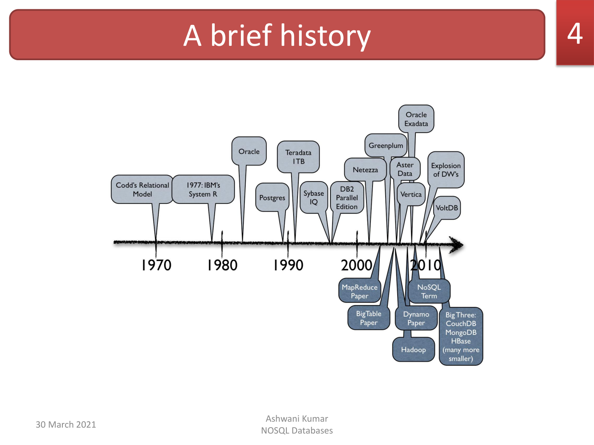
**ประวัติศาสตร์การพัฒนาฐานข้อมูล**

- **ยุค 1970:** จุดเริ่มต้นของ Codd's Relational Model (จุดกำเนิด RDBMS)
- **ยุค 1980-1990:** การเฟื่องฟูของ Oracle, Postgres, DB2
- **ยุค 2000:** การมาของ MapReduce Paper และ BigTable จาก Google
- **ยุค 2010 เป็นต้นมา:** เกิดคำว่า "NoSQL" และเกิดการระเบิดของฐานข้อมูลยุคใหม่ เช่น DynamoDB, CouchDB, MongoDB, Cassandra, HBase

---

## 🗄️ Slide 5: Relational databases

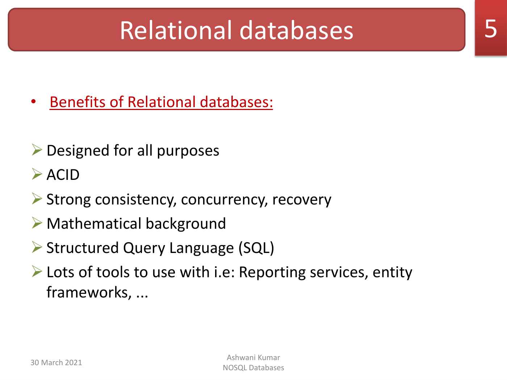
**ข้อดีของฐานข้อมูลเชิงสัมพันธ์ (RDBMS)**

ก่อนจะไป NoSQL เราต้องยอมรับว่า RDBMS (SQL) มีข้อดีที่ทรงพลังมาก:
- ออกแบบมาให้ใช้งานได้อเนกประสงค์ (All purposes)
- มีคุณสมบัติ **ACID** (Atomicity, Consistency, Isolation, Durability)
- แข็งแกร่งเรื่องความสอดคล้อง (Strong consistency) และการกู้คืนข้อมูล
- มีรากฐานทางคณิตศาสตร์ที่พิสูจน์ได้
- มีเครื่องมือเสริม (Tools) เช่น Reporting services ให้ใช้มากมาย

---

## 🏢 Slide 6: SQL databases

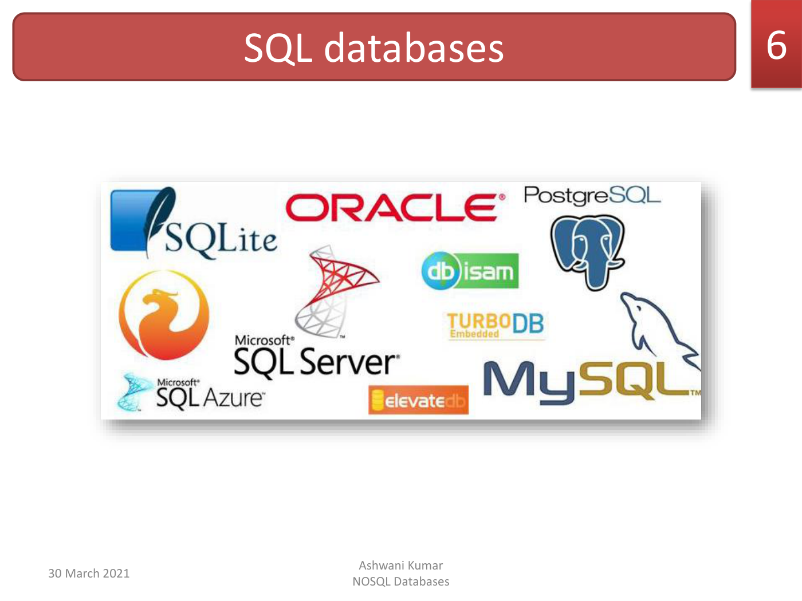
**ตัวอย่างยี่ห้อฐานข้อมูลกลุ่ม SQL**

ยี่ห้อที่คุ้นเคยในฝั่ง Relational ได้แก่:
- Oracle, MySQL, PostgreSQL, SQLite, Microsoft SQL Server

---

## 🧩 Slide 7: RDBMS

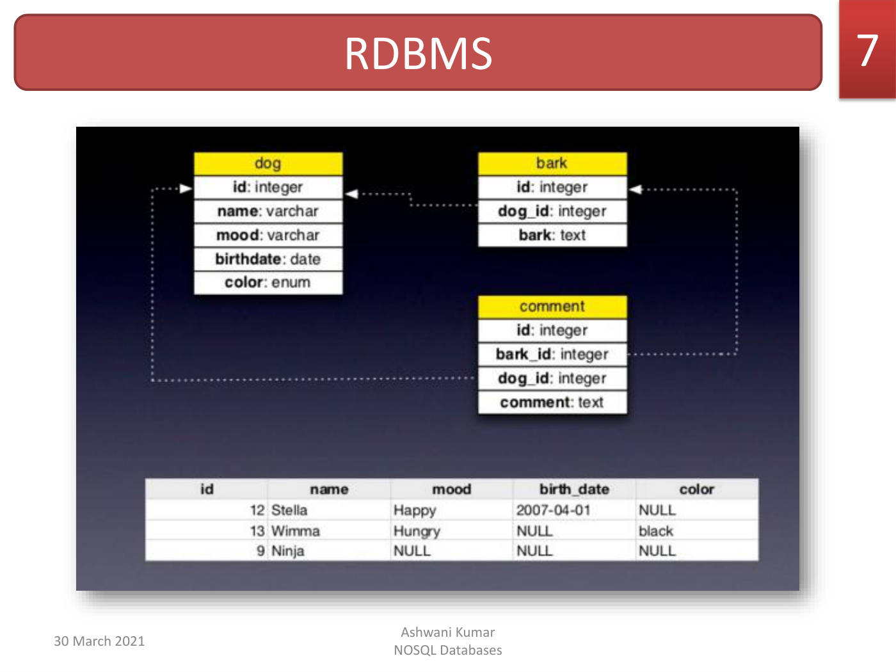
**หน้าตาของ RDBMS**

โครงสร้างของ SQL ถูกผูกมัดด้วย **"Schema (โครงสร้างตารางตายตัว)"** ต้องมีตาราง (Table), มีแถว (Row), และมีการเชื่อมความสัมพันธ์ด้วย Foreign Key อย่างชัดเจน (เช่น ตาราง Dog เชื่อมกับ ตาราง Bark)

---

## 🤔 Slide 8: NoSQL why, what and when? (The Problem)

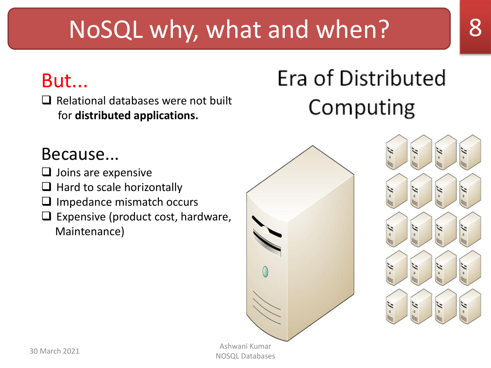
**ทำไมต้องมี NoSQL? (ปัญหาของ RDBMS)**

**But... (แต่ว่า...)** ฐานข้อมูลแบบ Relational ไม่ได้ถูกออกแบบมาสำหรับระบบ **Distributed Computing (การประมวลผลแบบกระจายศูนย์)** 

**Because... (เพราะว่า...)**
- การทำ `JOIN` ตารางข้ามไปมานั้น **กินทรัพยากรสูงมาก (Expensive)**
- **ขยายเซิร์ฟเวอร์แนวนอนยาก (Hard to scale horizontally):** SQL ถนัดการอัปเกรดเซิร์ฟเวอร์ให้แรงขึ้น (Scale Vertically) แต่ไม่ถนัดการแบ่งข้อมูลลงเซิร์ฟเวอร์เล็กๆ 100 เครื่อง
- มีปัญหาความเข้ากันไม่ได้ของรูปแบบข้อมูล (Impedance mismatch)
- ค่าใช้จ่ายสูง ทั้งค่าลิขสิทธิ์ ฮาร์ดแวร์ และการซ่อมบำรุง

---

## 🐢 Slide 9: NoSQL why, what and when? (The Weakness)

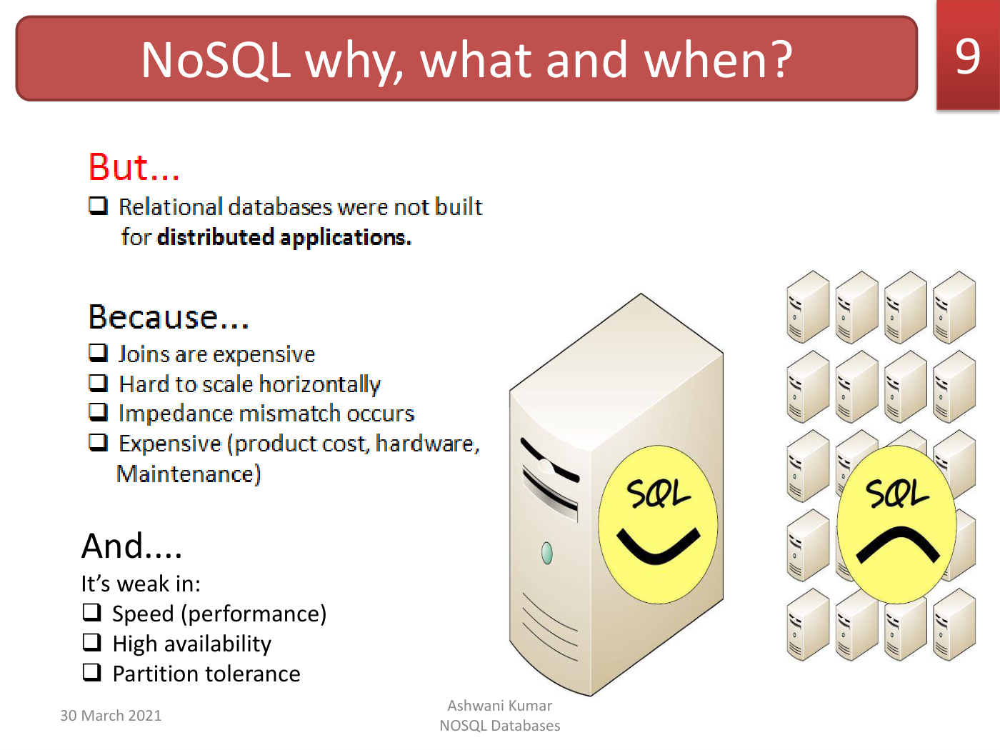
**จุดอ่อนของ SQL ในยุคใหม่**

เมื่อเจอกับข้อมูลระดับมหาศาลข้ามโลก SQL จะมีจุดอ่อนรุนแรงในเรื่อง:
1. **Speed (Performance):** ความเร็วในการเขียน/อ่านตกลงเมื่อมี JOIN มหาศาล
2. **High availability:** การทำระบบให้รอดตาย 100% ตลอดเวลานั้นทำได้ยาก
3. **Partition tolerance:** ขาดความทนทานเมื่อเครือข่ายเซิร์ฟเวอร์บางโหนดขาดการเชื่อมต่อ

---

## 🚀 Slide 10: Why NOSQL now?? Ans. Driving Trends

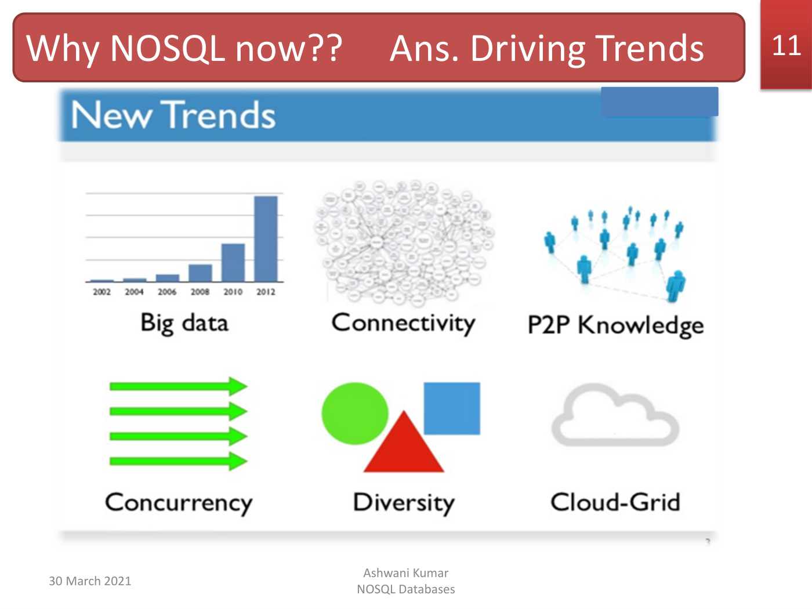
**ทำไม NoSQL ถึงมาบูมในยุคนี้?**

แรงผลักดัน (Driving Trends) ที่ทำให้โลกต้องทิ้ง SQL บางส่วน:
- **Big data:** ข้อมูลเติบโตเป็นกราฟเอกซ์โพเนนเชียล
- **Connectivity:** การเชื่อมโยงข้อมูลกันอย่างซับซ้อน
- **P2P Knowledge:** เครือข่ายแบบ Peer-to-Peer
- **Concurrency:** มีคนเข้าใช้งานพร้อมกันหลักล้านคน
- **Diversity:** ข้อมูลมีความหลากหลาย (รูปภาพ, วิดีโอ, แชท ไม่ใช่แค่ตัวเลข)
- **Cloud-Grid:** ยุคของการใช้คลาวด์คอมพิวติ้ง

---

## 📉 Slide 11: Side note: RDBMS performance

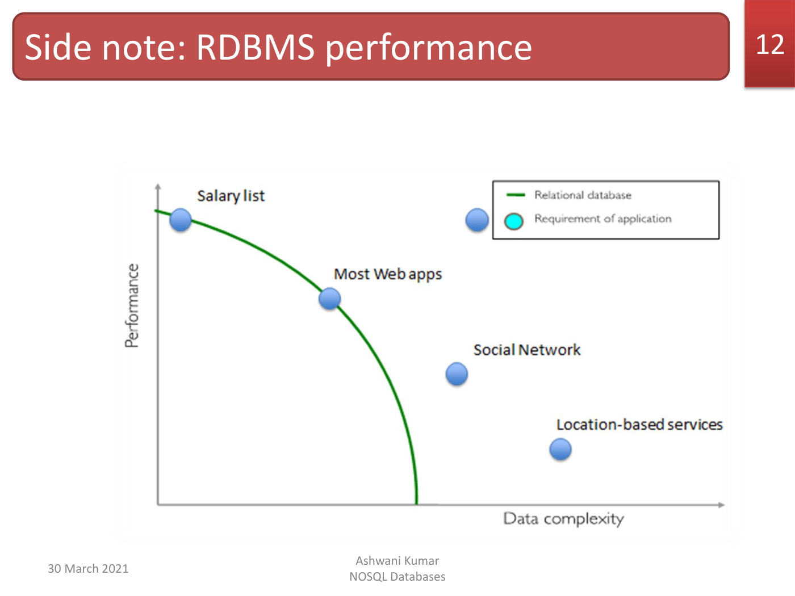
**ความสัมพันธ์ระหว่างความซับซ้อนและประสิทธิภาพของ RDBMS**

> [!INFO] กราฟ Performance vs Data Complexity
> ยิ่งข้อมูลซับซ้อน (เช่น ทำ Social Network หรือ Location-based services) กราฟประสิทธิภาพ (Performance) ของ Relational Database จะดิ่งหัวลงอย่างรวดเร็ว (ทำงานช้าลงอย่างเห็นได้ชัดเมื่อเทียบกับการเก็บข้อมูลตารางเงินเดือนปกติ)

---

## 💡 Slide 12: But.. What’s NoSQL?

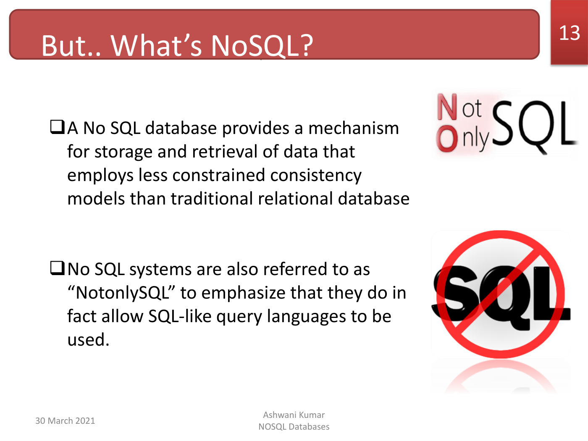
**NoSQL คืออะไร?**

- **ความหมายดั้งเดิม:** กลไกการเก็บและดึงข้อมูลที่ใช้กฎเรื่อง Consistency แบบผ่อนปรน (ยืดหยุ่นกว่า RDBMS)
- **ความหมายที่แท้จริง:** ปัจจุบัน NoSQL มักย่อมาจาก **"Not Only SQL"** (ไม่ได้มีแค่ SQL) เพราะจริงๆ แล้ว NoSQL บางตัวก็อนุญาตให้ใช้ภาษาคล้ายๆ SQL ในการคิวรีข้อมูลได้

---

## 🚫 Slide 13: Characteristics of NoSQL databases

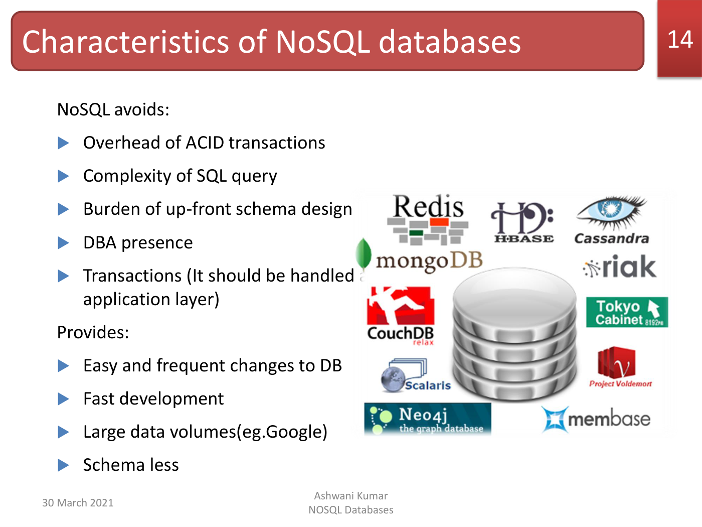
**ลักษณะเฉพาะและข้อดีของ NoSQL**

**สิ่งที่ NoSQL หลีกเลี่ยง (Avoids):**
- หลีกเลี่ยงภาระจาก ACID transactions ที่ทำให้ระบบช้า
- หลีกเลี่ยงคำสั่ง Query ที่ซับซ้อน
- **ไม่บังคับออกแบบ Schema ล่วงหน้า (Burden of up-front schema design)**
- การทำ Transaction จะถูกผลักไปให้โปรแกรมเมอร์จัดการใน Application layer แทนที่จะเป็นภาระของ Database

**สิ่งที่ NoSQL ให้มา (Provides):**
- เปลี่ยนแปลงรูปแบบโครงสร้างข้อมูลง่าย (Easy and frequent changes)
- พัฒนาโปรแกรมได้ไว (Fast development)
- รับมือข้อมูลระดับ Google ได้ (Large data volumes)
- **Schema less (ไร้โครงสร้างตายตัว)**

---

## ⚖️ Slide 14: When and When not to use it?

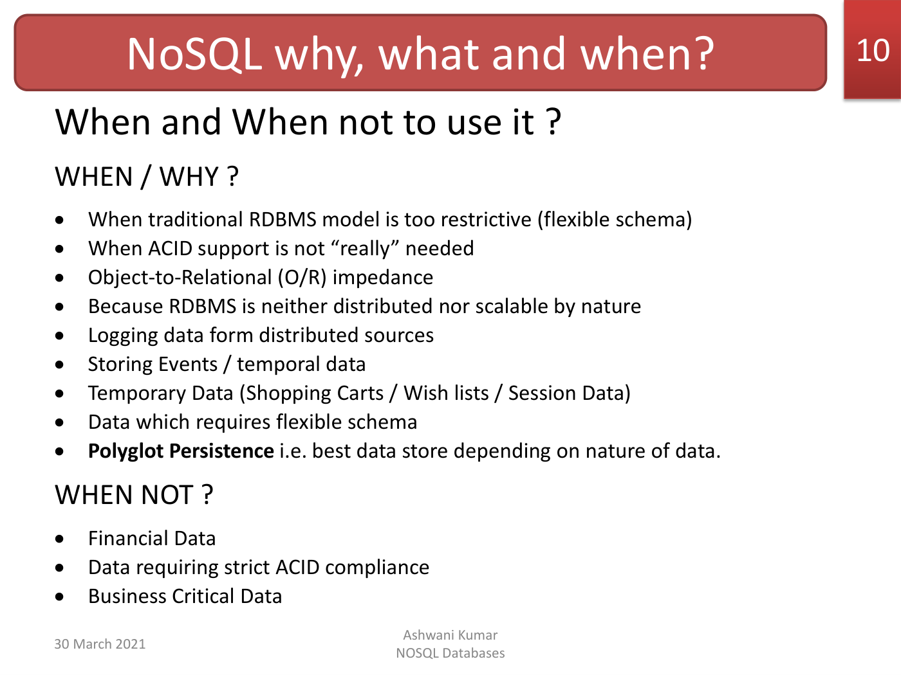
**เมื่อไหร่ควรใช้ และไม่ควรใช้ NoSQL**

> [!TIP] **WHEN / WHY? (เมื่อไหร่ควรใช้ NoSQL)**
> - เมื่อตาราง SQL แบบเดิมมันตึงเกินไป (ต้องการ Flexible schema)
> - เมื่อระบบไม่ได้แคร์ความเป๊ะระดับ ACID ขนาดนั้น (เช่น ยอดไลก์ Facebook ผิดไป 2 ไลก์ก็ไม่เป็นไร)
> - ใช้เก็บข้อมูล Log หรือ Events ที่สาดเข้ามาจากหลายๆ เซิร์ฟเวอร์
> - ใช้เก็บข้อมูลชั่วคราว (ตะกร้าสินค้า, Session)
> - การทำ **Polyglot Persistence** (ใช้ Database หลายชนิดปนกันในโปรเจกต์เดียว เลือกใช้ตามความถนัดของงาน)

> [!WARNING] **WHEN NOT? (ข้อห้าม! ห้ามใช้ NoSQL เมื่อ...)**
> - ข้อมูลทางการเงิน (Financial Data) ที่เงินหาย 1 สตางค์ก็ติดคุก
> - ระบบที่ต้องการ ACID compliance แบบ 100% (ข้อมูลต้องสอดคล้องเป๊ะๆ ตลอดเวลา)
> - ข้อมูลที่เป็นความคอขาดบาดตายของธุรกิจ (Business Critical Data)

---

## 🌟 Slide 15: NoSQL is getting more & more popular

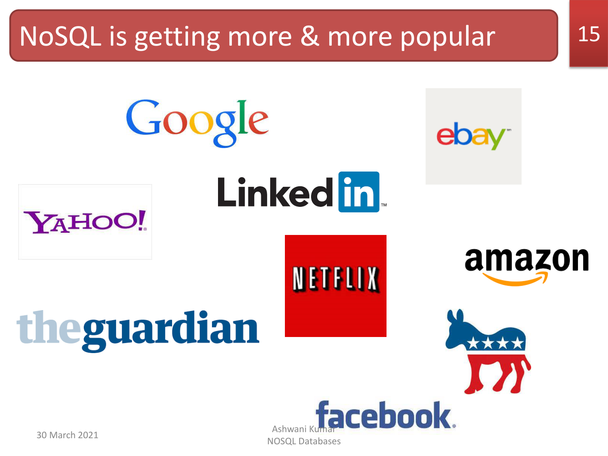
**ความนิยมของ NoSQL**

บริษัทระดับโลกที่หันมาใช้ NoSQL เป็นแกนหลัก: Google, eBay, LinkedIn, Yahoo!, Netflix, Amazon, Facebook, The Guardian ฯลฯ

---

## 🔓 Slide 16: What is a schema-less data model?

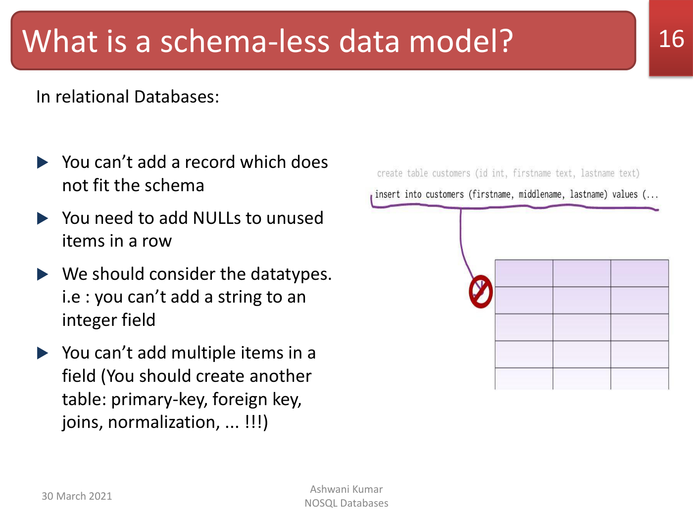
**Schema-less คืออะไร? (เปรียบเทียบกับ RDBMS)**

**ปัญหาของ Relational Database:**
- คุณไม่สามารถยัดข้อมูลที่ไม่ตรงกับ Schema เข้าไปได้ (ช่องไม่พอ)
- ถ้ามีช่องว่างไม่ได้ใช้ คุณก็ต้องฝืนยัดค่า `NULL` เข้าไป เปลืองพื้นที่
- ชนิดข้อมูลตายตัวมาก (ยัด Text ใส่คอลัมน์ Integer ระบบจะด่าทันที)
- ถ้าข้อมูลซ้อนทับกันเยอะๆ คุณต้องแตกตารางไปทำ Normalization จนปวดหัว

---

## 📂 Slide 17: What is a schema-less data model? (cont.)

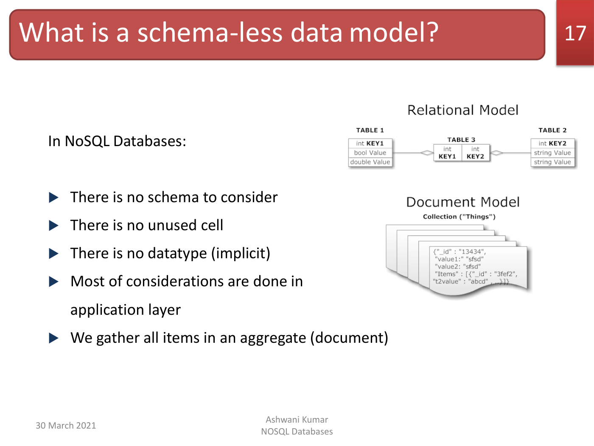
**ความยืดหยุ่นของ Schema-less ใน NoSQL**

**สวรรค์ของ NoSQL:**
- ไม่มี Schema ให้ต้องปวดหัว (อยากยัดอะไรก็ยัด)
- ไม่มีช่องว่างที่ไม่ได้ใช้ (ไม่เปลืองพื้นที่)
- ชนิดข้อมูลเป็นแบบ Implicit (ยืดหยุ่น)
- สิ่งที่ DBMS ควรคิด จะถูกโยนให้ Application (ตัวโค้ดโปรแกรม) คิดแทน
- **การเก็บข้อมูล:** ยัดข้อมูลทุกอย่างที่เกี่ยวข้องกันไว้ในก้อนเดียว (Aggregate / Document) ได้เลย ไม่ต้องหั่นแยกตาราง

---

## 🏛️ Slide 18: Aggregate Data Models

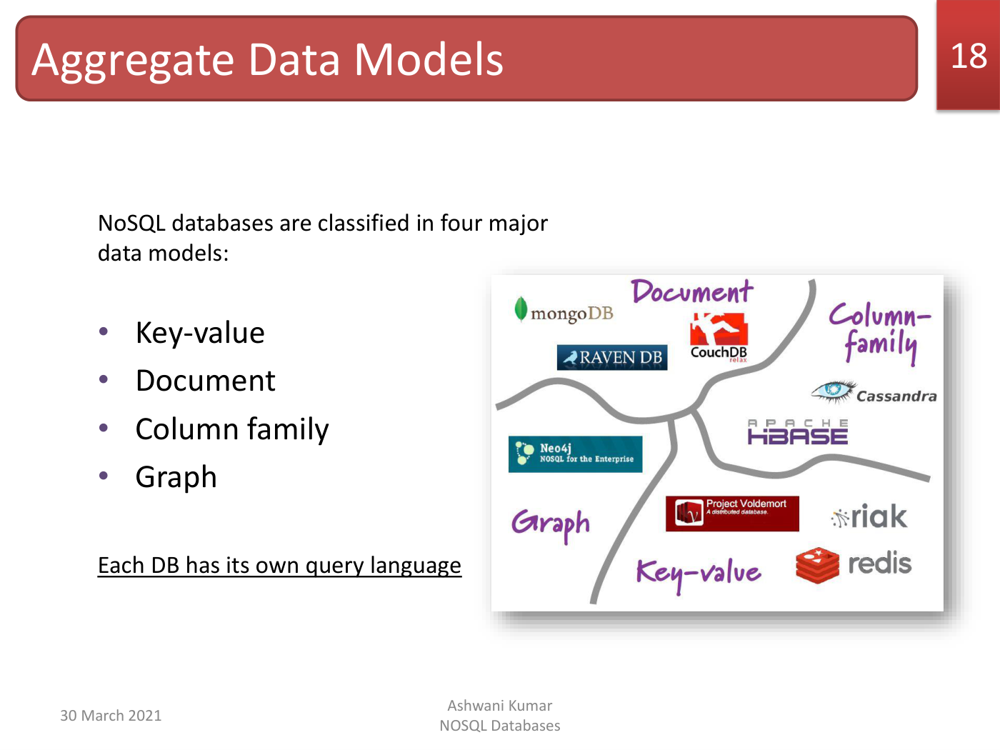
**4 ตระกูลหลักของ NoSQL**

NoSQL แบ่งออกเป็น 4 รูปแบบสถาปัตยกรรม (Data models) ซึ่งแต่ละตัวก็จะมีภาษาคิวรีเป็นของตัวเอง:
1. **Key-value** (เช่น Redis, Riak, Voldemort)
2. **Document** (เช่น MongoDB, CouchDB)
3. **Column family** (เช่น Cassandra, HBase)
4. **Graph** (เช่น Neo4j)

---

## 🔑 Slide 19: Key-value data model

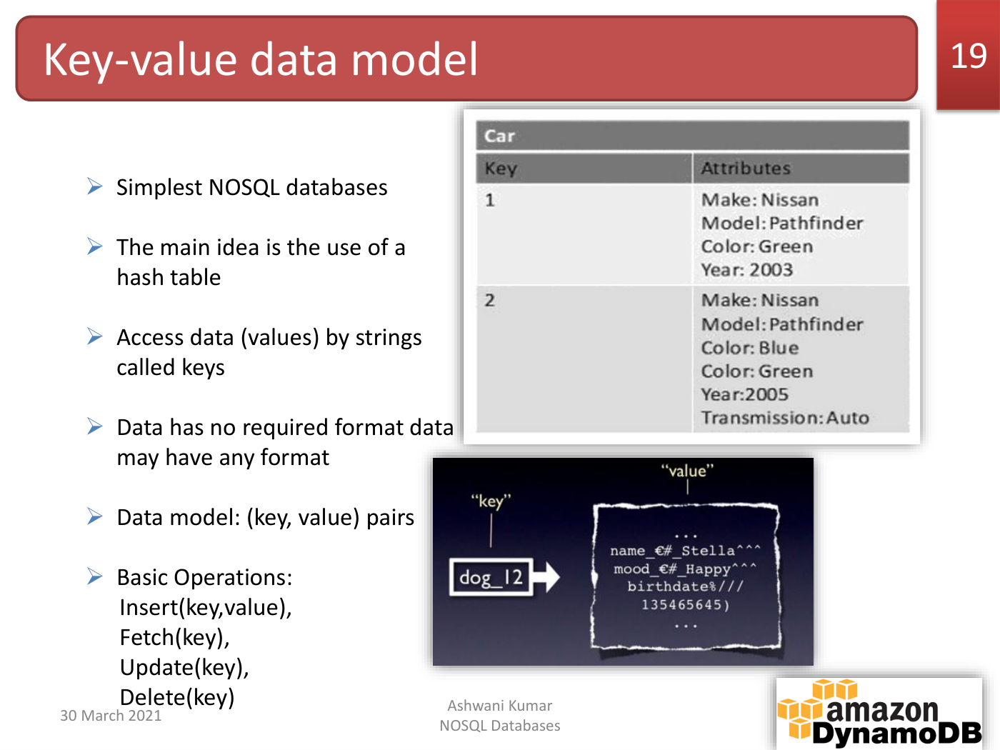
**1. ฐานข้อมูลแบบ Key-Value**

- **ลักษณะ:** เป็น NoSQL ที่เรียบง่ายที่สุด (Simplest)
- **หลักการทำงาน:** ทำงานเหมือน "Hash table" ข้อมูลจะมาเป็นคู่เสมอคือ กุญแจ (Key) จับคู่กับ ค่า (Value)
- **ความยืดหยุ่น:** ก้อน Value จะเป็นข้อมูลหน้าตาแบบไหนก็ได้ ไร้ระเบียบแบบสุดๆ
- **การทำงานพื้นฐาน:** `Insert(key, value)`, `Fetch(key)`, `Update(key)`, `Delete(key)`
- **ตัวอย่าง:** Amazon DynamoDB

---

## 🏛️ Slide 20: Column family data model

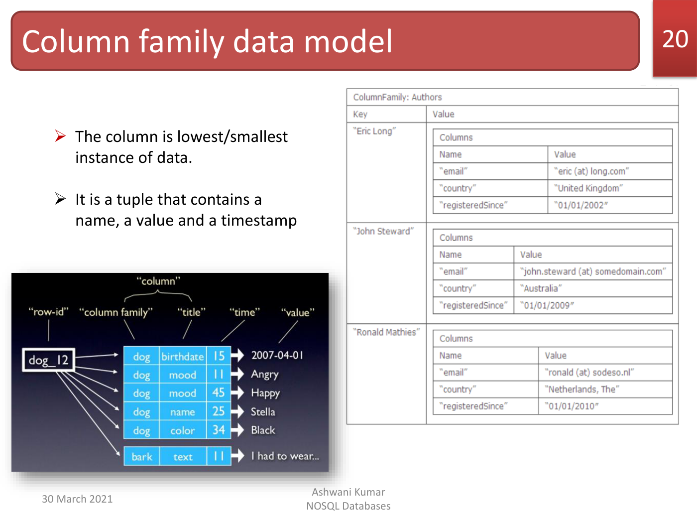
**2. ฐานข้อมูลแบบ Column family**

- **ลักษณะ:** "Column (คอลัมน์)" คือหน่วยข้อมูลที่เล็กที่สุด
- คอลัมน์ 1 ก้อน (Tuple) จะประกอบไปด้วย 3 สิ่งเสมอ: `Name` (ชื่อ), `Value` (ค่า), และ `Timestamp` (เวลาที่บันทึก)
- **หลักการ:** แทนที่จะมองข้อมูลเป็น "แถว" แบบตาราง SQL มันจะมองข้อมูลเป็น "ตระกูลของคอลัมน์ (Column Family)" ซึ่งเหมาะมากกับการวิเคราะห์ข้อมูลเฉพาะคอลัมน์นั้นๆ ข้ามไปหลายล้านบรรทัดโดยไม่ต้องโหลดคอลัมน์อื่นมาให้หนักเครื่อง

---

## ⚡ Slide 21: Column family data model (Cassandra)

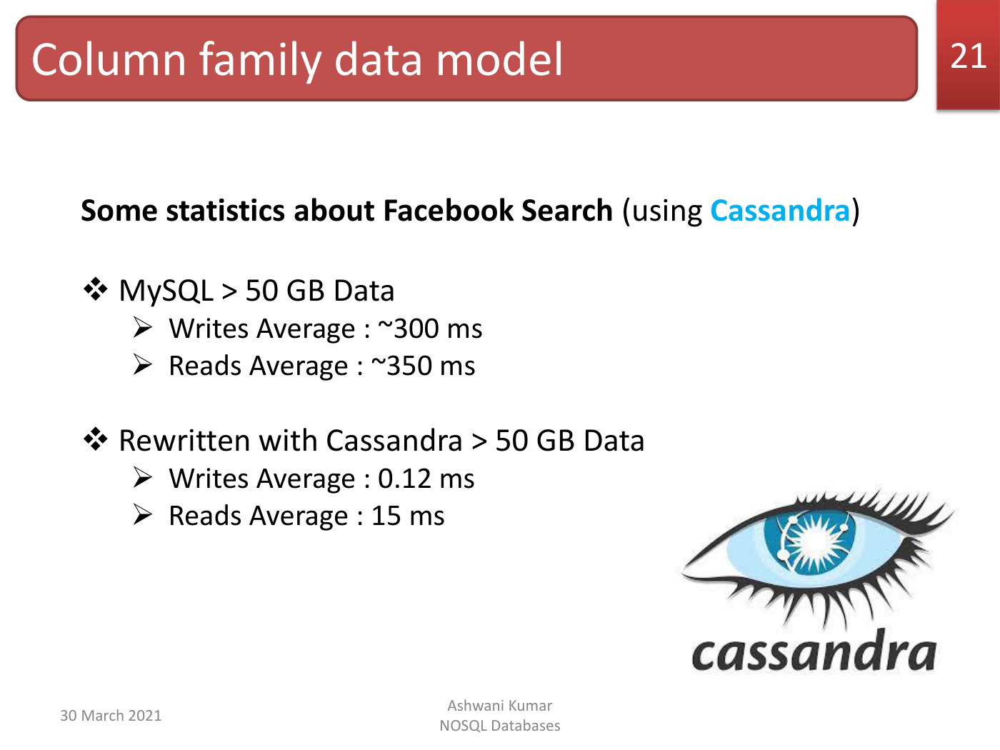
**สถิติการใช้งานจริงของ Column family (Facebook Search)**

Facebook เปลี่ยนระบบค้นหามาใช้ **Cassandra**:
> [!EXAMPLE] การอัปเกรดระบบ
> **สมัยใช้ MySQL (ข้อมูล 50 GB):**
> - ความเร็วตอนเขียน (Writes Average): ~300 ms
> - ความเร็วตอนอ่าน (Reads Average): ~350 ms
> 
> **เมื่อเขียนระบบใหม่ด้วย Cassandra (ข้อมูล 50 GB เท่ากัน):**
> - ความเร็วตอนเขียน: **0.12 ms** (เร็วขึ้นมหาศาลมโหฬาร!)
> - ความเร็วตอนอ่าน: **15 ms**

---

## 🕸️ Slide 22: Graph data model

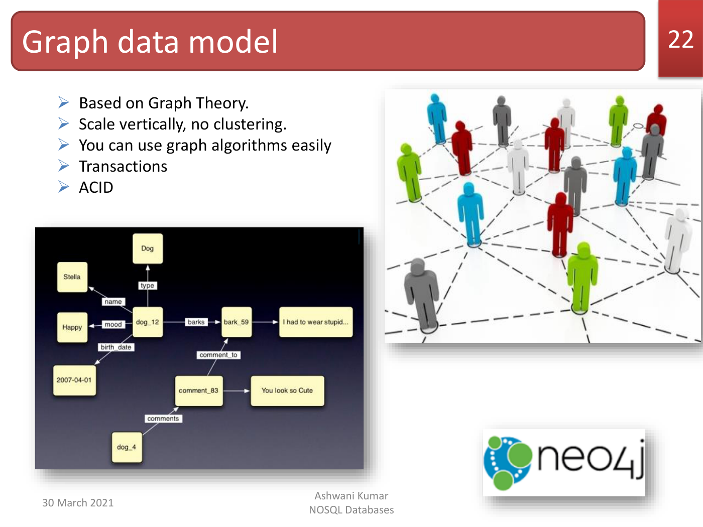
**3. ฐานข้อมูลแบบ Graph**

- **ลักษณะ:** มีพื้นฐานมาจากทฤษฎีกราฟ (Graph Theory) เก็บข้อมูลเป็น Node (จุด) และ Edge (เส้นเชื่อมความสัมพันธ์)
- **จุดเด่น:** ขยายตัวแบบแนวตั้ง (Scale vertically), มีการใช้ Transaction และรองรับ ACID ด้วย!
- นำ Algorithm ทางกราฟ (เช่น หาทางสั้นสุด, หาลูกโซ่ความสัมพันธ์เพื่อนของเพื่อน) มาใช้ได้อย่างง่ายดาย
- **ตัวอย่างยี่ห้อ:** Neo4j

---

## 📄 Slide 23: Document based data model

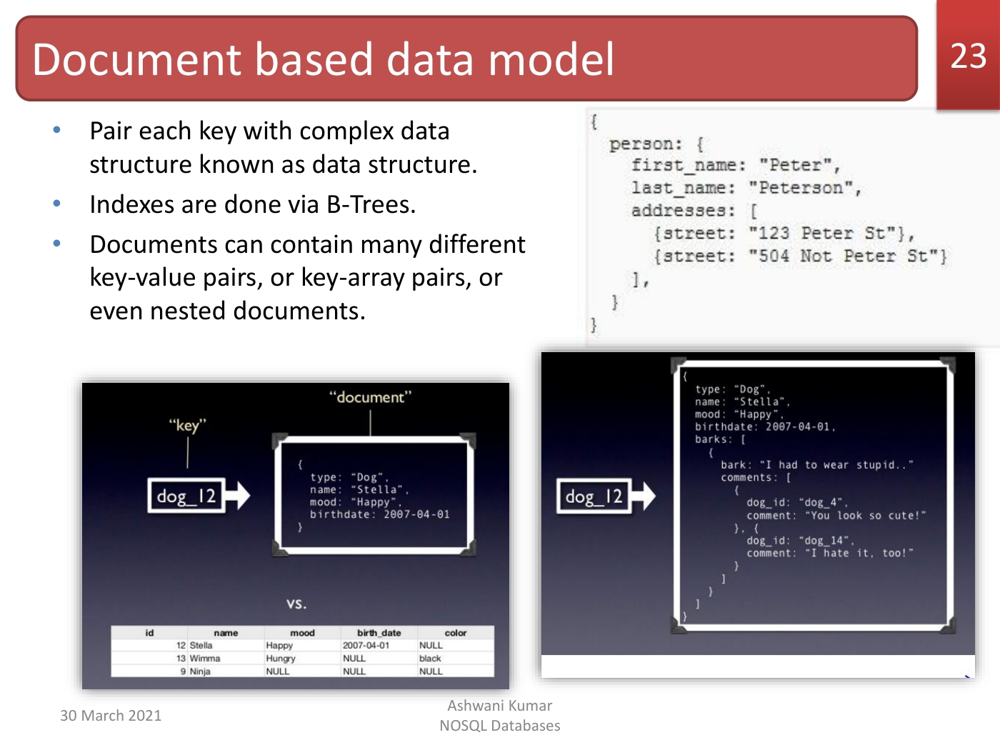
**4. ฐานข้อมูลแบบ Document**

- **ลักษณะ:** คล้าย Key-Value แต่ฝั่ง Value จะเก็บโครงสร้างที่ซับซ้อนที่เรียกว่า **"Document"** (มักจะมาในรูปแบบ JSON หรือ XML)
- **จุดเด่น:** สร้าง Index ผ่านโครงสร้างแบบ B-Trees
- ในหนึ่ง Document สามารถมีตัวแปรซ้อนข้างใน (Nested documents) กี่ยศกี่ชั้นก็ได้! เช่น ข้อมูลสุนัข 1 ตัว เก็บตารางชื่อ, เห่า, ประวัติวัคซีน ซ้อนไว้ในไฟล์ JSON ก้อนเดียวได้เลย
- **ตัวอย่างยี่ห้อ:** MongoDB, CouchDB

---

## 📱 Slide 24: Document based data model (UI Mapping)

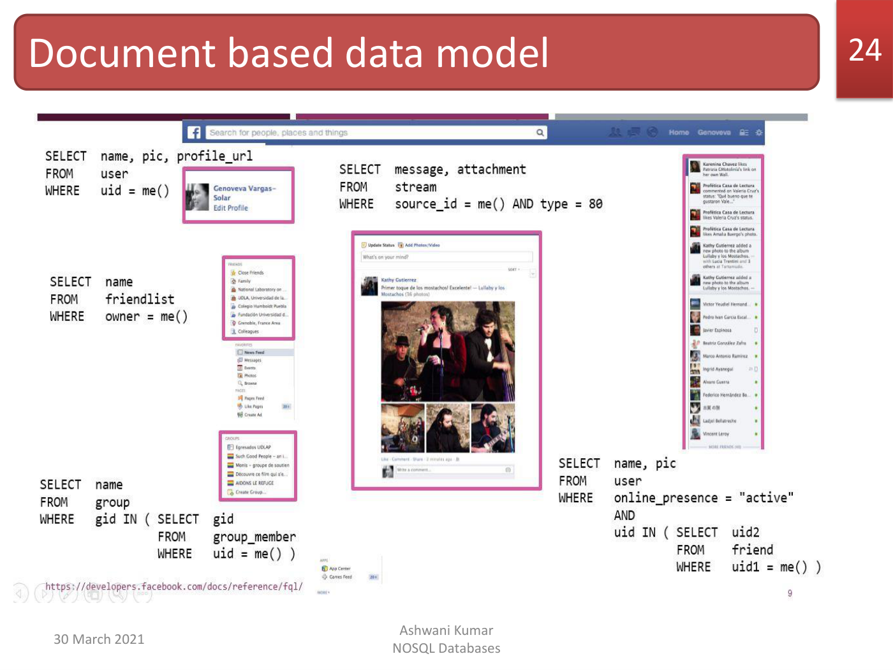
**ตัวอย่างการนำ Document ไปผูกกับหน้าจอ Facebook**

ในโลก NoSQL แบบ Document การออกแบบ Database มักจะทำแบบ "หน้าจอนึง ดึงข้อมูลก้อนเดียว (Document)" 
เช่น หน้า Profile ของ Facebook จะดึงก้อน JSON ที่เก็บ `name`, `pic`, `friendlist` มายัดใส่หน้าจอได้เลยใน Query เดียว ต่างจาก SQL ที่ต้อง JOIN ตาราง Friend, ตาราง User, ตาราง Post ให้วุ่นวาย

---

## ⚔️ Slide 25: SQL vs NOSQL

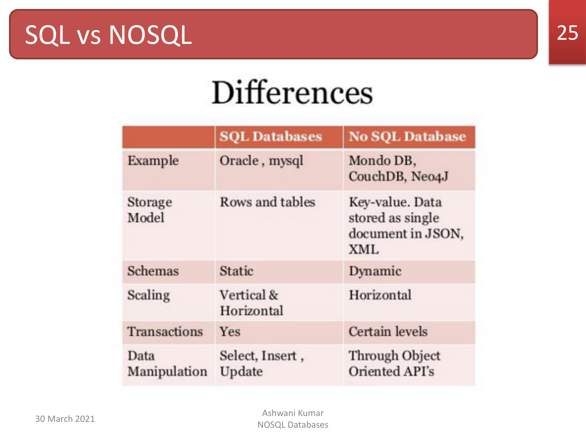
**ตารางเปรียบเทียบจุดแตกต่าง**

| หัวข้อ                        | SQL Databases                     | NoSQL Database                         |
| ----------------------------- | --------------------------------- | -------------------------------------- |
| **ตัวอย่าง (Example)**        | Oracle, MySQL                     | MongoDB, Neo4j, CouchDB                |
| **โครงสร้าง (Storage Model)** | Rows and tables (แถวและตาราง)     | Key-value, Document, Graph             |
| **โครงร่าง (Schemas)**        | Static (ตายตัว แก้ทีน้ำตาไหล)     | Dynamic (ยืดหยุ่น เพิ่มเมื่อไหร่ก็ได้) |
| **การขยายตัว (Scaling)**      | Vertical & Horizontal             | **Horizontal (ขยายแบบกองทัพมด)**       |
| **ความชัวร์ (Transactions)**  | Yes (มี ACID 100%)                | Certain levels (มีบ้าง ผ่อนปรนบ้าง)    |
| **การจัดการข้อมูล**           | ใช้คำสั่ง SQL (Select, Insert...) | ใช้ผ่าน Object Oriented API            |

---

## 🏗️ Slide 26: What we need ? (The Impossible DB)

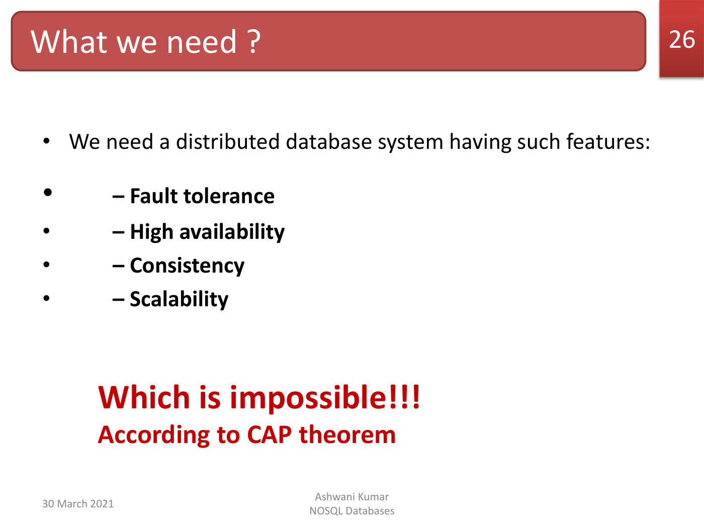
**ความฝันสูงสุดของการทำ Distributed Database**

เราทุกคนต่างใฝ่ฝันอยากได้ฐานข้อมูลแบบกระจายศูนย์ (Distributed database) ที่มี 4 พลังนี้ครบถ้วน:
1. **Fault tolerance:** เซิร์ฟเวอร์ตายไปเครื่องนึง ระบบต้องรันต่อได้
2. **High availability:** ระบบพร้อมใช้งาน 100% ตลอดกาล
3. **Consistency:** ข้อมูลทุกโหนดต้องอัปเดตตรงกันเป๊ะในเสี้ยววินาที
4. **Scalability:** ขยายระบบได้อย่างไร้ขีดจำกัด

**แต่ความจริงคือ:** **Which is impossible!!! (มันเป็นไปไม่ได้ตามกฎฟิสิกส์!)** 
เหตุผลก็คือสิ่งที่เรียกว่า... **CAP Theorem**

---

## 🔺 Slide 27: CAP theorem

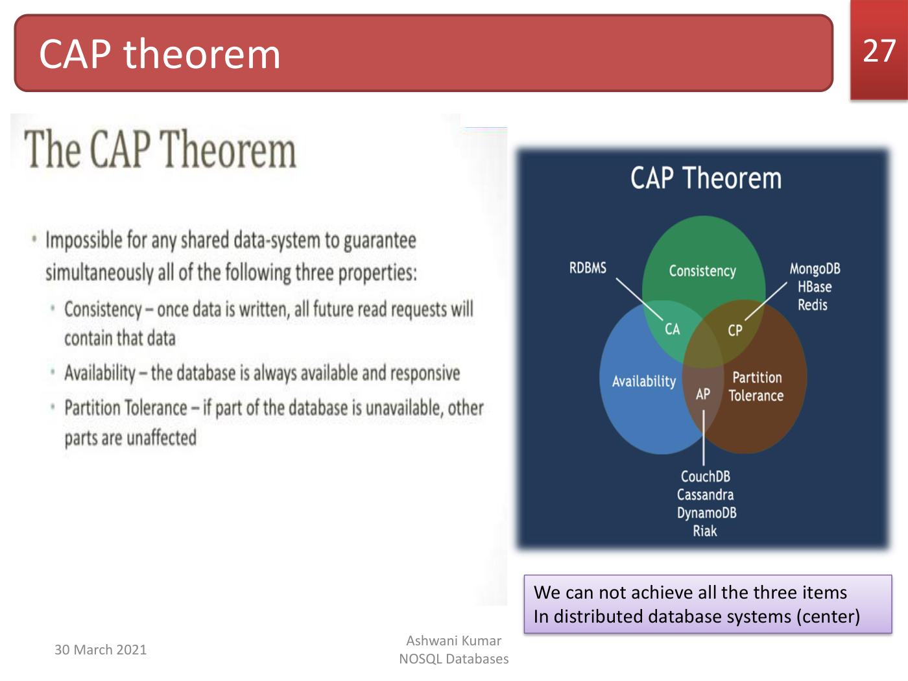
**ทฤษฎี CAP**

> [!IMPORTANT] The CAP Theorem
> เป็นไปไม่ได้เลยที่ฐานข้อมูลแบบกระจายศูนย์ (Distributed system) จะการันตีคุณสมบัติ 3 ข้อต่อไปนี้ได้พร้อมกัน 100%:
> 1. **C (Consistency - ความสอดคล้อง):** ข้อมูลใหม่ล่าสุดต้องกระจายไปทุกเซิร์ฟเวอร์เสร็จพร้อมกัน ใครอ่านตอนไหนต้องได้ข้อมูลเดียวกันเป๊ะ
> 2. **A (Availability - ความพร้อมใช้งาน):** ระบบต้องตอบสนองการอ่าน/เขียนตลอดเวลา ห้ามมีคำว่า "รอแป๊บ ระบบอัปเดตอยู่"
> 3. **P (Partition Tolerance - ความทนทานต่อการตัดขาด):** ต่อให้สายแลนขาด เซิร์ฟเวอร์สองฝั่งคุยกันไม่ได้ ระบบโดยรวมก็ต้องทำงานต่อไปได้

**กฎเหล็ก:** คุณ **"เลือกได้แค่ 2 ใน 3 อย่างเท่านั้น!"** (We can not achieve all the three items)

---

## 🔄 Slide 28: CAP theorem (Traditional vs NoSQL)

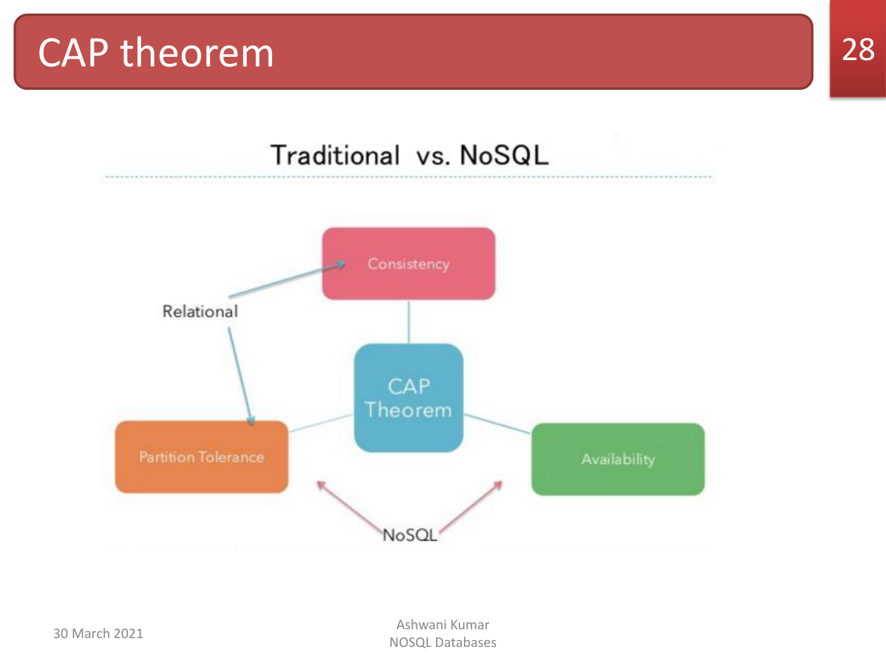
**การแลกเปลี่ยน (Trade-off) ใน CAP Theorem**

- **RDBMS (กลุ่ม CA):** เลือกความเป๊ะ (Consistency) และความพร้อม (Availability) แต่แลกมาด้วยการขยายเครื่องเป็น Cluster ยากมาก ถ้าสายแลนขาด ระบบล่มทันที
- **NoSQL กลุ่ม CP (เช่น MongoDB, HBase):** เลือก C และ P ถ้าระบบเครือข่ายมีปัญหา มันจะยอมปิดการใช้งาน (ทิ้ง A) จนกว่าข้อมูลจะตรงกัน 
- **NoSQL กลุ่ม AP (เช่น Cassandra, DynamoDB):** เลือก A และ P เน้นให้ระบบทำงานได้ตลอดเวลา แต่ยอมรับได้ที่ข้อมูลแต่ละโหนดอาจจะยังอัปเดตไม่ตรงกันชั่วคราว (Eventual Consistency)

---

## 🏁 Slide 29: Conclusion....

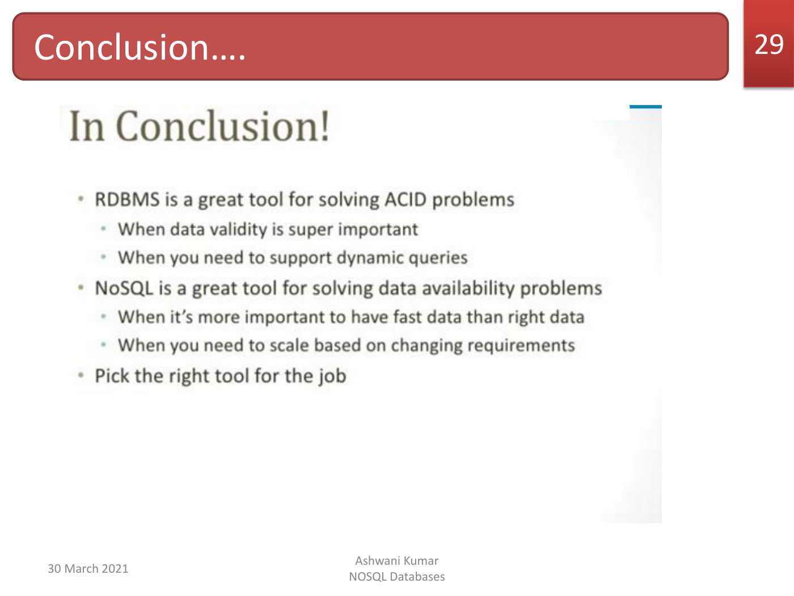
**บทสรุปการเลือกใช้งาน**

> [!TIP] สรุปสั้นๆ (In Conclusion!)
> - **RDBMS** คือเครื่องมือชั้นยอดสำหรับงานที่ต้องการแก้ปัญหา **ACID**
>   - ใช้เมื่อ "ความถูกต้องของข้อมูล (Validity)" สำคัญเหนือสิ่งอื่นใด (เช่น บัญชีธนาคาร)
>   - ใช้เมื่อโปรแกรมต้องมีการสืบค้นคิวรีที่ซับซ้อน
> - **NoSQL** คือเครื่องมือชั้นยอดสำหรับงานที่ต้องการ **Availability**
>   - ใช้เมื่อ "การได้ข้อมูลเร็วๆ" สำคัญกว่า "ข้อมูลที่เป๊ะ 100%" (เช่น ยอดเข้าชมเว็บ)
>   - ใช้เมื่อคุณต้องการขยายระบบแบบยืดหยุ่นตาม Requirement ที่เปลี่ยนทุกวัน
> 
> **จงเลือกเครื่องมือให้ตรงกับเนื้องาน (Pick the right tool for the job)**

---

## 📚 Slide 30: References

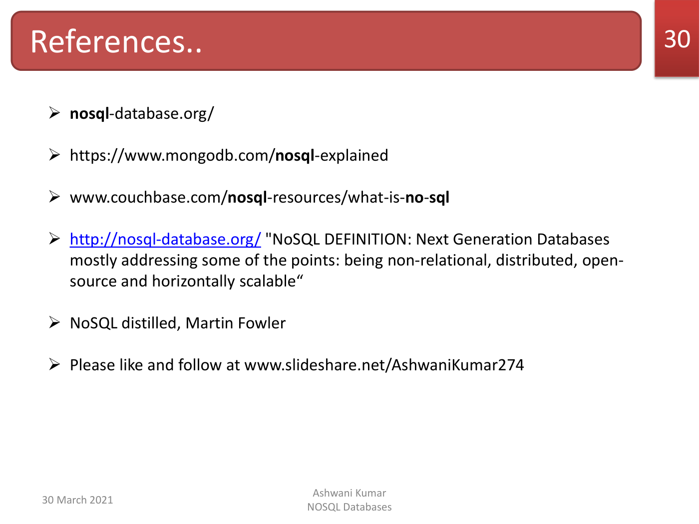
**เอกสารอ้างอิง**

- nosql-database.org/
- mongodb.com/nosql-explained
- couchbase.com/nosql-resources/what-is-no-sql
- NoSQL distilled, Martin Fowler

---

## 🙏 Slide 31: Thanks...

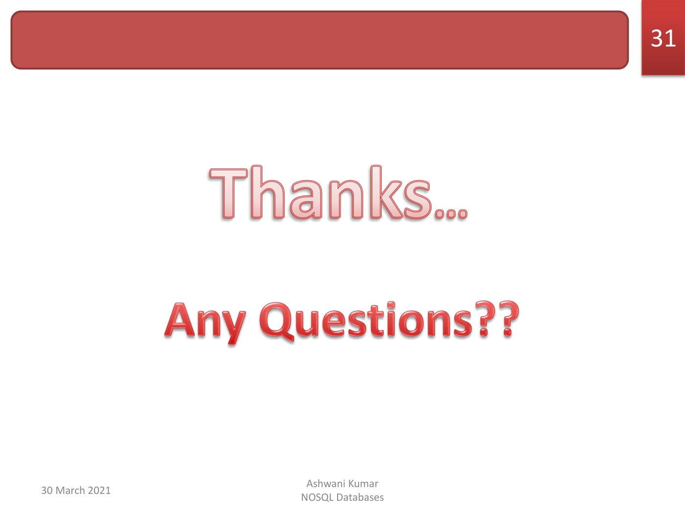
**จบการนำเสนอ**
Any Questions??

---

# References
- **Course:** Database System
- **Chapter:** Lecture 9 - NoSQL Databases (Enabling Extreme Scalability with NoSQL)
- **Slides:** 31 slides (Complete Detailed Revision)

---
*Last updated: 2026-07-07*
