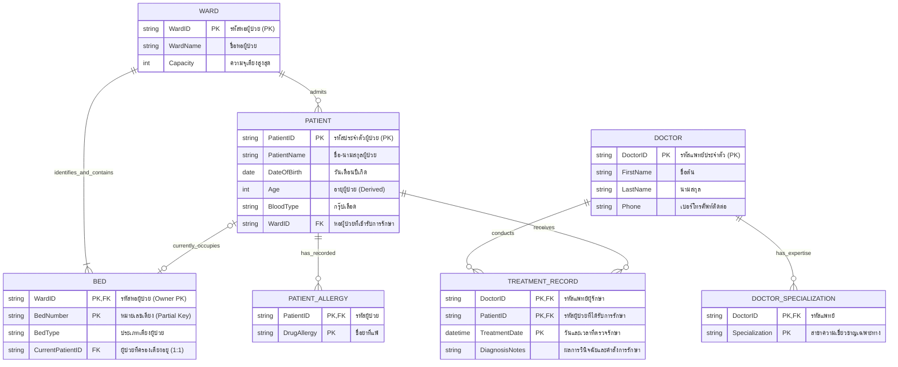
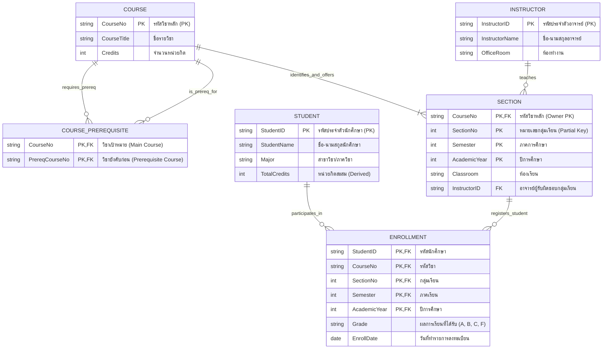
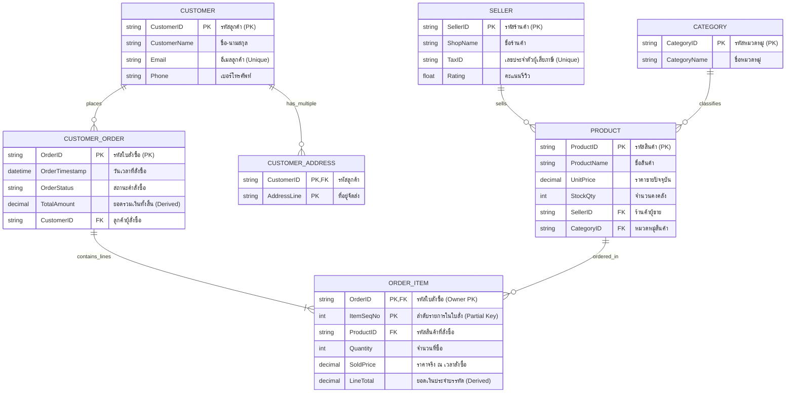
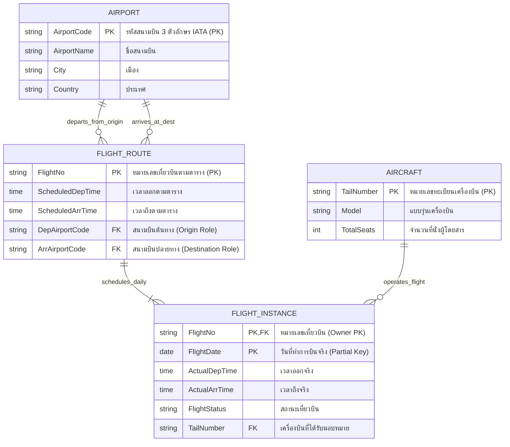
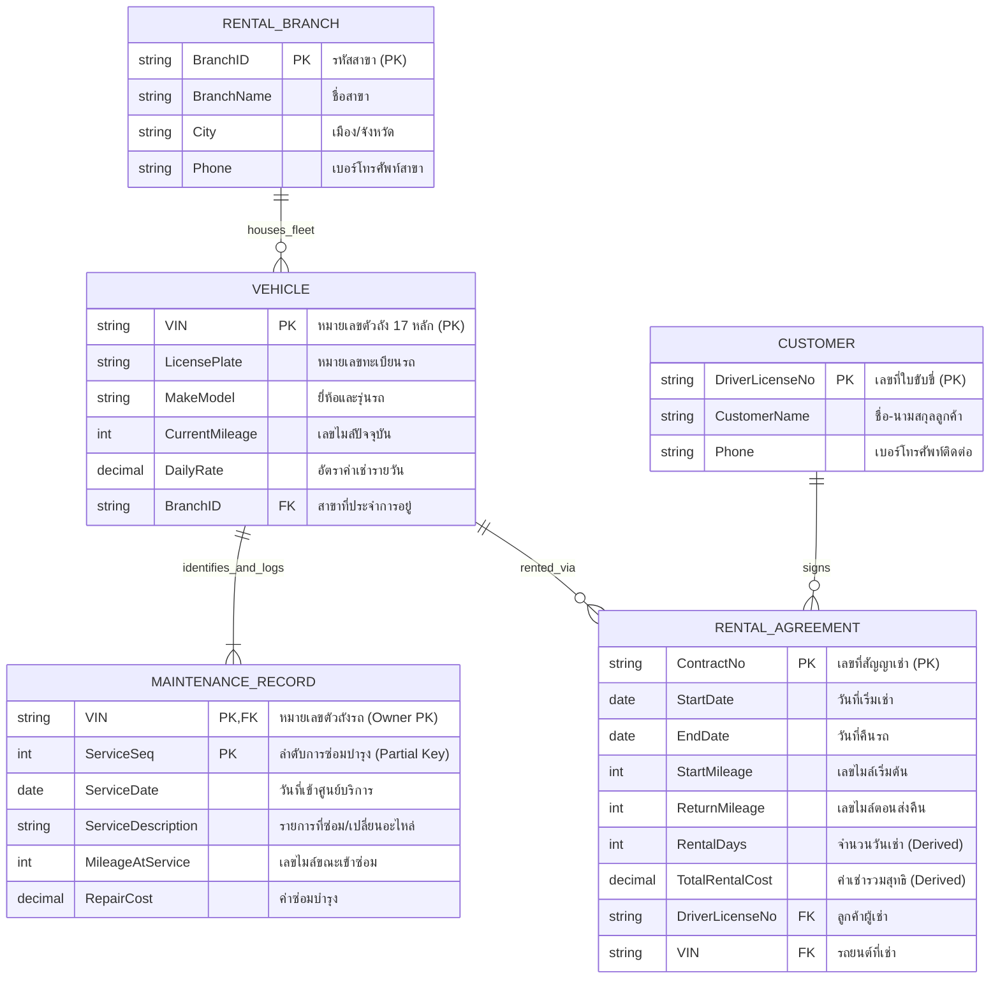
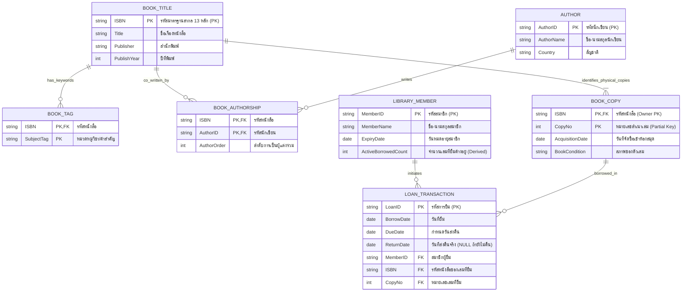
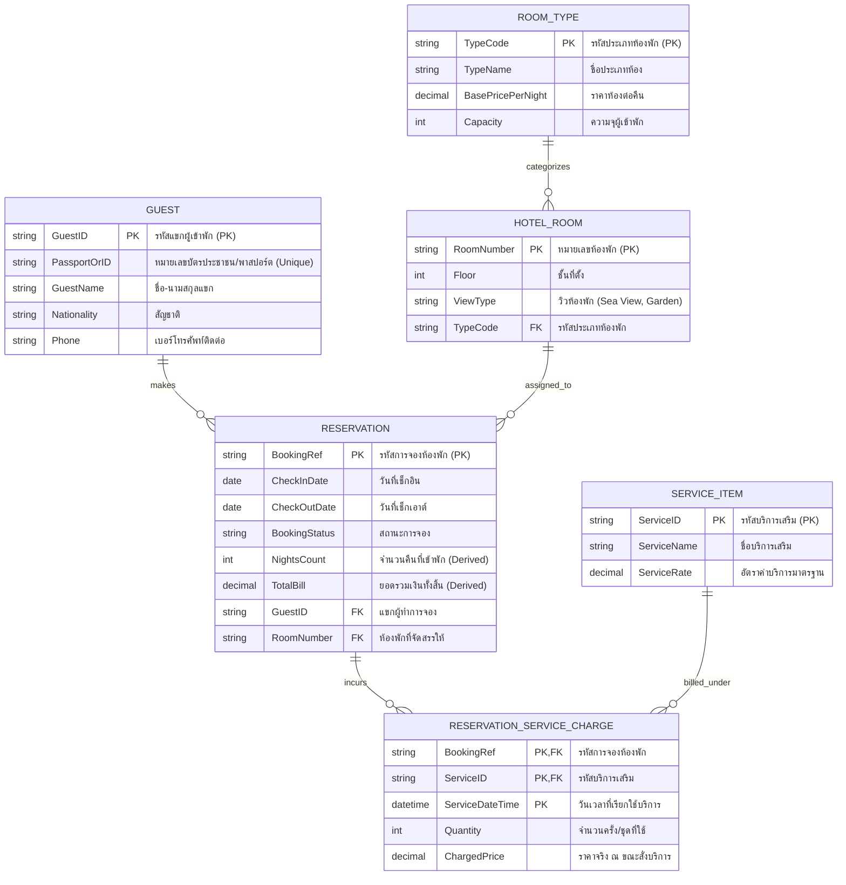
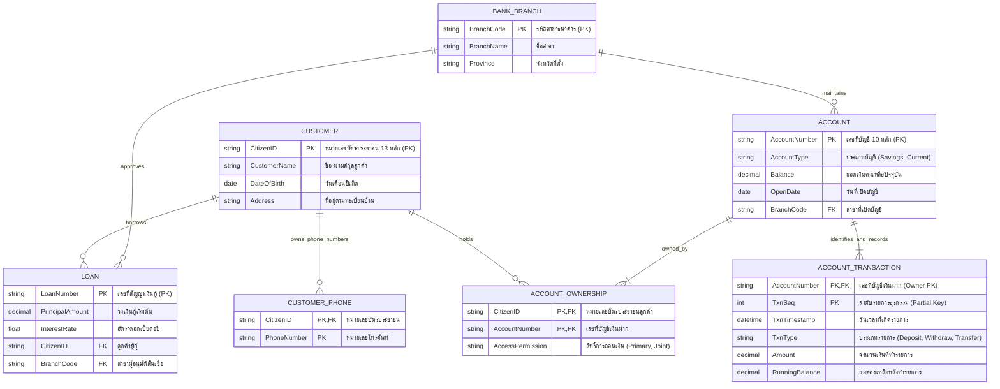
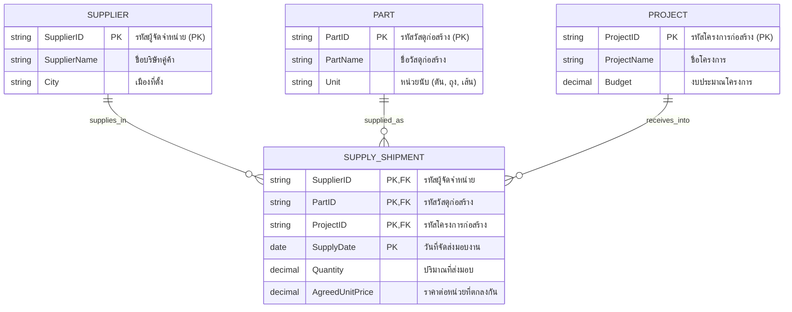
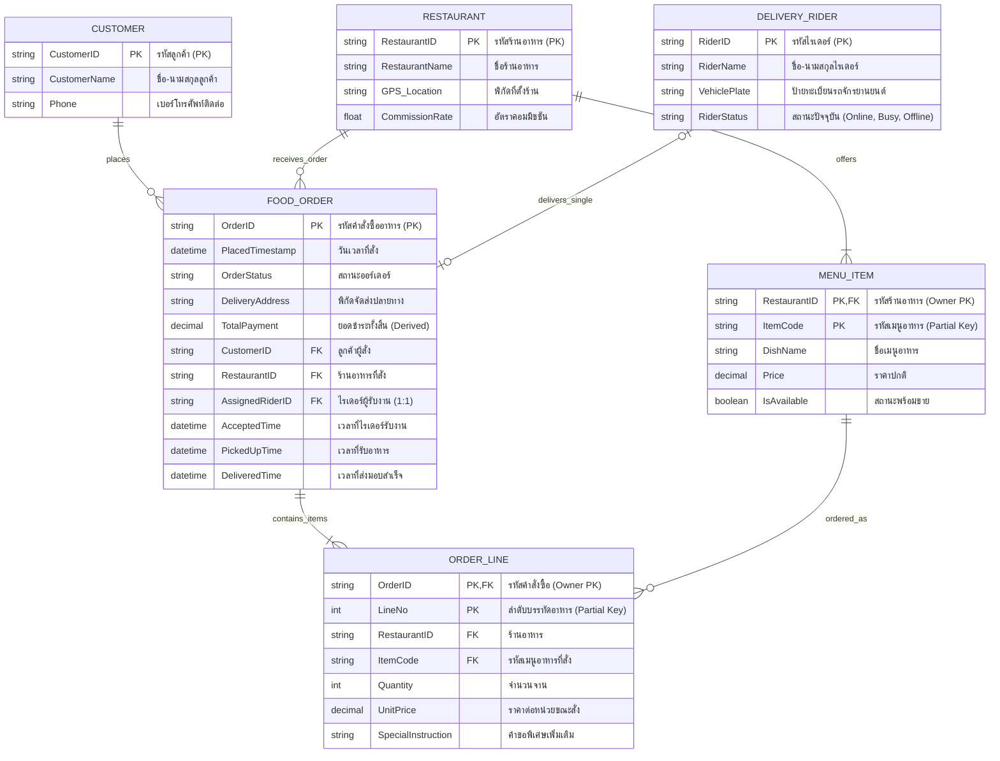

---
tags:
  - database
  - er-model
  - exam
  - practice
  - relational-schema
  - conceptual-design
created: 2026-09-15
updated: 2026-09-15
type: exam-guide
---

# คลังข้อสอบอัตนัยและการออกแบบ: 10 ข้อสอบจำลอง ER Diagram พร้อมเฉลยละเอียดตามหลักสากล

> [!SUMMARY] **วัตถุประสงค์ของคู่มือเตรียมสอบชุดนี้ (Master ER Modeling Exam):**
> แบบฝึกหัดชุดนี้ได้รับการออกแบบขึ้นเพื่อฝึกฝนทักษะการสร้างแบบจำลองข้อมูลเชิงแนวคิด (**Conceptual Data Modeling**) ด้วย **Entity-Relationship Model (ER Model)** ตามมาตรฐานสากลและหลักสูตรวิชาระบบฐานข้อมูลระดับมหาวิทยาลัย ครอบคลุมกฎเกณฑ์ทางธุรกิจที่ซับซ้อนในชีวิตจริง 10 โดเมนหลัก
> - **สัญลักษณ์และมาตรฐาน:** อธิบายเทียบเคียงระหว่างมาตรฐานดั้งเดิมของ **Peter Chen Notation** และสัญกรณ์สมัยใหม่แบบ **Crow's Foot / Information Engineering**
> - **การจำแนกประเภทเอนทิตี:** Regular Entity (Strong Entity) vs. Weak Entity Type พร้อม Identifying Relationship
> - **การวิเคราะห์แอตทริบิวต์:** Simple/Atomic, Composite, Multi-valued (`{{...}}`), Derived (`[...]`), Key Attribute (`<u>...</u>`), และ Partial Key / Discriminator
> - **ข้อกำหนดโครงสร้าง (Structural Constraints):** Cardinality Ratios (`1:1`, `1:N`, `M:N`), Participation Constraints (Total vs. Partial Participation), และ `(min, max)` Notation
> - **ความสัมพันธ์ระดับสูง:** Unary / Recursive Relationship (ความสัมพันธ์แบบเวียนเกิด) และ Ternary Relationship (ความสัมพันธ์แบบ 3 เอนทิตีร่วม)
> - **การแปลงรูปเป็นฐานข้อมูลจริง (ER-to-Relational Mapping):** ถ่ายทอดผลลัพธ์จากแผนภาพ ER สู่โครงสร้างตารางเชิงสัมพันธ์ (Relational Schema) พร้อมกำหนด Primary Key (PK) และ Foreign Key (FK) ครบทุกขั้นตอน

---

## สารบัญข้อสอบจำลอง 10 ข้อ (Table of Contents)

1. [[#ข้อที่ 1: ระบบบริหารจัดการผู้ป่วยในและหอผู้ป่วยโรงพยาบาล (Hospital Inpatient Ward & Patient Care System)]]
   - *ประเด็นหลัก:* Weak Entity (`BED` ขึ้นกับ `WARD`), Multi-valued (`Specialization`, `DrugAllergy`), Derived Attribute (`Age`), ความสัมพันธ์แบบ 1:1, 1:N, M:N
2. [[#ข้อที่ 2: ระบบลงทะเบียนเรียนและวิชาบังคับก่อนของมหาวิทยาลัย (University Course Enrollment & Prerequisite System)]]
   - *ประเด็นหลัก:* Recursive Relationship (วิชาบังคับก่อน `PREREQUISITE`), M:N พร้อม Relationship Attribute (`Grade`), Weak Entity `SECTION` ขึ้นกับ `COURSE`
3. [[#ข้อที่ 3: แพลตฟอร์มมาร์เก็ตเพลสออนไลน์แบบหลายร้านค้า (E-Commerce Multi-Vendor Marketplace)]]
   - *ประเด็นหลัก:* Multi-vendor catalog, Weak/Associative Entity (`ORDER_ITEM`), Derived `TotalAmount`, ความสัมพันธ์ 1:N และ N:1 เชื่อมโยงหลายทิศทาง
4. [[#ข้อที่ 4: ระบบสายการบิน จัดการตารางบินและกำหนดเครื่องบินรายวัน (Airline Flight Scheduling & Aircraft Assignment)]]
   - *ประเด็นหลัก:* Abstract Schedule (`FLIGHT_ROUTE`) vs. Concrete Operation (`FLIGHT_INSTANCE`), บทบาทสนามบินต้นทาง-ปลายทาง (Role Names)
5. [[#ข้อที่ 5: ระบบบริการเช่ารถยนต์และประวัติการซ่อมบำรุงตามระยะ (Car Rental Fleet & Vehicle Maintenance Tracking)]]
   - *ประเด็นหลัก:* Weak Entity (`MAINTENANCE_RECORD` พึ่งพา `VEHICLE`), Total Participation ในสัญญาเช่า, Derived Attribute (`RentalDurationDays`)
6. [[#ข้อที่ 6: ระบบห้องสมุดประชาชนและการจัดหมวดหมู่หนังสือหลายผู้แต่ง (Public Library Multi-Author & Copy Tracking System)]]
   - *ประเด็นหลัก:* หนังสือชื่อเรื่อง (`BOOK_TITLE`) กับตัวเล่มจริง (`BOOK_COPY`), ความสัมพันธ์ M:N ระหว่างหนังสือและผู้ประพันธ์ (`AUTHOR`), รายการยืม (`LOAN`)
7. [[#ข้อที่ 7: ระบบจองห้องพักโรงแรมและแพ็กเกจบริการเสริม (Hotel Reservation & Ancillary Service Billing)]]
   - *ประเด็นหลัก:* ประเภทห้อง (`ROOM_TYPE`) กับห้องพักจริง (`HOTEL_ROOM`), ความสัมพันธ์ M:N สั่งบริการเสริม (`SERVICE_ITEM`), Derived `TotalBill`
8. [[#ข้อที่ 8: ระบบธนาคารพาณิชย์ บัญชีเงินฝากร่วมและสินเชื่อ (Commercial Banking Multi-Owner Accounts & Loans)]]
   - *ประเด็นหลัก:* บัญชีร่วม (Joint Account) แบบ M:N, ความสัมพันธ์ 1:N บัญชีกับสาขา, Weak Entity ประวัติธุรกรรม (`ACCOUNT_TRANSACTION`)
9. [[#ข้อที่ 9: ระบบจัดซื้อพัสดุก่อสร้างและความสัมพันธ์แบบเทอร์นารี (Construction Procurement & Ternary Relationship SUPPLY)]]
   - *ประเด็นหลัก:* ความสัมพันธ์ 3 เอนทิตีร่วม (`SUPPLIER`, `PART`, `PROJECT`), เหตุผลที่ไม่สามารถแยกเป็น 3 Binary ได้, การแปลงเป็น Relational Schema
10. [[#ข้อที่ 10: แพลตฟอร์มสั่งอาหารเดลิเวอรีและการกระจายงานไรเดอร์ (Food Delivery Dispatch Logistics Platform)]]
    - *ประเด็นหลัก:* Weak Entity เมนูอาหาร (`MENU_ITEM`), 1:1 ความสัมพันธ์มอบหมายงานจัดส่ง (`DELIVERY_TASK`), ติดตามสถานะและพิกัด GPS

---

## สรุปแม่บทหลักการออกแบบ ER Diagram และการแปลงเป็น Relational Schema

> [!DEFINITION] **นิยามและหลักการสำคัญของ ER Model (Entity-Relationship Model Core Concepts):**
> 1. **Entity Type (ชนิดของเอนทิตี):** แทนกลุ่มของสิ่งของ คน สถานที่ หรือวัตถุที่มีคุณสมบัติร่วมกันและจัดเก็บในฐานข้อมูลได้
>    - **Strong (Regular) Entity:** มี Primary Key ในตนเอง สามารถคงอยู่ได้โดยอิสระ ใช้สัญลักษณ์สี่เหลี่ยมผืนผ้าเส้นเดี่ยว
>    - **Weak Entity:** ไม่มีคีย์หลักสมบูรณ์ในตนเอง ต้องพึ่งพาการมีอยู่ของ Owner (Parent) Entity เสมอ ใช้สัญลักษณ์สี่เหลี่ยมผืนผ้าเส้นคู่
> 2. **Attribute Classification (การจำแนกแอตทริบิวต์):**
>    - **Simple / Atomic:** ค่าเชิงเดี่ยว แบ่งย่อยไม่ได้อีก เช่น `Gender`, `BloodType`
>    - **Composite:** ค่าเชิงประกอบที่แตกออกเป็นแอตทริบิวต์ย่อยได้ เช่น `Address (Street, City, ZipCode)`
>    - **Multi-valued:** มีได้หลายค่าพร้อมกันใน 1 เอนทิตี เช่น `PhoneNumbers`, `Specialization` ใช้สัญลักษณ์วงรีเส้นคู่
>    - **Derived:** ค่าที่คำนวณหรืออนุมานได้จากข้อมูลอื่น ไม่จำเป็นต้องเก็บจริง เช่น `Age` (คำนวณจาก `DateOfBirth`) ใช้สัญลักษณ์วงรีเส้นประ
>    - **Key Attribute:** แอตทริบิวต์ที่เป็นคีย์ระบุเอกลักษณ์ (Unique) ขีดเส้นใต้ทึบ (`<u>...</u>`)
>    - **Partial Key (Discriminator):** คีย์บางส่วนของ Weak Entity สำหรับแยกแยะสมาชิกภายใต้ Owner เดียวกัน ขีดเส้นใต้ประ
> 3. **Relationship Constraints (ข้อกำหนดความสัมพันธ์):**
>    - **Cardinality Ratio:** สัดส่วนความสัมพันธ์สูงสุดระหว่างสมาชิก ได้แก่ `1:1`, `1:N`, `N:1`, `M:N`
>    - **Participation Constraint:** การมีส่วนร่วม ได้แก่ **Total Participation (เส้นคู่)** สมาชิกทุกตัวต้องผูกพันในความสัมพันธ์ (min >= 1) และ **Partial Participation (เส้นเดี่ยว)** สมาชิกมีส่วนร่วมหรือไม่ก็ได้ (min = 0)
>    - **(min, max) Notation:** ระบุจำนวนสมาชิกขั้นต่ำ (min) และขั้นสูงสุด (max) ที่เอนทิตีเข้าร่วม เช่น `(1, 1)`, `(0, N)`, `(1, N)`

> [!INFO] **กฎ 7 ข้อในการแปลง ER Diagram สู่ Relational Schema (ER-to-Relational Mapping Rules):**
> - **กฎข้อที่ 1 (Regular Entity):** สร้างตารางแยกสำหรับแต่ละ Strong Entity โดยใช้ Key Attribute เป็น Primary Key (PK)
> - **กฎข้อที่ 2 (Weak Entity):** สร้างตารางแยกสำหรับแต่ละ Weak Entity โดยมี PK ประกอบด้วย (Owner PK + Partial Key) และ Owner PK จะทำหน้าที่เป็น Foreign Key (FK) ด้วย
> - **กฎข้อที่ 3 (1:1 Relationship):** นำ PK ของฝั่งที่มี Total Participation ไปเป็น FK ในอีกฝั่งหนึ่ง หรือหากทั้งสองฝั่งเป็น Total ให้รวมเป็นตารางเดียว
> - **กฎข้อที่ 4 (1:N Relationship):** นำ PK ของฝั่ง `1` (One-side) ไปเป็น FK ในตารางของฝั่ง `N` (Many-side) พร้อมนำ Relationship Attributes ไปใส่ในฝั่ง N
> - **กฎข้อที่ 5 (M:N Relationship):** สร้างตารางเชื่อมโยงใหม่ (Associative / Junction Table) โดยมี Composite PK ประกอบด้วย FK จากทั้งสองตารางรวมกัน และนำ Relationship Attributes มาเป็นคอลัมน์ในตารางนี้
> - **กฎข้อที่ 6 (Multi-valued Attribute):** สร้างตารางใหม่แยกต่างหาก โดยมี Composite PK ประกอบด้วย (Owner PK + Multi-valued Column)
> - **กฎข้อที่ 7 (N-ary / Ternary Relationship):** สร้างตารางเชื่อมโยงใหม่ที่มี Composite PK ประกอบด้วย FK จากทุกเอนทิตีที่เกี่ยวข้องรวมกัน

---

## ข้อที่ 1: ระบบบริหารจัดการผู้ป่วยในและหอผู้ป่วยโรงพยาบาล (Hospital Inpatient Ward & Patient Care System)

### 1.1 บริบทและข้อกำหนดทางธุรกิจ (Business Scenario & Requirements)
โรงพยาบาลศูนย์แห่งหนึ่งต้องการออกแบบฐานข้อมูลเพื่อรองรับการบริหารจัดการผู้ป่วยใน การครองเตียง และการให้การรักษาโดยแพทย์ผู้เชี่ยวชาญ โดยมีข้อกำหนดทางธุรกิจดังนี้:
1. **แพทย์ (Doctor):** แพทย์แต่ละคนมีรหัสแพทย์ (`DoctorID`) ที่ไม่ซ้ำกัน, ชื่อ-นามสกุล (`DoctorName` ซึ่งประกอบด้วย `FirstName` และ `LastName`), เบอร์โทรศัพท์สำหรับติดต่อฉุกเฉิน (`Phone`), และแพทย์หนึ่งคนอาจมีความเชี่ยวชาญเฉพาะทางได้หลายสาขา (`Specialization` เช่น โรคหัวใจ, อายุรกรรม, ศัลยกรรมระบบประสาท)
2. **ผู้ป่วย (Patient):** ผู้ป่วยแต่ละคนมีรหัสประจำตัวผู้ป่วย (`PatientID`) ที่ไม่ซ้ำกัน, ชื่อ-นามสกุล (`PatientName`), วันเดือนปีเกิด (`DateOfBirth`), กรุ๊ปเลือด (`BloodType`), และผู้ป่วยหนึ่งคนอาจมีประวัติแพ้ยาได้หลายชนิด (`DrugAllergy`) นอกจากนี้ระบบต้องสามารถแสดงอายุของผู้ป่วย (`Age`) ได้โดยอัตโนมัติ
3. **หอผู้ป่วย (Ward):** โรงพยาบาลแบ่งเป็นหอผู้ป่วยหลายแห่ง แต่ละหอผู้ป่วยมีรหัสหอ (`WardID`), ชื่อหอผู้ป่วย (`WardName` เช่น หอผู้ป่วยวิกฤต ICU, หออายุรกรรมชาย), และความจุเตียงสูงสุด (`Capacity`)
4. **เตียงผู้ป่วย (Bed):** แต่ละหอผู้ป่วยจะมีหมายเลขเตียง (`BedNumber` เช่น เตียง 01, เตียง 02) ซึ่งหมายเลขเตียงจะซ้ำกันได้ในต่างหอผู้ป่วย ดังนั้น `BedNumber` เพียงอย่างเดียวไม่สามารถระบุตัวตนข้ามหอผู้ป่วยได้ และมีประเภทของเตียง (`BedType` เช่น เตียงธรรมดา, เตียงไฟฟ้าปรับระดับ)
5. **กฎเกณฑ์ความสัมพันธ์ (Relationship Rules):**
   - **การรับผู้ป่วยเข้าหอผู้ป่วย (`ADMITTED_TO`):** ผู้ป่วยในแต่ละคนต้องถูกส่งตัวเข้ารับการรักษาในหอผู้ป่วย **แน่นอน 1 หอผู้ป่วยเสมอ** (Total Participation ฝั่ง Patient) ในขณะที่หอผู้ป่วย 1 หอสามารถรองรับผู้ป่วยได้หลายคน หรืออาจยังไม่มีผู้ป่วยเลยก็ได้ (0 ถึง N คน)
   - **การครองเตียง (`OCCUPIES`):** ผู้ป่วยใน 1 คนจะครองเตียงได้ **ไม่เกิน 1 เตียง** (0 หรือ 1 เตียง เนื่องจากขณะจำหน่ายกลับบ้านอาจยังไม่ได้ครองเตียง) และเตียง 1 เตียงสามารถมีผู้ป่วยครองได้ **ไม่เกิน 1 คนในเวลาเดียวกัน** (0 หรือ 1 คน)
   - **การรักษาโดยแพทย์ (`TREATS`):** แพทย์ 1 คนสามารถให้การรักษาผู้ป่วยได้หลายคน และผู้ป่วย 1 คนอาจได้รับการรักษาหรือปรึกษาแพทย์ผู้เชี่ยวชาญร่วมได้หลายคน (M:N) โดยระบบต้องบันทึก วันที่ตรวจรักษา (`TreatmentDate`) และบันทึกผลการวินิจฉัย (`DiagnosisNotes`) ไว้ด้วย

---

### 1.2 การจำแนกประเภท Entity และ Attribute (Identification & Classification)

| ชื่ออ็อบเจกต์ (Object Name) | ประเภทของ Entity / Attribute | คำอธิบายเชิงเทคนิค (Technical Meaning) |
| :--- | :--- | :--- |
| **DOCTOR** | Regular (Strong) Entity | เอนทิตีแพทย์ มีคีย์หลักสมบูรณ์ในตนเอง |
| └ `DoctorID` | Key Attribute (`<u>...</u>`) | รหัสแพทย์ ระบุตัวตนเฉพาะเจาะจง (Unique) |
| └ `DoctorName` | Composite Attribute | ชื่อประกอบด้วย `FirstName` และ `LastName` |
| └ `Specialization` | Multi-valued Attribute (`{{...}}`) | ความเชี่ยวชาญทางการแพทย์ มีได้หลายสาขา |
| └ `Phone` | Simple / Atomic Attribute | เบอร์โทรศัพท์ติดต่อ |
| **PATIENT** | Regular (Strong) Entity | เอนทิตีผู้ป่วย มีคีย์หลักสมบูรณ์ในตนเอง |
| └ `PatientID` | Key Attribute (`<u>...</u>`) | รหัสประจำตัวผู้ป่วย (Unique) |
| └ `PatientName` | Simple Attribute | ชื่อ-นามสกุลผู้ป่วย |
| └ `DateOfBirth` | Simple / Stored Attribute | วันเกิดผู้ป่วย ใช้เป็นฐานในการคำนวณอายุ |
| └ `Age` | Derived Attribute (`[...]`) | อายุผู้ป่วย คำนวณจาก `CURRENT_DATE - DateOfBirth` |
| └ `BloodType` | Simple Attribute | หมู่โลหิต (A, B, AB, O) |
| └ `DrugAllergy` | Multi-valued Attribute (`{{...}}`) | ประวัติแพ้ยา ผู้ป่วย 1 คนอาจแพ้ยาได้หลายตัว |
| **WARD** | Regular (Strong) Entity | เอนทิตีหอผู้ป่วย ทำหน้าที่เป็น Owner Entity ของ BED |
| └ `WardID` | Key Attribute (`<u>...</u>`) | รหัสหอผู้ป่วย (Unique) |
| └ `WardName` | Simple Attribute | ชื่อหอผู้ป่วย |
| └ `Capacity` | Simple Attribute | จำนวนเตียงสูงสุดที่รองรับได้ |
| **BED** | **Weak Entity Type** | เอนทิตีเตียงผู้ป่วย ไม่สามารถคงอยู่ได้โดยลำพัง |
| └ `BedNumber` | Partial Key / Discriminator | หมายเลขเตียง ซ้ำกันได้ระหว่างหอผู้ป่วย |
| └ `BedType` | Simple Attribute | ชนิดเตียง (Standard, Electric ICU) |
| **CONTAIN_BED** | **Identifying Relationship** | ความสัมพันธ์ที่ระบุตัวตนระหว่าง `WARD` และ `BED` (เส้นคู่) |
| **TREATS** | M:N Relationship with Attributes | ความสัมพันธ์การรักษา มีแอตทริบิวต์ `TreatmentDate`, `DiagnosisNotes` |

---

### 1.3 การวิเคราะห์ข้อกำหนดโครงสร้าง (Structural Constraints Analysis)

1. **ความสัมพันธ์ `CONTAIN_BED` (WARD 1:N BED):**
   - **Cardinality Ratio:** `1:N` (1 หอผู้ป่วยมีได้หลายเตียง, 1 เตียงอยู่ได้ใน 1 หอผู้ป่วยเท่านั้น)
   - **Participation Constraint:** `BED` เป็น **Total Participation (min = 1)** เพราะเตียงต้องสังกัดหอผู้ป่วยเสมอ ส่วน `WARD` มีเตียงได้ตั้งแต่ 1 เตียงขึ้นไป
   - **(min, max) Notation:** ฝั่ง `BED` คือ `(1, 1)`, ฝั่ง `WARD` คือ `(1, N)`
2. **ความสัมพันธ์ `ADMITTED_TO` (PATIENT N:1 WARD):**
   - **Cardinality Ratio:** `N:1` (ผู้ป่วยหลายคนอยู่หอเดียวกันได้)
   - **Participation Constraint:** ผู้ป่วยในทุกคนต้องได้รับการจัดส่งเข้าหอผู้ป่วย (`PATIENT` Total: `min = 1`), หอผู้ป่วยอาจยังไม่มีผู้ป่วยเข้ารักษา (`WARD` Partial: `min = 0`)
   - **(min, max) Notation:** ฝั่ง `PATIENT` คือ `(1, 1)`, ฝั่ง `WARD` คือ `(0, N)`
3. **ความสัมพันธ์ `OCCUPIES` (PATIENT 1:1 BED):**
   - **Cardinality Ratio:** `1:1`
   - **Participation Constraint:** ผู้ป่วยอาจยังไม่ได้ครองเตียง (`PATIENT` Partial: `min = 0`), เตียงอาจว่างอยู่ (`BED` Partial: `min = 0`)
   - **(min, max) Notation:** ฝั่ง `PATIENT` คือ `(0, 1)`, ฝั่ง `BED` คือ `(0, 1)`
4. **ความสัมพันธ์ `TREATS` (DOCTOR M:N PATIENT):**
   - **Cardinality Ratio:** `M:N`
   - **Participation Constraint:** แพทย์ทุกคนอาจมีหรือยังไม่มีผู้ป่วยในความดูแล (`DOCTOR` Partial: `min = 0`), ผู้ป่วยต้องมีแพทย์เจ้าของไข้อย่างน้อย 1 คน (`PATIENT` Total: `min = 1`)
   - **(min, max) Notation:** ฝั่ง `DOCTOR` คือ `(0, N)`, ฝั่ง `PATIENT` คือ `(1, N)`

---

### 1.4 แผนภาพแบบจำลองเชิงแนวคิด (Mermaid ER Diagram)

---

### 1.5 การถอดรหัสเป็นสัญลักษณ์ Chen's Notation

> [!INFO] **ตารางเปรียบเทียบสัญลักษณ์ตามมาตรฐาน Chen (Chen Notation Summary):**
> - **สี่เหลี่ยมผืนผ้าเส้นเดี่ยว (Single Rectangle):** `DOCTOR`, `PATIENT`, `WARD` (Strong Entities)
> - **สี่เหลี่ยมผืนผ้าเส้นคู่ (Double Rectangle):** `BED` (Weak Entity)
> - **สี่เหลี่ยมข้าวหลามตัดเส้นเดี่ยว (Single Diamond):** `ADMITTED_TO`, `OCCUPIES`, `TREATS`
> - **สี่เหลี่ยมข้าวหลามตัดเส้นคู่ (Double Diamond):** `CONTAIN_BED` (Identifying Relationship)
> - **วงรีเส้นเดี่ยว (Single Oval):** `DoctorID`, `FirstName`, `DateOfBirth`, `BloodType`, `WardName`
> - **วงรีเส้นคู่ (Double Oval):** `Specialization`, `DrugAllergy` (Multi-valued Attributes)
> - **วงรีเส้นประ (Dashed Oval):** `Age` (Derived Attribute)
> - **เส้นใต้ทึบ (Solid Underline):** `DoctorID`, `PatientID`, `WardID` (Primary Keys)
> - **เส้นใต้ประ (Dashed Underline):** `BedNumber` (Partial Key / Discriminator)
> - **เส้นคู่เชื่อมโยง (Double Line):** เส้นระหว่าง `BED` ไปยัง `CONTAIN_BED` และ `PATIENT` ไปยัง `ADMITTED_TO` (Total Participation)

---

### 1.6 การแปลงรูปสู่โครงสร้างตารางเชิงสัมพันธ์ (Relational Schema Translation)

จากการประยุกต์กฎ 7 ข้อของ ER-to-Relational Mapping ได้โครงสร้างตารางดังนี้:

1. **`DOCTOR`** (<u>DoctorID</u>, FirstName, LastName, Phone)
   - *Primary Key:* `DoctorID`
2. **`DOCTOR_SPECIALIZATION`** (<u>DoctorID</u>, <u>Specialization</u>)
   - *Primary Key:* Composite (`DoctorID`, `Specialization`)
   - *Foreign Key:* `DoctorID` references `DOCTOR(DoctorID)` ON DELETE CASCADE
3. **`WARD`** (<u>WardID</u>, WardName, Capacity)
   - *Primary Key:* `WardID`
4. **`BED`** (<u>WardID</u>, <u>BedNumber</u>, BedType, OccupiedByPatientID)
   - *Primary Key:* Composite (`WardID`, `BedNumber`)
   - *Foreign Key 1:* `WardID` references `WARD(WardID)` ON DELETE CASCADE
   - *Foreign Key 2:* `OccupiedByPatientID` references `PATIENT(PatientID)` UNIQUE (เนื่องจากความสัมพันธ์แบบ 1:1)
5. **`PATIENT`** (<u>PatientID</u>, PatientName, DateOfBirth, BloodType, WardID)
   - *Primary Key:* `PatientID`
   - *Foreign Key:* `WardID` references `WARD(WardID)` ON DELETE RESTRICT
   - *หมายเหตุ:* ตัดแอตทริบิวต์ `Age` ออกเนื่องจากคำนวณผ่าน SQL View ได้ (`TIMESTAMPDIFF(YEAR, DateOfBirth, CURDATE())`)
6. **`PATIENT_ALLERGY`** (<u>PatientID</u>, <u>DrugAllergy</u>)
   - *Primary Key:* Composite (`PatientID`, `DrugAllergy`)
   - *Foreign Key:* `PatientID` references `PATIENT(PatientID)` ON DELETE CASCADE
7. **`TREATMENT_RECORD`** (<u>DoctorID</u>, <u>PatientID</u>, <u>TreatmentDate</u>, DiagnosisNotes)
   - *Primary Key:* Composite (`DoctorID`, `PatientID`, `TreatmentDate`)
   - *Foreign Key 1:* `DoctorID` references `DOCTOR(DoctorID)`
   - *Foreign Key 2:* `PatientID` references `PATIENT(PatientID)`

---

### 1.7 ตารางข้อมูลตัวอย่างตรวจสอบความถูกต้อง (Trace Table Verification)

**ตาราง `WARD`:**
| WardID (PK) | WardName | Capacity |
| :--- | :--- | :--- |
| `W-ICU` | หอผู้ป่วยวิกฤต ICU | 10 |
| `W-MED-M` | หออายุรกรรมชาย | 30 |

**ตาราง `BED` (Weak Entity มี WardID เป็น FK และร่วมเป็น PK):**
| WardID (PK, FK) | BedNumber (PK) | BedType | OccupiedByPatientID (FK) |
| :--- | :--- | :--- | :--- |
| `W-ICU` | `01` | Electric ICU Bed | `P-101` |
| `W-ICU` | `02` | Electric ICU Bed | NULL |
| `W-MED-M` | `01` | Standard Manual | `P-102` |

> [!WARNING] **จุดที่ข้อสอบชอบลวง:**
> - สังเกตว่าหมายเลขเตียง `01` มีอยู่ทั้งใน `W-ICU` และ `W-MED-M` หากไม่นำ `WardID` มารวมเป็น Composite PK ตารางจะเกิดการชนกันของคีย์ (Key Violation) ทันที!

---

## ข้อที่ 2: ระบบลงทะเบียนเรียนและวิชาบังคับก่อนของมหาวิทยาลัย (University Course Enrollment & Prerequisite System)

### 2.1 บริบทและข้อกำหนดทางธุรกิจ (Business Scenario & Requirements)
ระบบสำนักทะเบียนและประมวลผลของมหาวิทยาลัยมีข้อกำหนดการดำเนินงานดังนี้:
1. **นักศึกษา (Student):** นักศึกษาแต่ละคนมีรหัสนักศึกษา (`StudentID`), ชื่อ-นามสกุล (`StudentName`), ภาควิชาที่สังกัด (`Major`), และหน่วยกิตสะสมที่สอบผ่าน (`TotalCredits` ซึ่งคำนวณสะสมได้จากผลการเรียน)
2. **รายวิชา (Course):** แต่ละรายวิชามีรหัสวิชา (`CourseNo` เช่น `CP352001`), ชื่อวิชา (`CourseTitle` เช่น Database Systems), และจำนวนหน่วยกิต (`Credits`)
3. **วิชาบังคับก่อน (Prerequisite - Unary/Recursive Relationship):** รายวิชาหนึ่งๆ อาจมีวิชาบังคับก่อนได้มากกว่าหนึ่งวิชา (เช่น ก่อนเรียนวิชา Database Systems ต้องผ่านวิชา Data Structures เสียก่อน) และวิชาพื้นฐานหนึ่งวิชาก็สามารถเป็นวิชาบังคับก่อนให้กับวิชาขั้นสูงได้หลายวิชา (M:N Recursive Relationship บนเอนทิตี `COURSE`)
4. **กลุ่มเรียน (Section - Weak Entity):** รายวิชาจะเปิดสอนเป็นกลุ่มเรียนย่อยในแต่ละภาคการศึกษา แต่ละ Section ระบุด้วยหมายเลขกลุ่ม (`SectionNo` เช่น กลุ่ม 01, 02), ภาคการศึกษา (`Semester` เช่น ภาคต้น), ปีการศึกษา (`Year` เช่น 2569), และห้องเรียน (`Classroom`) โดย `SectionNo` เพียงอย่างเดียวไม่สามารถระบุตัวตนได้ ต้องขึ้นกับ `CourseNo` เสมอ
5. **อาจารย์ผู้สอน (Instructor):** อาจารย์แต่ละท่านมีรหัสอาจารย์ (`InstructorID`), ชื่ออาจารย์ (`InstructorName`), และอาจารย์แต่ละท่านสังกัดภาควิชา (`DEPARTMENT`) แน่นอน 1 ภาควิชา
6. **การลงทะเบียนและการให้เกรด (`ENROLLS`):** นักศึกษาลงทะเบียนเรียนใน Section ได้หลายวิชา และแต่ละ Section มีนักศึกษาลงทะเบียนได้หลายคน (M:N) โดยระบบต้องบันทึกเกรดผลการเรียน (`Grade` เช่น A, B+, C, F) และวันที่ลงทะเบียน (`EnrollDate`) ไว้ด้วย
7. **การสอน (`TEACHES`):** แต่ละ Section จะมีอาจารย์ผู้สอนรับผิดชอบสอนได้เพียง 1 ท่าน แต่อาจารย์ 1 ท่านสามารถรับผิดชอบสอนได้หลาย Section (1:N)

---

### 2.2 การจำแนกประเภท Entity และ Attribute

| ชื่ออ็อบเจกต์ (Object Name) | ประเภทของ Entity / Attribute | คำอธิบายเชิงเทคนิค |
| :--- | :--- | :--- |
| **STUDENT** | Regular (Strong) Entity | นักศึกษา มีคีย์หลัก `StudentID` |
| └ `StudentID` | Key Attribute (`<u>...</u>`) | รหัสนักศึกษา (Unique) |
| └ `StudentName` | Simple Attribute | ชื่อ-นามสกุลนักศึกษา |
| └ `TotalCredits` | Derived Attribute (`[...]`) | หน่วยกิตสะสม คำนวณจากผลการเรียนที่สอบผ่าน |
| **COURSE** | Regular (Strong) Entity | รายวิชาหลัก มีคีย์หลัก `CourseNo` |
| └ `CourseNo` | Key Attribute (`<u>...</u>`) | รหัสรายวิชาตามหลักสูตร |
| └ `CourseTitle` | Simple Attribute | ชื่อรายวิชา |
| └ `Credits` | Simple Attribute | จำนวนหน่วยกิต |
| **SECTION** | **Weak Entity Type** | กลุ่มเรียนที่เปิดสอนจริง พึ่งพา `COURSE` |
| └ `SectionNo` | Partial Key / Discriminator | หมายเลขกลุ่มเรียน (เช่น กลุ่ม 1, 2) |
| └ `Semester`, `Year` | Partial Key Component | ภาคการศึกษาและปีการศึกษา |
| └ `Classroom` | Simple Attribute | ห้องบรรยาย/ห้องปฏิบัติการ |
| **INSTRUCTOR** | Regular (Strong) Entity | อาจารย์ผู้สอน |
| └ `InstructorID` | Key Attribute (`<u>...</u>`) | รหัสประจำตัวอาจารย์ |
| └ `InstructorName` | Simple Attribute | ชื่อ-นามสกุลอาจารย์ |
| **PREREQUISITE** | **Unary (Recursive) M:N Relationship** | ความสัมพันธ์ในตัวเองของ `COURSE` โดยมี Role Name คือ `MainCourse` และ `PrereqCourse` |
| **ENROLLS** | M:N Relationship with Attributes | ความสัมพันธ์ลงทะเบียนเรียน มีแอตทริบิวต์ `Grade` และ `EnrollDate` |

---

### 2.3 การวิเคราะห์ข้อกำหนดโครงสร้างและความสัมพันธ์แบบ Unary (Recursive)

> [!INFO] **เจาะลึกกลไก Unary M:N Relationship (Prerequisite):**
> ความสัมพันธ์ `PREREQUISITE` เป็นความสัมพันธ์แบบ Recursive ระดับ M:N เนื่องจาก:
> - วิชาเป้าหมาย 1 วิชา อาจต้องการให้สอบผ่านวิชาบังคับก่อนได้หลายวิชา (1 Main Course has many Prerequisites)
> - วิชาพื้นฐาน 1 วิชา สามารถเป็นวิชาบังคับก่อนให้กับวิชาขั้นสูงได้หลายวิชา (1 Prerequisite Course serves many Main Courses)
> - ในแผนภาพ Chen ต้องระบุ **Role Names** ชัดเจน: ฝั่งหนึ่งทำหน้าที่เป็น `Main_Course` และอีกฝั่งทำหน้าที่เป็น `Prerequisite_Course`

1. **ความสัมพันธ์ `OFFERS_SECTION` (COURSE 1:N SECTION):**
   - **Cardinality Ratio:** `1:N` (Identifying Relationship)
   - **Participation Constraint:** `SECTION` เป็น Total Participation (`min = 1`) ต้องผูกกับวิชาหลักเสมอ
   - **(min, max):** `COURSE` `(0, N)`, `SECTION` `(1, 1)`
2. **ความสัมพันธ์ `TEACHES` (INSTRUCTOR 1:N SECTION):**
   - **Cardinality Ratio:** `1:N` (อาจารย์ 1 ท่านสอนได้หลาย Section, 1 Section มีผู้สอน 1 ท่าน)
   - **Participation Constraint:** Section ต้องมีผู้สอนเสมอ (Total: `min = 1`), อาจารย์อาจไม่มีสอนในเทอมนั้น (Partial: `min = 0`)
   - **(min, max):** `INSTRUCTOR` `(0, N)`, `SECTION` `(1, 1)`
3. **ความสัมพันธ์ `ENROLLS` (STUDENT M:N SECTION):**
   - **Cardinality Ratio:** `M:N`
   - **Participation Constraint:** นักศึกษาอาจยังไม่ลงทะเบียน (`min = 0`), Section ที่เปิดอาจยังไม่มีคนลง (`min = 0`)
   - **(min, max):** `STUDENT` `(0, N)`, `SECTION` `(0, N)`

---

### 2.4 แผนภาพแบบจำลองเชิงแนวคิด (Mermaid ER Diagram)

---

### 2.5 การแปลงรูปสู่โครงสร้างตารางเชิงสัมพันธ์ (Relational Schema Translation)

1. **`COURSE`** (<u>CourseNo</u>, CourseTitle, Credits)
   - *Primary Key:* `CourseNo`
2. **`COURSE_PREREQUISITE`** (<u>CourseNo</u>, <u>PrereqCourseNo</u>)
   - *Primary Key:* Composite (`CourseNo`, `PrereqCourseNo`)
   - *Foreign Key 1:* `CourseNo` references `COURSE(CourseNo)`
   - *Foreign Key 2:* `PrereqCourseNo` references `COURSE(CourseNo)`
   - *Constraint:* `CHECK (CourseNo <> PrereqCourseNo)` (ป้องกันการตั้งตัวเองเป็นวิชาบังคับก่อนของตัวเอง)
3. **`INSTRUCTOR`** (<u>InstructorID</u>, InstructorName, OfficeRoom)
   - *Primary Key:* `InstructorID`
4. **`SECTION`** (<u>CourseNo</u>, <u>SectionNo</u>, <u>Semester</u>, <u>AcademicYear</u>, Classroom, InstructorID)
   - *Primary Key:* Composite (`CourseNo`, `SectionNo`, `Semester`, `AcademicYear`)
   - *Foreign Key 1:* `CourseNo` references `COURSE(CourseNo)` ON DELETE CASCADE
   - *Foreign Key 2:* `InstructorID` references `INSTRUCTOR(InstructorID)`
5. **`STUDENT`** (<u>StudentID</u>, StudentName, Major)
   - *Primary Key:* `StudentID`
6. **`ENROLLMENT`** (<u>StudentID</u>, <u>CourseNo</u>, <u>SectionNo</u>, <u>Semester</u>, <u>AcademicYear</u>, Grade, EnrollDate)
   - *Primary Key:* Composite (`StudentID`, `CourseNo`, `SectionNo`, `Semester`, `AcademicYear`)
   - *Foreign Key 1:* `StudentID` references `STUDENT(StudentID)` ON DELETE CASCADE
   - *Foreign Key 2:* (`CourseNo`, `SectionNo`, `Semester`, `AcademicYear`) references `SECTION`

---

### 2.6 ตารางข้อมูลตัวอย่างตรวจสอบความสัมพันธ์แบบ Recursive (Sample Data)

**ตาราง `COURSE_PREREQUISITE` (ตารางแสดงวิชาบังคับก่อน):**
| CourseNo (PK, FK) | PrereqCourseNo (PK, FK) | คำอธิบายความสัมพันธ์ |
| :--- | :--- | :--- |
| `CP-352001` (Database Systems) | `CP-251001` (Data Structures) | ต้องผ่าน Data Structures ก่อนจึงเรียน DB ได้ |
| `CP-352002` (Advanced DB) | `CP-352001` (Database Systems) | ต้องผ่าน DB Systems ก่อนจึงเรียน Adv DB ได้ |
| `CP-453001` (Big Data Analytics) | `CP-352001` (Database Systems) | ต้องผ่าน DB Systems ก่อนจึงเรียน Big Data ได้ |

---

## ข้อที่ 3: แพลตฟอร์มมาร์เก็ตเพลสออนไลน์แบบหลายร้านค้า (E-Commerce Multi-Vendor Marketplace)

### 3.1 บริบทและข้อกำหนดทางธุรกิจ (Business Scenario & Requirements)
แพลตฟอร์มอีคอมเมิร์ซที่เปิดให้ผู้ค้ารายย่อยเปิดร้านขายสินค้า มีข้อกำหนดทางธุรกิจดังนี้:
1. **ผู้ขาย (Seller):** ผู้ขายแต่ละรายมีรหัสร้านค้า (`SellerID`), ชื่อร้านค้า (`ShopName`), เลขประจำตัวผู้เสียภาษี (`TaxID` ที่เป็น Unique), คะแนนรีวิวร้านค้า (`Rating`), และที่ตั้งร้านค้า
2. **สินค้า (Product):** สินค้าแต่ละรายการมีรหัสสินค้า (`ProductID`), ชื่อสินค้า (`ProductName`), คำอธิบายสินค้า (`Description`), ราคาขายปัจจุบัน (`UnitPrice`), และจำนวนสินค้าคงคลัง (`StockQty`) สินค้าแต่ละชิ้นลงขายโดยร้านค้า **แน่นอน 1 ร้านค้า** และสินค้าจัดอยู่ในหมวดหมู่สินค้า (`CATEGORY`) 1 หมวดหมู่หลัก
3. **ลูกค้า (Customer):** ลูกค้าแต่ละคนมีรหัสลูกค้า (`CustomerID`), อีเมล (`Email` ที่เป็น Unique), เบอร์โทรศัพท์ (`Phone`), และลูกค้าหนึ่งคนสามารถบันทึกที่อยู่จัดส่งได้หลายที่อยู่ (`{{DeliveryAddress}}` เช่น ที่อยู่บ้าน, ที่ทำงาน, คอนโด)
4. **คำสั่งซื้อ (Order):** ลูกค้าสามารถสร้างคำสั่งซื้อได้หลายครั้ง คำสั่งซื้อมีรหัสใบสั่งซื้อ (`OrderID`), วันเวลาที่สั่ง (`OrderTimestamp`), สถานะการชำระเงิน (`OrderStatus`), และยอดรวมคำสั่งซื้อทั้งสิ้น (`[TotalAmount]` ซึ่งคำนวณจากผลรวมของราคาสินค้าย่อยทั้งหมด)
5. **รายการสินค้าในคำสั่งซื้อ (Order Item - Weak Entity):**
   - คำสั่งซื้อ 1 ใบประกอบด้วยรายการสินค้าอย่างน้อย 1 รายการ
   - แต่ละรายการในใบสั่งซื้อระบุด้วยลำดับรายการ (`ItemSeqNo` เช่น รายการที่ 1, 2, 3 ภายในใบสั่งซื้อนั้น)
   - รายการสินค้านี้เก็บ จำนวนที่ซื้อ (`Quantity`), ราคาต่อหน่วยที่ตกลงซื้อขาย ณ เวลานั้น (`SoldPrice` เพื่อป้องกันปัญหาราคาสินค้าในตารางหลักเปลี่ยนแปลงภายหลัง), และยอดรวมย่อย (`[LineTotal] = Quantity * SoldPrice`)
   - แต่ละ Order Item จะชี้ไปยังสินค้า (`PRODUCT`) แน่นอน 1 รายการ

---

### 3.2 การจำแนกประเภท Entity และ Attribute

| ชื่ออ็อบเจกต์ (Object Name) | ประเภทของ Entity / Attribute | คำอธิบายเชิงเทคนิค |
| :--- | :--- | :--- |
| **SELLER** | Regular Entity | ร้านค้าผู้ขาย มีคีย์หลัก `SellerID` และ Candidate Key คือ `TaxID` |
| **PRODUCT** | Regular Entity | สินค้า มีคีย์หลัก `ProductID` |
| **CATEGORY** | Regular Entity | หมวดหมู่สินค้า มีคีย์หลัก `CategoryID` |
| **CUSTOMER** | Regular Entity | ลูกค้า มีคีย์หลัก `CustomerID` และ Candidate Key คือ `Email` |
| └ `DeliveryAddress` | Multi-valued Attribute (`{{...}}`) | ที่อยู่จัดส่งหลายรายการของลูกค้า |
| **CUSTOMER_ORDER** | Regular Entity | ใบสั่งซื้อ มีคีย์หลัก `OrderID` |
| └ `TotalAmount` | Derived Attribute (`[...]`) | ยอดรวมเงิน คำนวณจาก `SUM(Quantity * SoldPrice)` |
| **ORDER_ITEM** | **Weak Entity Type** | รายการสินค้าในใบสั่งซื้อ ขึ้นกับ `CUSTOMER_ORDER` |
| └ `ItemSeqNo` | Partial Key / Discriminator | ลำดับบรรทัดรายการสินค้า (1, 2, 3...) |
| └ `SoldPrice` | Simple Attribute | ราคาประวัติศาสตร์ ณ ขณะซื้อขายจริง |
| └ `LineTotal` | Derived Attribute (`[...]`) | ยอดเงินรวมของบรรทัดนั้น |

---

### 3.3 การวิเคราะห์ข้อกำหนดโครงสร้าง (Structural Constraints Analysis)

1. **ความสัมพันธ์ `SELLS` (SELLER 1:N PRODUCT):**
   - ร้านค้า 1 ร้านขายสินค้าได้หลายรายการ (1:N), สินค้าแต่ละชิ้นต้องมีร้านค้าผู้ขายเสมอ (Total: `min = 1`)
   - **(min, max):** `SELLER` `(0, N)`, `PRODUCT` `(1, 1)`
2. **ความสัมพันธ์ `BELONGS_TO` (PRODUCT N:1 CATEGORY):**
   - สินค้าหลายชิ้นอยู่ในหมวดหมู่เดียวกันได้, สินค้าต้องมีหมวดหมู่กำกับเสมอ (Total: `min = 1`)
   - **(min, max):** `PRODUCT` `(1, 1)`, `CATEGORY` `(0, N)`
3. **ความสัมพันธ์ `PLACES` (CUSTOMER 1:N CUSTOMER_ORDER):**
   - ลูกค้า 1 คนสร้างคำสั่งซื้อได้หลายใบ, ใบสั่งซื้อแต่ละใบต้องเป็นของลูกค้าคนใดคนหนึ่งแน่นอน (Total: `min = 1`)
   - **(min, max):** `CUSTOMER` `(0, N)`, `CUSTOMER_ORDER` `(1, 1)`
4. **ความสัมพันธ์ `HAS_ITEM` (CUSTOMER_ORDER 1:N ORDER_ITEM):**
   - เป็น **Identifying Relationship** โดย `ORDER_ITEM` พึ่งพา `CUSTOMER_ORDER`
   - คำสั่งซื้อต้องมีรายการสินค้าอย่างน้อย 1 รายการ (Total: `min = 1`)
   - **(min, max):** `CUSTOMER_ORDER` `(1, N)`, `ORDER_ITEM` `(1, 1)`
5. **ความสัมพันธ์ `SPECIFIES` (ORDER_ITEM N:1 PRODUCT):**
   - รายการสินค้าในใบสั่งซื้อแต่ละบรรทัดต้องอ้างอิงสินค้า 1 รายการเสมอ (Total: `min = 1`)
   - สินค้า 1 ชิ้นอาจถูกสั่งซื้อหลายครั้งในต่างใบสั่งซื้อ หรือยังไม่เคยถูกสั่งซื้อเลยก็ได้ (Partial: `min = 0`)
   - **(min, max):** `ORDER_ITEM` `(1, 1)`, `PRODUCT` `(0, N)`

---

### 3.4 แผนภาพแบบจำลองเชิงแนวคิด (Mermaid ER Diagram)

---

### 3.5 การแปลงรูปสู่โครงสร้างตารางเชิงสัมพันธ์ (Relational Schema Translation)

1. **`SELLER`** (<u>SellerID</u>, ShopName, TaxID, Rating)
   - *Primary Key:* `SellerID`, *Unique Key:* `TaxID`
2. **`CATEGORY`** (<u>CategoryID</u>, CategoryName)
   - *Primary Key:* `CategoryID`
3. **`PRODUCT`** (<u>ProductID</u>, ProductName, UnitPrice, StockQty, SellerID, CategoryID)
   - *Primary Key:* `ProductID`
   - *Foreign Key 1:* `SellerID` references `SELLER(SellerID)`
   - *Foreign Key 2:* `CategoryID` references `CATEGORY(CategoryID)`
4. **`CUSTOMER`** (<u>CustomerID</u>, CustomerName, Email, Phone)
   - *Primary Key:* `CustomerID`, *Unique Key:* `Email`
5. **`CUSTOMER_ADDRESS`** (<u>CustomerID</u>, <u>AddressLine</u>)
   - *Primary Key:* Composite (`CustomerID`, `AddressLine`)
   - *Foreign Key:* `CustomerID` references `CUSTOMER(CustomerID)` ON DELETE CASCADE
6. **`CUSTOMER_ORDER`** (<u>OrderID</u>, OrderTimestamp, OrderStatus, CustomerID)
   - *Primary Key:* `OrderID`
   - *Foreign Key:* `CustomerID` references `CUSTOMER(CustomerID)`
   - *หมายเหตุ:* ไม่จัดเก็บ `TotalAmount` แต่คำนวณผ่านคิวรี `SUM(Quantity * SoldPrice)`
7. **`ORDER_ITEM`** (<u>OrderID</u>, <u>ItemSeqNo</u>, ProductID, Quantity, SoldPrice)
   - *Primary Key:* Composite (`OrderID`, `ItemSeqNo`)
   - *Foreign Key 1:* `OrderID` references `CUSTOMER_ORDER(OrderID)` ON DELETE CASCADE
   - *Foreign Key 2:* `ProductID` references `PRODUCT(ProductID)` ON DELETE RESTRICT

---

### 3.6 ข้อมูลตัวอย่างตรวจสอบความถูกต้องของ Order Item (Trace Table)

**ตาราง `ORDER_ITEM`:**
| OrderID (PK, FK) | ItemSeqNo (PK) | ProductID (FK) | Quantity | SoldPrice | คำอธิบาย |
| :--- | :--- | :--- | :--- | :--- | :--- |
| `ORD-2026-001` | `1` | `PROD-Keyboard` | 1 | 2500.00 | คีย์บอร์ดกลไก |
| `ORD-2026-001` | `2` | `PROD-Mouse` | 2 | 800.00 | เมาส์ไร้สาย (รวม 1600.00) |
| `ORD-2026-002` | `1` | `PROD-Monitor` | 1 | 7900.00 | จอคอมพิวเตอร์ |

> [!INFO] **ทำไม SoldPrice ต้องอยู่ใน ORDER_ITEM แทนที่จะดึงจาก PRODUCT?**
> หากเราไม่เก็บ `SoldPrice` ใน `ORDER_ITEM` เมื่อร้านค้าปรับขึ้นราคาสินค้าในตาราง `PRODUCT` ยอดเงินในใบสั่งซื้อย้อนหลังในอดีตทั้งหมดจะผิดเพี้ยนทันที! การแยกเก็บ `SoldPrice` จึงเป็นหัวใจของระบบธุรกรรมบัญชี

---

## ข้อที่ 4: ระบบสายการบิน จัดการตารางบินและกำหนดเครื่องบินรายวัน (Airline Flight Scheduling & Aircraft Assignment)

### 4.1 บริบทและข้อกำหนดทางธุรกิจ (Business Scenario & Requirements)
สายการบินนานาชาติแห่งหนึ่งต้องการออกแบบฐานข้อมูลจัดการเส้นทางบินและการบินจริง โดยมีข้อกำหนดทางธุรกิจดังนี้:
1. **ท่าอากาศยาน (Airport):** แต่ละสนามบินมีรหัสสนามบินสากล 3 ตัวอักษร (`AirportCode` ตามมาตรฐาน IATA เช่น `BKK`, `HND`, `SIN`), ชื่อสนามบิน (`AirportName`), เมือง (`City`), และประเทศ (`Country`)
2. **เส้นทางตารางบิน (Flight Route - แผนการบินตามตารางเวลา):**
   - มีรหัสเที่ยวบิน (`FlightNo` เช่น `TG600`), เวลาออกเดินทางตามตาราง (`ScheduledDepTime`), และเวลาถึงปลายทางตามตาราง (`ScheduledArrTime`)
   - เที่ยวบินแต่ละเที่ยวบินต้องมี **สนามบินต้นทาง (Departure Airport)** และ **สนามบินปลายทาง (Arrival Airport)** แน่นอน 1 แห่งเสมอ และสนามบินต้นทางกับปลายทางต้องเป็นคนละสนามบินกัน
   - สนามบิน 1 แห่งสามารถเป็นต้นทางให้กับเที่ยวบินได้หลายเที่ยวบิน และเป็นปลายทางให้กับเที่ยวบินได้หลายเที่ยวบินเช่นกัน (Multiple Relationships ระหว่าง Entity เดียวกัน)
3. **เที่ยวบินที่ปฏิบัติการจริง (Flight Instance - Weak Entity):**
   - เที่ยวบินตามตาราง (`FlightNo`) จะถูกนำมาบินจริงในแต่ละวัน
   - เที่ยวบินที่บินจริงระบุด้วย **วันที่ทำการบิน (`FlightDate` เช่น 2026-10-01)** ซึ่งพึ่งพา `FlightNo` (เนื่องจากใน 1 วัน เที่ยวบิน `TG600` จะบินได้ 1 ครั้ง)
   - เก็บข้อมูล เวลาออกจริง (`ActualDepTime`), เวลาถึงจริง (`ActualArrTime`), และสถานะการบิน (`FlightStatus` เช่น On-Time, Delayed, Cancelled)
4. **เครื่องบิน (Aircraft):** เครื่องบินแต่ละลำมีหมายเลขทะเบียนประจำอากาศยาน (`TailNumber` เช่น `HS-TBA`), แบบรุ่นเครื่องบิน (`Model` เช่น Boeing 777-300ER, Airbus A350), และจำนวนที่นั่งทั้งหมด (`TotalSeats`)
5. **การกำหนดเครื่องบินเข้าทำการบิน (`ASSIGNED_TO`):**
   - เที่ยวบินที่ทำการบินจริงในแต่ละวัน (`FLIGHT_INSTANCE`) จะต้องได้รับมอบหมายเครื่องบินเข้าปฏิบัติการ **แน่นอน 1 ลำเสมอ** (Total Participation)
   - เครื่องบิน 1 ลำ ใน 1 วันอาจได้รับมอบหมายให้บินได้หลายเที่ยวบิน (Flight Instances) หรือในวันนั้นเครื่องบินอาจจอดซ่อมบำรุงอยู่ (0 ถึง N Instances)

---

### 4.2 การจำแนกประเภท Entity และ Attribute

| ชื่ออ็อบเจกต์ (Object Name) | ประเภทของ Entity / Attribute | คำอธิบายเชิงเทคนิค |
| :--- | :--- | :--- |
| **AIRPORT** | Regular Entity | ท่าอากาศยาน คีย์หลักคือ `AirportCode` (IATA Code) |
| **FLIGHT_ROUTE** | Regular Entity | เส้นทางบินตามตาราง คีย์หลักคือ `FlightNo` |
| **FLIGHT_INSTANCE** | **Weak Entity Type** | เที่ยวบินปฏิบัติการจริงในแต่ละวัน พึ่งพา `FLIGHT_ROUTE` |
| └ `FlightDate` | Partial Key / Discriminator | วันที่ทำการบิน |
| └ `ActualDepTime`, `ActualArrTime` | Simple Attributes | เวลาปฏิบัติการจริง |
| └ `FlightStatus` | Simple Attribute | สถานะเที่ยวบิน (On-time, Delayed) |
| **AIRCRAFT** | Regular Entity | ลำเครื่องบิน คีย์หลักคือ `TailNumber` |
| **DEPARTS_FROM** | Binary Relationship with Role Name | ความสัมพันธ์จาก `FLIGHT_ROUTE` ไปยัง `AIRPORT` ในบทบาท "Origin" |
| **ARRIVES_AT** | Binary Relationship with Role Name | ความสัมพันธ์จาก `FLIGHT_ROUTE` ไปยัง `AIRPORT` ในบทบาท "Destination" |
| **OPERATES_ON** | **Identifying Relationship** | ความสัมพันธ์ที่ระบุตัวตนระหว่าง `FLIGHT_ROUTE` และ `FLIGHT_INSTANCE` |
| **ASSIGNED_TO** | 1:N Relationship | กำหนดเครื่องบินให้กับเที่ยวบินที่บินจริง |

---

### 4.3 การวิเคราะห์ Role Names และ Multiple Relationships ระหว่างคู่ Entity เดียวกัน

> [!INFO] **ข้อควรระวัง Multiple Relationships ระหว่าง FLIGHT_ROUTE และ AIRPORT:**
> ระหว่างเอนทิตี `FLIGHT_ROUTE` และ `AIRPORT` มีความสัมพันธ์เชื่อมโยงถึงกันถึง 2 เส้นความสัมพันธ์:
> 1. `DEPARTS_FROM` (Role: `Departure_Airport` หรือสนามบินต้นทาง)
> 2. `ARRIVES_AT` (Role: `Arrival_Airport` หรือสนามบินปลายทาง)
> ในการแปลงเป็น Relational Schema จะต้องสร้าง Foreign Key 2 คอลัมน์ที่แยกจากกันชัดเจนในตาราง `FLIGHT_ROUTE` ได้แก่ `DepartureAirportCode` และ `ArrivalAirportCode` ซึ่งทั้งสองคอลัมน์ต่างชี้ไปยัง `AIRPORT(AirportCode)`

1. **ความสัมพันธ์ `DEPARTS_FROM` (FLIGHT_ROUTE N:1 AIRPORT):**
   - เที่ยวบิน 1 เที่ยวมีสนามบินต้นทางได้ 1 แห่ง (Total: `min = 1`), สนามบิน 1 แห่งเป็นต้นทางได้หลายเที่ยวบิน (Partial: `min = 0`)
   - **(min, max):** `FLIGHT_ROUTE` `(1, 1)`, `AIRPORT` `(0, N)`
2. **ความสัมพันธ์ `ARRIVES_AT` (FLIGHT_ROUTE N:1 AIRPORT):**
   - เที่ยวบิน 1 เที่ยวมีสนามบินปลายทางได้ 1 แห่ง (Total: `min = 1`), สนามบิน 1 แห่งเป็นปลายทางได้หลายเที่ยวบิน (Partial: `min = 0`)
   - **(min, max):** `FLIGHT_ROUTE` `(1, 1)`, `AIRPORT` `(0, N)`
3. **ความสัมพันธ์ `ASSIGNED_TO` (AIRCRAFT 1:N FLIGHT_INSTANCE):**
   - เที่ยวบินที่บินจริงต้องมีเครื่องบินปฏิบัติการแน่นอน 1 ลำ (Total: `min = 1`)
   - **(min, max):** `FLIGHT_INSTANCE` `(1, 1)`, `AIRCRAFT` `(0, N)`

---

### 4.4 แผนภาพแบบจำลองเชิงแนวคิด (Mermaid ER Diagram)

---

### 4.5 การแปลงรูปสู่โครงสร้างตารางเชิงสัมพันธ์ (Relational Schema Translation)

1. **`AIRPORT`** (<u>AirportCode</u>, AirportName, City, Country)
   - *Primary Key:* `AirportCode`
2. **`FLIGHT_ROUTE`** (<u>FlightNo</u>, ScheduledDepTime, ScheduledArrTime, DepartureAirportCode, ArrivalAirportCode)
   - *Primary Key:* `FlightNo`
   - *Foreign Key 1:* `DepartureAirportCode` references `AIRPORT(AirportCode)`
   - *Foreign Key 2:* `ArrivalAirportCode` references `AIRPORT(AirportCode)`
   - *Check Constraint:* `CHECK (DepartureAirportCode <> ArrivalAirportCode)`
3. **`AIRCRAFT`** (<u>TailNumber</u>, Model, TotalSeats)
   - *Primary Key:* `TailNumber`
4. **`FLIGHT_INSTANCE`** (<u>FlightNo</u>, <u>FlightDate</u>, ActualDepTime, ActualArrTime, FlightStatus, AssignedTailNumber)
   - *Primary Key:* Composite (`FlightNo`, `FlightDate`)
   - *Foreign Key 1:* `FlightNo` references `FLIGHT_ROUTE(FlightNo)` ON DELETE CASCADE
   - *Foreign Key 2:* `AssignedTailNumber` references `AIRCRAFT(TailNumber)`

---

### 4.6 ข้อมูลตัวอย่างตรวจสอบความถูกต้อง (Trace Table)

**ตาราง `FLIGHT_ROUTE` (แสดง Multiple FK ชี้ไปที่ AIRPORT เดียวกัน):**
| FlightNo (PK) | ScheduledDep | ScheduledArr | DepartureAirportCode (FK) | ArrivalAirportCode (FK) |
| :--- | :--- | :--- | :--- | :--- |
| `TG600` | 08:00 | 11:45 | `BKK` (กรุงเทพฯ สุวรรณภูมิ) | `HKG` (ฮ่องกง) |
| `TG601` | 13:00 | 14:50 | `HKG` (ฮ่องกง) | `BKK` (กรุงเทพฯ สุวรรณภูมิ) |
| `TG640` | 22:10 | 06:20 | `BKK` (กรุงเทพฯ) | `NRT` (โตเกียว นาริตะ) |

**ตาราง `FLIGHT_INSTANCE` (การบินจริงในแต่ละวัน):**
| FlightNo (PK, FK) | FlightDate (PK) | ActualDep | ActualArr | FlightStatus | AssignedTailNumber (FK) |
| :--- | :--- | :--- | :--- | :--- | :--- |
| `TG600` | 2026-10-01 | 08:05 | 11:50 | Delayed 5m | `HS-TBA` (Boeing 777) |
| `TG600` | 2026-10-02 | 08:00 | 11:43 | On-Time | `HS-TBB` (Boeing 777) |
| `TG640` | 2026-10-01 | 22:10 | 06:15 | On-Time | `HS-THC` (Airbus A350) |

---

## ข้อที่ 5: ระบบบริการเช่ารถยนต์และประวัติการซ่อมบำรุงตามระยะ (Car Rental Fleet & Vehicle Maintenance Tracking)

### 5.1 บริบทและข้อกำหนดทางธุรกิจ (Business Scenario & Requirements)
บริษัทผู้ให้บริการรถเช่ารายใหญ่ต้องการวางระบบฐานข้อมูลเพื่อติดตามสถานะยานพาหนะ สัญญาเช่า และประวัติการซ่อมบำรุง โดยมีกฎเกณฑ์ธุรกิจดังนี้:
1. **สาขาบริการ (Rental Branch):** บริษัทมีสาขาให้บริการหลายแห่ง แต่ละสาขามีรหัสสาขา (`BranchID`), ชื่อสาขา (`BranchName` เช่น สาขาสนามบินสุวรรณภูมิ, สาขาเชียงใหม่), เมือง (`City`), และเบอร์โทรศัพท์สาขา
2. **ยานพาหนะ (Vehicle):** รถยนต์แต่ละคันมีหมายเลขตัวถัง 17 หลัก (`VIN` - Vehicle Identification Number ที่ไม่ซ้ำกันทั่วโลก), ทะเบียนรถ (`LicensePlate`), ยี่ห้อและรุ่น (`MakeModel` เช่น Toyota Camry, Honda CR-V), เลขไมล์ปัจจุบัน (`CurrentMileage`), และอัตราค่าเช่าต่อวัน (`DailyRate`) รถยนต์ทุกคันต้อง **สังกัดสาขาประจำการแน่นอน 1 สาขา** (Total Participation ฝั่ง Vehicle)
3. **ประวัติการซ่อมบำรุง (Maintenance Record - Weak Entity):**
   - รถแต่ละคันจะต้องมีประวัติการเข้าศูนย์บริการเพื่อเปลี่ยนถ่ายน้ำมันเครื่องหรือซ่อมบำรุง
   - รายการซ่อมบำรุงระบุด้วยลำดับการซ่อม (`ServiceSeq` เช่น ครั้งที่ 1, ครั้งที่ 2 ของรถคันนั้น) ซึ่งซ้ำกันได้ระหว่างรถคนละคัน จึงต้องขึ้นกับ `VIN`
   - เก็บข้อมูล วันที่เข้าซ่อม (`ServiceDate`), รายละเอียดการซ่อม (`ServiceDescription`), เลขไมล์ตอนเข้าซ่อม (`MileageAtService`), และค่าใช้จ่ายในการซ่อม (`RepairCost`)
4. **ลูกค้า (Customer):** ลูกค้าแต่ละคนมีหมายเลขใบขับขี่ (`DriverLicenseNo` เป็น Unique), ชื่อ-นามสกุล (`CustomerName`), และเบอร์โทรศัพท์ติดต่อ (`Phone`)
5. **สัญญาการเช่า (Rental Agreement):**
   - ลูกค้าทำสัญญาเช่ารถ แต่ละสัญญามีเลขที่สัญญา (`ContractNo`), วันที่เริ่มเช่า (`StartDate`), วันที่สิ้นสุดการเช่า (`EndDate`), เลขไมล์เริ่มต้น (`StartMileage`), และเลขไมล์สิ้นสุดเมื่อส่งคืน (`ReturnMileage`)
   - ระบบต้องสามารถคำนวณจำนวนวันที่เช่า (`[RentalDays] = EndDate - StartDate`) และค่าเช่ารวม (`[TotalRentalCost] = RentalDays * DailyRate`) ได้
   - **กฎการเช่า:** สัญญาเช่าแต่ละฉบับผูกพันกับ **ลูกค้า 1 คน** และ **รถยนต์ 1 คัน** แน่นอนเสมอ (Total Participation ฝั่ง Contract)
   - รถยนต์ 1 คันสามารถถูกเช่าได้หลายครั้งตามกาลเวลา (ประวัติการเช่า) หรือในปัจจุบันอาจจอดว่างรอให้เช่าอยู่ก็ได้ (Partial Participation ฝั่ง Vehicle)

---

### 5.2 การจำแนกประเภท Entity และ Attribute

| ชื่ออ็อบเจกต์ (Object Name) | ประเภทของ Entity / Attribute | คำอธิบายเชิงเทคนิค |
| :--- | :--- | :--- |
| **RENTAL_BRANCH** | Regular Entity | สาขารถเช่า คีย์หลักคือ `BranchID` |
| **VEHICLE** | Regular Entity | ยานพาหนะ คีย์หลักคือ `VIN` |
| **MAINTENANCE_RECORD** | **Weak Entity Type** | ประวัติการซ่อมบำรุง พึ่งพา `VEHICLE` |
| └ `ServiceSeq` | Partial Key / Discriminator | ลำดับการซ่อมของรถแต่ละคัน (1, 2, 3...) |
| **CUSTOMER** | Regular Entity | ลูกค้าผู้เช่า คีย์หลักคือ `DriverLicenseNo` |
| **RENTAL_AGREEMENT** | Regular Entity | สัญญาการเช่า คีย์หลักคือ `ContractNo` |
| └ `RentalDays` | Derived Attribute (`[...]`) | จำนวนวันเช่า คำนวณจาก `EndDate - StartDate` |
| └ `TotalRentalCost` | Derived Attribute (`[...]`) | ค่าเช่ารวม คำนวณจากระยะเวลาและอัตราค่าเช่า |

---

### 5.3 การวิเคราะห์ข้อกำหนดโครงสร้าง (Structural Constraints Analysis)

1. **ความสัมพันธ์ `STATIONED_AT` (VEHICLE N:1 RENTAL_BRANCH):**
   - รถยนต์ทุกคันต้องมีสาขาประจำการ (Total: `min = 1`), สาขาหนึ่งอาจมีรถประจำการได้หลายคัน (Partial: `min = 0`)
   - **(min, max):** `VEHICLE` `(1, 1)`, `RENTAL_BRANCH` `(0, N)`
2. **ความสัมพันธ์ `UNDERGOES_MAINTENANCE` (VEHICLE 1:N MAINTENANCE_RECORD):**
   - เป็น **Identifying Relationship** โดย `MAINTENANCE_RECORD` ต้องผูกกับรถเสมอ (Total: `min = 1`)
   - **(min, max):** `VEHICLE` `(0, N)`, `MAINTENANCE_RECORD` `(1, 1)`
3. **ความสัมพันธ์ `SIGNS_CONTRACT` (CUSTOMER 1:N RENTAL_AGREEMENT):**
   - ลูกค้า 1 คนอาจเคยทำสัญญาเช่ามาแล้วหลายฉบับ (1:N), สัญญาแต่ละฉบับต้องระบุลูกค้าผู้ทำสัญญาแน่นอน (Total: `min = 1`)
   - **(min, max):** `CUSTOMER` `(0, N)`, `RENTAL_AGREEMENT` `(1, 1)`
4. **ความสัมพันธ์ `APPLIES_TO_VEHICLE` (RENTAL_AGREEMENT N:1 VEHICLE):**
   - สัญญาเช่าแต่ละฉบับระบุรถที่เช่าแน่นอน 1 คัน (Total: `min = 1`), รถยนต์ 1 คันสามารถมีประวัติสัญญาเช่าได้หลายฉบับ (0 ถึง N)
   - **(min, max):** `RENTAL_AGREEMENT` `(1, 1)`, `VEHICLE` `(0, N)`

---

### 5.4 แผนภาพแบบจำลองเชิงแนวคิด (Mermaid ER Diagram)

---

### 5.5 การแปลงรูปสู่โครงสร้างตารางเชิงสัมพันธ์ (Relational Schema Translation)

1. **`RENTAL_BRANCH`** (<u>BranchID</u>, BranchName, City, Phone)
   - *Primary Key:* `BranchID`
2. **`VEHICLE`** (<u>VIN</u>, LicensePlate, MakeModel, CurrentMileage, DailyRate, BranchID)
   - *Primary Key:* `VIN`
   - *Foreign Key:* `BranchID` references `RENTAL_BRANCH(BranchID)`
3. **`MAINTENANCE_RECORD`** (<u>VIN</u>, <u>ServiceSeq</u>, ServiceDate, ServiceDescription, MileageAtService, RepairCost)
   - *Primary Key:* Composite (`VIN`, `ServiceSeq`)
   - *Foreign Key:* `VIN` references `VEHICLE(VIN)` ON DELETE CASCADE
4. **`CUSTOMER`** (<u>DriverLicenseNo</u>, CustomerName, Phone)
   - *Primary Key:* `DriverLicenseNo`
5. **`RENTAL_AGREEMENT`** (<u>ContractNo</u>, StartDate, EndDate, StartMileage, ReturnMileage, DriverLicenseNo, VIN)
   - *Primary Key:* `ContractNo`
   - *Foreign Key 1:* `DriverLicenseNo` references `CUSTOMER(DriverLicenseNo)`
   - *Foreign Key 2:* `VIN` references `VEHICLE(VIN)`

---

### 5.6 ข้อมูลตัวอย่างตรวจสอบความถูกต้อง (Trace Table)

**ตาราง `MAINTENANCE_RECORD`:**
| VIN (PK, FK) | ServiceSeq (PK) | ServiceDate | ServiceDescription | MileageAtService | RepairCost |
| :--- | :--- | :--- | :--- | :--- | :--- |
| `1HGCR2F83HA001` | `1` | 2026-01-15 | เปลี่ยนถ่ายน้ำมันเครื่องสังเคราะห์แท้ | 10,000 | 1,800.00 |
| `1HGCR2F83HA001` | `2` | 2026-06-20 | สลับยางและตั้งศูนย์ถ่วงล้อ | 20,000 | 800.00 |
| `4T1B11HK5JU002` | `1` | 2026-03-10 | เช็กระยะ 10,000 กม. | 10,500 | 1,500.00 |

---

## ข้อที่ 6: ระบบห้องสมุดประชาชนและการจัดหมวดหมู่หนังสือหลายผู้แต่ง (Public Library Multi-Author & Copy Tracking System)

### 6.1 บริบทและข้อกำหนดทางธุรกิจ (Business Scenario & Requirements)
ห้องสมุดประชาชนขนาดใหญ่ต้องการปรับปรุงระบบระเบียนข้อมูลเพื่อรองรับหนังสือที่มีผู้แต่งร่วมและการบริหารจัดการตัวเล่มจริง:
1. **ชื่อเรื่องหนังสือ (Book Title - ข้อมูลทางบรรณานุกรม):**
   - หนังสือแต่ละชื่อเรื่องมีรหัสมาตรฐานสากล (`ISBN` 13 หลักที่ไม่ซ้ำกัน), ชื่อเรื่อง (`Title`), สำนักพิมพ์ (`Publisher`), ปีที่พิมพ์ (`PublishYear`), และคำสำคัญหมวดหมู่วิชา (`{{SubjectTags}}` เช่น คอมพิวเตอร์, ปัญญาประดิษฐ์, ฐานข้อมูล)
2. **นักเขียน/ผู้ประพันธ์ (Author):**
   - นักเขียนแต่ละคนมีรหัสนักเขียน (`AuthorID`), ชื่อ-นามสกุล (`AuthorName`), และประเทศสัญชาติ (`Country`)
   - **กฎการประพันธ์ (`WRITTEN_BY`):** หนังสือ 1 ชื่อเรื่องอาจมีผู้แต่งร่วมได้หลายคน (Co-authors) และนักเขียน 1 ท่านสามารถประพันธ์หนังสือได้หลายเล่ม (M:N Relationship ระหว่าง `BOOK_TITLE` และ `AUTHOR`) โดยระบุลำดับชื่อผู้แต่ง (`AuthorOrder` เช่น ผู้แต่งหลักลำดับที่ 1, ลำดับที่ 2)
3. **เล่มหนังสือจริง (Book Copy - Weak Entity):**
   - ห้องสมุดอาจสั่งซื้อหนังสือชื่อเรื่องเดียวกัน (`ISBN`) เข้ามาหลายเล่มจริง
   - เล่มหนังสือจริงแต่ละเล่มระบุด้วยหมายเลขเล่ม (`CopyNo` เช่น สำเนาเล่มที่ 1, เล่มที่ 2 ภายใต้ `ISBN` นั้น), วันที่จัดซื้อเข้าห้องสมุด (`AcquisitionDate`), และสภาพตัวเล่ม (`BookCondition` เช่น สมบูรณ์, ชำรุดเล็กน้อย)
4. **สมาชิกห้องสมุด (Library Member):**
   - สมาชิกแต่ละคนมีรหัสสมาชิก (`MemberID`), ชื่อ-นามสกุล (`MemberName`), วันหมดอายุสมาชิก (`ExpiryDate`), และจำนวนหนังสือที่กำลังยืมค้างอยู่ (`[ActiveBorrowedCount]` ซึ่งคำนวณจากจำนวนเล่มที่ยังไม่ส่งคืน)
5. **การยืม-คืนหนังสือ (Loan Transaction):**
   - สมาชิกสามารถยืมเล่มหนังสือจริงได้หลายเล่มในแต่ละช่วงเวลา
   - การยืมแต่ละครั้งระบุรหัสธุรกรรมการยืม (`LoanID`), วันที่ยืม (`BorrowDate`), วันกำหนดส่งคืน (`DueDate`), และวันที่ส่งคืนจริง (`ReturnDate` ซึ่งเป็นค่า NULL หากยังไม่ส่งคืน)
   - การยืมแต่ละรายการจะผูกพันกับ **สมาชิก 1 คน** และ **เล่มหนังสือจริง (`BOOK_COPY`) 1 เล่ม** เสมอ

---

### 6.2 การจำแนกประเภท Entity และ Attribute

| ชื่ออ็อบเจกต์ (Object Name) | ประเภทของ Entity / Attribute | คำอธิบายเชิงเทคนิค |
| :--- | :--- | :--- |
| **BOOK_TITLE** | Regular Entity | ข้อมูลบรรณานุกรม คีย์หลักคือ `ISBN` |
| └ `SubjectTags` | Multi-valued Attribute (`{{...}}`) | คำสำคัญหมวดหมู่ มีได้หลายคำ |
| **AUTHOR** | Regular Entity | นักเขียนผู้ประพันธ์ คีย์หลักคือ `AuthorID` |
| **BOOK_COPY** | **Weak Entity Type** | ตัวเล่มหนังสือจริง พึ่งพา `BOOK_TITLE` |
| └ `CopyNo` | Partial Key / Discriminator | ลำดับเล่มสำเนา (1, 2, 3...) |
| **LIBRARY_MEMBER** | Regular Entity | สมาชิกห้องสมุด คีย์หลักคือ `MemberID` |
| └ `ActiveBorrowedCount` | Derived Attribute (`[...]`) | จำนวนเล่มที่ยังยืมค้างอยู่ |
| **LOAN** | Regular Entity / Associative Entity | บันทึกการยืม-คืนหนังสือ คีย์หลักคือ `LoanID` |
| **WRITTEN_BY** | M:N Relationship with Attributes | ความสัมพันธ์การประพันธ์ มีแอตทริบิวต์ `AuthorOrder` |

---

### 6.3 การวิเคราะห์ข้อกำหนดโครงสร้าง (Structural Constraints Analysis)

1. **ความสัมพันธ์ `WRITTEN_BY` (BOOK_TITLE M:N AUTHOR):**
   - หนังสือต้องมีผู้แต่งอย่างน้อย 1 คน (Total: `min = 1`), นักเขียนอาจมีหนังสือในระบบหรือยังไม่มีก็ได้ (Partial: `min = 0`)
   - **(min, max):** `BOOK_TITLE` `(1, N)`, `AUTHOR` `(0, N)`
2. **ความสัมพันธ์ `HAS_COPIES` (BOOK_TITLE 1:N BOOK_COPY):**
   - เป็น **Identifying Relationship** เล่มหนังสือจริงต้องผูกกับชื่อเรื่องเสมอ (Total: `min = 1`)
   - **(min, max):** `BOOK_TITLE` `(0, N)`, `BOOK_COPY` `(1, 1)`
3. **ความสัมพันธ์ `BORROWS` (LIBRARY_MEMBER 1:N LOAN):**
   - สมาชิกยืมหนังสือได้หลายครั้ง (1:N), รายการยืมต้องระบุสมาชิกผู้ยืมเสมอ (Total: `min = 1`)
   - **(min, max):** `LIBRARY_MEMBER` `(0, N)`, `LOAN` `(1, 1)`
4. **ความสัมพันธ์ `COVERS_COPY` (LOAN N:1 BOOK_COPY):**
   - รายการยืมแต่ละครั้งผูกกับตัวเล่มหนังสือจริง 1 เล่ม (Total: `min = 1`), ตัวเล่มหนังสือจริงอาจถูกยืมมาแล้วหลายครั้งตามประวัติ หรือยังไม่เคยถูกยืม (0 ถึง N)
   - **(min, max):** `LOAN` `(1, 1)`, `BOOK_COPY` `(0, N)`

---

### 6.4 แผนภาพแบบจำลองเชิงแนวคิด (Mermaid ER Diagram)

---

### 6.5 การแปลงรูปสู่โครงสร้างตารางเชิงสัมพันธ์ (Relational Schema Translation)

1. **`BOOK_TITLE`** (<u>ISBN</u>, Title, Publisher, PublishYear)
   - *Primary Key:* `ISBN`
2. **`BOOK_TAG`** (<u>ISBN</u>, <u>SubjectTag</u>)
   - *Primary Key:* Composite (`ISBN`, `SubjectTag`)
   - *Foreign Key:* `ISBN` references `BOOK_TITLE(ISBN)` ON DELETE CASCADE
3. **`AUTHOR`** (<u>AuthorID</u>, AuthorName, Country)
   - *Primary Key:* `AuthorID`
4. **`BOOK_AUTHORSHIP`** (<u>ISBN</u>, <u>AuthorID</u>, AuthorOrder)
   - *Primary Key:* Composite (`ISBN`, `AuthorID`)
   - *Foreign Key 1:* `ISBN` references `BOOK_TITLE(ISBN)` ON DELETE CASCADE
   - *Foreign Key 2:* `AuthorID` references `AUTHOR(AuthorID)` ON DELETE RESTRICT
5. **`BOOK_COPY`** (<u>ISBN</u>, <u>CopyNo</u>, AcquisitionDate, BookCondition)
   - *Primary Key:* Composite (`ISBN`, `CopyNo`)
   - *Foreign Key:* `ISBN` references `BOOK_TITLE(ISBN)` ON DELETE CASCADE
6. **`LIBRARY_MEMBER`** (<u>MemberID</u>, MemberName, ExpiryDate)
   - *Primary Key:* `MemberID`
7. **`LOAN_TRANSACTION`** (<u>LoanID</u>, BorrowDate, DueDate, ReturnDate, MemberID, ISBN, CopyNo)
   - *Primary Key:* `LoanID`
   - *Foreign Key 1:* `MemberID` references `LIBRARY_MEMBER(MemberID)`
   - *Foreign Key 2:* (`ISBN`, `CopyNo`) references `BOOK_COPY(ISBN, CopyNo)`

---

### 6.6 ข้อมูลตัวอย่างตรวจสอบความถูกต้อง (Trace Table)

**ตาราง `BOOK_AUTHORSHIP` (ความสัมพันธ์ M:N):**
| ISBN (PK, FK) | AuthorID (PK, FK) | AuthorOrder | ชื่อเรื่องและผู้แต่งร่วม |
| :--- | :--- | :--- | :--- |
| `978-0133970777` | `AUT-01` (Elmasri) | 1 | Fundamentals of DB Systems (ผู้แต่งหลัก) |
| `978-0133970777` | `AUT-02` (Navathe) | 2 | Fundamentals of DB Systems (ผู้แต่งร่วม) |

**ตาราง `BOOK_COPY` (Weak Entity ตัวเล่มจริง):**
| ISBN (PK, FK) | CopyNo (PK) | AcquisitionDate | BookCondition |
| :--- | :--- | :--- | :--- |
| `978-0133970777` | `1` | 2024-05-10 | สมบูรณ์ดี (พร้อมให้ยืม) |
| `978-0133970777` | `2` | 2024-05-10 | สมบูรณ์ดี (พร้อมให้ยืม) |
| `978-0133970777` | `3` | 2025-01-12 | หน้าปกมีรอยพับ |

---

## ข้อที่ 7: ระบบจองห้องพักโรงแรมและแพ็กเกจบริการเสริม (Hotel Reservation & Ancillary Service Billing)

### 7.1 บริบทและข้อกำหนดทางธุรกิจ (Business Scenario & Requirements)
เครือโรงแรมรีสอร์ตต้องการพัฒนาระบบการจองห้องพักและบริการเสริม โดยมีข้อกำหนดทางธุรกิจดังนี้:
1. **ประเภทห้องพัก (Room Type):** กำหนดประเภทห้องพักหลัก เช่น Deluxe, Suite, Family Villa โดยแต่ละประเภทมีรหัสประเภทห้อง (`TypeCode`), ชื่อประเภท (`TypeName`), อัตราค่าห้องพื้นฐานต่อคืน (`BasePricePerNight`), และจำนวนผู้เข้าพักสูงสุดที่รองรับได้ (`Capacity`)
2. **ห้องพักจริง (Hotel Room):** ห้องพักแต่ละห้องมีหมายเลขห้อง (`RoomNumber` เช่น `101`, `205`), ชั้นที่ตั้ง (`Floor`), วิวของห้อง (`ViewType` เช่น Sea View, Garden View) โดยห้องพักทุกห้องต้อง **จัดอยู่ในประเภทห้องพักแน่นอน 1 ประเภท** (Total Participation ฝั่ง Hotel Room)
3. **แขกผู้เข้าพัก (Guest):** แขกแต่ละคนมีรหัสประจำตัวผู้เข้าพัก (`GuestID`), หมายเลขบัตรประชาชน/หนังสือเดินทาง (`PassportOrID` เป็น Unique), ชื่อ-นามสกุล (`GuestName`), สัญชาติ (`Nationality`), และเบอร์โทรศัพท์
4. **การจองห้องพัก (Reservation):**
   - แขกทำรายการจอง แต่ละรายการจองมีรหัสการจอง (`BookingRef` เช่น `RES-2026-8899`), วันที่เช็กอิน (`CheckInDate`), วันที่เช็กเอาต์ (`CheckOutDate`), สถานะการจอง (`BookingStatus` เช่น Confirmed, Checked-In, Completed, Cancelled)
   - แต่ละการจองทำโดย **แขก 1 คน** เสมอ และในการจองจะได้รับการจัดสรร **ห้องพักจริง 1 ห้อง**
   - ระบบสามารถคำนวณจำนวนคืนที่พัก (`[NightsCount] = CheckOutDate - CheckInDate`)
5. **รายการบริการเสริม (Service Item):** โรงแรมมีบริการเสริมให้เลือกใช้บริการ เช่น สปานวดแผนไทย, บริการรถรับส่งสนามบิน, ดินเนอร์ริมหาด แต่ละบริการมีรหัสบริการ (`ServiceID`), ชื่อบริการ (`ServiceName`), และอัตราค่าบริการต่อครั้ง/ต่อชิ้น (`ServiceRate`)
6. **การสั่งบริการเสริมในระหว่างเข้าพัก (`ORDERS_SERVICE`):**
   - ในการจองแต่ละครั้ง แขกสามารถเรียกใช้บริการเสริมได้หลายรายการ และบริการเสริมชนิดเดียวกันสามารถถูกสั่งได้โดยหลายการจอง (M:N Relationship ระหว่าง `RESERVATION` และ `SERVICE_ITEM`)
   - ระบบต้องบันทึก วันเวลาที่เรียกใช้บริการ (`ServiceDateTime`), จำนวนครั้ง/ปริมาณ (`Quantity`), ราคา ณ ขณะสั่ง (`ChargedPrice`), และคำนวณยอดเงินรวมของบิลทั้งหมด (`[TotalBill] = (NightsCount * BasePricePerNight) + SUM(Quantity * ChargedPrice)`) ได้อย่างถูกต้อง

---

### 7.2 การจำแนกประเภท Entity และ Attribute

| ชื่ออ็อบเจกต์ (Object Name) | ประเภทของ Entity / Attribute | คำอธิบายเชิงเทคนิค |
| :--- | :--- | :--- |
| **ROOM_TYPE** | Regular Entity | หมวดหมู่ประเภทห้องพัก คีย์หลักคือ `TypeCode` |
| **HOTEL_ROOM** | Regular Entity | ห้องพักจริง คีย์หลักคือ `RoomNumber` |
| **GUEST** | Regular Entity | แขกผู้เข้าพัก คีย์หลักคือ `GuestID` |
| **RESERVATION** | Regular Entity | การจองห้องพัก คีย์หลักคือ `BookingRef` |
| └ `NightsCount` | Derived Attribute (`[...]`) | จำนวนคืนที่พัก คำนวณจาก `CheckOutDate - CheckInDate` |
| └ `TotalBill` | Derived Attribute (`[...]`) | ยอดรวมค่าใช้จ่ายทั้งหมด |
| **SERVICE_ITEM** | Regular Entity | แค็ตตาล็อกบริการเสริม คีย์หลักคือ `ServiceID` |
| **ORDERS_SERVICE** | M:N Relationship with Attributes | ความสัมพันธ์การใช้บริการเสริม มี `ServiceDateTime`, `Quantity`, `ChargedPrice` |

---

### 7.3 การวิเคราะห์ข้อกำหนดโครงสร้าง (Structural Constraints Analysis)

1. **ความสัมพันธ์ `CLASSIFIED_UNDER` (HOTEL_ROOM N:1 ROOM_TYPE):**
   - ห้องพักจริงต้องมีประเภทห้องกำกับเสมอ (Total: `min = 1`), ประเภทห้อง 1 ประเภทมีห้องจริงได้หลายห้อง (0 ถึง N)
   - **(min, max):** `HOTEL_ROOM` `(1, 1)`, `ROOM_TYPE` `(0, N)`
2. **ความสัมพันธ์ `MAKES_RESERVATION` (GUEST 1:N RESERVATION):**
   - แขก 1 คนทำการจองได้หลายครั้ง (1:N), การจองแต่ละครั้งต้องระบุแขกผู้จองเสมอ (Total: `min = 1`)
   - **(min, max):** `GUEST` `(0, N)`, `RESERVATION` `(1, 1)`
3. **ความสัมพันธ์ `ALLOCATES_ROOM` (RESERVATION N:1 HOTEL_ROOM):**
   - การจองแต่ละรายการระบุห้องพักแน่นอน 1 ห้อง (Total: `min = 1`), ห้องพัก 1 ห้องสามารถถูกจองได้หลายครั้งตามช่วงเวลาต่างวัน (0 ถึง N)
   - **(min, max):** `RESERVATION` `(1, 1)`, `HOTEL_ROOM` `(0, N)`
4. **ความสัมพันธ์ `ORDERS_SERVICE` (RESERVATION M:N SERVICE_ITEM):**
   - การจอง 1 รายการอาจสั่งบริการเสริมหลายอย่าง หรือไม่สั่งเลยก็ได้ (0 ถึง N)
   - บริการเสริม 1 ชนิดอาจถูกสั่งในหลายการจอง หรือยังไม่มีใครสั่งเลยก็ได้ (0 ถึง N)
   - **(min, max):** `RESERVATION` `(0, N)`, `SERVICE_ITEM` `(0, N)`

---

### 7.4 แผนภาพแบบจำลองเชิงแนวคิด (Mermaid ER Diagram)

---

### 7.5 การแปลงรูปสู่โครงสร้างตารางเชิงสัมพันธ์ (Relational Schema Translation)

1. **`ROOM_TYPE`** (<u>TypeCode</u>, TypeName, BasePricePerNight, Capacity)
   - *Primary Key:* `TypeCode`
2. **`HOTEL_ROOM`** (<u>RoomNumber</u>, Floor, ViewType, TypeCode)
   - *Primary Key:* `RoomNumber`
   - *Foreign Key:* `TypeCode` references `ROOM_TYPE(TypeCode)`
3. **`GUEST`** (<u>GuestID</u>, PassportOrID, GuestName, Nationality, Phone)
   - *Primary Key:* `GuestID`, *Unique Key:* `PassportOrID`
4. **`RESERVATION`** (<u>BookingRef</u>, CheckInDate, CheckOutDate, BookingStatus, GuestID, RoomNumber)
   - *Primary Key:* `BookingRef`
   - *Foreign Key 1:* `GuestID` references `GUEST(GuestID)`
   - *Foreign Key 2:* `RoomNumber` references `HOTEL_ROOM(RoomNumber)`
5. **`SERVICE_ITEM`** (<u>ServiceID</u>, ServiceName, ServiceRate)
   - *Primary Key:* `ServiceID`
6. **`RESERVATION_SERVICE_CHARGE`** (<u>BookingRef</u>, <u>ServiceID</u>, <u>ServiceDateTime</u>, Quantity, ChargedPrice)
   - *Primary Key:* Composite (`BookingRef`, `ServiceID`, `ServiceDateTime`)
   - *Foreign Key 1:* `BookingRef` references `RESERVATION(BookingRef)` ON DELETE CASCADE
   - *Foreign Key 2:* `ServiceID` references `SERVICE_ITEM(ServiceID)`

---

### 7.6 ข้อมูลตัวอย่างตรวจสอบความถูกต้อง (Trace Table)

**ตาราง `RESERVATION_SERVICE_CHARGE` (ตารางเชื่อมโยง M:N พร้อมประทับเวลา):**
| BookingRef (PK, FK) | ServiceID (PK, FK) | ServiceDateTime (PK) | Quantity | ChargedPrice | คำอธิบายรายการ |
| :--- | :--- | :--- | :--- | :--- | :--- |
| `RES-8899` | `SRV-SPA` | 2026-10-02 14:30 | 2 | 1,500.00 | สปา 2 ท่าน (3,000 บาท) |
| `RES-8899` | `SRV-DINNER` | 2026-10-02 19:00 | 1 | 2,200.00 | เซตดินเนอร์ริมทะเล |
| `RES-9012` | `SRV-SHUTTLE` | 2026-10-03 09:00 | 1 | 600.00 | รถตู้รับส่งสนามบิน |

---

## ข้อที่ 8: ระบบธนาคารพาณิชย์ บัญชีเงินฝากร่วมและสินเชื่อ (Commercial Banking Multi-Owner Accounts & Loans)

### 8.1 บริบทและข้อกำหนดทางธุรกิจ (Business Scenario & Requirements)
ระบบงานธนาคารพาณิชย์ที่มีข้อกำหนดด้านความถูกต้องทางบัญชีและความสัมพันธ์แบบหลายเจ้าของ (Joint Account):
1. **สาขาธนาคาร (Bank Branch):** แต่ละสาขามีรหัสสาขา (`BranchCode`), ชื่อสาขา (`BranchName`), จังหวัดที่ตั้ง (`Province`), และยอดเงินสำรองสาขา
2. **ลูกค้าธนาคาร (Customer):** ลูกค้าแต่ละคนมีหมายเลขบัตรประชาชน 13 หลัก (`CitizenID` เป็น Unique PK), ชื่อ-นามสกุล (`CustomerName`), วันเดือนปีเกิด (`DateOfBirth`), ที่อยู่ (`Address`), และเบอร์โทรศัพท์ติดต่อหลายเบอร์ (`{{ContactPhones}}`)
3. **บัญชีเงินฝาก (Account):**
   - แต่ละบัญชีมีเลขที่บัญชี 10 หลัก (`AccountNumber`), ประเภทบัญชี (`AccountType` เช่น ออมทรัพย์, กระแสรายวัน, ฝากประจำ), ยอดเงินคงเหลือปัจจุบัน (`Balance`), และวันที่เปิดบัญชี (`OpenDate`)
   - บัญชีแต่ละบัญชีต้อง **เปิดทำการ ณ สาขาใดสาขาหนึ่งแน่นอน 1 สาขา** (Total Participation ฝั่ง Account)
4. **ความสัมพันธ์การเป็นเจ้าของบัญชี (`HOLDS_ACCOUNT` - M:N Joint Account):**
   - ในระบบธนาคาร ลูกค้า 1 คนสามารถเป็นเจ้าของบัญชีได้หลายบัญชี
   - ในทางกลับกัน บัญชี 1 บัญชีสามารถมีผู้ร่วมถือบัญชีได้หลายคน (บัญชีเงินฝากร่วม เช่น บัญชีสามีและภรรยา, บัญชีร่วมหุ้นส่วน)
   - จึงเป็นความสัมพันธ์แบบ **M:N** ระหว่าง `CUSTOMER` และ `ACCOUNT`
   - ต้องบันทึกสิทธิ์ในการเบิกถอน (`AccessPermission` เช่น ผู้เปิดบัญชีหลัก, ผู้ลงนามร่วมเงื่อนไขและ/หรือ)
5. **ประวัติธุรกรรมการเดินบัญชี (Account Transaction - Weak Entity):**
   - ทุกครั้งที่มีการฝาก ถอน หรือโอนเงิน ระบบจะสร้างรายการบันทึกธุรกรรม
   - แต่ละธุรกรรมระบุด้วยเลขลำดับรายการเดินบัญชี (`TxnSeq` เช่น ลำดับที่ 1, 2, 3... ภายใต้สมุดบัญชีนั้น) ซึ่งซ้ำกันได้ในต่างบัญชี จึงต้องพึ่งพา `AccountNumber`
   - เก็บ วันเวลาที่ทำรายการ (`TxnTimestamp`), ประเภทรายการ (`TxnType` เช่น ฝาก, ถอน, ดอกเบี้ย, โอนเงิน), จำนวนเงิน (`Amount`), และยอดเงินคงเหลือหลังทำรายการ (`RunningBalance`)
6. **สัญญาสินเชื่อ (Loan):** ธนาคารให้บริการสินเชื่อ แต่ละสัญญามีเลขที่สัญญากู้ (`LoanNumber`), วงเงินกู้ (`PrincipalAmount`), อัตราดอกเบี้ยร้อยละต่อปี (`InterestRate`), และผูกพันกับลูกค้าผู้กู้ (`CUSTOMER`) และสาขาผู้อนุมัติวงเงิน (`BANK_BRANCH`)

---

### 8.2 การจำแนกประเภท Entity และ Attribute

| ชื่ออ็อบเจกต์ (Object Name) | ประเภทของ Entity / Attribute | คำอธิบายเชิงเทคนิค |
| :--- | :--- | :--- |
| **BANK_BRANCH** | Regular Entity | สาขาธนาคาร คีย์หลักคือ `BranchCode` |
| **CUSTOMER** | Regular Entity | ลูกค้า คีย์หลักคือ `CitizenID` |
| └ `ContactPhones` | Multi-valued Attribute (`{{...}}`) | เบอร์โทรศัพท์ติดต่อหลายหมายเลข |
| **ACCOUNT** | Regular Entity | บัญชีเงินฝาก คีย์หลักคือ `AccountNumber` |
| **ACCOUNT_TRANSACTION** | **Weak Entity Type** | ประวัติรายการเดินบัญชี พึ่งพา `ACCOUNT` |
| └ `TxnSeq` | Partial Key / Discriminator | ลำดับธุรกรรมในสมุดบัญชี (1, 2, 3...) |
| **LOAN** | Regular Entity | สัญญาเงินกู้ คีย์หลักคือ `LoanNumber` |
| **HOLDS_ACCOUNT** | M:N Relationship with Attributes | บัญชีร่วม มีแอตทริบิวต์ `AccessPermission` |

---

### 8.3 การวิเคราะห์ข้อกำหนดโครงสร้าง (Structural Constraints Analysis)

1. **ความสัมพันธ์ `MAINTAINS_ACCOUNT` (BANK_BRANCH 1:N ACCOUNT):**
   - บัญชีเงินฝากทุกบัญชีต้องสังกัดสาขาต้นสังกัดแน่นอน (Total: `min = 1`)
   - **(min, max):** `BANK_BRANCH` `(0, N)`, `ACCOUNT` `(1, 1)`
2. **ความสัมพันธ์ `HOLDS_ACCOUNT` (CUSTOMER M:N ACCOUNT):**
   - ลูกค้า 1 คนอาจมีหลายบัญชี หรือเพิ่งเปิดข้อมูลลูกค้าแต่ยังไม่เปิดบัญชี (0 ถึง N)
   - บัญชี 1 บัญชีต้องมีเจ้าของบัญชีอย่างน้อย 1 คนเสมอ (Total Participation ฝั่ง Account: `min = 1`)
   - **(min, max):** `CUSTOMER` `(0, N)`, `ACCOUNT` `(1, N)`
3. **ความสัมพันธ์ `LOGS_TXN` (ACCOUNT 1:N ACCOUNT_TRANSACTION):**
   - เป็น **Identifying Relationship** รายการเดินบัญชีต้องผูกกับบัญชีเงินฝากเสมอ (Total: `min = 1`)
   - **(min, max):** `ACCOUNT` `(0, N)`, `ACCOUNT_TRANSACTION` `(1, 1)`
4. **ความสัมพันธ์ `BORROWS_LOAN` (CUSTOMER 1:N LOAN):**
   - สัญญาเงินกู้แต่ละฉบับต้องผูกกับลูกค้าผู้กู้เสมอ (Total: `min = 1`)
   - **(min, max):** `CUSTOMER` `(0, N)`, `LOAN` `(1, 1)`

---

### 8.4 แผนภาพแบบจำลองเชิงแนวคิด (Mermaid ER Diagram)

---

### 8.5 การแปลงรูปสู่โครงสร้างตารางเชิงสัมพันธ์ (Relational Schema Translation)

1. **`BANK_BRANCH`** (<u>BranchCode</u>, BranchName, Province)
   - *Primary Key:* `BranchCode`
2. **`CUSTOMER`** (<u>CitizenID</u>, CustomerName, DateOfBirth, Address)
   - *Primary Key:* `CitizenID`
3. **`CUSTOMER_PHONE`** (<u>CitizenID</u>, <u>PhoneNumber</u>)
   - *Primary Key:* Composite (`CitizenID`, `PhoneNumber`)
   - *Foreign Key:* `CitizenID` references `CUSTOMER(CitizenID)` ON DELETE CASCADE
4. **`ACCOUNT`** (<u>AccountNumber</u>, AccountType, Balance, OpenDate, BranchCode)
   - *Primary Key:* `AccountNumber`
   - *Foreign Key:* `BranchCode` references `BANK_BRANCH(BranchCode)`
5. **`ACCOUNT_OWNERSHIP`** (<u>CitizenID</u>, <u>AccountNumber</u>, AccessPermission)
   - *Primary Key:* Composite (`CitizenID`, `AccountNumber`)
   - *Foreign Key 1:* `CitizenID` references `CUSTOMER(CitizenID)`
   - *Foreign Key 2:* `AccountNumber` references `ACCOUNT(AccountNumber)` ON DELETE CASCADE
6. **`ACCOUNT_TRANSACTION`** (<u>AccountNumber</u>, <u>TxnSeq</u>, TxnTimestamp, TxnType, Amount, RunningBalance)
   - *Primary Key:* Composite (`AccountNumber`, `TxnSeq`)
   - *Foreign Key:* `AccountNumber` references `ACCOUNT(AccountNumber)` ON DELETE CASCADE
7. **`LOAN`** (<u>LoanNumber</u>, PrincipalAmount, InterestRate, CitizenID, BranchCode)
   - *Primary Key:* `LoanNumber`
   - *Foreign Key 1:* `CitizenID` references `CUSTOMER(CitizenID)`
   - *Foreign Key 2:* `BranchCode` references `BANK_BRANCH(BranchCode)`

---

### 8.6 ข้อมูลตัวอย่างแสดงการเป็นเจ้าของบัญชีร่วม (Trace Table)

**ตาราง `ACCOUNT_OWNERSHIP` (Joint Account M:N):**
| CitizenID (PK, FK) | AccountNumber (PK, FK) | AccessPermission | คำอธิบาย |
| :--- | :--- | :--- | :--- |
| `1-1001-00123-45-1` (สมชาย) | `045-2-12345-6` | Primary Signer | บัญชีเงินฝากส่วนตัวของสมชาย |
| `1-1001-00123-45-1` (สมชาย) | `045-2-99999-9` | Joint (Either Sign) | บัญชีเงินฝากร่วมของสมชายและสมหญิง |
| `2-2002-00567-89-2` (สมหญิง) | `045-2-99999-9` | Joint (Either Sign) | บัญชีเงินฝากร่วมของสมชายและสมหญิง |

> [!INFO] **ประโยชน์ของ Associative Table สำหรับบัญชีเงินฝาก:**
> โครงสร้างนี้รองรับทั้งบัญชีเดี่ยว (Single Owner) และบัญชีร่วมหลายคน (Joint Account) ได้อย่างยืดหยุ่น โดยไม่ต้องแก้ไขโครงสร้างตารางหรือเพิ่มคอลัมน์ `CitizenID2`, `CitizenID3` ซึ่งจะขัดต่อกฎ First Normal Form (1NF)

---

## ข้อที่ 9: ระบบจัดซื้อพัสดุก่อสร้างและความสัมพันธ์แบบเทอร์นารี (Construction Procurement & Ternary Relationship SUPPLY)

### 9.1 บริบทและข้อกำหนดทางธุรกิจ (Business Scenario & Requirements)
บริษัทบริหารโครงการก่อสร้างขนาดใหญ่ต้องการออกแบบฐานข้อมูลจัดซื้อพัสดุก่อสร้าง โดยมีรูปแบบการจัดซื้อที่เกี่ยวข้องกับ 3 องค์ประกอบพร้อมกันในเวลาเดียวกัน (**Ternary Relationship**):
1. **ผู้จัดจำหน่าย (Supplier):** มีรหัสซัพพลายเออร์ (`SupplierID`), ชื่อบริษัทคู่ค้า (`SupplierName`), และเมืองที่ตั้งสำนักงาน (`City`)
2. **ชิ้นส่วน/วัสดุก่อสร้าง (Part):** มีรหัสวัสดุ (`PartID`), ชื่อวัสดุ (`PartName` เช่น เหล็กเส้นข้ออ้อย SD40, ปูนซีเมนต์ปอร์ตแลนด์, ท่อพีวีซีชั้น 8.5), และหน่วยนับ (`Unit` เช่น ตัน, ถุง, เส้น)
3. **โครงการก่อสร้าง (Project):** มีรหัสโครงการ (`ProjectID`), ชื่อโครงการ (`ProjectName` เช่น โครงการรถไฟฟ้าสายสีส้ม, โครงการคอนโดมิเนียมสุขุมวิท), และงบประมาณโครงการ (`Budget`)
4. **ความสัมพันธ์การจัดส่งพัสดุ (`SUPPLY` - Ternary Relationship):**
   - การจัดส่งพัสดุครั้งหนึ่งเกิดขึ้นจากการที่ **Supplier คนหนึ่ง** จัดส่ง **Part ชนิดหนึ่ง** ให้กับ **Project โครงการหนึ่ง**
   - ความสัมพันธ์นี้เป็น **ความสัมพันธ์ระดับ 3 (Degree 3 / Ternary)** เพราะไม่สามารถแยกพิจารณาเป็นคู่ๆ ได้ (เช่น หากรู้เพียงว่า Supplier A ขายปูนซีเมนต์ และ Project B ซื้อปูนซีเมนต์ เราไม่อาจสรุปได้ว่า Supplier A ส่งปูนซีเมนต์ให้แก่ Project B หรือไม่ เพราะ Project B อาจซื้อปูนจาก Supplier C ก็ได้)
   - ในการจัดส่งแต่ละครั้ง ต้องบันทึก จำนวนที่จัดส่ง (`Quantity`), วันที่ส่งมอบของ (`SupplyDate`), และราคาต่อหน่วยที่ตกลงกันในโครงการนั้น (`AgreedUnitPrice`)

---

### 9.2 เจาะลึกเหตุผลทางทฤษฎี: ทำไมจึงห้ามแยก Ternary เป็น 3 Binary Relationships?

> [!WARNING] **ข้อผิดพลาดทางตรรกศาสตร์ยอดนิยม (Spurious Associations Trap):**
> สมมติว่าเราพยายามแตกความสัมพันธ์ `SUPPLY` ออกเป็น 3 ตาราง Binary:
> 1. `SUPPLIER_PART(SupplierID, PartID)` - ซัพพลายเออร์ขายวัสดุอะไรได้บ้าง
> 2. `PROJECT_PART(ProjectID, PartID)` - โครงการต้องการใช้วัสดุอะไรบ้าง
> 3. `SUPPLIER_PROJECT(SupplierID, ProjectID)` - ซัพพลายเออร์ทำงานร่วมกับโครงการใดบ้าง
>
> **กรณีศึกษาจำลองความล้มเหลว:**
> - ซัพพลายเออร์ `S1` ขายทั้ง `เหล็ก` และ `ปูน`
> - ซัพพลายเออร์ `S2` ขายเฉพาะ `ปูน`
> - โครงการ `P1` สั่งซื้อ `ปูน` จาก `S1` และสั่งซื้อ `เหล็ก` จาก `S1`
> - โครงการ `P2` สั่งซื้อเฉพาะ `ปูน` จาก `S2`
>
> หากนำตาราง Binary ทั้งสามมาทำ Natural Join กลับคืน จะเกิดข้อมูลแถวปลอม (**Spurious Tuple**) คือระบบจะเข้าใจว่า `P2` สั่งซื้อ `เหล็ก` จาก `S1` ด้วย! เพราะ `P2` ทำงานกับวัสดุ และ `S1` มีความสัมพันธ์กับทั้งโครงการและวัสดุ
> **สรุป:** ข้อมูลความสัมพันธ์ที่แท้จริงผูกติดกันเป็นสามเหลี่ยมพร้อมกัน การใช้ความสัมพันธ์แบบ **Ternary Relationship** จึงถูกต้องและจำเป็นตามหลักคณิตศาสตร์เชิงสัมพันธ์

---

### 9.3 การจำแนกประเภท Entity และ Attribute

| ชื่ออ็อบเจกต์ (Object Name) | ประเภทของ Entity / Attribute | คำอธิบายเชิงเทคนิค |
| :--- | :--- | :--- |
| **SUPPLIER** | Regular Entity | ซัพพลายเออร์ คีย์หลักคือ `SupplierID` |
| **PART** | Regular Entity | ชิ้นส่วนวัสดุ คีย์หลักคือ `PartID` |
| **PROJECT** | Regular Entity | โครงการก่อสร้าง คีย์หลักคือ `ProjectID` |
| **SUPPLY** | **Ternary Relationship** with Attributes | ความสัมพันธ์ระดับ 3 เชื่อม `SUPPLIER`, `PART`, และ `PROJECT` พร้อมแอตทริบิวต์ `Quantity`, `SupplyDate`, `AgreedUnitPrice` |

---

### 9.4 ข้อกำหนดโครงสร้างของ Ternary Relationship และ (min, max) Notation

- ในสัญกรณ์ Peter Chen: รูปสี่เหลี่ยมข้าวหลามตัด `SUPPLY` จะมีเส้นลากแยกไปยัง 3 เอนทิตี ได้แก่ `SUPPLIER`, `PART`, และ `PROJECT`
- แอตทริบิวต์ `Quantity`, `SupplyDate`, `AgreedUnitPrice` จะต่อเข้ากับรูปสี่เหลี่ยมข้าวหลามตัด `SUPPLY` โดยตรง
- **(min, max) Notation:**
  - ฝั่ง `SUPPLIER`: `(0, N)` (ซัพพลายเออร์อาจยังไม่เคยส่งพัสดุให้โครงการใดเลย หรือส่งมาแล้วนับไม่ถ้วน)
  - ฝั่ง `PART`: `(0, N)` (วัสดุอาจยังไม่เคยถูกจัดส่ง หรือถูกส่งไปในหลายโครงการ)
  - ฝั่ง `PROJECT`: `(0, N)` (โครงการอาจยังไม่เริ่มจัดซื้อ หรือรับพัสดุมาแล้วหลายชนิดจากหลายซัพพลายเออร์)

---

### 9.5 แผนภาพแบบจำลองเชิงแนวคิด (Mermaid ER Diagram)

---

### 9.6 การแปลงรูปสู่โครงสร้างตารางเชิงสัมพันธ์ (Relational Schema Translation)

การแปลงความสัมพันธ์แบบ Ternary สู่ตารางเชิงสัมพันธ์ใช้ **กฎข้อที่ 7 (Mapping of N-ary Relationship Types)**:

1. **`SUPPLIER`** (<u>SupplierID</u>, SupplierName, City)
   - *Primary Key:* `SupplierID`
2. **`PART`** (<u>PartID</u>, PartName, Unit)
   - *Primary Key:* `PartID`
3. **`PROJECT`** (<u>ProjectID</u>, ProjectName, Budget)
   - *Primary Key:* `ProjectID`
4. **`SUPPLY_SHIPMENT`** (<u>SupplierID</u>, <u>PartID</u>, <u>ProjectID</u>, <u>SupplyDate</u>, Quantity, AgreedUnitPrice)
   - *Primary Key:* Composite (`SupplierID`, `PartID`, `ProjectID`, `SupplyDate`)
   - *Foreign Key 1:* `SupplierID` references `SUPPLIER(SupplierID)` ON DELETE RESTRICT
   - *Foreign Key 2:* `PartID` references `PART(PartID)` ON DELETE RESTRICT
   - *Foreign Key 3:* `ProjectID` references `PROJECT(ProjectID)` ON DELETE RESTRICT
   - *หมายเหตุ:* การเพิ่ม `SupplyDate` เข้าไปใน Composite PK ช่วยให้ Supplier รายเดิมสามารถจัดส่งวัสดุชนิดเดิมให้แก่โครงการเดิมได้หลายวันในแต่ละงวดงาน

---

### 9.7 ข้อมูลตัวอย่างตรวจสอบความถูกต้อง (Trace Table)

**ตาราง `SUPPLY_SHIPMENT` (จัดส่งแบบ 3 มิติสมบูรณ์):**
| SupplierID (PK, FK) | PartID (PK, FK) | ProjectID (PK, FK) | SupplyDate (PK) | Quantity | AgreedPrice | คำอธิบายการจัดซื้อ |
| :--- | :--- | :--- | :--- | :--- | :--- | :--- |
| `S-01` (สยามเหล็ก) | `P-STEEL-16` | `PRJ-ORANGE` | 2026-09-01 | 50.0 ตัน | 24,000.00 | ส่งเหล็กข้ออ้อยเข้ารถไฟฟ้าสายสีส้ม |
| `S-01` (สยามเหล็ก) | `P-STEEL-16` | `PRJ-CONDO-SK` | 2026-09-05 | 20.0 ตัน | 24,500.00 | ส่งเหล็กข้ออ้อยเข้าคอนโดสุขุมวิท |
| `S-02` (ไทยซีเมนต์) | `P-CEMENT-P` | `PRJ-ORANGE` | 2026-09-02 | 500 ถุง | 145.00 | ส่งปูนซีเมนต์เข้ารถไฟฟ้าสายสีส้ม |

---

## ข้อที่ 10: แพลตฟอร์มสั่งอาหารเดลิเวอรีและการกระจายงานไรเดอร์ (Food Delivery Dispatch Logistics Platform)

### 10.1 บริบทและข้อกำหนดทางธุรกิจ (Business Scenario & Requirements)
ระบบแอปพลิเคชันส่งอาหารด่วน (Food Delivery Platform) ต้องการจำลองแบบโครงสร้างข้อมูลด้านการสั่งซื้อและการจ่ายงานไรเดอร์ โดยมีข้อกำหนดทางธุรกิจดังนี้:
1. **ร้านอาหาร (Restaurant):** มีรหัสร้านอาหาร (`RestaurantID`), ชื่อร้าน (`RestaurantName`), พิกัดที่ตั้งละติจูด-ลองจิจูด (`GPS_Location`), และอัตราค่าคอมมิชชันร้อยละ (`CommissionRate`)
2. **รายการเมนูอาหาร (Menu Item - Weak Entity):**
   - ร้านอาหารแต่ละร้านมีเมนูอาหารหลายอย่าง
   - แต่ละเมนูระบุด้วยรหัสย่อยของเมนู (`ItemCode` เช่น M01, M02 ภายใต้ร้านนั้น) ซึ่งรหัสนี้ซ้ำกันได้ระหว่างต่างร้าน จึงต้องขึ้นกับ `RestaurantID`
   - เก็บข้อมูล ชื่อเมนูอาหาร (`DishName`), ราคาอาหาร (`Price`), และสถานะความพร้อมจำหน่าย (`IsAvailable`)
3. **ลูกค้า (Customer):** ลูกค้าแต่ละคนมีรหัสลูกค้า (`CustomerID`), ชื่อ-นามสกุล (`CustomerName`), เบอร์โทรศัพท์หลัก (`Phone`), และพิกัดที่อยู่จัดส่งเริ่มต้น
4. **ไรเดอร์ผู้ขับขี่ส่งอาหาร (Delivery Rider):** ไรเดอร์แต่ละคนมีรหัสไรเดอร์ (`RiderID`), ชื่อไรเดอร์ (`RiderName`), ทะเบียนรถจักรยานยนต์ (`VehiclePlate`), เบอร์ติดต่อ (`Phone`), และสถานะการทำงาน (`RiderStatus` เช่น ว่างรอรับงาน, กำลังเดินทางไปร้าน, กำลังส่งอาหาร)
5. **คำสั่งซื้ออาหาร (Food Order):**
   - ลูกค้าสั่งอาหาร มีรหัสออร์เดอร์ (`OrderID`), วันเวลาที่สั่ง (`PlacedTimestamp`), ที่อยู่พิกัดจัดส่ง (`DeliveryAddress`), สถานะคำสั่งซื้อ (`OrderStatus` เช่น กำลังปรุง, ไรเดอร์รับงานแล้ว, จัดส่งสำเร็จ), และยอดรวมคำนวณ (`[TotalPayment]`)
   - คำสั่งซื้อแต่ละใบเป็นของ **ลูกค้า 1 คน** และสั่งจาก **ร้านอาหาร 1 ร้าน** (Total Participation ทั้งสองฝั่ง)
6. **รายการสั่งอาหารแต่ละบรรทัด (Order Line - Weak Entity):**
   - ภายในคำสั่งซื้อประกอบด้วยรายการอาหารที่สั่ง ระบุด้วยลำดับรายการ (`LineNo` เช่น บรรทัดที่ 1, 2)
   - เก็บ จำนวนจานที่สั่ง (`Quantity`), ราคาต่อจาน ณ เวลาสั่ง (`UnitPrice`), และคำขอพิเศษ (`SpecialInstruction` เช่น ไม่ใส่ผักชี, เผ็ดน้อย)
   - ผูกพันกับเมนูอาหาร (`MENU_ITEM`) ของร้านนั้น
7. **การกระจายงานให้ไรเดอร์ (`DELIVERED_BY` - 1:1 Relationship):**
   - คำสั่งซื้อที่พร้อมจัดส่ง จะได้รับการมอบหมายให้แก่ **ไรเดอร์ 1 คน** เข้าไปรับและนำส่ง (คำสั่งซื้อ 1 ใบต่อไรเดอร์ 1 คน)
   - ไรเดอร์ที่กำลังวิ่งงานอยู่จะรับออร์เดอร์นี้ได้ **ไม่เกิน 1 ออร์เดอร์ในเวลาเดียวกัน** (ความสัมพันธ์แบบ `1:1` ระหว่าง `FOOD_ORDER` และ `DELIVERY_RIDER`)
   - ระบบต้องบันทึก เวลาที่ไรเดอร์กดรับงาน (`AcceptedTime`), เวลาที่รับอาหารจากร้าน (`PickedUpTime`), และเวลาที่ส่งมอบถึงมือลูกค้าสำเร็จ (`DeliveredTime`)

---

### 10.2 การจำแนกประเภท Entity และ Attribute

| ชื่ออ็อบเจกต์ (Object Name) | ประเภทของ Entity / Attribute | คำอธิบายเชิงเทคนิค |
| :--- | :--- | :--- |
| **RESTAURANT** | Regular Entity | ร้านอาหาร คีย์หลักคือ `RestaurantID` |
| **MENU_ITEM** | **Weak Entity Type** | เมนูอาหาร พึ่งพา `RESTAURANT` |
| └ `ItemCode` | Partial Key / Discriminator | รหัสย่อยของอาหารในร้าน |
| **CUSTOMER** | Regular Entity | ลูกค้า คีย์หลักคือ `CustomerID` |
| **DELIVERY_RIDER** | Regular Entity | ไรเดอร์ คีย์หลักคือ `RiderID` |
| **FOOD_ORDER** | Regular Entity | คำสั่งซื้ออาหาร คีย์หลักคือ `OrderID` |
| └ `TotalPayment` | Derived Attribute (`[...]`) | ยอดรวมเงิน คำนวณจากยอดอาหารและค่าส่ง |
| **ORDER_LINE** | **Weak Entity Type** | บรรทัดรายการสั่งอาหาร พึ่งพา `FOOD_ORDER` |
| └ `LineNo` | Partial Key / Discriminator | ลำดับบรรทัดในใบสั่งซื้อ (1, 2, 3...) |
| **DELIVERED_BY** | **1:1 Relationship with Attributes** | ความสัมพันธ์การจัดส่งระหว่าง `FOOD_ORDER` และ `DELIVERY_RIDER` พร้อมแอตทริบิวต์เวลา |

---

### 10.3 การวิเคราะห์ข้อกำหนดโครงสร้างความสัมพันธ์ 1:1 พิเศษ (DELIVERED_BY)

> [!INFO] **วิเคราะห์เจาะลึกความสัมพันธ์ 1:1 ระหว่าง FOOD_ORDER และ DELIVERY_RIDER:**
> - **Cardinality:** `1:1` (ในขณะจัดส่ง คำสั่งซื้อ 1 ใบผูกกับไรเดอร์ 1 คน และไรเดอร์รับได้ทีละ 1 ใบ)
> - **Participation Constraints:**
>   - ฝั่ง `FOOD_ORDER`: เป็น **Partial Participation (min = 0)** เมื่อลูกค้าเพิ่งกดสั่ง ร้านอาหารกำลังปรุงอาหาร ออร์เดอร์นี้ยังไม่มีไรเดอร์กดรับงาน
>   - ฝั่ง `DELIVERY_RIDER`: เป็น **Partial Participation (min = 0)** ไรเดอร์อาจอยู่ในสถานะออฟไลน์ หรือออนไลน์แต่กำลังรอออร์เดอร์ใหม่อยู่
> - **การแปลงเป็น Relational Table:** ตามกฎข้อที่ 3 เมื่อทั้งสองฝั่งเป็น Partial ให้นำ Foreign Key มาไว้ในตารางที่มีการเปลี่ยนแปลงตามกาลเวลามากที่สุด นั่นคือใส่ `AssignedRiderID` ในตาราง `FOOD_ORDER` พร้อมบันทึกเวลาที่เกี่ยวข้อง

---

### 10.4 แผนภาพแบบจำลองเชิงแนวคิด (Mermaid ER Diagram)

---

### 10.5 การแปลงรูปสู่โครงสร้างตารางเชิงสัมพันธ์ (Relational Schema Translation)

1. **`RESTAURANT`** (<u>RestaurantID</u>, RestaurantName, GPS_Location, CommissionRate)
   - *Primary Key:* `RestaurantID`
2. **`MENU_ITEM`** (<u>RestaurantID</u>, <u>ItemCode</u>, DishName, Price, IsAvailable)
   - *Primary Key:* Composite (`RestaurantID`, `ItemCode`)
   - *Foreign Key:* `RestaurantID` references `RESTAURANT(RestaurantID)` ON DELETE CASCADE
3. **`CUSTOMER`** (<u>CustomerID</u>, CustomerName, Phone)
   - *Primary Key:* `CustomerID`
4. **`DELIVERY_RIDER`** (<u>RiderID</u>, RiderName, VehiclePlate, RiderStatus)
   - *Primary Key:* `RiderID`
5. **`FOOD_ORDER`** (<u>OrderID</u>, PlacedTimestamp, OrderStatus, DeliveryAddress, CustomerID, RestaurantID, AssignedRiderID, AcceptedTime, PickedUpTime, DeliveredTime)
   - *Primary Key:* `OrderID`
   - *Foreign Key 1:* `CustomerID` references `CUSTOMER(CustomerID)`
   - *Foreign Key 2:* `RestaurantID` references `RESTAURANT(RestaurantID)`
   - *Foreign Key 3:* `AssignedRiderID` references `DELIVERY_RIDER(RiderID)`
6. **`ORDER_LINE`** (<u>OrderID</u>, <u>LineNo</u>, RestaurantID, ItemCode, Quantity, UnitPrice, SpecialInstruction)
   - *Primary Key:* Composite (`OrderID`, `LineNo`)
   - *Foreign Key 1:* `OrderID` references `FOOD_ORDER(OrderID)` ON DELETE CASCADE
   - *Foreign Key 2:* (`RestaurantID`, `ItemCode`) references `MENU_ITEM(RestaurantID, ItemCode)`

---

### 10.6 ข้อมูลตัวอย่างตรวจสอบความถูกต้อง (Trace Table)

**ตาราง `FOOD_ORDER` (การจับคู่ 1:1 กับไรเดอร์):**
| OrderID (PK) | PlacedTimestamp | OrderStatus | CustomerID (FK) | RestaurantID (FK) | AssignedRiderID (FK) | AcceptedTime | DeliveredTime |
| :--- | :--- | :--- | :--- | :--- | :--- | :--- | :--- |
| `ORD-501` | 12:00:10 | Delivered | `C-01` | `R-SOMTUM` | `RD-88` | 12:03:00 | 12:28:40 |
| `ORD-502` | 12:15:30 | In-Transit | `C-02` | `R-BURGER` | `RD-92` | 12:18:20 | NULL |
| `ORD-503` | 12:25:00 | Cooking | `C-03` | `R-SOMTUM` | NULL | NULL | NULL |

---

## สรุปภาพรวมและตารางสรุปคีย์ลัดสำหรับห้องสอบ (Exam Cheat Sheet)

> [!SUMMARY] **ตารางคีย์ลัดสรุปกฎการแปลง ER สู่ Relational Schema (Master Transformation Matrix):**
>
> | รูปแบบใน ER Diagram | วิธีการแปลงเป็น Relational Schema (ตารางฐานข้อมูล) | ตัวอย่างในแบบฝึกหัด |
> | :--- | :--- | :--- |
> | **Strong Entity** | สร้าง 1 ตาราง, Key Attribute เป็น Primary Key | `DOCTOR(<u>DoctorID</u>, ...)` |
> | **Weak Entity** | สร้าง 1 ตาราง, PK = (Owner PK + Partial Key), Owner PK เป็น FK ด้วย | `BED(<u>WardID</u>, <u>BedNumber</u>, ...)` |
> | **1:1 Relationship** | นำ PK ของฝั่งที่มี Total Participation ไปเป็น FK ในอีกฝั่งหนึ่ง (ใส่ Unique Constraint) | `FOOD_ORDER` เก็บ `AssignedRiderID` |
> | **1:N Relationship** | นำ PK ของฝั่ง 1 ไปเป็น Foreign Key ในตารางฝั่ง N เสมอ | `PATIENT` เก็บ `WardID` |
> | **M:N Relationship** | สร้างตารางเชื่อมโยงใหม่ (Associative Table), PK = (FK1 + FK2) | `ENROLLMENT(<u>StudentID</u>, <u>CourseNo</u>, ...)` |
> | **Multi-valued Attribute** | สร้างตารางใหม่แยกออกมา, PK = (Owner PK + Attribute Value) | `DOCTOR_SPECIALIZATION(<u>DoctorID</u>, <u>Specialization</u>)` |
> | **Derived Attribute** | **ไม่ต้องสร้างคอลัมน์เก็บในตาราง** ให้คำนวณผ่าน SQL View หรือ Query | `Age`, `TotalAmount`, `RentalDays` |
> | **Unary (Recursive) 1:N** | เพิ่ม Foreign Key ในตารางเดิม ชี้กลับมาที่ Primary Key ตัวเอง | `EMPLOYEE` เก็บ `SupervisorSSN` |
> | **Unary (Recursive) M:N** | สร้างตารางเชื่อมโยงใหม่, เก็บ FK สองคอลัมน์ชี้กลับมาตารางเดิมด้วย Role Name ต่างกัน | `COURSE_PREREQUISITE(<u>CourseNo</u>, <u>PrereqNo</u>)` |
> | **Ternary Relationship** | สร้างตารางใหม่, PK = (FK1 + FK2 + FK3) ร่วมกับแอตทริบิวต์ของความสัมพันธ์ | `SUPPLY(<u>SupplierID</u>, <u>PartID</u>, <u>ProjectID</u>, ...)` |

> [!INFO] **เอกสารอ้างอิงและโน้ตบทเรียนที่เกี่ยวข้อง (Related Wiki Notes):**
> - [[Lecture 4 - ER Model]] — สรุปเนื้อหาบทเรียนและสัญกรณ์ Peter Chen ทุกสไลด์อย่างละเอียด
> - [[Lecture 2 - Database Architecture and Relational Model]] — ทฤษฎีความสัมพันธ์ Integrity Constraints และ Keys
> - [[Lecture 5 - Functional Dependencies]] — การพิสูจน์คีย์และความขึ้นต่อกันของข้อมูล
> - [[Lecture 6 - Database Design and Normalization]] — การตรวจสอบรูปนอร์มัล (1NF ถึง 5NF) หลังจากได้ Relational Schema แล้ว
> - [[Beginner Guide - Normalization Easy Steps (Tables Only)]] — แนวทางการตรวจสอบตารางแบบไร้ความซ้ำซ้อน