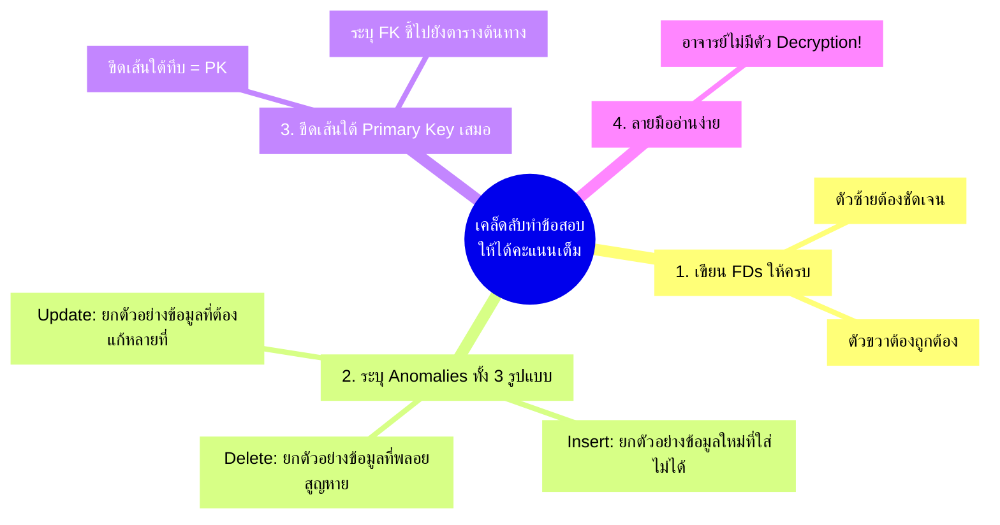

---
tags:
  - exam
  - normalization
  - 1nf
  - 2nf
  - 3nf
  - bcnf
  - 4nf
  - 5nf
  - in-class-test
  - practice-problems
created: 2026-09-15
updated: 2026-09-15
type: master-exam
level: comprehensive-all-levels
---

# 🎯 คลังข้อสอบอัตนัยและการฝึกปฏิบัติการเข้มข้น: Normalization 5 ระดับ (1NF → 2NF → 3NF → BCNF → 4NF/5NF Master Arena)

> [!IMPORTANT] ข้อมูลสำคัญและข้อสั่งการจากอาจารย์ผู้สอนในชั้นเรียน
> - **บริบทการสอบ:** จากการบันทึกเสียงบรรยายในชั้นเรียน อาจารย์ได้แจ้งเตือนนักศึกษาล่วงหน้าว่า:
>   *"ตอนแรกอาจารย์จะให้โจทย์ทำ Normalize อาจารย์เปลี่ยนใจ... คราวหน้าค่อย Normalize เนอะ คราวหน้าค่อย Normalize นะคะ... สัปดาห์ถัดไปจะเรียนและทำโจทย์เรื่อง 'Normalization' ทั้ง 5 ระดับอย่างเข้มข้น"*
> - **กฎเหล็กในห้องสอบของอาจารย์:**
>   1. **ห้าม Encrypt ลายมือ:** เขียนตัวบรรจง ชัดเจน อ่านง่าย ไม่ต้องให้อาจารย์ใช้แว่นขยาย อาจารย์ไม่มีตัว Decrypt สำหรับลายมือที่อ่านไม่ออก
>   2. **เขียนแจกแจงทีละขั้นตอน:** ต้องแสดงสมการ Functional Dependencies (FDs) ให้ครบถ้วน ชี้แจง Update Anomalies ทั้ง 3 รูปแบบ (Insert, Delete, Update)
>   3. **แสดงตาราง Trace Table และ Schema ทุกขั้นตอน:** ระบุ Primary Key (PK) โดยการ<u>ขีดเส้นใต้ทึบ</u> และ Foreign Key (FK) พร้อมระบุว่าชี้ไปยังตารางใด
>   4. **ครอบคลุมครบทั้ง 5 ระดับ:** UNF → 1NF → 2NF → 3NF → BCNF → 4NF/5NF

---

## 🧭 แผนผังแม่บทการทำ Normalization ทั้ง 5 ระดับ (The 5-Level Roadmap)

```mermaid
flowchart TD
    UNF["ตารางข้อมูลดิบ (UNF: Unnormalized Form)<br/>• มี Repeating Groups<br/>• มี Multi-valued Attributes หรือ Nested Columns"]
    
    NF1["ระดับที่ 1: First Normal Form (1NF)<br/>• ทุกช่องเป็นค่าเดี่ยว (Atomic Values)<br/>• ไม่มีข้อมูลซ้ำซ้อนเป็นกลุ่มชุดในแถวเดียว<br/>• กำหนด Composite Primary Key"]
    
    NF2["ระดับที่ 2: Second Normal Form (2NF)<br/>• ต้องผ่าน 1NF<br/>• กำจัด Partial Functional Dependency<br/>• Non-key Attributes ต้องขึ้นต่อ Primary Key ทั้งก้อน"]
    
    NF3["ระดับที่ 3: Third Normal Form (3NF)<br/>• ต้องผ่าน 2NF<br/>• กำจัด Transitive Dependency (X → Y → Z)<br/>• Non-key Attribute ห้ามขึ้นกับ Non-key Attribute อื่น"]
    
    BCNF["ระดับที่ 4: Boyce-Codd Normal Form (BCNF)<br/>• ต้องผ่าน 3NF<br/>• ทุก Determinant (ตัวกำหนดฝั่งซ้ายของลูกศร) ต้องเป็น Candidate Key<br/>• แก้ปัญหา Overlapping Candidate Keys"]
    
    NF4["ระดับที่ 5 พาร์ท 1: Fourth Normal Form (4NF)<br/>• ต้องผ่าน BCNF<br/>• กำจัด Multi-Valued Dependency (MVD: A ↠ B | C)<br/>• แยก Attribute อิสระที่ขึ้นต่อคีย์เดียวกันออกจากกัน"]
    
    NF5["ระดับที่ 5 พาร์ท 2: Fifth Normal Form (5NF / PJNF)<br/>• ต้องผ่าน 4NF<br/>• กำจัด Join Dependency (JD: ⋈[R1, R2, R3])<br/>• แก้ปัญหาความสัมพันธ์ 3 มิติ (Ternary Constraints)"]

    UNF -->|แตกแถว + ทำเป็น Atomic| NF1
    NF1 -->|ตัด Partial Key FDs แยกตาราง| NF2
    NF2 -->|ตัด Transitive FDs แยกตาราง| NF3
    NF3 -->|บังคับให้ตัวกำหนดทุกตัวเป็น Superkey| BCNF
    BCNF -->|แยก MVD อิสระออกจากกัน (Fagin Theorem)| NF4
    NF4 -->|แยก Ternary Relations สัมพันธ์ 3 ทิศทาง| NF5
```

---

## 📚 สรุปนิยามและสูตรลัดการตรวจสอบ 5 ระดับ (Quick Review Formula)

| ระดับ (Level) | กฎเกณฑ์ที่ต้องตรวจสอบ (Core Rule) | ปัญหาที่พบ (Violation/Anomaly) | วิธีแก้ในการหั่นตาราง (Decomposition Solution) |
| :--- | :--- | :--- | :--- |
| **UNF → 1NF** | ทุกคอลัมน์ต้องเก็บค่า **Atomic Value** (ค่าเดี่ยวที่แบ่งแยกไม่ได้) | มีข้อมูลเก็บเป็น List/Array หรือช่องหนึ่งมีหลายบรรทัด | แตกข้อมูลหลายค่าออกมาเป็นแถวใหม่ (Flattening) และระบุ Composite PK |
| **1NF → 2NF** | กำจัด **Partial Functional Dependency** | Non-prime attribute ขึ้นกับเพียง "บางส่วน" ของ Composite PK | ดึงฟิลด์ที่ขึ้นกับส่วนหัวของคีย์แยกไปสร้างตารางใหม่ โดยเก็บคีย์ย่อยนั้นไว้เป็น PK ใหม่ |
| **2NF → 3NF** | กำจัด **Transitive Dependency** | Non-prime attribute ไประบุค่า Non-prime attribute ตัวอื่น ($X → Y$ และ $Y → Z$) | ตัดคู่ $Y → Z$ ออกไปตั้งตารางใหม่ โดยให้ $Y$ เป็น PK ของตารางใหม่ และคง $Y$ ไว้ในตารางเดิมเป็น FK |
| **3NF → BCNF** | **ทุก Determinant ต้องเป็น Candidate Key** ($X → Y \implies X$ เป็น Superkey) | มี Candidate Key ทับซ้อนกัน และ Determinant บางตัวไม่ได้เป็น Candidate Key | ตัดคู่นั้นออกไปตั้งตารางใหม่ โดยให้ Determinant นั้นเป็น PK ของตารางใหม่ |
| **BCNF → 4NF** | กำจัด **Multi-Valued Dependency (MVD)** | $A ↠ B \mid C$ (A กำหนดเซตของ B และเซตของ C ที่เป็นอิสระต่อกัน) | ใช้ทฤษฎีของ Fagin หั่นตารางเป็น 2 ตารางคือ $\{A, B\}$ และ $\{A, C\}$ |
| **4NF → 5NF** | กำจัด **Join Dependency (JD)** | ตารางมีความสัมพันธ์ 3 ฝ่าย (Ternary) ที่ไม่สามารถแบ่งเป็น 2 ตารางได้ | หั่นออกเป็น 3 ตารางย่อยประกบคู่ $\{A, B\}$, $\{B, C\}$, $\{A, C\}$ |

---

# 📝 ชุดข้อสอบและแบบฝึกหัดเข้มข้น 10 ข้อ (10 Comprehensive Master Exercises)

---

## 🏥 โจทย์ข้อที่ 1: ระบบเวชระเบียนและการรักษาผู้ป่วยในโรงพยาบาล (Hospital Patient Treatment System)

### 1. บริบททางธุรกิจและข้อมูลตารางดิบ (UNF)
โรงพยาบาลแห่งหนึ่งจัดเก็บประวัติการเข้ารับการรักษาของผู้ป่วยในตารางเดี่ยวชื่อ `PATIENT_TREATMENT_UNF` โดยพบว่าในการเข้ารับการรักษา 1 ครั้ง ผู้ป่วยอาจได้รับยาหลายชนิด และได้รับการตรวจรักษาจากแพทย์ผู้เชี่ยวชาญหลายท่าน

**ตารางข้อมูลดิบ (UNF):**
```text
PATIENT_TREATMENT_UNF (
    PatientID, PatientName, PatientDOB, BloodType,
    AdmissionDate, RoomNo, BedNo, WardName,
    { DoctorID, DoctorName, Specialty, DepartmentID, DeptName },
    { DrugCode, DrugName, Dosage, Frequency, UnitPrice, Quantity }
)
```

**ตัวอย่างข้อมูลจริงในตารางดิบ (UNF Trace Table):**

| PatientID | PatientName | AdmissionDate | RoomNo | WardName | Doctors (List) | Drugs (List) |
| :--- | :--- | :--- | :--- | :--- | :--- | :--- |
| **P101** | สมชาย ใจดี | 2026-09-01 | R301 | แผนกอายุรกรรม | (D01, นพ.วิชัย, โรคหัวใจ), (D03, พญ.สุดา, ไตวิทยา) | (DR01, Aspirin, 1x2, 10), (DR05, Paracetamol, 2x3, 20) |
| **P102** | สมหญิง นิ่มนวล | 2026-09-02 | R302 | แผนกอายุรกรรม | (D01, นพ.วิชัย, โรคหัวใจ) | (DR01, Aspirin, 1x1, 15) |
| **P103** | ก้องเกียรติ สว่าง | 2026-09-03 | R405 | แผนกศัลยกรรม | (D04, นพ.ธีระ, ศัลยศาสตร์) | (DR09, Morphine, 1x1, 2) |

---

### 2. การวิเคราะห์ Update Anomalies (ปัญหาในตารางเดิม)
1. **Insertion Anomaly:** ไม่สามารถเพิ่มแพทย์ท่านใหม่ (DoctorID: D08) เข้าสู่ระบบได้ หากแพทย์ท่านนั้นยังไม่มีผู้ป่วยในความดูแล เพราะตารางนี้มี PatientID เป็นส่วนหนึ่งของคีย์
2. **Deletion Anomaly:** หากผู้ป่วย P103 จำหน่ายออกจากโรงพยาบาลและลบข้อมูลทิ้ง จะส่งผลให้ประวัติของ นพ.ธีระ (D04) และแผนกศัลยกรรมสาบสูญไปจากฐานข้อมูล
3. **Update Anomaly:** หาก นพ.วิชัย (D01) เปลี่ยนแปลงชื่อหรือย้าย Specialty จะต้องตามไปแก้ไขในทุกแถวที่คนไข้ได้รับการตรวจจากหมอท่านนี้ หากแก้ไม่ครบจะเกิด Data Inconsistency

---

### 3. การแสดงกระบวนการ Normalization ทีละระดับ (Step-by-Step)

#### ขั้นที่ 1: UNF → 1NF (ทำให้เป็น Atomic Values)
แตก Repeating Groups ของรายการแพทย์และรายการยาออกเป็นแถวเดี่ยวๆ:
- **Composite Primary Key สำหรับ 1NF:** `{PatientID, AdmissionDate, DoctorID, DrugCode}`

**1NF Schema:**
```text
PATIENT_TREATMENT_1NF (
    <u>PatientID</u>, <u>AdmissionDate</u>, <u>DoctorID</u>, <u>DrugCode</u>,
    PatientName, PatientDOB, BloodType, RoomNo, BedNo, WardName,
    DoctorName, Specialty, DepartmentID, DeptName,
    DrugName, Dosage, Frequency, UnitPrice, Quantity
)
```

#### ขั้นที่ 2: 1NF → 2NF (กำจัด Partial Functional Dependencies)
**วิเคราะห์สมการ FDs ทั้งหมด:**
1. `{PatientID} → PatientName, PatientDOB, BloodType` (ขึ้นกับส่วนหนึ่งของคีย์)
2. `{PatientID, AdmissionDate} → RoomNo, BedNo, WardName` (ขึ้นกับส่วนหนึ่งของคีย์)
3. `{DoctorID} → DoctorName, Specialty, DepartmentID, DeptName` (ขึ้นกับส่วนหนึ่งของคีย์)
4. `{DrugCode} → DrugName, UnitPrice` (ขึ้นกับส่วนหนึ่งของคีย์)
5. `{PatientID, AdmissionDate, DoctorID} → Specialty` (การตรวจรักษา)
6. `{PatientID, AdmissionDate, DrugCode} → Dosage, Frequency, Quantity` (การสั่งยา)

**ทำการแตกตาราง (Decomposition เข้าสู่ 2NF):**
- **ตาราง PATIENT:** { <u>PatientID</u>, PatientName, PatientDOB, BloodType }
- **ตาราง ADMISSION:** { <u>PatientID</u>, <u>AdmissionDate</u>, RoomNo, BedNo, WardName }
- **ตาราง DOCTOR:** { <u>DoctorID</u>, DoctorName, Specialty, DepartmentID, DeptName }
- **ตาราง DRUG:** { <u>DrugCode</u>, DrugName, UnitPrice }
- **ตาราง ADMISSION_DOCTOR:** { <u>PatientID</u>, <u>AdmissionDate</u>, <u>DoctorID</u> }
- **ตาราง ADMISSION_DRUG_PRESCRIPTION:** { <u>PatientID</u>, <u>AdmissionDate</u>, <u>DrugCode</u>, Dosage, Frequency, Quantity }

#### ขั้นที่ 3: 2NF → 3NF (กำจัด Transitive Dependencies)
**ตรวจพบ Transitive Dependencies ในตาราง 2NF:**
1. ในตาราง `ADMISSION`: `RoomNo → WardName` (Non-key ไปกำหนด Non-key)
2. ในตาราง `DOCTOR`: `DepartmentID → DeptName` (Non-key ไปกำหนด Non-key)

**ทำการแตกตาราง (Decomposition เข้าสู่ 3NF):**
- **PATIENT (3NF):** { <u>PatientID</u>, PatientName, PatientDOB, BloodType }
- **ROOM (3NF):** { <u>RoomNo</u>, WardName }
- **ADMISSION (3NF):** { <u>PatientID</u>, <u>AdmissionDate</u>, <u>RoomNo</u>, BedNo }
  *(โดย RoomNo เป็น FK ชี้ไปยัง ROOM)*
- **DEPARTMENT (3NF):** { <u>DepartmentID</u>, DeptName }
- **DOCTOR (3NF):** { <u>DoctorID</u>, DoctorName, Specialty, <u>DepartmentID</u> }
  *(โดย DepartmentID เป็น FK ชี้ไปยัง DEPARTMENT)*
- **DRUG (3NF):** { <u>DrugCode</u>, DrugName, UnitPrice }
- **ADMISSION_DOCTOR (3NF):** { <u>PatientID</u>, <u>AdmissionDate</u>, <u>DoctorID</u> }
- **ADMISSION_PRESCRIPTION (3NF):** { <u>PatientID</u>, <u>AdmissionDate</u>, <u>DrugCode</u>, Dosage, Frequency, Quantity }

#### ขั้นที่ 4: 3NF → BCNF
ตรวจสอบ Determinants ทุกตัว:
- ในตาราง `ROOM`: `RoomNo` เป็น Candidate Key ตัวเดียว (ผ่าน BCNF)
- ในตาราง `DOCTOR`: `DoctorID` เป็น Candidate Key ตัวเดียว (ผ่าน BCNF)
- ทุกตารางมี Determinant เป็น Superkey ทั้งสิ้น จึงอยู่ในระดับ **BCNF** แล้ว

#### ขั้นที่ 5: BCNF → 4NF (การวิเคราะห์ Multi-Valued Dependency)
ในตารางการรักษาเดิม:
`{PatientID, AdmissionDate} ↠ DoctorID` (ผู้ป่วยได้รับการตรวจจากแพทย์หลายคน)
`{PatientID, AdmissionDate} ↠ DrugCode` (ผู้ป่วยได้รับยาหลายตัว)
เนื่องจากรายการแพทย์ที่มารักษา และรายการยาที่สั่งจ่าย เป็น **อิสระต่อกันโดยสิ้นเชิง (Independent)**
ตารางแยก `ADMISSION_DOCTOR` และ `ADMISSION_PRESCRIPTION` จึงเป็นการกำจัด MVD ตามทฤษฎีของ Fagin สมบูรณ์แบบในระดับ **4NF** เรียบร้อยแล้ว

---

## 🎓 โจทย์ข้อที่ 2: ระบบลงทะเบียนเรียนและอาจารย์ที่ปรึกษา (University Course Advising System)

### 1. บริบททางธุรกิจและข้อมูลตารางดิบ (UNF)
มหาวิทยาลัยจัดเก็บข้อมูลการลงทะเบียนและการจัดสอนในตาราง `COURSE_REGISTRATION_UNF`:
- นักศึกษา 1 คนลงทะเบียนได้หลายวิชา
- แต่ละวิชาเปิดสอนหลายกลุ่มเรียน (Section) โดยแต่ละกลุ่มมีอาจารย์ผู้สอน 1 ท่าน
- อาจารย์แต่ละท่านสังกัด 1 ภาควิชา และมีห้องพักประจำอาจารย์เพียงห้องเดียว
- แต่ละวิชามีการแนะนำหนังสือตำราเรียนหลายเล่ม (Textbooks) ซึ่งตำราไม่ขึ้นกับว่าอาจารย์ท่านใดเป็นผู้สอน

**ตารางข้อมูลดิบ (UNF):**
```text
ENROLLMENT_UNF (
    StudentID, StudentName, Major, AdvisorID, AdvisorName, AdvisorOffice,
    { CourseCode, CourseTitle, Credits, SectionNo, InstructorID, InstructorName, RoomScheduled,
      { TextbookISBN, BookTitle, Author }
    }
)
```

**ตัวอย่าง Trace Table (UNF):**

| StudentID | StudentName | CourseCode | InstructorName | Textbooks (ISBN) | AdvisorName |
| :--- | :--- | :--- | :--- | :--- | :--- |
| **S6701** | ธนภัทร | CS211 (Database) | อ.กิตติศักดิ์ | 978-0133970777, 978-1260515046 | ดร.ประเสริฐ |
| **S6701** | ธนภัทร | CS212 (Data Struct) | อ.วรัญญา | 978-0134853987 | ดร.ประเสริฐ |
| **S6702** | พัชรา | CS211 (Database) | อ.กิตติศักดิ์ | 978-0133970777, 978-1260515046 | ดร.ประเสริฐ |

---

### 2. Functional Dependencies (FDs)
1. `StudentID → StudentName, Major, AdvisorID`
2. `AdvisorID → AdvisorName, AdvisorOffice`
3. `CourseCode → CourseTitle, Credits`
4. `{CourseCode, SectionNo} → InstructorID, RoomScheduled`
5. `InstructorID → InstructorName, AdvisorOffice`
6. `{StudentID, CourseCode, SectionNo} → Grade`
7. MVD: `CourseCode ↠ TextbookISBN` (วิชาหนึ่งมีตำราหลายเล่ม ไม่ขึ้นกับกลุ่มเรียนหรืออาจารย์)
8. MVD: `CourseCode ↠ SectionNo`

---

### 3. การทำ Normalization ครบ 5 ระดับ

#### ระดับ 1NF:
แตก Repeating groups และกำหนด Composite PK:
`{StudentID, CourseCode, SectionNo, TextbookISBN}`

#### ระดับ 2NF:
กำจัด Partial Dependencies (ฟิลด์ที่ขึ้นกับคีย์ย่อย):
- **STUDENT:** { <u>StudentID</u>, StudentName, Major, AdvisorID, AdvisorName, AdvisorOffice }
- **COURSE:** { <u>CourseCode</u>, CourseTitle, Credits }
- **COURSE_SECTION:** { <u>CourseCode</u>, <u>SectionNo</u>, InstructorID, InstructorName, RoomScheduled }
- **COURSE_TEXTBOOK:** { <u>CourseCode</u>, <u>TextbookISBN</u>, BookTitle, Author }
- **STUDENT_ENROLLMENT:** { <u>StudentID</u>, <u>CourseCode</u>, <u>SectionNo</u>, Grade }

#### ระดับ 3NF:
กำจัด Transitive Dependencies:
- ในตาราง `STUDENT`: `AdvisorID → AdvisorName, AdvisorOffice`
  - แตกเป็น: **ADVISOR** { <u>AdvisorID</u>, AdvisorName, AdvisorOffice }
  - ตาราง **STUDENT**: { <u>StudentID</u>, StudentName, Major, <u>AdvisorID</u> }
- ในตาราง `COURSE_SECTION`: `InstructorID → InstructorName`
  - แตกเป็น: **INSTRUCTOR** { <u>InstructorID</u>, InstructorName }
  - ตาราง **COURSE_SECTION**: { <u>CourseCode</u>, <u>SectionNo</u>, <u>InstructorID</u>, RoomScheduled }
- ในตาราง `COURSE_TEXTBOOK`: `TextbookISBN → BookTitle, Author`
  - แตกเป็น: **TEXTBOOK** { <u>TextbookISBN</u>, BookTitle, Author }
  - ตาราง **COURSE_BOOK_ASSIGN**: { <u>CourseCode</u>, <u>TextbookISBN</u> }

#### ระดับ BCNF (Boyce-Codd Normal Form - จุดเน้นข้อสอบ!):
สมมติเงื่อนไขพิเศษของคณะ:
- อาจารย์แต่ละท่านสอนได้เพียง 1 วิชาเท่านั้น (`InstructorID → CourseCode`)
- แต่วิชาหนึ่งอาจมีอาจารย์สอนหลายท่าน
- ในตาราง `COURSE_SECTION` เดิม: คีย์หลักคือ `{CourseCode, SectionNo}`
  - เกิด FD: `InstructorID → CourseCode`
  - ซึ่ง `InstructorID` เป็นตัวกำหนด (Determinant) แต่ตัวมันเอง **ไม่ได้เป็น Candidate Key ของตารางนี้!** (ผิดกฎ BCNF)
- **การแก้ไขให้เป็น BCNF:**
  - หั่นตารางออกเป็น:
    1. **INSTRUCTOR_TEACHES:** { <u>InstructorID</u>, CourseCode } *(InstructorID เป็น PK)*
    2. **SECTION_SCHEDULE:** { <u>InstructorID</u>, <u>SectionNo</u>, RoomScheduled }

#### ระดับ 4NF (กำจัด Multi-Valued Dependency):
ในวิชา `CourseCode` มีตำราเรียนที่แนะนำหลายเล่ม (`CourseCode ↠ TextbookISBN`) และมีกลุ่มเรียนหลายกลุ่ม (`CourseCode ↠ SectionNo`)
ทั้งสองเรื่องไม่มีความเกี่ยวข้องกัน (ตำราวิชา Database ไม่ได้เปลี่ยนตาม Section 1 หรือ Section 2)
การแยกเป็นตาราง:
1. `COURSE_BOOK_ASSIGN` { <u>CourseCode</u>, <u>TextbookISBN</u> }
2. `COURSE_SECTION` / `SECTION_SCHEDULE`
ทำให้ไม่มีการเกิด Cartesian Product ข้ามกลุ่ม ถือว่าอยู่ในระดับ **4NF** อย่างสมบูรณ์!

---

## 🛒 โจทย์ข้อที่ 3: ระบบคำสั่งซื้อสินค้าออนไลน์และการจัดส่ง (E-Commerce Order & Logistics Fulfillment)

### 1. ข้อมูลตารางดิบ (UNF)
```text
ORDER_FULFILLMENT_UNF (
    OrderID, OrderDate, CustomerID, CustomerName, CustomerEmail, ShippingAddress, SubDistrict, District, Province, ZipCode,
    PaymentMethod, PaymentStatus, TransactionRef,
    { ProductSKU, ProductName, CategoryID, CategoryName, SupplierID, SupplierName, UnitPrice, OrderQty, LineTotal },
    { TrackingNumber, CourierCode, CourierName, ShippedDate, DeliveryStatus }
)
```

### 2. กระบวนการ Normalization ทีละระดับ

#### 1NF:
แตกแถวให้เป็นค่าเดี่ยว โดยมี Primary Key: `{OrderID, ProductSKU, TrackingNumber}`

#### 2NF (กำจัด Partial Key Dependencies):
- `{OrderID} → OrderDate, CustomerID, ShippingAddress, ZipCode, PaymentMethod, PaymentStatus, TransactionRef`
- `{ProductSKU} → ProductName, CategoryID, CategoryName, SupplierID, SupplierName, UnitPrice`
- `{OrderID, ProductSKU} → OrderQty, LineTotal`
- `{TrackingNumber} → CourierCode, CourierName, ShippedDate, DeliveryStatus`
- `{OrderID, TrackingNumber} → ShippedDate`

**ตาราง 2NF:**
- `ORDER_HEADER`: { <u>OrderID</u>, OrderDate, CustomerID, CustomerName, ShippingAddress, ZipCode, PaymentMethod, TransactionRef }
- `ORDER_ITEM`: { <u>OrderID</u>, <u>ProductSKU</u>, OrderQty, LineTotal }
- `PRODUCT`: { <u>ProductSKU</u>, ProductName, CategoryID, CategoryName, SupplierID, SupplierName, UnitPrice }
- `SHIPMENT`: { <u>TrackingNumber</u>, CourierCode, CourierName, DeliveryStatus }
- `ORDER_SHIPMENT`: { <u>OrderID</u>, <u>TrackingNumber</u>, ShippedDate }

#### 3NF (กำจัด Transitive Dependencies):
- ใน `ORDER_HEADER`: `CustomerID → CustomerName` และ `ZipCode → Province, District, SubDistrict`
  - แยกเป็น: `CUSTOMER` { <u>CustomerID</u>, CustomerName, CustomerEmail }
  - แยกเป็น: `POSTAL_CODE` { <u>ZipCode</u>, SubDistrict, District, Province }
- ใน `PRODUCT`: `CategoryID → CategoryName` และ `SupplierID → SupplierName`
  - แยกเป็น: `CATEGORY` { <u>CategoryID</u>, CategoryName }
  - แยกเป็น: `SUPPLIER` { <u>SupplierID</u>, SupplierName }
- ใน `SHIPMENT`: `CourierCode → CourierName`
  - แยกเป็น: `COURIER` { <u>CourierCode</u>, CourierName }

#### BCNF & 4NF:
- ทุก Determinant ในแต่ละตารางเป็น Primary Key
- รายการสินค้าในออเดอร์ (`OrderID ↠ ProductSKU`) และพัสดุจัดส่ง (`OrderID ↠ TrackingNumber`) เป็น MVD อิสระ แยกเป็น `ORDER_ITEM` และ `ORDER_SHIPMENT` ถูกต้องตามกฎ **4NF**

---

## 💻 โจทย์ข้อที่ 4: ระบบบริหารจัดการโครงการและทักษะทีมพัฒนา (IT Project & Developer Skills)

### 1. บริบทโจทย์ที่เน้น Multi-Valued Dependency (4NF Intensive Problem)
บริษัทไอทีเก็บข้อมูลการมอบหมายงานในโครงการ:
- โปรเจกต์หนึ่งมีนักพัฒนา (Developer) หลายคนเข้าร่วม
- นักพัฒนาแต่ละคนมีความเชี่ยวชาญด้านภาษาโปรแกรม (Programming Languages) หลายภาษา
- นักพัฒนาแต่ละคนถือใบรับรองทักษะทางเทคนิค (Certifications) หลายใบ
- ภาษาโปรแกรมและใบรับรองของนักพัฒนา **เป็นอิสระต่อกันโดยสิ้นเชิง**

**ตารางข้อมูล (UNF):**
`DEV_PROJECT_ASSIGNMENT (ProjCode, DevID, DevName, {ProgLanguage}, {Certification})`

**ตัวอย่างข้อมูลแถวที่มีปัญหา MVD (Cartesian Explosion):**
ถ้านายสมศักดิ์ (D101) เชี่ยวชาญภาษา `{Python, Java, Go}` และมีใบรับรอง `{AWS_SAA, CKA}`
หากเก็บในตารางเดียวโดยไม่มีการแตก 4NF จะต้องเขียนข้อมูลมากถึง $3 \times 2 = 6$ แถว!

| ProjCode | DevID | DevName | ProgLanguage | Certification |
| :--- | :--- | :--- | :--- | :--- |
| **PRJ-01** | D101 | สมศักดิ์ | Python | AWS_SAA |
| **PRJ-01** | D101 | สมศักดิ์ | Python | CKA |
| **PRJ-01** | D101 | สมศักดิ์ | Java | AWS_SAA |
| **PRJ-01** | D101 | สมศักดิ์ | Java | CKA |
| **PRJ-01** | D101 | สมศักดิ์ | Go | AWS_SAA |
| **PRJ-01** | D101 | สมศักดิ์ | Go | CKA |

### 2. การวิเคราะห์และการหั่นตารางสู่ 4NF
- **ตรวจพบ MVD:**
  - `DevID ↠ ProgLanguage`
  - `DevID ↠ Certification`
- หากปล่อยไว้ จะเกิด Update Anomalies มหาศาล ถ้าสมศักดิ์ได้ใบรับรองเพิ่มอีก 1 ใบ จะต้อง INSERT เข้ามาอีก 3 แถวใหม่!
- **ตามทฤษฎีของ Fagin:** ต้องหั่นตารางออกเป็นตารางคู่ที่เป็นอิสระต่อกัน:
  1. `DEVELOPER`: { <u>DevID</u>, DevName }
  2. `DEV_PROJECT`: { <u>ProjCode</u>, <u>DevID</u> }
  3. `DEV_LANGUAGE`: { <u>DevID</u>, <u>ProgLanguage</u> }
  4. `DEV_CERTIFICATE`: { <u>DevID</u>, <u>Certification</u> }
- **ผลลัพธ์:** ปัญหาข้อมูลเบิ้ลหายไปทันที ข้อมูลอยู่ในระดับ **4NF** สมบูรณ์แบบ!

---

## 🏭 โจทย์ข้อที่ 5: ระบบจัดซื้อ จัดส่ง และชิ้นส่วนโรงงาน 3 มิติ (Ternary Supply Chain - 5NF Intensive)

### 1. บริบทโจทย์ระดับ 5NF (Project-Join Normal Form / Join Dependency)
ตารางบันทึกการส่งชิ้นส่วนในระบบอุตสาหกรรม:
- `Supplier (S)`: ผู้ผลิตวัตถุดิบ
- `Part (P)`: ชิ้นส่วนอุปกรณ์
- `Project (J)`: โครงการก่อสร้าง

**กฎกติกาทางธุรกิจแบบ 3 มิติ (3-Way Symmetric Constraint):**
> บริษัทมีกฎว่า:
> 1. ถ้าซัพพลายเออร์ $S_1$ สามารถผลิตชิ้นส่วน $P_1$ ได้
> 2. และโครงการ $J_1$ มีการใช้งานชิ้นส่วน $P_1$
> 3. และซัพพลายเออร์ $S_1$ เป็นคู่สัญญากับโครงการ $J_1$
> **แล้ว ซัพพลายเออร์ $S_1$ จะต้องส่งชิ้นส่วน $P_1$ ให้กับโครงการ $J_1$ ด้วยเสมอ!**

### 2. ปัญหาของการหั่นเป็น 2 ตาราง (Why 4NF is Not Enough?)
ถ้าเราพยายามหั่นตาราง `SPJ` ออกเป็น 2 ตาราง เช่น $\{S, P\}$ และ $\{P, J\}$ แล้วทำการ Natural Join กลับเข้าด้วยกัน
ผลลัพธ์จะเกิด **Spurious Tuples (ข้อมูลปลอมงอกขึ้นมา)** ทันที เพราะเราไม่รู้ว่าซัพพลายเออร์รายนั้นมีสัญญากับโครงการนั้นจริงหรือไม่!

### 3. ทางออกสู่ 5NF (Decomposition into 3 Tables)
ตารางนี้มี **Join Dependency: `⋈[{S, P}, {P, J}, {J, S}]`**
จึงต้องทำการหั่นออกเป็น 3 ตารางย่อย:
1. **SUPPLIER_PART (SP):** { <u>SupplierID</u>, <u>PartID</u> } (ซัพพลายเออร์เจ้าไหนผลิตชิ้นส่วนอะไรได้บ้าง)
2. **PART_PROJECT (PJ):** { <u>PartID</u>, <u>ProjectID</u> } (โครงการใดต้องใช้ชิ้นส่วนอะไรบ้าง)
3. **SUPPLIER_PROJECT (SJ):** { <u>SupplierID</u>, <u>ProjectID</u> } (ซัพพลายเออร์เจ้าใดมีสัญญาส่งของให้โครงการใดบ้าง)

เมื่อนำทั้ง 3 ตารางมา Natural Join พร้อมกันแบบ 3-Way Join:
`SP ⋈ PJ ⋈ SJ = SPJ`
ข้อมูลจะกลับมาถูกต้อง 100% โดยไม่มีข้อมูลปลอมงอกขึ้นมาแม้แต่แถวเดียว นี่คือตัวอย่างที่ชัดเจนที่สุดของ **5NF**

---

## 🚗 โจทย์ข้อที่ 6: ระบบเช่ารถยนต์และการซ่อมบำรุง (Car Rental & Maintenance POS)

### 1. ข้อมูลตารางดิบ (UNF)
`CAR_RENTAL_UNF (RentalAgreementNo, RentDate, ReturnDate, CustomerID, CustomerName, DriverLicenseNo, CarPlate, CarModel, Brand, DailyRate, RentalFee, { ExtraServiceCode, ServiceName, ServiceFee }, { DamageCode, DamageDesc, FineAmount })`

### 2. ผลลัพธ์การ Decomposition สู่ 3NF / BCNF
1. **CUSTOMER:** { <u>CustomerID</u>, CustomerName, DriverLicenseNo }
2. **CAR_MODEL:** { <u>ModelID</u>, CarModel, Brand, DailyRate }
3. **CAR:** { <u>CarPlate</u>, <u>ModelID</u>, CurrentStatus }
4. **RENTAL_AGREEMENT:** { <u>RentalAgreementNo</u>, RentDate, ReturnDate, <u>CustomerID</u>, <u>CarPlate</u>, RentalFee }
5. **EXTRA_SERVICE:** { <u>ServiceCode</u>, ServiceName, ServiceFee }
6. **RENTAL_SERVICE:** { <u>RentalAgreementNo</u>, <u>ServiceCode</u>, Quantity }
7. **DAMAGE_REPORT:** { <u>ReportID</u>, <u>RentalAgreementNo</u>, DamageCode, DamageDesc, FineAmount }

---

## 🏨 โจทย์ข้อที่ 7: ระบบการจองห้องพักโรงแรมและบริการพิเศษ (Hotel Booking & Amenities)

### 1. ข้อมูลตารางดิบ (UNF)
`HOTEL_BOOKING_UNF (BookingID, BookingDate, CheckInDate, CheckOutDate, GuestID, GuestName, GuestPhone, RoomNumber, RoomType, TypeName, BasePricePerNight, TotalAmount, { AmenityCode, AmenityName, ExtraCost })`

### 2. Functional Dependencies:
- `BookingID → BookingDate, CheckInDate, CheckOutDate, GuestID, RoomNumber, TotalAmount`
- `GuestID → GuestName, GuestPhone`
- `RoomNumber → RoomType`
- `RoomType → TypeName, BasePricePerNight`
- `AmenityCode → AmenityName, ExtraCost`
- MVD: `BookingID ↠ AmenityCode`

### 3. แผนผัง Relational Schema หลังทำ 4NF:
- **GUEST:** { <u>GuestID</u>, GuestName, GuestPhone }
- **ROOM_TYPE:** { <u>RoomType</u>, TypeName, BasePricePerNight }
- **ROOM:** { <u>RoomNumber</u>, <u>RoomType</u>, Floor }
- **BOOKING:** { <u>BookingID</u>, BookingDate, CheckInDate, CheckOutDate, <u>GuestID</u>, <u>RoomNumber</u>, TotalAmount }
- **AMENITY:** { <u>AmenityCode</u>, AmenityName, ExtraCost }
- **BOOKING_AMENITY:** { <u>BookingID</u>, <u>AmenityCode</u>, Quantity }

---

## ✈️ โจทย์ข้อที่ 8: ระบบสำรองที่นั่งสายการบินและลูกเรือ (Airline Flight & Crew Reservation)

### 1. ข้อมูลตารางดิบ (UNF)
`FLIGHT_BOOKING_UNF (TicketNo, BookingRef, PassengerID, PassengerName, PassportNo, FlightNumber, FlightDate, OriginAirport, DestAirport, DepTime, ArrTime, Gate, SeatNumber, Class, MealPreference, { CrewID, CrewName, Role })`

### 2. การวิเคราะห์ Normalization 5 ระดับ:
- `TicketNo → BookingRef, PassengerID, FlightNumber, FlightDate, SeatNumber, Class, MealPreference`
- `PassengerID → PassengerName, PassportNo`
- `FlightNumber → OriginAirport, DestAirport, DepTime, ArrTime`
- `{FlightNumber, FlightDate} → Gate`
- `{FlightNumber, FlightDate, SeatNumber} → TicketNo` (Candidate Key อีกตัว!)
- MVD: `{FlightNumber, FlightDate} ↠ CrewID` (ลูกเรือที่ปฏิบัติหน้าที่ในเที่ยวบินนั้น)

### 3. Relational Schema ระดับ BCNF & 4NF:
- **PASSENGER:** { <u>PassengerID</u>, PassengerName, PassportNo }
- **FLIGHT_ROUTE:** { <u>FlightNumber</u>, OriginAirport, DestAirport, DepTime, ArrTime }
- **FLIGHT_INSTANCE:** { <u>FlightNumber</u>, <u>FlightDate</u>, Gate }
- **BOARDING_PASS:** { <u>TicketNo</u>, BookingRef, <u>PassengerID</u>, <u>FlightNumber</u>, <u>FlightDate</u>, SeatNumber, Class, MealPreference }
- **CREW:** { <u>CrewID</u>, CrewName, Role }
- **FLIGHT_CREW_ASSIGNMENT:** { <u>FlightNumber</u>, <u>FlightDate</u>, <u>CrewID</u> }

---

## 📚 โจทย์ข้อที่ 9: ระบบห้องสมุดและสำนักพิมพ์ (Library Lending & Publisher System)

### 1. ข้อมูลตารางดิบ (UNF)
`LIBRARY_LOAN_UNF (LoanID, LoanDate, DueDate, ReturnDate, MemberID, MemberName, MemberType, { CopyBarcode, ISBN, BookTitle, Edition, PublisherID, PublisherName, PublisherCity, { AuthorID, AuthorName } })`

### 2. จุดดักข้อสอบ:
- หนังสือ 1 เล่ม (ISBN) อาจมีผู้แต่งหลายคน (`ISBN ↠ AuthorID`)
- หนังสือมีหลายก็อปปี้ โดยแต่ละก็อปปี้มีบาร์โค้ดประจำเล่มเดี่ยวๆ (`CopyBarcode → ISBN`)
- การยืมครั้งหนึ่งยืมได้หลายเล่ม

### 3. การแตกตาราง 4NF:
1. **MEMBER:** { <u>MemberID</u>, MemberName, MemberType }
2. **PUBLISHER:** { <u>PublisherID</u>, PublisherName, PublisherCity }
3. **BOOK:** { <u>ISBN</u>, BookTitle, Edition, <u>PublisherID</u> }
4. **AUTHOR:** { <u>AuthorID</u>, AuthorName }
5. **BOOK_AUTHOR:** { <u>ISBN</u>, <u>AuthorID</u> } *(กำจัด MVD)*
6. **BOOK_COPY:** { <u>CopyBarcode</u>, <u>ISBN</u>, ShelfLocation }
7. **LOAN:** { <u>LoanID</u>, LoanDate, DueDate, <u>MemberID</u> }
8. **LOAN_ITEM:** { <u>LoanID</u>, <u>CopyBarcode</u>, ReturnDate, FineAmount }

---

## 🍽️ โจทย์ข้อที่ 10: ระบบร้านอาหารและเดลิเวอรี (Restaurant POS & Toppings MVD)

### 1. บริบทโจทย์ MVD 4NF ขั้นสูงสุด:
- ลูกค้าสั่งอาหาร 1 จาน (เช่น ชานมไข่มุก หรือ ก๋วยเตี๋ยว)
- แต่ละจานสามารถเลือกท็อปปิ้ง (Toppings) ได้หลายอย่าง (ไข่มุก, ว่านหางจระเข้, พุดดิ้ง)
- ลูกค้าสามารถระบุคำสั่งพิเศษ (Special Instructions) ได้หลายข้อ (หวานน้อย, น้ำแข็งน้อย, ไม่ใส่หลอด)
- **ท็อปปิ้งและคำสั่งพิเศษเป็นอิสระต่อกันโดยสิ้นเชิง**

**ตารางข้อมูลดิบ (UNF):**
`ORDER_LINE_UNF (BillNo, ItemSeq, MenuCode, MenuName, Price, {ToppingCode, ToppingName, ExtraPrice}, {InstructionText})`

### 2. การ Decomposition สู่ 4NF:
1. **BILL:** { <u>BillNo</u>, BillDate, TableNo, CashierID, TotalAmount }
2. **MENU:** { <u>MenuCode</u>, MenuName, Category, BasePrice }
3. **ORDER_ITEM:** { <u>BillNo</u>, <u>ItemSeq</u>, <u>MenuCode</u>, Quantity, LinePrice }
4. **ITEM_TOPPING:** { <u>BillNo</u>, <u>ItemSeq</u>, <u>ToppingCode</u> } *(แยก MVD ที่ 1)*
5. **ITEM_INSTRUCTION:** { <u>BillNo</u>, <u>ItemSeq</u>, <u>InstructionID</u>, InstructionText } *(แยก MVD ที่ 2)*
6. **TOPPING:** { <u>ToppingCode</u>, ToppingName, ExtraPrice }

---

# 📋 ตารางสรุปกระบวนการสอบและการเขียนตอบให้อาจารย์ประทับใจ



> [!TIP] สรุปส่งท้ายก่อนเข้าห้องสอบ
> 1. ถ้าเจอช่องที่มีเครื่องหมายคอมม่า (`,`) หรือมีหลายค่าในช่องเดียว $\rightarrow$ ให้แตกแถวทำ **1NF** ทันที
> 2. ถ้า Primary Key เป็นคีย์คู่ (Composite Key) $\rightarrow$ ให้มองหา **2NF** (Partial Dependency) ทันที
> 3. ถ้า Primary Key เป็นคีย์เดี่ยว แต่มีฟิลด์ที่ไม่ใช่คีย์ไปชี้บอกค่ากันเอง $\rightarrow$ ให้ฟันธงว่าเป็น **3NF** (Transitive Dependency)
> 4. ถ้ามีตัวกำหนดฝั่งซ้ายของ FD ที่ไม่ได้เป็น Candidate Key $\rightarrow$ หั่นเข้า **BCNF**
> 5. ถ้ามีคอลัมน์หลายค่า 2 กลุ่มที่ไม่เกี่ยวข้องกันอยู่ในแถวเดียวกัน $\rightarrow$ ฟันธงว่าเป็น **4NF** (MVD)
