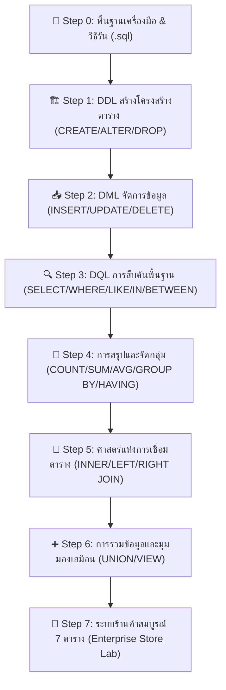
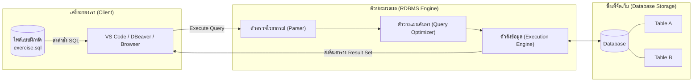
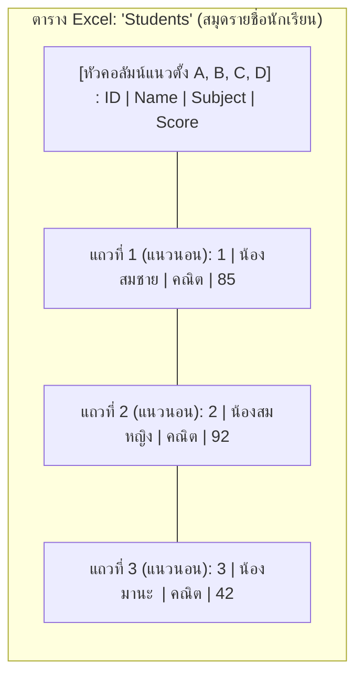
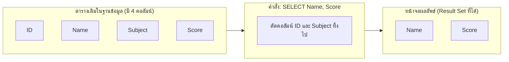
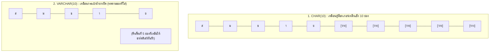
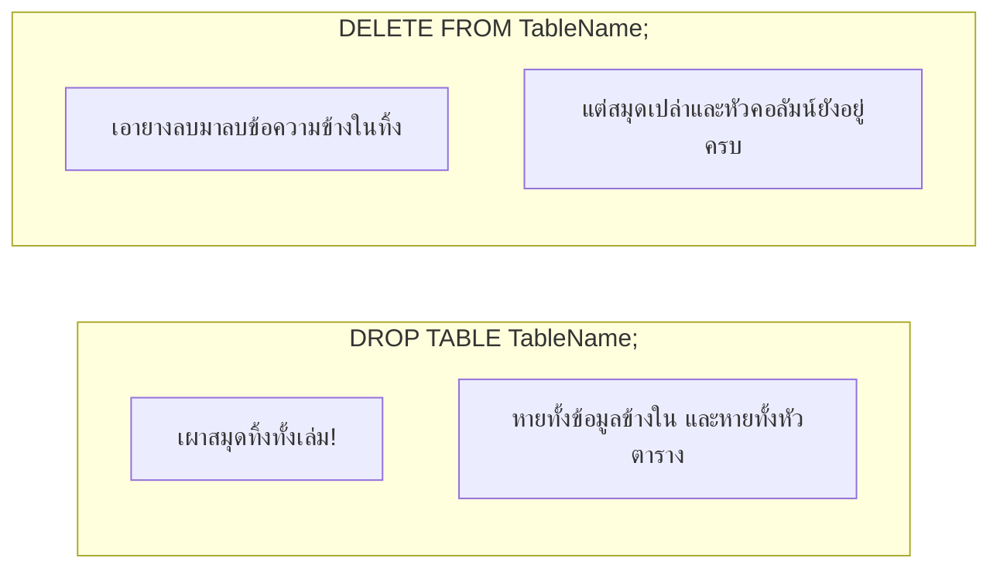
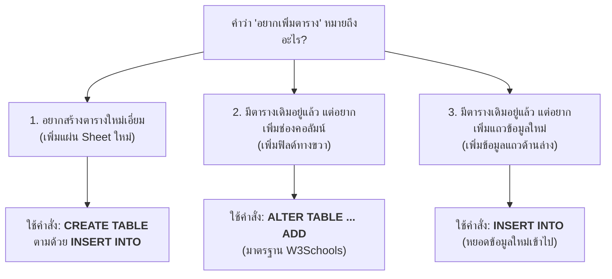
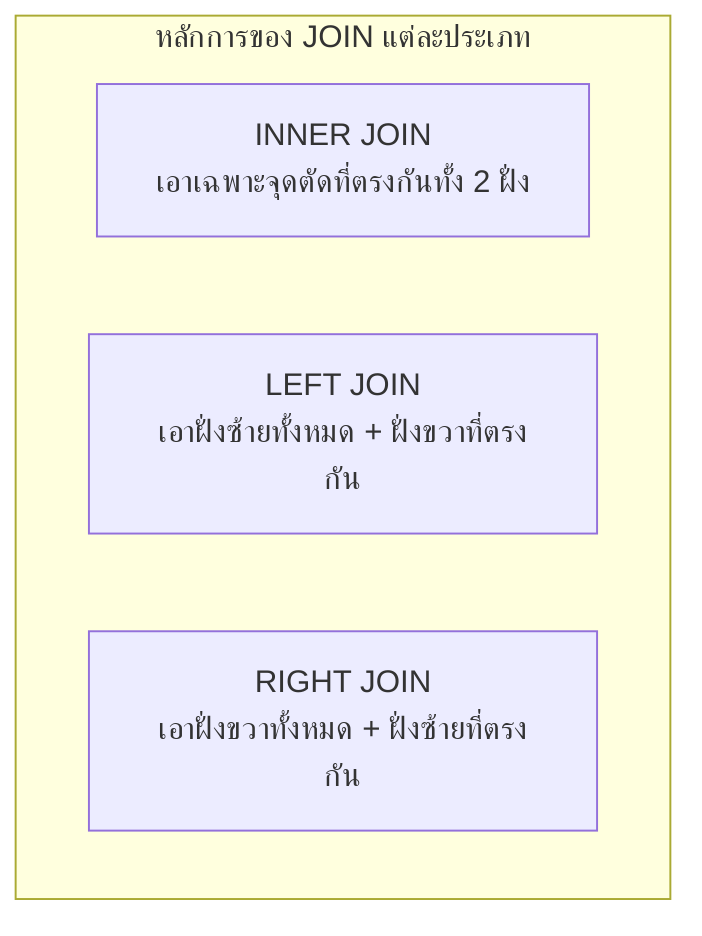
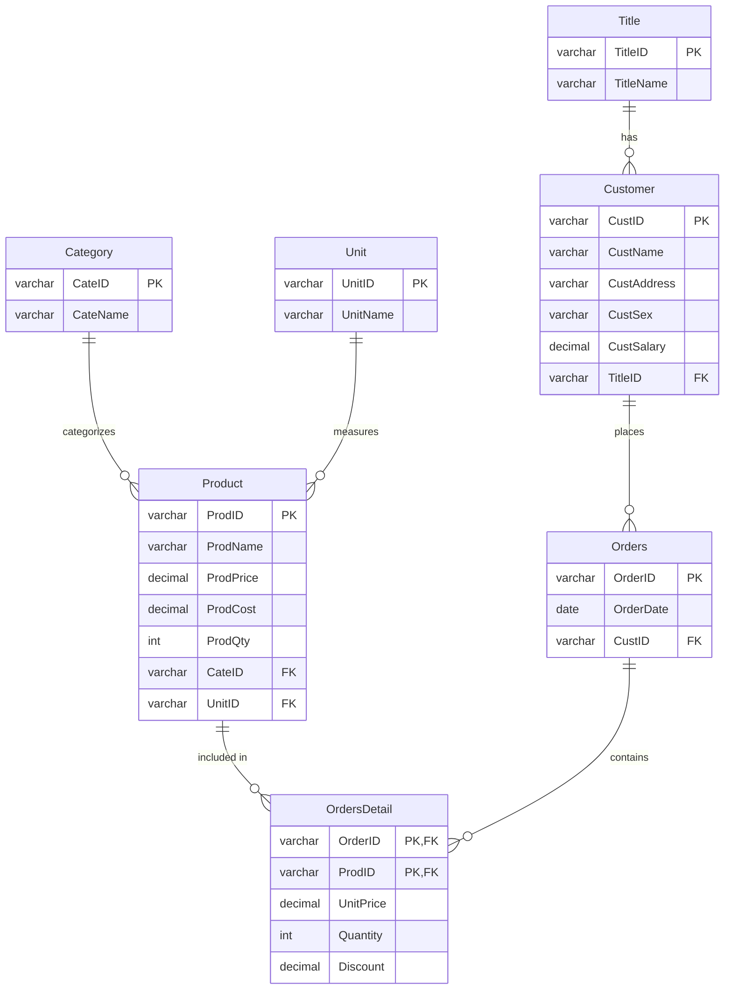

---
tags:
  - database
  - sql
  - lab
  - tutorial
  - query-language
  - hands-on
created: 2026-09-07
updated: 2026-09-07
type: lab-guide
---

# SQL Lab Practice Guide: จากศูนย์สู่ชำนาญ (Zero to Hero Hands-on Manual)

> [!SUMMARY] วัตถุประสงค์ของคู่มือฉบับนี้
> คู่มือนี้เขียนขึ้นสำหรับผู้ที่ไม่เคยเขียนโปรแกรมฐานข้อมูลด้วยภาษา SQL มาก่อน โดยรวบรวมตั้งแต่ **ปฐมบทการเตรียมเครื่องมือ** (วิธีสร้างไฟล์ `.sql`, วิธีเชื่อมต่อฐานข้อมูล, วิธีกดรันคำสั่ง) ตลอดจนแบบฝึกหัดลงมือทำจริง (Hands-on Lab) ทุกหัวข้อจากบทเรียน SQL (Lecture 7 และ Lecture 7.5) ทุกตัวอย่างมี **สคริปต์ตั้งต้น (Clean Slate Script)** เพื่อให้ล้างและสร้างตารางใหม่ได้เสมอ สามารถคัดลอกไปรันได้ทันทีโดยไม่มีข้อผิดพลาด

---

## 🧭 แผนผังการเรียนรู้ (Learning Roadmap)



---

## 🚀 Part 0: ปฐมบทมือใหม่ — ไฟล์ .sql คืออะไร และรันอย่างไร?

### 1. โมเดลความคิดของระบบฐานข้อมูล (Mental Model)
ก่อนจะพิมพ์คำสั่งแรก ต้องเข้าใจก่อนว่าสิ่งที่อยู่หน้าจอของเราทำงานร่วมกันอย่างไร:



> [!DEFINITION] คำศัพท์พื้นฐาน 5 คำที่ต้องจำให้แม่น
> 1. **Database (ฐานข้อมูล):** กล่องใบใหญ่หรือตู้เอกสารที่ใช้บรรจุตารางต่างๆ เข้าไว้ด้วยกันในโปรเจกต์หนึ่งๆ
> 2. **Table / Relation (ตาราง):** แผ่นตาราง 2 มิติที่ใช้เก็บข้อมูลเรื่องใดเรื่องหนึ่งโดยเฉพาะ เช่น ตาราง `Customer` หรือตาราง `Product`
> 3. **Column / Attribute / Field (คอลัมน์):** หัวข้อแนวตั้งที่กำหนดคุณสมบัติของข้อมูล เช่น `CustName`, `Price` แต่ละคอลัมน์จะมี Data Type ประจำตัว
> 4. **Row / Record / Tuple (แถวข้อมูล):** ข้อมูลจริงแนวนอน 1 บรรทัด ซึ่งแทนสิ่งของหรือบุคคล 1 หน่วยในโลกจริง
> 5. **Query (คำสั่งสืบค้น):** ประโยคคำสั่งภาษา SQL ที่เราพิมพ์เพื่อสั่งให้ฐานข้อมูลไปค้น, เพิ่ม, แก้ไข หรือลบข้อมูล

---

### 2. ไฟล์ `.sql` คืออะไร?
- ไฟล์ที่มีนามสกุลลงท้ายด้วย `.sql` (เช่น `my_lab.sql`) **เป็นไฟล์ข้อความธรรมดา (Plain Text File)** เหมือนไฟล์ `.txt` ทั่วไป
- เราสามารถเปิดอ่านและเขียนด้วยโปรแกรมอะไรก็ได้ เช่น Notepad, VS Code แต่โปรแกรมเฉพาะทางจะช่วยทำสีไฮไลต์คำสั่ง (Syntax Highlighting) ให้อ่านง่าย
- **ข้อสำคัญ:** การดับเบิลคลิกไฟล์ `.sql` จะไม่ทำให้มันทำงานเองโดยอัตโนมัติเหมือนไฟล์ `.exe` หรือสคริปต์อื่น แต่ต้องนำเนื้อหาในไฟล์ส่งเข้าไปให้โปรแกรมฐานข้อมูล (RDBMS) เป็นผู้ประมวลผล

---

### 3. สามแนวทางการรัน SQL สำหรับการเรียนและการสอบ

#### แนวทางที่ 1: ใช้โปรแกรม VS Code + Extension SQLite (แนะนำที่สุดสำหรับการทำแล็บ)
1. **สร้างไฟล์งาน:** เปิดโฟลเดอร์ใน VS Code แล้วกดปุ่ม *New File* ตั้งชื่อว่า `lab.sql`
2. **ติดตั้ง Extension:** ไปที่แท็บ Extensions (กด `Ctrl + Shift + X`) แล้วพิมพ์ค้นหา:
   - `SQLite Viewer` (สำหรับกดดูตารางข้อมูลแบบมีกราฟิก) หรือ
   - `SQLTools` พร้อมไดรเวอร์ที่อาจารย์ใช้
3. **การสั่งรัน:** ไฮไลต์แถบข้อความคำสั่ง SQL ที่ต้องการรัน แล้วคลิกขวาเลือก `Run Query` หรือกดคีย์ลัดตามที่ระบบกำหนด

#### แนวทางที่ 2: ใช้โปรแกรม GUI เช่น DB Browser for SQLite หรือ MySQL Workbench
1. ดาวน์โหลดและเปิดโปรแกรม **DB Browser for SQLite** (ฟรี ไม่ต้องลงทะเบียน)
2. กดปุ่ม **New Database** เพื่อสร้างไฟล์ฐานข้อมูล เช่น `test.db`
3. สลับไปที่แท็บ **Execute SQL**
4. นำโค้ดคำสั่ง SQL ไปวางในช่องพิมพ์
5. กดปุ่ม **Play (ปุ่มสามเหลี่ยมสีฟ้า)** หรือกดปุ่ม `F5` คำสั่งจะทำงานทันที และตารางผลลัพธ์จะแสดงขึ้นมาที่ด้านล่าง

#### แนวทางที่ 3: ใช้ SQL Lab Interactive Web App (เปิดเบราว์เซอร์แล้วซ้อมได้ทันที)
ในโฟลเดอร์โปรเจกต์นี้ มีตัวเว็บแอปพลิเคชัน [SqlLab/index.html](file:///home/few/Projects/database-system/SqlLab/index.html) ซึ่งทำงานผ่าน SQLite WASM บนเว็บเบราว์เซอร์โดยตรง สามารถเปิดไฟล์นี้ใน Google Chrome แล้วกดคลิกเลือกตัวอย่าง กดปุ่ม "เรียกให้ทำงาน (Run)" และดูผลลัพธ์ได้ทันทีโดยไม่ต้องติดตั้งโปรแกรมใดๆ ในเครื่อง

> [!TIP] ระบบช่วยเติมคำอัตโนมัติ (Auto-complete / IntelliSense)
> - **ในโปรแกรม VS Code:** หากพิมพ์ไฟล์นามสกุล `.sql` ให้กดคีย์ลัด **`Ctrl + Space`** เพื่อเรียกป๊อปอัปแนะนำคำสั่ง (หากต้องการแนะนำชื่อตาราง/คอลัมน์ แนะนำติดตั้ง Extension ชื่อ `SQLTools` หรือ `Database Client`)
> - **ในเว็บ SQL Lab Studio ของเรา:** มีระบบ **Auto-complete (IntelliSense) ในตัวเหมือน VS Code เป๊ะๆ!** แค่พิมพ์ตัวอักษร 1-2 ตัว ป๊อปอัปจะเด้งขึ้นมาแนะนำคำสั่ง, ชื่อตาราง, ชื่อคอลัมน์, และ Snippet ทันที สามารถใช้ปุ่มลูกศร `↑` `↓` แล้วกด `Tab` หรือ `Enter` เพื่อเติมคำได้ทันที (หรือกด `Ctrl + Space` เพื่อเรียกดูได้ทุกเมื่อ)

---

### 4. กฎไวยากรณ์สากลของ SQL (Syntax Golden Rules)
1. **Case-Insensitive:** คำสั่งหลักของ SQL ไม่สนใจตัวพิมพ์เล็ก-พิมพ์ใหญ่ (`SELECT` เขียนเป็น `select` หรือ `Select` ก็มีความหมายเหมือนกัน) แต่นิยมเขียนคำสำคัญ (Keywords) เป็นตัวพิมพ์ใหญ่ เพื่อแยกแยะจากชื่อตารางและชื่อคอลัมน์
2. **Semicolon (`;`):** ในทุกระบบฐานข้อมูลมาตรฐาน ควรสรุปจบประโยคคำสั่งด้วยเครื่องหมายอัฒภาคเสมอ เพื่อบอก DBMS ว่าคำสั่งนี้สิ้นสุดลงแล้ว
3. **Quotes (เครื่องหมายคำพูด):**
   - ข้อความสตริง (Text/Varchar) และวันที่ (Date) **ต้องครอบด้วยเครื่องหมาย Single Quote (`'...'`) เสมอ** เช่น `'John'`, `'2026-09-07'`
   - ตัวเลขจำนวนเต็มหรือทศนิยม (Numeric/Decimal) **ห้ามใส่เครื่องหมายคำพูด** เช่น `500`, `12.50`
4. **ลำดับการประมวลผลทางตรรกะ (Logical Execution Order):**
   เวลาเราเขียนคำสั่ง เราเริ่มจาก `SELECT ... FROM ... WHERE` แต่ DBMS จะทำงานตามลำดับดังนี้:
   `FROM` (ไปหยิบตารางมาก่อน) ➔ `WHERE` (กรองแถว) ➔ `GROUP BY` (จัดกลุ่ม) ➔ `HAVING` (กรองกลุ่ม) ➔ `SELECT` (เลือกคอลัมน์มาโชว์) ➔ `ORDER BY` (จัดเรียงลำดับ)

---

## 👶 Part 0.5: คัมภีร์มือใหม่ถอดด้าม — SELECT คืออะไร? (สำหรับคนไม่เคยเขียนโค้ดมาก่อน)

> [!TIP] ถ้าคุณไม่เคยเขียนโค้ดมาก่อนเลยในชีวิต... อย่าเพิ่งกลัว!
> ภาษา SQL **ไม่ใช่การเขียนโปรแกรมที่ซับซ้อนเหมือน C หรือ Java** เพราะคุณไม่ต้องมานั่งสั่งให้คอมพิวเตอร์วนลูป (Loop) หรือเขียนฟังก์ชันยาวๆ ภาษา SQL ถูกออกแบบมาให้เหมือน **"ภาษาอังกฤษคนคุยกัน"** เพื่อบอกฐานข้อมูลว่า: *"ฉันอยากได้ข้อมูลอะไร ช่วยหยิบมาให้หน่อย"*

---

### 1. ให้จินตนาการถึงโปรแกรม Excel (Excel Mental Model)
ถ้าคุณเคยเปิดตารางใน Microsoft Excel หรือ Google Sheets คุณจะเข้าใจ SQL ภายใน 1 นาที:



| ศัพท์ใน Excel | ศัพท์ในฐานข้อมูล (SQL) | ความหมายในชีวิตจริง |
|---|---|---|
| **ไฟล์ Excel 1 ไฟล์** | **Database (ฐานข้อมูล)** | ตู้เอกสารที่เก็บข้อมูลทั้งหมดของโปรเจกต์ |
| **แผ่น Sheet แต่ละแผ่น** | **Table (ตาราง)** | ตารางเก็บข้อมูลเรื่องใดเรื่องหนึ่ง เช่น นักเรียน, สินค้า |
| **หัวคอลัมน์ A, B, C (แนวดิ่ง)** | **Column / Attribute** | ประเภทของข้อมูล เช่น ชื่อ, ราคา, วันเกิด |
| **บรรทัดแถวที่ 1, 2, 3 (แนวนอน)** | **Row / Tuple / Record** | ข้อมูลจริงของคนหรือสิ่งของ 1 คน/ชิ้น |

---

### 2. คำว่า "SELECT" คืออะไรกันแน่?
คำว่า **`SELECT`** ในภาษาอังกฤษ แปลตรงตัวว่า **"เลือก"**

> [!DEFINITION] ความหมายที่แท้จริงของ SELECT
> คำสั่ง `SELECT` มีหน้าที่อย่างเดียวคือ: **"บอกว่าเราอยากดูคอลัมน์แนวตั้งอันไหนบ้าง"**
> 
> ลองนึกภาพว่าตารางมีคอลัมน์เยอะมาก (มีทั้ง ID, ชื่อ, นามสกุล, ที่อยู่, เบอร์โทร, เกรด, อีเมล, ส่วนสูง, น้ำหนัก) แต่หัวหน้าบอกว่า: *"ขอแค่ดูชื่อกับเบอร์โทรก็พอ คอลัมน์อื่นเกะกะสายตา ซ่อนไปก่อน!"*
> 
> ใน SQL เราจึงพิมพ์สั่งแบบนี้:
> ```sql
> SELECT Name, Phone 
> FROM Students;
> ```
> แปลเป็นภาษาคนได้ว่า: **"เลือกดูเฉพาะคอลัมน์ Name กับ Phone จากตาราง Students"**



---

### 3. แล้วดอกจัน `*` (Asterisk) ใน `SELECT *` คืออะไร?
เวลาดูโค้ดตัวอย่าง คุณจะเจอบรรทัดนี้บ่อยที่สุด:
```sql
SELECT * FROM Students;
```
- เครื่องหมายดอกจัน `*` ในภาษา SQL เป็นตัวแทนของคำว่า **"ALL (ทั้งหมด)"** หรือ **"เหมาหมดทุกคอลัมน์"**
- เกิดขึ้นจากความขี้เกียจของโปรแกรมเมอร์: ถ้าตารางมี 20 คอลัมน์ แล้วเราอยากดูหมดทุกคอลัมน์ แทนที่จะต้องพิมพ์ชื่อ 20 คอลัมน์ยาวเหยียด เราแค่ใส่ดอกจันตัวเดียว `SELECT *` 
- แปลเป็นภาษาคน: **"ดึงข้อมูลมาแสดงให้ดูทุกคอลัมน์ที่มีในตาราง Students เลยนะ!"**

---

### 4. สามคำแรกในชีวิตที่ต้องจำให้ขึ้นใจ: SELECT ... FROM ... WHERE ...

นี่คือประโยคพื้นฐาน 3 ส่วนที่เป็นหัวใจของ 90% ของการเขียน SQL:

```sql
SELECT Name, Score       -- 1. เลือก (SELECT): อยากดูคอลัมน์ไหน? (แนวตั้ง)
FROM Students            -- 2. จาก (FROM): ตารางชื่ออะไร?
WHERE Score >= 50;       -- 3. เงื่อนไข (WHERE): เอาเฉพาะแถวไหน? (แนวนอน)
```

> [!EXAMPLE] เปรียบเทียบกับชีวิตจริง
> เหมือนคุณไปร้านอาหารแล้วเปิดเล่มเมนู:
> - **`FROM เมนูอาหาร`** &rarr; หยิบเล่มเมนูอาหารขึ้นมาดู
> - **`WHERE ราคา <= 50`** &rarr; กรองดูเฉพาะจานที่ราคาไม่เกิน 50 บาท (จานแพงๆ ไม่ต้องดู)
> - **`SELECT ชื่ออาหาร, ราคา`** &rarr; อ่านดูแค่ชื่อจานกับราคา (ไม่ต้องดูรหัสอาหารหรือข้อมูลผู้ปรุง)

---

### 5. ตารางเปรียบเทียบคำสั่ง SQL กับปุ่มใน Excel (จำง่ายที่สุด!)

หากคุณเคยทำอะไรใน Excel ตารางนี้จะช่วยให้คุณจำคำสั่ง SQL ได้ทันทีโดยไม่ต้องท่องจำ:

| สิ่งที่คุณทำใน Excel | คำสั่งในภาษา SQL | ตัวอย่างการเขียน |
|---|---|---|
| **เลือกคลิกดูคอลัมน์ที่ต้องการ** | `SELECT` | `SELECT Name, Salary` |
| **เลือกดูทุกคอลัมน์ทั้งหมด** | `SELECT *` | `SELECT *` |
| **เลือกชื่อแผ่นชีทที่จะเปิดดู** | `FROM` | `FROM Employees` |
| **กดปุ่มกรองข้อมูล (Filter) รูปกรวย** | `WHERE` | `WHERE Salary > 30000` |
| **กดปุ่มจัดเรียง (Sort A-Z หรือ 0-9)** | `ORDER BY` | `ORDER BY Salary DESC` *(มากไปน้อย)* |
| **กดปุ่มลบตัวซ้ำ (Remove Duplicates)** | `DISTINCT` | `SELECT DISTINCT City` |
| **สูตรนับจำนวนช่อง `=COUNTA()`** | `COUNT()` | `SELECT COUNT(*)` |
| **สูตรหาผลรวมตัวเลข `=SUM()`** | `SUM()` | `SELECT SUM(Sales)` |
| **สูตรหาค่าเฉลี่ย `=AVERAGE()`** | `AVG()` | `SELECT AVG(Score)` |
| **ทำ Pivot Table จัดกลุ่มสรุปยอด** | `GROUP BY` | `GROUP BY Department` |
| **สูตรดึงข้อมูลข้ามตาราง `=VLOOKUP()`** | `JOIN ... ON` | `INNER JOIN Orders ON Customer.ID = Orders.CustID` |

---

### 6. ตัวอย่างจริงแบบง่ายที่สุด: สมุดคะแนนนักเรียน
ลองดูตัวอย่างนี้และอ่านคำอธิบายทีละบรรทัด:

```sql
-- สมมุติว่าเรามีตารางชื่อ Students เก็บข้อมูล 4 คน
-- ID | Name       | Score
-- 1  | สมชาย      | 85
-- 2  | สมหญิง     | 92
-- 3  | มานะ       | 42
-- 4  | ชูใจ        | 78

-- โจทย์: อยากรู้ว่าใครสอบผ่านบ้าง (คะแนนตั้งแต่ 50 ขึ้นไป) โดยเรียงจากคนได้คะแนนสูงสุด
SELECT Name, Score
FROM Students
WHERE Score >= 50
ORDER BY Score DESC;
```

**สิ่งที่ระบบฐานข้อมูลทำทีละสเต็ป:**
1. เดินไปหยิบตาราง `Students` ขึ้นมา (คำสั่ง `FROM`)
2. กวาดสายตามองดูแถวแนวนอน: คนไหนคะแนนต่ำกว่า 50 ตัดทิ้ง! (คำสั่ง `WHERE` &rarr; มานะได้ 42 โดนคัดออก เหลือ 3 คน)
3. ตัดคอลัมน์ ID ทิ้งไป แสดงแค่ชื่อ `Name` กับคะแนน `Score` (คำสั่ง `SELECT`)
4. นำผลลัพธ์ 3 คนมาสลับลำดับ ให้คนคะแนน 92 ขึ้นก่อน ตามด้วย 85 และ 78 (คำสั่ง `ORDER BY ... DESC`)

> [!SUMMARY] ผลลัพธ์ที่ได้ (Result Set)
> 
> | Name | Score |
> |---|---|
> | สมหญิง | 92 |
> | สมชาย | 85 |
> | ชูใจ | 78 |

*เห็นไหมครับว่า SQL ไม่ใช่การเขียนโค้ดคำนวณที่น่ากลัว แต่คือการ "สั่งงานด้วยภาษาอังกฤษแบบตรงไปตรงมา" เท่านั้นเอง!*

---

### 7. VARCHAR คืออะไร? ทำไมต้องมีตัวเลขในวงเล็บ? (อ้างอิงมาตรฐาน W3Schools)

> [!DEFINITION] นิยามของ VARCHAR
> **`VARCHAR`** ย่อมาจาก **Variable-length Character** แปลว่า **"ตัวอักษรความยาวแปรผันได้"**
> 
> ตัวเลขในวงเล็บ เช่น `VARCHAR(30)` หมายถึง **"เพดานสูงสุดที่ยอมให้พิมพ์ได้ไม่เกิน 30 ตัวอักษร"** (ถ้าใครชื่อยาว 35 ตัว ระบบจะตัดทิ้งหรือแจ้ง Error ทันที)



#### 🥊 เปรียบเทียบ CHAR vs VARCHAR (เข้าใจใน 10 วินาที)
1. **`CHAR(30)` (Fixed-length):**
   - จองเนื้อที่ 30 ตัวอักษรแข็งทื่อเสมอ ไม่ว่าคุณจะพิมพ์ข้อความสั้นแค่ไหน
   - ถ้าคุณพิมพ์คำว่า `'Ola'` (3 ตัวอักษร) ระบบจะแอบยัดช่องว่าง (Spaces) ต่อท้ายให้อีก 27 ช่อง เพื่อให้ครบ 30 ช่อง &rarr; **เปลืองพื้นที่ความจำในฮาร์ดดิสก์โดยใช่เหตุ!**
2. **`VARCHAR(30)` (Variable-length):**
   - เป็นชนิดข้อมูลยอดนิยมที่สุดในโลกของฐานข้อมูล
   - ถ้าคุณพิมพ์ `'Ola'` (3 ตัวอักษร) ระบบจะกินพื้นที่จริงแค่ 3 ตัวพอ และคืนพื้นที่ว่างที่เหลือให้ระบบทันที &rarr; **ประหยัดพื้นที่จัดเก็บข้อมูลมหาศาล!**

---

### 8. INSERT INTO คืออะไร? (การหยอดแถวข้อมูลใหม่ 2 แบบฉบับ W3Schools)

> [!DEFINITION] ความหมายของ INSERT INTO
> คำว่า **`INSERT`** แปลว่า **"แทรก / หยอดใส่"** และ **`INTO`** แปลว่า **"เข้าไปใน"**
> 
> ดังนั้น `INSERT INTO` คือคำสั่งที่ใช้ **"หยอดข้อมูลแถวใหม่ (Row) ลงในตาราง"**
> ทุกครั้งที่คุณสั่งรันคำสั่ง `INSERT INTO` 1 ครั้ง ตารางของคุณจะยาวขึ้น 1 บรรทัดแนวนอนทันที!

ตามมาตรฐานของ **W3Schools** มีรูปแบบการเขียน 2 แบบ:

#### แบบที่ 1: ระบุเฉพาะชื่อคอลัมน์ที่ต้องการใส่ (Specified Columns)
```sql
INSERT INTO Persons (LastName, FirstName) 
VALUES ('Hansen', 'Ola');
```
- **จุดเด่น:** คอลัมน์อื่นๆ ที่เราไม่ได้ระบุชื่อ (เช่น `Address`, `City`) จะถูกปล่อยว่างเป็นค่า **`NULL`** โดยอัตโนมัติ

#### แบบที่ 2: ใส่ครบทุกคอลัมน์ตามลำดับ (All Columns)
```sql
INSERT INTO Persons 
VALUES (1, 'Hansen', 'Ola', 'Timoteivn 10', 'Sandnes');
```
- **ข้อควรระวัง:** ต้องใส่ข้อมูลให้ครบทุกช่อง และต้องเรียงลำดับให้ตรงกับโครงสร้างคอลัมน์ของตารางเป๊ะๆ

> [!WARNING] 🚨 2 กฎเหล็กของ W3Schools ที่ห้ามลืมเด็ดขาด!
> 1. **ข้อความ (Text/Varchar) และวันที่ (Date):** ต้องมีเครื่องหมายคำพูดเดี่ยว **`'...'` (Single Quote)** ครอบเสมอ เช่น `'Hansen'`, `'2026-09-07'`
> 2. **ตัวเลขจำนวนเต็มหรือทศนิยม (Int/Decimal):** **ห้ามใส่เครื่องหมายคำพูดเด็ดขาด!** ให้พิมพ์ตัวเลขโต้งๆ ได้เลย เช่น `1`, `25000` (ถ้าใส่ `'25000'` ฐานข้อมูลบางตัวอาจสับสนว่านี่คือข้อความ)

---

### 9. DROP คืออะไร? (ลบตารางทิ้ง หายวับไปกับตา vs DELETE)

> [!DEFINITION] ความหมายของ DROP
> คำว่า **`DROP`** ในภาษาอังกฤษแปลว่า **"ทิ้ง / ปล่อยให้ตก"**
> ในภาษา SQL คำว่า `DROP TABLE` คือ **"คำสั่งทำลายล้างตารางทิ้งอย่างถาวร!"**



#### 🥊 เปรียบเทียบ 3 คำสั่งลบที่นักศึกษาสับสนบ่อยที่สุด:
1. **`DROP TABLE Persons;`**
   - ทำลายตารางทิ้งหายวับไปกับตาทันที เสมือนว่าไม่เคยสร้างตารางนี้มาก่อนในชีวิต (โครงสร้างคอลัมน์, ข้อมูล, Index หายเกลี้ยง)
2. **`DELETE FROM Persons;`**
   - ลบเฉพาะ "ไส้ใน" (ข้อมูลแถว) ทิ้งทั้งหมด แต่ "โครงกระดูกตาราง" (หัวคอลัมน์) ยังอยู่ครบถ้วน พร้อมให้เราเอา `INSERT` มาหยอดข้อมูลใหม่ต่อได้
3. **`DROP TABLE IF EXISTS Persons;`**
   - แปลว่า: *"ถ้าตาราง Persons นี้มีอยู่ ให้ช่วยลบทิ้งให้ที... แต่ถ้ามันยังไม่มีอยู่ ก็ไม่ต้องด่า ไม่ต้องขึ้น Error สีแดงนะ!"*
   - **เทคนิคห้องแล็บ:** อาจารย์และโปรแกรมเมอร์มือโปรจะเขียนบรรทัดนี้ไว้บนสุดของสคริปต์เสมอ เพื่อให้กดรันซ้ำกี่รอบก็ไม่พัง!

---

### 10. ชุดข้อมูลคลาสสิกของ W3Schools (Customers & Persons)
เว็บ W3Schools ที่คนทั่วโลกใช้เรียน SQL ใช้ตารางตัวอย่างมาตรฐาน 2 ตารางนี้เป็นหลัก:

#### 1) ตาราง Customers (ลูกค้า)
```sql
CREATE TABLE Customers (
    CustomerID INT PRIMARY KEY,
    CustomerName VARCHAR(50),
    ContactName VARCHAR(50),
    Address VARCHAR(60),
    City VARCHAR(30),
    PostalCode VARCHAR(10),
    Country VARCHAR(30)
);
```

#### 2) ตาราง Persons (บุคคล)
```sql
CREATE TABLE Persons (
    PersonID INT PRIMARY KEY,
    LastName VARCHAR(30),
    FirstName VARCHAR(30),
    Address VARCHAR(100),
    City VARCHAR(30)
);
```

---

### 11. ถ้าอยาก "เพิ่มตาราง" ทำได้ไหม? (3 ความหมายที่คนถามบ่อยที่สุด)

> [!INFO] คำตอบสั้นๆ: **"ทำได้แน่นอน 100% และทำได้ไม่จำกัดจำนวน!"**
> ในระบบฐานข้อมูล (Database) เราสามารถสร้างตารางกี่สิบกี่ร้อยตารางก็ได้ คล้ายกับไฟล์ Excel 1 ไฟล์ที่คุณสามารถกดเครื่องหมาย ➕ เพื่อสร้างแผ่นชีทใหม่กี่แผ่นก็ได้

ทว่าในโลกของฐานข้อมูล คำว่า **"เพิ่มตาราง"** ผู้เรียนมักจะหมายถึง 1 ใน 3 กรณีต่อไปนี้ ซึ่งมีคำสั่ง SQL รองรับแตกต่างกันอย่างชัดเจน:



#### กรณีที่ 1: อยากสร้างตารางใหม่เอี่ยมขึ้นมาอีก 1 ตาราง (CREATE TABLE)
- **เปรียบเสมือน:** การกดปุ่ม ➕ เพิ่ม Sheet ใหม่ใน Excel พร้อมเขียนหัวคอลัมน์ด้านบน
- **สิ่งที่ต้องระบุ:** 
  1. ชื่อตารางใหม่ (เช่น `MyHobbies`, `Products`)
  2. ชื่อคอลัมน์แต่ละช่อง พร้อมประเภทข้อมูล (เช่น `INT`, `VARCHAR(50)`)
- **ไวยากรณ์ (Syntax มาตรฐาน W3Schools):**
  ```sql
  CREATE TABLE table_name (
      column1 datatype constraint,
      column2 datatype constraint,
      column3 datatype
  );
  ```
- **ตัวอย่างโค้ดที่ก๊อปไปรันได้ทันที:**
  ```sql
  -- 1. ลบของเก่าทิ้งก่อน (ถ้ามี) กันเออเร่อ
  DROP TABLE IF EXISTS MyHobbies;

  -- 2. สั่งสร้างตารางใหม่ชื่อ MyHobbies
  CREATE TABLE MyHobbies (
      HobbyID INT PRIMARY KEY,
      HobbyName VARCHAR(50),
      HoursPerWeek INT
  );

  -- 3. หยอดข้อมูลลงในตารางใหม่
  INSERT INTO MyHobbies VALUES
  (1, 'เล่นเกม / ดูสตรีม', 15),
  (2, 'ฟังเพลง / เล่นดนตรี', 7),
  (3, 'อ่านหนังสือ / ศึกษาเขียนโค้ด', 10);

  -- 4. เรียกดูข้อมูล
  SELECT * FROM MyHobbies;
  ```

#### กรณีที่ 2: มีตารางเดิมอยู่แล้ว แต่อยากเพิ่มคอลัมน์ใหม่ (ALTER TABLE ... ADD)
- **เปรียบเสมือน:** ตารางเดิมมีอยู่ 3 คอลัมน์ แต่อยากแทรกคอลัมน์ที่ 4 เพิ่มเข้าไปทางขวามือ
- **ไวยากรณ์ตาม W3Schools:**
  ```sql
  ALTER TABLE table_name
  ADD column_name datatype;
  ```
- **ตัวอย่างโค้ด (อ้างอิง W3Schools Customers Dataset):**
  ```sql
  -- เพิ่มคอลัมน์ Email ชนิด VARCHAR(255) เข้าไปในตาราง Customers
  ALTER TABLE Customers ADD Email VARCHAR(255);

  -- ตรวจสอบดูตาราง จะพบคอลัมน์ Email เพิ่มขึ้นมาทางขวาสุด (ค่าเริ่มต้นจะเป็น NULL ว่างเปล่า)
  SELECT * FROM Customers;
  ```

#### กรณีที่ 3: มีตารางเดิมอยู่แล้ว แต่อยากเพิ่มแถวข้อมูลใหม่ (INSERT INTO)
- **เปรียบเสมือน:** การพิมพ์ข้อมูลคนใหม่ต่อท้ายแถวล่างสุดใน Excel
- **ตัวอย่าง:**
  ```sql
  INSERT INTO Customers (CustomerID, CustomerName, ContactName, Address, City, PostalCode, Country)
  VALUES (6, 'สยามพารากอน สโตร์', 'คุณสมชาย', '991 ถนนพระราม 1', 'Bangkok', '10330', 'Thailand');
  ```

---

## 🏗️ Part 1: พื้นฐาน DDL & DML (อ้างอิง Dataset บทที่ 7)

ในส่วนนี้เราจะใช้ข้อมูลบุคคล (`Person`) และยอดขาย (`Sales`) ตามสไลด์บทที่ 7 เพื่อปูพื้นฐานตั้งแต่การสร้างตารางจนถึงการคัดกรองข้อมูล

### 1.1 การสร้างตารางใหม่ (DDL: CREATE TABLE)
คำสั่ง `CREATE TABLE` ทำหน้าที่กำหนดโครงสร้างกระดูกของตาราง ว่าประกอบด้วยคอลัมน์อะไรบ้าง และแต่ละคอลัมน์เก็บข้อมูลชนิดใด

> [!DEFINITION] ชนิดข้อมูลที่พบบ่อยที่สุดในแล็บ
> - `INT` หรือ `INTEGER`: ตัวเลขจำนวนเต็ม ไม่มีทศนิยม (เช่น อายุ, รหัส, จำนวนสินค้า)
> - `VARCHAR(n)`: ตัวอักษรความยาวแปรผัน โดย `n` คือจำนวนตัวอักษรสูงสุดที่อนุญาตให้เก็บได้ (เช่น `VARCHAR(30)`)
> - `DECIMAL(size, d)`: ตัวเลขทศนิยมแม่นยำสูง `size` คือจำนวนหลักทั้งหมด `d` คือจำนวนหลักหลังจุดทศนิยม เช่น `DECIMAL(10, 2)`
> - `DATE`: ข้อมูลวันที่ในรูปแบบมาตรฐาน `'YYYY-MM-DD'` เช่น `'2026-09-07'`

#### 📝 สคริปต์ Clean Slate: สร้างตาราง Person
```sql
-- ล้างตารางเดิมทิ้งก่อน (ถ้าเคยมีอยู่) เพื่อป้องกัน Error "Table already exists"
DROP TABLE IF EXISTS Person;

-- สร้างตารางใหม่
CREATE TABLE Person (
    LastName VARCHAR(30),
    FirstName VARCHAR(30),
    Address VARCHAR(50),
    Age INT
);
```

---

### 1.2 การปรับปรุงโครงสร้างตาราง (DDL: ALTER TABLE)
หากสร้างตารางไปแล้วต้องการเพิ่มคอลัมน์ใหม่ หรือลบคอลัมน์ที่ไม่ต้องการทิ้ง:

```sql
-- เพิ่มคอลัมน์ City ชนิด VARCHAR(30)
ALTER TABLE Person ADD City VARCHAR(30);

-- ลบคอลัมน์ Address ทิ้งไป
ALTER TABLE Person DROP COLUMN Address;
```

---

### 1.3 การสร้างและทำลายดัชนี (DDL: CREATE & DROP INDEX)
Index ทำหน้าที่เสมือนดัชนีท้ายเล่มหนังสือ ช่วยให้ระบบค้นหาข้อมูลตามคอลัมน์นั้นได้เร็วขึ้นโดยไม่ต้องกวาดอ่านทุกแถว

```sql
-- สร้าง Index ธรรมดา สำหรับค้นหานามสกุล
CREATE INDEX PersonIndex ON Person (LastName);

-- สร้าง Unique Index บังคับว่าคอลัมน์นี้ห้ามมีค่าซ้ำกัน
CREATE UNIQUE INDEX PersonUniqueIdx ON Person (LastName, FirstName);

-- ลบ Index ทิ้งเมื่อไม่ต้องการ
DROP INDEX PersonIndex;
```

---

### 1.4 การเพิ่มข้อมูลเข้าสู่ตาราง (DML: INSERT INTO)
มี 2 รูปแบบหลัก:

```sql
-- รีเซ็ตโครงสร้างตาราง Persons เพื่อรองรับแบบฝึกหัดชุดข้อมูลสไลด์
DROP TABLE IF EXISTS Persons;
CREATE TABLE Persons (
    LastName VARCHAR(30),
    FirstName VARCHAR(30),
    Address VARCHAR(50),
    City VARCHAR(30)
);

-- รูปแบบที่ 1: ใส่ข้อมูลครบทุกคอลัมน์ตามลำดับ
INSERT INTO Persons VALUES ('Pettersen', 'Kari', 'Storgt 20', 'Stavanger');
INSERT INTO Persons VALUES ('Hetland', 'Camilla', 'Hagabakka 24', 'Sandnes');

-- รูปแบบที่ 2: ระบุเฉพาะคอลัมน์ที่ต้องการใส่ (คอลัมน์ที่เหลือจะกลายเป็น NULL โดยอัตโนมัติ)
INSERT INTO Persons (LastName, Address) VALUES ('Rasmussen', 'Storgt 67');
```

> [!EXAMPLE] Trace Table: ตาราง Persons หลังการ INSERT
> 
> | LastName | FirstName | Address | City |
> |---|---|---|---|
> | Pettersen | Kari | Storgt 20 | Stavanger |
> | Hetland | Camilla | Hagabakka 24 | Sandnes |
> | Rasmussen | *(null)* | Storgt 67 | *(null)* |

---

### 1.5 การแก้ไขข้อมูลเดิม (DML: UPDATE)
ใช้เมื่อต้องการเปลี่ยนแปลงข้อมูลในแถวที่มีอยู่แล้ว

```sql
-- ตัวอย่างที่ 1: อัปเดตข้อมูลคอลัมน์เดียว
-- เติมชื่อ 'Nina' ให้กับคนที่มีนามสกุล 'Rasmussen'
UPDATE Persons 
SET FirstName = 'Nina' 
WHERE LastName = 'Rasmussen';

-- ตัวอย่างที่ 2: อัปเดตพร้อมกันหลายคอลัมน์ (คั่นด้วยลูกน้ำ)
UPDATE Persons 
SET Address = 'Stien 12', City = 'Stavanger' 
WHERE LastName = 'Rasmussen';
```

> [!WARNING] อันตรายร้ายแรงหากลืมใส่ WHERE!
> หากคุณรันคำสั่ง `UPDATE Persons SET City = 'Bangkok';` โดยไม่มีเงื่อนไข `WHERE` ข้อมูลเมืองของ **ทุกแถวในตาราง** จะถูกเปลี่ยนเป็น Bangkok ทั้งหมดทันที!

---

### 1.6 การลบข้อมูล (DML: DELETE)
ใช้สำหรับลบแถวข้อมูลออกจากตาราง

```sql
-- ลบเฉพาะแถวของคนที่นามสกุล Rasmussen
DELETE FROM Persons 
WHERE LastName = 'Rasmussen';

-- ลบข้อมูลทุกแถวในตาราง แต่ยังคงโครงสร้างตารางเปล่าไว้ใช้งานต่อ
DELETE FROM Persons;
```

---

### 1.7 การคัดเลือกข้อมูลพื้นฐาน (DQL: SELECT & WHERE)

#### 📝 สคริปต์ Clean Slate: ชุดข้อมูล Persons จากสไลด์ 37
```sql
DROP TABLE IF EXISTS Persons;
CREATE TABLE Persons (
    LastName VARCHAR(30),
    FirstName VARCHAR(30),
    Address VARCHAR(50),
    City VARCHAR(30),
    Year INT
);

INSERT INTO Persons VALUES ('Hansen', 'Ola', 'Timoteivn 10', 'Sandnes', 1951);
INSERT INTO Persons VALUES ('Svendson', 'Tove', 'Borgvn 23', 'Sandnes', 1978);
INSERT INTO Persons VALUES ('Svendson', 'Stale', 'Kaivn 18', 'Sandnes', 1980);
INSERT INTO Persons VALUES ('Pettersen', 'Kari', 'Storgt 20', 'Stavanger', 1960);
```

#### โจทย์ที่ 1: ดึงเฉพาะคอลัมน์นามสกุลและชื่อ
```sql
SELECT LastName, FirstName FROM Persons;
```
> [!EXAMPLE] Trace Table ผลลัพธ์
> 
> | LastName | FirstName |
> |---|---|
> | Hansen | Ola |
> | Svendson | Tove |
> | Svendson | Stale |
> | Pettersen | Kari |

#### โจทย์ที่ 2: ดึงรายชื่อเมืองแบบไม่ซ้ำ (SELECT DISTINCT)
```sql
SELECT DISTINCT City FROM Persons;
```
> [!EXAMPLE] Trace Table ผลลัพธ์
> 
> | City |
> |---|
> | Sandnes |
> | Stavanger |
> *(สังเกตว่า Sandnes มี 3 คน แต่ระบบยุบรวมเหลือแสดงเพียง 1 บรรทัด)*

#### โจทย์ที่ 3: กรองข้อมูลเฉพาะคนที่อยู่ในเมือง Sandnes
```sql
SELECT * FROM Persons WHERE City = 'Sandnes';
```
> [!EXAMPLE] Trace Table ผลลัพธ์
> 
> | LastName | FirstName | Address | City | Year |
> |---|---|---|---|---|
> | Hansen | Ola | Timoteivn 10 | Sandnes | 1951 |
> | Svendson | Tove | Borgvn 23 | Sandnes | 1978 |
> | Svendson | Stale | Kaivn 18 | Sandnes | 1980 |

#### โจทย์ที่ 4: การใช้ตัวดำเนินการตรรกะ AND และ OR
```sql
-- เงื่อนไข AND: ต้องเป็นจริงทั้งสองข้อ (ชื่อ Tove และ นามสกุล Svendson)
SELECT * FROM Persons 
WHERE FirstName = 'Tove' AND LastName = 'Svendson';

-- เงื่อนไข OR: เป็นจริงข้อใดข้อหนึ่ง (ชื่อ Ola หรือ ชื่อ Tove)
SELECT * FROM Persons 
WHERE FirstName = 'Ola' OR FirstName = 'Tove';
```

---

### 1.8 การจัดเรียงข้อมูล (ORDER BY)
ใช้กำหนดลำดับการแสดงผลของข้อมูล:
- `ASC` = เรียงจากน้อยไปมาก (ค่าเริ่มต้น ถ้าไม่ระบุระบบจะใช้ ASC)
- `DESC` = เรียงจากมากไปน้อย

```sql
-- เรียงตามนามสกุลจาก A -> Z
SELECT * FROM Persons ORDER BY LastName ASC;

-- เรียงตามปีเกิดจากมากไปน้อย (คนเกิดล่าสุดขึ้นก่อน)
SELECT * FROM Persons ORDER BY Year DESC;

-- เรียงหลายคอลัมน์: เรียงนามสกุลจากน้อยไปมาก หากนามสกุลซ้ำกัน ให้เรียงปีเกิดจากมากไปน้อย
SELECT * FROM Persons ORDER BY LastName ASC, Year DESC;
```

---

## 🧮 Part 2: การคำนวณ จัดกลุ่ม และเชื่อมตาราง (Intermediate SQL)

### 2.1 ฟังก์ชันสรุปผล (Aggregate Functions) & GROUP BY
ฟังก์ชันสรุปผลนำข้อมูลหลายแถวมารวมกันเป็นค่าเดี่ยว:
- `COUNT(column)`: นับจำนวนแถว
- `SUM(column)`: หาผลรวมตัวเลข
- `AVG(column)`: หาค่าเฉลี่ย
- `MIN(column)`: หาค่าน้อยที่สุด
- `MAX(column)`: หาค่ามากที่สุด

#### 📝 สคริปต์ Clean Slate: ชุดข้อมูล Sales จากสไลด์ 41
```sql
DROP TABLE IF EXISTS Sales;
CREATE TABLE Sales (
    Company VARCHAR(30),
    Amount INT
);

INSERT INTO Sales VALUES ('W3Schools', 5500);
INSERT INTO Sales VALUES ('IBM', 4500);
INSERT INTO Sales VALUES ('W3Schools', 7100);
```

#### ❌ ปัญหา: ถ้ารันคำสั่งผสมโดยไม่จัดกลุ่ม
```sql
-- คำสั่งนี้ทำงานไม่ได้ตามหลักตรรกะ หรือส่งผลลัพธ์ที่ไม่ถูกต้อง
SELECT Company, SUM(Amount) FROM Sales;
```
> [!WARNING] ทำไมคำสั่งด้านบนจึงผิด?
> คอลัมน์ `Company` มี 3 แถว แต่ `SUM(Amount)` เป็นค่าเดี่ยว (17,100) ระบบไม่สามารถจับคู่ข้อมูล 3 แถวเข้ากับค่าเดี่ยว 1 ค่าได้โดยตรง จึงต้องใช้ `GROUP BY` เข้ามามัดรวมบริษัทชื่อเดียวกันไว้ก่อน

#### ✅ วิธีที่ถูกต้อง: รวมยอดขายแยกตามรายบริษัท (GROUP BY)
```sql
SELECT Company, SUM(Amount) AS TotalSales
FROM Sales 
GROUP BY Company;
```
> [!EXAMPLE] Trace Table ผลลัพธ์
> 
> | Company | TotalSales |
> |---|---|
> | IBM | 4500 |
> | W3Schools | 12600 |
> *(W3Schools: 5,500 + 7,100 = 12,600)*

---

### 2.2 การกรองผลการจัดกลุ่ม (HAVING vs WHERE)
> [!IMPORTANT] ข้อแตกต่างสำคัญระหว่าง WHERE และ HAVING
> - `WHERE`: ใช้กรอง **แถวข้อมูลแต่ละแถวก่อนที่จะนำไปจัดกลุ่ม** (ไม่สามารถใส่ Aggregate Function เช่น `SUM()` ใน WHERE ได้)
> - `HAVING`: ใช้กรอง **กลุ่มข้อมูลหลังจากที่ทำการ GROUP BY และคำนวณผลรวมแล้ว**

```sql
-- คัดเลือกเฉพาะบริษัทที่มียอดขายรวมเกิน 10,000 บาท
SELECT Company, SUM(Amount) AS TotalSales
FROM Sales 
GROUP BY Company
HAVING SUM(Amount) > 10000;
```
> [!EXAMPLE] Trace Table ผลลัพธ์
> 
> | Company | TotalSales |
> |---|---|
> | W3Schools | 12600 |
> *(IBM ยอดรวมเพียง 4,500 จึงถูกคัดทิ้ง)*

---

### 2.3 การเชื่อมตาราง (Relational JOINs)
หัวใจสำคัญที่สุดของฐานข้อมูลเชิงสัมพันธ์คือการดึงข้อมูลจากตารางที่มีความสัมพันธ์กันออกมาแสดงผลพร้อมกัน



#### 📝 สคริปต์ Clean Slate: ตาราง Persons และ Orders (จากสไลด์ 70)
```sql
DROP TABLE IF EXISTS Orders;
DROP TABLE IF EXISTS Persons;

CREATE TABLE Persons (
    Id_P INT PRIMARY KEY,
    LastName VARCHAR(30),
    FirstName VARCHAR(30),
    Address VARCHAR(50),
    City VARCHAR(30)
);

CREATE TABLE Orders (
    Id_O INT PRIMARY KEY,
    OrderNo INT,
    Id_P INT
);

INSERT INTO Persons VALUES (1, 'Hansen', 'Ola', 'Timoteivn 10', 'Sandnes');
INSERT INTO Persons VALUES (2, 'Svendson', 'Tove', 'Borgvn 23', 'Sandnes');
INSERT INTO Persons VALUES (3, 'Pettersen', 'Kari', 'Storgt 20', 'Stavanger');

INSERT INTO Orders VALUES (1, 77895, 3);
INSERT INTO Orders VALUES (2, 44678, 3);
INSERT INTO Orders VALUES (3, 22456, 1);
INSERT INTO Orders VALUES (4, 24562, 1);
INSERT INTO Orders VALUES (5, 34764, 15); -- รหัส 15 ไม่มีอยู่ในตาราง Persons
```

---

#### 1) INNER JOIN: คัดเฉพาะแถวที่จับคู่ Primary Key กับ Foreign Key เจอกัน
```sql
SELECT Persons.LastName, Persons.FirstName, Orders.OrderNo
FROM Persons
INNER JOIN Orders ON Persons.Id_P = Orders.Id_P
ORDER BY Persons.LastName;
```
> [!EXAMPLE] Trace Table ผลลัพธ์ของ INNER JOIN
> 
> | LastName | FirstName | OrderNo |
> |---|---|---|
> | Hansen | Ola | 22456 |
> | Hansen | Ola | 24562 |
> | Pettersen | Kari | 77895 |
> | Pettersen | Kari | 44678 |
> *(ข้อสังเกต: Svendson Id=2 ไม่มี Order จึงไม่แสดง และ OrderNo 34764 ที่มี Id_P=15 ไม่มีใน Persons จึงไม่แสดง)*

---

#### 2) LEFT JOIN: เอาคนในตารางซ้าย (Persons) มาทุกคน แม้จะยังไม่เคยซื้อของก็ตาม
```sql
SELECT Persons.LastName, Persons.FirstName, Orders.OrderNo
FROM Persons
LEFT JOIN Orders ON Persons.Id_P = Orders.Id_P
ORDER BY Persons.LastName;
```
> [!EXAMPLE] Trace Table ผลลัพธ์ของ LEFT JOIN
> 
> | LastName | FirstName | OrderNo |
> |---|---|---|
> | Hansen | Ola | 22456 |
> | Hansen | Ola | 24562 |
> | Pettersen | Kari | 77895 |
> | Pettersen | Kari | 44678 |
> | **Svendson** | **Tove** | **(null)** |
> *(สังเกตแถวของ Svendson จะแสดงขึ้นมาด้วย โดยช่อง OrderNo แสดงเป็น NULL เพราะยังไม่เคยสั่งของ)*

---

#### 3) RIGHT JOIN: เอาใบสั่งซื้อในตารางขวา (Orders) มาทุกใบ แม้จะไม่รู้ว่าใครสั่งก็ตาม
```sql
SELECT Persons.LastName, Persons.FirstName, Orders.OrderNo
FROM Persons
RIGHT JOIN Orders ON Persons.Id_P = Orders.Id_P
ORDER BY Orders.OrderNo;
```
> [!EXAMPLE] Trace Table ผลลัพธ์ของ RIGHT JOIN
> 
> | LastName | FirstName | OrderNo |
> |---|---|---|
> | Hansen | Ola | 22456 |
> | Hansen | Ola | 24562 |
> | **(null)** | **(null)** | **34764** |
> | Pettersen | Kari | 44678 |
> | Pettersen | Kari | 77895 |
> *(ใบสั่งซื้อ 34764 จะโผล่มาแน่นอน แม้ชื่อและนามสกุลลูกค้าจะเป็น NULL)*

---

### 2.4 การรวมตารางข้อมูล (UNION vs UNION ALL)
ใช้สำหรับนำผลลัพธ์ของ 2 คำสั่ง SELECT ที่มีจำนวนและชนิดคอลัมน์เหมือนกัน มาต่อแถวกันในแนวตั้ง:
- `UNION`: นำข้อมูลมาต่อกัน และ **ตัดแถวที่ซ้ำกันทิ้ง** ให้เหลือเพียงแถวเดียว
- `UNION ALL`: นำข้อมูลมาต่อกันตรงๆ **เก็บทุกแถวไว้ครบถ้วน แม้จะซ้ำกัน**

#### 📝 สคริปต์ Clean Slate: พนักงาน 2 สาขา (จากสไลด์ 81)
```sql
DROP TABLE IF EXISTS Employees_Norway;
DROP TABLE IF EXISTS Employees_USA;

CREATE TABLE Employees_Norway (
    E_ID INT,
    E_Name VARCHAR(50)
);

CREATE TABLE Employees_USA (
    E_ID INT,
    E_Name VARCHAR(50)
);

INSERT INTO Employees_Norway VALUES (1, 'Hansen, Ola');
INSERT INTO Employees_Norway VALUES (2, 'Svendson, Tove');
INSERT INTO Employees_Norway VALUES (3, 'Svendson, Stephen');
INSERT INTO Employees_Norway VALUES (4, 'Pettersen, Kari');

INSERT INTO Employees_USA VALUES (1, 'Turner, Sally');
INSERT INTO Employees_USA VALUES (2, 'Kent, Clark');
INSERT INTO Employees_USA VALUES (3, 'Hansen, Ola'); -- คนนี้ซ้ำกับ Norway
INSERT INTO Employees_USA VALUES (4, 'Scott, Stephen');
```

```sql
-- เปรียบเทียบ UNION vs UNION ALL

-- แบบที่ 1: UNION (ตัดคนชื่อซ้ำทิ้ง)
SELECT E_Name FROM Employees_Norway
UNION
SELECT E_Name FROM Employees_USA;
-- ได้ผลลัพธ์ 7 แถว (Hansen, Ola ปรากฏเพียง 1 ครั้ง)

-- แบบที่ 2: UNION ALL (รวมหมดทุกแถว)
SELECT E_Name FROM Employees_Norway
UNION ALL
SELECT E_Name FROM Employees_USA;
-- ได้ผลลัพธ์ 8 แถวเต็ม (Hansen, Ola ปรากฏ 2 ครั้ง)
```

---

### 2.5 การสร้างมุมมองเสมือน (CREATE VIEW)
View คือตารางเสมือนที่สร้างจากผลการ Query ช่วยให้เราไม่ต้องพิมพ์คำสั่ง Query ยาวๆ ซ้ำซาก

```sql
-- สร้าง View เก็บเฉพาะพนักงานสาขา Norway
CREATE VIEW View_Norway_Staff AS
SELECT E_ID, E_Name 
FROM Employees_Norway;

-- เมื่อต้องการใช้งาน สามารถ SELECT จาก View ได้เสมือนตารางจริง
SELECT * FROM View_Norway_Staff WHERE E_Name LIKE 'Hansen%';
```

---

## 🛒 Part 3: แล็บระบบร้านค้าสมบูรณ์ 7 ตาราง (Enterprise Store Lab)

นี่คือหัวใจของเนื้อหา **Lecture 7.5** ซึ่งเป็นชุดข้อมูลร้านค้าจริงที่ครอบคลุมความสัมพันธ์แบบ Relational ครบถ้วน ประกอบด้วย 7 ตาราง:



---

### 3.1 สคริปต์ Clean Slate สมบูรณ์ 7 ตาราง (One-Click Setup)
คัดลอกบล็อกคำสั่ง SQL ด้านล่างนี้ไปวางและรันในฐานข้อมูล จะได้ระบบร้านค้าพร้อมชุดข้อมูลตัวอย่างที่ถูกต้องตามสไลด์เรียน 100%:

```sql
-- 1. ลบตารางเดิมทิ้งตามลำดับความสัมพันธ์ (ป้องกัน Foreign Key Constraint Violation)
DROP TABLE IF EXISTS OrdersDetail;
DROP TABLE IF EXISTS Orders;
DROP TABLE IF EXISTS Product;
DROP TABLE IF EXISTS Unit;
DROP TABLE IF EXISTS Category;
DROP TABLE IF EXISTS Customer;
DROP TABLE IF EXISTS Title;

-- 2. ตารางคำนำหน้าชื่อ (Title)
CREATE TABLE Title (
    TitleID VARCHAR(5) PRIMARY KEY,
    TitleName VARCHAR(20) NOT NULL
);

-- 3. ตารางลูกค้า (Customer)
CREATE TABLE Customer (
    CustID VARCHAR(10) PRIMARY KEY,
    CustName VARCHAR(50) NOT NULL,
    CustAddress VARCHAR(100),
    CustSex VARCHAR(1),
    CustSalary DECIMAL(10, 2),
    TitleID VARCHAR(5),
    FOREIGN KEY (TitleID) REFERENCES Title(TitleID)
);

-- 4. ตารางประเภทสินค้า (Category)
CREATE TABLE Category (
    CateID VARCHAR(5) PRIMARY KEY,
    CateName VARCHAR(30) NOT NULL
);

-- 5. ตารางหน่วยนับ (Unit)
CREATE TABLE Unit (
    UnitID VARCHAR(5) PRIMARY KEY,
    UnitName VARCHAR(20) NOT NULL
);

-- 6. ตารางสินค้า (Product)
CREATE TABLE Product (
    ProdID VARCHAR(10) PRIMARY KEY,
    ProdName VARCHAR(50) NOT NULL,
    ProdPrice DECIMAL(10, 2) NOT NULL,
    ProdCost DECIMAL(10, 2) NOT NULL,
    ProdQty INT NOT NULL,
    CateID VARCHAR(5),
    UnitID VARCHAR(5),
    FOREIGN KEY (CateID) REFERENCES Category(CateID),
    FOREIGN KEY (UnitID) REFERENCES Unit(UnitID)
);

-- 7. ตารางใบสั่งซื้อ (Orders)
CREATE TABLE Orders (
    OrderID VARCHAR(10) PRIMARY KEY,
    OrderDate DATE NOT NULL,
    CustID VARCHAR(10),
    FOREIGN KEY (CustID) REFERENCES Customer(CustID)
);

-- 8. ตารางรายละเอียดใบสั่งซื้อ (OrdersDetail)
CREATE TABLE OrdersDetail (
    OrderID VARCHAR(10),
    ProdID VARCHAR(10),
    UnitPrice DECIMAL(10, 2) NOT NULL,
    Quantity INT NOT NULL,
    Discount DECIMAL(5, 2) DEFAULT 0,
    PRIMARY KEY (OrderID, ProdID),
    FOREIGN KEY (OrderID) REFERENCES Orders(OrderID),
    FOREIGN KEY (ProdID) REFERENCES Product(ProdID)
);

-- -------------------------------------------------------------------------
-- นำเข้าข้อมูลตัวอย่างจากสไลด์บทที่ 7.5
-- -------------------------------------------------------------------------

-- ข้อมูล Title
INSERT INTO Title VALUES ('T01', 'นาย');
INSERT INTO Title VALUES ('T02', 'นางสาว');
INSERT INTO Title VALUES ('T03', 'นาง');

-- ข้อมูล Customer
INSERT INTO Customer VALUES ('C001', 'สมชาย ชัยชนะ', 'กรุงเทพมหานคร', 'M', 25000.00, 'T01');
INSERT INTO Customer VALUES ('C002', 'สมหญิง จริงใจ', 'เชียงใหม่', 'F', 32000.00, 'T02');
INSERT INTO Customer VALUES ('C003', 'มานะ อดทน', 'ขอนแก่น', 'M', 18000.00, 'T01');
INSERT INTO Customer VALUES ('C004', 'สุภาพร วงศ์ดี', 'กรุงเทพมหานคร', 'F', 45000.00, 'T03');
INSERT INTO Customer VALUES ('C005', 'วีระ กล้าหาญ', 'ชลบุรี', 'M', 22000.00, 'T01');

-- ข้อมูล Category
INSERT INTO Category VALUES ('CT01', 'อาหารกระป๋อง');
INSERT INTO Category VALUES ('CT02', 'เครื่องดื่ม');
INSERT INTO Category VALUES ('CT03', 'ของใช้ทั่วไป');

-- ข้อมูล Unit
INSERT INTO Unit VALUES ('U01', 'กระป๋อง');
INSERT INTO Unit VALUES ('U02', 'ขวด');
INSERT INTO Unit VALUES ('U03', 'ชิ้น');

-- ข้อมูล Product
INSERT INTO Product VALUES ('P001', 'ปลากระป๋องไฮคิว', 18.00, 14.00, 150, 'CT01', 'U01');
INSERT INTO Product VALUES ('P002', 'น้ำส้มคั้นแท้', 35.00, 25.00, 80, 'CT02', 'U02');
INSERT INTO Product VALUES ('P003', 'สบู่ก้อนหอม', 15.00, 10.00, 200, 'CT03', 'U03');
INSERT INTO Product VALUES ('P004', 'กาแฟปรุงสำเร็จ', 65.00, 50.00, 45, 'CT02', 'U02');
INSERT INTO Product VALUES ('P005', 'ยาสระผมสูตรเย็น', 59.00, 42.00, 60, 'CT03', 'U02');

-- ข้อมูล Orders
INSERT INTO Orders VALUES ('ORD01', '2026-08-01', 'C001');
INSERT INTO Orders VALUES ('ORD02', '2026-08-03', 'C002');
INSERT INTO Orders VALUES ('ORD03', '2026-08-05', 'C001');
INSERT INTO Orders VALUES ('ORD04', '2026-08-10', 'C004');

-- ข้อมูล OrdersDetail
INSERT INTO OrdersDetail VALUES ('ORD01', 'P001', 18.00, 5, 0.00);
INSERT INTO OrdersDetail VALUES ('ORD01', 'P002', 35.00, 2, 0.00);
INSERT INTO OrdersDetail VALUES ('ORD02', 'P003', 15.00, 10, 5.00);
INSERT INTO OrdersDetail VALUES ('ORD03', 'P004', 65.00, 1, 0.00);
INSERT INTO OrdersDetail VALUES ('ORD04', 'P005', 59.00, 3, 10.00);
```

---

### 3.2 โจทย์แบบฝึกหัดจริงในแล็บ 12 ข้อ พร้อมวิธีคิดและ Trace Table

#### 📍 ข้อที่ 1: สืบค้นข้อมูลลูกค้าทั้งหมด พร้อมเรียงลำดับตามเงินเดือนจากมากไปน้อย
**โจทย์:** ให้นักศึกษาเขียนคำสั่งแสดงชื่อลูกค้า ที่อยู่ เพศ และเงินเดือน โดยให้คนที่มีเงินเดือนสูงที่สุดขึ้นก่อน

```sql
SELECT CustName, CustAddress, CustSex, CustSalary
FROM Customer
ORDER BY CustSalary DESC;
```
> [!EXAMPLE] Trace Table ผลลัพธ์
> 
> | CustName | CustAddress | CustSex | CustSalary |
> |---|---|---|---|
> | สุภาพร วงศ์ดี | กรุงเทพมหานคร | F | 45000.00 |
> | สมหญิง จริงใจ | เชียงใหม่ | F | 32000.00 |
> | สมชาย ชัยชนะ | กรุงเทพมหานคร | M | 25000.00 |
> | วีระ กล้าหาญ | ชลบุรี | M | 22000.00 |
> | มานะ อดทน | ขอนแก่น | M | 18000.00 |

---

#### 📍 ข้อที่ 2: การค้นหาแบบช่วงข้อมูลด้วย BETWEEN ... AND
**โจทย์:** จงค้นหาสินค้าที่มีราคาขาย (`ProdPrice`) อยู่ระหว่าง 20 ถึง 60 บาท

```sql
SELECT ProdID, ProdName, ProdPrice
FROM Product
WHERE ProdPrice BETWEEN 20.00 AND 60.00;
```
> [!EXAMPLE] Trace Table ผลลัพธ์
> 
> | ProdID | ProdName | ProdPrice |
> |---|---|---|
> | P002 | น้ำส้มคั้นแท้ | 35.00 |
> | P005 | ยาสระผมสูตรเย็น | 59.00 |
> *(P001 ราคา 18 ต่ำไป และ P004 ราคา 65 สูงไป จึงไม่เข้าเงื่อนไข)*

---

#### 📍 ข้อที่ 3: การค้นหาข้อมูลตามกลุ่มตัวเลือกด้วย IN
**โจทย์:** จงค้นหาข้อมูลลูกค้าที่อาศัยอยู่ในจังหวัด 'กรุงเทพมหานคร' หรือ 'เชียงใหม่' เท่านั้น

```sql
SELECT CustID, CustName, CustAddress
FROM Customer
WHERE CustAddress IN ('กรุงเทพมหานคร', 'เชียงใหม่');
```
> [!EXAMPLE] Trace Table ผลลัพธ์
> 
> | CustID | CustName | CustAddress |
> |---|---|---|
> | C001 | สมชาย ชัยชนะ | กรุงเทพมหานคร |
> | C002 | สมหญิง จริงใจ | เชียงใหม่ |
> | C004 | สุภาพร วงศ์ดี | กรุงเทพมหานคร |

---

#### 📍 ข้อที่ 4: การค้นหาตัวอักษรด้วย LIKE และ Wildcard
**โจทย์:** จงค้นหาสินค้าที่มีคำว่า 'สบู่' หรือสินค้าที่ขึ้นต้นด้วย 'กาแฟ'

```sql
-- % แทนตัวอักษรอะไรก็ได้กี่ตัวก็ได้
SELECT ProdID, ProdName, ProdPrice
FROM Product
WHERE ProdName LIKE '%สบู่%' OR ProdName LIKE 'กาแฟ%';
```
> [!EXAMPLE] Trace Table ผลลัพธ์
> 
> | ProdID | ProdName | ProdPrice |
> |---|---|---|
> | P003 | สบู่ก้อนหอม | 15.00 |
> | P004 | กาแฟปรุงสำเร็จ | 65.00 |

---

#### 📍 ข้อที่ 5: การคำนวณคอลัมน์ใหม่ (Derived / Computed Column)
**โจทย์:** จงคำนวณกำไรต่อหน่วยของสินค้าแต่ละชิ้น (`ProdPrice - ProdCost`) และมูลค่าสต็อกรวม (`ProdPrice * ProdQty`) พร้อมตั้งชื่อคอลัมน์ใหม่

```sql
SELECT 
    ProdName,
    ProdPrice,
    ProdCost,
    (ProdPrice - ProdCost) AS UnitProfit,
    (ProdPrice * ProdQty) AS TotalStockValue
FROM Product;
```
> [!EXAMPLE] Trace Table ผลลัพธ์
> 
> | ProdName | ProdPrice | ProdCost | UnitProfit | TotalStockValue |
> |---|---|---|---|---|
> | ปลากระป๋องไฮคิว | 18.00 | 14.00 | 4.00 | 2700.00 |
> | น้ำส้มคั้นแท้ | 35.00 | 25.00 | 10.00 | 2800.00 |
> | สบู่ก้อนหอม | 15.00 | 10.00 | 5.00 | 3000.00 |
> | กาแฟปรุงสำเร็จ | 65.00 | 50.00 | 15.00 | 2925.00 |
> | ยาสระผมสูตรเย็น | 59.00 | 42.00 | 17.00 | 3540.00 |

---

#### 📍 ข้อที่ 6: การนับจำนวนและหาค่าเฉลี่ยแยกตามเพศ (GROUP BY เพศ)
**โจทย์:** จงหาจำนวนลูกค้าและเงินเดือนเฉลี่ย โดยแยกตามเพศ (M / F)

```sql
SELECT 
    CustSex,
    COUNT(CustID) AS TotalCustomers,
    AVG(CustSalary) AS AverageSalary
FROM Customer
GROUP BY CustSex;
```
> [!EXAMPLE] Trace Table ผลลัพธ์
> 
> | CustSex | TotalCustomers | AverageSalary |
> |---|---|---|
> | F | 2 | 38500.00 |
> | M | 3 | 21666.67 |
> *(เพศหญิง: (32000 + 45000) / 2 = 38,500; เพศชาย: (25000 + 18000 + 22000) / 3 = 21,666.67)*

---

#### 📍 ข้อที่ 7: การกรองกลุ่มด้วย HAVING
**โจทย์:** จงแสดงเพศที่มีเงินเดือนเฉลี่ยมากกว่า 30,000 บาทขึ้นไปเท่านั้น

```sql
SELECT 
    CustSex,
    AVG(CustSalary) AS AverageSalary
FROM Customer
GROUP BY CustSex
HAVING AVG(CustSalary) > 30000;
```
> [!EXAMPLE] Trace Table ผลลัพธ์
> 
> | CustSex | AverageSalary |
> |---|---|
> | F | 38500.00 |

---

#### 📍 ข้อที่ 8: การเชื่อมโยง 2 ตาราง (Customer กับ Title)
**โจทย์:** จงแสดงชื่อ-นามสกุลลูกค้าพร้อมคำนำหน้าชื่อที่สมบูรณ์ เช่น "นาย สมชาย ชัยชนะ"

```sql
SELECT 
    Customer.CustID,
    Title.TitleName,
    Customer.CustName,
    Customer.CustAddress
FROM Customer
INNER JOIN Title ON Customer.TitleID = Title.TitleID;
```
> [!EXAMPLE] Trace Table ผลลัพธ์
> 
> | CustID | TitleName | CustName | CustAddress |
> |---|---|---|---|
> | C001 | นาย | สมชาย ชัยชนะ | กรุงเทพมหานคร |
> | C002 | นางสาว | สมหญิง จริงใจ | เชียงใหม่ |
> | C003 | นาย | มานะ อดทน | ขอนแก่น |
> | C004 | นาง | สุภาพร วงศ์ดี | กรุงเทพมหานคร |
> | C005 | นาย | วีระ กล้าหาญ | ชลบุรี |

---

#### 📍 ข้อที่ 9: การเชื่อมโยง 3 ตาราง (Product, Category, Unit)
**โจทย์:** ให้นักศึกษาแสดงรายการสินค้า พร้อมชื่อประเภทสินค้า และชื่อหน่วยนับให้ครบถ้วน

```sql
SELECT 
    Product.ProdID,
    Product.ProdName,
    Product.ProdPrice,
    Category.CateName,
    Unit.UnitName
FROM Product
INNER JOIN Category ON Product.CateID = Category.CateID
INNER JOIN Unit ON Product.UnitID = Unit.UnitID;
```
> [!EXAMPLE] Trace Table ผลลัพธ์
> 
> | ProdID | ProdName | ProdPrice | CateName | UnitName |
> |---|---|---|---|---|
> | P001 | ปลากระป๋องไฮคิว | 18.00 | อาหารกระป๋อง | กระป๋อง |
> | P002 | น้ำส้มคั้นแท้ | 35.00 | เครื่องดื่ม | ขวด |
> | P003 | สบู่ก้อนหอม | 15.00 | ของใช้ทั่วไป | ชิ้น |
> | P004 | กาแฟปรุงสำเร็จ | 65.00 | เครื่องดื่ม | ขวด |
> | P005 | ยาสระผมสูตรเย็น | 59.00 | ของใช้ทั่วไป | ขวด |

---

#### 📍 ข้อที่ 10: การเชื่อมโยงระดับลึก 4 ตาราง (รายงานใบสั่งซื้อพร้อมชื่อลูกค้าและสินค้า)
**โจทย์:** จงแสดงเลขที่ใบสั่งซื้อ (`OrderID`), วันที่ซื้อ, ชื่อลูกค้า, ชื่อสินค้า, จำนวนที่ซื้อ และราคารวมต่อรายการ (`UnitPrice * Quantity`)

```sql
SELECT 
    Orders.OrderID,
    Orders.OrderDate,
    Customer.CustName,
    Product.ProdName,
    OrdersDetail.Quantity,
    OrdersDetail.UnitPrice,
    (OrdersDetail.Quantity * OrdersDetail.UnitPrice) AS SubTotal
FROM Orders
INNER JOIN Customer ON Orders.CustID = Customer.CustID
INNER JOIN OrdersDetail ON Orders.OrderID = OrdersDetail.OrderID
INNER JOIN Product ON OrdersDetail.ProdID = Product.ProdID
ORDER BY Orders.OrderID;
```
> [!EXAMPLE] Trace Table ผลลัพธ์
> 
> | OrderID | OrderDate | CustName | ProdName | Quantity | UnitPrice | SubTotal |
> |---|---|---|---|---|---|---|
> | ORD01 | 2026-08-01 | สมชาย ชัยชนะ | ปลากระป๋องไฮคิว | 5 | 18.00 | 90.00 |
> | ORD01 | 2026-08-01 | สมชาย ชัยชนะ | น้ำส้มคั้นแท้ | 2 | 35.00 | 70.00 |
> | ORD02 | 2026-08-03 | สมหญิง จริงใจ | สบู่ก้อนหอม | 10 | 15.00 | 150.00 |
> | ORD03 | 2026-08-05 | สมชาย ชัยชนะ | กาแฟปรุงสำเร็จ | 1 | 65.00 | 65.00 |
> | ORD04 | 2026-08-10 | สุภาพร วงศ์ดี | ยาสระผมสูตรเย็น | 3 | 59.00 | 177.00 |

---

#### 📍 ข้อที่ 11: การสำรองข้อมูลด้วย CREATE TABLE AS SELECT
**โจทย์:** สร้างตารางสำรองชื่อ `CustomerFemale` โดยดึงเฉพาะข้อมูลลูกค้าผู้หญิงมารวบรวมไว้

```sql
-- ล้างตารางสำรองเดิม (ถ้ามี)
DROP TABLE IF EXISTS CustomerFemale;

-- สร้างตารางใหม่พร้อมคัดลอกข้อมูลเฉพาะเพศหญิง
CREATE TABLE CustomerFemale AS
SELECT CustID, CustName, CustAddress, CustSalary
FROM Customer
WHERE CustSex = 'F';

-- ตรวจสอบข้อมูลในตารางใหม่
SELECT * FROM CustomerFemale;
```
> [!EXAMPLE] Trace Table ผลลัพธ์
> 
> | CustID | CustName | CustAddress | CustSalary |
> |---|---|---|---|
> | C002 | สมหญิง จริงใจ | เชียงใหม่ | 32000.00 |
> | C004 | สุภาพร วงศ์ดี | กรุงเทพมหานคร | 45000.00 |

---

#### 📍 ข้อที่ 12: การสร้าง View สรุปยอดขายต่อบิล (Invoice Summary View)
**โจทย์:** สร้าง View ชื่อ `View_OrderSummary` ที่แสดงเลขที่บิล, ชื่อลูกค้า และยอดเงินรวมสุทธิของแต่ละบิล

```sql
-- ลบ View เดิมก่อน (ถ้ามี)
DROP VIEW IF EXISTS View_OrderSummary;

-- สร้าง View สรุปยอด
CREATE VIEW View_OrderSummary AS
SELECT 
    Orders.OrderID,
    Orders.OrderDate,
    Customer.CustName,
    SUM(OrdersDetail.Quantity * OrdersDetail.UnitPrice - OrdersDetail.Discount) AS NetAmount
FROM Orders
INNER JOIN Customer ON Orders.CustID = Customer.CustID
INNER JOIN OrdersDetail ON Orders.OrderID = OrdersDetail.OrderID
GROUP BY Orders.OrderID, Orders.OrderDate, Customer.CustName;

-- เรียกดูผลลัพธ์ผ่าน View
SELECT * FROM View_OrderSummary ORDER BY NetAmount DESC;
```
> [!EXAMPLE] Trace Table ผลลัพธ์จาก View
> 
> | OrderID | OrderDate | CustName | NetAmount |
> |---|---|---|---|
> | ORD04 | 2026-08-10 | สุภาพร วงศ์ดี | 167.00 |
> | ORD01 | 2026-08-01 | สมชาย ชัยชนะ | 160.00 |
> | ORD02 | 2026-08-03 | สมหญิง จริงใจ | 145.00 |
> | ORD03 | 2026-08-05 | สมชาย ชัยชนะ | 65.00 |

---

## 🛡️ Part 4: ข้อผิดพลาดที่พบบ่อยในการสอบแล็บ (Common Pitfalls)

> [!CAUTION] 7 กับดักที่มักทำให้โดนหักคะแนนในห้องสอบ
> 
> 1. **ลืมใส่เซมิโคลอน (`;`) ท้ายคำสั่ง:** บางโปรแกรมเช่น MySQL Workbench หรือ Command-line จะค้างรอไม่ยอมรันจนกว่าจะเจอเครื่องหมาย `;`
> 2. **ลืมใส่ Single Quote ครอบข้อความ:** พิมพ์ `WHERE City = Sandnes;` จะ Error ทันที เพราะ DBMS จะเข้าใจว่า Sandnes คือชื่อคอลัมน์ ไม่ใช่ข้อความ ต้องเขียนว่า `'Sandnes'`
> 3. **สับสนระหว่าง WHERE กับ HAVING:**
>    - ถ้าเป็นเงื่อนไขที่เช็กทีละแถวก่อนรวมกลุ่ม ให้ใช้ `WHERE`
>    - ถ้ามีสูตร Aggregate เช่น `SUM()`, `AVG()`, `COUNT()` ให้ใช้ `HAVING` หลัง `GROUP BY`
> 4. **เกิดข้อผิดพลาด Ambiguous Column Name:** เวลาทำ `JOIN` แล้วมีคอลัมน์ชื่อซ้ำกันทั้งสองตาราง (เช่น `CustID`) แล้วเขียน `SELECT CustID` ระบบจะฟ้องว่าคลุมเครือ ต้องเขียนระบุชื่อตารางนำหน้าเสมอ เช่น `SELECT Customer.CustID`
> 5. **ใช้เครื่องหมายเท่ากับกับค่าว่าง (`= NULL`):** ในมาตรฐาน SQL ค่า `NULL` ไม่ใช่ค่าทั่วไป แต่แปลว่า "ไม่มีข้อมูล" จึงไม่สามารถเอามาเปรียบเทียบด้วยเครื่องหมาย `=` หรือ `<>` ได้ ต้องใช้คำว่า **`IS NULL`** หรือ **`IS NOT NULL`** เท่านั้น
> 6. **การลืม WHERE ตอน UPDATE / DELETE:** โดนหักคะแนนทั้งข้อและข้อมูลในตารางพังหมด ให้เช็กเงื่อนไข WHERE ให้ชัวร์ก่อนกดรัน
> 7. **การเรียงลำดับคำสั่งผิดไวยากรณ์:** ลำดับการเขียน SQL ที่ถูกต้องคือ:
>    ```sql
>    SELECT ...
>    FROM ...
>    JOIN ... ON ...
>    WHERE ...
>    GROUP BY ...
>    HAVING ...
>    ORDER BY ...
>    ```

---

## 🔗 เอกสารอ้างอิงและโน้ตที่เกี่ยวข้อง
- [[Lecture 7 (Part 1) - SQL Fundamentals (Slide 1-40)]]
- [[Lecture 7 (Part 2) - SQL Fundamentals (Slide 41-80)]]
- [[Lecture 7 (Part 3) - SQL Fundamentals (Slide 81-94)]]
- [[Lecture 7.5 (Part 1) - Advanced SQL (Slide 1-40)]]
- [[Lecture 7.5 (Part 2) - Advanced SQL (Slide 41-79)]]
- [[Lecture 2 - Database Architecture and Relational Model]]
- [[Database System Index]]
